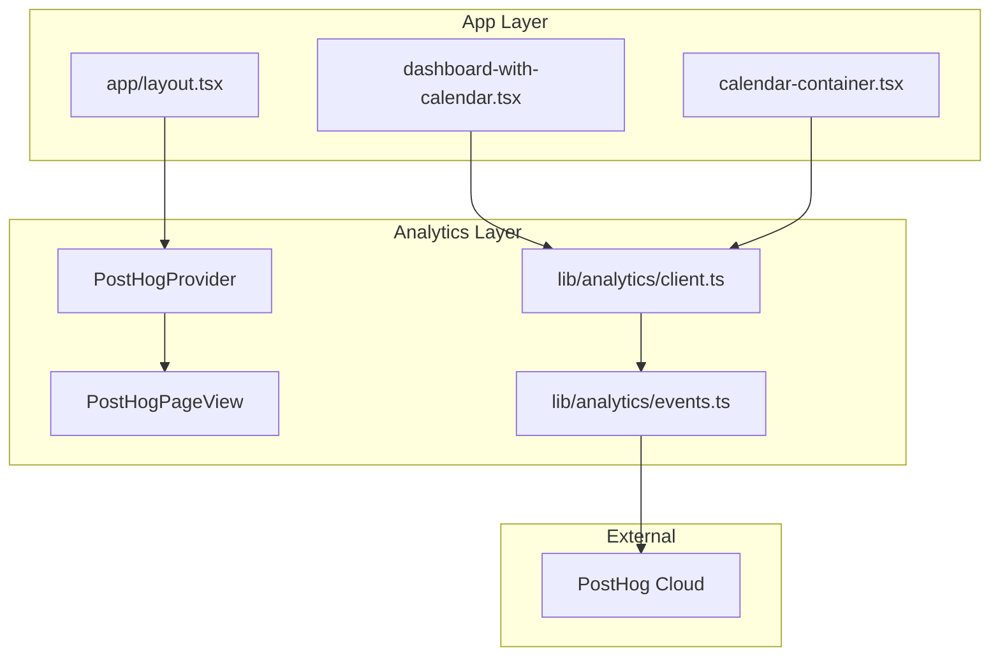
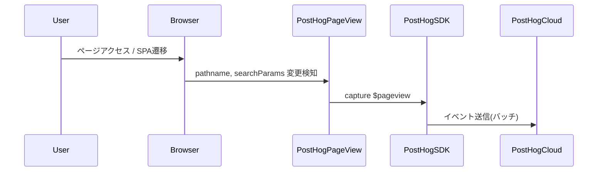
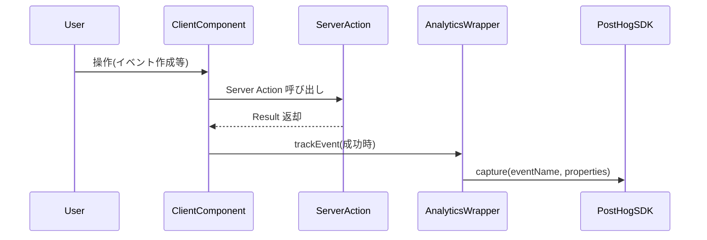

# Design Document: analytics-foundation

## Overview

**Purpose**: Discalendarにアナリティクス基盤を導入し、ユーザー行動データ（ページビュー、イベントCRUD、ギルド切替、カレンダー操作）の収集・分析を可能にする。

**Users**: プロダクトオーナー（データ分析・意思決定）、開発者（計測基盤の運用・検証）が利用する。

**Impact**: 既存の `app/layout.tsx` にPostHogProviderを追加し、各Client Componentのコールバックにトラッキング呼び出しを挿入する。既存の動作には影響を与えない。

### Goals
- PostHog SDKをNext.js App Router環境に統合する
- 全ページのページビューを自動トラッキングする（SSR初期表示 + SPA遷移）
- イベントCRUD、ギルド切替、カレンダー操作をカスタムイベントとしてトラッキングする
- PIIを含まない安全なデータ収集を実現する

### Non-Goals
- サーバーサイドトラッキング（`posthog-node`）の導入
- Feature Flags、A/Bテスト、セッションリプレイの設定
- アドブロッカー回避のためのReverse Proxy設定
- Cookie同意バナーの実装（PostHog CloudはCookieレス設定が可能）
- アナリティクスダッシュボードのカスタムビルド（PostHog Cloudのダッシュボードを使用）

## Architecture

### Existing Architecture Analysis

現在のルートレイアウト（`app/layout.tsx`）は `ThemeProvider` → `TooltipProvider` の2層プロバイダー構成。PostHogProviderはこれに並列で追加する。

イベント操作は `app/dashboard/actions.ts` の Server Actions で処理され、Client Components のコールバック（`handleEventDialogSuccess`, `handleEventDrop` 等）で結果を受け取る。トラッキングはこれらのクライアント側コールバックに挿入する。

ギルド切替は `dashboard-with-calendar.tsx` の `handleGuildSelect` で `setSelectedGuildId` を呼び出す。ここにトラッキングを追加する。

### Architecture Pattern & Boundary Map



**Architecture Integration**:
- **Selected pattern**: Client-side Wrapper パターン。`lib/analytics/` に薄いラッパーモジュールを配置し、PostHog API を抽象化
- **Domain boundaries**: Analytics Layer はアプリケーションロジックに依存せず、一方向の依存（App → Analytics）のみ
- **Existing patterns preserved**: Provider パターン（`app/layout.tsx`）、`lib/` ユーティリティ配置、`"use client"` 分離
- **New components rationale**: PostHogProvider（SDK初期化）、PostHogPageView（SPA遷移検知）、analytics wrapper（型安全なイベント送信）
- **Steering compliance**: `lib/` 配下のユーティリティ配置パターン、Client/Server分離原則に準拠

### Technology Stack

| Layer | Choice / Version | Role in Feature | Notes |
|-------|------------------|-----------------|-------|
| Frontend | `posthog-js` (latest) | クライアントサイドSDK、イベントキャプチャ | `"use client"` コンポーネント内でのみ使用 |
| Infrastructure | PostHog Cloud (US/EU) | データ収集・保存・ダッシュボード | 月100万イベント無料枠 |

詳細なツール比較は `research.md` を参照。

## System Flows

### ページビュー自動トラッキングフロー



### カスタムイベントトラッキングフロー



## Requirements Traceability

| Requirement | Summary | Components | Interfaces | Flows |
|-------------|---------|------------|------------|-------|
| 1.1 | App Router互換のSDK導入 | PostHogProvider | - | - |
| 1.2 | クライアントサイドのみで初期化 | PostHogProvider | - | - |
| 1.3 | 環境変数でキー管理 | PostHogProvider | - | - |
| 1.4 | 開発環境でのデータ送信制御 | PostHogProvider | - | - |
| 1.5 | ルートレイアウトにプロバイダー配置 | PostHogProvider | - | - |
| 2.1 | ページ遷移時のページビュー記録 | PostHogPageView | - | ページビューフロー |
| 2.2 | SPA遷移のページビュー記録 | PostHogPageView | - | ページビューフロー |
| 2.3 | URL・リファラー・タイムスタンプ含む | PostHogPageView | - | - |
| 2.4 | 認証/公開ルートの区別 | PostHogPageView | - | - |
| 3.1 | event_created トラッキング | AnalyticsWrapper, CalendarContainer | trackEvent | カスタムイベントフロー |
| 3.2 | event_updated トラッキング | AnalyticsWrapper, CalendarContainer | trackEvent | カスタムイベントフロー |
| 3.3 | event_deleted トラッキング | AnalyticsWrapper, CalendarContainer | trackEvent | カスタムイベントフロー |
| 3.4 | event_moved (DnD) トラッキング | AnalyticsWrapper, CalendarContainer | trackEvent | カスタムイベントフロー |
| 3.5 | event_resized トラッキング | AnalyticsWrapper, CalendarContainer | trackEvent | カスタムイベントフロー |
| 3.6 | PII除外 | AnalyticsWrapper | AnalyticsEventMap 型定義 | - |
| 4.1 | guild_switched トラッキング | AnalyticsWrapper, DashboardWithCalendar | trackEvent | カスタムイベントフロー |
| 4.2 | ギルドIDのみ含む（ギルド名除外） | AnalyticsWrapper | GuildSwitchedProperties 型 | - |
| 5.1 | ダッシュボードアクセス記録 | PostHogPageView | - | ページビューフロー |
| 5.2 | view_changed トラッキング | AnalyticsWrapper, CalendarContainer | trackEvent | カスタムイベントフロー |
| 5.3 | calendar_navigated トラッキング | AnalyticsWrapper, CalendarContainer | trackEvent | カスタムイベントフロー |
| 6.1 | PII除外 | AnalyticsWrapper | AnalyticsEventMap 型定義 | - |
| 6.2 | プライバシーポリシー整合性 | PostHogProvider | config option | - |
| 6.3 | Cookie同意対応 | PostHogProvider | persistence config | - |
| 6.4 | SDK障害時のグレースフルデグラデーション | PostHogProvider | ErrorBoundary | - |
| 7.1 | ページビュー集計表示 | PostHog Cloud Dashboard | - | - |
| 7.2 | カスタムイベント集計表示 | PostHog Cloud Dashboard | - | - |
| 7.3 | 日/週/月集計フィルタ | PostHog Cloud Dashboard | - | - |

## Components and Interfaces

| Component | Domain/Layer | Intent | Req Coverage | Key Dependencies | Contracts |
|-----------|--------------|--------|--------------|------------------|-----------|
| PostHogProvider | Analytics / Provider | PostHog SDK初期化とReactコンテキスト提供 | 1.1-1.5, 6.2-6.4 | posthog-js (P0) | State |
| PostHogPageView | Analytics / Tracking | SPA遷移のページビュー自動キャプチャ | 2.1-2.4, 5.1 | PostHogProvider (P0), next/navigation (P0) | - |
| AnalyticsWrapper | Analytics / Service | 型安全なカスタムイベント送信API | 3.1-3.6, 4.1-4.2, 5.2-5.3, 6.1 | posthog-js (P0) | Service |

### Analytics Layer

#### PostHogProvider

| Field | Detail |
|-------|--------|
| Intent | PostHog SDKの初期化とReactツリーへの提供 |
| Requirements | 1.1, 1.2, 1.3, 1.4, 1.5, 6.2, 6.3, 6.4 |

**Responsibilities & Constraints**
- `posthog-js` の `init()` をクライアントサイドで実行
- 環境変数 `NEXT_PUBLIC_POSTHOG_KEY`, `NEXT_PUBLIC_POSTHOG_HOST` からキーを取得
- 開発環境ではオプトアウトまたはデバッグモードで動作
- SDK初期化失敗時もアプリケーション動作を妨げない

**Dependencies**
- External: `posthog-js` — SDK初期化・イベント送信 (P0)

**Contracts**: State [x]

##### State Management
- **State model**: PostHogインスタンスはReact Contextを通じてツリー全体に共有。Contextの値は `PostHog | undefined`
- **Persistence**: PostHog内部でlocalStorage/memory（設定に依存）を使用
- **Concurrency**: シングルインスタンス。React Strictモードでの二重初期化を防止

**Implementation Notes**
- `app/layout.tsx` で `ThemeProvider` と並列に配置。`"use client"` コンポーネントとして作成し、dynamic import で遅延読み込み
- PostHog設定で `persistence: 'memory'` を指定するとCookieレスで動作（Cookie同意不要）
- `capture_pageview: false` を設定し、PostHogPageViewコンポーネントに委譲

```typescript
// lib/analytics/posthog-provider.tsx
interface PostHogProviderProps {
  children: React.ReactNode;
}
```

#### PostHogPageView

| Field | Detail |
|-------|--------|
| Intent | Next.js App RouterのSPA遷移を検知してページビューをキャプチャ |
| Requirements | 2.1, 2.2, 2.3, 2.4, 5.1 |

**Responsibilities & Constraints**
- `usePathname()` と `useSearchParams()` の変更を監視
- 変更検知時に `posthog.capture('$pageview')` を呼び出す
- `Suspense` 境界内で使用（Next.js 15+要件）

**Dependencies**
- Inbound: PostHogProvider — PostHogインスタンス取得 (P0)
- External: `next/navigation` — usePathname, useSearchParams (P0)

**Implementation Notes**
- `useSearchParams()` は Next.js 15+ で Suspense 必須のため、PostHogPageView 自体を `Suspense` で wrap
- PostHog SDK がURL、リファラー、タイムスタンプを自動付与するため、プロパティの手動設定は不要
- 認証/公開ルートの区別はPostHog Cloud側のダッシュボードフィルタで対応

```typescript
// lib/analytics/posthog-pageview.tsx（内部実装コンポーネント）
// props なし、PostHogProviderの子として配置
```

#### AnalyticsWrapper

| Field | Detail |
|-------|--------|
| Intent | 型安全なカスタムイベント送信APIを提供 |
| Requirements | 3.1, 3.2, 3.3, 3.4, 3.5, 3.6, 4.1, 4.2, 5.2, 5.3, 6.1 |

**Responsibilities & Constraints**
- カスタムイベント名とプロパティの型を厳密に定義
- PIIを型レベルで排除（イベントタイトル、ギルド名等を含めない）
- PostHog SDKが未初期化の場合は何もしない（グレースフルデグラデーション）

**Dependencies**
- External: `posthog-js` — capture API (P0)

**Contracts**: Service [x]

##### Service Interface

```typescript
// lib/analytics/events.ts

/** カスタムイベント名の型定義 */
type AnalyticsEventName =
  | "event_created"
  | "event_updated"
  | "event_deleted"
  | "event_moved"
  | "event_resized"
  | "guild_switched"
  | "view_changed"
  | "calendar_navigated";

/** イベントごとのプロパティ型マップ */
interface AnalyticsEventMap {
  event_created: {
    is_all_day: boolean;
    color: string;
    has_notifications: boolean;
  };
  event_updated: {
    changed_fields: string[];
  };
  event_deleted: Record<string, never>;
  event_moved: {
    method: "drag_and_drop";
  };
  event_resized: Record<string, never>;
  guild_switched: {
    guild_id: string;
  };
  view_changed: {
    view_type: "day" | "week" | "month";
  };
  calendar_navigated: {
    direction: "prev" | "next" | "today";
  };
}

/** 型安全なイベント送信関数 */
function trackEvent<E extends AnalyticsEventName>(
  eventName: E,
  properties: AnalyticsEventMap[E]
): void;
```

- Preconditions: PostHog SDKが初期化済み（未初期化時はno-op）
- Postconditions: イベントがPostHog Cloudに送信キューに追加される
- Invariants: PIIは型定義に含まれない。`AnalyticsEventMap` に定義されていないプロパティはコンパイルエラー

```typescript
// lib/analytics/client.ts

/** PostHogインスタンス取得ヘルパー */
function getPostHogClient(): PostHog | undefined;

/** 初期化ヘルパー（PostHogProvider内部で使用） */
function initAnalytics(apiKey: string, options: AnalyticsConfig): void;

interface AnalyticsConfig {
  apiHost: string;
  debug: boolean;
  persistence: "localStorage" | "memory";
  capturePageview: boolean;
}
```

**Implementation Notes**
- `getPostHogClient()` は `posthog-js` の `posthog` シングルトンを返す。未初期化時は `undefined`
- `trackEvent()` は `getPostHogClient()?.capture(eventName, properties)` を呼び出すシンプルなラッパー
- 既存のコンポーネント（`CalendarContainer`, `DashboardWithCalendar`）のイベントハンドラー内で `trackEvent()` を呼び出す。追加のフックやProvider注入は不要

## Data Models

本機能はデータベース変更を伴わない。すべてのデータはPostHog Cloudに送信・保存される。

### Data Contracts & Integration

**PostHog Cloud へのイベントスキーマ**:

| Event Name | Properties | PII Check |
|------------|-----------|-----------|
| `$pageview` | url, referrer, timestamp（SDK自動付与） | PII なし |
| `event_created` | is_all_day, color, has_notifications | PII なし |
| `event_updated` | changed_fields | PII なし（フィールド名のみ） |
| `event_deleted` | （なし） | PII なし |
| `event_moved` | method | PII なし |
| `event_resized` | （なし） | PII なし |
| `guild_switched` | guild_id | PII なし（IDのみ） |
| `view_changed` | view_type | PII なし |
| `calendar_navigated` | direction | PII なし |

## Error Handling

### Error Strategy
アナリティクスはアプリケーションのコア機能ではないため、すべてのエラーをサイレントに処理する。

### Error Categories and Responses
- **SDK初期化失敗**: PostHogProviderが `try/catch` で初期化エラーをキャッチし、`console.warn` で記録。アプリケーション動作は継続
- **ネットワークエラー**: PostHog SDKが内部でリトライ・バッチ送信を管理。アプリケーション側の対応は不要
- **環境変数未設定**: SDKを初期化しない（no-op）。開発環境での警告ログのみ

### Monitoring
- PostHog Cloud ダッシュボードでイベント受信状況を監視
- Sentry（既存導入済み `@sentry/nextjs`）でSDK初期化エラーをキャプチャ

## Testing Strategy

### Unit Tests
- `lib/analytics/events.ts`: `trackEvent()` が正しいイベント名とプロパティで `posthog.capture()` を呼ぶことを検証
- `lib/analytics/events.ts`: PostHog未初期化時に `trackEvent()` がエラーを投げないことを検証
- `lib/analytics/client.ts`: `getPostHogClient()` が初期化前に `undefined` を返すことを検証

### Integration Tests
- `PostHogProvider` + `PostHogPageView`: パスが変更されたときに `$pageview` がキャプチャされることを検証
- `CalendarContainer` のイベントハンドラー: CRUD操作成功後に対応するカスタムイベントがキャプチャされることを検証
- `DashboardWithCalendar` のギルド切替: `guild_switched` イベントが正しいプロパティでキャプチャされることを検証

### E2E Tests
- ダッシュボードアクセス → ページビューが送信されること（PostHog SDKのネットワークリクエストを検証）
- イベント作成フロー → `event_created` が送信されること

## Security Considerations
- **PII除外**: `AnalyticsEventMap` の型定義でプロパティを制約。イベントタイトル、ユーザー名、ギルド名は型に含めない
- **環境変数**: `NEXT_PUBLIC_POSTHOG_KEY` はパブリックAPIキー（クライアントサイドで使用される設計のため漏洩リスクは低い）
- **データ保存先**: PostHog Cloud（US または EU リージョン）。データ処理はPostHogのプライバシーポリシーに準拠
- **Cookie同意**: `persistence: 'memory'` 設定でCookieを使用しない構成が可能。GDPR対応としてCookie同意バナーは初期段階では不要

## Performance & Scalability
- **バンドルサイズ**: `posthog-js` は約30KB (gzip)。PostHogProviderを `dynamic import` で遅延読み込みし、初期LCPへの影響を最小化
- **イベント送信**: PostHog SDKがバッチ送信（デフォルト: 1000ms間隔）を管理。個別のネットワークリクエストは発生しない
- **スケーリング**: PostHog Cloud の無料枠（月100万イベント）は初期フェーズで十分。KPI目標（MAU 500 → 15,000）の範囲内
