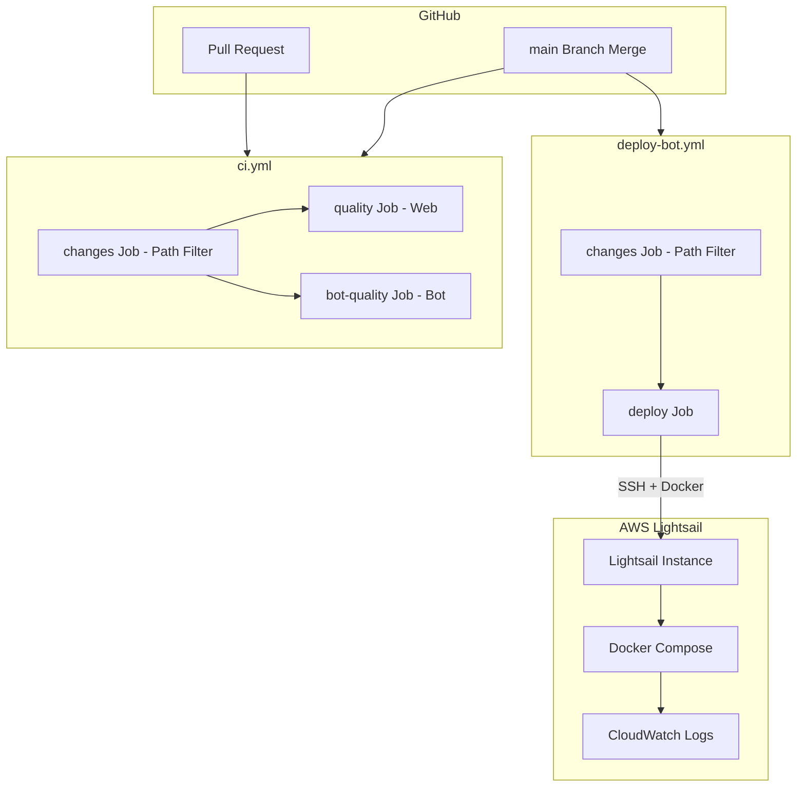
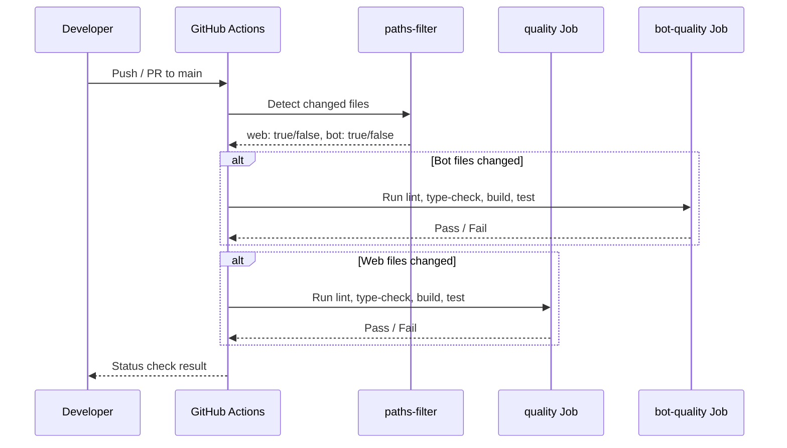
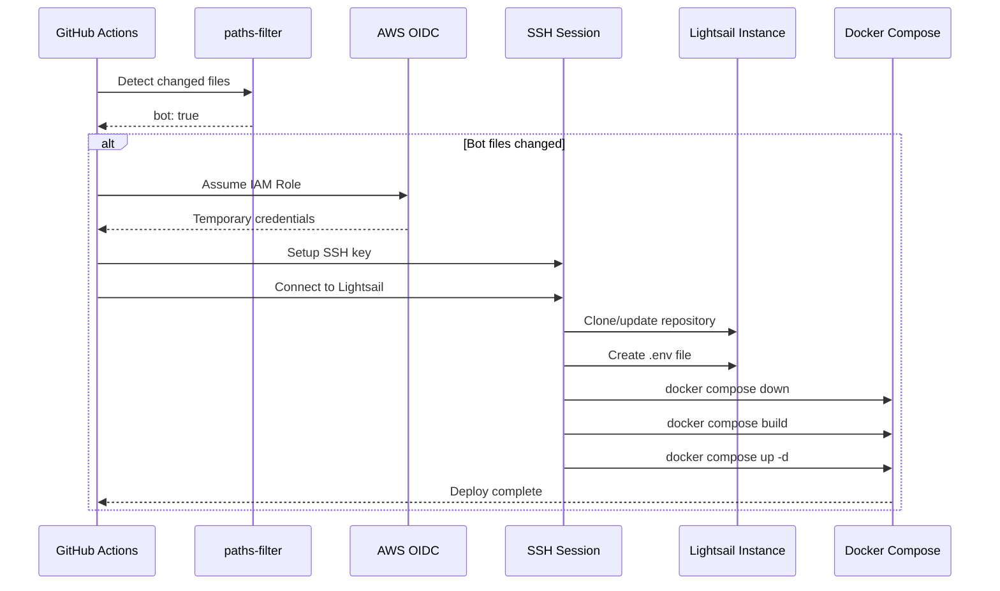

# Technical Design: Bot CI/CD Pipeline

## Overview

**Purpose**: Discord Bot (`packages/bot`) の品質保証を自動化する CI ワークフローの改善と、AWS Lightsail への自動デプロイパイプラインを構築する。

**Users**: 開発者と運用担当者がコード品質の自動検証と、main ブランチへのマージによる自動デプロイを利用する。

**Impact**: 既存の `ci.yml` に path filter を導入してモノレポ対応を改善し、新規の `deploy-bot.yml` ワークフローで手動デプロイを排除する。

### Goals
- Bot コードの変更に対する品質チェック（lint・型チェック・ビルド・テスト）の自動実行
- モノレポにおける変更パッケージに応じた選択的ジョブ実行
- main マージ時の AWS Lightsail への自動デプロイ
- Secrets の安全な管理と OIDC によるセキュアな AWS 認証

### Non-Goals
- Terraform によるインフラプロビジョニング（既存インフラを利用）
- ブルー/グリーンデプロイやカナリアリリース等の高度なデプロイ戦略
- Bot のヘルスチェックエンドポイントやオートスケーリング
- ステージング環境の構築

## Architecture

### Existing Architecture Analysis

現在の CI/CD 構成:
- `ci.yml`: `quality`（Web）と `bot-quality`（Bot）の2ジョブ。path filter 未設定で全 PR/push に対して両ジョブが実行される
- `playwright.yml`: E2E テスト。path filter 未設定
- `deploy-migrations.yml`: Supabase マイグレーション。main push 時に実行
- デプロイワークフロー: 未定義。手動デプロイに依存

参照プロジェクト (`refs/discalendar-next-bot`) の既存パターン:
- GitHub Actions OIDC + AWS Lightsail + Docker Compose のデプロイフロー確立済み
- Terraform でインフラ管理、`scripts/deploy.sh` で SSH 経由デプロイ

### Architecture Pattern & Boundary Map



**Architecture Integration**:
- Selected pattern: 既存 CI ワークフローの拡張 + 新規デプロイワークフロー
- Domain/feature boundaries: CI（品質保証）と CD（デプロイ）を独立したワークフローで分離
- Existing patterns preserved: `bot-quality` ジョブの構造、npm workspaces のインストールパターン
- New components rationale: path filter で不要な CI 実行を削減、デプロイワークフローで手動作業を排除
- Steering compliance: モノレポ構成に従い、packages/bot の変更を独立して検知・処理

### Technology Stack

| Layer | Choice / Version | Role in Feature | Notes |
|-------|------------------|-----------------|-------|
| CI/CD | GitHub Actions | ワークフロー実行基盤 | 既存利用 |
| Path Filter | dorny/paths-filter@v3 | モノレポ変更検知 | 新規追加 |
| AWS Auth | aws-actions/configure-aws-credentials@v4 | OIDC による AWS 認証 | 参照プロジェクトと同一 |
| Container | Docker + Docker Compose | Bot コンテナ管理 | Node.js マルチステージビルド |
| Runtime | node:lts-slim | Bot 実行環境 | Lightsail 上で稼働 |
| Logging | AWS CloudWatch Logs | コンテナログ集約 | awslogs ドライバー |
| Infrastructure | AWS Lightsail | Bot ホスティング | 既存インスタンス利用 |

## System Flows

### CI ワークフロー（PR / push）



path filter の `changes` ジョブが先行実行され、`web` / `bot` フラグを出力する。後続ジョブは `if: needs.changes.outputs.bot == 'true'` 等の条件で実行を制御する。`package-lock.json` やルート設定ファイルの変更時は両方のフラグが `true` になる。

### デプロイワークフロー（main merge）



デプロイは Bot ファイルの変更時のみ実行される。OIDC で一時的な AWS 認証情報を取得し、SSH 経由で Lightsail インスタンスにデプロイする。

## Requirements Traceability

| Requirement | Summary | Components | Interfaces | Flows |
|-------------|---------|------------|------------|-------|
| 1.1 | Bot lint 実行 | BotQualityJob | ci.yml | CI ワークフロー |
| 1.2 | Bot 型チェック実行 | BotQualityJob | ci.yml | CI ワークフロー |
| 1.3 | Bot ビルド実行 | BotQualityJob | ci.yml | CI ワークフロー |
| 1.4 | Bot テスト実行 | BotQualityJob | ci.yml | CI ワークフロー |
| 1.5 | 失敗時ステータスチェック | BotQualityJob | ci.yml | CI ワークフロー |
| 2.1 | Bot のみ変更時は Bot ジョブのみ | PathFilterJob | ci.yml | CI ワークフロー |
| 2.2 | Web のみ変更時は Web ジョブのみ | PathFilterJob | ci.yml | CI ワークフロー |
| 2.3 | 両方変更時は両ジョブ実行 | PathFilterJob | ci.yml | CI ワークフロー |
| 2.4 | 共通ファイル変更時は両ジョブ実行 | PathFilterJob | ci.yml | CI ワークフロー |
| 3.1 | main マージ時の Bot デプロイ | DeployJob | deploy-bot.yml | デプロイワークフロー |
| 3.2 | デプロイ進捗ログ記録 | DeployScript | deploy.sh | デプロイワークフロー |
| 3.3 | デプロイ失敗時のステータス報告 | DeployJob | deploy-bot.yml | デプロイワークフロー |
| 3.4 | Docker コンテナビルド・配信 | Dockerfile, DockerCompose | docker-compose.yml | デプロイワークフロー |
| 3.5 | SSH 経由デプロイ | DeployJob, DeployScript | deploy-bot.yml, deploy.sh | デプロイワークフロー |
| 4.1 | Bot 環境変数の Secrets 管理 | DeployJob | deploy-bot.yml | デプロイワークフロー |
| 4.2 | AWS OIDC 認証 | DeployJob | deploy-bot.yml | デプロイワークフロー |
| 4.3 | SSH 秘密鍵の Secrets 管理 | DeployJob | deploy-bot.yml | デプロイワークフロー |
| 4.4 | Secrets 未設定時のエラー | DeployScript | deploy.sh | デプロイワークフロー |
| 4.5 | 秘密情報のログ出力禁止 | DeployJob, DeployScript | deploy-bot.yml, deploy.sh | デプロイワークフロー |
| 5.1 | Docker Compose によるコンテナ管理 | DockerCompose | docker-compose.yml | デプロイワークフロー |
| 5.2 | CloudWatch Logs へのログ送信 | DockerCompose | docker-compose.yml | デプロイワークフロー |
| 5.3 | Terraform リソース構成との整合性 | DeployJob | deploy-bot.yml | デプロイワークフロー |
| 5.4 | ダウンタイム最小化のコンテナ再起動 | DeployScript | deploy.sh | デプロイワークフロー |

## Components and Interfaces

| Component | Domain/Layer | Intent | Req Coverage | Key Dependencies | Contracts |
|-----------|--------------|--------|--------------|------------------|-----------|
| PathFilterJob | CI | 変更ファイル検知と後続ジョブ制御 | 2.1, 2.2, 2.3, 2.4 | dorny/paths-filter@v3 (P0) | Batch |
| BotQualityJob | CI | Bot の lint・型チェック・ビルド・テスト | 1.1, 1.2, 1.3, 1.4, 1.5 | PathFilterJob (P0), npm (P0) | Batch |
| DeployJob | CD | AWS OIDC 認証・SSH 接続・デプロイ実行 | 3.1, 3.2, 3.3, 3.5, 4.1, 4.2, 4.3, 4.5, 5.3 | aws-actions/configure-aws-credentials@v4 (P0), DeployScript (P0) | Batch |
| DeployScript | CD | SSH 経由のアプリケーションデプロイ | 3.2, 3.4, 3.5, 4.4, 4.5, 5.4 | Docker Compose (P0), SSH (P0) | Batch |
| Dockerfile | Container | Node.js Bot のマルチステージビルド | 3.4 | node:lts-slim (P0), npm workspaces (P0) | -- |
| DockerCompose | Container | Bot コンテナと CloudWatch Logs の構成 | 5.1, 5.2 | Docker (P0), awslogs driver (P1) | Batch |

### CI Layer

#### PathFilterJob

| Field | Detail |
|-------|--------|
| Intent | モノレポの変更ファイルを検知し、Web/Bot の変更フラグを出力する |
| Requirements | 2.1, 2.2, 2.3, 2.4 |

**Responsibilities & Constraints**
- `dorny/paths-filter@v3` を使用してファイル変更を検知
- `web` と `bot` の2つの出力フラグを提供
- 全ての後続ジョブはこのジョブに依存する

**Dependencies**
- External: dorny/paths-filter@v3 -- 変更検知 (P0)

**Contracts**: Batch [x]

##### Batch / Job Contract
- **Trigger**: `push` (main) または `pull_request` (main) イベント
- **Input / validation**: GitHub イベントコンテキスト（コミットSHA、PR情報）
- **Output / destination**: `outputs.web` (string: 'true'/'false'), `outputs.bot` (string: 'true'/'false')
- **Idempotency & recovery**: 同一コミットに対して常に同じ結果を返す

**Filter 定義**:

```yaml
filters:
  web:
    - '!(packages/bot/**)' # packages/bot 以外の全変更
    - 'package-lock.json'
    - 'tsconfig.json'
  bot:
    - 'packages/bot/**'
    - 'package-lock.json'
    - 'tsconfig.json'
```

`package-lock.json` や `tsconfig.json` 等のルート設定ファイルは Web と Bot の両方に影響するため、両フラグを `true` にする。

**Implementation Notes**
- Integration: `ci.yml` の最初のジョブとして定義。`quality` と `bot-quality` は `needs: [changes]` で依存
- Validation: `paths-filter` が `push` イベントでは直前コミットとの差分、`pull_request` イベントではベースブランチとの差分を使用することを確認
- Risks: `dorny/paths-filter` のメジャーバージョンアップ時に breaking change の可能性

#### BotQualityJob

| Field | Detail |
|-------|--------|
| Intent | Bot パッケージの品質チェック（lint・型チェック・ビルド・テスト）を実行する |
| Requirements | 1.1, 1.2, 1.3, 1.4, 1.5 |

**Responsibilities & Constraints**
- `packages/bot` をワーキングディレクトリとして品質チェックを実行
- PathFilterJob の `bot` 出力が `true` の場合のみ実行
- いずれかのステップ失敗時に PR ステータスチェックを `failure` として報告

**Dependencies**
- Inbound: PathFilterJob -- 実行条件の判定 (P0)
- External: actions/checkout@v4, actions/setup-node@v4 -- 環境構築 (P0)

**Contracts**: Batch [x]

##### Batch / Job Contract
- **Trigger**: PathFilterJob 完了後、`outputs.bot == 'true'` の場合
- **Input / validation**: チェックアウト済みリポジトリ、Node.js LTS 環境
- **Output / destination**: GitHub ステータスチェック（success/failure）
- **Idempotency & recovery**: 同一コミットに対して決定論的な結果

**実行ステップ**:
1. `npm ci` (working-directory: `.`) -- ルートで依存インストール
2. `npm run lint` (working-directory: `packages/bot`) -- Biome lint
3. `npm run type-check` (working-directory: `packages/bot`) -- TypeScript 型チェック
4. `npm run build` (working-directory: `packages/bot`) -- ビルド（rrule-utils 先行ビルド含む）
5. `npm run test` (working-directory: `packages/bot`) -- Vitest テスト

**Implementation Notes**
- Integration: 既存の `bot-quality` ジョブを修正。`if: needs.changes.outputs.bot == 'true'` 条件を追加
- Validation: 各ステップは失敗時にジョブ全体を fail させる（デフォルト動作）
- Risks: `npm run build` が `@discalendar/rrule-utils` のビルドに依存 -- rrule-utils 側の変更のみの場合も Bot ジョブを実行する必要がある（package-lock.json 変更で対応）

### CD Layer

#### DeployJob

| Field | Detail |
|-------|--------|
| Intent | AWS OIDC 認証を取得し、SSH 経由で Lightsail にデプロイする |
| Requirements | 3.1, 3.2, 3.3, 3.5, 4.1, 4.2, 4.3, 4.5, 5.3 |

**Responsibilities & Constraints**
- `main` ブランチへの push 時のみトリガー
- Bot ファイルの変更時のみデプロイ実行
- OIDC で一時的な AWS 認証情報を取得（長期的なアクセスキー不使用）
- GitHub Secrets から SSH 鍵と Bot 環境変数を取得
- 秘密情報をログに出力しない

**Dependencies**
- Inbound: PathFilterJob (deploy-bot.yml 内) -- デプロイ条件判定 (P0)
- External: aws-actions/configure-aws-credentials@v4 -- AWS OIDC (P0)
- External: DeployScript -- デプロイ実行 (P0)

**Contracts**: Batch [x]

##### Batch / Job Contract
- **Trigger**: `push` to `main` かつ Bot ファイル変更あり、または `workflow_dispatch`（手動トリガー）
- **Input / validation**:
  - GitHub Secrets: `AWS_ROLE_ARN`, `LIGHTSAIL_HOST`, `LIGHTSAIL_SSH_PRIVATE_KEY`, `BOT_TOKEN`, `APPLICATION_ID`, `SUPABASE_URL`, `SUPABASE_SERVICE_KEY`, `CLOUDWATCH_ACCESS_KEY_ID`, `CLOUDWATCH_SECRET_ACCESS_KEY`, `CLOUDWATCH_LOG_GROUP`
- **Output / destination**: GitHub Actions ステータス（success/failure）
- **Idempotency & recovery**: 同一コミットの再デプロイは安全（コンテナの再ビルド・再起動）

**ワークフロー定義の概要**:

```yaml
name: Deploy Bot
on:
  push:
    branches: [main]
  workflow_dispatch:

permissions:
  id-token: write
  contents: read

concurrency:
  group: deploy-bot
  cancel-in-progress: false
```

**実行ステップ**:
1. Checkout repository
2. Path filter（Bot ファイル変更検知）
3. Configure AWS credentials（OIDC）
4. Setup SSH key（Secrets から鍵を取得）
5. Test SSH connection
6. Deploy Application（deploy.sh 実行）

**Implementation Notes**
- Integration: `deploy-bot.yml` として新規作成。`concurrency` で同時デプロイを防止
- Validation: SSH 接続テストをデプロイ前に実行。失敗時は明確なエラーメッセージを出力
- Risks: Lightsail インスタンスのネットワーク障害時にデプロイ失敗 -- `workflow_dispatch` で手動再実行可能

#### DeployScript

| Field | Detail |
|-------|--------|
| Intent | SSH 経由で Lightsail インスタンスにアプリケーションをデプロイする |
| Requirements | 3.2, 3.4, 3.5, 4.4, 4.5, 5.4 |

**Responsibilities & Constraints**
- SSH 接続でリモートコマンドを実行
- リポジトリのクローン/更新、`.env` ファイル作成、Docker Compose によるコンテナ管理
- 既存コンテナの停止後に新コンテナを起動（ダウンタイム最小化）
- 各ステップの進捗を echo でログ出力
- 必須環境変数の存在確認

**Dependencies**
- Inbound: DeployJob -- 環境変数と SSH 接続情報 (P0)
- External: Docker Compose -- コンテナ管理 (P0)
- External: Git -- リポジトリ更新 (P0)

**Contracts**: Batch [x]

##### Batch / Job Contract
- **Trigger**: DeployJob から呼び出し（`./scripts/deploy.sh <host>` 形式）
- **Input / validation**:
  - 位置引数: `$1` = Lightsail ホスト IP/DNS
  - 環境変数: `BOT_TOKEN`, `APPLICATION_ID`, `SUPABASE_URL`, `SUPABASE_SERVICE_KEY`（必須）。未設定時はエラー終了
  - 環境変数: `LOG_LEVEL`, `SENTRY_DSN`, `INVITATION_URL`（オプション、デフォルト値あり）
  - 環境変数: `AWS_ACCESS_KEY_ID`, `AWS_SECRET_ACCESS_KEY`, `AWS_REGION`, `AWS_CLOUDWATCH_LOG_GROUP`（CloudWatch 用）
- **Output / destination**: stdout に進捗ログ、終了コード 0（成功）/ 1（失敗）
- **Idempotency & recovery**: 再実行安全。既存コンテナを停止してから新コンテナを起動

**デプロイ手順**:
1. 引数と必須環境変数の検証
2. SSH 接続でリモートコマンド実行:
   a. リポジトリクローン / `git fetch && git reset --hard origin/main`
   b. AWS 認証情報の設定（CloudWatch Logs 用）
   c. `.env` ファイル生成
   d. `docker compose down` (既存コンテナ停止)
   e. `docker compose build --no-cache` (イメージビルド)
   f. `docker compose up -d` (新コンテナ起動)
   g. コンテナステータス確認 (`docker compose ps`)
   h. 直近ログ表示 (`docker compose logs --tail=20`)

**Implementation Notes**
- Integration: `scripts/deploy.sh` として新規作成。参照プロジェクトの `deploy.sh` を Node.js モノレポ向けに適応
- Validation: `set -e` でエラー時即時終了。必須環境変数の存在チェックをスクリプト冒頭で実行
- Risks: SSH セッションタイムアウト -- Docker ビルドに時間がかかる場合は `ServerAliveInterval` を設定

### Container Layer

#### Dockerfile

| Field | Detail |
|-------|--------|
| Intent | Node.js Bot のマルチステージビルドイメージを定義する |
| Requirements | 3.4 |

**Responsibilities & Constraints**
- マルチステージビルドでイメージサイズを最小化
- npm workspaces のモノレポ構造に対応
- non-root ユーザーでアプリケーションを実行
- `@discalendar/rrule-utils` を先行ビルド

**マルチステージ構成**:

Stage 1 - Builder:
- ベースイメージ: `node:lts-slim`
- ルートの `package.json`, `package-lock.json` をコピー
- `packages/bot/package.json`, `packages/rrule-utils/package.json` をコピー
- `npm ci --ignore-scripts` で依存インストール
- ソースコードをコピー
- `npm run build -w @discalendar/rrule-utils` で rrule-utils ビルド
- `npm run build -w @discalendar/bot` で Bot ビルド（`tsc` のみ）

Stage 2 - Runtime:
- ベースイメージ: `node:lts-slim`
- non-root ユーザー作成
- ルートの `package.json`, `package-lock.json` をコピー
- `packages/bot/package.json`, `packages/rrule-utils/package.json` をコピー
- `npm ci --omit=dev --ignore-scripts` で本番依存のみインストール
- Builder から `packages/bot/dist/` と `packages/rrule-utils/dist/` をコピー
- `CMD ["node", "packages/bot/dist/index.js"]`

**Implementation Notes**
- Integration: リポジトリルートに `Dockerfile` を配置（モノレポ全体のコンテキストが必要なため）
- Validation: `.dockerignore` でビルドコンテキストを最小化（`node_modules`, `.git`, `.next` 等を除外）
- Risks: rrule-utils の依存構造変更時に Dockerfile の更新が必要

#### DockerCompose

| Field | Detail |
|-------|--------|
| Intent | Bot コンテナの実行構成と CloudWatch Logs への転送を定義する |
| Requirements | 5.1, 5.2 |

**Responsibilities & Constraints**
- Bot コンテナの起動・停止・再起動管理
- `awslogs` ドライバーで CloudWatch Logs にログ転送
- `.env` ファイルから環境変数を読み込み
- `restart: unless-stopped` で自動再起動

**構成定義**:

```yaml
services:
  bot:
    build: .
    container_name: discalendar-bot
    restart: unless-stopped
    env_file:
      - .env
    environment:
      - LOG_LEVEL=${LOG_LEVEL:-INFO}
    logging:
      driver: awslogs
      options:
        awslogs-region: ${AWS_REGION:-ap-northeast-1}
        awslogs-group: ${AWS_CLOUDWATCH_LOG_GROUP}
        awslogs-stream: discalendar-bot
        awslogs-create-group: "false"
```

**Implementation Notes**
- Integration: リポジトリルートに `docker-compose.yml` を配置
- Validation: CloudWatch Logs のロググループは Terraform で事前作成済み（`awslogs-create-group: "false"`）
- Risks: AWS 認証情報が Docker デーモン（root）の `~/.aws/credentials` に必要 -- deploy.sh で設定

## Error Handling

### Error Strategy

CI/CD パイプラインは「Fail Fast」戦略を採用する。各ステップの失敗は即座にジョブ全体の失敗として報告される。

### Error Categories and Responses

**CI エラー**:
- Lint 失敗 -> PR ステータスチェック failure。開発者が修正してリプッシュ
- 型チェック失敗 -> PR ステータスチェック failure。TypeScript エラーの修正が必要
- ビルド失敗 -> PR ステータスチェック failure。コンパイルエラーの修正が必要
- テスト失敗 -> PR ステータスチェック failure。テスト修正またはコード修正が必要

**デプロイエラー**:
- OIDC 認証失敗 -> IAM ロール設定またはリポジトリ設定の確認が必要
- SSH 接続失敗 -> Lightsail インスタンスの稼働状態と SSH 鍵の確認が必要
- Docker ビルド失敗 -> Dockerfile の修正が必要。`workflow_dispatch` で再実行可能
- 環境変数未設定 -> deploy.sh が明確なエラーメッセージを出力して終了

**Secrets エラー**:
- Secrets 未設定 -> ワークフローステップ内で空文字チェック。エラーメッセージで不足している Secret 名を明示

### Monitoring

- CI: GitHub Actions のステータスチェックが PR に自動表示
- CD: GitHub Actions のデプロイログで進捗確認
- Runtime: CloudWatch Logs でコンテナログを確認（ロググループ: `/aws/lightsail/discalendar-bot`、保持期間: 7日）

## Testing Strategy

### CI ワークフローテスト
- path filter の動作確認: Bot のみ変更の PR で `bot-quality` のみ実行されることを検証
- Web のみ変更の PR で `quality` のみ実行されることを検証
- ルート設定ファイル変更時に両ジョブが実行されることを検証
- 全ステップ失敗時の PR ステータスチェック failure を検証

### デプロイワークフローテスト
- `workflow_dispatch` による手動デプロイの成功を検証
- Bot ファイル未変更時にデプロイがスキップされることを検証
- SSH 接続テストの成功/失敗ハンドリングを検証

### Docker ビルドテスト
- Dockerfile のローカルビルド成功を検証 (`docker compose build`)
- コンテナ起動と Bot プロセスの正常起動を検証 (`docker compose up -d && docker compose ps`)
- 環境変数の正常読み込みを検証

### デプロイスクリプトテスト
- 必須引数未指定時のエラー終了を検証
- 必須環境変数未設定時のエラーメッセージ出力を検証

## Security Considerations

### Secrets 管理

GitHub Actions Secrets に保管する情報:

| Secret Name | Purpose | Category |
|-------------|---------|----------|
| `AWS_ROLE_ARN` | OIDC IAM ロール ARN | AWS Auth |
| `LIGHTSAIL_HOST` | Lightsail インスタンスの IP/ホスト名 | Infra |
| `LIGHTSAIL_SSH_PRIVATE_KEY` | SSH 秘密鍵 | Infra |
| `BOT_TOKEN` | Discord Bot トークン | Bot |
| `APPLICATION_ID` | Discord Application ID | Bot |
| `SUPABASE_URL` | Supabase プロジェクト URL | Database |
| `SUPABASE_SERVICE_KEY` | Supabase Service Role Key | Database |
| `CLOUDWATCH_ACCESS_KEY_ID` | CloudWatch IAM アクセスキー | Logging |
| `CLOUDWATCH_SECRET_ACCESS_KEY` | CloudWatch IAM シークレットキー | Logging |
| `CLOUDWATCH_LOG_GROUP` | CloudWatch ロググループ名 | Logging |

### セキュリティ対策
- **OIDC 認証**: 長期的な AWS アクセスキーを GitHub に保存せず、一時的な認証情報を使用
- **SSH 鍵保護**: ワークフロー内で `chmod 600` を適用。ジョブ終了後に自動削除
- **ログマスキング**: GitHub Actions は Secrets の値を自動的にマスク。deploy.sh 内でも秘密情報の echo を避ける
- **最小権限**: OIDC IAM ロールの trust policy で対象リポジトリを限定。CloudWatch IAM ユーザーはログ書き込み権限のみ
- **concurrency 制御**: デプロイの同時実行を `concurrency` で防止し、競合状態を回避
