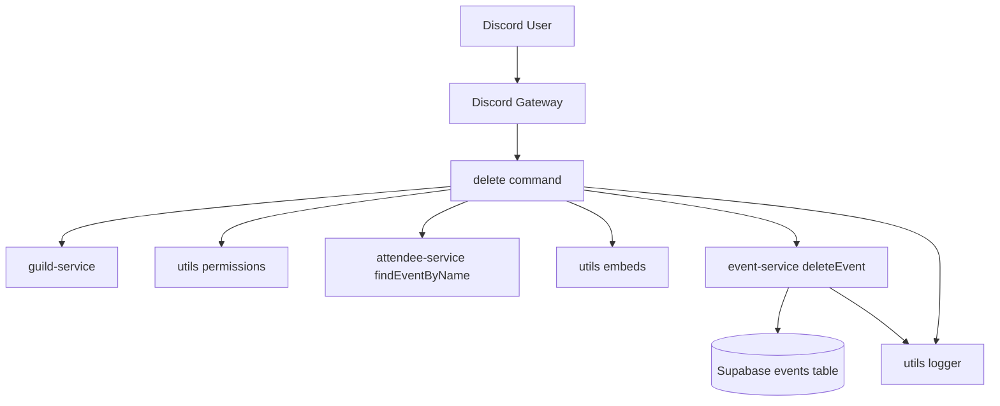
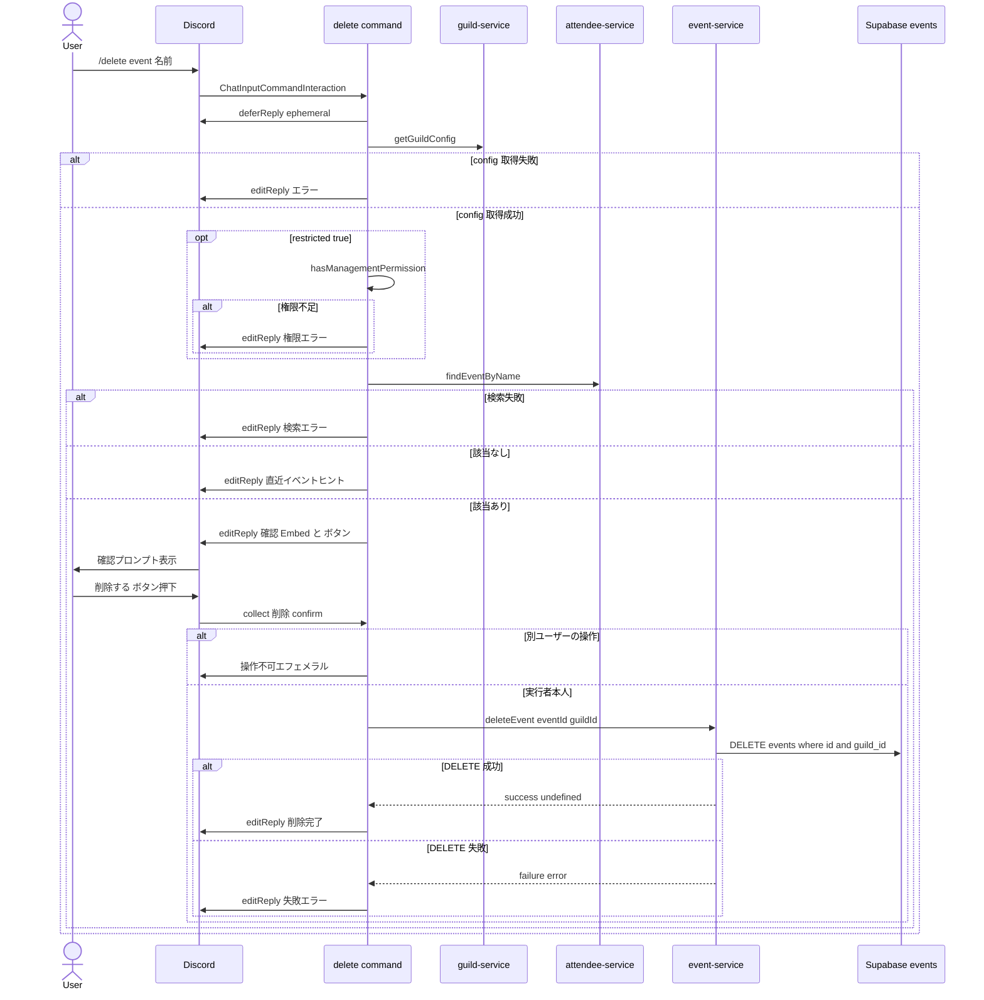

# Design Document — bot-event-delete-command

## Overview

**Purpose**: Discord Bot の `/delete` スラッシュコマンドおよび Bot サービス層の `deleteEvent` 関数を追加し、Web 側 `deleteEventAction` と等価なイベント削除機能を Discord 上から提供する。

**Users**: Discord サーバーの管理者および一般メンバー（restricted モード時は管理権限保有者のみ）が、不要になったイベントを Discord クライアントから直接削除する。

**Impact**: 既存の `/edit` コマンドおよび `event-service.ts` を拡張する形で機能追加する。Bot のコマンド一覧に新コマンドが 1 件追加され、サービス層に新規エクスポート関数 `deleteEvent` が追加される。データベーススキーマや Web 側の挙動には影響を与えない。

### Goals
- Discord ユーザーが Bot から既存イベントを安全に削除できること（Requirement 1, 2, 6）
- 削除前に必ずボタン式の確認プロンプトを表示し、誤操作を防ぐこと（Requirement 3）
- restricted モードのギルドでは権限を持つユーザーのみが削除できること（Requirement 4）
- Bot サービス層 `event-service.ts` が Web 側と等価な削除関数を保有し、`guild_id` スコープで安全に DELETE できること（Requirement 5）
- 削除成功・失敗の結果を明確にユーザーに伝え、運用ログにも記録すること（Requirement 6, 7）

### Non-Goals
- イベント名以外（イベント ID 直接指定など）の削除コマンドオプションは追加しない（部分一致検索で十分）
- 繰り返しイベントシリーズ（`event_series`）の削除は本イシューのスコープ外
- 共通 helper（`buildEventNotFoundMessage`, restricted 判定）の `edit.ts` との共有抽出は行わない（後続イシューで対応）
- 削除のソフトデリート / 取り消し機能は追加しない（Web 側と同じく物理削除）

## Architecture

### Existing Architecture Analysis

Discord Bot (`packages/bot`) は discord.js v14 + Supabase をベースにした薄いコマンドハンドラ構造を持ち、以下のレイヤーで構成される。

- **コマンド層** (`src/commands/*.ts`) — 各スラッシュコマンドは `Command` インターフェース (`{ data, execute }`) を export し、`commands/index.ts` 等から登録される。
- **サービス層** (`src/services/event-service.ts`, `attendee-service.ts`, `guild-service.ts`) — Supabase との通信を担当し、`ServiceResult<T>` 型で結果を返す。
- **ユーティリティ** (`src/utils/permissions.ts`, `embeds.ts`) — 権限判定や Embed 構築を担当する横断的なヘルパ。

既存の `/edit` コマンドが「権限チェック → イベント検索 → 操作実行 → 結果応答」のパターンを完成させており、`/delete` はこのテンプレートをそのまま踏襲する。確認 UI のボタンは `/list` コマンドで使われている `createMessageComponentCollector` のパターンを再利用する。

### Architecture Pattern & Boundary Map



**Architecture Integration**:
- **Selected pattern**: Bot 既存の Command ↔ Service レイヤード構造を踏襲。新規コマンド `delete.ts` と既存サービス `event-service.ts` の関数追加で完結する。
- **Domain/feature boundaries**: コマンド層は Discord インタラクション制御に専念し、データ操作はサービス層に委譲。確認 UI のステートは collector 内のクロージャに閉じ込め、グローバル状態は持たない。
- **Existing patterns preserved**:
  - Result 型 (`ServiceResult<T>`) によるサービス層エラーハンドリング
  - `getGuildConfig` + `hasManagementPermission` による restricted モード判定
  - `findEventByName` による部分一致検索
  - `createMessageComponentCollector` による Discord ボタンインタラクション処理
- **New components rationale**: `delete.ts` は新規スラッシュコマンドハンドラとして必須。`deleteEvent` 関数はサービス層に新規追加（既存関数と同様の実装テンプレート）。
- **Steering compliance**: `tech.md` の Bot 規約（TypeScript strict, Result 型, 構造化ログ）と `structure.md` の `src/commands/` / `src/services/` 配置パターンに従う。

### Technology Stack

| Layer | Choice / Version | Role in Feature | Notes |
|-------|------------------|-----------------|-------|
| Bot Runtime | Node.js (ES2022) | スラッシュコマンド実行 | 既存と共通 |
| Bot Library | discord.js v14 | スラッシュコマンド・ボタン UI・collector | 既存。新規依存追加なし |
| サービス層 | TypeScript (strict) + @supabase/supabase-js | events テーブルの DELETE | 既存と共通 |
| ロギング | pino (`utils/logger.ts`) | info / error 構造化ログ | 既存と共通 |
| テスト | Vitest | コマンド層 / サービス層の単体テスト | 既存と共通 |

新規依存追加は **なし**。既存スタックの範囲内で完結する。詳細は `research.md` の Research Log を参照。

## System Flows

### `/delete` コマンドのインタラクションシーケンス



**Key Decisions**:
- `deferReply({ ephemeral: true })` を最初に呼ぶことで Discord 3 秒応答制限を回避し、以降の応答もエフェメラルに統一する。
- 確認 collector は `max: 1` 相当（最初の `collect` で即 `collector.stop("done")`）として 1 回だけボタン操作を受け付ける。
- タイムアウト経由の `end` イベントでは常に `editReply({ embeds: [...timeoutEmbed], components: [] })` で UI を非活性化する。

## Requirements Traceability

| Requirement | Summary | Components | Interfaces | Flows |
|-------------|---------|------------|------------|-------|
| 1.1, 1.2, 1.5 | `/delete` スラッシュコマンドの登録と必須 `event` オプション | DeleteCommand | `Command.data` (SlashCommandBuilder) | — |
| 1.3 | DM 等ギルド外実行のブロック | DeleteCommand | `Command.execute` 早期 return | — |
| 1.4 | `deferReply` で 3 秒制限回避 | DeleteCommand | — | シーケンス図 deferReply |
| 2.1 | 部分一致検索で削除候補特定 | DeleteCommand | `attendee-service.findEventByName` | — |
| 2.2 | 該当なしヒント表示 | DeleteCommand | `event-service.getEventsByGuildId(guildId, "future")` | — |
| 2.3 | 検索エラー時のログとユーザーメッセージ分離 | DeleteCommand, Logger | — | — |
| 2.4 | 単一イベントを確認プロンプトに渡す | DeleteCommand | — | — |
| 3.1, 3.2, 3.3 | 確認 Embed と Danger/Secondary ボタン、ephemeral | DeleteCommand | `createEventEmbed`, `ActionRowBuilder<ButtonBuilder>` | — |
| 3.4 | 操作可能ユーザーを実行者に制限 | DeleteCommand (collector filter) | — | — |
| 3.5 | 60 秒タイムアウトで自動キャンセル | DeleteCommand (collector time) | — | — |
| 3.6 | キャンセルボタンで中断 | DeleteCommand | — | — |
| 4.1 | restricted フラグ取得 | DeleteCommand | `guild-service.getGuildConfig` | — |
| 4.2 | guild config 取得失敗時のフェイルセーフ | DeleteCommand, Logger | — | — |
| 4.3, 4.4 | restricted 時の権限チェックと拒否メッセージ | DeleteCommand | `utils/permissions.hasManagementPermission` | — |
| 4.5 | 通常モードでは権限チェックスキップ | DeleteCommand | — | — |
| 5.1, 5.2 | 新規 `deleteEvent(eventId, guildId)` 関数 | EventService | `event-service.deleteEvent` | — |
| 5.3, 5.4 | Supabase エラー分類とロギング | EventService, Logger | `classifySupabaseError` | — |
| 5.5 | 成功時 `{ success: true, data: undefined }` | EventService | — | — |
| 5.6 | 既存 Result 型パターン踏襲 | EventService | `ServiceResult<void>` | — |
| 6.1 | 確認後にサービス層を呼び出す | DeleteCommand | `event-service.deleteEvent` | シーケンス図 |
| 6.2 | 削除成功時のメッセージ更新 | DeleteCommand | — | — |
| 6.3 | 失敗時のロギングとエラー埋め込み | DeleteCommand, Logger | — | — |
| 6.4 | 結果応答のエフェメラル維持 | DeleteCommand | — | — |
| 7.1 | 削除成功時の `info` ログ（guildId, userId, eventId, eventName） | DeleteCommand, Logger | — | — |
| 7.2 | 想定外例外時の `error` ログとフォールバック応答 | DeleteCommand, Logger | — | — |
| 7.3 | 既存 logger 共有 | DeleteCommand, EventService | `utils/logger.logger` | — |

## Components and Interfaces

### Summary

| Component | Domain/Layer | Intent | Req Coverage | Key Dependencies (P0/P1) | Contracts |
|-----------|--------------|--------|--------------|--------------------------|-----------|
| DeleteCommand (`packages/bot/src/commands/delete.ts`) | Bot Command Layer | `/delete` スラッシュコマンドのインタラクション制御と確認 UI | 1.1–1.5, 2.1–2.4, 3.1–3.6, 4.1–4.5, 6.1–6.4, 7.1–7.3 | `event-service.deleteEvent` (P0), `event-service.getEventsByGuildId` (P0), `attendee-service.findEventByName` (P0), `guild-service.getGuildConfig` (P0), `utils/permissions.hasManagementPermission` (P0), `utils/embeds.createEventEmbed/createErrorEmbed` (P1) | Service |
| EventService.deleteEvent (`packages/bot/src/services/event-service.ts`) | Bot Service Layer | events テーブルの単発イベント物理削除 (guild_id スコープ) | 5.1–5.6, 7.3 | `getSupabaseClient` (P0), `classifySupabaseError` (P0), `utils/logger` (P1) | Service |

### Bot Command Layer

#### DeleteCommand

| Field | Detail |
|-------|--------|
| Intent | `/delete` スラッシュコマンドの定義と実行ロジック (権限確認 → 検索 → 確認 UI → 削除実行 → 結果応答) |
| Requirements | 1.1, 1.2, 1.3, 1.4, 1.5, 2.1, 2.2, 2.3, 2.4, 3.1, 3.2, 3.3, 3.4, 3.5, 3.6, 4.1, 4.2, 4.3, 4.4, 4.5, 6.1, 6.2, 6.3, 6.4, 7.1, 7.2, 7.3 |

**Responsibilities & Constraints**
- Discord インタラクションのライフサイクル制御（defer → 検索 → 確認 → 実行 → 応答）
- ギルド外実行の早期ブロック
- restricted モード時の権限チェック
- 確認ボタンの操作者制限・タイムアウト処理
- データベース変更はサービス層に委譲し、コマンド層では Supabase クライアントを直接触らない

**Dependencies**
- Inbound: Discord Gateway → discord.js Client (External, P0) — スラッシュコマンドのディスパッチ
- Outbound: `services/event-service.deleteEvent` (P0) — イベント削除実行
- Outbound: `services/event-service.getEventsByGuildId` (P0) — 該当なし時の直近イベントヒント
- Outbound: `services/attendee-service.findEventByName` (P0) — 部分一致検索
- Outbound: `services/guild-service.getGuildConfig` (P0) — restricted フラグ取得
- Outbound: `utils/permissions.hasManagementPermission` (P0) — 権限チェック
- Outbound: `utils/embeds.createEventEmbed`, `createErrorEmbed` (P1) — 表示用 Embed 構築
- Outbound: `utils/logger.logger` (P1) — info / error ログ
- External: discord.js v14 (P0) — ButtonBuilder / ActionRowBuilder / ComponentType / SlashCommandBuilder / ChatInputCommandInteraction

外部依存（discord.js v14）の確認・利用パターン詳細は `research.md` の「Discord.js 確認ボタン UI パターン」を参照。

**Contracts**: Service [x] / API [ ] / Event [ ] / Batch [ ] / State [ ]

##### Service Interface

```typescript
// packages/bot/src/commands/delete.ts (export default)
import type { Command } from "../types/command.js";

declare const data: import("discord.js").SlashCommandOptionsOnlyBuilder;

declare function execute(
  interaction: import("discord.js").ChatInputCommandInteraction
): Promise<void>;

declare const _default: Command;
export default _default;
```

- **Preconditions**:
  - `interaction.guild` が存在する（DM 実行は早期 reject）。
  - `interaction.options.getString("event", true)` が空文字でない。
- **Postconditions**:
  - 削除成功時: `events` テーブルから対象行が削除され、Discord 上で「予定を削除しました: <イベント名>」とエフェメラル表示される。
  - 削除失敗 / キャンセル / タイムアウト時: `events` テーブルは変更されず、Discord 上で適切なメッセージが表示される。
- **Invariants**:
  - 1 回の `/delete` 実行で `deleteEvent` は最大 1 回しか呼ばれない。
  - すべての応答が ephemeral である（実行者にのみ表示）。

##### State Management（確認 UI 内部のローカルステート）

- **State model**: collector の closure 内に削除候補 `EventRecord` を保持。`collect` イベントで `collector.stop("done")` を呼び 1 回限りの操作を受け付ける。
- **Persistence & consistency**: 永続化なし。インタラクションのライフサイクル（最大 60 秒）に閉じる。
- **Concurrency strategy**: 1 つの `/delete` 実行 = 1 つの collector。並行実行されても互いに干渉しない（各 interaction が独立した closure を持つため）。

**Implementation Notes**
- **Integration**: `/edit` コマンドの `handleInlinePath` を参考に「`deferReply` → guild config → restricted → findEventByName → 該当なし時 hint → 確認 UI」の順序で実装する。確認 UI 部分は `/list` コマンドの collector を参照する。
- **Validation**: `event` オプションは `setRequired(true).setMaxLength(100)` で SlashCommandBuilder 側で制約し、空文字や極端な長文を Discord 側でブロックする。
- **Risks**:
  - インタラクション応答制限（3 秒）— `deferReply` 即時呼び出しで回避。
  - 多重押下 — `collector.stop("done")` で 1 回のみに制限。
  - タイムアウト時のメッセージ更新失敗（メッセージ削除済みなど）— try/catch でログだけ残す（`/list` コマンド `collector.on("end")` パターンを踏襲）。

### Bot Service Layer

#### EventService.deleteEvent

| Field | Detail |
|-------|--------|
| Intent | events テーブルから単発イベントを `guild_id` スコープで物理削除する |
| Requirements | 5.1, 5.2, 5.3, 5.4, 5.5, 5.6, 7.3 |

**Responsibilities & Constraints**
- 単一の `events` 行を `id` + `guild_id` の複合条件で DELETE する
- Supabase エラーを `classifySupabaseError(error, "delete")` で `ServiceError` に変換する
- 既存関数 (`getEventById`, `updateEvent` 等) と同じ Result 型パターンを保つ
- 例外の try/catch は付けない（既存関数と整合）。Supabase クライアントは reject ではなく `{ data, error }` を返すため不要

**Dependencies**
- Inbound: `commands/delete.ts` (P0) — 唯一の呼び出し元（本イシュー時点）
- Outbound: `services/supabase.getSupabaseClient` (P0) — Supabase クライアント取得
- Outbound: `services/classify-error.classifySupabaseError` (P0) — エラー分類
- Outbound: `utils/logger.logger` (P1) — error ログ
- External: @supabase/supabase-js (P0) — `from("events").delete().eq().eq()`

**Contracts**: Service [x] / API [ ] / Event [ ] / Batch [ ] / State [ ]

##### Service Interface

```typescript
// packages/bot/src/services/event-service.ts に追記
import type { ServiceResult } from "../types/result.js";

export declare function deleteEvent(
  eventId: string,
  guildId: string
): Promise<ServiceResult<void>>;
```

- **Preconditions**:
  - `eventId` および `guildId` は空文字でない文字列。
- **Postconditions**:
  - 成功時: `events` テーブルから `id = eventId` AND `guild_id = guildId` の行が削除され、`{ success: true, data: undefined }` が返る。
  - Supabase エラー時: `{ success: false, error: classifySupabaseError(error, "delete") }` が返り、エラーログが記録される。
- **Invariants**:
  - 該当行が 0 件でも Supabase は 200 を返す（DELETE は冪等）。本関数は「該当なし」を成功扱いとする（Web 側 `lib/calendar/event-service.ts:1312` の挙動と一致）。
  - `guild_id` 必須により、別ギルドのイベントを誤って削除することはない（IDOR 防止）。

**Implementation Notes**
- **Integration**: `event-service.ts` 末尾に追記し、export 順は既存関数群と同列に並べる。
- **Validation**: 引数の文字列バリデーションはコマンド層で完結（`setRequired(true)`）。サービス層では Supabase に丸投げする。
- **Risks**:
  - 「該当行なし」を成功扱いにすることで、上位層から見ると「削除した気になっているが実体がなかった」というケースがあり得る。ただしコマンド層では事前に `findEventByName` で存在確認しているため実害は小さい。

## Data Models

### Logical Data Model

本機能は既存 `events` テーブルに対する DELETE 操作のみを行い、スキーマ変更や新規テーブルは追加しない。`events` テーブルの構造詳細は既存マイグレーション (`supabase/migrations/`) と steering の説明を参照。

**Consistency & Integrity**:
- DELETE は `id` (PK) と `guild_id` の複合条件で実行され、ギルド境界を絶対に越えない。
- `event_attendees` テーブル等への参照整合性は既存の FK 制約 (ON DELETE CASCADE もしくは SET NULL) に委ねる。本イシューでは FK 動作の変更はしない。
- 削除は物理削除（ソフトデリート列の更新ではない）。

## Error Handling

### Error Strategy

すべてのエラーは「ユーザーには分かりやすい日本語メッセージ + 構造化ログには詳細」を分離する。エラー応答は ephemeral を維持し、チャンネルにエラーが垂れ流されないようにする。

### Error Categories and Responses

| カテゴリ | 発生箇所 | ユーザー応答 | ログ |
|---------|----------|--------------|------|
| ギルド外実行 | コマンド層 (early return) | "このコマンドはサーバーでのみ実行可能です" (ephemeral reply) | なし |
| guild config 取得失敗 | `getGuildConfig` の error | "ギルド設定の取得に失敗しました" (ephemeral editReply) | error: error 詳細 + guildId |
| 権限不足 (restricted モード) | `hasManagementPermission` false | "このコマンドを実行するためには『管理者』『サーバー管理』『ロールの管理』『メッセージの管理』のいずれかの権限が必要です" (ephemeral editReply) | なし（ユーザー操作なので info でも可だが既存パターン踏襲して無し） |
| 検索エラー | `findEventByName` の error | "イベントの検索に失敗しました" (createErrorEmbed) | error: error 詳細 + guildId |
| 該当イベントなし | `findEventByName` が null | "『<クエリ>』に一致するイベントが見つかりませんでした" + 直近 5 件のヒント (createErrorEmbed) | なし |
| 別ユーザーがボタン押下 | collector filter | "このボタンを操作できるのはコマンド実行者のみです" (ephemeral reply) | なし |
| collector タイムアウト | collector `end` | "タイムアウトしました。削除はキャンセルされました" (editReply with disabled buttons) | なし |
| ユーザーキャンセル | キャンセルボタン押下 | "削除をキャンセルしました" (editReply with disabled buttons) | なし |
| Supabase DELETE エラー | `deleteEvent` 内 | "予定の削除に失敗しました" (createErrorEmbed) | error: error 詳細 + eventId + guildId |
| 想定外例外 (try/catch 外側) | コマンド層 try/catch | "予期しないエラーが発生しました" (ephemeral fallback) | error: 例外詳細 |

### Monitoring

- 既存 `utils/logger.ts` の pino logger を共有。
- 削除成功時は `info` レベルで `{ guildId, userId, eventId, eventName }` を構造化ログとして記録。
- 削除失敗・例外は `error` レベルで完全な error オブジェクトを記録。
- Sentry 連携 (`utils/sentry.ts`) が既に有効な環境では、想定外例外は自動的に Sentry に送信される（既存ハンドラの挙動に依存）。

## Testing Strategy

### Unit Tests (`packages/bot/src/services/event-service.test.ts`)
1. `deleteEvent` 成功時に `{ success: true, data: undefined }` を返す
2. Supabase が error を返した場合に `{ success: false, error: { code: "DELETE_FAILED", ... } }` を返す
3. `id` と `guild_id` で `eq` チェーンが正しく組み立てられる（mock の呼び出し検証）
4. 失敗時にロガーの `error` メソッドが `{ eventId, guildId }` を含むコンテキストで呼ばれる

### Unit Tests (`packages/bot/src/commands/delete.test.ts`)
1. ギルド外実行で early return とエフェメラル reply
2. restricted モードで権限不足ユーザーに権限エラーを返し、`deleteEvent` が呼ばれない
3. restricted モードで権限保有者は確認 UI まで進む
4. 通常モード（restricted false）では権限チェックをスキップして全員確認 UI に進める
5. 該当イベントなしのケースで直近イベントヒント付きエラーが返り、`deleteEvent` が呼ばれない
6. 確認ボタン押下で `deleteEvent` が呼ばれ、成功メッセージで editReply される
7. キャンセルボタン押下で `deleteEvent` が呼ばれず、キャンセルメッセージで editReply される
8. 別ユーザーがボタン押下した場合に `deleteEvent` が呼ばれず、操作不可エフェメラル reply が返る
9. `deleteEvent` 失敗時にエラー埋め込みで editReply され、ロガーに error が記録される
10. (Optional) collector タイムアウトで非活性化メッセージが editReply される — 時間制御モックが容易なら追加

### Integration / E2E
- 本イシューはユニットテストで十分。Bot の Discord Gateway 統合テストは既存方針通りスコープ外。

## Security Considerations

- **権限境界**: `guild_id` スコープでの DELETE により他ギルドのイベントを削除できない（IDOR 防止）。
- **権限モデル**: restricted モードでは `hasManagementPermission`（Administrator / ManageGuild / ManageRoles / ManageMessages）を要求。`/edit` と完全に整合。
- **操作者制限**: 確認ボタンはコマンド実行者のみが押せる（`i.user.id !== interaction.user.id` 弾き）。これにより他ユーザーが確認 UI を悪用して削除することはできない。
- **エフェメラル UI**: 確認 UI と結果メッセージは ephemeral でチャンネルに公開されない。情報漏洩・スパム化を防ぐ。
- **物理削除**: 復元不可。誤削除の責任はユーザー側にあるが、確認 UI で十分なゲートをかける。
