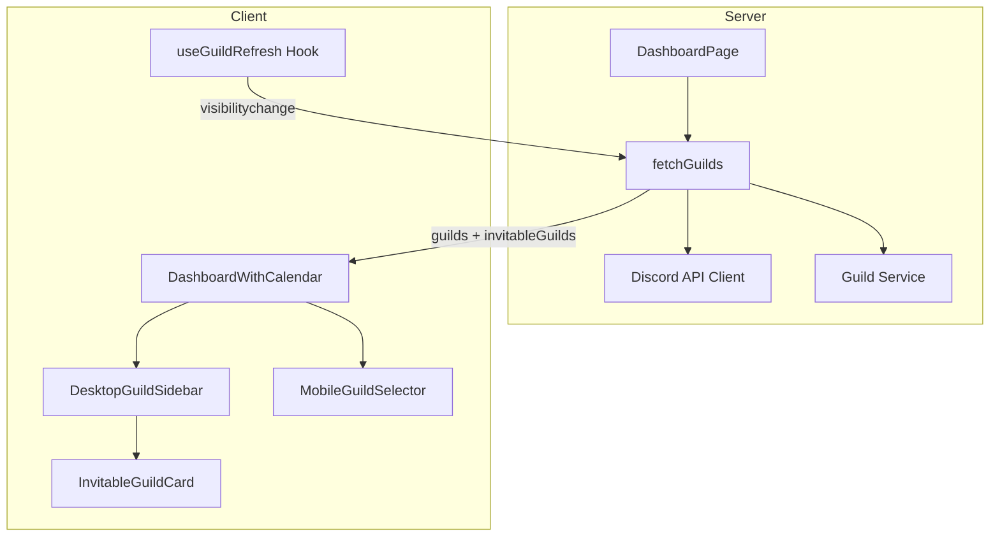
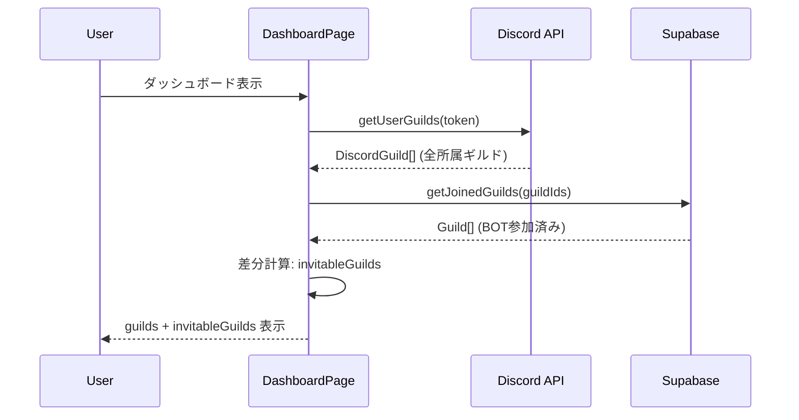
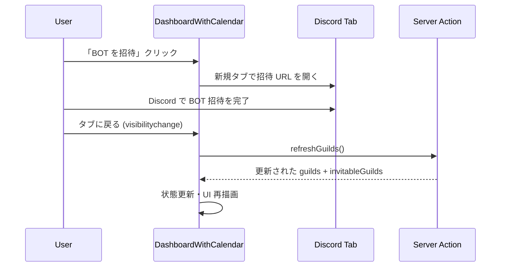

# Design Document: BOT 招待フロー

## Overview

**Purpose**: ダッシュボードに BOT 未参加ギルドの表示と招待フローを提供し、ユーザーが新規ギルドで Discalendar を利用開始できるようにする。

**Users**: Discalendar ユーザー（特に管理権限を持つギルド管理者）が、BOT 未導入のギルドを特定し招待するワークフローで利用する。

**Impact**: 既存の `fetchGuilds()` の戻り値を拡張し、`DashboardWithCalendar` コンポーネントに未参加ギルド表示セクションを追加する。

### Goals
- BOT 参加済み / 未参加ギルドを視覚的に区別して表示
- ワンクリックで Discord BOT 招待ページに遷移可能にする
- 招待完了後のギルド一覧自動更新

### Non-Goals
- BOT 招待結果の Webhook 受信（Discord 側の OAuth フロー完了は検知不可）
- ギルド設定（restricted フラグ等）の管理（別 spec `guild-permissions` で対応済み）
- BOT 招待 URL の動的生成（環境変数で管理）

## Architecture

### Existing Architecture Analysis

現行のギルド取得フロー:
1. `DashboardPage`（Server Component）が `fetchGuilds()` を呼び出し
2. `getUserGuilds()` で Discord API `/users/@me/guilds` から全所属ギルドを取得
3. `getJoinedGuilds()` で Supabase `guilds` テーブルと照合し、BOT 参加済みギルドのみ返却
4. `DashboardWithCalendar`（Client Component）にギルド配列を渡して表示

**拡張ポイント**: ステップ 3 で破棄されている「DB に存在しないギルド」を保持し、招待対象として返却する。

### Architecture Pattern & Boundary Map



**Architecture Integration**:
- Selected pattern: 既存 Server Component パターンの拡張
- Domain boundaries: ギルド取得ロジックは `lib/guilds/` と `lib/discord/` に集約、UI は `components/guilds/` に配置
- Existing patterns preserved: Server Component → Client Component データフロー、キャッシュ機構
- New components rationale: `InvitableGuildCard`（BOT 未参加ギルド表示）と `useGuildRefresh`（タブ復帰時再取得）を新設
- Steering compliance: App Router パターン、Supabase SSR 認証、shadcn/ui コンポーネント規約に準拠

### Technology Stack

| Layer | Choice / Version | Role in Feature | Notes |
|-------|------------------|-----------------|-------|
| Frontend | React 19 + Next.js 16 | Server/Client Component 分離 | 既存 |
| UI | shadcn/ui (Card, Badge, Button) | 招待カード、バッジ表示 | 既存 |
| Data | Supabase (PostgreSQL) | BOT 参加済みギルド照合 | 既存 |
| External | Discord API v10 | ユーザー所属ギルド取得 | 既存 |
| State | Page Visibility API | タブ復帰検知 | 新規利用 |

## System Flows

### BOT 参加状態判定と表示フロー



### BOT 招待と状態更新フロー



## Requirements Traceability

| Requirement | Summary | Components | Interfaces | Flows |
|-------------|---------|------------|------------|-------|
| 1.1 | 管理権限ギルド全取得 | fetchGuilds, DashboardWithCalendar | FetchGuildsResult | 参加状態判定フロー |
| 1.2 | 参加済み/未参加の視覚的区別 | DesktopGuildSidebar, MobileGuildSelector | — | — |
| 1.3 | 未参加バッジ表示 | InvitableGuildCard | InvitableGuildCardProps | — |
| 1.4 | 未参加ギルド不在時の通常表示 | DashboardWithCalendar | — | — |
| 2.1 | 招待ボタン表示 | InvitableGuildCard | InvitableGuildCardProps | — |
| 2.2 | 招待 URL を新タブで開く | InvitableGuildCard | — | 招待フロー |
| 2.3 | 環境変数から招待 URL 取得 | InvitableGuildCard | — | — |
| 2.4 | 環境変数未設定時ボタン非表示 | InvitableGuildCard | — | — |
| 3.1 | Discord ギルドと DB の比較判定 | fetchGuilds | FetchGuildsResult | 参加状態判定フロー |
| 3.2 | MANAGE_GUILD/ADMINISTRATOR フィルタ | canInviteBot | — | — |
| 3.3 | 判定失敗時のフォールバック | fetchGuilds | — | — |
| 4.1 | 参加済み優先ソート | DashboardWithCalendar | — | — |
| 4.2 | 名前順ソート | DashboardWithCalendar | — | — |
| 5.1 | タブ復帰時のデータ再取得 | useGuildRefresh | RefreshGuildsAction | 招待後更新フロー |
| 5.2 | BOT 参加状態変更時のセクション移動 | DashboardWithCalendar | — | 招待後更新フロー |

## Components and Interfaces

| Component | Domain/Layer | Intent | Req Coverage | Key Dependencies | Contracts |
|-----------|--------------|--------|--------------|------------------|-----------|
| fetchGuilds (拡張) | Server / Data | BOT 参加済み + 未参加ギルドを返却 | 1.1, 3.1, 3.2, 3.3 | Discord API Client (P0), Guild Service (P0) | Service |
| canInviteBot | Server / Logic | MANAGE_GUILD/ADMINISTRATOR 判定 | 3.2 | parsePermissions (P0) | Service |
| refreshGuilds | Server / Action | タブ復帰時のギルド再取得 | 5.1, 5.2 | fetchGuilds (P0) | Service |
| InvitableGuildCard | UI / Client | BOT 未参加ギルドのカード + 招待ボタン | 1.3, 2.1, 2.2, 2.3, 2.4 | shadcn/ui Card, Badge, Button (P1) | State |
| useGuildRefresh | UI / Hook | タブ復帰時の自動再取得 | 5.1, 5.2 | refreshGuilds (P0) | State |
| DashboardWithCalendar (拡張) | UI / Client | 参加済み/未参加セクション統合表示 | 1.2, 1.4, 4.1, 4.2 | InvitableGuildCard (P1) | State |

### Server / Data

#### fetchGuilds (拡張)

| Field | Detail |
|-------|--------|
| Intent | Discord API と DB を照合し、BOT 参加済みギルドと招待対象ギルドを分離して返却する |
| Requirements | 1.1, 3.1, 3.2, 3.3 |

**Responsibilities & Constraints**
- 既存の `fetchGuilds()` の戻り値型を拡張し、`invitableGuilds` フィールドを追加
- Discord API レスポンスのうち DB に存在しないギルドを `InvitableGuild` 型に変換
- 招待権限（MANAGE_GUILD / ADMINISTRATOR）を持つギルドのみ `invitableGuilds` に含める
- エラー発生時は `invitableGuilds` を空配列にするフォールバック

**Dependencies**
- Inbound: DashboardPage — ギルドデータ提供 (P0)
- Outbound: Discord API Client — ギルド一覧取得 (P0)
- Outbound: Guild Service — DB 照合 (P0)
- Outbound: parsePermissions — 権限解析 (P0)

**Contracts**: Service [x]

##### Service Interface
```typescript
/** BOT 未参加（招待対象）ギルド */
interface InvitableGuild {
  /** Discord ギルド ID (snowflake) */
  guildId: string;
  /** ギルド表示名 */
  name: string;
  /** アイコン URL (Discord CDN) */
  avatarUrl: string | null;
}

/** fetchGuilds の拡張戻り値 */
interface FetchGuildsResult {
  /** BOT 参加済みギルド */
  guilds: GuildWithPermissions[];
  /** 招待対象ギルド（MANAGE_GUILD/ADMINISTRATOR 権限あり） */
  invitableGuilds: InvitableGuild[];
  /** エラー情報 */
  error?: GuildListError;
}
```
- Preconditions: 有効な `providerToken` が必要（無い場合は空配列）
- Postconditions: `invitableGuilds` は `guilds` と重複しない
- Invariants: `invitableGuilds` 内の全ギルドは MANAGE_GUILD または ADMINISTRATOR 権限を持つ

**Implementation Notes**
- 既存の `fetchGuilds()` 内で DB 照合後の差分からの `InvitableGuild` 生成は同一関数内で完結
- `getGuildIconUrl()` を使って Discord CDN URL を構築
- キャッシュには `invitableGuilds` も含めて保存（型拡張が必要）

#### canInviteBot

| Field | Detail |
|-------|--------|
| Intent | 権限ビットフィールドから BOT 招待権限を判定する |
| Requirements | 3.2 |

**Contracts**: Service [x]

##### Service Interface
```typescript
/**
 * BOT 招待権限の有無を判定する
 * ADMINISTRATOR または MANAGE_GUILD のいずれかが true の場合に true を返す
 */
function canInviteBot(permissions: DiscordPermissions): boolean;
```

**Implementation Notes**
- 既存 `canManageGuild()` との違い: MANAGE_MESSAGES / MANAGE_ROLES は含まない
- `lib/discord/permissions.ts` に追加

#### refreshGuilds (Server Action)

| Field | Detail |
|-------|--------|
| Intent | クライアントからのギルド再取得リクエストを処理する |
| Requirements | 5.1, 5.2 |

**Contracts**: Service [x]

##### Service Interface
```typescript
/**
 * ギルド一覧を再取得する Server Action
 * キャッシュを無効化して最新データを取得
 */
async function refreshGuilds(): Promise<{
  guilds: Guild[];
  invitableGuilds: InvitableGuild[];
  guildPermissions: Record<string, GuildPermissionInfo>;
  error?: GuildListError;
}>;
```
- Preconditions: 認証済みセッションが必要
- Postconditions: キャッシュが更新され、最新データが返却される

**Implementation Notes**
- `app/dashboard/actions.ts` に追加
- キャッシュクリア → `fetchGuilds()` 再実行 → 結果返却のフロー
- `clearCachedGuilds()` を使用してキャッシュを無効化

### UI / Client

#### InvitableGuildCard

| Field | Detail |
|-------|--------|
| Intent | BOT 未参加ギルドを表示し、招待ボタンを提供する |
| Requirements | 1.3, 2.1, 2.2, 2.3, 2.4 |

**Responsibilities & Constraints**
- ギルド名、アイコン、「BOT 未参加」バッジを表示
- 「BOT を招待」ボタンのクリックで Discord 招待 URL を新タブで開く
- 環境変数 `NEXT_PUBLIC_BOT_INVITE_URL` 未設定時はボタンを非表示
- 招待 URL に `guild_id` パラメータを付加してギルドを事前選択

**Dependencies**
- Outbound: shadcn/ui Card, Badge, Button — UI プリミティブ (P1)
- External: Discord OAuth2 Authorize — BOT 招待ページ (P1)

**Contracts**: State [x]

##### State Management
```typescript
interface InvitableGuildCardProps {
  /** 招待対象ギルド情報 */
  guild: InvitableGuild;
  /** BOT 招待ベース URL（環境変数から取得） */
  botInviteUrl: string | null;
}
```

**Implementation Notes**
- `components/guilds/invitable-guild-card.tsx` に配置
- 既存 `SelectableGuildCard` のレイアウトに準拠しつつ、選択機能の代わりに招待ボタンを配置
- `botInviteUrl` が null の場合、ボタンを非表示（Req 2.4）
- `window.open(url, '_blank', 'noopener,noreferrer')` で新タブ遷移

#### useGuildRefresh

| Field | Detail |
|-------|--------|
| Intent | タブ復帰時にギルド一覧を自動再取得する |
| Requirements | 5.1, 5.2 |

**Dependencies**
- Outbound: refreshGuilds Server Action — データ再取得 (P0)

**Contracts**: State [x]

##### State Management
```typescript
interface UseGuildRefreshOptions {
  /** 再取得完了時のコールバック */
  onRefresh: (result: {
    guilds: Guild[];
    invitableGuilds: InvitableGuild[];
    guildPermissions: Record<string, GuildPermissionInfo>;
  }) => void;
  /** 再取得が有効か（招待可能ギルドが存在する場合のみ） */
  enabled: boolean;
}

function useGuildRefresh(options: UseGuildRefreshOptions): {
  /** 再取得中フラグ */
  isRefreshing: boolean;
};
```

**Implementation Notes**
- `hooks/guilds/use-guild-refresh.ts` に配置
- `document.visibilitychange` イベントでタブ復帰を検知
- 連続再取得防止のため最低インターバル（30 秒）を設定
- `enabled: false` の場合はリスナーを登録しない（パフォーマンス配慮）

#### DashboardWithCalendar (拡張)

| Field | Detail |
|-------|--------|
| Intent | 既存コンポーネントを拡張し、BOT 未参加ギルドセクションを追加 |
| Requirements | 1.2, 1.4, 4.1, 4.2 |

**Contracts**: State [x]

##### State Management
```typescript
/** 拡張 Props */
interface DashboardWithCalendarProps {
  guilds: Guild[];
  invitableGuilds: InvitableGuild[];
  guildError?: GuildListError;
  guildPermissions?: Record<string, GuildPermissionInfo>;
}
```

**Implementation Notes**
- `invitableGuilds` を受け取り、サイドバー下部に「BOT 未参加サーバー」セクションを追加
- BOT 参加済みギルドを先頭、未参加ギルドを後方に表示（Req 4.1）
- 各グループ内はギルド名のアルファベット順ソート（Req 4.2）
- `useGuildRefresh` を統合し、タブ復帰時に `guilds` と `invitableGuilds` を更新
- `invitableGuilds` が空の場合、未参加セクションを非表示（Req 1.4）

## Data Models

### Domain Model

- **InvitableGuild**: BOT 未参加かつ招待権限を持つギルドを表すバリューオブジェクト
  - Discord API レスポンスから生成、DB には永続化しない
  - `guildId`, `name`, `avatarUrl` の 3 プロパティ

### Data Contracts & Integration

**API Data Transfer**
- `FetchGuildsResult` に `invitableGuilds: InvitableGuild[]` を追加
- Server Component → Client Component へ props 経由で受け渡し
- `InvitableGuild` は JSON シリアライズ可能（BigInt 等の非シリアライズ型を含まない）

## Error Handling

### Error Categories and Responses
- **Discord API エラー** (unauthorized, rate_limited): 既存のエラーハンドリングで対応。`invitableGuilds` は空配列にフォールバック（Req 3.3）
- **環境変数未設定**: 招待ボタン非表示で無害にフォールバック（Req 2.4）
- **タブ復帰時の再取得失敗**: エラーを無視し、現在の表示を維持（再取得は任意のUX改善であり必須ではない）

## Testing Strategy

### Unit Tests
- `canInviteBot()`: ADMINISTRATOR / MANAGE_GUILD 権限の判定テスト
- `InvitableGuild` 生成ロジック: Discord API レスポンスからの変換テスト
- `InvitableGuildCard`: 招待ボタン表示 / 非表示、URL 生成テスト
- `useGuildRefresh`: visibilitychange イベントでのコールバック発火テスト

### Integration Tests
- `fetchGuilds()` 拡張: 参加済み / 未参加ギルドの正しい分類テスト
- `DashboardWithCalendar`: 両セクションの表示 / 非表示の統合テスト
- `refreshGuilds()`: キャッシュクリア → 再取得フローテスト

### E2E Tests
- ダッシュボード表示時に BOT 未参加ギルドセクションが表示されること
- 「BOT を招待」ボタンクリックで新タブが開くこと
