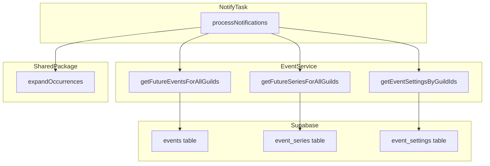
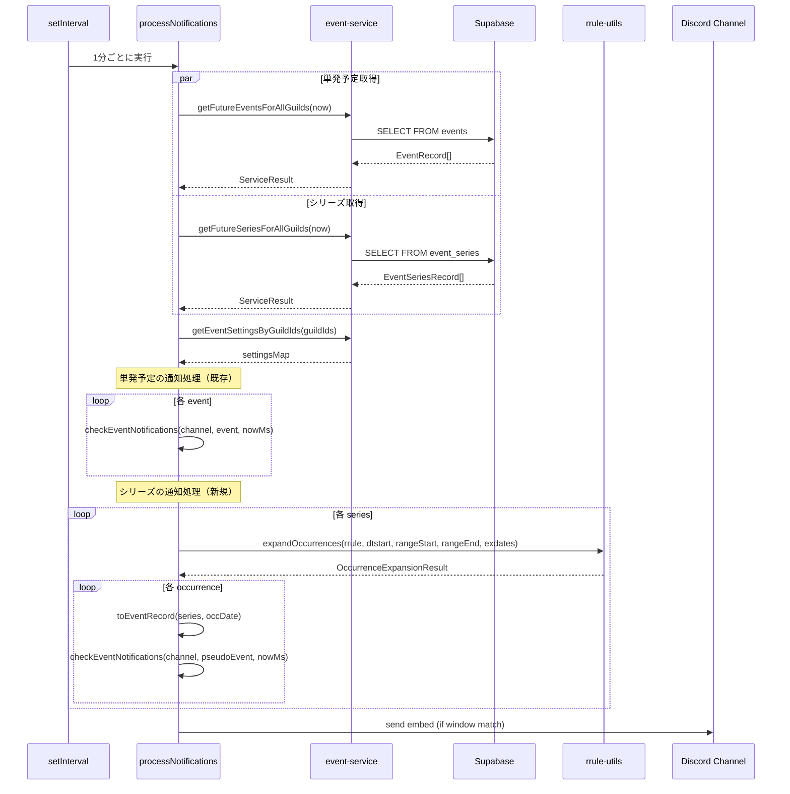

# Design Document: bot-recurring-notification

## Overview

**Purpose**: Botの通知タスク（notify.ts）を拡張し、繰り返し予定（event_series）のオカレンスも通知対象とする。
**Users**: Discordサーバーのメンバーが、Webで作成した繰り返し予定の通知をDiscordチャンネルで受け取れるようになる。
**Impact**: 既存の単発予定通知フローに繰り返し予定の取得・RRULE展開・通知処理を追加する。既存動作に影響を与えない。

### Goals
- event_series テーブルから繰り返し予定を取得し、RRULE展開してオカレンスを通知する
- Web側の `rrule-utils.ts` を共有パッケージ化し、Bot から利用可能にする
- 既存の単発予定通知に影響を与えない

### Non-Goals
- 送信済み通知の永続的な重複排除（将来 `sent_notifications` テーブルで対応）
- Bot からの繰り返し予定の作成・編集（Web のみで操作）
- シリーズの例外オカレンス（events テーブルの `series_id` 付きレコード）のマージ処理

## Architecture

### Existing Architecture Analysis

現在の通知フロー:
1. `startNotifyTask` が1分間隔で `processNotifications` を実行
2. `getFutureEventsForAllGuilds(now)` で events テーブルから7日以内のイベントを取得
3. ギルドごとに `getEventSettingsByGuildIds` で通知チャンネルを解決
4. イベントごとに `checkEventNotifications` で1分ウィンドウ判定→Embed送信

**拡張ポイント**: `processNotifications` 内で、events 取得と並行して event_series を取得し、RRULE展開後のオカレンスを同じ `checkEventNotifications` に流す。

### Architecture Pattern & Boundary Map



**Architecture Integration**:
- **Selected pattern**: 既存通知パイプラインの拡張。オカレンスを `EventRecord` 互換に変換し、既存の `checkEventNotifications` を再利用
- **Domain boundaries**: 共有パッケージ（`@discalendar/rrule-utils`）はRRULE展開のみを担い、通知ロジックやDB操作に依存しない
- **Existing patterns preserved**: Result型パターン、ServiceError、pino ロガー、1分ウィンドウ判定
- **New components**: `getFutureSeriesForAllGuilds`（サービス関数）、`@discalendar/rrule-utils`（共有パッケージ）、`EventSeriesRecord`（型定義）
- **Steering compliance**: モノレポ構成、TypeScript strict mode、Biome/Ultracite

### Technology Stack

| Layer | Choice / Version | Role in Feature | Notes |
|-------|------------------|-----------------|-------|
| Backend / Services | Node.js ES2022, TypeScript strict | 通知タスク実行 | 既存 Bot ランタイム |
| Data / Storage | Supabase (PostgreSQL) | event_series テーブル読み取り | `@supabase/supabase-js ^2.86.0` |
| Shared Library | `rrule ^2.8.1` | RRULE文字列展開 | Web側と同一バージョン |
| Shared Package | `@discalendar/rrule-utils` | expandOccurrences 関数 | npm workspace 新パッケージ |

## System Flows

### 通知チェックフロー（繰り返し予定追加後）



**Key Decisions**:
- 単発予定とシリーズの取得は並列実行（Promise.all）でレイテンシを削減
- シリーズ取得失敗時は単発予定の通知に影響を与えない（エラー分離）
- 展開範囲は既存の7日間ウィンドウ（`MAX_NOTIFY_WINDOW_MS`）と同一

## Requirements Traceability

| Requirement | Summary | Components | Interfaces | Flows |
|-------------|---------|------------|------------|-------|
| 1.1, 1.2, 1.3 | RRULE展開ロジック共有 | `@discalendar/rrule-utils` | `expandOccurrences` | — |
| 2.1, 2.2, 2.3, 2.4 | event_series データ取得 | event-service | `getFutureSeriesForAllGuilds` | 通知チェックフロー |
| 3.1, 3.2, 3.3, 3.4, 3.5 | オカレンス展開・通知 | notify.ts | `processSeriesNotifications`, `toEventRecord` | 通知チェックフロー |
| 4.1, 4.2 | EXDATE処理 | `@discalendar/rrule-utils` | `expandOccurrences` (exdates引数) | — |
| 5.1, 5.2, 5.3 | 後方互換性 | notify.ts | — | 通知チェックフロー |
| 6.1, 6.2, 6.3 | 型安全性 | types/event.ts | `EventSeriesRecord` | — |

## Components and Interfaces

| Component | Domain/Layer | Intent | Req Coverage | Key Dependencies | Contracts |
|-----------|--------------|--------|--------------|------------------|-----------|
| `@discalendar/rrule-utils` | Shared / Library | RRULE展開ロジックの共有 | 1.1, 1.2, 1.3, 4.1, 4.2 | `rrule` (P0) | Service |
| `EventSeriesRecord` | Bot / Types | event_series テーブルの型定義 | 6.1, 6.2 | — | — |
| `getFutureSeriesForAllGuilds` | Bot / Service | event_series テーブルからシリーズ取得 | 2.1, 2.2, 2.3, 2.4 | Supabase (P0) | Service |
| `processSeriesNotifications` | Bot / Task | シリーズオカレンスの通知処理統合 | 3.1-3.5, 5.1-5.3 | event-service (P0), rrule-utils (P0) | Batch |
| `toEventRecord` | Bot / Task | シリーズオカレンスを EventRecord 互換に変換 | 3.2, 6.3 | — | Service |

### Shared / Library

#### `@discalendar/rrule-utils`

| Field | Detail |
|-------|--------|
| Intent | Web側 `rrule-utils.ts` の RRULE 展開ロジックを共有パッケージとして提供 |
| Requirements | 1.1, 1.2, 1.3, 4.1, 4.2 |

**Responsibilities & Constraints**
- Web側 `lib/calendar/rrule-utils.ts` の関数群を npm workspace パッケージとして切り出す
- `rrule` パッケージ以外の外部依存を持たない
- Web・Bot 両方から `@discalendar/rrule-utils` としてインポート可能にする

**Dependencies**
- External: `rrule ^2.8.1` — RRULE パース・展開 (P0)

**Contracts**: Service [x]

##### Service Interface
```typescript
// packages/rrule-utils/src/index.ts から公開する関数群

interface OccurrenceExpansionResult {
  dates: Date[];
  truncated: boolean;
}

interface RruleValidationResult {
  valid: boolean;
  error?: string;
}

// 主要関数シグネチャ
function expandOccurrences(
  rrule: string,
  dtstart: Date,
  rangeStart: Date,
  rangeEnd: Date,
  exdates?: Date[],
): OccurrenceExpansionResult;

function validateRrule(rrule: string): RruleValidationResult;

function toSummaryText(rrule: string, dtstart: Date): string;

function formatDateUTC(date: Date): string;
```
- Preconditions: `rrule` は非空の RRULE 文字列、`dtstart` は有効な Date
- Postconditions: `dates` は `rangeStart` ～ `rangeEnd` 内のオカレンスのみ含む。`exdates` に該当する日時は除外
- Invariants: 同一入力に対して常に同一の出力を返す（純粋関数）

**Implementation Notes**
- パッケージ構成: `packages/rrule-utils/package.json` に `"name": "@discalendar/rrule-utils"`, `"exports"` フィールドで ESM エントリポイント定義
- Web 側 `lib/calendar/rrule-utils.ts` のインポートを `@discalendar/rrule-utils` に切り替え
- `tsconfig.json`: `ES2022` ターゲット、`declaration: true` で型定義ファイル生成
- Bot から `rrule-utils.test.ts` のテストも共有パッケージに移動し、Bot 側で追加テスト不要

### Bot / Types

#### `EventSeriesRecord`

| Field | Detail |
|-------|--------|
| Intent | event_series テーブルのカラム構造に対応する型定義 |
| Requirements | 6.1, 6.2 |

**Implementation Notes**
- `packages/bot/src/types/event.ts` に追加
- Web側 `lib/calendar/types.ts` の `EventSeriesRecord` と同一フィールド構成
- `notifications` フィールドは既存の `NotificationPayload[]` 型を再利用

```typescript
type EventSeriesRecord = {
  id: string;
  guild_id: string;
  name: string;
  description: string | null;
  color: string;
  is_all_day: boolean;
  rrule: string;
  dtstart: string;
  duration_minutes: number;
  location: string | null;
  channel_id: string | null;
  channel_name: string | null;
  notifications: NotificationPayload[];
  exdates: string[];
  created_at: string;
  updated_at: string;
};
```

### Bot / Service

#### `getFutureSeriesForAllGuilds`

| Field | Detail |
|-------|--------|
| Intent | event_series テーブルから全ギルドの有効なシリーズを取得 |
| Requirements | 2.1, 2.2, 2.3, 2.4 |

**Responsibilities & Constraints**
- 通知ウィンドウに該当する可能性のあるシリーズを取得する
- RRULE の終了条件（UNTIL, COUNT）による絞り込みはDB側では行わない（RRULE展開で判定）
- 削除済み（soft delete）シリーズは除外する

**Dependencies**
- Outbound: Supabase — event_series テーブルクエリ (P0)

**Contracts**: Service [x]

##### Service Interface
```typescript
function getFutureSeriesForAllGuilds(): Promise<ServiceResult<EventSeriesRecord[]>>;
```
- Preconditions: Supabase クライアントが初期化済み
- Postconditions: 有効な全シリーズレコードを返す
- Error: Supabase エラーを `classifySupabaseError` で分類し `ServiceResult` として返す

**Implementation Notes**
- `packages/bot/src/services/event-service.ts` に追加
- 単発予定と異なり、シリーズはRRULE次第で任意の未来日にオカレンスがあるため、時間範囲フィルタではなく全有効シリーズを取得する
- 件数上限: `MAX_NOTIFY_SERIES = 500`（パフォーマンスガード）

### Bot / Task

#### `processSeriesNotifications`

| Field | Detail |
|-------|--------|
| Intent | シリーズの RRULE 展開→オカレンス通知を統合 |
| Requirements | 3.1, 3.2, 3.3, 3.4, 3.5, 5.1, 5.2, 5.3 |

**Responsibilities & Constraints**
- `processNotifications` 内で、既存の単発予定処理の後に呼び出す
- シリーズ取得失敗時はエラーログのみ出力し、単発予定の通知には影響しない
- 各シリーズの RRULE を `expandOccurrences` で展開し、オカレンスごとに `checkEventNotifications` を呼ぶ

**Dependencies**
- Inbound: `processNotifications` — 呼び出し元 (P0)
- Outbound: `getFutureSeriesForAllGuilds` — シリーズ取得 (P0)
- Outbound: `expandOccurrences` — RRULE 展開 (P0)
- Outbound: `checkEventNotifications` — 通知判定・送信 (P0)

**Contracts**: Batch [x]

##### Batch / Job Contract
- Trigger: `processNotifications` 内で毎分実行
- Input: `Client`, `settingsMap`, `nowMs` (processNotifications のコンテキストから渡す)
- Output: Discord チャンネルへの通知 Embed 送信
- Idempotency: 既存の単発予定と同じ1分ウィンドウ判定方式。再起動時の重複は許容（既存設計方針）

#### `toEventRecord`

| Field | Detail |
|-------|--------|
| Intent | シリーズオカレンスを EventRecord 互換オブジェクトに変換 |
| Requirements | 3.2, 6.3 |

**Contracts**: Service [x]

##### Service Interface
```typescript
function toEventRecord(
  series: EventSeriesRecord,
  occurrenceDate: Date
): EventRecord;
```
- Preconditions: `series` は有効な `EventSeriesRecord`、`occurrenceDate` は展開された1オカレンス
- Postconditions: 返された `EventRecord` は `checkEventNotifications` に渡せる形式
- Mapping:
  - `id`: `series:${series.id}:occ:${occurrenceDate.toISOString()}` （合成ID）
  - `guild_id`: `series.guild_id`
  - `name`: `series.name`
  - `start_at`: `occurrenceDate.toISOString()`
  - `end_at`: `new Date(occurrenceDate.getTime() + series.duration_minutes * 60_000).toISOString()`
  - `is_all_day`: `series.is_all_day`
  - `notifications`: `series.notifications`
  - その他フィールド: `series` から直接マッピング

**Implementation Notes**
- `packages/bot/src/tasks/notify.ts` 内のヘルパー関数として定義
- `checkEventNotifications` が参照する `EventRecord` フィールドのみ正確にマッピングすればよい

## Data Models

### Domain Model

新たなテーブルやスキーマ変更は不要。既存の `event_series` テーブルを読み取り専用で参照する。

**既存エンティティの関係**:
- `event_series` (1) → (N) オカレンス（RRULE展開で動的生成）
- `event_series.guild_id` → `event_settings.guild_id`（通知チャンネル解決）
- `events.series_id` → `event_series.id`（例外オカレンス。本機能スコープ外）

### Logical Data Model

**event_series テーブル（読み取り対象）**:

| Column | Type | Description |
|--------|------|-------------|
| id | uuid | PK |
| guild_id | text | Discord サーバーID |
| name | text | イベント名 |
| description | text | 説明（nullable） |
| color | text | HEXカラー |
| is_all_day | boolean | 終日フラグ |
| rrule | text | RFC 5545 RRULE 文字列 |
| dtstart | timestamptz | シリーズ開始日時 |
| duration_minutes | integer | オカレンス持続時間（分） |
| location | text | 場所（nullable） |
| channel_id | text | チャンネルID（nullable） |
| channel_name | text | チャンネル名（nullable） |
| notifications | jsonb | 通知設定配列 |
| exdates | jsonb | 除外日配列 |
| created_at | timestamptz | 作成日時 |
| updated_at | timestamptz | 更新日時 |

## Error Handling

### Error Strategy

既存の notify.ts のエラーハンドリングパターンを踏襲する。

### Error Categories and Responses

| エラー | カテゴリ | 対応 |
|--------|---------|------|
| event_series クエリ失敗 | System | エラーログ出力、単発予定通知は継続 |
| RRULE 展開失敗（不正文字列） | Business Logic | 該当シリーズをスキップ、warn ログ出力 |
| Embed 送信失敗 | System | 既存パターン踏襲（warn ログ、他通知は継続） |
| チャンネル未設定/送信不可 | Business Logic | 既存パターン踏襲（warn ログ、スキップ） |

### Monitoring

- `pino` ロガーで構造化ログ出力（既存パターン）
- シリーズ取得件数: `logger.debug({ count }, "Fetched series for notification")`
- オカレンス展開件数: `logger.debug({ seriesId, occurrenceCount }, "Expanded occurrences")`
- 送信成功/失敗: 既存の `logger.info` / `logger.warn` パターンを踏襲

## Testing Strategy

### Unit Tests
1. `toEventRecord`: EventSeriesRecord + occurrenceDate → EventRecord 変換の正確性
2. `toEventRecord`: 終日シリーズの start_at/end_at 計算
3. `expandOccurrences`: EXDATE 除外の動作確認（共有パッケージ側、既存テスト移行）

### Integration Tests
1. `getFutureSeriesForAllGuilds`: Supabase モックでシリーズ取得・エラーハンドリング
2. `processNotifications` 拡張: シリーズオカレンスの通知送信（既存テストパターンに追加）
3. シリーズ取得失敗時に単発予定の通知が影響を受けないことの確認
4. EXDATE 付きシリーズのオカレンスが通知対象から除外されることの確認
5. 終日シリーズオカレンスの JST 午前0時基準通知の確認
