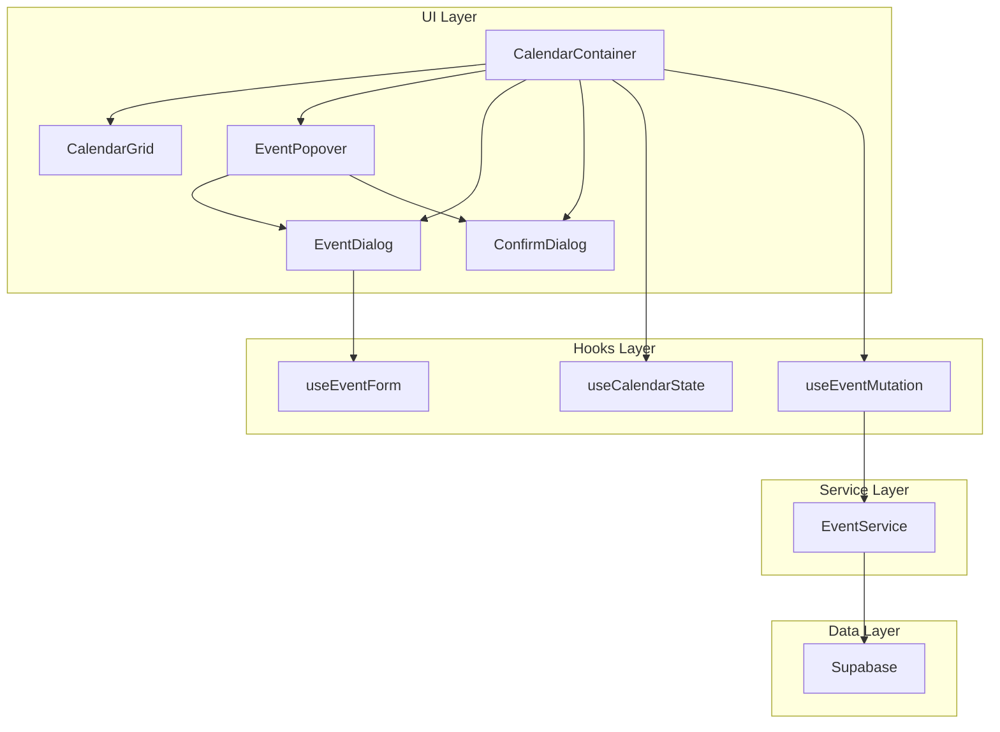
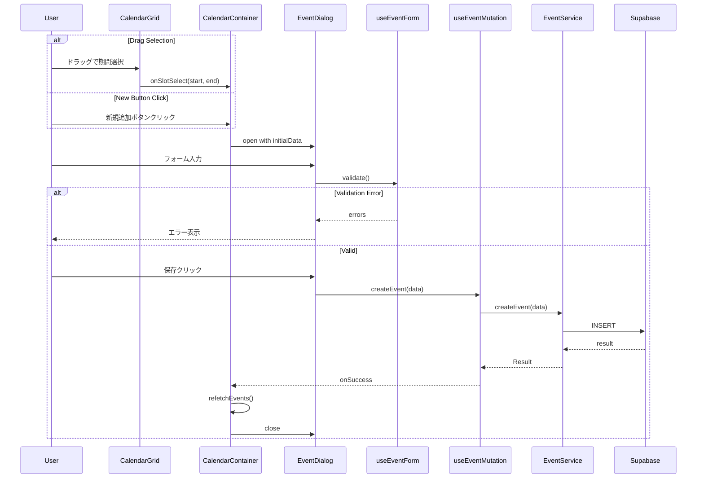
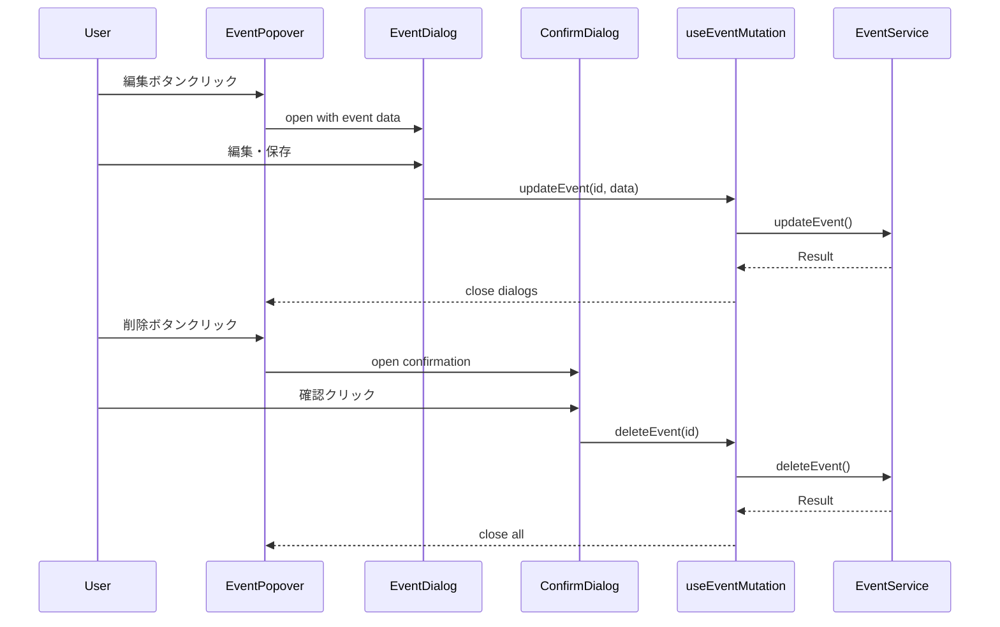
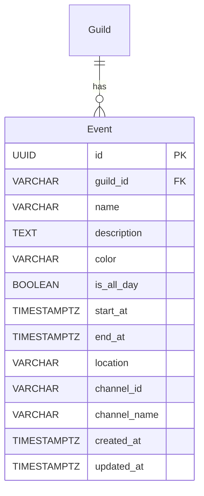

# Design Document

## Overview

**Purpose**: カレンダー予定管理機能は、ユーザーがDiscordギルドのカレンダー上で予定を追加・編集・削除し、詳細をプレビュー表示できる機能を提供する。

**Users**: Discordギルドメンバーが、ギルドカレンダーでイベントのスケジュール管理を行う。

**Impact**: 既存の読み取り専用カレンダー表示システム（CalendarContainer, EventPopover, EventService）を拡張し、完全なCRUD操作を可能にする。

### Goals

- ドラッグ操作または新規追加ボタンによる直感的な予定作成
- 既存EventPopoverを拡張した編集・削除フロー
- フォームバリデーションによるデータ整合性の確保
- 視覚的フィードバックによる操作性の向上

### Non-Goals

- 繰り返しイベント（リピート機能）
- 予定のドラッグ&ドロップによる日時変更
- 複数ユーザー間の権限管理
- Discord Bot連携による通知機能

## Architecture

### Existing Architecture Analysis

現在のカレンダーシステムは以下の構造で実装されている：

- **CalendarContainer**: 状態管理、データフェッチ、子コンポーネントへのデータ配布
- **CalendarGrid**: react-big-calendarラッパー、イベント表示とスロット選択
- **EventPopover**: 読み取り専用の予定詳細表示（編集・削除ボタン未実装）
- **EventService**: Supabaseからのイベント取得（fetchEventsのみ）
- **useCalendarState**: ビューモード、日付、イベント、ローディング状態管理

### Architecture Pattern & Boundary Map



**Architecture Integration**:
- Selected pattern: Container-Presenter with Custom Hooks（既存パターンを継承）
- Domain boundaries: UI Layer（表示・操作） / Hooks Layer（状態・ロジック） / Service Layer（データアクセス）
- Existing patterns preserved: Result型によるエラーハンドリング、shadcn/ui + Radix UIパターン
- New components rationale: Dialog系コンポーネントとmutation hookの追加でCRUD完結
- Steering compliance: TypeScript strict mode、Biome lint、Storybook必須

### Technology Stack

| Layer | Choice / Version | Role in Feature | Notes |
|-------|------------------|-----------------|-------|
| Frontend | React 19 + Next.js 16 | UIコンポーネント、Server Actions | 既存スタック継続 |
| UI Components | shadcn/ui (Radix UI) | Dialog、Form、Input | Dialog追加が必要 |
| State | React hooks + Custom hooks | フォーム状態、mutation状態 | useEventForm、useEventMutation新規作成 |
| Data | Supabase (PostgreSQL) | イベントCRUD、RLS | INSERT/UPDATE/DELETE RLS追加 |
| Date Handling | date-fns 4.x | 日時フォーマット、バリデーション | 既存使用継続 |

## System Flows

### Event Creation Flow



### Event Edit/Delete Flow



## Requirements Traceability

| Requirement | Summary | Components | Interfaces | Flows |
|-------------|---------|------------|------------|-------|
| 1.1 | ドラッグによる期間選択 | CalendarGrid | onSlotSelect | Creation Flow |
| 1.2 | 新規追加ボタン | CalendarToolbar | onAddClick | Creation Flow |
| 1.3 | 予定入力フォーム | EventDialog, EventForm | EventFormData | Creation Flow |
| 1.4 | 予定の保存 | useEventMutation, EventService | createEvent | Creation Flow |
| 1.5 | 保存後のカレンダー更新 | CalendarContainer | refetchEvents | Creation Flow |
| 1.6 | バリデーションエラー | useEventForm | validate | Creation Flow |
| 1.7 | キャンセル操作 | EventDialog | onClose | Creation Flow |
| 2.1 | 予定クリックでプレビュー | EventPopover | - | Existing |
| 2.2 | プレビュー詳細表示 | EventPopover | - | Existing |
| 2.3 | 編集・削除ボタン | EventPopover | onEdit, onDelete | Edit/Delete Flow |
| 2.4 | プレビュー外クリックで閉じる | EventPopover | onClose | Existing |
| 2.5 | 読み取り専用表示 | EventPopover | - | Existing |
| 3.1 | 編集ダイアログ表示 | EventDialog | mode: edit | Edit Flow |
| 3.2 | 編集フォーム表示 | EventForm | defaultValues | Edit Flow |
| 3.3 | 予定の更新保存 | useEventMutation, EventService | updateEvent | Edit Flow |
| 3.4 | 編集完了後のUI更新 | CalendarContainer | refetchEvents | Edit Flow |
| 3.5 | 編集バリデーション | useEventForm | validate | Edit Flow |
| 3.6 | 編集キャンセル | EventDialog | onClose | Edit Flow |
| 4.1 | 削除確認ダイアログ | ConfirmDialog | - | Delete Flow |
| 4.2 | 削除実行 | useEventMutation, EventService | deleteEvent | Delete Flow |
| 4.3 | 削除後のUI更新 | CalendarContainer | refetchEvents | Delete Flow |
| 4.4 | 削除キャンセル | ConfirmDialog | onCancel | Delete Flow |
| 4.5 | 完全削除 | EventService | deleteEvent | Delete Flow |
| 5.1 | 視覚的識別 | EventBlock | - | Existing |
| 5.2 | 時間に基づく配置 | CalendarGrid | - | Existing |
| 5.3 | ドラッグハイライト | CalendarGrid | slotStyleGetter | Creation Flow |
| 5.4 | ホバーツールチップ | EventBlock | tooltip | UI Enhancement |
| 5.5 | 重複イベント表示 | CalendarGrid | - | Existing |

## Components and Interfaces

### Component Summary

| Component | Domain/Layer | Intent | Req Coverage | Key Dependencies | Contracts |
|-----------|--------------|--------|--------------|------------------|-----------|
| EventDialog | UI | 予定の新規作成・編集ダイアログ | 1.3, 1.7, 3.1, 3.2, 3.6 | Dialog (P0), EventForm (P0) | State |
| EventForm | UI | 予定入力フォーム | 1.3, 1.6, 3.2, 3.5 | useEventForm (P0) | State |
| ConfirmDialog | UI | 削除確認ダイアログ | 4.1, 4.4 | AlertDialog (P0) | State |
| useEventForm | Hooks | フォーム状態・バリデーション | 1.6, 3.5 | - | Service |
| useEventMutation | Hooks | イベントCRUD操作 | 1.4, 3.3, 4.2 | EventService (P0) | Service |
| EventService (extension) | Service | Supabase CRUD操作 | 1.4, 3.3, 4.2, 4.5 | Supabase (P0) | Service, API |

### UI Layer

#### EventDialog

| Field | Detail |
|-------|--------|
| Intent | 予定の新規作成および編集のためのモーダルダイアログを提供 |
| Requirements | 1.3, 1.7, 3.1, 3.2, 3.6 |

**Responsibilities & Constraints**
- 新規作成モード（mode: create）と編集モード（mode: edit）を持つ
- 初期値（開始日時、終了日時、既存データ）を受け取る
- キャンセル時は入力内容を破棄してダイアログを閉じる
- 送信成功時はダイアログを閉じて親に通知

**Dependencies**
- Inbound: CalendarContainer — ダイアログ開閉制御 (P0)
- Inbound: EventPopover — 編集モード起動 (P1)
- Outbound: EventForm — フォームコンポーネント (P0)
- External: shadcn/ui Dialog — UIプリミティブ (P0)

**Contracts**: State [x]

##### State Management

```typescript
interface EventDialogState {
  isOpen: boolean;
  mode: 'create' | 'edit';
  initialData: Partial<EventFormData> | null;
  eventId: string | null; // 編集時のみ
}

interface EventDialogProps {
  open: boolean;
  mode: 'create' | 'edit';
  initialData?: Partial<EventFormData>;
  eventId?: string;
  onClose: () => void;
  onSuccess: () => void;
}
```

**Implementation Notes**
- Integration: shadcn/ui Dialog未追加のため `npx shadcn@latest add dialog` 実行が必要
- Validation: EventFormに委譲
- Risks: ダイアログ表示中のカレンダー操作は無効化が必要

#### EventForm

| Field | Detail |
|-------|--------|
| Intent | 予定入力フォームのレンダリングとバリデーション状態表示 |
| Requirements | 1.3, 1.6, 3.2, 3.5 |

**Responsibilities & Constraints**
- タイトル、開始日時、終了日時、説明、終日フラグの入力
- フィールドごとのバリデーションエラー表示
- 送信中のローディング状態表示

**Dependencies**
- Inbound: EventDialog — フォーム埋め込み (P0)
- Outbound: useEventForm — 状態・バリデーション (P0)
- External: shadcn/ui Input, Label, Checkbox, Button (P0)

**Contracts**: State [x]

##### State Management

```typescript
interface EventFormData {
  title: string;
  startAt: Date;
  endAt: Date;
  description: string;
  isAllDay: boolean;
  color: string;
  location: string;
}

interface EventFormProps {
  defaultValues?: Partial<EventFormData>;
  onSubmit: (data: EventFormData) => void;
  isSubmitting: boolean;
  onCancel: () => void;
}
```

**Implementation Notes**
- Integration: 日時入力にはHTML5 datetime-local inputを使用（date-fnsでフォーマット）
- Validation: useEventFormのerrorsをフィールドに紐付け表示

#### ConfirmDialog

| Field | Detail |
|-------|--------|
| Intent | 破壊的操作（削除）の確認ダイアログを提供 |
| Requirements | 4.1, 4.4 |

**Responsibilities & Constraints**
- 確認メッセージの表示
- 確認・キャンセルボタンの提供
- 確認時のコールバック実行

**Dependencies**
- Inbound: EventPopover — 削除確認起動 (P0)
- External: shadcn/ui AlertDialog — UIプリミティブ (P0)

**Contracts**: State [x]

##### State Management

```typescript
interface ConfirmDialogProps {
  open: boolean;
  title: string;
  description: string;
  confirmLabel?: string;
  cancelLabel?: string;
  onConfirm: () => void;
  onCancel: () => void;
  isLoading?: boolean;
}
```

**Implementation Notes**
- Integration: shadcn/ui AlertDialog追加が必要 `npx shadcn@latest add alert-dialog`

#### EventPopover (Extension)

既存のEventPopoverコンポーネントを拡張し、編集・削除ボタンを追加する。

**Extended Props**:

```typescript
interface EventPopoverProps {
  // 既存props
  event: CalendarEvent | null;
  open: boolean;
  onClose: () => void;
  // 追加props
  onEdit?: (event: CalendarEvent) => void;
  onDelete?: (event: CalendarEvent) => void;
}
```

**Implementation Notes**
- 編集ボタンクリック時: `onEdit(event)` を呼び出し
- 削除ボタンクリック時: `onDelete(event)` を呼び出し
- Requirements: 2.3

### Hooks Layer

#### useEventForm

| Field | Detail |
|-------|--------|
| Intent | フォーム状態管理とバリデーションロジックの提供 |
| Requirements | 1.6, 3.5 |

**Responsibilities & Constraints**
- フォームフィールドの状態管理
- リアルタイムバリデーション
- バリデーションエラーの返却

**Dependencies**
- Outbound: なし（純粋なロジック）

**Contracts**: Service [x]

##### Service Interface

```typescript
interface ValidationErrors {
  title?: string;
  startAt?: string;
  endAt?: string;
  description?: string;
}

interface UseEventFormReturn {
  values: EventFormData;
  errors: ValidationErrors;
  touched: Record<keyof EventFormData, boolean>;
  isValid: boolean;
  handleChange: (field: keyof EventFormData, value: unknown) => void;
  handleBlur: (field: keyof EventFormData) => void;
  validate: () => boolean;
  reset: (values?: Partial<EventFormData>) => void;
}

function useEventForm(
  initialValues?: Partial<EventFormData>
): UseEventFormReturn;
```

**Validation Rules**:
- title: 必須、1-255文字
- startAt: 必須、有効な日時
- endAt: 必須、有効な日時、startAt以降
- description: オプション、最大5000文字

**Implementation Notes**
- Validation: 各フィールドのblur時とsubmit時にバリデーション実行
- Risks: 日時入力のタイムゾーン処理に注意

#### useEventMutation

| Field | Detail |
|-------|--------|
| Intent | イベントCRUD操作のミューテーション管理 |
| Requirements | 1.4, 3.3, 4.2 |

**Responsibilities & Constraints**
- EventServiceを使用したCRUD操作
- ローディング・エラー状態管理
- 楽観的更新は行わない（サーバー応答後に更新）

**Dependencies**
- Outbound: EventService — データ操作 (P0)

**Contracts**: Service [x]

##### Service Interface

```typescript
interface MutationState {
  isCreating: boolean;
  isUpdating: boolean;
  isDeleting: boolean;
  error: CalendarError | null;
}

interface UseEventMutationReturn {
  state: MutationState;
  createEvent: (data: CreateEventInput) => Promise<MutationResult<CalendarEvent>>;
  updateEvent: (id: string, data: UpdateEventInput) => Promise<MutationResult<CalendarEvent>>;
  deleteEvent: (id: string) => Promise<MutationResult<void>>;
  clearError: () => void;
}

function useEventMutation(
  eventService: EventServiceInterface,
  options?: {
    onSuccess?: () => void;
    onError?: (error: CalendarError) => void;
  }
): UseEventMutationReturn;
```

**Implementation Notes**
- Integration: EventServiceのcreate/update/deleteメソッドを呼び出し
- Validation: 入力データのバリデーションはuseEventFormで実施済みを前提

### Service Layer

#### EventService (Extension)

| Field | Detail |
|-------|--------|
| Intent | Supabaseを使用したイベントデータのCRUD操作 |
| Requirements | 1.4, 3.3, 4.2, 4.5 |

**Existing Methods**:
- `fetchEvents(params)` - イベント取得（実装済み）

**New Methods**:

**Contracts**: Service [x] / API [x]

##### Service Interface

```typescript
interface CreateEventInput {
  guildId: string;
  title: string;
  startAt: Date;
  endAt: Date;
  description?: string;
  isAllDay?: boolean;
  color?: string;
  location?: string;
  channelId?: string;
  channelName?: string;
}

interface UpdateEventInput {
  title?: string;
  startAt?: Date;
  endAt?: Date;
  description?: string;
  isAllDay?: boolean;
  color?: string;
  location?: string;
}

interface EventServiceInterface {
  // 既存
  fetchEvents(params: FetchEventsParams): Promise<FetchEventsResult>;

  // 新規追加
  createEvent(input: CreateEventInput): Promise<MutationResult<CalendarEvent>>;
  updateEvent(id: string, input: UpdateEventInput): Promise<MutationResult<CalendarEvent>>;
  deleteEvent(id: string): Promise<MutationResult<void>>;
}

type MutationResult<T> =
  | { success: true; data: T }
  | { success: false; error: CalendarError };
```

##### API Contract

| Method | Endpoint | Request | Response | Errors |
|--------|----------|---------|----------|--------|
| POST | Supabase.from('events').insert() | CreateEventInput | EventRecord | 400 (validation), 403 (unauthorized), 500 |
| PATCH | Supabase.from('events').update().eq('id', id) | UpdateEventInput | EventRecord | 400, 403, 404, 500 |
| DELETE | Supabase.from('events').delete().eq('id', id) | - | void | 403, 404, 500 |

**Implementation Notes**
- Integration: 既存のcreateEventService()ファクトリ関数を拡張
- Validation: Supabase側のRLS + アプリ側の事前バリデーション
- Risks: RLS policy追加が必要（下記Data Models参照）

### CalendarContainer (Extension)

既存のCalendarContainerを拡張し、CRUD操作のハンドラーを追加する。

**Extended Functionality**:
- 新規追加ボタンのハンドラー
- ドラッグ選択時のダイアログ表示
- EventPopoverからの編集・削除ハンドラー
- ConfirmDialogの状態管理
- CRUD成功時のイベント再取得

**Implementation Notes**
- EventDialogとConfirmDialogの状態をuseStateで管理
- useEventMutationを使用してCRUD操作を実行
- 成功時にfetchEvents()を再呼び出しでリスト更新

### CalendarToolbar (Extension)

既存のCalendarToolbarに新規追加ボタンを追加する。

**Extended Props**:

```typescript
interface CalendarToolbarProps {
  // 既存props
  viewMode: ViewMode;
  selectedDate: Date;
  onNavigate: (action: 'PREV' | 'NEXT' | 'TODAY') => void;
  onViewChange: (mode: ViewMode) => void;
  isMobile: boolean;
  // 追加props
  onAddClick?: () => void;
}
```

## Data Models

### Domain Model



**Business Rules & Invariants**:
- name: 必須、1-255文字
- start_at <= end_at（開始日時は終了日時以前）
- color: HEX形式（#RRGGBB）、デフォルト #3B82F6
- is_all_day: true の場合、時刻部分は無視される

### Physical Data Model

既存の `events` テーブルを使用。RLS policyの追加が必要：

```sql
-- INSERT policy: 認証済みユーザーが予定を作成可能
CREATE POLICY "authenticated_users_can_insert_events"
    ON events
    FOR INSERT
    TO authenticated
    WITH CHECK (true);

-- UPDATE policy: 認証済みユーザーが予定を更新可能
CREATE POLICY "authenticated_users_can_update_events"
    ON events
    FOR UPDATE
    TO authenticated
    USING (true)
    WITH CHECK (true);

-- DELETE policy: 認証済みユーザーが予定を削除可能
CREATE POLICY "authenticated_users_can_delete_events"
    ON events
    FOR DELETE
    TO authenticated
    USING (true);
```

**Migration Required**: 新規マイグレーションファイルでRLS policy追加

## Error Handling

### Error Strategy

既存のResult型パターンを踏襲し、CalendarErrorを拡張する。

### Error Categories and Responses

**User Errors (4xx)**:
- バリデーションエラー → フィールドレベルでエラーメッセージ表示
- 未認証 → ログイン画面へリダイレクト案内

**System Errors (5xx)**:
- ネットワークエラー → 「接続を確認してください」+ 再試行ボタン
- サーバーエラー → 「しばらくしてから再試行してください」

**Extended Error Codes**:

```typescript
export const CALENDAR_ERROR_CODES = [
  'FETCH_FAILED',
  'NETWORK_ERROR',
  'UNAUTHORIZED',
  // 新規追加
  'CREATE_FAILED',
  'UPDATE_FAILED',
  'DELETE_FAILED',
  'VALIDATION_ERROR',
] as const;
```

## Testing Strategy

### Unit Tests

- **useEventForm**: バリデーションロジック、状態遷移
- **useEventMutation**: CRUD操作のResult処理、ローディング状態
- **EventService.createEvent/updateEvent/deleteEvent**: Supabaseクライアントモック

### Integration Tests

- **EventDialog + EventForm**: フォーム入力からsubmitまでのフロー
- **CalendarContainer + EventPopover + EventDialog**: 編集フロー全体
- **CalendarContainer + ConfirmDialog**: 削除フロー全体

### E2E Tests

- 新規予定作成（ドラッグ選択 → フォーム入力 → 保存 → カレンダー表示確認）
- 予定編集（クリック → プレビュー → 編集 → 保存 → 表示確認）
- 予定削除（クリック → プレビュー → 削除 → 確認 → 表示確認）
- バリデーションエラー表示（必須項目未入力で保存試行）

### Storybook

以下のコンポーネントにStorybookストーリーを作成：
- EventDialog（create/editモード、ローディング状態）
- EventForm（初期値あり/なし、バリデーションエラー状態）
- ConfirmDialog（デフォルト、ローディング状態）
