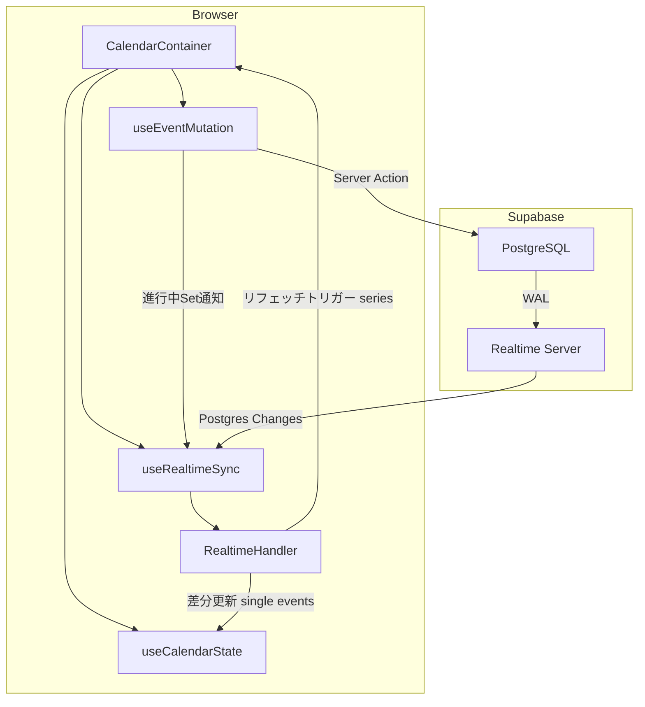
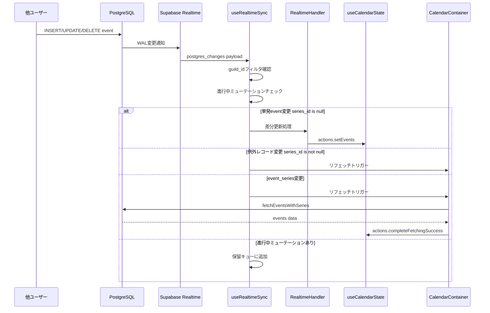
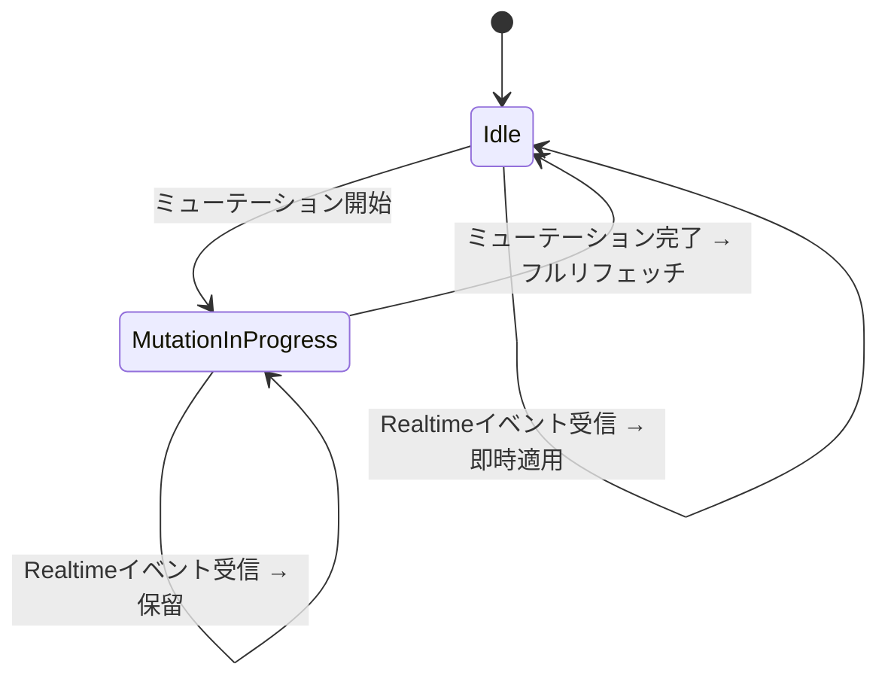

# Design Document: Calendar Realtime Sync

## Overview

**Purpose**: Supabase RealtimeのPostgres Changes機能を活用し、他のギルドメンバーがイベントを操作した際にカレンダーUIをリアルタイムで更新する機能を提供する。

**Users**: カレンダーを閲覧中のギルドメンバーが、ページリロードなしで他メンバーの変更を即座に確認できる。

**Impact**: 現在の手動リフェッチパターン（`fetchEvents()`呼び出し）にRealtime購読を追加し、イベント駆動の自動更新を実現する。既存のデータフェッチ・楽観的更新パターンは維持しつつ、Realtimeレイヤーを上乗せする。

### Goals
- eventsテーブルの変更を差分更新でカレンダーに即時反映する
- event_seriesテーブルの変更をリフェッチトリガーで反映する
- 楽観的UI更新とRealtime通知の競合を安全に解消する
- サブスクリプションのライフサイクルを適切に管理する

### Non-Goals
- オフラインファースト対応（PWA等）
- 複数ギルドの同時購読
- リアルタイムプレゼンス（誰が編集中か表示）
- Supabase Broadcast/Presenceチャネルの利用
- RLSポリシーのguild単位制限（現在のアプリケーション層認可を維持）

## Architecture

### Existing Architecture Analysis

現在のカレンダーデータフローは以下のパターンに従う:

- `CalendarContainer`（Client Component）が全状態を`useCalendarState()`で管理
- データ取得は`eventService.fetchEventsWithSeries()`で3クエリ実行（単発events + event_series + 例外records）
- ミューテーション後は`fetchEvents()`による手動リフェッチ
- 楽観的更新はドラッグ&ドロップ（`handleEventDrop`）のみ実装済み
- `AbortController`によるリクエストキャンセル対応済み

**維持するパターン**:
- `useCalendarState`のactions経由によるstate更新
- `fetchEventsWithSeries()`による初期データ取得・表示範囲変更時のリフェッチ
- Server Actions経由のミューテーション
- AbortControllerパターン

### Architecture Pattern & Boundary Map



**Architecture Integration**:
- **Selected pattern**: カスタムフック + ハイブリッド更新（単発events差分 + event_seriesリフェッチ）
- **Domain boundaries**: Realtime購読管理（`useRealtimeSync`）とイベント処理ロジック（`RealtimeHandler`）を分離
- **Existing patterns preserved**: `useCalendarState`のactions、`fetchEvents()`リフェッチ、Server Actionsミューテーション
- **New components rationale**: Realtime購読のライフサイクル管理と差分更新ロジックは既存フックに含めると責務過多になるため分離
- **Steering compliance**: Co-locationパターン（`hooks/calendar/`配下）、kebab-caseファイル名、`@/`パスエイリアス

### Technology Stack

| Layer | Choice / Version | Role in Feature | Notes |
|-------|------------------|-----------------|-------|
| Frontend | React 19 + Next.js 16 | カスタムフック・コンポーネント統合 | 既存スタック |
| Realtime | @supabase/supabase-js ^2.86.0 | Postgres Changes購読 | 追加依存なし |
| Data | PostgreSQL (Supabase) | events / event_series テーブル | REPLICA IDENTITY変更のみ |

## System Flows

### Realtimeイベント処理フロー



**Key Decisions**:
- 単発eventsのINSERT/UPDATE/DELETEは即座に差分適用（`toCalendarEvent()`変換後にstate更新）
- **eventsテーブルのペイロードで`series_id`が非nullの場合**（例外レコード）は差分更新をスキップし、リフェッチをトリガーする
- event_seriesの全操作はRRULE展開の複雑性のためフルリフェッチをトリガー
- 進行中ミューテーションのエンティティIDに一致するRealtimeイベントは保留し、ミューテーション完了後にフルリフェッチ

### 楽観的更新との競合解消フロー



## Requirements Traceability

| Requirement | Summary | Components | Interfaces | Flows |
|-------------|---------|------------|------------|-------|
| 1.1 | eventsテーブル購読開始 | useRealtimeSync | RealtimeSubscriptionConfig | Realtimeイベント処理 |
| 1.2 | event_seriesテーブル購読開始 | useRealtimeSync | RealtimeSubscriptionConfig | Realtimeイベント処理 |
| 1.3 | eventsテーブル変更通知 | useRealtimeSync, RealtimeHandler | RealtimePayload | Realtimeイベント処理 |
| 1.4 | event_seriesテーブル変更通知 | useRealtimeSync | RealtimePayload | Realtimeイベント処理 |
| 2.1 | guild_idフィルタリング | useRealtimeSync | RealtimeSubscriptionConfig | Realtimeイベント処理 |
| 2.2 | ギルド切替時の購読切替 | useRealtimeSync | — | ギルド切替 |
| 3.1 | events INSERT反映 | RealtimeHandler | EventChangeHandler | 差分更新 |
| 3.2 | events UPDATE反映 | RealtimeHandler | EventChangeHandler | 差分更新 |
| 3.3 | events DELETE反映 | RealtimeHandler | EventChangeHandler | 差分更新 |
| 3.4 | event_series INSERT反映 | useRealtimeSync | RefetchTrigger | リフェッチ |
| 3.5 | event_series UPDATE反映 | useRealtimeSync | RefetchTrigger | リフェッチ |
| 3.6 | event_series DELETE反映 | useRealtimeSync | RefetchTrigger | リフェッチ |
| 4.1 | 楽観的更新の二重反映防止 | useRealtimeSync | MutationTracker | 競合解消 |
| 4.2 | Realtimeデータ優先 | RealtimeHandler | — | 競合解消 |
| 4.3 | ミューテーション進行中の保留 | useRealtimeSync | MutationTracker | 競合解消 |
| 5.1 | アンマウント時購読解除 | useRealtimeSync | — | ライフサイクル |
| 5.2 | タブ非アクティブ時の購読維持 | useRealtimeSync | — | ライフサイクル |
| 5.3 | 再接続時のデータ同期 | useRealtimeSync | RefetchTrigger | 再接続 |
| 5.4 | 重複購読防止 | useRealtimeSync | — | ライフサイクル |

## Components and Interfaces

| Component | Domain/Layer | Intent | Req Coverage | Key Dependencies | Contracts |
|-----------|--------------|--------|--------------|-----------------|-----------|
| useRealtimeSync | Hooks / Realtime | Realtimeサブスクリプション管理・イベントルーティング | 1.1-1.4, 2.1-2.2, 4.1, 4.3, 5.1-5.4 | SupabaseClient (P0), CalendarActions (P0) | State, Event |
| RealtimeHandler | Lib / Calendar | 単発eventsの差分更新ロジック | 3.1-3.3, 4.2 | CalendarEvent types (P0) | Service |
| REPLICA IDENTITY Migration | DB / Migration | DELETEペイロードにold record含める | 1.3, 3.3 | — | — |

### Hooks / Realtime

#### useRealtimeSync

| Field | Detail |
|-------|--------|
| Intent | Supabase Realtimeチャネルの購読管理とイベントルーティング |
| Requirements | 1.1, 1.2, 1.3, 1.4, 2.1, 2.2, 4.1, 4.3, 5.1, 5.2, 5.3, 5.4 |

**Responsibilities & Constraints**
- guild_id単位でevents・event_seriesテーブルのPostgres Changesを購読する
- guildId変更時に旧チャネルを解除し、新チャネルを作成する
- 進行中ミューテーションのエンティティIDを追跡し、該当Realtimeイベントを保留する
- eventsテーブルのペイロードで`series_id`が非nullの場合はRealtimeHandlerをスキップし、リフェッチをトリガーする
- コンポーネントアンマウント時に全チャネルをクリーンアップする
- 同一テーブルへの重複購読を防止する
- `document.visibilitychange`イベントを監視し、`hidden`→`visible`遷移時にフルリフェッチをトリガーする（タブ復帰時のデータ同期）

**Dependencies**
- Inbound: CalendarContainer — フック呼び出し (P0)
- Outbound: useCalendarState actions — state更新 (P0)
- Outbound: fetchEvents — リフェッチトリガー (P0)
- External: @supabase/supabase-js Realtime — チャネル購読 (P0)

**Contracts**: Event [x] / State [x]

##### Event Contract

- **Subscribed events**:
  - `postgres_changes` on `public.events` (INSERT, UPDATE, DELETE)
  - `postgres_changes` on `public.event_series` (INSERT, UPDATE, DELETE)
- **Ordering / delivery guarantees**: Supabase Realtimeは順序保証あり（単一スレッド処理）。ネットワーク遅延によるイベント欠落はフルリフェッチで補完

##### State Management

```typescript
interface RealtimeSyncState {
  /** 購読ステータス */
  status: "disconnected" | "connecting" | "connected" | "error";
  /** 進行中ミューテーションのエンティティID集合 */
  pendingMutationIds: Set<string>;
}
```

- **Persistence**: メモリ内のみ（React state + ref）
- **Consistency**: guildId変更時にstateをリセット
- **Concurrency**: 単一チャネルインスタンスで順序保証

##### Service Interface

```typescript
interface UseRealtimeSyncParams {
  /** 現在のギルドID（nullの場合は購読しない） */
  guildId: string | null;
  /** Supabaseブラウザクライアント */
  supabase: SupabaseClient;
  /** 現在のイベント一覧（差分更新の基準） */
  events: CalendarEvent[];
  /** state更新用アクション */
  actions: CalendarActions;
  /** フルリフェッチのコールバック */
  onRefetchNeeded: () => void;
}

interface UseRealtimeSyncReturn {
  /** 購読ステータス */
  status: RealtimeSyncStatus;
  /** ミューテーション開始を通知（Realtimeイベント保留用） */
  trackMutationStart: (entityId: string) => void;
  /** ミューテーション完了を通知（保留解除 + リフェッチ） */
  trackMutationEnd: (entityId: string) => void;
}

type RealtimeSyncStatus = "disconnected" | "connecting" | "connected" | "error";
```

- **Preconditions**: `guildId`がnon-null、Supabaseクライアントが認証済み
- **Postconditions**: 購読解除後にチャネルリソースが解放される
- **Invariants**: 同一テーブルに対する購読チャネルは常に1つ以下

**Implementation Notes**
- **Integration**: CalendarContainerでフックを呼び出す。`useEventMutation`に`onMutationStart`/`onMutationEnd`コールバックオプションを追加し、内部で`trackMutationStart`/`trackMutationEnd`を呼び出す。これにより全ミューテーション経路（CalendarContainer直接呼び出し + EventDialog内部呼び出し）を網羅的に追跡できる
- **Mutation tracking integration**: `useEventMutation`のパラメータに以下を追加する:

```typescript
interface UseEventMutationParams {
  guildId: string | null;
  /** Realtime競合回避用: ミューテーション開始時に呼ばれる */
  onMutationStart?: (entityId: string) => void;
  /** Realtime競合回避用: ミューテーション完了時に呼ばれる */
  onMutationEnd?: (entityId: string) => void;
}
```

- **Validation**: guildIdがnull/空文字の場合は購読を開始しない。guild_idフィルタはINSERT/UPDATEに`filter: 'guild_id=eq.xxx'`を使用し、DELETEはローカルstate参照でフィルタする
- **Visibility change**: `document.addEventListener('visibilitychange', ...)`で`hidden`→`visible`遷移を検知し、`onRefetchNeeded()`を呼び出す。WebSocket接続が維持されていても、ブラウザがバックグラウンドでメッセージを破棄する可能性があるため、タブ復帰時は常にリフェッチする
- **Risks**: Supabase Realtime接続のレート制限（100ユーザー × 変更 = 100回の認可チェック）。小規模ギルドでは問題なし

### Lib / Calendar

#### RealtimeHandler

| Field | Detail |
|-------|--------|
| Intent | 単発eventsのRealtime変更ペイロードをCalendarEvent差分に変換する |
| Requirements | 3.1, 3.2, 3.3, 4.2 |

**Responsibilities & Constraints**
- Realtimeペイロード（`EventRecord`形式）を`CalendarEvent`に変換する
- INSERT: 新規イベントをevents配列に追加する
- UPDATE: 既存イベントを新データで置換する
- DELETE: 該当イベントをevents配列から削除する
- 繰り返しイベント（series_id非null）の変更は処理対象外（リフェッチで対応）

**Dependencies**
- Inbound: useRealtimeSync — ペイロード受渡し (P0)
- Outbound: toCalendarEvent — レコード変換 (P0)

**Contracts**: Service [x]

##### Service Interface

```typescript
interface RealtimeEventHandlers {
  /** INSERT: 新規イベントを追加した配列を返す */
  handleInsert(
    currentEvents: CalendarEvent[],
    newRecord: EventRecord
  ): CalendarEvent[];

  /** UPDATE: 該当イベントを更新した配列を返す */
  handleUpdate(
    currentEvents: CalendarEvent[],
    updatedRecord: EventRecord
  ): CalendarEvent[];

  /** DELETE: 該当イベントを除外した配列を返す */
  handleDelete(
    currentEvents: CalendarEvent[],
    oldRecord: { id: string }
  ): CalendarEvent[];
}
```

- **Preconditions**: `currentEvents`は有効なCalendarEvent配列。`newRecord`/`updatedRecord`はEventRecord形式
- **Postconditions**: 返却配列は新しい参照（immutable update）
- **Invariants**: 同一IDのイベントは配列内に1つのみ

**Implementation Notes**
- **Integration**: `toCalendarEvent()`（既存関数）を再利用してEventRecord→CalendarEvent変換を行う
- **Validation**: INSERT時に重複ID（既にstate内に存在）の場合はUPDATEとして処理する（楽観的更新との整合性）
- **Risks**: event_seriesの例外レコード（`series_id`非null）がeventsテーブルに挿入された場合はリフェッチをトリガーする必要がある

### DB / Migration

#### REPLICA IDENTITY Migration

| Field | Detail |
|-------|--------|
| Intent | DELETE/UPDATEのRealtimeペイロードにold recordを含める |
| Requirements | 1.3, 3.3 |

**Implementation Notes**
- `ALTER TABLE events REPLICA IDENTITY FULL` と `ALTER TABLE event_series REPLICA IDENTITY FULL` を設定する
- RLS有効テーブルではDELETEの`old`にPKのみ含まれる制約があるため、DELETEのguild_idフィルタはローカルstate参照で行う
- REPLICA IDENTITY FULLはWALサイズを増加させるが、eventsテーブルの更新頻度では問題にならない

## Data Models

### Realtime Payload Types

既存の`EventRecord`と`EventSeriesRecord`をペイロード型として再利用する。新規型定義は以下のみ:

```typescript
/** Supabase Realtime Postgres Changes ペイロードの型定義 */
type RealtimePostgresChangesPayload<T extends Record<string, unknown>> =
  | { eventType: "INSERT"; new: T; old: Record<string, never> }
  | { eventType: "UPDATE"; new: T; old: Partial<T> }
  | { eventType: "DELETE"; new: Record<string, never>; old: { id: string } };

/** events テーブルの Realtime ペイロード */
type EventRealtimePayload = RealtimePostgresChangesPayload<EventRecord>;

/** event_series テーブルの Realtime ペイロード */
type SeriesRealtimePayload = RealtimePostgresChangesPayload<EventSeriesRecord>;
```

### Physical Data Model

**変更対象**: REPLICA IDENTITY設定のみ。テーブルスキーマの変更なし。

```sql
-- events テーブル: UPDATE/DELETE の old record を Realtime で受信可能にする
ALTER TABLE events REPLICA IDENTITY FULL;

-- event_series テーブル: 同様
ALTER TABLE event_series REPLICA IDENTITY FULL;
```

## Error Handling

### Error Strategy

Realtime固有のエラーは既存の`CalendarError`体系に統合する。

### Error Categories and Responses

**接続エラー（Realtime）**:
- WebSocket接続失敗 → `status: "error"`を設定し、既存の手動リフェッチで機能を維持（グレースフルデグラデーション）
- 接続切断 → Supabase SDK自動再接続を利用。再接続成功時にフルリフェッチをトリガー

**ペイロードエラー**:
- 不正なペイロード（型不一致） → 該当イベントを無視し、コンソールに警告ログ
- guild_id不一致（DELETEフィルタ漏れ） → 該当イベントを無視

**State更新エラー**:
- toCalendarEvent変換失敗 → 該当イベントを無視し、フルリフェッチをトリガー

### Monitoring

- `console.warn`でRealtime接続エラー・ペイロードエラーをログ出力
- 将来的にSentry統合時にRealtimeエラーイベントを送信

## Testing Strategy

### Unit Tests
- `RealtimeHandler.handleInsert`: 新規EventRecordをCalendarEvent配列に追加
- `RealtimeHandler.handleUpdate`: 既存IDのイベントを更新
- `RealtimeHandler.handleDelete`: 指定IDのイベントを配列から除外
- `RealtimeHandler.handleInsert`（重複ID）: UPDATEとして処理

### Integration Tests
- `useRealtimeSync`: guildId変更時にチャネルが切り替わること
- `useRealtimeSync`: アンマウント時にチャネルが解除されること
- `useRealtimeSync`: 進行中ミューテーションIDのRealtimeイベントが保留されること
- `useRealtimeSync`: eventsテーブルの例外レコード（series_id非null）受信時にリフェッチがトリガーされること
- `useRealtimeSync`: visibilitychange（hidden→visible）でリフェッチがトリガーされること
- `useRealtimeSync` + `CalendarContainer`: eventsテーブルINSERTでカレンダーにイベントが追加されること

### E2E Tests
- カレンダー表示中に外部からeventsテーブルにINSERTし、UIに即座に反映されること（Playwright + Supabase直接操作）
