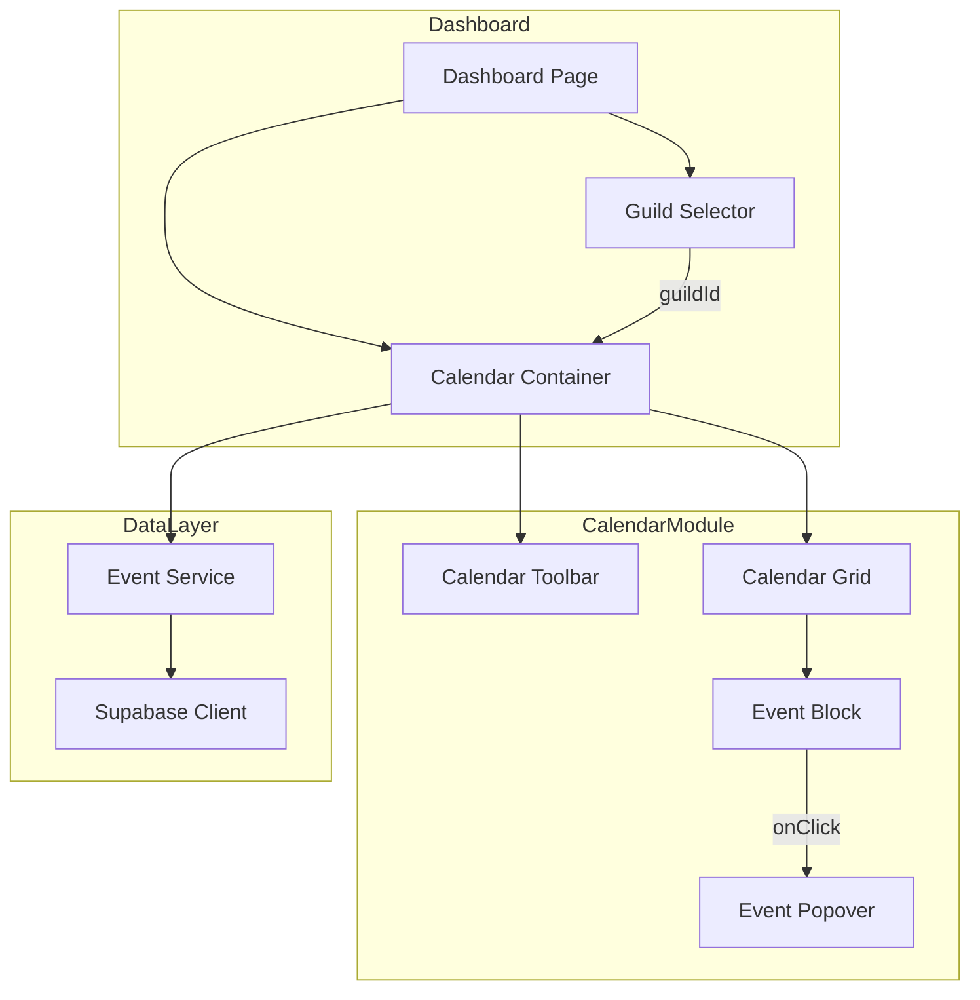
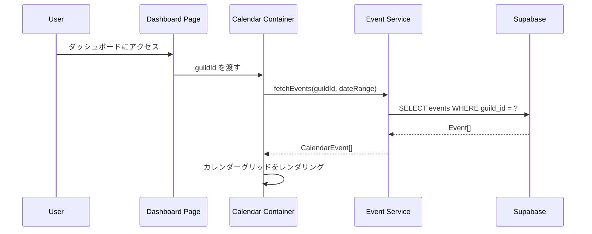
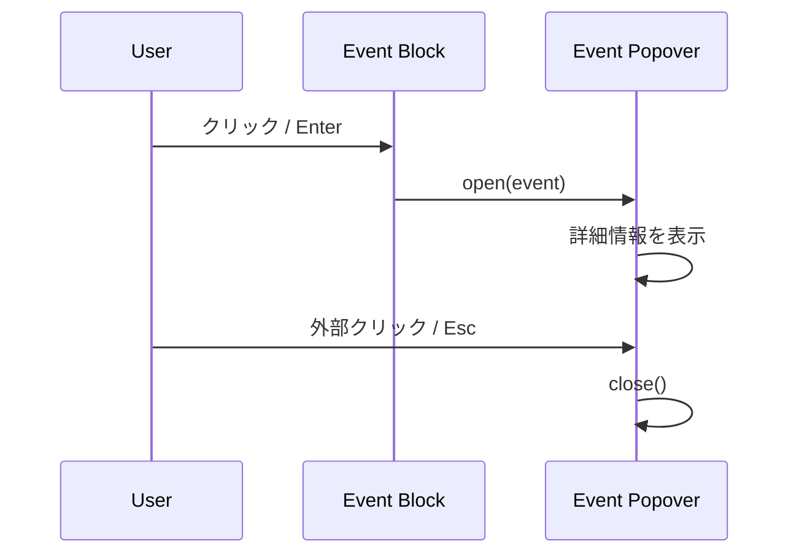
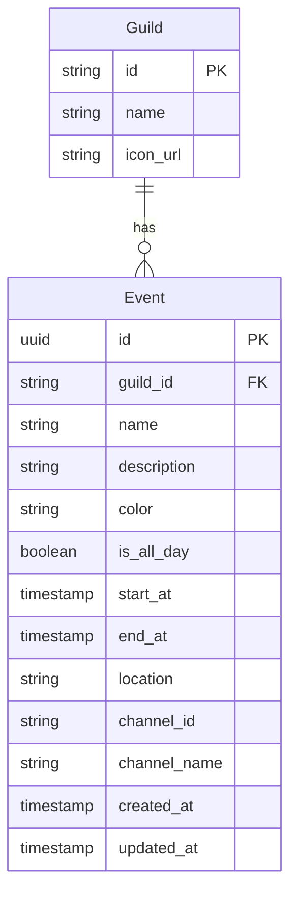

# Technical Design Document

## Overview

**Purpose**: 本機能は、DiscalendarダッシュボードにGoogleカレンダー風のカレンダーUIを提供する。ユーザーは選択したギルド（Discordサーバー）のイベントを日/週/月ビューで視覚的に把握できる。

**Users**: Discordサーバーの管理者およびメンバーが、コミュニティのイベントスケジュールを確認するために使用する。

**Impact**: 既存のダッシュボードページ（`/app/dashboard/page.tsx`）にカレンダーコンポーネントを追加し、ギルド選択機能と連携してイベントを表示する。

### Goals
- 日/週/月のビュー切り替えによる柔軟なスケジュール確認
- 直感的な日付ナビゲーション（前後移動、今日へジャンプ）
- イベント詳細のポップオーバー表示によるコンテキスト維持
- デスクトップ/タブレット/モバイル対応のレスポンシブUI
- キーボード操作とスクリーンリーダー対応によるアクセシビリティ

### Non-Goals
- イベントの作成・編集・削除（別Specで対応）
- ドラッグ&ドロップによる予定変更（別Specで対応）
- 複数日にまたがるイベントの連続表示（別Specで対応）
- 複数ギルドのイベント統合表示

## Architecture

> 詳細な調査ログと比較検討は`research.md`を参照。本セクションでは設計判断と構造のみ記述。

### Architecture Pattern & Boundary Map



**Architecture Integration**:
- **Selected pattern**: コンポーネント階層構造（Container/Presentational Pattern）
- **Domain/feature boundaries**: カレンダーモジュールはダッシュボードドメイン内の独立した機能単位として設計
- **Existing patterns preserved**: Server/Client Component分離、shadcn/ui UIパターン、Supabaseクライアントパターン
- **New components rationale**: カレンダー専用コンポーネント群を`/components/calendar/`に配置し、再利用性と保守性を確保
- **Steering compliance**: TypeScript strict mode、shadcn/ui + Tailwind CSS、Supabase SSR統合パターンに準拠

### Technology Stack

| Layer | Choice / Version | Role in Feature | Notes |
|-------|------------------|-----------------|-------|
| Frontend | react-big-calendar ^1.x | カレンダーグリッド描画・ビュー切り替え | date-fns localizer使用 |
| Frontend | date-fns ^3.x | 日付計算・フォーマット・日本語ロケール | Tree-shakeable |
| Frontend | @radix-ui/react-popover | イベント詳細ポップオーバー | shadcn/ui popover経由 |
| Data / Storage | Supabase (PostgreSQL) | イベントデータ永続化 | 既存eventsテーブル使用 |

> ライブラリ選定の詳細比較は`research.md`のArchitecture Pattern Evaluationセクションを参照。

## System Flows

### カレンダー初期化フロー



**Key Decisions**:
- Server ComponentでSupabaseクエリを実行し、初期データをClient Componentに渡す
- ビューモード変更・日付ナビゲーション時はClient側でデータを再取得

### イベント詳細表示フロー



## Requirements Traceability

| Requirement | Summary | Components | Interfaces | Flows |
|-------------|---------|------------|------------|-------|
| 1.1-1.5 | ビューモード切り替え（日/週/月） | CalendarToolbar, CalendarGrid | ViewMode, onViewChange | 初期化フロー |
| 2.1-2.5 | 日付ナビゲーション | CalendarToolbar | onNavigate, DateRange | 初期化フロー |
| 3.1-3.7 | イベントのグリッド表示 | CalendarGrid, EventBlock | CalendarEvent, EventBlockProps | 初期化フロー |
| 4.1-4.7 | イベント詳細ポップオーバー | EventPopover | EventPopoverProps | 詳細表示フロー |
| 5.1-5.4 | ギルド選択連携 | CalendarContainer | GuildContext, fetchEvents | 初期化フロー |
| 6.1-6.5 | レスポンシブデザイン | CalendarContainer, CalendarToolbar | useMediaQuery | - |
| 7.1-7.4 | 今日の日付ハイライト | CalendarGrid | todayAccessor, dayPropGetter | - |
| 8.1-8.5 | アクセシビリティ対応 | 全コンポーネント | ARIA attributes, keyboard handlers | - |
| 9.1-9.6 | 終日イベント表示 | CalendarGrid, EventBlock | allDayAccessor | - |

## Components and Interfaces

| Component | Domain/Layer | Intent | Req Coverage | Key Dependencies (P0/P1) | Contracts |
|-----------|--------------|--------|--------------|--------------------------|-----------|
| CalendarContainer | UI/Container | カレンダー全体の状態管理とデータ取得 | 5.1-5.4, 6.1-6.5 | EventService (P0), GuildContext (P0) | State |
| CalendarToolbar | UI/Presentation | ビュー切り替え・ナビゲーションUI | 1.1-1.5, 2.1-2.5 | CalendarContainer (P1) | - |
| CalendarGrid | UI/Presentation | カレンダーグリッドの描画 | 3.1-3.7, 7.1-7.4, 8.1-8.5, 9.1-9.6 | react-big-calendar (P0) | - |
| EventBlock | UI/Presentation | 個別イベントの表示 | 3.2-3.7, 9.1-9.6 | CalendarGrid (P1) | - |
| EventPopover | UI/Presentation | イベント詳細のポップオーバー | 4.1-4.7 | Radix Popover (P0) | - |
| EventService | Logic/Service | イベントデータの取得・変換 | 5.1-5.4 | Supabase Client (P0) | Service |

### UI / Presentation Layer

#### CalendarContainer

| Field | Detail |
|-------|--------|
| Intent | カレンダー全体の状態管理、データフェッチ、子コンポーネントへのデータ配布 |
| Requirements | 5.1, 5.2, 5.3, 5.4, 6.1, 6.2, 6.3, 6.4, 6.5 |

**Responsibilities & Constraints**
- ビューモード（day/week/month）と選択日付の状態管理
- ギルドIDに基づくイベントデータの取得と更新
- レスポンシブブレークポイントに応じたデフォルトビュー制御
- ローディング・エラー状態の管理

**Dependencies**
- Inbound: DashboardPage — guildId prop (P0)
- Outbound: EventService — イベントデータ取得 (P0)
- External: react-big-calendar — カレンダーコア機能 (P0)

**Contracts**: State [x]

##### State Management

```typescript
/** ビューモードの型定義 */
type ViewMode = 'day' | 'week' | 'month';

/** カレンダーコンテナの状態 */
interface CalendarState {
  /** 現在のビューモード */
  viewMode: ViewMode;
  /** 選択中の日付（ISO 8601形式） */
  selectedDate: Date;
  /** 表示中のイベント一覧 */
  events: CalendarEvent[];
  /** ローディング状態 */
  isLoading: boolean;
  /** エラー状態 */
  error: CalendarError | null;
}

/** カレンダーエラーの型定義 */
interface CalendarError {
  code: 'FETCH_FAILED' | 'NETWORK_ERROR' | 'UNAUTHORIZED';
  message: string;
}
```

- **State model**: useStateでローカル管理、URLパラメータでビューモード・日付を永続化
- **Persistence**: URLパラメータ（`?view=month&date=2025-12-01`）
- **Concurrency**: イベント取得中の重複リクエストはAbortControllerでキャンセル

**Implementation Notes**
- Integration: Next.js App Router の useSearchParams でURL状態と同期
- Validation: 日付の有効性チェック、不正な値は今日にフォールバック
- Risks: URL操作時のリレンダリング頻度に注意、必要に応じてuseTransition使用

---

#### CalendarToolbar

| Field | Detail |
|-------|--------|
| Intent | ビュー切り替えボタンと日付ナビゲーションコントロールの提供 |
| Requirements | 1.1, 1.2, 1.3, 1.4, 1.5, 2.1, 2.2, 2.3, 2.4 |

**Responsibilities & Constraints**
- 日/週/月ビューの切り替えボタン表示
- 前へ/次へ/今日ボタンによる日付ナビゲーション
- 現在表示期間のラベル表示（例: 「2025年12月」）
- モバイルでは簡略化した表示

**Dependencies**
- Inbound: CalendarContainer — viewMode, selectedDate, handlers (P1)

**Contracts**: なし（Presentationalコンポーネント）

```typescript
/** CalendarToolbarのProps */
interface CalendarToolbarProps {
  /** 現在のビューモード */
  viewMode: ViewMode;
  /** 選択中の日付 */
  selectedDate: Date;
  /** ビューモード変更ハンドラー */
  onViewChange: (view: ViewMode) => void;
  /** ナビゲーションハンドラー */
  onNavigate: (action: 'PREV' | 'NEXT' | 'TODAY') => void;
  /** 現在の画面幅がモバイルかどうか */
  isMobile: boolean;
}
```

**Implementation Notes**
- Integration: shadcn/ui Button, DropdownMenuを使用
- Validation: なし
- Risks: モバイルでの操作性確認が必要

---

#### CalendarGrid

| Field | Detail |
|-------|--------|
| Intent | react-big-calendarをラップし、イベントをグリッド上に描画 |
| Requirements | 3.1, 3.2, 3.3, 3.4, 3.5, 3.6, 3.7, 7.1, 7.2, 7.3, 7.4, 8.1, 8.2, 8.3, 8.4, 8.5, 9.1, 9.2, 9.3, 9.4, 9.5, 9.6 |

**Responsibilities & Constraints**
- react-big-calendarの設定とレンダリング
- 今日の日付ハイライト（dayPropGetter）
- 終日イベントの専用エリア表示
- 同一時間帯の重複イベント処理
- ARIAグリッドロールの適用

**Dependencies**
- Inbound: CalendarContainer — events, viewMode, selectedDate (P0)
- External: react-big-calendar — カレンダーエンジン (P0)
- External: date-fns — 日付localizer (P0)

**Contracts**: なし（Presentationalコンポーネント）

```typescript
/** CalendarGridのProps */
interface CalendarGridProps {
  /** 表示するイベント一覧 */
  events: CalendarEvent[];
  /** 現在のビューモード */
  viewMode: ViewMode;
  /** 選択中の日付 */
  selectedDate: Date;
  /** イベントクリックハンドラー */
  onEventClick: (event: CalendarEvent, element: HTMLElement) => void;
  /** 日付変更ハンドラー */
  onDateChange: (date: Date) => void;
  /** 今日の日付 */
  today: Date;
}

/** カレンダーイベントの型定義 */
interface CalendarEvent {
  /** イベントID */
  id: string;
  /** イベント名 */
  title: string;
  /** 開始日時 */
  start: Date;
  /** 終了日時 */
  end: Date;
  /** 終日イベントフラグ */
  allDay: boolean;
  /** イベントカラー */
  color: string;
  /** 説明文（オプション） */
  description?: string;
  /** 場所情報（オプション） */
  location?: string;
  /** Discordチャンネル情報（オプション） */
  channel?: {
    id: string;
    name: string;
  };
}
```

**Implementation Notes**
- Integration: `react-big-calendar/lib/css/react-big-calendar.css`をインポート、Tailwindでオーバーライド
- Validation: イベントの日時整合性（start <= end）
- Risks: 大量イベント時のパフォーマンス、月ビューでのイベント表示数制限

---

#### EventBlock

| Field | Detail |
|-------|--------|
| Intent | カレンダーグリッド内の個別イベント表示 |
| Requirements | 3.2, 3.3, 3.4, 3.5, 3.7, 9.1, 9.2, 9.3, 9.4 |

**Responsibilities & Constraints**
- イベント名の表示
- 終日イベントと時間指定イベントの視覚的区別
- ビューモードに応じた表示形式の変更
- クリック・キーボード操作でのイベント選択

```typescript
/** EventBlockのProps（react-big-calendarのeventPropGetter経由） */
interface EventBlockProps {
  /** イベントデータ */
  event: CalendarEvent;
  /** 開始日時文字列 */
  start: string;
  /** 終了日時文字列 */
  end: string;
  /** 終日フラグ */
  isAllDay: boolean;
}
```

**Implementation Notes**
- Integration: react-big-calendarのcomponents.eventプロパティでカスタムレンダラーを指定
- Risks: 長いイベント名の切り詰め処理

---

#### EventPopover

| Field | Detail |
|-------|--------|
| Intent | イベント詳細情報のポップオーバー表示 |
| Requirements | 4.1, 4.2, 4.3, 4.4, 4.5, 4.6, 4.7, 9.5 |

**Responsibilities & Constraints**
- イベント名、開始/終了日時、説明文の表示
- 場所情報・Discordチャンネル情報の条件付き表示
- 終日イベントの場合は「終日」と表示
- クリック位置近くへの配置（画面外はみ出し防止）
- Escキー・外部クリックでの閉じ動作

**Dependencies**
- External: @radix-ui/react-popover — ポップオーバー基盤 (P0)

```typescript
/** EventPopoverのProps */
interface EventPopoverProps {
  /** 表示対象のイベント（nullで非表示） */
  event: CalendarEvent | null;
  /** アンカー要素 */
  anchorElement: HTMLElement | null;
  /** 閉じるハンドラー */
  onClose: () => void;
  /** ポップオーバーの開閉状態 */
  open: boolean;
}
```

**Implementation Notes**
- Integration: shadcn/ui Popoverコンポーネントをベースに実装
- Validation: なし
- Risks: モバイルでの表示位置調整

---

### Logic / Service Layer

#### EventService

| Field | Detail |
|-------|--------|
| Intent | Supabaseからのイベントデータ取得と型変換 |
| Requirements | 5.1, 5.3, 5.4 |

**Responsibilities & Constraints**
- ギルドIDと日付範囲に基づくイベント取得
- DBレコードからCalendarEvent型への変換
- エラーハンドリングとリトライロジック

**Dependencies**
- External: Supabase Client — データベースアクセス (P0)

**Contracts**: Service [x]

##### Service Interface

```typescript
/** イベント取得パラメータ */
interface FetchEventsParams {
  /** ギルドID */
  guildId: string;
  /** 取得開始日 */
  startDate: Date;
  /** 取得終了日 */
  endDate: Date;
}

/** イベント取得結果 */
type FetchEventsResult =
  | { success: true; data: CalendarEvent[] }
  | { success: false; error: CalendarError };

/** EventServiceインターフェース */
interface EventServiceInterface {
  /**
   * 指定ギルドのイベントを取得
   * @param params - 取得パラメータ
   * @returns イベント一覧または エラー
   */
  fetchEvents(params: FetchEventsParams): Promise<FetchEventsResult>;
}
```

- **Preconditions**: guildIdが有効なUUID、startDate <= endDate
- **Postconditions**: 成功時はCalendarEvent[]を返却、失敗時はエラー情報を返却
- **Invariants**: 返却されるイベントは必ず指定期間内

**Implementation Notes**
- Integration: Server Component内で呼び出し、またはClient ComponentからServer Actionを経由
- Validation: 日付パラメータのバリデーション
- Risks: Supabase接続エラー時のリトライ戦略

## Data Models

### Domain Model



**Aggregates**: Event（イベント単体で完結、Guild参照のみ）

**Entities**:
- Event: イベントエンティティ（id, guild_id, name, description, color, is_all_day, start_at, end_at, location, channel_id, channel_name, created_at, updated_at）

**Business Rules & Invariants**:
- `start_at` <= `end_at` でなければならない
- `is_all_day` が true の場合、時刻部分は 00:00:00 に正規化
- `color` は有効な HEX カラーコード

### Logical Data Model

**Structure Definition**:
- events テーブルは既存テーブルを使用（本Specでは読み取りのみ）
- guild_id で外部キー制約（Discordサーバーと紐づけ）

**Consistency & Integrity**:
- イベント取得はRead-only操作のみ（本Specではスコープ外の書き込み操作なし）
- created_at, updated_at はDB側で自動管理

### Data Contracts & Integration

**API Data Transfer**

```typescript
/** Supabaseから取得するイベントレコード型 */
interface EventRecord {
  id: string;
  guild_id: string;
  name: string;
  description: string | null;
  color: string;
  is_all_day: boolean;
  start_at: string; // ISO 8601
  end_at: string;   // ISO 8601
  location: string | null;
  channel_id: string | null;
  channel_name: string | null;
  created_at: string;
  updated_at: string;
}

/** EventRecord から CalendarEvent への変換 */
function toCalendarEvent(record: EventRecord): CalendarEvent {
  return {
    id: record.id,
    title: record.name,
    start: new Date(record.start_at),
    end: new Date(record.end_at),
    allDay: record.is_all_day,
    color: record.color,
    description: record.description ?? undefined,
    location: record.location ?? undefined,
    channel: record.channel_id && record.channel_name
      ? { id: record.channel_id, name: record.channel_name }
      : undefined,
  };
}
```

## Error Handling

### Error Strategy

カレンダー機能は表示専用のため、エラー時はユーザーに明確なフィードバックを提供し、再試行オプションを提示する。

### Error Categories and Responses

**User Errors (4xx)**:
- ギルド未選択 → 空のカレンダーグリッドを表示（Requirement 5.2）
- 無効な日付パラメータ → 今日の日付にフォールバック

**System Errors (5xx)**:
- Supabase接続エラー → エラーメッセージ + 再試行ボタン表示（Requirement 5.4）
- ネットワークタイムアウト → オフライン状態の通知

**Business Logic Errors (422)**:
- 該当期間にイベントなし → 空のカレンダー表示（正常動作）

### Monitoring

- エラー発生時はコンソールにログ出力（本番環境では外部モニタリングサービス連携を検討）
- イベント取得の成功/失敗をトラッキング

## Testing Strategy

### Unit Tests
- `toCalendarEvent` 変換関数のテスト（正常系・null値・境界値）
- `CalendarToolbar` のビュー切り替えロジック
- 日付計算ユーティリティ関数

### Integration Tests
- `EventService.fetchEvents` のSupabaseクエリ統合テスト
- `CalendarContainer` の状態管理とデータフロー
- URLパラメータとカレンダー状態の同期

### E2E/UI Tests
- ビューモード切り替え（日→週→月）
- 日付ナビゲーション（前へ/次へ/今日）
- イベントクリック → ポップオーバー表示 → 閉じる
- レスポンシブ表示（デスクトップ/タブレット/モバイル）

### Accessibility Tests
- キーボードナビゲーション（Tab, 矢印キー, Enter, Escape）
- スクリーンリーダーでのイベント読み上げ
- カラーコントラスト比の検証

## Optional Sections

### Security Considerations

- イベントデータはギルドメンバーのみアクセス可能（Supabase RLS）
- ユーザーセッションに基づくギルドアクセス権限の検証
- XSS対策: イベント名・説明文のサニタイズ

### Performance & Scalability

- 表示期間外のイベントは取得しない（日付範囲クエリ）
- 月ビューでは1日あたり最大3件表示、残りは「+N件」表示
- 大規模ギルド（1000+イベント）での仮想スクロール検討（将来課題）

**Target Metrics**:
- 初期ロード: 2秒以内
- ビュー切り替え: 500ms以内
- イベントポップオーバー表示: 100ms以内
