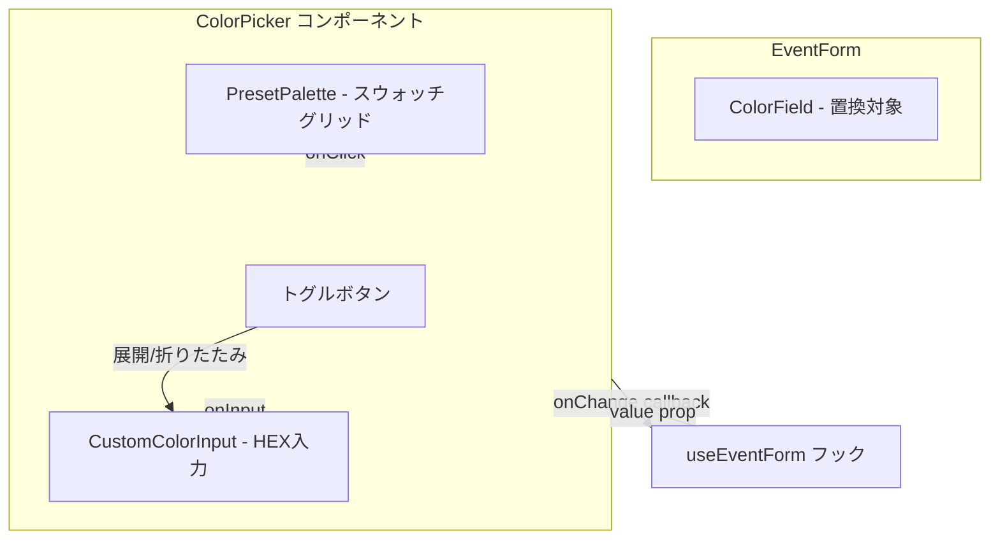

# Technical Design: color-palette-picker

## Overview

**Purpose**: イベント作成・編集フォームの色選択UIを、HTML5標準カラーピッカーからプリセットカラーパレット＋カスタムHEX入力のハイブリッドUIに置換する。ユーザーがワンクリックで直感的に色を選択でき、必要に応じてカスタムカラーも指定できるUIを提供する。

**Users**: Discordコミュニティのイベント管理者がイベント作成・編集時に色を選択する。

**Impact**: `components/calendar/event-form.tsx` の `ColorField` を新しい `ColorPicker` コンポーネントに置換する。DBスキーマ・API・Server Actionsへの変更は不要。

### Goals
- プリセット9色のカラーパレットによるワンクリック色選択
- カスタムHEXコード入力による任意色指定
- 選択状態の明確な視覚フィードバック
- キーボード・スクリーンリーダー対応のアクセシビリティ

### Non-Goals
- カラーピッカーのドラッグ操作（HSLスライダー等）
- プリセットカラーのユーザーカスタマイズ機能
- DBスキーマの変更（`VARCHAR(7)` のまま維持）
- 透明度（アルファチャンネル）対応

## Architecture

### Existing Architecture Analysis

現在の色選択は `event-form.tsx` 内の `ColorField` 関数コンポーネントが `<input type="color">` をレンダリングしている。フォーム状態管理は `useEventForm` フックが担当し、`handleChange("color", value)` で値を受け取る。

**維持するパターン**:
- Controlled Component パターン（`value` + `onChange`）
- `useEventForm` フックとの統合インターフェース
- Co-locationパターン（コンポーネント + テスト + ストーリーを同ディレクトリに配置）

### Architecture Pattern & Boundary Map



**Architecture Integration**:
- Selected pattern: Controlled Component（既存フォームフィールドと同一パターン）
- Domain boundary: `components/calendar/` 配下にColorPickerを配置（カレンダー機能ドメイン）
- Existing patterns preserved: `FormFieldProps` 型、`Label` + フィールドの構成
- New components rationale: ColorPickerは汎用的な色選択UIとして独立コンポーネント化

### Technology Stack

| Layer | Choice / Version | Role in Feature | Notes |
|-------|------------------|-----------------|-------|
| Frontend | React 19 + TypeScript | コンポーネント実装 | Controlled Component |
| UI | Tailwind CSS 3 | スタイリング | グリッドレイアウト、リングインジケータ |
| Icons | lucide-react (`Check`) | 選択チェックマーク | プロジェクト既存依存 |
| Testing | Vitest + Testing Library | ユニットテスト | click/keyboard イベントテスト |
| Storybook | Storybook v10 (CSF3) | コンポーネントカタログ | autodocs、バリアント展示 |

## Requirements Traceability

| Requirement | Summary | Components | Interfaces | Flows |
|-------------|---------|------------|------------|-------|
| 1.1 | プリセット9色表示 | ColorPicker | `PRESET_COLORS` 定数 | - |
| 1.2 | グリッドレイアウト | ColorPicker | - | - |
| 1.3 | 固定順序表示 | ColorPicker | `PRESET_COLORS` 配列順序 | - |
| 2.1 | クリック選択通知 | ColorPicker | `onChange` callback | 選択フロー |
| 2.2 | チェックマーク表示 | ColorPicker | lucide-react `Check` | - |
| 2.3 | リングインジケータ | ColorPicker | Tailwind `ring` utility | - |
| 2.4 | 初期値の選択表示 | ColorPicker | `value` prop | - |
| 2.5 | プリセット外の値処理 | ColorPicker | `isPresetColor()` 判定 | - |
| 3.1 | カスタム入力トグル | ColorPicker | `showCustomInput` state | トグルフロー |
| 3.2 | HEX入力フィールド表示 | ColorPicker | `<Input>` | - |
| 3.3 | 有効HEX入力通知 | ColorPicker | `isValidHex()` | 入力フロー |
| 3.4 | カラープレビュー | ColorPicker | インラインスウォッチ | - |
| 3.5 | 無効HEX入力の無視 | ColorPicker | `isValidHex()` | - |
| 4.1 | input type=color 置換 | EventForm (ColorField) | ColorPicker import | - |
| 4.2 | handleChange接続 | EventForm (ColorField) | `onChange` → `handleChange` | - |
| 4.3 | 作成時デフォルトカラー | EventForm | `useEventForm` デフォルト値 | - |
| 4.4 | 編集時既存カラー | EventForm | `defaultValues.color` | - |
| 4.5 | #RRGGBB形式維持 | ColorPicker | `onChange(hex: string)` | - |
| 5.1 | キーボードフォーカス | ColorPicker | `tabIndex`, `onKeyDown` | - |
| 5.2 | aria-label | ColorPicker | `PresetColor.label` | - |
| 5.3 | Enter/Space選択 | ColorPicker | `onKeyDown` handler | - |
| 5.4 | aria-checked | ColorPicker | `role="radio"` | - |

## Components and Interfaces

| Component | Domain/Layer | Intent | Req Coverage | Key Dependencies | Contracts |
|-----------|-------------|--------|--------------|------------------|-----------|
| ColorPicker | UI / calendar | プリセットパレット＋カスタムHEX入力のハイブリッド色選択 | 1.1-1.3, 2.1-2.5, 3.1-3.5, 5.1-5.4 | lucide-react (P2) | State |
| ColorField (修正) | UI / calendar | EventForm内のColorPicker統合ラッパー | 4.1-4.5 | ColorPicker (P0), useEventForm (P0) | - |

### UI / Calendar

#### ColorPicker

| Field | Detail |
|-------|--------|
| Intent | プリセットカラーパレットとカスタムHEX入力を統合した色選択コンポーネント |
| Requirements | 1.1-1.3, 2.1-2.5, 3.1-3.5, 5.1-5.4 |

**Responsibilities & Constraints**
- プリセット9色のカラースウォッチをグリッド表示する
- 選択状態をチェックマーク＋リングで視覚的に示す
- カスタムHEX入力のトグル表示・バリデーションを行う
- Controlled Componentとして `value` / `onChange` で外部と通信する
- 色の値は常に `#RRGGBB` 形式（7文字）で出力する

**Dependencies**
- External: lucide-react `Check` — 選択チェックマークアイコン (P2)
- External: `@/components/ui/input` — HEX入力フィールド (P1)
- External: `@/components/ui/button` — トグルボタン (P1)

**Contracts**: State [x]

##### State Management

```typescript
/** プリセットカラー定義 */
interface PresetColor {
  readonly label: string;  // 表示名 (例: "Blue")
  readonly value: string;  // HEXコード (例: "#3B82F6")
}

/** プリセットカラー配列（順序固定） */
const PRESET_COLORS: readonly PresetColor[] = [
  { label: "Blue",   value: "#3B82F6" },
  { label: "Green",  value: "#22C55E" },
  { label: "Amber",  value: "#F59E0B" },
  { label: "Red",    value: "#EF4444" },
  { label: "Violet", value: "#8B5CF6" },
  { label: "Orange", value: "#F97316" },
  { label: "Pink",   value: "#EC4899" },
  { label: "Cyan",   value: "#06B6D4" },
  { label: "Gray",   value: "#6B7280" },
] as const;

/** ColorPicker Props */
interface ColorPickerProps {
  /** 現在選択されている色（#RRGGBB形式） */
  value: string;
  /** 色が変更された時のコールバック */
  onChange: (value: string) => void;
  /** 無効化状態 */
  disabled?: boolean;
}
```

- State model:
  - `showCustomInput: boolean` — カスタム入力フィールドの表示/非表示（内部状態）
  - `customInputValue: string` — HEX入力フィールドの入力中テキスト（内部状態）
  - `value` / `onChange` — 選択色（外部管理、Controlled）
- Persistence: なし（フォームの一部として親が管理）
- Concurrency: 単一ユーザー操作のみ

**Implementation Notes**
- Integration: `event-form.tsx` の `ColorField` 内で `<ColorPicker value={form.values.color} onChange={(v) => form.handleChange("color", v)} />` として使用
- Validation: `isValidHex()` ユーティリティで `/^#[0-9A-Fa-f]{6}$/` を検証。無効値は `onChange` を呼ばず無視
- Accessibility: `role="radiogroup"` でパレット全体をグループ化、各スウォッチに `role="radio"` + `aria-checked` + `aria-label` を設定。Enter/Spaceキーで選択
- Risks: プリセット外の既存カラーを持つイベント編集時 → `value` がプリセットに一致しない場合はカスタム入力を自動展開し、現在の色をプレビュー表示

#### ColorField (修正)

| Field | Detail |
|-------|--------|
| Intent | EventForm内でColorPickerをラップし、useEventFormフックと接続する |
| Requirements | 4.1-4.5 |

**Implementation Notes**
- 既存の `<Input type="color">` を `<ColorPicker>` に置換
- `form.handleChange("color", value)` への接続は `onChange` propで直接渡す
- `onBlur` は ColorPicker 内部では不要（即座に値が確定するため）
- DBスキーマ変更不要（`#RRGGBB` 形式を維持）

## Data Models

データモデルの変更なし。既存の `events.color` カラム（`VARCHAR(7)`, デフォルト `#3B82F6`）をそのまま使用する。

## Error Handling

### Error Strategy
- HEX入力のバリデーションエラーはフィールドレベルで処理
- 不正な入力は `onChange` を発火させず、直前の有効値を維持

### Error Categories and Responses
**User Errors**: 無効なHEXコード入力 → 入力フィールドの値は表示するが `onChange` を呼ばない。プレビュースウォッチは直前の有効色を表示

## Testing Strategy

### Unit Tests
- プリセットカラースウォッチが9個レンダリングされること
- スウォッチクリックで `onChange` が正しいHEX値で呼ばれること
- 選択中スウォッチにチェックマークが表示されること
- `value` propに応じた初期選択状態の表示
- プリセット外の `value` でどのスウォッチも選択されないこと

### Integration Tests
- カスタム入力トグルの展開・折りたたみ
- 有効なHEXコード入力で `onChange` が呼ばれること
- 無効なHEXコード入力で `onChange` が呼ばれないこと
- キーボード操作（Enter/Space）で色選択できること
- `aria-checked` 属性が正しく設定されること

### Storybook Stories
- `Default`: デフォルトカラー選択状態
- `WithCustomColor`: プリセット外の色が設定された状態
- `CustomInputExpanded`: カスタム入力が展開された状態
- `Disabled`: 無効化状態
- `AllColors`: 各プリセットカラーが選択された状態のギャラリー
