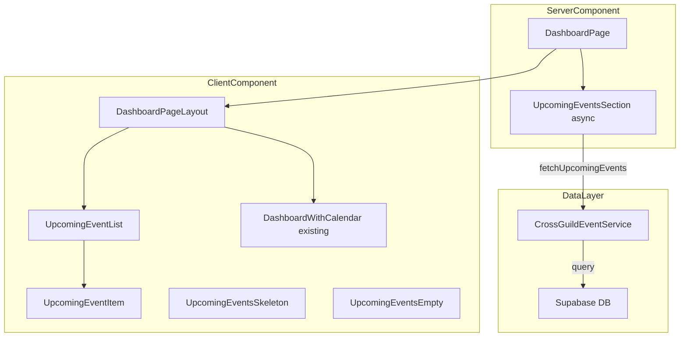
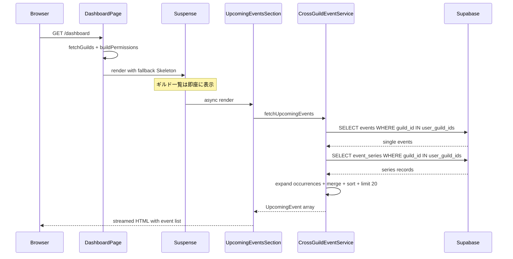

# Design Document: cross-server-events

## Overview

**Purpose**: ログインユーザーが参加している全Discordサーバーの直近予定をダッシュボード上で横断的に一覧表示する機能を提供する。

**Users**: Discalendarに登録した全ユーザーが、ダッシュボードアクセス時に利用する。複数サーバーに参加するユーザーが主な受益者。

**Impact**: 現在のダッシュボード（`app/dashboard/page.tsx`）に新セクションを追加し、ギルド選択前の画面に「直近の予定」一覧を表示する。既存のカレンダー表示やギルド選択UIには変更を加えない。

### Goals
- 全参加サーバーの直近30日以内の予定を一覧表示する
- サーバー名・アイコンで予定の所属を識別可能にする
- 予定クリックで該当サーバーのカレンダーページに遷移する
- Server Component プリフェッチによる高速な初期表示

### Non-Goals
- カレンダーグリッド上での横断表示（既存の月/週/日ビューへの統合）
- 予定の横断検索・フィルタリング機能
- 予定の作成・編集・削除（既存のカレンダーUIで対応）
- 無限スクロールやページネーション（初回は20件制限 + 「さらに表示」導線のみ）

## Architecture

### Existing Architecture Analysis

現在のダッシュボードは単一ギルドスコープで設計されている:

1. `DashboardPage` (Server Component) → `fetchGuilds()` でギルド一覧取得
2. `DashboardPageLayout` → ヘッダー + メインコンテンツ
3. `DashboardWithCalendar` (Client Component) → ギルド選択 + カレンダー表示
4. `CalendarContainer` → `eventService.fetchEventsWithSeries({guildId})` で単一ギルドのイベント取得

**統合ポイント**: `DashboardPageLayout` にギルド選択前に表示される「直近の予定」セクションを追加する。既存の `DashboardWithCalendar` は変更しない。

### Architecture Pattern & Boundary Map



**Architecture Integration**:
- **Selected pattern**: Suspense 境界による遅延ロード — 予定セクションを `<Suspense>` で囲み、ギルド・権限データの取得を妨げない
- **Domain boundaries**: 横断イベント取得は `lib/calendar/cross-guild-event-service.ts` に集約。既存の `event-service.ts` には変更を加えない
- **Existing patterns preserved**: Result 型パターン、Server Component プリフェッチ、`createClient()` によるリクエストごとの Supabase クライアント
- **New components rationale**: `UpcomingEvent` 型は `CalendarEvent` と独立させ、Server → Client シリアライゼーション互換性を確保
- **Steering compliance**: Next.js App Router の Server Component / Suspense パターンに準拠

### Technology Stack

| Layer | Choice / Version | Role in Feature | Notes |
|-------|------------------|-----------------|-------|
| Frontend | React 19 + shadcn/ui | 予定一覧UI、Skeleton | `skeleton` コンポーネント新規追加 |
| Server | Next.js 16 App Router | Server Component プリフェッチ、Suspense | 既存パターン踏襲 |
| Data | Supabase (PostgreSQL) | events + event_series 一括取得 | `user_guild_ids()` RPC 活用 |
| Recurrence | @discalendar/rrule-utils | オカレンス展開 | 既存ライブラリ再利用 |

## System Flows

### 初期ロード時のデータフロー



### 予定クリック時のナビゲーション

予定クリック → `router.push(/dashboard?guild={guildId}&date={YYYY-MM-DD})` → `DashboardWithCalendar` がギルド選択 + 日付をURL から復元 → カレンダー表示。

## Requirements Traceability

| Requirement | Summary | Components | Interfaces | Flows |
|-------------|---------|------------|------------|-------|
| 1.1 | 全ギルド予定横断取得 | CrossGuildEventService | fetchUpcomingEvents | 初期ロード |
| 1.2 | 30日範囲制限 | CrossGuildEventService | fetchUpcomingEvents params | — |
| 1.3 | 単発+繰り返し取得 | CrossGuildEventService | DB query + expandOccurrences | — |
| 1.4 | 時系列ソート | CrossGuildEventService | sort logic | — |
| 1.5 | 並列取得 | CrossGuildEventService | 一括クエリで代替 | 初期ロード |
| 2.1 | 直近の予定セクション表示 | UpcomingEventList | UpcomingEventListProps | — |
| 2.2 | イベント名・日時・サーバー名表示 | UpcomingEventItem | UpcomingEvent type | — |
| 2.3 | 終日/時刻の区別 | UpcomingEventItem | allDay flag | — |
| 2.4 | イベント色反映 | UpcomingEventItem | color field | — |
| 2.5 | 繰り返しオカレンス個別表示 | CrossGuildEventService | expandOccurrences | — |
| 3.1 | サーバー名+アイコン表示 | UpcomingEventItem | guildName, guildAvatarUrl | — |
| 3.2 | カレンダーページ遷移 | UpcomingEventItem | onClick navigation | ナビゲーション |
| 3.3 | 遷移先で該当日付表示 | UpcomingEventItem | date param in URL | ナビゲーション |
| 4.1 | スケルトンUI | UpcomingEventsSkeleton | — | 初期ロード |
| 4.2 | 空状態メッセージ | UpcomingEventsEmpty | — | — |
| 4.3 | エラー+リトライ | UpcomingEventsError | retryAction | — |
| 4.4 | Bot未招待案内 | UpcomingEventsEmpty | variant prop | — |
| 5.1 | 最大20件制限 | CrossGuildEventService | UPCOMING_EVENTS_LIMIT | — |
| 5.2 | さらに表示導線 | UpcomingEventList | hasMore + onShowMore | — |
| 5.3 | Server Component プリフェッチ | UpcomingEventsSection | Suspense boundary | 初期ロード |

## Components and Interfaces

| Component | Domain/Layer | Intent | Req Coverage | Key Dependencies | Contracts |
|-----------|-------------|--------|--------------|------------------|-----------|
| CrossGuildEventService | Data/Service | 全ギルド横断イベント取得 | 1.1-1.5, 2.5, 5.1 | Supabase (P0), rrule-utils (P0) | Service |
| UpcomingEventsSection | Server/Page | Suspense対応の非同期データ取得 | 5.3 | CrossGuildEventService (P0) | — |
| UpcomingEventList | UI/Client | 予定一覧のリスト表示 | 2.1, 5.2 | UpcomingEventItem (P1) | State |
| UpcomingEventItem | UI/Client | 個別予定の表示カード | 2.2-2.4, 3.1-3.3 | Next.js Router (P1) | — |
| UpcomingEventsSkeleton | UI/Client | ローディング表示 | 4.1 | shadcn Skeleton (P1) | — |
| UpcomingEventsEmpty | UI/Client | 空状態・Bot未招待表示 | 4.2, 4.4 | — | — |
| UpcomingEventsError | UI/Client | エラー+リトライ表示 | 4.3 | — | — |

### Data / Service Layer

#### CrossGuildEventService

| Field | Detail |
|-------|--------|
| Intent | ユーザーの全参加ギルドから直近の予定を一括取得し、時系列順にソートして返す |
| Requirements | 1.1, 1.2, 1.3, 1.4, 1.5, 2.5, 5.1 |

**Responsibilities & Constraints**
- 全参加ギルドの events + event_series を一括クエリで取得
- 繰り返しイベントのオカレンス展開（`expandOccurrences` 関数を再利用）
- 例外レコード（series_id 付き events）のマージ
- 結果を開始日時昇順でソートし、上限件数にトランケート
- Server Component 内でのみ使用（`createClient()` Server 版を前提）

**Dependencies**
- Outbound: Supabase — events/event_series テーブルの SELECT (P0)
- External: @discalendar/rrule-utils — `expandOccurrences`, `toSummaryText` (P0)

**Contracts**: Service [x]

##### Service Interface

```typescript
/** 横断イベント取得パラメータ */
interface FetchUpcomingEventsParams {
  /** 参加ギルド一覧（名前・アイコン情報含む） */
  guilds: ReadonlyArray<{ guildId: string; name: string; avatarUrl: string | null }>;
  /** 取得対象日数（デフォルト: 30） */
  days?: number;
  /** 最大取得件数（デフォルト: 20） */
  limit?: number;
}

/** 横断イベント取得結果 */
type FetchUpcomingEventsResult =
  | { success: true; data: UpcomingEvent[]; hasMore: boolean }
  | { success: false; error: { code: "FETCH_FAILED" | "UNAUTHORIZED"; message: string } };

/** 横断イベント取得関数（Server Component 内で呼び出し） */
function fetchUpcomingEvents(
  supabase: SupabaseClient,
  params: FetchUpcomingEventsParams
): Promise<FetchUpcomingEventsResult>;
```

- Preconditions: `supabase` は認証済み Server クライアント、`guilds` は空配列可
- Postconditions: 成功時は `UpcomingEvent[]` が `start` 昇順でソート済み、`hasMore` は件数超過の有無を示す
- Invariants: 返却件数は `limit` 以下

**Implementation Notes**
- events テーブルは `guild_id IN (ギルドIDリスト)` + `start_at >= now` + `start_at <= now + days` + `series_id IS NULL` でフィルタ
- event_series テーブルは `guild_id IN (ギルドIDリスト)` で取得し、JS 側でオカレンス展開後に日付範囲フィルタ
- 例外レコードも一括取得してマージ
- ギルドリストが空の場合は空配列を即座に返却

### Server / Page Layer

#### UpcomingEventsSection

| Field | Detail |
|-------|--------|
| Intent | Server Component として予定データを非同期取得し、結果に応じた UI コンポーネントを選択・レンダリングする |
| Requirements | 5.3 |

**Responsibilities & Constraints**
- `DashboardPage` 内で `<Suspense fallback={<UpcomingEventsSkeleton />}>` に囲まれて呼び出される
- `createClient()` で Supabase クライアントを生成し、`fetchUpcomingEvents()` を呼び出す
- 結果に応じて `UpcomingEventList` / `UpcomingEventsEmpty` / `UpcomingEventsError` を返す

**Dependencies**
- Inbound: DashboardPage — guilds props (P0)
- Outbound: CrossGuildEventService — fetchUpcomingEvents (P0)

### UI / Client Layer

#### UpcomingEventList

| Field | Detail |
|-------|--------|
| Intent | 予定一覧のリストコンテナ。セクションヘッダーと個別予定アイテムを表示する |
| Requirements | 2.1, 5.2 |

**Contracts**: State [x]

##### State Management

```typescript
interface UpcomingEventListProps {
  /** 表示する予定一覧 */
  events: UpcomingEvent[];
  /** 表示上限を超える予定があるか */
  hasMore: boolean;
}
```

- State: ステートレス（Server Component から props 受け取り）
- 「さらに表示」ボタンは `hasMore: true` の場合に表示し、クリックで全件表示ページ（将来実装）またはカレンダーへの導線を提供

#### UpcomingEventItem

| Field | Detail |
|-------|--------|
| Intent | 個別の予定を表示するカード。サーバー情報・日時・色・ナビゲーションを含む |
| Requirements | 2.2, 2.3, 2.4, 3.1, 3.2, 3.3 |

**Implementation Notes**
- `<Link href="/dashboard?guild={guildId}&date={YYYY-MM-DD}">` でナビゲーション
- `allDay: true` の場合は時刻を非表示、日付のみ表示
- `color` をカラーインジケーター（左ボーダーまたはドット）として反映
- サーバーアイコンは `GuildIcon` コンポーネントパターンを参考に実装（Discord CDN URL）

#### UpcomingEventsSkeleton

| Field | Detail |
|-------|--------|
| Intent | データ取得中のプレースホルダー表示 |
| Requirements | 4.1 |

**Implementation Notes**
- shadcn/ui の `Skeleton` コンポーネントを使用
- 3-5 行のスケルトンカード（アイコン + テキスト行2本の矩形）

#### UpcomingEventsEmpty

| Field | Detail |
|-------|--------|
| Intent | 予定なし・サーバー未参加時のガイダンス表示 |
| Requirements | 4.2, 4.4 |

**Implementation Notes**
- `variant: "no-events"` — 「直近の予定はありません」+ カレンダーアイコン
- `variant: "no-guilds"` — 「Botが参加しているサーバーがありません」+ Bot招待への導線

#### UpcomingEventsError

| Field | Detail |
|-------|--------|
| Intent | エラー発生時のメッセージ + リトライ表示 |
| Requirements | 4.3 |

**Implementation Notes**
- エラーメッセージ + 「再読み込み」ボタン
- リトライは `router.refresh()` でページ全体を再レンダリング（Server Component の再実行をトリガー）

## Data Models

### Domain Model

**UpcomingEvent**: 横断表示専用の値オブジェクト。CalendarEvent とは独立。

```typescript
/** 直近予定の表示用型（JSON シリアライズ可能） */
interface UpcomingEvent {
  /** イベントID（単発: events.id、オカレンス: "{seriesId}:{date}"） */
  id: string;
  /** イベント名 */
  title: string;
  /** 開始日時（ISO 8601 文字列） */
  start: string;
  /** 終了日時（ISO 8601 文字列） */
  end: string;
  /** 終日イベントフラグ */
  allDay: boolean;
  /** イベントカラー（HEX） */
  color: string;
  /** 繰り返しイベントかどうか */
  isRecurring: boolean;
  /** 所属ギルドの Discord ID */
  guildId: string;
  /** 所属ギルド名 */
  guildName: string;
  /** 所属ギルドのアイコンURL */
  guildAvatarUrl: string | null;
}
```

**設計判断**:
- `start` / `end` を ISO string にすることで、Server → Client シリアライゼーション問題を回避
- `description`, `location`, `channel`, `notifications` は一覧表示に不要なため除外
- `guildId` + `guildName` + `guildAvatarUrl` でギルド識別に必要な情報を完結
- `id` はオカレンスの場合に `{seriesId}:{date}` 形式で一意性を確保

### Physical Data Model

DB スキーマの変更は不要。既存の `events` / `event_series` テーブルを参照するのみ。

**使用するクエリパターン**:

```sql
-- 単発イベント取得
SELECT * FROM events
WHERE guild_id = ANY(ARRAY[...guild_ids])
  AND series_id IS NULL
  AND start_at >= now()
  AND start_at <= now() + interval '30 days';

-- シリーズ取得（オカレンス展開は JS 側）
SELECT * FROM event_series
WHERE guild_id = ANY(ARRAY[...guild_ids]);

-- 例外レコード取得
SELECT * FROM events
WHERE guild_id = ANY(ARRAY[...guild_ids])
  AND series_id IS NOT NULL
  AND (
    (original_date >= now() AND original_date <= now() + interval '30 days')
    OR (start_at >= now() AND start_at <= now() + interval '30 days')
  );
```

**インデックス**: `idx_events_guild_start_end ON events(guild_id, start_at, end_at)` が既存。IN クエリでも活用可能。

## Error Handling

### Error Strategy

Result 型パターンを踏襲。`fetchUpcomingEvents` は `FetchUpcomingEventsResult` を返し、エラー時は `success: false` + エラーコード。

### Error Categories and Responses

| カテゴリ | トリガー | 対応 |
|---------|---------|------|
| DB エラー | Supabase クエリ失敗 | `FETCH_FAILED` → UpcomingEventsError 表示 + リトライボタン |
| 認証エラー | セッション無効 | `UNAUTHORIZED` → ログインページリダイレクト |
| 空データ | 予定なし | UpcomingEventsEmpty (no-events variant) |
| ギルドなし | 参加ギルドが0 | UpcomingEventsEmpty (no-guilds variant) |

### Monitoring

- Supabase クエリエラーは `console.error` でログ出力（既存パターン踏襲）
- エラー頻度が高い場合は Sentry 連携（既存の sentry-error-monitoring スペックで対応予定）

## Testing Strategy

### Unit Tests
- `CrossGuildEventService.fetchUpcomingEvents`: 正常系（複数ギルド・単発+繰り返し）、空ギルド、DBエラー
- `UpcomingEvent` の変換ロジック: EventRecord → UpcomingEvent、オカレンス → UpcomingEvent
- 日付範囲フィルタリング: 30日以内の制限、境界値

### Integration Tests
- ダッシュボードページの Server Component レンダリング: Suspense 境界内で予定セクションが正しくレンダリングされるか
- ギルド情報付きイベント表示: イベントにサーバー名・アイコンが表示されるか

### E2E/UI Tests
- ダッシュボード初期表示で「直近の予定」セクションが表示される
- 予定クリックでカレンダーページに遷移し、該当日付が表示される
- 予定がない場合に空状態メッセージが表示される

## Performance & Scalability

- **クエリ数**: ギルド数に依存しない固定 2-3 クエリ（一括取得方式）
- **オカレンス展開**: 30日範囲 + 20件制限で計算量を抑制
- **SSR ストリーミング**: Suspense 境界により、予定セクションの取得完了を待たずにダッシュボードの他部分を表示
- **データサイズ**: `UpcomingEvent` 型は最小限のフィールドのみ含み、Server → Client の転送量を削減
