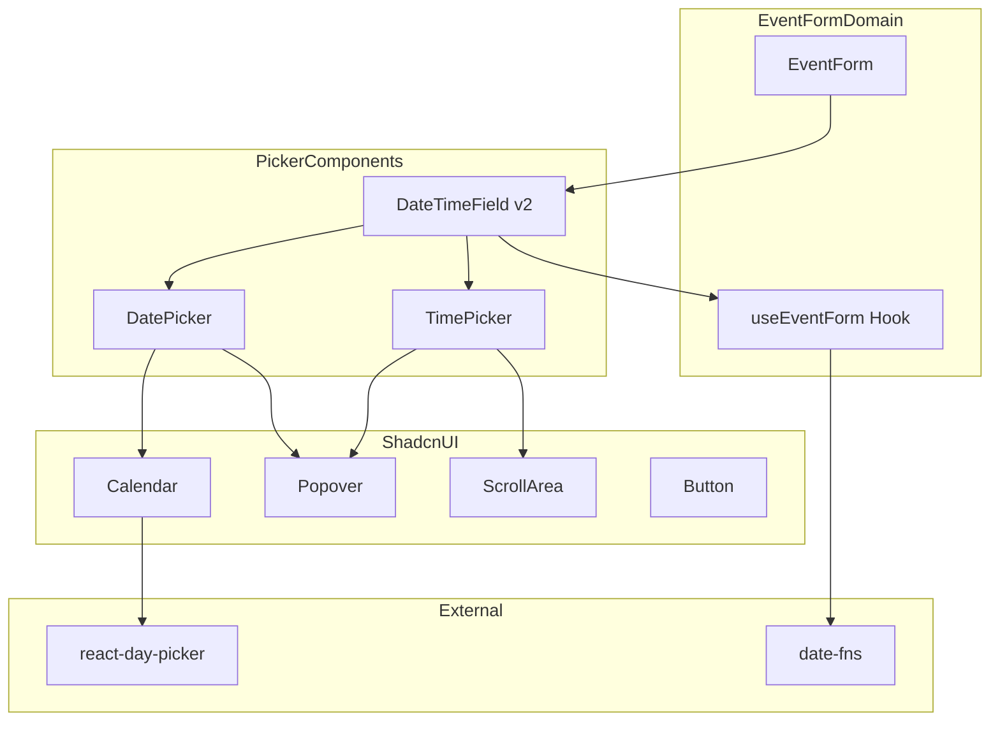
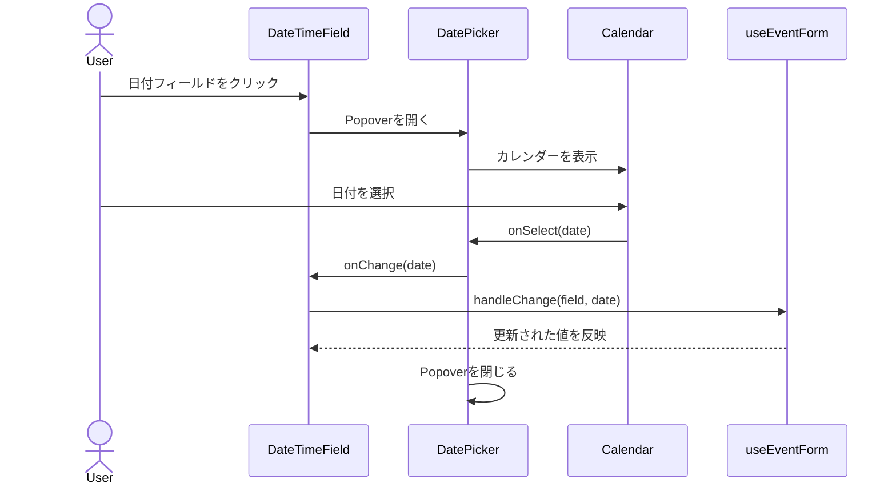
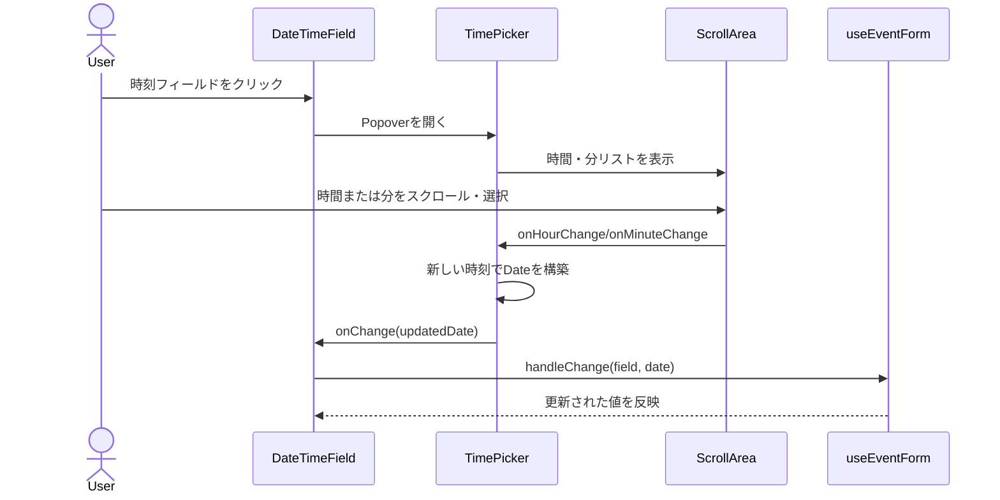

# Design Document: datetime-picker-ux

## Overview

**Purpose**: 予定編集フォーム（EventForm）の日付・時刻入力を、ネイティブHTML5入力からshadcn/uiデザインシステムに統合されたカスタムピッカーに置き換える。
**Users**: Discalendarの全ユーザー（デスクトップ・モバイル）が予定の作成・編集時に使用する。
**Impact**: `event-form.tsx`の`DateTimeField`コンポーネントを新しいDatePicker・TimePickerコンポーネントに置き換え、`useEventForm`フックのDate型直接受け渡しを活用する。

### Goals
- shadcn/uiのCSS変数を使用した統一されたカラースキーム（ライト/ダーク自動対応）
- 5分刻みの時刻選択による実用的な粒度の提供
- モバイル端末での快適な操作性（44x44pxタップターゲット、スタックレイアウト）
- キーボード・スクリーンリーダー対応のアクセシビリティ

### Non-Goals
- カレンダーの複数日選択（range mode）— 現在はsingle mode のみ
- 秒単位の時刻選択
- タイムゾーン選択UI
- 繰り返し予定の日時設定UI

## Architecture

### Existing Architecture Analysis

現在のEventFormは `<Input type="datetime-local">` を使用してブラウザネイティブの日時入力を提供している。`useEventForm`フックが文字列入力をDate型に変換し、バリデーションを行う。

影響を受けるファイル:
- `components/calendar/event-form.tsx` — DateTimeFieldを新ピッカーに置き換え
- `hooks/calendar/use-event-form.ts` — 変更最小限（Date型直接受け渡しは既に対応済み）

維持すべきパターン:
- `useEventForm`のhandleChange/handleBlurインターフェース
- EventFormの子コンポーネント分割パターン（TitleField, AllDayField等）
- エラー表示のaria-describedbyパターン

### Architecture Pattern & Boundary Map



**Architecture Integration**:
- **Selected pattern**: 合成パターン（shadcn/ui推奨）— Popover + Calendar/ScrollArea を合成してピッカーを構築
- **Domain boundaries**: ピッカーコンポーネントはUIプリミティブ層（`components/ui/`）に配置、EventForm固有のレイアウト調整は`components/calendar/`に配置
- **Existing patterns preserved**: useEventFormのインターフェース、子コンポーネント分割、Co-locationパターン
- **New components rationale**: DatePicker（日付選択UI）とTimePicker（時刻選択UI）は汎用UIとして`components/ui/`に配置し、他の画面でも再利用可能にする

### Technology Stack

| Layer | Choice / Version | Role in Feature | Notes |
|-------|------------------|-----------------|-------|
| Frontend | React 19 + Next.js 16 | コンポーネントレンダリング | 既存 |
| UI Primitives | shadcn/ui Calendar | 日付カレンダーUI | 新規追加 (`npx shadcn@latest add calendar`) |
| UI Primitives | shadcn/ui ScrollArea | 時刻スクロールリスト | 新規追加 (`npx shadcn@latest add scroll-area`) |
| Date Library | react-day-picker (shadcn依存) | Calendar内部のDayPicker | Calendar追加時に自動インストール |
| Date Utilities | date-fns ^4.1.0 | 日付フォーマット・操作 | 既存 |
| Styling | Tailwind CSS 3 + CSS変数 | テーマ統合 | 既存 |

## System Flows

### 日付選択フロー



### 時刻選択フロー



## Requirements Traceability

| Requirement | Summary | Components | Interfaces | Flows |
|-------------|---------|------------|------------|-------|
| 1.1 | 日付ピッカーをPopover+Calendarで表示 | DatePicker, Calendar | DatePickerProps | 日付選択フロー |
| 1.2 | 日付選択でフィールド反映+Popover閉じ | DatePicker | onSelect callback | 日付選択フロー |
| 1.3 | 選択日をprimaryカラーでハイライト | DatePicker, Calendar | CSS変数 | - |
| 1.4 | 今日の日付を視覚的に区別 | Calendar | CSS変数 | - |
| 1.5 | ダークモード自動切替 | DatePicker, TimePicker | CSS変数 | - |
| 2.1 | 時刻ピッカーをPopover+ScrollAreaで表示 | TimePicker | TimePickerProps | 時刻選択フロー |
| 2.2 | 5分刻みの時刻選択肢 | TimePicker | minuteStep prop | - |
| 2.3 | 時刻選択でフィールド反映 | TimePicker | onChange callback | 時刻選択フロー |
| 2.4 | 時間/分の個別選択UI | TimePicker, ScrollArea | - | 時刻選択フロー |
| 2.5 | ダークモード自動切替（時刻） | TimePicker | CSS変数 | - |
| 3.1 | 開始日変更時の終了日自動調整 | DateTimeField | useEventForm | - |
| 3.2 | 終日トグルで時刻ピッカー非表示 | DateTimeField | isAllDay state | - |
| 3.3 | 終日オフで時刻ピッカー表示 | DateTimeField | isAllDay state | - |
| 3.4 | 日付/時刻の明確なレイアウト区別 | DateTimeField | CSS layout | - |
| 4.1 | タップターゲット最低44x44px | DatePicker, TimePicker | CSS | - |
| 4.2 | モバイルで縦並びレイアウト | DateTimeField | CSS responsive | - |
| 4.3 | デスクトップで横並びレイアウト | DateTimeField | CSS responsive | - |
| 4.4 | タッチスクロールによる値選択 | TimePicker, ScrollArea | touch events | - |
| 5.1 | キーボード矢印キーで日付移動 | Calendar (react-day-picker) | keyboard events | - |
| 5.2 | キーボード上下矢印で時刻増減 | TimePicker | keyboard events | - |
| 5.3 | ARIAラベル | DatePicker, TimePicker | aria-label | - |
| 5.4 | Escキーでポップオーバー閉じ | Popover (Radix) | keyboard events | - |

## Components and Interfaces

| Component | Domain/Layer | Intent | Req Coverage | Key Dependencies | Contracts |
|-----------|--------------|--------|--------------|------------------|-----------|
| DatePicker | UI Primitives | Popover+Calendarで日付選択UIを提供 | 1.1-1.5, 5.1, 5.3, 5.4 | Calendar (P0), Popover (P0) | Props |
| TimePicker | UI Primitives | ScrollAreaで時間/分選択UIを提供 | 2.1-2.5, 4.4, 5.2, 5.3, 5.4 | ScrollArea (P0), Popover (P0) | Props |
| DateTimeField | Calendar Feature | 日付+時刻ピッカーの統合レイアウト | 3.1-3.4, 4.1-4.3 | DatePicker (P0), TimePicker (P0), useEventForm (P0) | Props |

### UI Primitives

#### DatePicker

| Field | Detail |
|-------|--------|
| Intent | Popover内にCalendarを表示し、単一日付の選択UIを提供する |
| Requirements | 1.1, 1.2, 1.3, 1.4, 1.5, 5.1, 5.3, 5.4 |

**Responsibilities & Constraints**
- Button trigger + Popover + Calendar の合成コンポーネント
- 選択された日付のフォーマット表示（date-fns使用）
- 日付選択時にPopoverを自動的に閉じる
- `components/ui/date-picker.tsx`に配置（他画面での再利用を考慮）

**Dependencies**
- Outbound: Calendar — 日付カレンダー表示 (P0)
- Outbound: Popover — ドロップダウンコンテナ (P0)
- Outbound: Button — トリガー要素 (P0)
- External: date-fns — 日付フォーマット (P1)

**Contracts**: State [x]

##### Props Interface
```typescript
interface DatePickerProps {
  /** 選択された日付 */
  value: Date | undefined;
  /** 日付変更コールバック */
  onChange: (date: Date | undefined) => void;
  /** プレースホルダーテキスト */
  placeholder?: string;
  /** 無効状態 */
  disabled?: boolean;
  /** エラー状態（border-destructive適用） */
  hasError?: boolean;
  /** aria-label */
  "aria-label"?: string;
  /** aria-describedby */
  "aria-describedby"?: string;
}
```

**Implementation Notes**
- Calendar の `mode="single"` を使用
- 今日の日付ハイライトはreact-day-pickerの`today`修飾子でCSS適用（`--primary`カラー使用）
- ダークモードはCSS変数（`--popover`, `--popover-foreground`）で自動切替
- Escキーによる閉じはRadix Popoverが標準対応

#### TimePicker

| Field | Detail |
|-------|--------|
| Intent | 時間(0-23)と分(00-55, 5分刻み)の2列スクロールリストで時刻選択UIを提供する |
| Requirements | 2.1, 2.2, 2.3, 2.4, 2.5, 4.4, 5.2, 5.3, 5.4 |

**Responsibilities & Constraints**
- Button trigger + Popover + 2列ScrollArea の合成コンポーネント
- 時間リスト（0〜23）と分リスト（00〜55、5分刻み）を並列表示
- 選択された時刻をフォーマット表示（HH:mm形式）
- タッチスクロールでの値選択をサポート
- `components/ui/time-picker.tsx`に配置

**Dependencies**
- Outbound: ScrollArea — スクロールコンテナ (P0)
- Outbound: Popover — ドロップダウンコンテナ (P0)
- Outbound: Button — トリガー要素 (P0)

**Contracts**: State [x]

##### Props Interface
```typescript
interface TimePickerProps {
  /** 選択された時刻を含むDate */
  value: Date | undefined;
  /** 時刻変更コールバック（時間・分を更新したDateを返す） */
  onChange: (date: Date) => void;
  /** 分の刻み（デフォルト: 5） */
  minuteStep?: number;
  /** プレースホルダーテキスト */
  placeholder?: string;
  /** 無効状態 */
  disabled?: boolean;
  /** エラー状態 */
  hasError?: boolean;
  /** aria-label */
  "aria-label"?: string;
  /** aria-describedby */
  "aria-describedby"?: string;
}
```

##### Internal State
```typescript
/** 時間リスト生成 */
type HourOption = { value: number; label: string }; // 0-23 → "0", "1", ..., "23"

/** 分リスト生成（minuteStep基準） */
type MinuteOption = { value: number; label: string }; // 0, 5, 10, ..., 55 → "00", "05", ..., "55"
```

**Implementation Notes**
- 各時間/分アイテムは`role="option"`, `aria-selected`を持つ
- リスト全体は`role="listbox"`
- キーボード: 上下矢印で隣接アイテムに移動、Enterで選択
- 選択中のアイテムにスクロール位置を自動調整（`scrollIntoView`）
- タッチ操作: ScrollAreaのネイティブスクロールでスムーズに動作
- 各アイテムの最小タップターゲット: 44px高

### Calendar Feature

#### DateTimeField (v2)

| Field | Detail |
|-------|--------|
| Intent | DatePickerとTimePickerを統合し、レスポンシブレイアウトで日時入力UIを提供する |
| Requirements | 3.1, 3.2, 3.3, 3.4, 4.1, 4.2, 4.3 |

**Responsibilities & Constraints**
- 既存の`DateTimeField`を置き換え
- `isAllDay`状態に応じてTimePickerの表示/非表示を制御
- レスポンシブレイアウト: モバイル（<640px）で縦並び、デスクトップで横並び
- 開始日変更時に終了日が開始日より前になる場合の自動調整ロジック
- `components/calendar/event-form.tsx`内に配置（既存ファイルの修正）

**Dependencies**
- Inbound: EventForm — フォーム構成 (P0)
- Outbound: DatePicker — 日付選択 (P0)
- Outbound: TimePicker — 時刻選択 (P0)
- Outbound: useEventForm — 状態管理 (P0)

**Contracts**: Props [x]

##### Props Interface
```typescript
/** 既存のFormFieldPropsを拡張 */
interface DateTimeFieldProps {
  form: UseEventFormReturn;
  isSubmitting: boolean;
  field: "startAt" | "endAt";
  label: string;
}
```

**Implementation Notes**
- レスポンシブレイアウト: `flex flex-col sm:flex-row gap-2`
- 終日モード切替: `form.values.isAllDay`でTimePickerの条件付きレンダリング
- 日付変更時の連携: DatePickerのonChangeで日付部分のみ更新、TimePickerのonChangeで時刻部分のみ更新し、既存のDate値をマージ
- 開始日→終了日の自動調整は`useEventForm`の既存バリデーションと組み合わせて実現

## Testing Strategy

### Unit Tests
- **DatePicker**: 日付選択→onChangeコールバック、Popover開閉、disabled状態
- **TimePicker**: 時間/分選択→onChange、5分刻みの選択肢生成、minuteStepプロパティ
- **DateTimeField**: isAllDayトグルでTimePicker表示/非表示、レスポンシブclass適用

### Integration Tests
- **EventForm統合**: DatePicker/TimePickerでの日時選択→useEventForm→フォーム値反映
- **開始/終了日連動**: 開始日変更時の終了日自動調整
- **バリデーション**: 無効な日時設定時のエラー表示

### E2E Tests
- **予定作成フロー**: 日付ピッカーで日付選択 → 時刻ピッカーで時刻選択 → 保存
- **終日切替**: 終日トグル ON/OFF → 時刻ピッカーの表示/非表示
- **モバイルレイアウト**: ビューポート変更 → レイアウト切替確認

### Storybook Stories
- **DatePicker**: Default, WithValue, Disabled, Error, DarkMode
- **TimePicker**: Default, WithValue, CustomStep, Disabled, Error
- **DateTimeField**: Default, AllDay, MobileLayout, WithError
