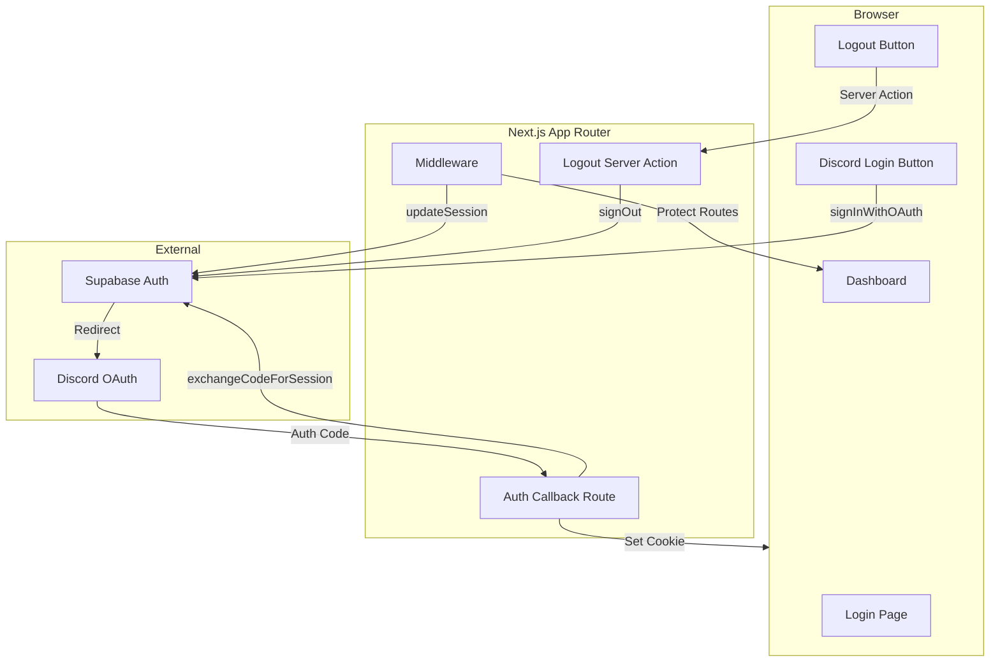
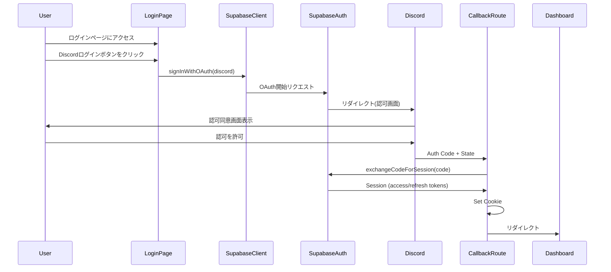
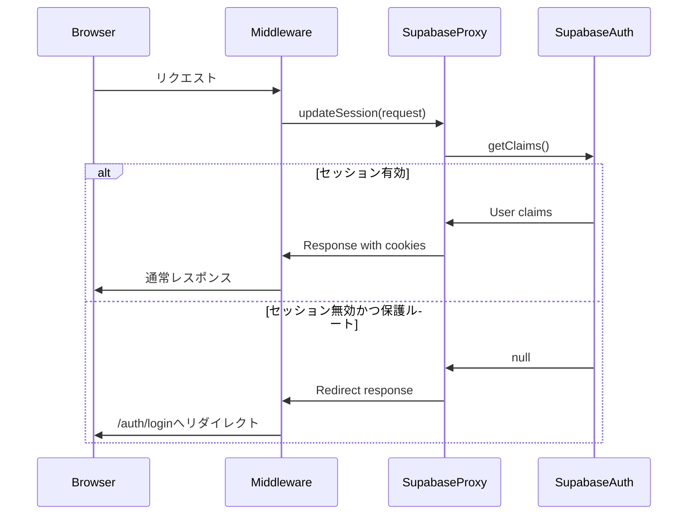

# Technical Design Document

## Overview

本ドキュメントはDiscalendarにおけるDiscordログイン機能の技術設計を定義する。Supabase AuthのOAuth 2.0/PKCEフローを活用し、DiscordユーザーがWebアプリケーションに認証できる機能を実装する。

既存のSupabase SSRクライアント設定（`lib/supabase/`）を拡張し、認証UI、コールバック処理、セッション管理、ルーティング保護を新規実装する。

## Goals and Non-Goals

### Goals
- Discord OAuth認証によるログイン/ログアウト機能の提供
- Next.js App RouterとSupabase SSRを統合したセッション管理
- Middlewareによる認証状態に基づくルーティング保護
- アクセシビリティ対応のログインUI

### Non-Goals
- 複数OAuth プロバイダー対応（Discord以外）
- ユーザープロファイル編集機能
- 権限管理・ロールベースアクセス制御
- Discordサーバー情報の取得・同期

## Requirements Traceability

| Requirement | Summary | Components | Interfaces | Flows |
|-------------|---------|------------|------------|-------|
| 1.1, 1.2, 1.3, 1.4 | Discordログインボタン表示 | DiscordLoginButton | DiscordLoginButtonProps | OAuth開始フロー |
| 2.1, 2.2, 2.3 | OAuth認証フロー開始 | DiscordLoginButton, LoginPage | signInWithDiscord | OAuth開始フロー |
| 3.1, 3.2, 3.3, 3.4 | コールバック処理 | AuthCallbackRoute | GET handler | コールバックフロー |
| 4.1, 4.2, 4.3, 4.4 | セッション管理 | AuthMiddleware, Supabase clients | updateSession | セッション更新フロー |
| 5.1, 5.2, 5.3 | 認証状態ルーティング | AuthMiddleware | updateSession | Middlewareフロー |
| 6.1, 6.2, 6.3 | ログアウト機能 | LogoutButton | signOut, Server Action | ログアウトフロー |
| 7.1, 7.2, 7.3, 7.4 | エラーハンドリング | LoginPage, AuthCallbackRoute | AuthError型 | エラーフロー |
| 8.1, 8.2, 8.3, 8.4 | セキュリティ要件 | Supabase SDK組み込み | - | - |

## Architecture

### System Architecture Diagram



### Key Decisions
- **PKCE採用**: 要件8.3に基づき、Proof Key for Code Exchangeフローを使用
- **Middleware必須**: 全リクエストでセッション更新を実行し、Server/Client間のCookie同期を保証
- **Route Handler**: PKCEコールバック処理はRoute Handler（`app/auth/callback/route.ts`）で実装

## Technology Stack

| Layer | Technology | Version | Role |
|-------|------------|---------|------|
| Frontend | React | 19 | UIコンポーネント |
| Framework | Next.js App Router | latest | ルーティング、SSR |
| Auth | @supabase/ssr | existing | OAuth、セッション管理 |
| UI | shadcn/ui Button | existing | ログインボタン |
| Icons | lucide-react | existing | Discordアイコン代替 |

**Note**: lucide-reactにDiscordアイコンがないため、SVGで実装するかDiscordブランドカラー+テキストで対応。

## System Flows

### OAuth認証フロー



### Middlewareセッション更新フロー



## Components and Interface Contracts

### Component Summary

| Component | Domain | Intent | Requirements | Dependencies |
|-----------|--------|--------|--------------|--------------|
| LoginPage | Auth UI | ログインページ表示 | 1.1-1.4, 7.1-7.4 | DiscordLoginButton |
| DiscordLoginButton | Auth UI | OAuth開始ボタン | 1.1-1.4, 2.1-2.3 | @supabase/ssr, Button |
| AuthCallbackRoute | Auth | OAuthコールバック処理 | 3.1-3.4, 7.1-7.4 | @supabase/ssr |
| AuthMiddleware | Auth | セッション更新・保護 | 4.1-4.4, 5.1-5.3 | lib/supabase/proxy |
| LogoutButton | Auth UI | ログアウト機能 | 6.1-6.3 | Server Action |

### DiscordLoginButton

**File**: `components/auth/discord-login-button.tsx`
**Type**: Client Component
**Intent**: Discordブランドのログインボタンを表示し、OAuth認証フローを開始する

**Props Interface**:
```typescript
interface DiscordLoginButtonProps {
  /** リダイレクト先（オプション、デフォルトは/dashboard） */
  redirectTo?: string;
  /** ローディング状態のコールバック */
  onLoadingChange?: (loading: boolean) => void;
}
```

**Contracts**:
- [x] Service

**Service Interface**:
```typescript
async function signInWithDiscord(redirectTo?: string): Promise<void>
```
- **Input**: `redirectTo` - OAuth完了後のリダイレクト先パス
- **Output**: void（ブラウザリダイレクトが発生）
- **Error**: `AuthError` - ネットワークエラー、設定エラー

**Implementation Notes**:
- Discordブランドカラー（#5865F2）をボタン背景に使用
- `disabled`状態でボタン連打を防止
- キーボード操作（Enter/Space）でアクティベート可能
- フォーカス状態の視覚的フィードバック必須

---

### LoginPage

**File**: `app/auth/login/page.tsx`
**Type**: Server Component + Client Component組み合わせ
**Intent**: ログインページの構造を提供し、エラーメッセージを表示する

**Implementation Notes**:
- URLSearchParamsからエラーメッセージを取得して表示
- DiscordLoginButtonをClient Componentとして配置
- 認証済みユーザーはMiddlewareでダッシュボードへリダイレクト

---

### AuthCallbackRoute

**File**: `app/auth/callback/route.ts`
**Type**: Route Handler
**Intent**: Discord OAuthからのコールバックを処理し、セッションを確立する

**Contracts**:
- [x] API

**API Contract**:
```typescript
export async function GET(request: Request): Promise<NextResponse>
```

| Method | Path | Query Params | Response |
|--------|------|--------------|----------|
| GET | /auth/callback | code, next?, error?, error_description? | Redirect |

**Success Response**: `/dashboard`または`next`パラメータへリダイレクト
**Error Response**: `/auth/login?error={message}`へリダイレクト

**Error Handling**:
| Error Case | Action |
|------------|--------|
| code missing | `/auth/login?error=missing_code` |
| exchangeCodeForSession failure | `/auth/login?error=auth_failed` |
| user denied | `/auth/login?error=access_denied` |

---

### AuthMiddleware

**File**: `middleware.ts`（プロジェクトルート）
**Type**: Next.js Middleware
**Intent**: 全リクエストでセッション更新を実行し、保護ルートへのアクセスを制御する

**Contracts**:
- [x] Service

**Service Interface**:
既存の`lib/supabase/proxy.ts`の`updateSession`関数を呼び出す。

**Config**:
```typescript
export const config = {
  matcher: [
    '/((?!_next/static|_next/image|favicon.ico|.*\\.(?:svg|png|jpg|jpeg|gif|webp)$).*)',
  ],
}
```

**Route Protection Logic**:
| Condition | Action |
|-----------|--------|
| 未認証 + 保護ルート | `/auth/login`へリダイレクト |
| 認証済み + `/auth/login` | `/dashboard`へリダイレクト |
| 認証済み + 保護ルート | 通常処理 |
| 任意 + 公開ルート（`/`, `/auth/*`） | 通常処理 |

---

### LogoutButton

**File**: `components/auth/logout-button.tsx`
**Type**: Client Component
**Intent**: ログアウトボタンを表示し、Server Actionを呼び出してセッションを破棄する

**Props Interface**:
```typescript
interface LogoutButtonProps {
  /** ボタンのvariant（デフォルトはghost） */
  variant?: 'default' | 'ghost' | 'outline';
}
```

**Server Action**:
```typescript
// app/auth/actions.ts
'use server'

export async function signOut(): Promise<void>
```
- サーバー側でSupabaseセッションを破棄
- `/auth/login`へリダイレクト

---

### AuthError Type

**File**: `lib/auth/types.ts`
**Intent**: 認証エラーの型定義

```typescript
type AuthErrorCode =
  | 'missing_code'
  | 'auth_failed'
  | 'access_denied'
  | 'network_error'
  | 'session_expired';

interface AuthError {
  code: AuthErrorCode;
  message: string;
  details?: string;
}

const AUTH_ERROR_MESSAGES: Record<AuthErrorCode, string> = {
  missing_code: '認証コードが見つかりません。再度ログインしてください。',
  auth_failed: '認証に失敗しました。再度お試しください。',
  access_denied: 'Discordの認可がキャンセルされました。',
  network_error: 'ネットワーク接続を確認してください。',
  session_expired: 'セッションの有効期限が切れました。再度ログインしてください。',
};
```

## Data Models

### Session Data

Supabase Authが管理するセッションデータ構造（参照用）:

```typescript
interface Session {
  access_token: string;
  refresh_token: string;
  expires_at: number;
  expires_in: number;
  user: User;
}

interface User {
  id: string;
  email?: string;
  user_metadata: {
    avatar_url?: string;
    full_name?: string;
    provider_id?: string;
  };
  app_metadata: {
    provider: 'discord';
  };
}
```

**Note**: セッションはCookieに暗号化されて保存される。アプリケーションは`supabase.auth.getUser()`でユーザー情報を取得する。

## File Structure

```
discalendar-next/
├── middleware.ts                      # 新規: Middlewareエントリポイント
├── app/
│   ├── auth/
│   │   ├── login/
│   │   │   └── page.tsx              # 新規: ログインページ
│   │   ├── callback/
│   │   │   └── route.ts              # 新規: OAuthコールバック
│   │   └── actions.ts                # 新規: Server Actions (signOut)
│   └── dashboard/
│       └── page.tsx                  # 新規: ダッシュボード（認証後）
├── components/
│   └── auth/
│       ├── discord-login-button.tsx  # 新規: Discordログインボタン
│       └── logout-button.tsx         # 新規: ログアウトボタン
└── lib/
    ├── auth/
    │   └── types.ts                  # 新規: 認証関連型定義
    └── supabase/
        ├── client.ts                 # 既存: 変更なし
        ├── server.ts                 # 既存: 変更なし
        └── proxy.ts                  # 既存: 変更なし
```

## Error Handling Strategy

| Error Type | Detection | User Feedback | Logging |
|------------|-----------|---------------|---------|
| Network Error | fetch失敗 | ネットワーク確認メッセージ | console.error |
| OAuth Denied | error=access_denied | キャンセルメッセージ | console.warn |
| Code Exchange Failure | exchangeCodeForSession error | 再試行メッセージ | console.error |
| Session Expired | getClaims returns null | ログインページへリダイレクト | なし（正常動作） |

## Security Considerations

| Requirement | Implementation |
|-------------|----------------|
| 8.1 HTTPS通信 | Supabase SDK + Next.js本番環境で自動対応 |
| 8.2 Cookie属性 | @supabase/ssrがHttpOnly, Secure, SameSite=Laxを自動設定 |
| 8.3 PKCE | @supabase/ssrのデフォルトフロー |
| 8.4 CSRF | SupabaseのOAuth stateパラメータで検証 |

## Testing Strategy

### Unit Tests
- `DiscordLoginButton`: クリックでsignInWithOAuth呼び出し確認
- `AuthError`: エラーメッセージ変換の検証

### Integration Tests
- `/auth/callback`: 正常コードでセッション確立
- `/auth/callback`: エラーパラメータでログインページリダイレクト

### E2E Tests (Playwright)
- ログインボタン表示確認
- OAuth完了後のダッシュボードリダイレクト
- ログアウト後のログインページリダイレクト
- 未認証での保護ルートアクセス拒否

## Implementation Considerations

### Environment Variables
Supabase Dashboardで以下を設定:
1. **Discord OAuth Provider有効化**: Authentication > Providers > Discord
2. **Redirect URL追加**: Authentication > URL Configuration
   - 開発: `http://localhost:3000/auth/callback`
   - 本番: `https://{domain}/auth/callback`

### Discordアプリケーション設定
Discord Developer Portalで:
1. OAuth2 > Redirects に `https://{supabase-ref}.supabase.co/auth/v1/callback` を追加
2. Client ID と Client Secret を Supabase Dashboard に入力

### Header更新
既存の`components/header.tsx`のログインリンクを更新:
- `href="#login"` → `href="/auth/login"`
