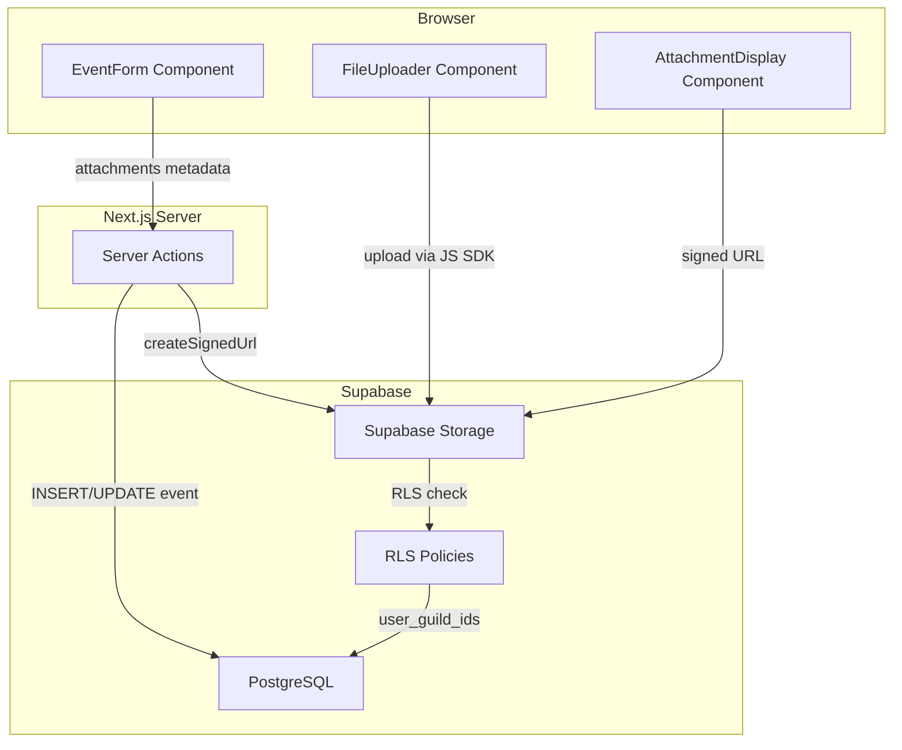
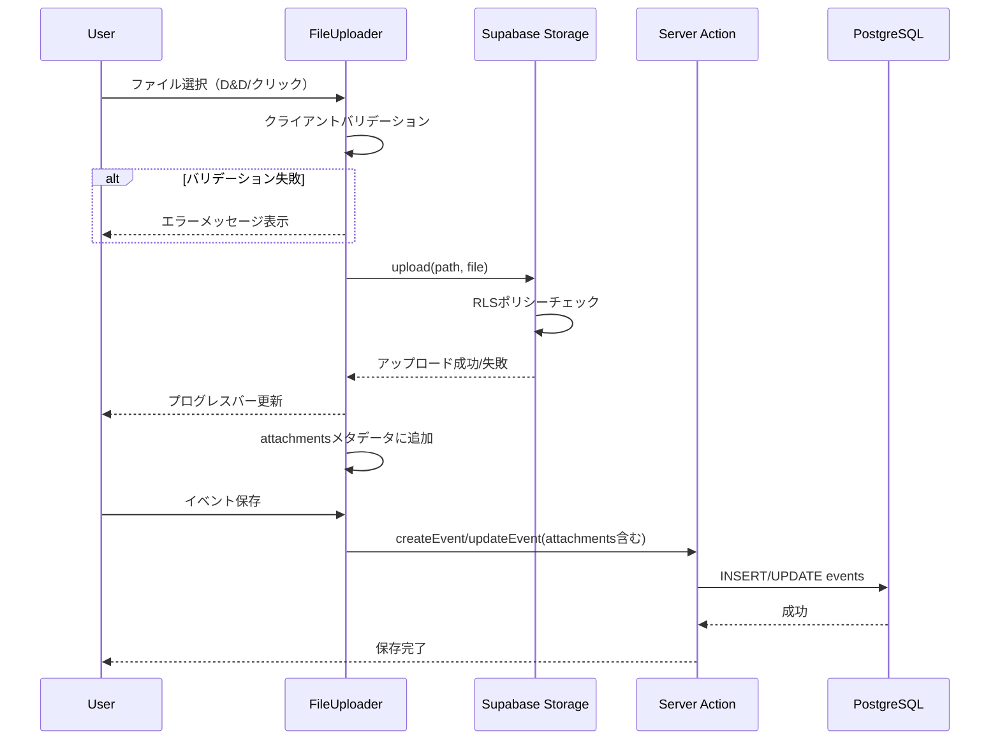
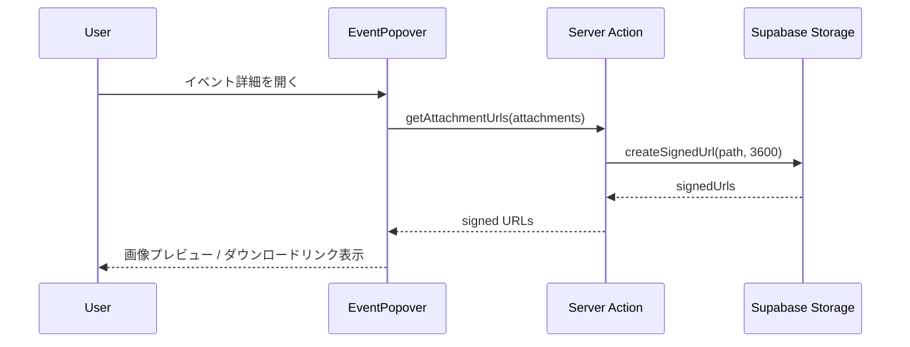
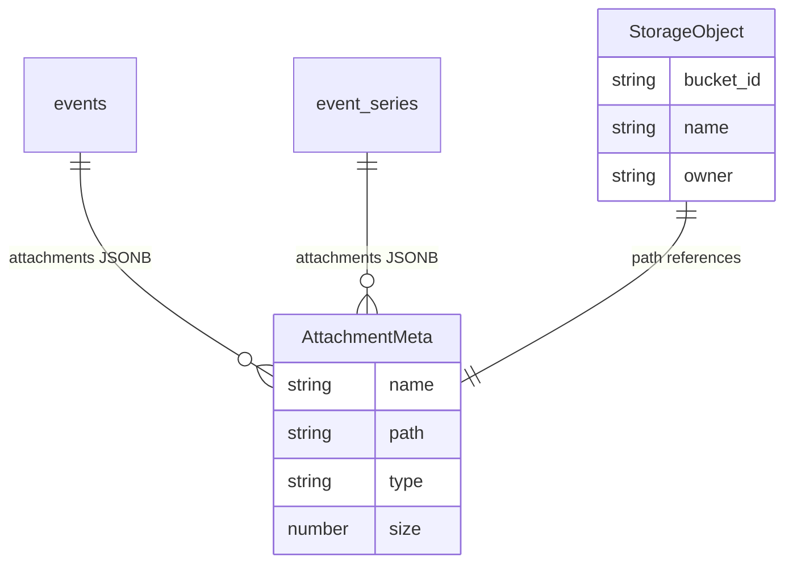

# Design Document: イベント添付ファイル機能

## Overview

**Purpose**: カレンダーイベントにファイル添付機能を提供し、フライヤー画像や会場地図PDFなどのリッチなイベント情報を共有可能にする。

**Users**: ギルドメンバーがイベント作成・編集時にファイルをアップロードし、イベント詳細画面で添付ファイルを閲覧・ダウンロードする。

**Impact**: eventsテーブルとevent_seriesテーブルにattachmentsカラムを追加し、Supabase Storageバケットを新規作成してファイル保存基盤を構築する。

### Goals
- イベントに画像・PDFファイルを最大5件まで添付可能にする
- Supabase Storage RLSでギルドメンバーのみがアクセスできるセキュリティを確保する
- 既存のイベントフォーム・表示UIにシームレスに統合する

### Non-Goals
- 動画ファイルの添付・再生（将来検討）
- ファイルのバージョン管理
- 添付ファイルの全文検索
- Bot経由でのファイルアップロード（Web UIのみ）

## Architecture

### Existing Architecture Analysis

既存のイベントシステムは以下の構成で動作している:

- **EventForm** (`components/calendar/event-form.tsx`): フォームUI、`useEventForm`フックで状態管理
- **EventDialog** (`components/calendar/event-dialog.tsx`): 作成/編集ダイアログ、Server Actionを呼び出し
- **EventPopover** (`components/calendar/event-popover.tsx`): イベント詳細のポップオーバー表示
- **event-service** (`lib/calendar/event-service.ts`): Supabase CRUD操作、Result型パターン
- **Server Actions** (`app/dashboard/actions.ts`): 認証・権限チェック後にサービス呼び出し

RLSは`user_guild_ids()`関数でギルドメンバーシップを検証するパターンが確立済み。

### Architecture Pattern & Boundary Map



**Architecture Integration**:
- **選択パターン**: クライアント直接アップロード + プライベートバケット + Signed URL配信
- **ドメイン境界**: ファイルアップロード（Storage操作）とメタデータ保存（DB操作）を分離。アップロードはクライアント→Storage直接、メタデータ保存はServer Action→DB
- **既存パターン維持**: RLSポリシーは`user_guild_ids()`パターンを踏襲。サービス層はResult型パターンを維持
- **新規コンポーネント理由**: FileUploaderはドラッグ&ドロップ・プログレス表示の複雑なUI状態を持つため、EventFormから分離。AttachmentDisplayは画像プレビュー・ダウンロードリンクの表示ロジックをカプセル化

### Technology Stack

| Layer | Choice / Version | Role in Feature | Notes |
|-------|------------------|-----------------|-------|
| Frontend | React 19 + shadcn/ui | ファイルアップロードUI・添付ファイル表示 | 既存スタック |
| Backend | Next.js Server Actions | メタデータ保存・Signed URL生成 | 既存パターン |
| Data | Supabase PostgreSQL | attachments JSONBカラム | マイグレーション追加 |
| Storage | Supabase Storage | ファイルオブジェクト保存 | 新規バケット作成 |
| Security | Storage RLS + DB RLS | ギルドメンバー限定アクセス | user_guild_ids()再利用 |

## System Flows

### ファイルアップロードフロー



**Key Decisions**:
- ファイルはフォーム送信前に即座にStorageにアップロードする（プログレス表示のため）
- メタデータ（path, name, type, size）はフォーム送信時にイベントデータと一緒にDBに保存する
- アップロード済みだが保存されなかったファイル（キャンセル時）は定期クリーンアップで対応

### 添付ファイル表示フロー



## Requirements Traceability

| Requirement | Summary | Components | Interfaces | Flows |
|-------------|---------|------------|------------|-------|
| 1.1, 1.2, 1.3, 1.4 | DBスキーマ拡張 | Migration, Attachment型 | — | — |
| 2.1, 2.2, 2.3 | Storageバケット構成 | Migration, config.toml | — | — |
| 3.1, 3.2, 3.3, 3.4 | アクセス制御 | Storage RLS Policies | — | アップロード/表示フロー |
| 4.1, 4.2, 4.3, 4.4, 4.5 | アップロードUI | FileUploader, useFileUpload | FileUploadProps | アップロードフロー |
| 5.1, 5.2, 5.3, 5.4 | バリデーション | useFileUpload, FileUploader | ATTACHMENT_LIMITS | アップロードフロー |
| 6.1, 6.2, 6.3, 6.4, 6.5 | 添付ファイル表示 | AttachmentDisplay, ImageLightbox | AttachmentDisplayProps | 表示フロー |
| 7.1, 7.2, 7.3 | 添付ファイル削除 | FileUploader, attachment-service | — | アップロードフロー |

## Components and Interfaces

| Component | Domain/Layer | Intent | Req Coverage | Key Dependencies | Contracts |
|-----------|-------------|--------|--------------|------------------|-----------|
| Attachment型定義 | Types | 添付ファイルメタデータの型定義 | 1.1, 1.2 | — | — |
| FileUploader | UI | ファイル選択・アップロード・削除UI | 4.1-4.5, 5.1-5.4, 7.1, 7.3 | useFileUpload (P0) | State |
| useFileUpload | Hooks | アップロード状態・バリデーション管理 | 4.3-4.5, 5.1-5.4 | Supabase Client (P0) | State |
| AttachmentDisplay | UI | 添付ファイルのプレビュー・ダウンロード表示 | 6.1-6.5 | Server Action (P0) | — |
| ImageLightbox | UI | 画像拡大表示モーダル | 6.3 | — | — |
| attachment-service | Service | Storage操作・Signed URL生成 | 2.2, 3.1-3.4, 7.2 | Supabase Client (P0) | Service |
| Storage RLS Policies | Infrastructure | ギルドメンバー限定アクセス制御 | 3.1-3.4 | user_guild_ids() (P0) | — |
| DB Migration | Infrastructure | スキーマ・バケット・RLS作成 | 1.1-1.4, 2.1-2.3 | — | — |

### Types Layer

#### Attachment型定義

| Field | Detail |
|-------|--------|
| Intent | 添付ファイルメタデータの共通型を定義する |
| Requirements | 1.1, 1.2 |

**Responsibilities & Constraints**
- EventRecord, EventSeriesRecord, CalendarEventの各型にattachmentsフィールドを追加
- 型定義はDB JSONBスキーマと整合する

**Contracts**: State [x]

##### State Management

```typescript
/** 添付ファイルメタデータ（DB JSONB要素に対応） */
interface AttachmentMeta {
  name: string;       // 元のファイル名
  path: string;       // Storageパス: {guild_id}/{event_id}/{uuid}_{filename}
  type: string;       // MIMEタイプ
  size: number;       // バイト数
}

/** アップロード中のファイル状態 */
interface UploadingFile {
  id: string;              // クライアント生成UUID
  file: File;              // Fileオブジェクト
  progress: number;        // 0-100
  status: 'pending' | 'uploading' | 'completed' | 'error';
  error?: string;
  meta?: AttachmentMeta;   // アップロード完了後に設定
}

/** バリデーション定数 */
const ATTACHMENT_LIMITS = {
  MAX_FILE_SIZE: 10 * 1024 * 1024,  // 10MB
  MAX_FILES_PER_EVENT: 5,
  ALLOWED_MIME_TYPES: [
    'image/jpeg',
    'image/png',
    'image/gif',
    'image/webp',
    'application/pdf',
  ] as const,
} as const;
```

### Hooks Layer

#### useFileUpload

| Field | Detail |
|-------|--------|
| Intent | ファイルアップロードの状態管理・バリデーション・Storage操作を担う |
| Requirements | 4.3, 4.4, 4.5, 5.1, 5.2, 5.3, 5.4 |

**Responsibilities & Constraints**
- ファイル選択時のクライアントサイドバリデーション（サイズ、MIMEタイプ、件数上限）
- Supabase Storage SDKを使用したファイルアップロード
- アップロード進捗の追跡
- 既存添付ファイルの管理（編集時）

**Dependencies**
- Outbound: Supabase Browser Client — ファイルアップロード (P0)

**Contracts**: State [x]

##### State Management

```typescript
interface UseFileUploadOptions {
  guildId: string;
  eventId?: string;                    // 編集時のみ
  existingAttachments?: AttachmentMeta[];  // 編集時の既存添付
}

interface UseFileUploadReturn {
  /** 現在の添付ファイルメタデータ（既存 + アップロード済み） */
  attachments: AttachmentMeta[];
  /** アップロード中のファイル */
  uploadingFiles: UploadingFile[];
  /** ファイル追加（バリデーション + アップロード開始） */
  addFiles: (files: FileList | File[]) => void;
  /** 添付ファイル削除（メタデータから除外、削除対象として記録） */
  removeAttachment: (path: string) => void;
  /** 削除対象のパス一覧（フォーム送信時にStorageから削除） */
  pendingDeletions: string[];
  /** アップロード中かどうか */
  isUploading: boolean;
  /** 件数上限に達しているか */
  isAtLimit: boolean;
  /** バリデーションエラー */
  errors: string[];
}
```

- Preconditions: guildIdが有効なギルドID
- Postconditions: addFiles後、バリデーション成功ファイルはStorageにアップロードされattachmentsに追加される
- Invariants: attachments.length + uploadingFiles(pending|uploading).length <= MAX_FILES_PER_EVENT

**Implementation Notes**
- Integration: Supabase Browser Clientの`storage.from('event-attachments').upload()`を使用
- Validation: ファイル選択時にMIMEタイプ・サイズ・件数をチェックし、不正ファイルはerrors配列に追加
- Risks: ネットワークエラー時のリトライはスコープ外（エラー表示のみ）

### UI Layer

#### FileUploader

| Field | Detail |
|-------|--------|
| Intent | ドラッグ&ドロップ・クリック選択でファイルをアップロードし、進捗と結果を表示する |
| Requirements | 4.1, 4.2, 4.3, 4.4, 4.5, 5.4, 7.1, 7.3 |

**Responsibilities & Constraints**
- ドラッグ&ドロップゾーンとファイル選択ボタンを提供
- アップロード中のプログレスバー表示
- アップロード済みファイルのサムネイル/名前表示と削除ボタン
- 件数上限到達時のUI無効化

**Dependencies**
- Inbound: EventForm — フォーム内セクションとして配置 (P0)
- Outbound: useFileUpload — 状態管理・アップロード操作 (P0)

**Contracts**: State [x]

##### State Management

```typescript
interface FileUploaderProps {
  guildId: string;
  eventId?: string;
  existingAttachments?: AttachmentMeta[];
  onAttachmentsChange: (attachments: AttachmentMeta[]) => void;
  onPendingDeletionsChange: (paths: string[]) => void;
  disabled?: boolean;
}
```

**Implementation Notes**
- Integration: EventForm内のNotificationFieldと同階層に`<FileUploader>`セクションとして追加
- Validation: useFileUploadのerrorsをインラインで表示
- Risks: 大ファイルのドラッグ時にブラウザが重くなる可能性 → accept属性でファイルタイプを制限

#### AttachmentDisplay

| Field | Detail |
|-------|--------|
| Intent | イベント詳細画面で添付ファイルを画像プレビュー・ダウンロードリンクとして表示する |
| Requirements | 6.1, 6.2, 6.3, 6.4, 6.5 |

**Responsibilities & Constraints**
- 画像ファイルはサムネイルグリッドで表示
- PDFファイルはアイコン・ファイル名・サイズ付きダウンロードリンクとして表示
- 添付ファイルがない場合はセクション自体を非表示

**Dependencies**
- Inbound: EventPopover — イベント詳細内セクション (P0)
- Outbound: ImageLightbox — 画像拡大表示 (P1)
- Outbound: Server Action (getAttachmentUrls) — Signed URL取得 (P0)

**Contracts**: State [x]

##### State Management

```typescript
interface AttachmentDisplayProps {
  attachments: AttachmentMeta[];
  guildId: string;
}
```

**Implementation Notes**
- Integration: EventPopoverのdescriptionセクションの下に配置
- Validation: attachments配列が空の場合はnullをレンダリング（セクション非表示）

#### ImageLightbox（サマリーのみ）

画像クリック時の拡大モーダル。shadcn/ui Dialogベースで実装。単一の画像URLを受け取り、オーバーレイで表示する。要件6.3を満たす。

### Service Layer

#### attachment-service

| Field | Detail |
|-------|--------|
| Intent | Supabase Storage操作（Signed URL生成・ファイル削除）をカプセル化する |
| Requirements | 2.2, 3.1, 3.2, 3.3, 7.2 |

**Responsibilities & Constraints**
- Signed URL生成（サーバーサイド）
- Storageファイル削除（イベント更新・削除時）
- ストレージパスの生成ロジック

**Dependencies**
- Outbound: Supabase Server Client — Storage API呼び出し (P0)

**Contracts**: Service [x]

##### Service Interface

```typescript
interface AttachmentService {
  /** 添付ファイルのSigned URLを一括生成 */
  getSignedUrls(
    attachments: AttachmentMeta[]
  ): Promise<MutationResult<SignedUrlResult[]>>;

  /** Storageからファイルを一括削除 */
  deleteFiles(
    paths: string[]
  ): Promise<MutationResult<void>>;

  /** アップロード用Storageパスを生成 */
  buildStoragePath(
    guildId: string,
    eventId: string,
    fileName: string
  ): string;
}

interface SignedUrlResult {
  path: string;
  signedUrl: string;
}
```

- Preconditions: Supabaseクライアントが認証済み
- Postconditions: getSignedUrlsは有効期限1時間のURLを返す。deleteFilesは対象ファイルをStorageから削除する
- Invariants: パスは`{guild_id}/{event_id}/{uuid}_{filename}`形式

**Implementation Notes**
- Integration: Server Actionsから呼び出される。既存の`createEventService`パターンに倣い`createAttachmentService(supabase)`で初期化
- Validation: pathsが空配列の場合は早期リターン
- Risks: 複数ファイル削除時の部分失敗 → 個別エラーをログ記録し、全体としては成功扱い

### Infrastructure Layer

#### DB Migration

マイグレーションファイル1つで以下を実行:

1. eventsテーブルに`attachments`カラム追加（JSONB, DEFAULT '[]'::jsonb, NOT NULL）
2. event_seriesテーブルに`attachments`カラム追加（同上）
3. `event-attachments`バケット作成（`INSERT INTO storage.buckets`）
4. Storage RLSポリシー作成（SELECT, INSERT, DELETE）

#### Storage RLS Policies

**INSERT Policy（アップロード）**:
```sql
CREATE POLICY "guild_members_can_upload_attachments"
ON storage.objects FOR INSERT TO authenticated
WITH CHECK (
  bucket_id = 'event-attachments'
  AND (storage.foldername(name))[1] IN (SELECT user_guild_ids())
);
```

**SELECT Policy（閲覧・ダウンロード）**:
```sql
CREATE POLICY "guild_members_can_view_attachments"
ON storage.objects FOR SELECT TO authenticated
USING (
  bucket_id = 'event-attachments'
  AND (storage.foldername(name))[1] IN (SELECT user_guild_ids())
);
```

**DELETE Policy（削除）**:
```sql
CREATE POLICY "guild_members_can_delete_attachments"
ON storage.objects FOR DELETE TO authenticated
USING (
  bucket_id = 'event-attachments'
  AND (storage.foldername(name))[1] IN (SELECT user_guild_ids())
);
```

## Data Models

### Domain Model



**Aggregate**: Event（eventsテーブル）がattachmentsを所有。AttachmentMetaはValue Objectとしてeventに埋め込み。

**Invariants**:
- 1イベントのattachments配列は最大5要素
- 各要素はname, path, type, sizeを必須フィールドとして持つ

### Physical Data Model

**eventsテーブル変更**:
```sql
ALTER TABLE events
ADD COLUMN attachments JSONB NOT NULL DEFAULT '[]'::jsonb;
```

**event_seriesテーブル変更**:
```sql
ALTER TABLE event_series
ADD COLUMN attachments JSONB NOT NULL DEFAULT '[]'::jsonb;
```

**Storageバケット**:
```sql
INSERT INTO storage.buckets (id, name, public, file_size_limit, allowed_mime_types)
VALUES (
  'event-attachments',
  'event-attachments',
  false,
  10485760,  -- 10MB
  ARRAY['image/jpeg', 'image/png', 'image/gif', 'image/webp', 'application/pdf']
);
```

**Storageパス構造**: `{guild_id}/{event_id}/{uuid}_{original_filename}`
- guild_id: RLSポリシーでのメンバーシップチェック用
- event_id: イベント単位のファイル整理用
- uuid_filename: ファイル名衝突回避

### Data Contracts

**EventRecord型への追加**:
```typescript
// lib/calendar/types.ts に追加
interface EventRecord {
  // ... existing fields ...
  attachments: AttachmentMeta[];
}

interface EventSeriesRecord {
  // ... existing fields ...
  attachments: AttachmentMeta[];
}
```

**CreateEventInput / UpdateEventInput への追加**:
```typescript
// lib/calendar/event-service.ts に追加
interface CreateEventInput {
  // ... existing fields ...
  attachments?: AttachmentMeta[];
}

interface UpdateEventInput {
  // ... existing fields ...
  attachments?: AttachmentMeta[];
}
```

**EventFormData への追加**:
```typescript
// hooks/calendar/use-event-form.ts に追加
interface EventFormData {
  // ... existing fields ...
  attachments: AttachmentMeta[];
}
```

## Error Handling

### Error Strategy

既存のResult型パターン（`MutationResult<T>`）を踏襲する。

### Error Categories and Responses

**User Errors**:
- ファイルサイズ超過 → FileUploaderにインラインエラー「ファイルサイズが10MBを超えています」
- 非対応ファイル形式 → FileUploaderにインラインエラー「対応していないファイル形式です（対応: JPG, PNG, GIF, WebP, PDF）」
- 添付上限超過 → アップロードゾーン無効化 + メッセージ「添付ファイルは最大5件までです」

**System Errors**:
- Storageアップロード失敗 → UploadingFileのstatusを'error'に設定、リトライ不可（再選択を促す）
- Signed URL生成失敗 → 添付ファイルセクションにエラー表示「ファイルを読み込めませんでした」
- Storage削除失敗 → エラーログ記録、ユーザーには非表示（孤立ファイルは定期クリーンアップで対応）

## Testing Strategy

### Unit Tests
- `useFileUpload`: バリデーションロジック（サイズ、MIMEタイプ、件数上限）
- `attachment-service`: Storageパス生成、Signed URL生成のモック検証
- `ATTACHMENT_LIMITS`定数の値検証

### Integration Tests
- FileUploaderコンポーネント: ファイル選択→プレビュー表示→削除のUI操作
- EventForm + FileUploader統合: フォーム送信時にattachmentsデータが含まれるか
- AttachmentDisplay: 画像とPDFの分岐表示

### E2E Tests（将来）
- イベント作成→ファイルアップロード→保存→詳細表示で添付ファイルが表示される
- イベント編集→添付ファイル削除→保存→詳細表示で添付ファイルが消えている

## Security Considerations

- **Storage RLS**: `user_guild_ids()`によるギルドメンバーシップチェック。パスの第1セグメントをguild_idとして使用し、DB JOINなしで高速チェック
- **バケット設定**: `allowed_mime_types`でサーバーサイドのファイルタイプ制限を実施。`file_size_limit`でサーバーサイドのサイズ制限を実施
- **Signed URL**: 有効期限1時間の時限URLで配信。URLの推測・共有によるアクセスを時間制限で緩和
- **ファイル名サニタイズ**: UUIDプレフィックスによりパストラバーサルを防止
