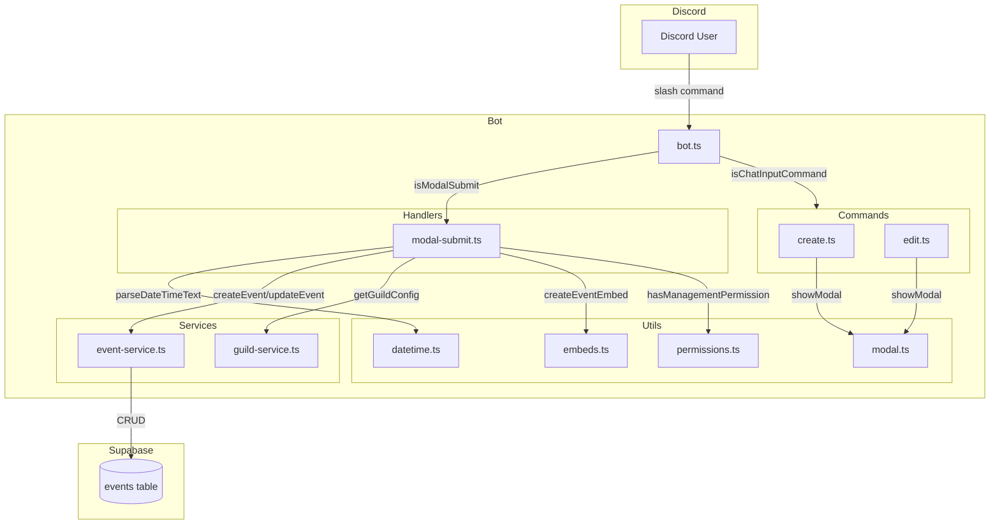
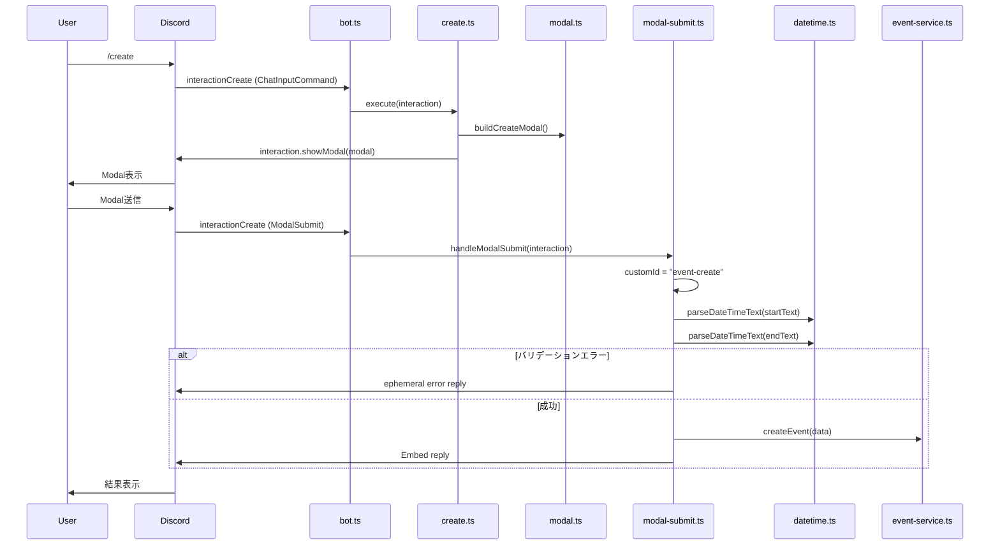
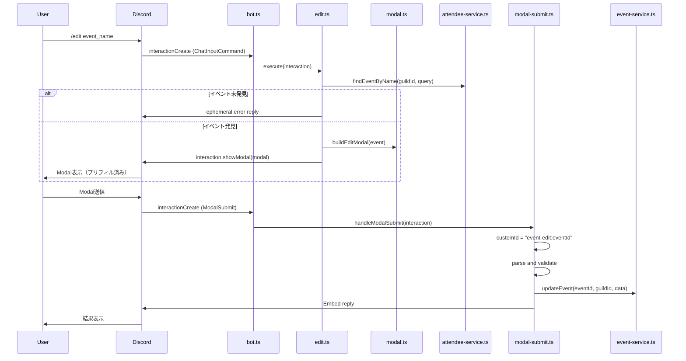

# Design Document: event-modal-ui

## Overview

**Purpose**: Discord Botの `/create` および `/edit` コマンドにDiscordモーダル（TextInputフォーム）を導入し、11個のスラッシュオプションを個別指定する現行方式から、5フィールドのフォーム入力方式に移行する。

**Users**: Discordサーバーのメンバーが、イベント作成・編集をより直感的に行える。

**Impact**: 既存のスラッシュオプション版コマンドは並行運用を維持しつつ、モーダル版を新たに追加する。`bot.ts` の `interactionCreate` ハンドラに `ModalSubmitInteraction` 処理を追加する。

### Goals

- `/create` コマンドでモーダルフォームによるイベント作成を実現する
- `/edit` コマンドで既存値プリフィル付きモーダルフォームによるイベント編集を実現する
- 柔軟な日時テキストパースを提供する（`YYYY/MM/DD HH:mm`, `MM/DD HH:mm`, `YYYY-MM-DD HH:mm`）
- 既存スラッシュオプション版との後方互換性を維持する

### Non-Goals

- 色・通知設定のモーダル対応（Phase 2: ボタン/セレクトメニューで対応予定）
- 繰り返しイベントのモーダル対応（Phase 2）
- 既存スラッシュオプション版の廃止

## Architecture

### Existing Architecture Analysis

**現在のコマンド処理フロー**:
- `bot.ts` の `interactionCreate` ハンドラが `isChatInputCommand()` のみフィルタ
- 各コマンドは `Command` 型（`{ data, execute }` ）として `Collection` に登録
- `execute` は `ChatInputCommandInteraction` を受け取り、バリデーション → Supabase保存 → Embed返信を実行

**維持すべきパターン**:
- Result型パターン（`{ success: true; data } | { success: false; error }`）
- エフェメラルエラーメッセージ
- JST前提の日時処理（内部UTC保持）
- `createEventEmbed` / `createErrorEmbed` によるEmbed構築

**変更が必要な箇所**:
- `bot.ts`: `interactionCreate` に `isModalSubmit()` 分岐を追加
- `commands/create.ts`: モーダル表示ロジックを追加
- `commands/edit.ts`: `deferReply()` の前にモーダル表示パスを追加
- `utils/datetime.ts`: テキストパーサー関数を追加

### Architecture Pattern & Boundary Map



**Architecture Integration**:
- **Selected pattern**: ハイブリッド — コマンド側でモーダル表示、新規ハンドラでModalSubmit処理（`research.md` Decision参照）
- **Domain boundaries**: コマンド（表示責務）/ ハンドラ（SubmitからCRUD処理）/ ユーティリティ（共通ロジック）
- **Existing patterns preserved**: Result型、エフェメラルエラー、JST日時処理、Embed構築
- **New components**: `handlers/modal-submit.ts`（ModalSubmitルーティング）、`utils/modal.ts`（モーダルビルダー）

### Technology Stack

| Layer | Choice / Version | Role in Feature | Notes |
|-------|------------------|-----------------|-------|
| Bot Framework | discord.js v14 | `ModalBuilder`, `TextInputBuilder`, `ModalSubmitInteraction` | 既存依存。新規ライブラリ追加なし |
| Data / Storage | Supabase (PostgreSQL) | イベントCRUD | 既存 `event-service.ts` をそのまま利用 |
| Runtime | Node.js (ES2022) | Bot実行環境 | 変更なし |
| Testing | Vitest | 新規ユーティリティ・ハンドラのテスト | 既存テスト基盤を利用 |

## System Flows

### イベント作成フロー（モーダル版）



### イベント編集フロー（モーダル版）



## Requirements Traceability

| Requirement | Summary | Components | Interfaces | Flows |
|-------------|---------|------------|------------|-------|
| 1.1 | `/create` でモーダル表示 | create.ts, modal.ts | buildCreateModal | 作成フロー |
| 1.2-1.6 | モーダルフィールド構成 | modal.ts | buildCreateModal | - |
| 2.1-2.2 | `/edit` でプリフィル付きモーダル表示 | edit.ts, modal.ts | buildEditModal | 編集フロー |
| 2.3 | イベント未発見エラー | edit.ts | - | 編集フロー |
| 3.1-3.4 | 日時テキストパース | datetime.ts | parseDateTimeText | 作成/編集フロー |
| 4.1-4.5 | 入力バリデーション | modal-submit.ts, datetime.ts | validateModalInput | 作成/編集フロー |
| 5.1-5.3 | Supabase永続化 | modal-submit.ts, event-service.ts | createEvent, updateEvent | 作成/編集フロー |
| 6.1-6.3 | Embed結果返信 | modal-submit.ts, embeds.ts | createEventEmbed | 作成/編集フロー |
| 7.1-7.3 | ModalSubmitハンドラ | bot.ts, modal-submit.ts | handleModalSubmit | 作成/編集フロー |
| 8.1-8.2 | 権限チェック | modal-submit.ts, permissions.ts | hasManagementPermission | 作成/編集フロー |
| 9.1-9.2 | 後方互換性 | create.ts, edit.ts | - | - |

## Components and Interfaces

| Component | Domain/Layer | Intent | Req Coverage | Key Dependencies | Contracts |
|-----------|--------------|--------|--------------|------------------|-----------|
| modal.ts | Utils | モーダルビルダーヘルパー | 1.1-1.6, 2.1-2.2 | discord.js (P0) | Service |
| datetime.ts（拡張） | Utils | 日時テキストパーサー追加 | 3.1-3.4 | なし | Service |
| modal-submit.ts | Handlers | ModalSubmit処理ルーティング | 4.1-5.3, 6.1-7.3, 8.1-8.2 | event-service (P0), guild-service (P0), embeds (P1), permissions (P1), datetime (P1) | Service |
| create.ts（拡張） | Commands | モーダル表示分岐追加 | 1.1, 9.1 | modal.ts (P0) | - |
| edit.ts（拡張） | Commands | モーダル表示分岐追加 | 2.1-2.3, 9.2 | modal.ts (P0), attendee-service (P0) | - |
| bot.ts（拡張） | Core | ModalSubmitハンドラ登録 | 7.1 | modal-submit.ts (P0) | - |

### Utils

#### modal.ts（新規）

| Field | Detail |
|-------|--------|
| Intent | イベント作成・編集用のDiscordモーダルを構築する |
| Requirements | 1.1, 1.2, 1.3, 1.4, 1.5, 1.6, 2.1, 2.2 |

**Responsibilities & Constraints**
- 5つの TextInput フィールド（タイトル、説明、開始日時、終了日時、終日フラグ）を持つモーダルを構築
- Discordの制約: 最大5 ActionRow、各1 TextInput
- プリフィル値の設定（編集時）

**Dependencies**
- External: discord.js — `ModalBuilder`, `TextInputBuilder`, `ActionRowBuilder`, `TextInputStyle` (P0)
- Inbound: create.ts, edit.ts — モーダル構築を依頼 (P0)

**Contracts**: Service [x]

##### Service Interface

```typescript
import type { ModalBuilder } from "discord.js";
import type { EventRecord } from "../types/event.js";

/** モーダルフィールドのcustomId定数 */
type ModalFieldIds = {
  title: "event-title";
  description: "event-description";
  startAt: "event-start-at";
  endAt: "event-end-at";
  isAllDay: "event-is-all-day";
};

/** モーダルのcustomIdプレフィックス */
type ModalCustomIds = {
  create: "event-create";
  editPrefix: "event-edit:";
};

/** イベント作成用モーダルを構築する */
function buildCreateModal(): ModalBuilder;

/** イベント編集用モーダルを構築する（既存値をプリフィル） */
function buildEditModal(event: EventRecord): ModalBuilder;

/** customIdからイベントIDを抽出する（editの場合） */
function parseEditCustomId(customId: string): string | null;
```

- Preconditions: なし（buildCreateModal）、event が有効な EventRecord（buildEditModal）
- Postconditions: 5つの ActionRow を含む有効な ModalBuilder を返す
- Invariants: customId は `event-create` または `event-edit:{uuid}` パターンに従う

**Implementation Notes**
- `buildEditModal` は `TextInputBuilder.setValue()` でプリフィル。日時は `formatDateTime()` でJST文字列に変換してセット
- 終日フラグは Short 形式で `true` / `false` をテキスト入力（Discordモーダルに Boolean 入力がないため）
- `MODAL_FIELD_IDS` と `MODAL_CUSTOM_IDS` を名前付き定数としてエクスポートし、modal-submit.ts と共有

#### datetime.ts（拡張）

| Field | Detail |
|-------|--------|
| Intent | テキスト形式の日時文字列を DateTimeParts にパースする |
| Requirements | 3.1, 3.2, 3.3, 3.4 |

**Responsibilities & Constraints**
- サポートフォーマット: `YYYY/MM/DD HH:mm`, `MM/DD HH:mm`, `YYYY-MM-DD HH:mm`
- 年省略時は現在年をデフォルト
- パース失敗時は Result 型でエラーを返す

**Dependencies**
- Inbound: modal-submit.ts — 日時テキストのパース (P0)

**Contracts**: Service [x]

##### Service Interface

```typescript
type DateTimeParts = {
  year: number;
  month: number;
  day: number;
  hour: number;
  minute: number;
};

type ParseDateTimeResult =
  | { success: true; data: DateTimeParts }
  | { success: false; error: string };

/** テキスト形式の日時文字列をパースする */
function parseDateTimeText(text: string): ParseDateTimeResult;
```

- Preconditions: text は空でないトリム済み文字列
- Postconditions: 成功時は有効な DateTimeParts を返す。失敗時はユーザー向けエラーメッセージを返す
- Invariants: パース成功時の DateTimeParts は `validateDate()` を通過する値である

**Implementation Notes**
- 正規表現で3パターンをマッチ。マッチ後に `validateDate()` で論理的な妥当性を検証
- `DateTimeParts` 型は既存の `DateInput` 型と統合可能（hour/minute を必須にしたバリアント）
- 外部ライブラリ不使用（`research.md` Decision参照）

### Handlers

#### modal-submit.ts（新規）

| Field | Detail |
|-------|--------|
| Intent | ModalSubmitInteraction を受け取り、バリデーション → 永続化 → レスポンスを実行する |
| Requirements | 4.1-4.5, 5.1-5.3, 6.1-6.3, 7.1-7.3, 8.1-8.2 |

**Responsibilities & Constraints**
- customId によるルーティング（`event-create` / `event-edit:{eventId}`）
- フィールド値の抽出とバリデーション
- 権限チェック（restricted guild）
- Supabase への永続化（createEvent / updateEvent）
- 結果 Embed の返信

**Dependencies**
- Inbound: bot.ts — `interactionCreate` イベントからの呼び出し (P0)
- Outbound: event-service.ts — `createEvent`, `updateEvent`, `getEventById` (P0)
- Outbound: guild-service.ts — `getGuildConfig` (P0)
- Outbound: embeds.ts — `createEventEmbed`, `createErrorEmbed` (P1)
- Outbound: permissions.ts — `hasManagementPermission` (P1)
- Outbound: datetime.ts — `parseDateTimeText` (P1)
- Outbound: modal.ts — `MODAL_FIELD_IDS`, `MODAL_CUSTOM_IDS`, `parseEditCustomId` (P1)

**Contracts**: Service [x]

##### Service Interface

```typescript
import type { ModalSubmitInteraction } from "discord.js";

/** ModalSubmitInteraction を処理するエントリーポイント */
function handleModalSubmit(interaction: ModalSubmitInteraction): Promise<void>;
```

- Preconditions: interaction.isModalSubmit() === true
- Postconditions: interaction に対して reply（成功Embed or エフェメラルエラー）を送信済み
- Invariants: 不明な customId の場合は処理をスキップ（ログ出力のみ）

**Implementation Notes**
- **バリデーションフロー**: フィールド値抽出 → タイトル必須チェック → 日時パース → 前後関係チェック → 終日フラグパース → 権限チェック → 永続化
- **権限チェックタイミング**: モーダルは表示済みなので、Submit時に権限チェックを行う。表示時にも権限チェックを行う（コマンド側）ことで二重チェック
- **エラーハンドリング**: 全バリデーションエラーはエフェメラルメッセージで返信。Supabaseエラーは `classifySupabaseError` でドメインエラーに変換
- **edit時のイベント取得**: customIdからeventIdを抽出し、`getEventById()` で取得。存在しなければエラー

### Commands（拡張）

#### create.ts（拡張）

| Field | Detail |
|-------|--------|
| Intent | `/create` コマンドにモーダル表示パスを追加する |
| Requirements | 1.1, 9.1 |

**Implementation Notes**
- `execute` 関数内で、スラッシュオプションが指定されていない場合にモーダルを表示する分岐を追加
- オプションが指定されている場合は既存ロジックをそのまま実行（後方互換性）
- 判定ロジック: `name` オプションが null の場合 → モーダル表示
- モーダル表示前の権限チェック: restricted guild の場合はモーダル表示前にチェックし、権限不足ならエフェメラルエラーを返す

#### edit.ts（拡張）

| Field | Detail |
|-------|--------|
| Intent | `/edit` コマンドにモーダル表示パスを追加する |
| Requirements | 2.1, 2.2, 2.3, 9.2 |

**Implementation Notes**
- `execute` 関数内で、`event` オプション以外のオプションが未指定の場合にモーダル表示パスに分岐
- モーダルパス: イベント検索 → 権限チェック → `buildEditModal(event)` → `showModal()`（`deferReply()` を呼ばない）
- 既存パス: 従来通り `deferReply()` → オプション処理（後方互換性）
- 判定ロジック: `name`, `start_year` 等の編集オプションが全て null の場合 → モーダル表示

#### bot.ts（拡張）

| Field | Detail |
|-------|--------|
| Intent | `interactionCreate` に `ModalSubmitInteraction` ハンドラを登録する |
| Requirements | 7.1 |

**Implementation Notes**
- 既存の `registerEventHandlers` 内の `interactionCreate` ハンドラを拡張
- `isChatInputCommand()` の前に `isModalSubmit()` チェックを追加
- ModalSubmit の場合は `handleModalSubmit(interaction)` にディスパッチ
- エラーハンドリングは既存のコマンドエラーハンドリングと同じパターン（try-catch + followUp）

## Data Models

### Domain Model

データモデルの変更なし。既存の `EventRecord` / `EventCreate` / `EventUpdate` 型をそのまま使用する。

### Data Contracts & Integration

**モーダルフィールド → EventCreate/EventUpdate マッピング**:

| Modal Field (customId) | 型 | EventCreate | EventUpdate |
|------------------------|----|-------------|-------------|
| `event-title` | string (required) | `name` | `name` |
| `event-description` | string (optional) | `description` | `description` |
| `event-start-at` | string → DateTimeParts → ISO | `start_at` | `start_at` |
| `event-end-at` | string → DateTimeParts → ISO | `end_at` | `end_at` |
| `event-is-all-day` | string → boolean | `is_all_day` | `is_all_day` |

**日時変換フロー**: テキスト入力 → `parseDateTimeText()` → `DateTimeParts` → `validateDate()` → JST→UTCの `jstPartsToUtcIso()` → ISO文字列

## Error Handling

### Error Categories and Responses

**User Errors (バリデーション)**:

| エラー条件 | メッセージ例 | 要件 |
|-----------|------------|------|
| タイトル未入力 | 「タイトルは必須です」 | 4.1 |
| 開始日時パースエラー | 「開始日時のフォーマットが不正です。例: 2025/03/29 15:00」 | 4.2 |
| 終了日時パースエラー | 「終了日時のフォーマットが不正です。例: 2025/03/29 16:00」 | 4.3 |
| 開始 >= 終了 | 「開始時間が終了時間以降になっています」 | 4.4 |
| 終日フラグ不正 | 「終日の値は true または false で入力してください」 | 4.5 |
| イベント未発見（edit） | 「指定されたイベントが見つかりません」 | 2.3 |

**System Errors**:

| エラー条件 | メッセージ例 | 要件 |
|-----------|------------|------|
| Supabase保存失敗 | 「予定の作成に失敗しました」/ 「予定の更新に失敗しました」 | 5.3 |
| ギルド設定取得失敗 | 「ギルド設定の取得に失敗しました」 | 8.1-8.2 |

全エラーはエフェメラルメッセージ（`ephemeral: true`）として返信。pinoによるエラーログ出力は既存パターンを踏襲。

## Testing Strategy

### Unit Tests

1. **`parseDateTimeText()`**: 3フォーマットの正常系、年省略、無効入力、境界値（月末、うるう年）
2. **`buildCreateModal()`**: 5つの ActionRow、正しい customId・ラベル・スタイル・プレースホルダー
3. **`buildEditModal(event)`**: プリフィル値が正しくセットされること、日時のJSTフォーマット
4. **`parseEditCustomId()`**: `event-edit:uuid` からUUID抽出、不正パターンで null
5. **`handleModalSubmit()`**: 作成成功・更新成功・各バリデーションエラー・権限エラー・Supabaseエラー

### Integration Tests

1. **作成フロー E2E**: `/create`（オプションなし）→ モーダル表示 → Submit → イベント作成 → Embed返信
2. **編集フロー E2E**: `/edit event_name`（編集オプションなし）→ イベント検索 → モーダル表示（プリフィル）→ Submit → イベント更新
3. **後方互換性**: `/create name:xxx start_year:2025 ...`（全オプション指定）→ 従来通りのフロー
4. **権限チェック**: restricted guild で権限なしユーザー → エフェメラルエラー（モーダル表示前・Submit時の両方）
