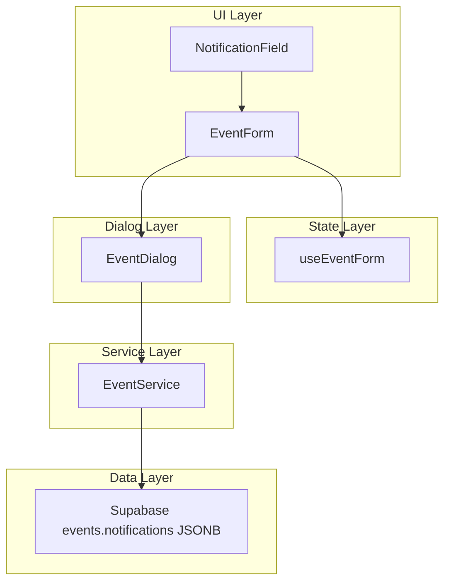
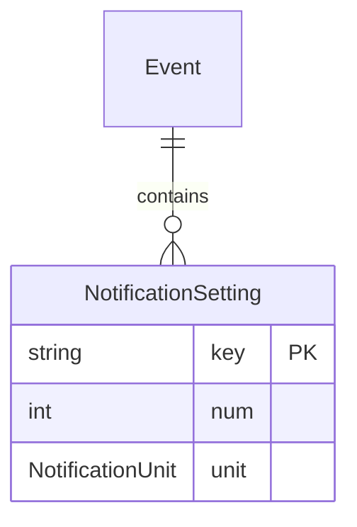

# Design Document: event-notifications

## Overview

**Purpose**: イベント通知設定機能は、イベント作成者がイベントごとに通知タイミング（例: 1時間前、3日前）を最大10件まで設定できる機能を提供する。

**Users**: Discord コミュニティのイベント作成者が、予定の見逃しを防ぐために通知を設定する。

**Impact**: 既存の `EventForm` / `EventService` / 型定義を拡張し、DB の `events.notifications` JSONB カラム（既存）にユーザー通知設定を保存する。

### Goals
- イベントフォーム内で通知タイミングの追加・削除・表示ができる UI を提供する
- 通知設定を既存のイベント CRUD フローに統合し、JSONB カラムで永続化する
- 型安全な通知データモデルを定義し、フォーム〜サービス〜DB の全レイヤーで一貫した型を使用する

### Non-Goals
- Discord Bot 側の通知送信ロジック（既存 Bot 機能のスコープ）
- `event_settings` テーブル（通知チャンネル設定）の管理 UI
- 通知送信履歴の表示（`append_notification()` 関数は Bot 用途）
- リアルタイム通知プレビュー

## Architecture

### Existing Architecture Analysis

既存のイベント CRUD フローは以下のレイヤーで構成される:

```
EventForm (UI) → useEventForm (状態管理) → EventDialog (変換) → useEventMutation (非同期) → EventService (DB操作) → Supabase
```

通知機能はこの既存フローに沿って、各レイヤーに通知データを追加する形で拡張する。

**維持するパターン**:
- `useEventForm` フックによるフォーム状態・バリデーション管理
- `EventDialog` でのフォームデータ → サービス入力型の変換
- `EventService` による Supabase 操作の抽象化
- Co-location パターン（コンポーネント・テスト・ストーリーの同一ディレクトリ配置）

### Architecture Pattern & Boundary Map



**Architecture Integration**:
- **Selected pattern**: 既存レイヤードアーキテクチャの拡張
- **Domain boundary**: 通知設定はイベントドメインのサブ機能として、`components/calendar/` と `lib/calendar/` に配置
- **Existing patterns preserved**: useEventForm パターン、EventService CRUD パターン、Co-location パターン
- **New component rationale**: `NotificationField` は通知追加・削除・チップ表示・バリデーションを含む複合 UI であり、他の単純フィールド（`TitleField` 等）とは異なる複雑度を持つため独立コンポーネントとして分離

### Technology Stack

| Layer | Choice / Version | Role in Feature | Notes |
|-------|------------------|-----------------|-------|
| Frontend | React 19, shadcn/ui (Badge, Select, Input, Button) | 通知設定 UI コンポーネント | 新規依存なし |
| State | useEventForm フック拡張 | 通知状態管理・バリデーション | 既存パターン踏襲 |
| Service | EventService 拡張 | 通知データの CRUD | 既存インターフェース拡張 |
| Data | Supabase PostgreSQL (JSONB) | `events.notifications` カラム | 既存カラム活用 |

## Requirements Traceability

| Requirement | Summary | Components | Interfaces | Flows |
|-------------|---------|------------|------------|-------|
| 1.1 | フォーム内に通知セクション表示 | EventForm, NotificationField | EventFormProps | - |
| 1.2 | 数値+単位で通知設定 | NotificationField | NotificationFieldProps | 通知追加フロー |
| 1.3 | チップ形式で表示 | NotificationField | NotificationSetting | - |
| 1.4 | チップ削除 | NotificationField | onRemove callback | - |
| 1.5 | 10件上限制御 | NotificationField | MAX_NOTIFICATIONS 定数 | - |
| 1.6 | 数値範囲バリデーション | NotificationField | validateNotificationNum | - |
| 2.1 | 保存時に JSONB 永続化 | EventService | CreateEventInput.notifications | 保存フロー |
| 2.2 | 編集時に復元表示 | EventDialog, useEventForm | EventFormData.notifications | 復元フロー |
| 2.3 | 変更時に上書き保存 | EventService | UpdateEventInput.notifications | 更新フロー |
| 2.4 | 全削除で空配列保存 | EventService | notifications: [] | - |
| 3.1 | 通知タイミング型 | types.ts | NotificationSetting | - |
| 3.2 | 単位列挙型 | types.ts | NotificationUnit | - |
| 3.3 | EventRecord 拡張 | types.ts | EventRecord.notifications | - |
| 3.4 | Input 型拡張 | event-service.ts | CreateEventInput, UpdateEventInput | - |
| 4.1 | キーボード操作 | NotificationField | - | - |
| 4.2 | ARIA ラベル | NotificationField | aria-label 属性 | - |
| 4.3 | 件数読み上げ | NotificationField | aria-live, aria-describedby | - |
| 4.4 | ライブリージョン通知 | NotificationField | aria-live region | - |
| 5.1 | 重複チェック | NotificationField | isDuplicate 判定 | - |
| 5.2 | 保存エラー表示 | EventDialog | CalendarError | - |
| 5.3 | 0件で保存可能 | EventService | notifications?: [] | - |

## Components and Interfaces

| Component | Domain/Layer | Intent | Req Coverage | Key Dependencies | Contracts |
|-----------|--------------|--------|--------------|-----------------|-----------|
| NotificationField | UI | 通知タイミングの追加・表示・削除 UI | 1.1-1.6, 4.1-4.4, 5.1 | Badge, Select, Input, Button (P0) | State |
| useEventForm 拡張 | State | 通知状態管理・バリデーション統合 | 1.2, 1.6, 2.2, 5.1 | NotificationSetting型 (P0) | State |
| EventService 拡張 | Service | 通知データの JSONB 読み書き | 2.1-2.4, 3.3-3.4, 5.2-5.3 | Supabase Client (P0) | Service |
| 型定義追加 | Data | NotificationSetting, NotificationUnit | 3.1-3.2 | - | - |
| EventDialog 拡張 | Dialog | 通知データ変換の追加 | 2.1-2.3 | EventService (P0) | - |

### UI Layer

#### NotificationField

| Field | Detail |
|-------|--------|
| Intent | 通知タイミングの入力・チップ表示・削除を提供する複合フォームフィールド |
| Requirements | 1.1, 1.2, 1.3, 1.4, 1.5, 1.6, 4.1, 4.2, 4.3, 4.4, 5.1 |

**Responsibilities & Constraints**
- 数値入力（1〜99）と単位選択のコンボによる通知タイミング入力
- 設定済み通知の Badge チップ表示と削除機能
- 10件上限の制御（追加ボタン無効化 + メッセージ表示）
- 重複チェック（同一 num + unit の組み合わせ）
- ARIA 属性によるアクセシビリティ

**Dependencies**
- Inbound: EventForm — props として通知リストと操作コールバックを受け取る (P0)
- External: shadcn/ui Badge, Select, Input, Button — UI プリミティブ (P0)
- External: lucide-react Bell, X — アイコン (P2)

**Contracts**: State [x]

##### State Management

```typescript
interface NotificationFieldProps {
  notifications: NotificationSetting[];
  onAdd: (notification: NotificationSetting) => void;
  onRemove: (key: string) => void;
  maxNotifications?: number; // default: 10
  error?: string;
}
```

- 内部状態: `inputNum` (number), `inputUnit` (NotificationUnit)
- 追加時: `onAdd` コールバックで親に通知を渡す
- 削除時: `onRemove` コールバックで key を渡す
- 上限到達時: 追加ボタンを `disabled` にし、aria-live でメッセージ表示

**Implementation Notes**
- 入力欄は数値 `<Input type="number">` と `<Select>` の横並びレイアウト
- チップは `<Badge variant="secondary">` + 削除ボタン（`<X>` アイコン）
- 各チップに `aria-label="N 単位前の通知を削除"` を設定
- セクション全体に `aria-describedby` で件数と上限を提供
- ライブリージョン (`aria-live="polite"`) で追加・削除操作の結果を通知

### State Layer

#### useEventForm 拡張

| Field | Detail |
|-------|--------|
| Intent | EventFormData に notifications を追加し、状態管理・バリデーション機能を拡張 |
| Requirements | 1.2, 1.6, 2.2, 5.1 |

**Contracts**: State [x]

##### State Management

```typescript
// EventFormData への追加
interface EventFormData {
  // ... 既存フィールド
  notifications: NotificationSetting[];
}

// 追加するメソッド
interface UseEventFormReturn {
  // ... 既存メソッド
  addNotification: (notification: Omit<NotificationSetting, "key">) => boolean;
  removeNotification: (key: string) => void;
}
```

- `addNotification`: 重複チェック + 上限チェックの後、`crypto.randomUUID()` で key を生成して追加。成功時 `true`、失敗時 `false` を返す
- `removeNotification`: key に一致する通知を配列から削除
- 初期値: `defaultValues?.notifications ?? []`

**Implementation Notes**
- 既存の `validate()` に通知バリデーション追加は不要（通知は追加時にインラインでバリデーション）
- `reset()` で notifications を空配列にリセット

### Service Layer

#### EventService 拡張

| Field | Detail |
|-------|--------|
| Intent | 通知データの JSONB 保存・読み取りをイベント CRUD に統合 |
| Requirements | 2.1, 2.2, 2.3, 2.4, 3.3, 3.4, 5.2, 5.3 |

**Contracts**: Service [x]

##### Service Interface

```typescript
// CreateEventInput への追加
interface CreateEventInput {
  // ... 既存フィールド
  notifications?: NotificationSetting[];
}

// UpdateEventInput への追加
interface UpdateEventInput {
  // ... 既存フィールド
  notifications?: NotificationSetting[];
}
```

- Preconditions: notifications が指定された場合、各要素が NotificationSetting 型に適合すること
- Postconditions: `events.notifications` カラムに JSONB 配列として保存される
- Invariants: notifications 未指定時は既存値を維持（update）、空配列をデフォルト（create）

**Implementation Notes**
- `createEvent()`: `insertData` に `notifications: input.notifications ?? []` を追加
- `updateEvent()`: `notifications` が `UpdateEventInput` に含まれる場合のみ `updateData` に追加
- `toCalendarEvent()`: `EventRecord.notifications` を `CalendarEvent` に変換（通知設定をフォーム復元に使用）

### Dialog Layer

#### EventDialog 拡張

| Field | Detail |
|-------|--------|
| Intent | EventFormData と CreateEventInput/UpdateEventInput 間の通知データ変換 |
| Requirements | 2.1, 2.2, 2.3 |

**Implementation Notes**
- `toCreateEventInput()`: `formData.notifications` をそのまま `CreateEventInput.notifications` に渡す
- `toUpdateEventInput()`: `formData.notifications` を `UpdateEventInput.notifications` に渡す
- 編集モード初期化: `CalendarEvent.notifications` → `EventFormData.notifications` に変換して `defaultValues` に設定

## Data Models

### Domain Model



**ビジネスルール**:
- 1つのイベントに最大10件の通知設定
- 同一の `num` + `unit` 組み合わせの重複禁止
- `num` は 1〜99 の整数
- `unit` は `minutes`, `hours`, `days`, `weeks` のいずれか

### Logical Data Model

```typescript
type NotificationUnit = "minutes" | "hours" | "days" | "weeks";

interface NotificationSetting {
  key: string;
  num: number;
  unit: NotificationUnit;
}
```

**表示ラベルマッピング**:

| 内部値 | 表示ラベル |
|-------|-----------|
| `minutes` | 分前 |
| `hours` | 時間前 |
| `days` | 日前 |
| `weeks` | 週間前 |

### Physical Data Model

**既存カラム**: `events.notifications JSONB DEFAULT '[]'::jsonb`

**保存形式**:
```json
[
  {"key": "a1b2c3d4-...", "num": 1, "unit": "hours"},
  {"key": "e5f6g7h8-...", "num": 3, "unit": "days"}
]
```

**注意**: 同一カラムに Bot 通知ログ（`{timestamp, status, error}` 形式）が `append_notification()` 経由で追加される可能性がある。Web UI は `num` フィールドを持つオブジェクトのみをユーザー通知設定として扱う。

### Data Contracts

**EventRecord 拡張**:
```typescript
interface EventRecord {
  // ... 既存フィールド
  notifications: NotificationSetting[];
}
```

**CalendarEvent 拡張**:
```typescript
interface CalendarEvent {
  // ... 既存フィールド
  notifications?: NotificationSetting[];
}
```

## Error Handling

### Error Categories and Responses

**User Errors**:
- 数値範囲外（1未満 or 99超）: フィールド横にインラインエラーメッセージ表示
- 重複通知: インラインエラーメッセージ「同じ通知設定が既に存在します」
- 上限到達: 追加ボタン無効化 + 「通知は最大10件まで設定できます」メッセージ

**System Errors**:
- 通知を含むイベント保存失敗: 既存の `CalendarError` フレームワークで `CREATE_FAILED` / `UPDATE_FAILED` を返す（通知固有の追加エラーコード不要）

## Testing Strategy

### Unit Tests
- `NotificationField`: レンダリング、追加操作、削除操作、上限制御、重複チェック、ARIA属性
- `useEventForm` 拡張: 通知追加・削除の状態管理、バリデーション、リセット
- 型定義: `NotificationUnit` / `NotificationSetting` の型ガード

### Integration Tests
- `EventService.createEvent()`: notifications 付きイベント作成の成功・失敗
- `EventService.updateEvent()`: notifications 更新・空配列保存
- `EventDialog`: フォームデータ → サービス入力型への通知データ変換

### E2E/UI Tests
- イベント作成時に通知を追加して保存 → 再編集で復元を確認
- 通知削除後に保存 → 再編集で削除が反映されていることを確認

### Storybook Stories
- `NotificationField`: Default, WithNotifications, MaxNotifications, Empty
- `EventForm`: WithNotifications（通知設定付きの編集モード）
