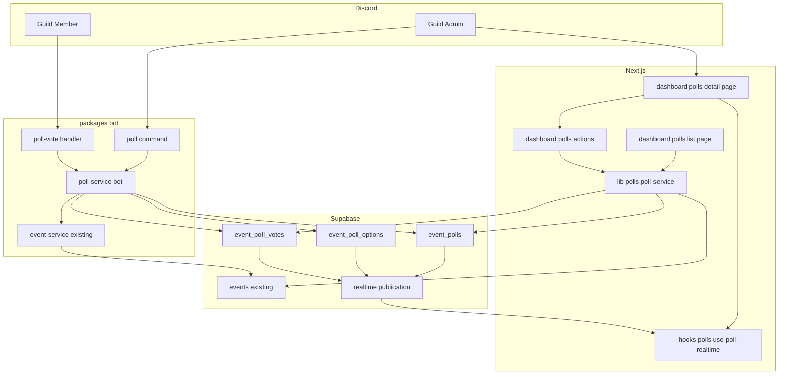
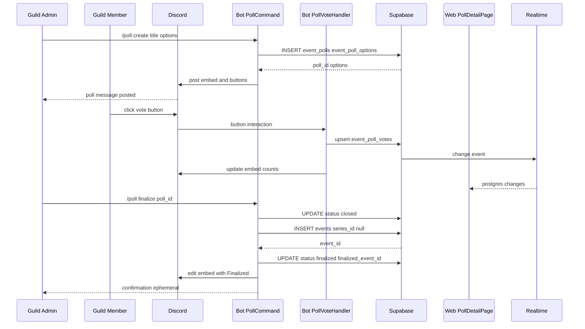
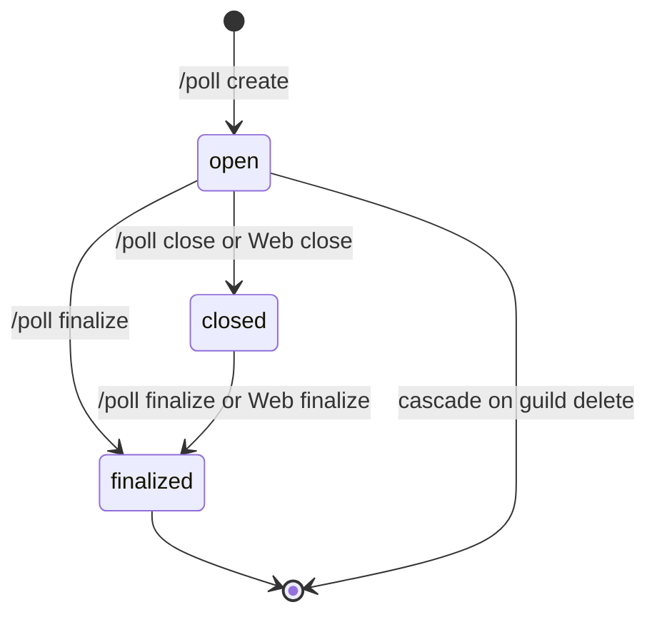
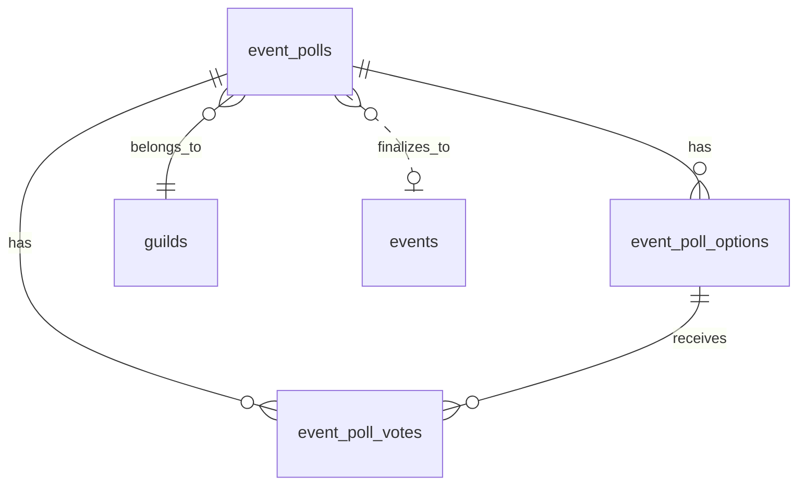
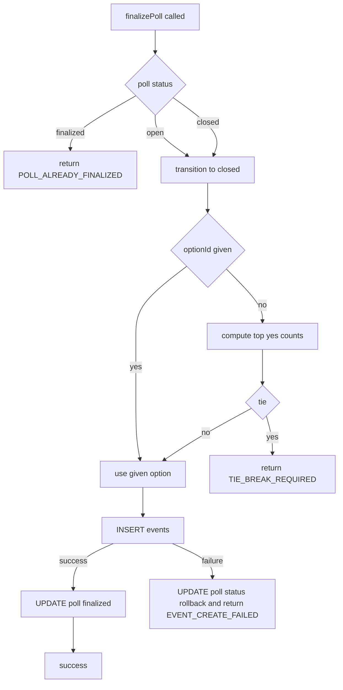
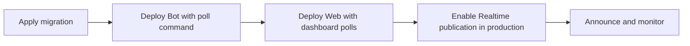

# Technical Design: event-poll

## Overview

**Purpose**: Discord Bot の `/poll` スラッシュコマンドと Web ダッシュボードを連動させ、ギルド管理者が登録した複数候補日時に対しメンバーが ○/△/× で投票し、最多得票候補を既存 `events` テーブルへワンクリックで昇格させるエンドツーエンドの日程調整機能を提供する。

**Users**: ギルド管理者は `/poll create` で投票を開始し、`/poll close` と `/poll finalize`（または Web の確定ボタン）で投票のライフサイクルを制御する。ギルドメンバーは Discord メッセージ上のボタンで回答し、Web ダッシュボードの投票一覧で集計を視覚的に把握する。

**Impact**: 既存のイベント作成フロー（日時確定済みを前提とするスラッシュコマンド群）と平行に、「投票 → 確定 → イベント化」の新フローを追加する。既存 `events` / `event_series` の読み書きパスには触れず、確定時のみ `events` に INSERT する片方向依存に保つ。

### Goals

- Bot 側で `/poll create` / `/poll close` / `/poll finalize` サブコマンドを提供し、最大 10 件の候補日時で投票を運用できる。
- Web ダッシュボードに投票一覧・投票詳細ページを追加し、Supabase Realtime で集計をリアルタイム同期する。
- 確定操作で既存 `events` テーブルへ単発イベントを挿入し、RSVP・通知・ICS 出力など既存ハンドラを再利用する。
- Bot とクライアントが Discord 再起動・Next.js 再デプロイをまたいでも投票状態を失わない永続設計を保証する。

### Non-Goals

- 投票締切の自動化（cron トリガ）は対象外。v2 で検討。
- 投票の匿名化モード、Google カレンダーとの空き時間自動突合は対象外。
- Web 側から投票へ直接回答する（Discord を経由しない）機能は対象外。Web は集計表示と管理操作のみ。
- 既存 `event_series`（繰り返しイベント）とのマージ／置換はスコープ外。確定で作成されるのは常に単発イベント（`series_id = NULL`）。

## Architecture

### Existing Architecture Analysis

- **Bot インタラクション**: `packages/bot/src/bot.ts::handleInteraction` が `isChatInputCommand` と `isModalSubmit` を振り分ける構造。今回は `isButton` 分岐を追加し、customId プレフィックス `poll:` を `handlers/poll-vote.ts` に委譲するパターンを既存 `handlers/modal-submit.ts` と揃える。
- **Bot サービス層**: `packages/bot/src/services/*-service.ts` は Result 型（`{ success: true; data } | { success: false; error: { code, message, details? } }`）を返却し、`classify-error.ts` が Postgres エラーを分類。新設する `poll-service.ts` も同じ流儀に従う。
- **Web Server Action**: `app/dashboard/actions.ts` では `createClient()`（Cookie 認証）→ Service 呼び出し → `sanitizeResult()` で details を削って返却するパイプラインが確立。新規 `app/dashboard/polls/actions.ts` もこのパターンで統一する。
- **Supabase Realtime**: `hooks/calendar/use-realtime-sync.ts` の実装（`pendingMutationIdsRef` で自身の mutation 抑止、debounce で refetch）をテンプレートとして `hooks/polls/use-poll-realtime.ts` を新設。既存 publication 追加マイグレーション（`20260328023023_*`）と REPLICA IDENTITY FULL 設定（`20260327162902_*`）を踏襲する。
- **イベント整合**: `events.series_id` は nullable で `NULL` が単発イベント。確定時は `series_id = NULL` で INSERT するため既存 series 整合性ロジックに干渉しない。

### Architecture Pattern & Boundary Map



**Architecture Integration**:
- **Selected pattern**: 既存モノレポの「Bot は service_key 経由 / Web は RLS 経由で同一テーブルを共有」パターンを踏襲した共通データモデル型。ビジネスロジック（finalize / close）は Bot 側 `poll-service` と Web 側 `lib/polls/poll-service` に**関数単位で並行実装**し、両者が同じ Result コードを返すテストで等価性を担保する。
- **Domain/feature boundaries**: (a) Bot サブコマンド層、(b) Bot 永続ボタンハンドラ、(c) Bot 共通 PollService、(d) Web Page/Server Action、(e) Web Poll Service、(f) Realtime Hook — の 6 境界で責務分離し、チーム並行実装を可能にする。
- **Existing patterns preserved**: Command の satisfies 型、Result / classify-error、`events` / `event_series` スキーマ不変、`hooks/calendar/use-realtime-sync` のパターン、`app/dashboard/actions` の `sanitizeResult`。
- **New components rationale**: Bot の長命ボタン振り分けは既存コマンド内 Collector では寿命不足のため `handlers/poll-vote.ts` を新設。Web の確定 UI は既存ダッシュボードに完全新規ルートを追加（`/dashboard/polls`）。
- **Steering compliance**: `.kiro/steering/tech.md`（Ultracite, Result 型, RLS）、`structure.md`（ドメインごとの services/hooks/lib 配置）、`workflow.md`（SDD → 実装 → PR）をすべて踏襲。

### Technology Stack

| Layer | Choice / Version | Role in Feature | Notes |
|-------|------------------|-----------------|-------|
| Discord | discord.js v14 | `/poll` コマンド、ButtonInteraction、Embed 表示 | 既存コマンドと同バージョン |
| Bot Runtime | Node.js 20 (ES2022) | Bot プロセス | 既存 `packages/bot` と同設定 |
| Web | Next.js 16 (App Router) + React 19 | 投票一覧・詳細ページ、Server Action | 既存 `app/dashboard` と同ランタイム |
| Data | Supabase Postgres | `event_polls` / `event_poll_options` / `event_poll_votes` の新設、`events` への昇格 INSERT | 既存 events と同インスタンス |
| Realtime | Supabase Realtime (publication `supabase_realtime`) | 投票更新の Web 反映 | 新規 3 テーブルを publication 追加 |
| Logging | pino (Bot) / console + Sentry (Web) | 構造化ログ、finalize / close 操作監査 | 既存 `utils/logger.ts` と同 |
| Testing | Vitest + Testing Library (Web) / Vitest (Bot) / Playwright (E2E) | 単体・統合・E2E | 既存と同 |

詳細な比較と選定経緯は `research.md` の Architecture Pattern Evaluation を参照。

## System Flows

### 投票作成〜回答〜確定のシーケンス



### 投票ライフサイクル状態遷移



確定は `open` から直接でも可能とする（要件 4.5）。`closed` への巻き戻しは提供しない（要件 3.4 の冪等）。

## Requirements Traceability

| Requirement | Summary | Components | Interfaces | Flows |
|-------------|---------|------------|------------|-------|
| 1.1, 1.5, 1.7 | /poll create でメッセージ投稿と DB 作成 | PollCommand, PollService(Bot) | `createPoll(input)` | 作成シーケンス |
| 1.2, 1.3 | 候補件数バリデーション（2〜10件） | PollCommand | 入力バリデーション | 作成シーケンス |
| 1.4 | 管理権限チェック | PollCommand | `hasManagementPermission` 再利用 | 作成シーケンス |
| 1.6 | メッセージ投稿失敗時のロールバック | PollCommand, PollService(Bot) | `deletePoll`, Embed 失敗マーク | 作成シーケンス |
| 2.1, 2.2, 2.3 | ボタン押下で upsert / 取消 / 上書き | PollVoteHandler, PollService(Bot) | `castVote(input)` | 投票シーケンス |
| 2.4 | closed/finalized 状態では投票不可 | PollVoteHandler | `castVote` precondition | 状態遷移図 |
| 2.5, 2.6 | 集計をメッセージに反映 | PollVoteHandler, PollEmbedBuilder | `buildPollEmbed` | 投票シーケンス |
| 3.1, 3.2 | `/poll close` で状態遷移とボタン無効化 | PollCommand, PollService(Bot) | `closePoll(pollId, actor)` | 状態遷移図 |
| 3.3, 3.4, 3.5 | close のエラーハンドリング | PollCommand | エラーコード分類 | - |
| 4.1〜4.9 | `/poll finalize` で events 昇格 | PollCommand, PollService(Bot), PollFinalizeService(Shared) | `finalizePoll(input)` | 確定シーケンス |
| 5.1, 5.2, 5.3 | Web で一覧と集計をリアルタイム表示 | PollListPage, PollDetailPage, UsePollRealtime | Page props, `usePollRealtime` | 投票シーケンス |
| 5.4, 5.5 | ギルドメンバーのみアクセス、管理者のみ操作 UI | PollListPage, PollDetailPage | RLS + 権限判定 | - |
| 5.6, 5.7 | Web からの確定・締切 | PollActions, PollService(Web) | `finalizePollAction`, `closePollAction` | 確定シーケンス |
| 6.1〜6.7 | event_polls / options / votes スキーマ | Migration | マイグレーション SQL | - |
| 7.1, 7.2 | series_id NULL で INSERT、既存ハンドラ共用 | PollFinalizeService | `finalizePoll` 実装 | 確定シーケンス |
| 7.3 | 既存イベント重複の警告 | PollFinalizeService | Result の warning | 確定シーケンス |
| 7.4 | メッセージ欠損時の 500 防止 | PollVoteHandler | `castVote` の NOT_FOUND 分岐 | - |
| 7.5 | events 削除時 finalized_event_id を SET NULL | Migration | FK 定義 | - |
| 8.1, 8.2, 8.3 | 操作ログ・finalized_by 記録・Web エラーの漏洩防止 | PollLogger, PollService, PollActions | 構造化ログ、`sanitizeResult` | - |

## Components and Interfaces

| Component | Domain/Layer | Intent | Req Coverage | Key Dependencies (P0/P1) | Contracts |
|-----------|--------------|--------|--------------|--------------------------|-----------|
| PollCommand | Bot / Command | `/poll create` `/poll close` `/poll finalize` サブコマンド | 1.x, 3.x, 4.x | PollService-Bot (P0), embeds util (P1) | Service |
| PollVoteHandler | Bot / Handler | 永続ボタン interaction のルーティング | 2.x, 7.4 | PollService-Bot (P0), Discord runtime (P0) | Service, Event |
| PollService (Bot) | Bot / Service | Bot 経路の Supabase CRUD と finalize ロジック | 1.5, 1.6, 2.x, 3.x, 4.x, 7.x | supabase-js service key (P0), event-service (P1) | Service |
| PollEmbedBuilder | Bot / Util | 投票 Embed 組み立て（集計表示、最大 20 名） | 1.1, 2.5, 2.6, 3.2, 4.8 | discord.js Embed (P0) | (Util) |
| PollListPage | Web / Page | `/dashboard/polls` 投票一覧 | 5.1, 5.4 | PollService-Web (P0), Supabase server client (P0) | State |
| PollDetailPage | Web / Page | `/dashboard/polls/[pollId]` 投票詳細 | 5.2, 5.3, 5.5 | PollService-Web (P0), usePollRealtime (P0) | State |
| PollActions | Web / ServerAction | `finalizePollAction` / `closePollAction` | 5.6, 5.7, 8.3 | PollService-Web (P0), sanitizeResult (P0) | Service |
| PollService (Web) | Web / Service | Web 経路の Supabase CRUD と finalize | 4.x, 5.6, 5.7 | supabase-js (Cookie auth) (P0), events service (P1) | Service |
| usePollRealtime | Web / Hook | Supabase Realtime 購読と debounce refetch | 5.3 | supabase-js client (P0) | State |
| event-poll Migration | Data / SQL | 3 テーブル新設、RLS、publication 登録 | 6.x, 7.5 | 既存 events スキーマ (P0) | Batch |
| PollLogger | Shared / Util | 構造化ログ出力（Bot pino / Web console） | 8.1 | pino / console (P0) | (Util) |

UI ページはサーバーコンポーネントのシェル + クライアントコンポーネントの分割で構成する。以下では新規境界を含むコンポーネントに限り詳細ブロックを記載する。

### Bot Layer

#### PollCommand

| Field | Detail |
|-------|--------|
| Intent | `/poll create` / `/poll close` / `/poll finalize` サブコマンド実装 |
| Requirements | 1.1, 1.2, 1.3, 1.4, 1.6, 1.7, 3.1, 3.3, 3.4, 3.5, 4.1, 4.4, 4.6, 4.8 |

**Responsibilities & Constraints**
- Discord スラッシュコマンドの入力解釈、権限チェック、`deferReply({ ephemeral: true })` 実行。
- PollService へのディスパッチと Embed / Button の初期投稿、失敗時のメッセージ削除。
- `/poll finalize` 時に同票複数候補なら `option` オプション未指定でエラーを返し、ユーザーに候補一覧を ephemeral で提示する（Requirement 4.4）。

**Dependencies**
- Inbound: Discord Gateway `interactionCreate` → `DiscalendarBot.handleInteraction` (P0)
- Outbound: PollService (Bot) `createPoll` / `closePoll` / `finalizePoll` (P0)
- External: `hasManagementPermission` / `getGuildConfig` 既存ユーティリティ (P1)

**Contracts**: [x] Service

##### Service Interface

```typescript
type ChoiceLabel = "yes" | "maybe" | "no";

type PollOptionInput = {
  startsAt: string; // ISO UTC
  endsAt: string | null;
  position: number; // 0-based
};

type CreatePollInput = {
  guildId: string;
  channelId: string;
  actorUserId: string;
  title: string;
  description: string | null;
  options: PollOptionInput[];
  messageId: string | null;
};

interface PollCommandRouter {
  execute(interaction: ChatInputCommandInteraction): Promise<void>;
}
```

- Preconditions: interaction はギルド内で発行されており、sub-command が `create | close | finalize` のいずれかである。
- Postconditions: 成功時は PollService の Result を Embed に反映した ephemeral reply または原メッセージ更新で返却する。
- Invariants: 入力 options は `2 ≤ length ≤ 10`。違反時はサービス呼び出しを行わない。

**Implementation Notes**
- Integration: `packages/bot/src/commands/poll.ts` に実装し、`bot.ts::loadCommands` に追加する。
- Validation: `options` の時刻パースは既存 `utils/datetime.ts` を再利用し、並び順は `position = index` で固定。
- Risks: `/poll finalize` でのタイ検出ロジックは PollService にまとめ、Command 側は Result 分岐のみにする。

#### PollVoteHandler

| Field | Detail |
|-------|--------|
| Intent | `poll:` プレフィックスのボタン interaction をルーティングし投票を反映 |
| Requirements | 2.1, 2.2, 2.3, 2.4, 2.5, 2.6, 7.4 |

**Responsibilities & Constraints**
- `customId` を `poll:<pollId>:<optionId>:<choice>` 形式で分解（合計 80 文字以内、uuid × 2 + 英字 choice + 区切り）。
- `castVote` を呼び、結果に応じて Embed を更新。
- `poll.status ≠ open` の場合は ephemeral で「締切済」を返す。
- `event_polls.message_id` が存在しない・Discord 側で削除済みの場合も例外を伝播させず、`message_id` を NULL に更新して再取得時に気づける状態にする。

**Dependencies**
- Inbound: `DiscalendarBot.handleInteraction` (P0)
- Outbound: PollService (Bot) `castVote`, `getPoll` (P0)
- External: discord.js `ButtonInteraction`, `MessageEditOptions` (P0)

**Contracts**: [x] Service, [x] Event

##### Service Interface

```typescript
type CastVoteInput = {
  pollId: string;
  optionId: string;
  userId: string;
  choice: ChoiceLabel;
};

type CastVoteOutcome =
  | { kind: "recorded"; previous: ChoiceLabel | null }
  | { kind: "revoked" }
  | { kind: "rejected_closed" };

interface PollVoteHandler {
  handleButton(interaction: ButtonInteraction): Promise<void>;
}
```

- Preconditions: interaction が `poll:` プレフィックスの customId を持つ。
- Postconditions: 成功時は `rejected_closed` 以外で Embed が再描画される。`rejected_closed` はユーザーに ephemeral 応答のみ返す。
- Invariants: 投票 upsert は `(option_id, user_id)` 単位で一意。

**Implementation Notes**
- Integration: `packages/bot/src/handlers/poll-vote.ts` 新設、`bot.ts::handleInteraction` に `isButton()` 分岐を追加。
- Validation: customId が 4 セグメント以外なら警告ログ＋ ephemeral で「不明なボタン」を返す。
- Risks: Discord レートリミットに備え、Embed 更新は 1.5 秒デバウンスをかける（同一 message_id に対して）。

#### PollService (Bot)

| Field | Detail |
|-------|--------|
| Intent | Bot 経路の poll CRUD、投票、状態遷移、昇格 INSERT |
| Requirements | 1.5, 1.6, 2.1〜2.5, 3.1, 3.4, 4.1〜4.9, 7.1〜7.4 |

**Responsibilities & Constraints**
- Supabase service_key クライアントで `event_polls` / `event_poll_options` / `event_poll_votes` / `events` を操作する。
- finalize は「status 条件更新 → events INSERT → finalized_event_id UPDATE」を 3 ステップで実行し、途中失敗時は `status` を元に戻すコンペンセーション SQL を発行する。
- 同票最多時は `TIE_BREAK_REQUIRED` コードを返し、候補一覧を payload に含める。

**Dependencies**
- Inbound: PollCommand (P0), PollVoteHandler (P0)
- Outbound: Supabase (service_key) (P0), EventService (P1, `createEventFromPoll`)
- External: classify-error util (P1)

**Contracts**: [x] Service

##### Service Interface

```typescript
type PollStatus = "open" | "closed" | "finalized";

type PollRecord = {
  id: string;
  guildId: string;
  title: string;
  description: string | null;
  status: PollStatus;
  channelId: string;
  messageId: string | null;
  createdBy: string;
  finalizedBy: string | null;
  finalizedOptionId: string | null;
  finalizedEventId: string | null;
  createdAt: string;
  updatedAt: string;
};

type PollOptionRecord = {
  id: string;
  pollId: string;
  startsAt: string;
  endsAt: string | null;
  position: number;
};

type PollVoteAggregate = {
  optionId: string;
  counts: Record<ChoiceLabel, number>;
  yesVoters: string[]; // Discord user IDs
};

type PollSnapshot = {
  poll: PollRecord;
  options: PollOptionRecord[];
  aggregates: PollVoteAggregate[];
};

type PollServiceError =
  | { code: "POLL_NOT_FOUND"; message: string }
  | { code: "POLL_ALREADY_FINALIZED"; message: string }
  | { code: "POLL_ALREADY_CLOSED"; message: string }
  | { code: "TIE_BREAK_REQUIRED"; message: string; candidateOptionIds: string[] }
  | { code: "FORBIDDEN"; message: string }
  | { code: "INVALID_INPUT"; message: string; details?: string }
  | { code: "EVENT_CREATE_FAILED"; message: string; details?: string }
  | { code: "INTERNAL"; message: string; details?: string };

type Result<T, E> = { success: true; data: T } | { success: false; error: E };

interface PollServiceBot {
  createPoll(input: CreatePollInput): Promise<Result<PollSnapshot, PollServiceError>>;
  deletePoll(pollId: string, guildId: string): Promise<Result<void, PollServiceError>>;
  getPoll(pollId: string, guildId: string): Promise<Result<PollSnapshot, PollServiceError>>;
  castVote(input: CastVoteInput): Promise<Result<CastVoteOutcome, PollServiceError>>;
  closePoll(pollId: string, guildId: string, actorUserId: string):
    Promise<Result<PollSnapshot, PollServiceError>>;
  finalizePoll(input: {
    pollId: string;
    guildId: string;
    actorUserId: string;
    optionId: string | null; // null のとき最多得票候補を自動選択
  }): Promise<Result<{ snapshot: PollSnapshot; eventId: string; warnings: string[] }, PollServiceError>>;
}
```

- Preconditions: 呼び出し側がギルド所属と権限を検証済みであること（サービスは再検証しない。RLS で担保）。
- Postconditions: `finalizePoll` 成功時は `poll.status = "finalized"`、`finalized_event_id` が `events.id` を指す。
- Invariants: `event_poll_votes` は `(option_id, user_id)` で一意、`event_poll_options.position` は 0..n-1 連番。

**Implementation Notes**
- Integration: `packages/bot/src/services/poll-service.ts` 新設、`event-service.ts` に `createEventFromPoll(pollSnapshot, optionId, actorUserId)` を追加（`series_id = NULL` で INSERT）。
- Validation: `createPoll` は options 件数と時刻の昇順検証を行い、違反なら `INVALID_INPUT`。
- Risks: finalize の中間状態で bot プロセスが落ちた場合、`finalized_event_id` は NULL のまま `status = closed` に戻る。再試行で整合化可能。

### Web Layer

#### PollListPage / PollDetailPage

| Field | Detail |
|-------|--------|
| Intent | `/dashboard/polls`（一覧）と `/dashboard/polls/[pollId]`（詳細）を提供 |
| Requirements | 5.1, 5.2, 5.3, 5.4, 5.5 |

**Responsibilities & Constraints**
- Server Component でユーザー認証とギルド所属を検証、未所属なら 403 / リダイレクト。
- 詳細ページは Server Component（初期データ）+ Client Component（Realtime）の合成で実装。
- 管理者のみ「確定」「締切」ボタンを表示する（UI で隠すのは UX、権限の真のチェックは Server Action / RLS 側）。

**Dependencies**
- Inbound: ブラウザルーティング、`app/dashboard/layout.tsx` 認証ガード (P0)
- Outbound: PollService (Web) `listPolls`, `getPollSnapshot` (P0)
- Outbound: `usePollRealtime` （詳細ページのみ） (P0)

**Contracts**: [x] State

**Implementation Notes**
- Integration: `app/dashboard/polls/page.tsx`（一覧）と `app/dashboard/polls/[pollId]/page.tsx`（詳細）を新設。サブコンポーネントは `components/polls/` に配置し Storybook + test を co-locate。
- Validation: URL パラメータ `guildId` / `pollId` は `uuid` / `text(20-32)` の形状チェックをサーバー側で行う。
- Risks: Realtime が切断された場合のフォールバックとして 30 秒ポーリングを用意する（Requirement 5.3）。

#### PollActions (Server Actions)

| Field | Detail |
|-------|--------|
| Intent | Web から `finalizePoll` / `closePoll` を発火する "use server" 関数 |
| Requirements | 5.6, 5.7, 8.3 |

**Dependencies**
- Inbound: PollDetailPage の client form / button (P0)
- Outbound: PollService (Web) (P0), `sanitizeResult` util (P0)

**Contracts**: [x] Service

##### Service Interface

```typescript
"use server";
type FinalizePollActionInput = { guildId: string; pollId: string; optionId: string | null };
type ClosePollActionInput = { guildId: string; pollId: string };

type PollActionError =
  | "POLL_NOT_FOUND"
  | "POLL_ALREADY_FINALIZED"
  | "POLL_ALREADY_CLOSED"
  | "TIE_BREAK_REQUIRED"
  | "FORBIDDEN"
  | "INVALID_INPUT"
  | "INTERNAL";

type PollActionResult<T> = { success: true; data: T } | { success: false; error: { code: PollActionError; message: string; candidateOptionIds?: string[] } };

export async function finalizePollAction(input: FinalizePollActionInput):
  Promise<PollActionResult<{ eventId: string; warnings: string[] }>>;
export async function closePollAction(input: ClosePollActionInput):
  Promise<PollActionResult<{ pollId: string }>>;
```

- Preconditions: Next.js の認証ミドルウェアを通過済み、`createClient()` から有効な `user` が取れる。
- Postconditions: 成功時は `revalidatePath("/dashboard/polls")` と、finalize 成功時は `/dashboard?event=<eventId>` にリダイレクトできる値を返す。
- Invariants: 失敗時のエラー object に `details` を含めない（`sanitizeResult` で除去）。

**Implementation Notes**
- Integration: `app/dashboard/polls/actions.ts` に実装。PollService (Web) は `lib/polls/poll-service.ts` に配置し、`classifySupabaseError` を使って `PollActionError` へマップする。
- Validation: `FinalizePollActionInput.optionId` が指定されている場合は UUID バリデーション。
- Risks: Server Action のキャッシュミス対策として `revalidateTag` ではなくパス再検証を採用する。

#### usePollRealtime

| Field | Detail |
|-------|--------|
| Intent | 投票詳細画面で Supabase Realtime の `postgres_changes` を購読し、300ms debounce で再取得 |
| Requirements | 5.3 |

**Dependencies**
- Inbound: PollDetailPage の client wrapper (P0)
- Outbound: `@supabase/ssr` ブラウザクライアント (P0)

**Contracts**: [x] State

##### State Management

```typescript
type UsePollRealtimeArgs = {
  guildId: string;
  pollId: string;
  initialSnapshot: PollSnapshot;
};

type UsePollRealtimeReturn = {
  snapshot: PollSnapshot;
  isConnected: boolean;
  lastSyncedAt: Date;
};

function usePollRealtime(args: UsePollRealtimeArgs): UsePollRealtimeReturn;
```

- **State model**: React `useState` で `snapshot` を保持。Realtime イベントを受信したら SWR 風に `fetchPollSnapshot` を再実行し差分反映。
- **Persistence & consistency**: サーバーから毎回最新を再フェッチするため、クライアント側のマージは行わない（Realtime イベントはトリガーとしてのみ使用）。
- **Concurrency strategy**: 購読チャネル `polls:<guildId>` を多重購読可能に保つ（一覧と詳細で同じチャネルを使う場合あり）。

**Implementation Notes**
- Integration: `hooks/polls/use-poll-realtime.ts` を新設、`hooks/calendar/use-realtime-sync.ts` の `pendingMutationIdsRef` パターンを流用。
- Validation: フォールバックとして 30 秒ポーリング。接続断は `isConnected = false` として UI バナーを表示。
- Risks: ブラウザの複数タブで同じチャネルを購読するとイベント増幅があるため、`abortController` でタブ非表示時に購読を一時停止する。

### Data Layer

#### event-poll Migration

| Field | Detail |
|-------|--------|
| Intent | 3 テーブル新設、RLS / CHECK / FK 制約、Realtime publication 追加 |
| Requirements | 6.1〜6.7, 7.5 |

**Contracts**: [x] Batch

**Implementation Notes**
- Integration: `supabase/migrations/<TIMESTAMP>_create_event_polls_tables.sql` を 1 ファイルで作成（CLAUDE.md の命名規則に従う）。
- Validation: CHECK 制約で `position >= 0`、トリガまたは関数で 1 poll あたり options が 10 件を超える INSERT を拒否。
- Risks: publication 追加はリプリケーションスロット負荷が増える。既存 events 同様に REPLICA IDENTITY FULL を設定。

## Data Models

### Domain Model

- **Aggregate Root**: `EventPoll`（`status` をライフサイクル ID として持つ）。
- **Entities**: `EventPollOption`（候補日時）、`EventPollVote`（ユーザー回答）。
- **Value Objects**: `ChoiceLabel` (`yes` | `maybe` | `no`)、`PollStatus` (`open` | `closed` | `finalized`)。
- **Domain Events**: `PollCreated`, `PollVoted`, `PollClosed`, `PollFinalized`（ログイベントとして扱い、イベントストアは持たない）。
- **Invariants**:
  - 1 投票の `options` は 2〜10 件。
  - `finalized` 状態の poll は `finalized_option_id` と `finalized_event_id` が非 NULL。
  - `(option_id, user_id)` の組は 1 件だけ votes に存在する。



### Logical Data Model

- `event_polls` は guild に多対一。`channel_id` / `message_id` で Discord 上の投票メッセージを参照。
- `event_poll_options.position` が安定ソートキーで、`(poll_id, position)` に UNIQUE。
- `event_poll_votes.choice` は DB enum ではなく CHECK 制約 `choice IN ('yes','maybe','no')` とする（将来の選択肢追加に備え）。
- `event_polls.finalized_event_id` は `events.id` への FK。ON DELETE SET NULL で events 側削除時も poll ログは保持する（Requirement 7.5）。

**Consistency & Integrity**
- 投票作成・締切・確定の各トランザクションは単一 SQL ステートメント or Supabase クライアント側シーケンスで明示実装（Postgres 側 SP は使わない）。
- `status` 遷移は条件付き UPDATE（`UPDATE ... WHERE status = 'open'` 等）+ `RETURNING` で二重適用を防ぐ。

### Physical Data Model

```sql
-- event_polls
id              uuid PRIMARY KEY DEFAULT gen_random_uuid()
guild_id        text NOT NULL REFERENCES guilds(guild_id) ON DELETE CASCADE
title           text NOT NULL CHECK (char_length(title) BETWEEN 1 AND 100)
description     text
status          text NOT NULL CHECK (status IN ('open','closed','finalized'))
channel_id      text NOT NULL
message_id      text
created_by      text NOT NULL          -- Discord user ID
finalized_by    text
finalized_option_id uuid REFERENCES event_poll_options(id) ON DELETE SET NULL
finalized_event_id  uuid REFERENCES events(id) ON DELETE SET NULL
created_at      timestamptz NOT NULL DEFAULT now()
updated_at      timestamptz NOT NULL DEFAULT now()
INDEX (guild_id, status, created_at DESC)
INDEX (message_id) WHERE message_id IS NOT NULL

-- event_poll_options
id              uuid PRIMARY KEY DEFAULT gen_random_uuid()
poll_id         uuid NOT NULL REFERENCES event_polls(id) ON DELETE CASCADE
starts_at       timestamptz NOT NULL
ends_at         timestamptz
position        integer NOT NULL CHECK (position BETWEEN 0 AND 9)
created_at      timestamptz NOT NULL DEFAULT now()
UNIQUE (poll_id, position)

-- event_poll_votes
id              uuid PRIMARY KEY DEFAULT gen_random_uuid()
poll_id         uuid NOT NULL REFERENCES event_polls(id) ON DELETE CASCADE
option_id       uuid NOT NULL REFERENCES event_poll_options(id) ON DELETE CASCADE
user_id         text NOT NULL
choice          text NOT NULL CHECK (choice IN ('yes','maybe','no'))
created_at      timestamptz NOT NULL DEFAULT now()
updated_at      timestamptz NOT NULL DEFAULT now()
UNIQUE (option_id, user_id)
INDEX (poll_id, choice)
```

追加処理:
- `BEFORE INSERT OR UPDATE` トリガで `updated_at = now()` を自動更新。
- 関数 `assert_poll_option_limit()` を trigger に紐付け、挿入時に options が 10 件を超えないことを担保。
- `ALTER PUBLICATION supabase_realtime ADD TABLE event_polls, event_poll_options, event_poll_votes;` と `REPLICA IDENTITY FULL` を各テーブルに設定。

### Data Contracts & Integration

- **Realtime payload**: Supabase デフォルトの `postgres_changes` を使用。フロントでは INSERT/UPDATE/DELETE のトリガで snapshot を再取得する方針のため、payload の中身自体は監視のみ。
- **RLS policies** (要点):
  - `event_polls` / `event_poll_options` / `event_poll_votes` SELECT: `auth.uid()` が対象 guild のメンバー（既存 `v_user_guild_members` 相当ビューを利用）であれば許可。
  - `event_polls` INSERT/UPDATE/DELETE: service_role（Bot）、および `has_guild_management(guild_id, auth.uid())` を満たすユーザーに許可（Web の Server Action 経路用）。
  - `event_poll_votes` INSERT/UPDATE/DELETE: service_role のみ（Web からの直接投票は v2 で検討、現状 Bot 経路のみに限定して整合単純化）。
- **Events 昇格契約**: `events` への INSERT は `series_id = NULL`, `name = poll.title`, `description = poll.description`, `start_at = option.starts_at`, `end_at = option.ends_at`, `created_by = actor`。既存 `events` の notification JSONB は空配列をデフォルト値とする（管理者は確定後に通常経路で編集）。

## Error Handling

### Error Strategy

- Result 型を全サービスで使用、例外は外側（Command / Server Action / Hook）でキャッチし pino / Sentry にログ送信。
- Discord 応答は常に ephemeral メッセージで返し、ユーザー混乱を避ける。
- Web はトーストで「確定に失敗しました。再度お試しください」等の汎用メッセージに留め、`details` を漏洩させない。

### Error Categories and Responses

- **User Errors (4xx 相当)**: 候補数違反 / 権限欠如 / 非公開メッセージ操作 → Ephemeral で明確化。
- **System Errors (5xx 相当)**: Supabase タイムアウト・ネットワーク → 再試行バナー、Sentry に `INTERNAL` で送信。
- **Business Logic Errors (422 相当)**: `POLL_ALREADY_FINALIZED`, `TIE_BREAK_REQUIRED` → ユーザーに次アクションを明示（`optionId` 指定を促す）。



### Monitoring

- Bot: `pino` の構造化ログ（`guildId`, `pollId`, `actorUserId`, `subcommand`, `resultCode`）。
- Web: Server Action 内で `console.error` + Sentry capture（既存 Sentry integration を再利用）。
- DB: 既存 Supabase ダッシュボードで `event_polls` の `status` 分布を監視。

## Testing Strategy

### Unit Tests (Bot)
1. `PollService.createPoll` — 候補 2 件 / 10 件 / 11 件のバリデーション。
2. `PollService.castVote` — 新規挿入 / 上書き / 取消（同 choice 再クリック）。
3. `PollService.finalizePoll` — 通常 / タイ / `POLL_ALREADY_FINALIZED` / events INSERT 失敗時のロールバック。
4. `PollVoteHandler.handleButton` — customId パース異常、`status=closed` 時の ephemeral 応答。
5. `PollEmbedBuilder` — ○回答者 20 名以上で `他 N 名` 省略。

### Unit Tests (Web)
1. `PollService (Web).finalizePoll` — 認証ユーザーが権限を持たない場合の `FORBIDDEN` 返却。
2. `finalizePollAction` — Service の `TIE_BREAK_REQUIRED` が `candidateOptionIds` を含めて伝搬する。
3. `usePollRealtime` — 購読切断中のポーリングフォールバックが 30 秒周期で呼ばれる。

### Integration Tests
1. Bot `/poll finalize` → Supabase 実 DB → `events` 行が作成されることを確認（既存 Supabase test setup を流用）。
2. Web Server Action → Supabase（RLS 有効）でメンバー・管理者の挙動差分を検証。
3. Supabase Realtime → `usePollRealtime` がイベント受信後に 300ms 内で `fetchPollSnapshot` を 1 回だけ呼ぶ。

### E2E (Playwright)
1. Web の投票詳細ページを開き、Bot から受信した投票結果が 5 秒以内に画面に反映される。
2. 管理者が Web から `finalize` を押下し、ダッシュボードのカレンダーに対象日時のイベントが現れる。

### Performance / Load
- 投票メッセージは 100 メンバーが同時に押下してもレートリミットに抵触しない（1.5 秒デバウンスで結合更新、Discord API 1 req/s 以内に収める）。
- `event_poll_votes` が 1 万件を超える想定は v1 ではないが、`(option_id, user_id)` UNIQUE と `(poll_id, choice)` INDEX で集計 SQL が O(n log n) に収まることを確認。

## Optional Sections

### Security Considerations

- Web からの直接投票は実装せず、Bot 経路（service_role）に限定する。これにより `event_poll_votes` の INSERT 権限を service_role のみに絞れる。
- Server Action 経路は Cookie 認証 + RLS で、管理者権限判定は DB 側の `has_guild_management` 関数に委譲（UI 隠蔽はあくまで UX、真の権限境界は DB）。
- 構造化ログには user_id / guild_id を記録するが、投票内容本文は記録しない（PII 低減）。

### Performance & Scalability

- v1 の前提: 1 ギルド同時 open poll 数 ≤ 5、1 poll あたり参加人数 ≤ 200。
- Realtime イベントは poll 単位ではなく guild 単位でチャネリングする（`polls:<guildId>`）。
- 投票 Embed 更新は 1.5 秒デバウンス（同一 message_id）。

### Migration Strategy



ロールバック: 新設テーブルと publication 登録を別マイグレーションで戻せるようにする。既存 `events` への破壊的変更は行わないため、ロールバックは前方互換。

## Supporting References

- `research.md` — Discovery ログ、代替案、リスク詳細。
- 既存 delete コマンド: `packages/bot/src/commands/delete.ts` — ephemeral + 権限チェック + Collector パターンの参考。
- 既存 modal ハンドラ: `packages/bot/src/handlers/modal-submit.ts` — グローバル interaction ルーティングの参考。
- 既存 Realtime フック: `hooks/calendar/use-realtime-sync.ts` — `pendingMutationIdsRef` + debounce の参考。
- 既存 Server Action: `app/dashboard/actions.ts` — `sanitizeResult` / `classifySupabaseError` の参考。
