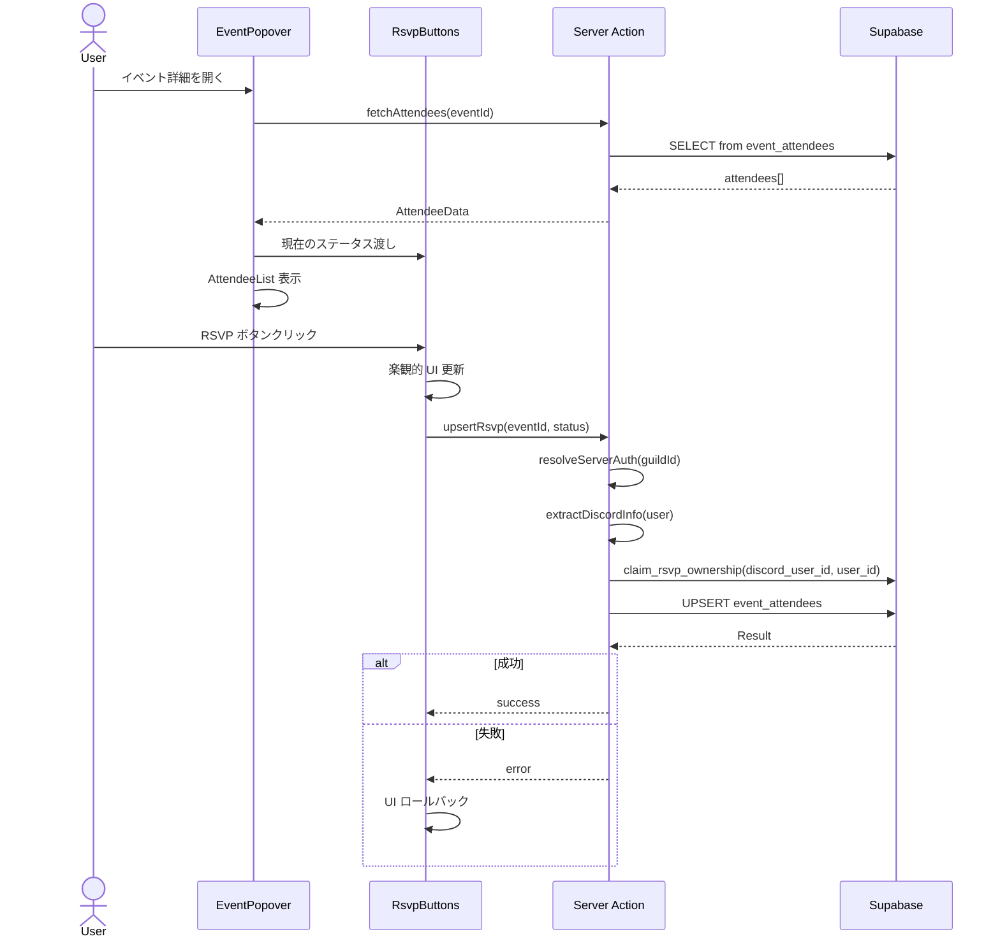
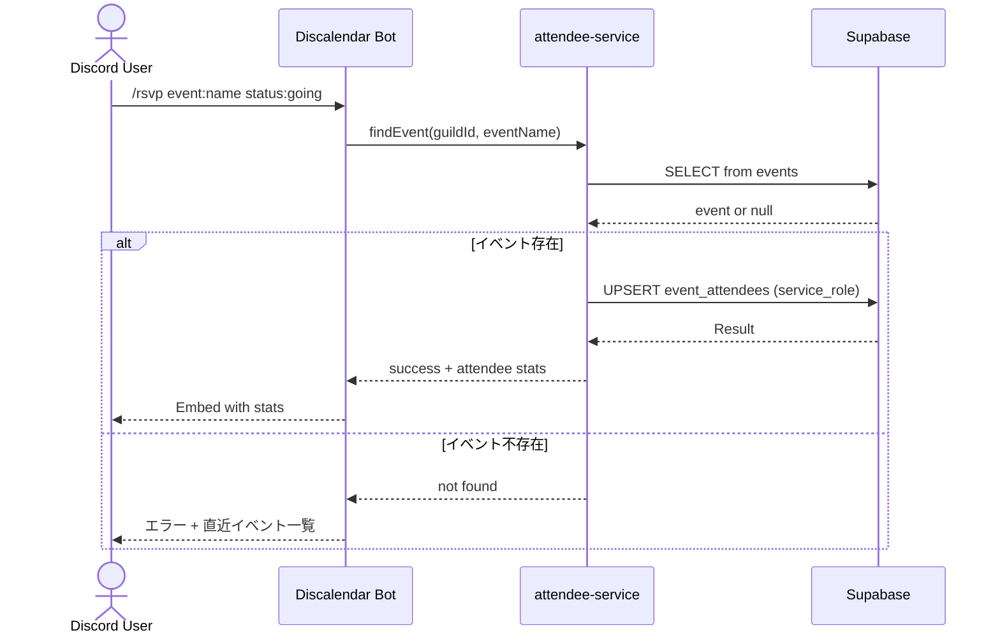
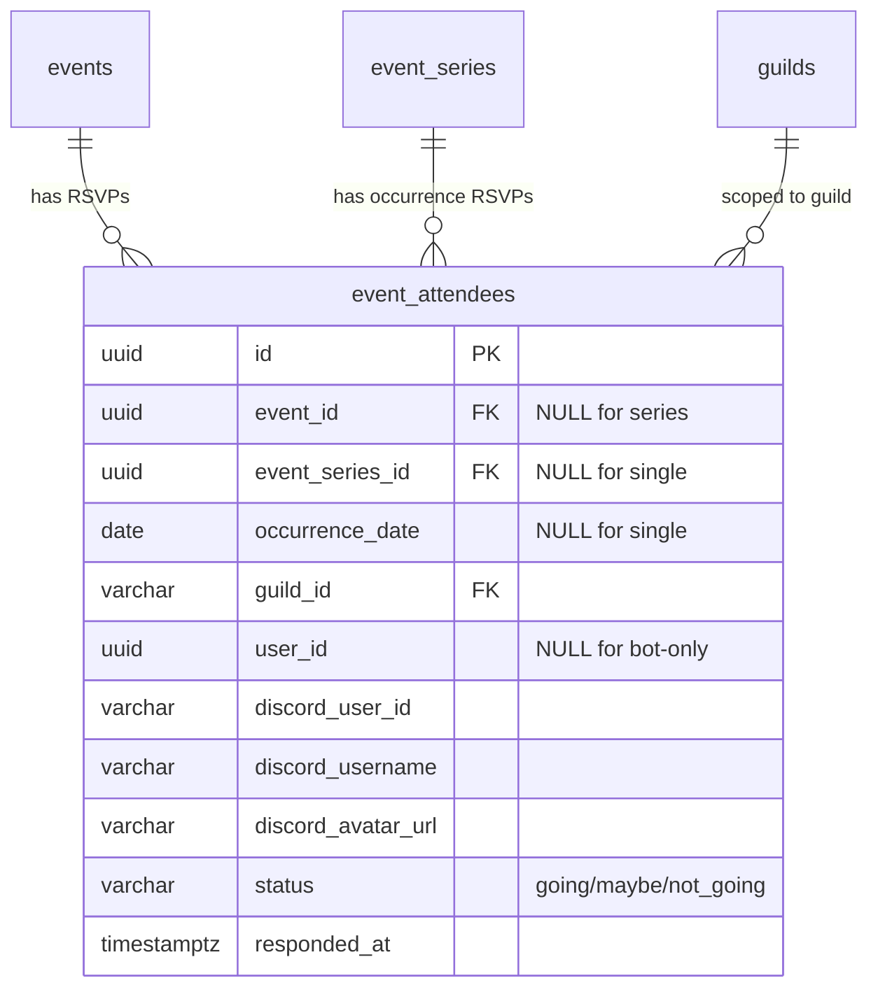

# Technical Design: event-rsvp

## Overview

**Purpose**: イベントに対するRSVP（出欠管理）機能を提供し、ギルドメンバーが参加意思を表明・確認できるようにする。

**Users**: ギルドメンバー（Web）、Discord ユーザー（Bot）がイベントへの出欠を回答し、主催者が参加状況を把握する。

**Impact**: 既存の `events` / `event_series` システムに `event_attendees` テーブルを追加し、EventPopover に RSVP UI を統合。Bot に `/rsvp` コマンドを新設。

### Goals
- Web とBot の両方から一貫した出欠管理を実現
- 繰り返しイベントの各オカレンス単位で RSVP を管理
- 既存の Server Action + RLS パターンに従った安全なデータアクセス

### Non-Goals
- リアルタイム同期（Supabase Realtime）— 将来拡張として検討
- RSVP 人数制限（定員管理）— 現スコープ外
- RSVP リマインダー通知 — 現スコープ外
- Guild Pro ペイウォール — 現スコープ外

## Architecture

### Existing Architecture Analysis

既存システムは以下のパターンを採用:
- **Server Actions**: `resolveServerAuth()` で認証 + 権限チェック後、Supabase クエリを実行。Result 型で成功/失敗を返却
- **RLS**: `events` テーブルは認証済みユーザーが SELECT 可、書き込みは SECURITY DEFINER 関数またはギルドメンバーシップで制御
- **Bot**: `service_role` で RLS バイパス、Discord interaction から直接 Supabase に書き込み
- **UI**: EventPopover（Dialog ベース）でイベント詳細を表示。Client Component で状態管理

RSVP はこれらの既存パターンを拡張する形で実装する。

### Architecture Pattern & Boundary Map

```mermaid
graph TB
    subgraph Web
        EP[EventPopover]
        RB[RsvpButtons]
        AL[AttendeeList]
        SA[Server Actions]
    end

    subgraph Bot
        RC[/rsvp Command]
        AS[attendee-service]
    end

    subgraph Supabase
        EA[event_attendees]
        RLS[RLS Policies]
    end

    EP --> RB
    EP --> AL
    RB --> SA
    SA --> RLS
    RLS --> EA
    RC --> AS
    AS -->|service_role| EA
    AL --> SA
```

**Architecture Integration**:
- **Selected pattern**: 既存 Server Action + RLS パターンの拡張
- **Domain boundary**: RSVP サービス層は `lib/calendar/` 内に配置（イベントドメインの一部）
- **Existing patterns preserved**: Result 型、`resolveServerAuth()`、`classifySupabaseError()`
- **New components**: `RsvpButtons`（Client Component）、`AttendeeList`（表示コンポーネント）、`attendee-service`（Bot サービス）
- **Steering compliance**: shadcn/ui、Biome、Co-location パターンに準拠

### Technology Stack

| Layer | Choice / Version | Role in Feature | Notes |
|-------|------------------|-----------------|-------|
| Frontend | React 19 + shadcn/ui | RSVP ボタン、参加者一覧 | `useOptimistic` で楽観的更新 |
| Backend | Next.js Server Actions | RSVP upsert / delete / fetch | 既存パターン踏襲 |
| Data | Supabase PostgreSQL + RLS | `event_attendees` テーブル | user_id + discord_user_id の二重識別 |
| Bot | discord.js v14 | `/rsvp` スラッシュコマンド | service_role で RLS バイパス |

## System Flows

### Web RSVP フロー



**Key Decisions**: 同じステータスの再クリックはレコード削除（トグル動作）。楽観的更新で即座にUI反映し、失敗時にロールバック。

### Bot RSVP フロー



## Requirements Traceability

| Requirement | Summary | Components | Interfaces | Flows |
|-------------|---------|------------|------------|-------|
| 1.1 | ステータス3種管理 | event_attendees テーブル | — | — |
| 1.2 | ユニーク制約 | event_attendees テーブル | — | — |
| 1.3 | Upsert パターン | RsvpService, Server Actions | upsertRsvp | Web RSVP フロー |
| 1.4 | CASCADE 削除 | event_attendees FK | — | — |
| 1.5 | SELECT RLS | RLS Policies | — | — |
| 1.6 | WRITE RLS | RLS Policies | — | — |
| 2.1 | RSVP ボタン表示 | RsvpButtons | RsvpButtonsProps | Web RSVP フロー |
| 2.2 | ステータス upsert | RsvpButtons, Server Actions | upsertRsvpAction | Web RSVP フロー |
| 2.3 | 選択状態表示 | RsvpButtons | RsvpButtonsProps | — |
| 2.4 | トグル削除 | RsvpButtons, Server Actions | deleteRsvpAction | Web RSVP フロー |
| 2.5 | ローディング状態 | RsvpButtons | — | — |
| 2.6 | エラーロールバック | RsvpButtons | — | Web RSVP フロー |
| 3.1 | 参加者数サマリー | AttendeeList | AttendeeSummary | — |
| 3.2 | 参加者一覧表示 | AttendeeList | AttendeeListProps | — |
| 3.3 | 空状態メッセージ | AttendeeList | — | — |
| 4.1 | ボタン無効化 | RsvpButtons | RsvpButtonsProps | — |
| 4.2 | ログイン誘導 | RsvpButtons | — | — |
| 5.1 | /rsvp コマンド | RsvpCommand | Command | Bot RSVP フロー |
| 5.2 | service_role upsert | attendee-service | AttendeeService | Bot RSVP フロー |
| 5.3 | Embed 返信 | RsvpCommand | — | Bot RSVP フロー |
| 5.4 | イベント不存在エラー | RsvpCommand, attendee-service | — | Bot RSVP フロー |
| 5.5 | Bot トグル削除 | attendee-service | AttendeeService | Bot RSVP フロー |
| 6.1 | オカレンス単位管理 | event_attendees テーブル | — | — |
| 6.2 | series_id + occurrence_date | event_attendees テーブル | — | — |
| 6.3 | 各回独立の参加者一覧 | AttendeeList, RsvpService | fetchAttendees | — |

## Components and Interfaces

| Component | Domain/Layer | Intent | Req Coverage | Key Dependencies | Contracts |
|-----------|--------------|--------|--------------|------------------|-----------|
| event_attendees | Data | RSVP データ永続化 | 1.1-1.6, 6.1-6.2 | events, event_series (P0) | — |
| RsvpService | Service | RSVP CRUD ロジック | 1.3, 2.2, 2.4, 6.3 | Supabase (P0) | Service |
| RsvpButtons | UI | RSVP ボタン群 | 2.1-2.6, 4.1-4.2 | RsvpService (P0) | State |
| AttendeeList | UI | 参加者一覧表示 | 3.1-3.3 | RsvpService (P0) | — |
| Server Actions (RSVP) | Backend | Web RSVP エンドポイント | 2.2, 2.4, 3.1-3.2 | RsvpService (P0), resolveServerAuth (P0) | Service |
| RsvpCommand | Bot | /rsvp スラッシュコマンド | 5.1, 5.3-5.4 | attendee-service (P0) | — |
| attendee-service | Bot Service | Bot RSVP ロジック | 5.2, 5.5 | Supabase service_role (P0) | Service |

### Data Layer

#### event_attendees テーブル

| Field | Detail |
|-------|--------|
| Intent | RSVP データの永続化と整合性保証 |
| Requirements | 1.1, 1.2, 1.3, 1.4, 1.5, 1.6, 6.1, 6.2 |

**Responsibilities & Constraints**
- 単発イベント: `event_id` で紐付け
- 繰り返しイベント: `event_series_id` + `occurrence_date` で紐付け
- CHECK 制約で排他的参照を保証（単発 OR 繰り返しのいずれか）
- 同一ユーザー × 同一イベント/オカレンスのユニーク制約

**Implementation Notes**
- `guild_id` カラムを持たせ、RLS の SELECT ポリシーでギルドメンバーシップフィルタに使用
- Bot 経由の RSVP では `user_id` が NULL になりうる（Supabase アカウント未作成の Discord ユーザー）
- **Ownership 取得**: Web から RSVP 操作時、`discord_user_id` が一致する `user_id = NULL` のレコードが存在する場合、SECURITY DEFINER 関数 `claim_rsvp_ownership()` で `user_id` を現在のユーザーに設定する。これにより Bot 経由で作成されたレコードを Web ユーザーが後から操作可能になる

### Service Layer

#### RsvpService (Web)

| Field | Detail |
|-------|--------|
| Intent | Web 側の RSVP CRUD 操作を提供 |
| Requirements | 1.3, 2.2, 2.4, 6.3 |

**Dependencies**
- Outbound: Supabase client — データアクセス (P0)
- Inbound: Server Actions — RSVP 操作の呼び出し元 (P0)

**Contracts**: Service [x]

##### Service Interface
```typescript
type RsvpStatus = "going" | "maybe" | "not_going";

interface AttendeeRecord {
  id: string;
  event_id: string | null;
  event_series_id: string | null;
  occurrence_date: string | null;
  guild_id: string;
  user_id: string | null;
  discord_user_id: string;
  discord_username: string;
  discord_avatar_url: string | null;
  status: RsvpStatus;
  responded_at: string;
}

interface AttendeeSummary {
  going: number;
  maybe: number;
  notGoing: number;
  total: number;
}

interface AttendeeData {
  attendees: AttendeeRecord[];
  summary: AttendeeSummary;
  currentUserStatus: RsvpStatus | null;
}

interface RsvpServiceInterface {
  fetchAttendees(params: {
    guildId: string;
    eventId?: string;
    seriesId?: string;
    occurrenceDate?: string;
    signal?: AbortSignal;
  }): Promise<Result<AttendeeData, CalendarError>>;

  upsertRsvp(params: {
    guildId: string;
    eventId?: string;
    seriesId?: string;
    occurrenceDate?: string;
    status: RsvpStatus;
  }): Promise<Result<AttendeeRecord, CalendarError>>;

  deleteRsvp(params: {
    guildId: string;
    eventId?: string;
    seriesId?: string;
    occurrenceDate?: string;
  }): Promise<Result<void, CalendarError>>;
}
```
- Preconditions: 認証済みユーザー、有効な guildId
- Postconditions: upsert はべき等（同一ユーザー × イベントで1レコード）
- Invariants: eventId と seriesId+occurrenceDate は排他的に指定

#### Server Actions (RSVP)

| Field | Detail |
|-------|--------|
| Intent | Web クライアントからの RSVP 操作エンドポイント |
| Requirements | 2.2, 2.4 |

**Dependencies**
- Inbound: RsvpButtons — UI からの呼び出し (P0)
- Outbound: RsvpService — ビジネスロジック (P0)
- Outbound: resolveServerAuth — 認証チェック (P0)

**Contracts**: Service [x]

##### Service Interface
```typescript
// app/dashboard/actions.ts に追加

async function upsertRsvpAction(
  guildId: string,
  eventId: string | null,
  seriesId: string | null,
  occurrenceDate: string | null,
  status: RsvpStatus
): Promise<MutationResult<AttendeeRecord>>;

async function deleteRsvpAction(
  guildId: string,
  eventId: string | null,
  seriesId: string | null,
  occurrenceDate: string | null
): Promise<MutationResult<void>>;

async function fetchAttendeesAction(
  guildId: string,
  eventId: string | null,
  seriesId: string | null,
  occurrenceDate: string | null
): Promise<Result<AttendeeData, CalendarError>>;
```
- `resolveServerAuth(guildId)` で認証 + ギルドメンバーシップを検証
- Discord ユーザー情報は `supabase.auth.getUser()` → `user.user_metadata` から取得:
  - `provider_id` → `discord_user_id`
  - `full_name` → `discord_username`
  - `avatar_url` → `discord_avatar_url`
- upsert 前に `claim_rsvp_ownership()` を呼び出し、Bot 経由の `user_id = NULL` レコードの ownership を取得
- `sanitizeResult()` でエラー詳細を除去してクライアントに返却

#### attendee-service (Bot)

| Field | Detail |
|-------|--------|
| Intent | Bot からの RSVP 操作を service_role で実行 |
| Requirements | 5.2, 5.5 |

**Dependencies**
- Inbound: RsvpCommand — Bot コマンドからの呼び出し (P0)
- Outbound: Supabase (service_role) — データアクセス (P0)

**Contracts**: Service [x]

##### Service Interface
```typescript
// packages/bot/src/services/attendee-service.ts

interface AttendeeService {
  upsertRsvp(params: {
    guildId: string;
    eventId: string;
    discordUserId: string;
    discordUsername: string;
    discordAvatarUrl: string | null;
    status: RsvpStatus;
  }): Promise<ServiceResult<AttendeeRecord>>;

  deleteRsvp(params: {
    guildId: string;
    eventId: string;
    discordUserId: string;
  }): Promise<ServiceResult<void>>;

  getAttendeeSummary(
    eventId: string
  ): Promise<ServiceResult<AttendeeSummary>>;

  findEventByName(
    guildId: string,
    eventName: string
  ): Promise<ServiceResult<EventRecord | null>>;
}
```
- Bot は `service_role` で RLS バイパス
- `discord_user_id` + `discord_username` + `discord_avatar_url` を直接書き込み

### UI Layer

#### RsvpButtons

| Field | Detail |
|-------|--------|
| Intent | RSVP ステータス選択ボタン群と楽観的更新 |
| Requirements | 2.1, 2.2, 2.3, 2.4, 2.5, 2.6, 4.1, 4.2 |

**Dependencies**
- Outbound: Server Actions (upsertRsvpAction, deleteRsvpAction) — データ更新 (P0)

**Contracts**: State [x]

##### State Management
```typescript
interface RsvpButtonsProps {
  guildId: string;
  eventId: string | null;
  seriesId: string | null;
  occurrenceDate: string | null;
  currentStatus: RsvpStatus | null;
  isAuthenticated: boolean;
  onStatusChange?: (newStatus: RsvpStatus | null) => void;
}
```
- **State model**: `useOptimistic` で楽観的ステータス管理、`useTransition` でローディング状態
- **Persistence**: Server Action 経由で Supabase に永続化
- **Concurrency**: `isPending` 中はボタン操作を無効化

**Implementation Notes**
- 3つのボタン: 参加（going）、未定（maybe）、不参加（not_going）
- アクティブなステータスは `variant="default"` 、非アクティブは `variant="outline"`
- 未認証時: 全ボタン `disabled`、Tooltip で「ログインして出欠を回答」を表示
- アイコン: lucide-react の `Check`（going）、`HelpCircle`（maybe）、`X`（not_going）

#### AttendeeList

| Field | Detail |
|-------|--------|
| Intent | ステータス別参加者一覧とサマリーの表示 |
| Requirements | 3.1, 3.2, 3.3 |

**Dependencies**
- Inbound: EventPopover — 表示コンテキスト (P0)

**Implementation Notes**
- サマリー: `参加 3 · 未定 1 · 不参加 0` のインライン表示
- 参加者: Discord アバター（`Avatar` コンポーネント）+ ユーザー名のリスト
- ステータス別にアコーディオンまたはタブでグループ化
- 空状態: 「まだ回答がありません」のテキスト表示

### Bot Layer

#### RsvpCommand

| Field | Detail |
|-------|--------|
| Intent | Discord `/rsvp` スラッシュコマンド |
| Requirements | 5.1, 5.3, 5.4 |

**Dependencies**
- Outbound: attendee-service — RSVP ビジネスロジック (P0)

**Implementation Notes**
- コマンド定義: `/rsvp event:<string> status:<going|maybe|not_going>`
- `event` オプション: String 型、Autocomplete 対応（ギルド内イベント名で検索）
- `status` オプション: String 型、choices で 3 値に限定
- 同じステータスでの再実行はトグル削除（5.5）
- 成功時 Embed: イベント名、更新後ステータス、参加者数サマリー（going/maybe/not_going）
- エラー時: Ephemeral メッセージ + 直近イベント一覧の案内

## Data Models

### Domain Model



**Business Rules & Invariants**:
- `status` は `going` / `maybe` / `not_going` のいずれか（CHECK 制約）
- `event_id` と `(event_series_id, occurrence_date)` は排他的: いずれか一方のみ非 NULL
- 同一ユーザー × 同一イベント/オカレンスで 1 レコード（UNIQUE 制約）

### Physical Data Model

```sql
CREATE TABLE event_attendees (
    id UUID PRIMARY KEY DEFAULT gen_random_uuid(),
    event_id UUID REFERENCES events(id) ON DELETE CASCADE,
    event_series_id UUID REFERENCES event_series(id) ON DELETE CASCADE,
    occurrence_date DATE,
    guild_id VARCHAR(32) NOT NULL REFERENCES guilds(guild_id) ON DELETE CASCADE,
    user_id UUID REFERENCES auth.users(id) ON DELETE CASCADE,
    discord_user_id VARCHAR(32) NOT NULL,
    discord_username VARCHAR(100) NOT NULL,
    discord_avatar_url VARCHAR(512),
    status VARCHAR(10) NOT NULL CHECK (status IN ('going', 'maybe', 'not_going')),
    responded_at TIMESTAMPTZ NOT NULL DEFAULT NOW(),

    -- 排他的参照: 単発 OR 繰り返し
    CONSTRAINT chk_event_reference CHECK (
        (event_id IS NOT NULL AND event_series_id IS NULL AND occurrence_date IS NULL)
        OR
        (event_id IS NULL AND event_series_id IS NOT NULL AND occurrence_date IS NOT NULL)
    ),

    -- ユニーク制約: 単発イベント
    CONSTRAINT uq_single_event_attendee UNIQUE (event_id, discord_user_id),
    -- ユニーク制約: 繰り返しイベント
    CONSTRAINT uq_series_occurrence_attendee UNIQUE (event_series_id, occurrence_date, discord_user_id)
);

-- インデックス
CREATE INDEX idx_attendees_event_id ON event_attendees(event_id) WHERE event_id IS NOT NULL;
CREATE INDEX idx_attendees_series_occurrence ON event_attendees(event_series_id, occurrence_date) WHERE event_series_id IS NOT NULL;
CREATE INDEX idx_attendees_guild ON event_attendees(guild_id);
CREATE INDEX idx_attendees_discord_user ON event_attendees(discord_user_id);
```

**RLS Policies**:
```sql
ALTER TABLE event_attendees ENABLE ROW LEVEL SECURITY;

-- SELECT: 認証済みユーザーは同一ギルドの出欠データを参照可
CREATE POLICY "guild_members_can_read_attendees"
    ON event_attendees FOR SELECT TO authenticated
    USING (guild_id IN (SELECT user_guild_ids()));

-- INSERT: 自分の user_id に一致するレコードのみ作成可
CREATE POLICY "users_can_insert_own_rsvp"
    ON event_attendees FOR INSERT TO authenticated
    WITH CHECK (user_id = auth.uid());

-- UPDATE: 自分の user_id に一致するレコードのみ更新可
CREATE POLICY "users_can_update_own_rsvp"
    ON event_attendees FOR UPDATE TO authenticated
    USING (user_id = auth.uid());

-- DELETE: 自分の user_id に一致するレコードのみ削除可
CREATE POLICY "users_can_delete_own_rsvp"
    ON event_attendees FOR DELETE TO authenticated
    USING (user_id = auth.uid());
```

### Data Contracts

**Discord ユーザー情報取得 (Server Action 内)**:
```typescript
// supabase.auth.getUser() の user_metadata から Discord 情報を抽出
interface DiscordUserInfo {
  discordUserId: string;    // user_metadata.provider_id
  discordUsername: string;   // user_metadata.full_name
  discordAvatarUrl: string | null; // user_metadata.avatar_url
}

function extractDiscordInfo(user: User): DiscordUserInfo;
```

**Ownership 取得関数 (SECURITY DEFINER)**:
```sql
-- Bot 経由で作成された user_id = NULL のレコードに対し、
-- discord_user_id が一致する Web ユーザーの user_id を設定する
CREATE FUNCTION claim_rsvp_ownership(
  p_discord_user_id VARCHAR(32),
  p_user_id UUID
) RETURNS void
LANGUAGE sql SECURITY DEFINER AS $$
  UPDATE event_attendees
  SET user_id = p_user_id
  WHERE discord_user_id = p_discord_user_id
    AND user_id IS NULL;
$$;
```

**Web → Supabase (Server Action)**:
```typescript
// Upsert Request
interface UpsertRsvpInput {
  event_id: string | null;
  event_series_id: string | null;
  occurrence_date: string | null;
  guild_id: string;
  status: RsvpStatus;
  // user_id は auth.uid() から自動設定
  // discord_user_id, discord_username, discord_avatar_url は extractDiscordInfo() で取得
}
```

**Bot → Supabase (service_role)**:
```typescript
// Bot Upsert Request
interface BotUpsertRsvpInput {
  event_id: string;
  guild_id: string;
  discord_user_id: string;
  discord_username: string;
  discord_avatar_url: string | null;
  status: RsvpStatus;
  // user_id は NULL（Bot ユーザーは Supabase アカウントを持たない場合がある）
}
```

## Error Handling

### Error Categories and Responses

**User Errors (4xx)**:
- 未認証での RSVP 操作 → ボタン無効化 + ログイン誘導（4.1, 4.2）
- 存在しないイベントへの RSVP → エラーメッセージ + イベント一覧案内（5.4）

**System Errors (5xx)**:
- Supabase 接続エラー → 楽観的更新のロールバック + エラー表示（2.6）
- RLS ポリシー違反 → `classifySupabaseError()` で `PERMISSION_DENIED` に変換

**Business Logic Errors (422)**:
- 無効なステータス値 → バリデーションエラー（TypeScript の型で防止）

### Monitoring
- Server Action のエラーは既存の `classifySupabaseError()` パターンで分類
- Bot のエラーは pino ログに記録

## Testing Strategy

### Unit Tests
- `RsvpService.upsertRsvp`: ステータス更新、トグル削除、繰り返しイベント
- `RsvpService.fetchAttendees`: サマリー集計、空データ、現在ユーザーステータス
- `attendee-service.upsertRsvp`: Bot 経由の upsert、トグル削除

### Integration Tests
- Server Action + RLS: 認証ユーザーの RSVP CRUD
- RLS ポリシー: 他ユーザーのレコード操作不可の検証
- CASCADE 削除: イベント削除時の出欠レコード連動削除

### UI Tests
- `RsvpButtons`: ボタンクリック → ステータス変更、トグル動作、ローディング状態、disabled 状態
- `AttendeeList`: ステータス別グループ表示、空状態、アバター表示

### E2E Tests
- Web: ログイン → イベント開く → RSVP → 参加者一覧確認
- 未認証: RSVP ボタン無効 → ログイン誘導確認

## Security Considerations

- **RLS**: `user_id = auth.uid()` で自分のレコードのみ操作可（1.6）
- **SELECT 制限**: `user_guild_ids()` で同一ギルドメンバーのみ閲覧可（1.5）
- **Bot service_role**: RLS バイパスは Bot プロセスのみ。Web からは通常の RLS が適用
- **Ownership 取得**: `claim_rsvp_ownership()` は SECURITY DEFINER で、`discord_user_id` が一致し `user_id IS NULL` のレコードのみ更新。他ユーザーのレコードは影響しない
- **入力バリデーション**: `status` は TypeScript 型 + DB CHECK 制約の二重チェック
- **sanitizeResult**: Server Action のエラーレスポンスから内部詳細を除去
