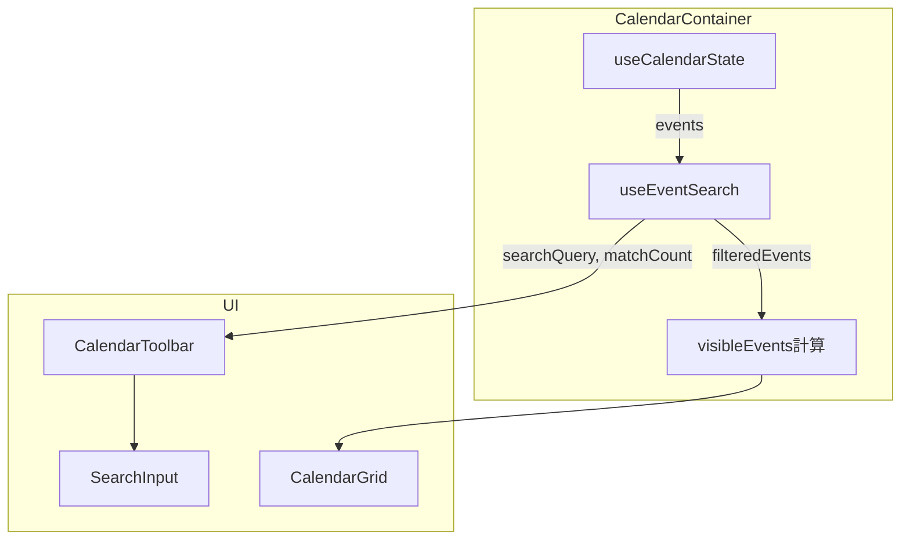
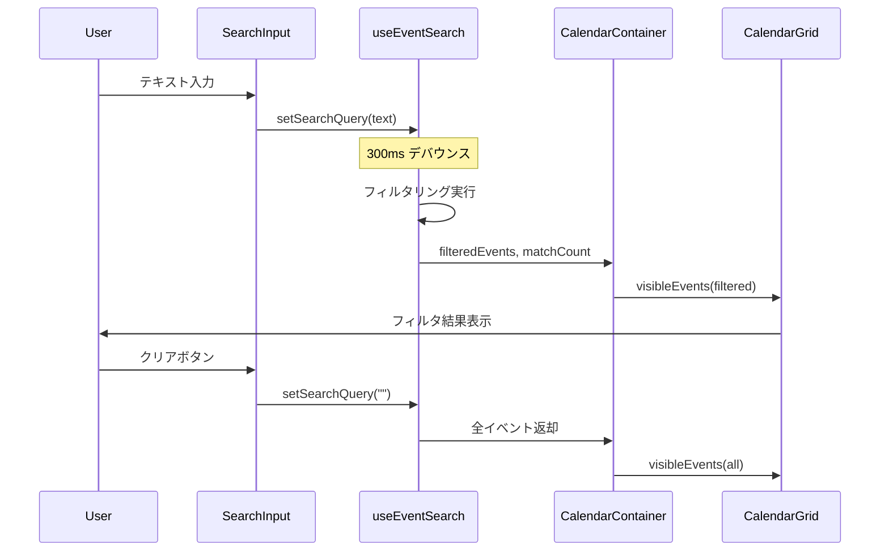

# Design Document: event-search-filter

## Overview

**Purpose**: カレンダー画面にイベント検索・フィルタ機能を追加し、イベント数が増加した際のナビゲーション効率を改善する。

**Users**: Discalendarを利用するDiscordコミュニティのメンバーが、多数のイベントから目的のイベントを素早く見つけるために使用する。

**Impact**: CalendarToolbarに検索UIを追加し、CalendarContainerのイベント表示ロジックにクライアントサイドフィルタリングを統合する。

### Goals
- キーワードによるイベントタイトルの部分一致検索
- デバウンス付きリアルタイムフィルタリング
- モバイル・デスクトップ両対応のレスポンシブUI
- アクセシビリティ標準への準拠

### Non-Goals
- サーバーサイド検索（Supabase full-text search）
- イベント説明文・場所での検索（将来拡張）
- 日付範囲によるフィルタリング（将来拡張）
- 検索履歴の保存

## Architecture

### Existing Architecture Analysis

CalendarContainerが状態管理のオーケストレーターとして機能し、以下のフローでイベントを表示する:

1. `useCalendarState`でイベント配列(`state.events`)を管理
2. `fetchEvents()`でSupabaseから表示期間のイベントを取得
3. `visibleEvents`を計算（祝日イベントの統合含む）
4. CalendarGridに`events` propとして渡す

検索フィルタは、3の`visibleEvents`計算の前段階に挿入する。

### Architecture Pattern & Boundary Map



**Architecture Integration**:
- Selected pattern: カスタムフックによるロジック分離（既存パターンの踏襲）
- Domain boundary: 検索ロジックを`useEventSearch`フックに閉じ込め、UIとの結合を最小化
- Existing patterns preserved: propsドリブンのコンポーネント設計、`hooks/calendar/`配下のフック配置
- Steering compliance: Co-locationパターン（テスト・ストーリーの同ディレクトリ配置）

### Technology Stack

| Layer | Choice / Version | Role in Feature | Notes |
|-------|------------------|-----------------|-------|
| Frontend | React 19 + Next.js 16 | コンポーネント・フック | 既存スタック |
| UI | shadcn/ui (Radix UI) + Tailwind CSS 3 | 検索入力フィールド | Input コンポーネント活用 |
| Icons | lucide-react | 検索アイコン・クリアアイコン | 既存スタック |
| Testing | Vitest + Testing Library | フック・コンポーネントテスト | 既存スタック |

## System Flows



## Requirements Traceability

| Requirement | Summary | Components | Interfaces | Flows |
|-------------|---------|------------|------------|-------|
| 1.1 | 検索入力フィールド表示 | CalendarToolbar, SearchInput | SearchInputProps | - |
| 1.2 | 部分一致フィルタリング | useEventSearch | UseEventSearchReturn | 検索フロー |
| 1.3 | 300msデバウンス | useEventSearch | UseEventSearchReturn | 検索フロー |
| 1.4 | 空状態メッセージ | CalendarGrid | CalendarGridProps | - |
| 1.5 | 検索クリア | SearchInput, useEventSearch | SearchInputProps | 検索フロー |
| 2.1 | デスクトップ: インライン表示 | CalendarToolbar, SearchInput | SearchInputProps | - |
| 2.2 | モバイル: アイコンボタン展開 | CalendarToolbar, SearchInput | SearchInputProps | - |
| 2.3 | モバイル: 全幅拡張 | SearchInput | SearchInputProps | - |
| 3.1 | 一致件数表示 | CalendarToolbar | CalendarToolbarProps | - |
| 3.2 | 非一致イベント非表示 | CalendarContainer, useEventSearch | UseEventSearchReturn | 検索フロー |
| 3.3 | 検索クリア時の即時再表示 | useEventSearch, CalendarGrid | UseEventSearchReturn | 検索フロー |
| 4.1 | aria-label属性 | SearchInput | SearchInputProps | - |
| 4.2 | aria-live結果通知 | CalendarToolbar | CalendarToolbarProps | - |
| 4.3 | キーボード操作 | SearchInput | SearchInputProps | - |

## Components and Interfaces

| Component | Domain/Layer | Intent | Req Coverage | Key Dependencies | Contracts |
|-----------|--------------|--------|--------------|------------------|-----------|
| useEventSearch | Hooks/Calendar | イベント検索状態管理・フィルタロジック | 1.2, 1.3, 1.5, 3.2, 3.3 | CalendarEvent (P0) | State |
| SearchInput | UI/Calendar | 検索入力フィールドUI | 1.1, 1.5, 2.1, 2.2, 2.3, 4.1, 4.3 | shadcn/ui Input (P1) | - |
| CalendarToolbar | UI/Calendar (既存拡張) | 検索UI統合・件数表示 | 1.1, 2.1, 2.2, 3.1, 4.2 | SearchInput (P0) | - |
| CalendarContainer | UI/Calendar (既存拡張) | 検索フック統合 | 1.2, 3.2, 3.3 | useEventSearch (P0) | - |
| CalendarGrid | UI/Calendar (既存拡張) | 空状態メッセージ | 1.4 | - | - |

### Hooks / Calendar

#### useEventSearch

| Field | Detail |
|-------|--------|
| Intent | イベント配列に対するクライアントサイドキーワード検索を提供する |
| Requirements | 1.2, 1.3, 1.5, 3.2, 3.3 |

**Responsibilities & Constraints**
- イベントタイトルに対する大文字小文字不区別の部分一致フィルタリング
- 300msのデバウンスによる入力パフォーマンス最適化
- 祝日イベント（`isHolidayEvent`）は検索対象外とする
- 検索クエリが空の場合は元のイベント配列をそのまま返却

**Dependencies**
- Inbound: CalendarEvent[] — フィルタ対象のイベント配列 (P0)
- External: `@/lib/calendar/holiday-service` — isHolidayEvent判定 (P1)

**Contracts**: State [x]

##### State Management

```typescript
type UseEventSearchOptions = {
  /** フィルタ対象のイベント配列 */
  events: CalendarEvent[];
  /** デバウンス遅延（ms）。デフォルト: 300 */
  debounceMs?: number;
};

type UseEventSearchReturn = {
  /** 現在の検索クエリ（即時値、入力フィールド用） */
  searchQuery: string;
  /** 検索クエリを更新する */
  setSearchQuery: (query: string) => void;
  /** フィルタ済みイベント配列 */
  filteredEvents: CalendarEvent[];
  /** 一致件数（検索未適用時はnull） */
  matchCount: number | null;
  /** 検索が適用されているか */
  isSearchActive: boolean;
};
```

- Persistence: React `useState`（セッション内のみ、永続化不要）
- Consistency: `searchQuery`は即時更新、`filteredEvents`はデバウンス後に更新

**Implementation Notes**
- Integration: CalendarContainerの`visibleEvents`計算の前段階で`filteredEvents`を使用
- Validation: 空文字列・空白のみの入力は検索未適用として扱う
- Risks: CalendarContainerの再レンダリング頻度増加 → `useMemo`でフィルタ結果をメモ化

### UI / Calendar

#### SearchInput

| Field | Detail |
|-------|--------|
| Intent | 検索入力フィールドとクリアボタンを提供する |
| Requirements | 1.1, 1.5, 2.1, 2.2, 2.3, 4.1, 4.3 |

**Responsibilities & Constraints**
- テキスト入力とクリアボタンのUI提供
- モバイル時はアイコンボタンタップで展開/折りたたみ
- デスクトップ時はインライン表示
- `aria-label="イベントを検索"` の設定
- Escキーで検索クリア、入力フィールドのフォーカス管理

**Dependencies**
- External: shadcn/ui `Input` — 入力フィールド基盤 (P1)
- External: lucide-react `Search`, `X` — アイコン (P2)

```typescript
type SearchInputProps = {
  /** 現在の検索クエリ */
  value: string;
  /** 検索クエリ変更ハンドラー */
  onChange: (query: string) => void;
  /** モバイル表示かどうか */
  isMobile: boolean;
  /** 一致件数（検索適用中のみ表示、nullで非表示） */
  matchCount: number | null;
};
```

**Implementation Notes**
- Integration: CalendarToolbar内に配置。`isMobile`に応じてレイアウトを切り替え
- Validation: 入力値のサニタイズ不要（クライアントサイド表示のみ）

#### CalendarToolbar（既存拡張）

既存の`CalendarToolbarProps`に以下を追加:

```typescript
// 追加props
type CalendarToolbarSearchProps = {
  /** 検索クエリ */
  searchQuery?: string;
  /** 検索クエリ変更ハンドラー */
  onSearchChange?: (query: string) => void;
  /** 検索一致件数（nullで非表示） */
  searchMatchCount?: number | null;
};
```

- 検索UIの配置: 期間表示ラベルとビューモード切り替えの間
- `aria-live="polite"` リージョンで検索結果件数を通知 (4.2)
- すべてのpropsはオプショナルで後方互換性を維持

#### CalendarContainer（既存拡張）

`useEventSearch`フックを統合し、`visibleEvents`計算に検索フィルタを適用する。

主要変更点:
- `useEventSearch`フックの呼び出し追加
- `visibleEvents`計算で`filteredEvents`を使用
- CalendarToolbarに検索関連propsを渡す

#### CalendarGrid（既存拡張）

検索が適用されている状態で一致イベントが0件の場合、空状態メッセージを表示する。

```typescript
// 追加props
type CalendarGridSearchProps = {
  /** 検索が適用されているか（空状態メッセージ表示判定用） */
  isSearchActive?: boolean;
};
```

## Error Handling

### Error Strategy
検索機能はクライアントサイドのフィルタリングであり、ネットワークエラーやサーバーエラーは発生しない。エラーハンドリングは最小限に留める。

### Error Categories and Responses
**User Errors**: 一致イベントが0件 → 空状態メッセージ「一致するイベントが見つかりません」を表示し、検索をクリアするボタンを提示

## Testing Strategy

### Unit Tests
- `useEventSearch`: 部分一致フィルタリングの正確性（大文字小文字不区別）
- `useEventSearch`: 300msデバウンスの動作検証
- `useEventSearch`: 空クエリで全イベント返却
- `useEventSearch`: 祝日イベントのフィルタ対象外検証

### Component Tests
- `SearchInput`: テキスト入力とonChangeコールバック
- `SearchInput`: クリアボタンの動作
- `SearchInput`: モバイル展開/折りたたみ
- `SearchInput`: キーボード操作（Escでクリア）
- `SearchInput`: aria-label属性の存在
- `CalendarToolbar`: 検索UIの統合表示
- `CalendarToolbar`: 検索件数のaria-live通知

### Integration Tests
- `CalendarContainer`: 検索入力→CalendarGridのイベントフィルタリング連動
- `CalendarContainer`: 検索クリア→全イベント再表示
