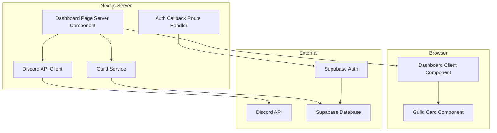
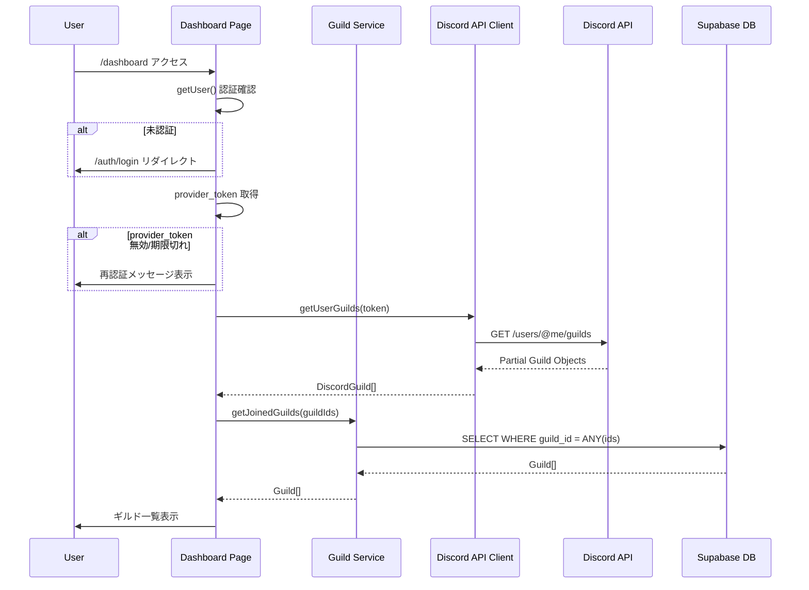
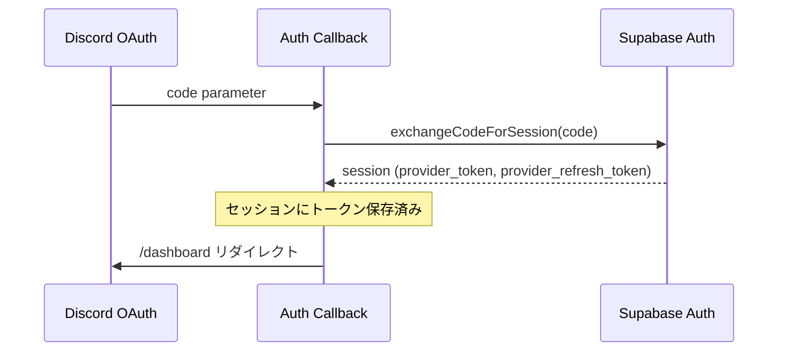
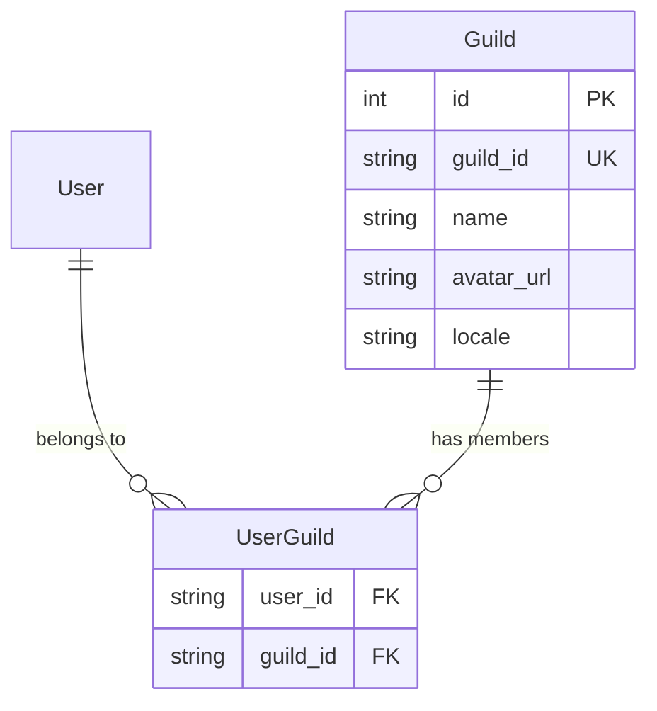

# Design Document

## Overview

**Purpose**: 本機能は、ダッシュボードページにログイン済みユーザーが所属するDiscordサーバー（ギルド）の一覧を表示する機能を提供する。Discord APIから取得したユーザーの所属ギルド情報とSupabaseデータベースに登録済みのギルドを照合し、Discalendarが利用可能なサーバーのみを表示する。

**Users**: ログイン済みDiscordユーザーがダッシュボードでDiscalendar登録済みサーバーを確認し、カレンダー管理対象を把握するために使用する。

**Impact**: 既存のダッシュボードページを拡張し、認証フローにおけるprovider_token取得ロジックを追加。新規guildsテーブルをSupabaseに作成し、Discord API連携モジュールを新設する。

### Goals

- ログイン済みユーザーがダッシュボードで所属ギルド一覧を確認できる
- Discord APIとSupabase DBを照合し、Discalendar登録済みギルドのみを表示する
- Server Componentでセキュアかつパフォーマンス最適なデータ取得を実現する
- 型安全なギルド関連データ構造を一元管理する

### Non-Goals

- ギルドカードのクリックによる詳細画面への遷移（将来実装）
- ギルドの新規登録・編集・削除機能
- Bot未導入ギルドへのBot招待フロー
- リアルタイムのギルド情報同期

## Architecture

### Existing Architecture Analysis

現行システムの主要構成:
- **Dashboard Page**: `app/dashboard/page.tsx` - Server Componentとしてユーザー情報を取得・表示
- **Auth Callback**: `app/auth/callback/route.ts` - OAuth認証コードをセッションに交換
- **Supabase Client**: `lib/supabase/server.ts`, `lib/supabase/client.ts` - Server/Client用クライアント
- **Auth Types**: `lib/auth/types.ts` - 認証エラー型定義

既存パターン:
- Server ComponentでSupabaseクライアントを使用したデータ取得
- DashboardUserへの整形後Client Componentへ渡すパターン
- shadcn/ui Cardコンポーネントによるカード型UI

### Architecture Pattern & Boundary Map



**Architecture Integration**:
- **Selected pattern**: Server Component主導のデータフェッチング（既存パターン継承）
- **Domain/feature boundaries**: Discord API連携（lib/discord）とギルドサービス（lib/guilds）を分離
- **Existing patterns preserved**: DashboardUser整形パターン、shadcn/ui Card使用
- **New components rationale**: Discord API ClientはOAuth token管理の責務分離、Guild ServiceはDB操作の抽象化
- **Steering compliance**: TypeScript strict mode、Server Components活用、Supabase SSR統合

### Technology Stack

| Layer | Choice / Version | Role in Feature | Notes |
|-------|------------------|-----------------|-------|
| Frontend | Next.js 15 + React 19 | ギルド一覧UI表示 | Server/Client Component分離 |
| Backend | Next.js Route Handler | OAuth callback処理 | provider_token取得 |
| Data | Supabase (PostgreSQL) | guildsテーブル管理 | RLS有効化 |
| External API | Discord API v10 | ユーザー所属ギルド取得 | OAuth2 guildsスコープ |

## System Flows

### ギルド一覧取得フロー



**Key Decisions**:
- provider_tokenはOAuth callback時に取得し、セッション経由でアクセス
- Discord APIレスポンスのPartial Guild ObjectからDB照合用のguild_idリストを抽出
- DB照合はANYクエリで一括実行（N+1回避）

### OAuth Callback Token取得フロー



## Requirements Traceability

| Requirement | Summary | Components | Interfaces | Flows |
|-------------|---------|------------|------------|-------|
| 1.1 | guildsテーブル作成 | Supabase Migration | - | - |
| 1.2 | guild_idインデックス | Supabase Migration | - | - |
| 1.3 | RLS設定 | Supabase Migration | - | - |
| 2.1 | Discord APIからギルド取得 | DiscordApiClient | getUserGuilds | ギルド一覧取得 |
| 2.2 | ギルドid, name, icon取得 | DiscordApiClient | DiscordGuild型 | ギルド一覧取得 |
| 2.3 | API失敗時エラー表示 | DashboardPage, GuildListClient | GuildListError | ギルド一覧取得 |
| 2.4 | トークン期限切れ時再認証促進 | DashboardPage | - | ギルド一覧取得 |
| 3.1 | ギルドID照合 | GuildService | getJoinedGuilds | ギルド一覧取得 |
| 3.2 | ANYクエリ検索 | GuildService | - | ギルド一覧取得 |
| 3.3 | 照合結果返却 | GuildService | Guild[] | ギルド一覧取得 |
| 4.1 | カード形式表示 | GuildCard | GuildCardProps | - |
| 4.2 | 名前・アイコン表示 | GuildCard | - | - |
| 4.3 | イニシャルフォールバック | GuildCard | - | - |
| 4.4 | 空状態メッセージ | GuildListClient | - | - |
| 4.5 | ローディング表示 | GuildListClient | - | - |
| 5.1 | Server Componentデータ取得 | DashboardPage | - | ギルド一覧取得 |
| 5.2 | Server用Supabaseクライアント | GuildService | - | ギルド一覧取得 |
| 5.3 | Client Componentへデータ渡し | DashboardPage | GuildListClientProps | - |
| 5.4 | 未認証時リダイレクト | DashboardPage | - | ギルド一覧取得 |
| 6.1 | Guild型定義 | types/guild.ts | Guild | - |
| 6.2 | Supabase互換型 | types/guild.ts | - | - |
| 6.3 | Discord APIレスポンス型 | types/discord.ts | DiscordGuild | - |

## Components and Interfaces

| Component | Domain/Layer | Intent | Req Coverage | Key Dependencies | Contracts |
|-----------|--------------|--------|--------------|------------------|-----------|
| GuildService | Service | DB操作抽象化 | 1.1-1.3, 3.1-3.3 | Supabase (P0) | Service |
| DiscordApiClient | Integration | Discord API連携 | 2.1-2.4 | Discord API (P0) | Service, API |
| DashboardPage | UI/Server | データ取得・認証 | 5.1-5.4 | GuildService (P0), DiscordApiClient (P0) | - |
| GuildListClient | UI/Client | ギルド一覧表示 | 4.1, 4.4, 4.5 | GuildCard (P1) | State |
| GuildCard | UI/Client | 単一ギルド表示 | 4.2, 4.3 | shadcn Card (P2) | - |
| Supabase Migration | Data | スキーマ定義 | 1.1-1.3 | - | - |

### Service Layer

#### GuildService

| Field | Detail |
|-------|--------|
| Intent | Supabase DBに対するギルド照合クエリを実行する |
| Requirements | 1.1, 1.2, 1.3, 3.1, 3.2, 3.3 |

**Responsibilities & Constraints**
- guildsテーブルに対する読み取り専用操作
- guild_idリストによる一括照合（ANY演算子使用）
- RLSポリシーに従った認証済みユーザーのみのアクセス

**Dependencies**
- Outbound: Supabase Server Client - DB接続 (P0)

**Contracts**: Service [x]

##### Service Interface

```typescript
interface GuildService {
  /**
   * ユーザーが所属するギルドIDリストでDB照合を行う
   * @param guildIds Discord APIから取得したギルドIDリスト
   * @returns Discalendar登録済みギルドの配列
   */
  getJoinedGuilds(guildIds: string[]): Promise<Guild[]>;
}
```

- Preconditions: guildIdsは空でない文字列配列
- Postconditions: DBに存在するギルドのみ返却
- Invariants: RLSにより認証済みユーザーのみアクセス可能

**Implementation Notes**
- Integration: Supabase Server Clientを使用、createClient()は関数内で都度生成
- Validation: 空配列の場合は即座に空配列を返却
- Risks: 大量のguildIds（200件超）の場合のパフォーマンス

---

#### DiscordApiClient

| Field | Detail |
|-------|--------|
| Intent | Discord REST APIへのHTTPリクエストを抽象化する |
| Requirements | 2.1, 2.2, 2.3, 2.4 |

**Responsibilities & Constraints**
- Discord API v10の`GET /users/@me/guilds`エンドポイントへのリクエスト
- Bearerトークン認証ヘッダーの付与
- エラーレスポンスの型安全なハンドリング

**Dependencies**
- External: Discord API v10 - ギルド一覧取得 (P0)

**Contracts**: Service [x] / API [x]

##### Service Interface

```typescript
type DiscordApiResult<T> =
  | { success: true; data: T }
  | { success: false; error: DiscordApiError };

type DiscordApiError =
  | { code: "unauthorized"; message: string }
  | { code: "rate_limited"; message: string; retryAfter: number }
  | { code: "network_error"; message: string }
  | { code: "unknown"; message: string };

interface DiscordApiClient {
  /**
   * 現在のユーザーが所属するギルド一覧を取得
   * @param accessToken Discord OAuth アクセストークン
   * @returns ギルド一覧またはエラー
   */
  getUserGuilds(accessToken: string): Promise<DiscordApiResult<DiscordGuild[]>>;
}
```

- Preconditions: accessTokenは有効なDiscord OAuthトークン
- Postconditions: 成功時はPartial Guild Objectの配列を返却
- Invariants: 401エラーは"unauthorized"として返却

##### API Contract

| Method | Endpoint | Request | Response | Errors |
|--------|----------|---------|----------|--------|
| GET | /users/@me/guilds | Authorization: Bearer {token} | DiscordGuild[] | 401, 429 |

**Implementation Notes**
- Integration: fetch APIを使用、Discord API Base URL: `https://discord.com/api/v10`
- Validation: レスポンスステータスコードによるエラー分岐
- Risks: Rate Limit (429) への対応はエラー返却のみ（リトライ実装は将来対応）

---

### UI Layer

#### DashboardPage (Server Component)

| Field | Detail |
|-------|--------|
| Intent | 認証確認とデータ取得を行い、Client Componentにデータを渡す |
| Requirements | 5.1, 5.2, 5.3, 5.4, 2.4 |

**Responsibilities & Constraints**
- Supabase Authからユーザー情報とprovider_token取得
- DiscordApiClientを使用したギルド一覧取得
- GuildServiceを使用したDB照合
- 認証・エラー状態に応じたUI分岐

**Dependencies**
- Outbound: GuildService - DB照合 (P0)
- Outbound: DiscordApiClient - Discord API連携 (P0)
- Outbound: Supabase Auth - 認証・トークン取得 (P0)
- Outbound: GuildListClient - UI表示 (P1)

**Contracts**: State [x]

##### State Management

- State model: Server Component内でデータ取得完了後、propsとしてClient Componentに渡す
- Persistence: なし（リクエストごとに再取得）
- Concurrency: なし（SSR単一リクエスト）

**Implementation Notes**
- Integration: 既存DashboardPageを拡張、ギルド取得ロジック追加
- Validation: provider_token存在チェック、Discord API結果のエラーハンドリング
- Risks: provider_token期限切れ時のUX（再認証フロー未実装のため警告表示のみ）

---

#### GuildListClient (Client Component)

| Field | Detail |
|-------|--------|
| Intent | ギルド一覧のUI表示とローディング・エラー状態管理 |
| Requirements | 4.1, 4.4, 4.5 |

**Responsibilities & Constraints**
- ギルド配列のカード形式表示
- 空状態メッセージの表示
- ローディング状態の表示（Suspense境界として機能）

**Dependencies**
- Inbound: DashboardPage - ギルドデータ (P0)
- Outbound: GuildCard - 単一ギルド表示 (P1)

**Contracts**: State [x]

##### State Management

```typescript
interface GuildListClientProps {
  /** 表示するギルド一覧 */
  guilds: Guild[];
  /** エラー状態（オプション） */
  error?: GuildListError;
}

type GuildListError =
  | { type: "api_error"; message: string }
  | { type: "token_expired" }
  | { type: "no_token" };
```

**Implementation Notes**
- Integration: shadcn/ui Cardを使用したグリッドレイアウト
- Validation: guilds配列の長さチェックで空状態判定

---

#### GuildCard (Client Component)

| Field | Detail |
|-------|--------|
| Intent | 単一ギルドの視覚的表示 |
| Requirements | 4.2, 4.3 |

**Responsibilities & Constraints**
- ギルド名とアイコン画像の表示
- アイコン未設定時のイニシャルフォールバック
- Next.js Imageコンポーネントによる最適化

**Dependencies**
- External: shadcn/ui Card - UIプリミティブ (P2)
- External: Next.js Image - 画像最適化 (P2)

**Implementation Notes**
- Integration: Discord CDN画像URL形式: `https://cdn.discordapp.com/icons/{guild_id}/{icon}.png`
- Validation: icon nullチェックでフォールバック表示切り替え

---

### Data Layer

#### Supabase Migration

| Field | Detail |
|-------|--------|
| Intent | guildsテーブルとRLSポリシーを作成する |
| Requirements | 1.1, 1.2, 1.3 |

**Responsibilities & Constraints**
- guildsテーブルスキーマ定義
- guild_idへのインデックス作成
- 認証済みユーザー読み取り専用RLSポリシー

**Implementation Notes**
- Integration: Supabase CLI migration生成
- Risks: 既存データなし（新規テーブル）

## Data Models

### Domain Model



**Note**: UserGuildはDiscord API側で管理される概念的関連。DBには保存せず、ランタイムでDiscord APIから取得したギルドIDリストとguildsテーブルを照合する。

### Logical Data Model

**Guild Entity**:
- `id`: サロゲートキー（自動採番）
- `guild_id`: Discordギルドの一意識別子（ナチュラルキー）
- `name`: ギルド表示名
- `avatar_url`: ギルドアイコンURL（nullable）
- `locale`: ギルドのロケール設定

**Constraints**:
- guild_idはUNIQUE制約
- nameはNOT NULL
- localeはNOT NULL（デフォルト値あり）

### Physical Data Model

```sql
CREATE TABLE guilds (
    id SERIAL PRIMARY KEY,
    guild_id VARCHAR(32) UNIQUE NOT NULL,
    name VARCHAR(100) NOT NULL,
    avatar_url VARCHAR(512),
    locale VARCHAR(10) NOT NULL DEFAULT 'ja'
);

-- パフォーマンス最適化インデックス
CREATE INDEX idx_guilds_guild_id ON guilds(guild_id);

-- Row Level Security
ALTER TABLE guilds ENABLE ROW LEVEL SECURITY;

CREATE POLICY "認証済みユーザーは全ギルドを読み取り可能"
    ON guilds
    FOR SELECT
    TO authenticated
    USING (true);
```

### Data Contracts & Integration

**Discord API Response (Partial Guild Object)**:

```typescript
/** Discord API /users/@me/guilds レスポンス型 */
interface DiscordGuild {
  /** ギルドID（snowflake） */
  id: string;
  /** ギルド名 */
  name: string;
  /** アイコンハッシュ（nullable） */
  icon: string | null;
  /** 所有者フラグ */
  owner: boolean;
  /** 権限ビットフィールド */
  permissions: string;
  /** ギルド機能フラグ配列 */
  features: string[];
}
```

**Internal Guild Type**:

```typescript
/** アプリケーション内部のギルド型 */
interface Guild {
  /** サロゲートキー */
  id: number;
  /** Discordギルドの一意識別子 */
  guildId: string;
  /** ギルド表示名 */
  name: string;
  /** アイコンURL（Discord CDN形式） */
  avatarUrl: string | null;
  /** ロケール設定 */
  locale: string;
}
```

**Icon URL Construction**:
- Format: `https://cdn.discordapp.com/icons/{guild_id}/{icon_hash}.png`
- Animated icons have `a_` prefix in hash, use `.gif` extension
- Size parameter: `?size={16|32|64|128|256|512|1024|2048}`

## Error Handling

### Error Strategy

本機能では、Discord API連携に関するエラーを主に扱う。エラーはユーザーへの影響度に応じて3段階に分類し、適切な回復手段を提示する。

### Error Categories and Responses

**User Errors (4xx)**:
- Token Expired → 「セッションの有効期限が切れました。再度ログインしてください。」+ ログインリンク
- No Token → 「Discord連携が無効です。再度ログインしてください。」+ ログインリンク

**System Errors (5xx)**:
- Network Error → 「サーバーに接続できませんでした。しばらく待ってから再試行してください。」
- Discord API Error → 「Discordからの情報取得に失敗しました。」+ 空のギルド一覧表示

**Rate Limit (429)**:
- Rate Limited → 「リクエスト制限に達しました。しばらく待ってから再試行してください。」

### Monitoring

- Discord APIエラーはコンソールログに記録（既存logAuthError関数パターン踏襲）
- エラー発生時もダッシュボード自体は表示（Graceful Degradation）

## Testing Strategy

### Unit Tests

- `GuildService.getJoinedGuilds`: 空配列、単一ID、複数ID、存在しないIDのケース
- `DiscordApiClient.getUserGuilds`: 成功レスポンス、401エラー、429エラー、ネットワークエラー
- `getGuildIconUrl`: iconあり、iconなし、アニメーションアイコンのケース
- Guild型変換ユーティリティ: DiscordGuildからGuildへの変換

### Integration Tests

- Dashboard → Discord API → GuildService フロー全体
- 認証済みユーザーのギルド一覧取得
- provider_token未設定時のエラーハンドリング

### E2E/UI Tests

- ログイン → ダッシュボード → ギルド一覧表示の完全フロー
- ギルドカードの表示確認（アイコンあり/なし）
- 空状態メッセージの表示確認
- エラー状態時のメッセージ表示確認

## Security Considerations

**OAuth Scope変更**:
- 現行: `identify email`
- 変更後: `identify email guilds`
- guildsスコープ追加によりユーザー所属ギルド情報へのアクセス権限を取得

**Token Security**:
- provider_tokenはサーバーサイドのみで使用（Client Componentへ渡さない）
- Server Componentで取得し、Discord API呼び出しもサーバーサイドで完結
- トークンはSupabase Authセッション経由で管理

**RLS Policy**:
- guildsテーブルは認証済みユーザーに対してSELECTのみ許可
- INSERT/UPDATE/DELETEはBot経由のみ（将来実装、別スコープ）

## Performance & Scalability

**Target Metrics**:
- ダッシュボード初期表示: 2秒以内
- Discord API呼び出し: 500ms以内
- DB照合クエリ: 100ms以内

**Optimization**:
- ANY句による一括クエリ（N+1回避）
- guild_idインデックスによる検索最適化
- Next.js Image による画像最適化（Discord CDN画像）

**Limitations**:
- Discord API `/users/@me/guilds` は最大200ギルドを返却
- Rate Limit: グローバル50リクエスト/秒（通常使用では問題なし）

## Supporting References

### Next.js Image Remote Patterns設定

```typescript
// next.config.ts に追加
images: {
  remotePatterns: [
    {
      protocol: "https",
      hostname: "cdn.discordapp.com",
      pathname: "/avatars/**", // 既存
    },
    {
      protocol: "https",
      hostname: "cdn.discordapp.com",
      pathname: "/icons/**", // 追加: ギルドアイコン用
    },
  ],
}
```

### Discord API Rate Limits

- Global: 50 requests/second
- `/users/@me/guilds`: 特別な制限なし（グローバル制限のみ）
- 429レスポンス時は`Retry-After`ヘッダーで待機時間を取得可能

### Supabase Auth Session Structure

```typescript
// exchangeCodeForSession後のセッション構造
interface Session {
  access_token: string;      // Supabase JWT
  refresh_token: string;     // Supabase refresh token
  provider_token?: string;   // Discord access token
  provider_refresh_token?: string; // Discord refresh token
  user: User;
}
```

**Note**: provider_tokenはOAuth callback時のみ取得可能。その後のセッション更新では含まれない可能性があるため、取得タイミングに注意が必要。
