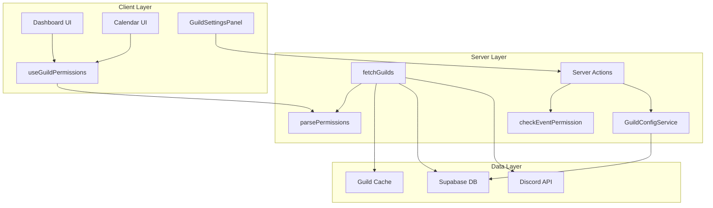
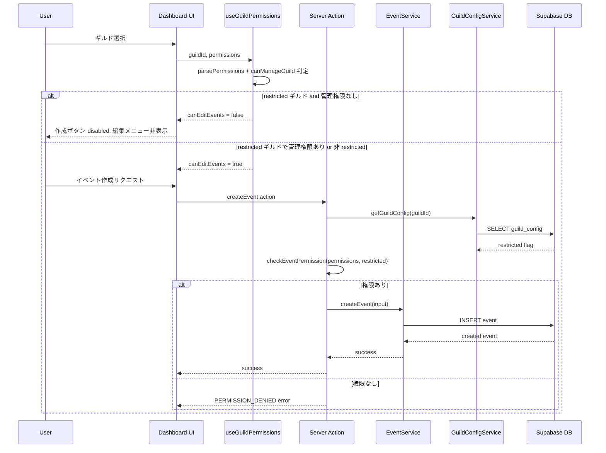
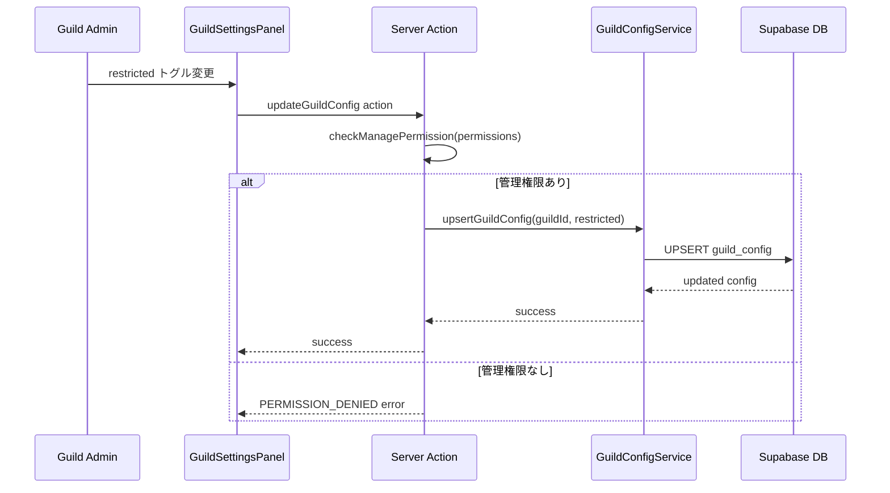

# Design Document: Guild Permissions

## Overview

**Purpose**: ギルド内のユーザー権限に基づいたアクセス制御を提供し、`restricted` モードのギルドでは管理権限のないユーザーのイベント編集を制限する。

**Users**: Discord ギルドの管理者（権限設定の管理）と一般メンバー（権限に応じたイベント操作）が対象。

**Impact**: 現在の「全認証ユーザーが全操作可能」な状態から、ギルドごとの権限設定に基づく操作制御に変更する。既存の `guild_config` テーブルと `DiscordGuild.permissions` フィールドを活用する。

### Goals
- Discord 権限ビットフィールドを解析し、ギルド内の管理権限を判定する
- `restricted` フラグによるイベント操作の制限を実現する
- Server Actions での権限チェックによりクライアントバイパスを防止する
- 権限状態に応じた UI 表示制御を一貫したパターンで提供する

### Non-Goals
- Discord のチャンネル単位の権限オーバーライドへの対応
- RLS ポリシーレベルでの Discord 権限チェック（技術的に困難）
- Bot 側からの guild_config 管理 API（将来の拡張として検討）
- 権限情報のリアルタイム同期（キャッシュ TTL に依存）

## Architecture

### Existing Architecture Analysis

現在のシステムでは以下のパターンが確立されている:

- **データフロー**: `fetchGuilds()` → Discord API → DB 照合 → キャッシュ → Server Component → Client Component
- **サービスパターン**: `createEventService(supabase)` ファクトリ関数によるサービス生成
- **Result 型**: `MutationResult<T>` による成功/失敗の型安全な表現
- **Hook パターン**: `useEventMutation` の `MutationState` + コールバックパターン
- **エラー分類**: `CalendarErrorCode` による型安全なエラーコード管理

権限機能は既存パターンを踏襲して統合する。

### Architecture Pattern & Boundary Map



**Architecture Integration**:
- **Selected pattern**: 既存サービスレイヤーパターンの拡張。Server Actions で権限チェックを一元化
- **Domain boundaries**: 権限解析（`lib/discord/`）、ギルド設定（`lib/guilds/`）、イベント権限チェック（`lib/calendar/`）の3ドメインに分離
- **Existing patterns preserved**: ファクトリ関数、Result 型、CalendarErrorCode、Hook パターン
- **New components rationale**: 権限解析は Discord ドメイン、ギルド設定は guilds ドメイン、権限チェック Hook は hooks ドメインに配置

### Technology Stack

| Layer | Choice / Version | Role in Feature | Notes |
|-------|------------------|-----------------|-------|
| Frontend | React 19 + shadcn/ui | 権限ベース UI 制御、設定パネル | 既存コンポーネントの拡張 |
| Backend | Next.js 16 Server Actions | guild_config 更新、権限チェック | CSRF 保護組み込み |
| Data | Supabase (PostgreSQL) | guild_config テーブル読み書き | テーブル既存、RLS ポリシー追加 |
| Runtime | BigInt (ES2020) | 権限ビットフィールド解析 | Server 側で実行、ブラウザ互換不要 |

## System Flows

### 権限チェック付きイベント操作フロー



### ギルド設定変更フロー



## Requirements Traceability

| Requirement | Summary | Components | Interfaces | Flows |
|-------------|---------|------------|------------|-------|
| 1.1, 1.2, 1.3, 1.4 | 権限ビットフィールド解析 | parsePermissions, DiscordPermissions 型 | Service | - |
| 2.1, 2.2, 2.3, 2.4 | 権限取得サービス | fetchGuilds 拡張, GuildWithPermissions 型 | Service | 権限チェック付きイベント操作 |
| 3.1, 3.2, 3.3, 3.4 | ギルド設定管理 | GuildConfigService, Server Actions | Service, State | ギルド設定変更 |
| 4.1, 4.2, 4.3, 4.4 | イベント操作権限チェック | checkEventPermission, Server Actions | Service | 権限チェック付きイベント操作 |
| 5.1, 5.2, 5.3, 5.4, 5.5 | UI 表示制御 | Dashboard 拡張, GuildSettingsPanel | State | - |
| 6.1, 6.2, 6.3, 6.4 | 権限チェック Hook | useGuildPermissions | State | - |

## Components and Interfaces

| Component | Domain/Layer | Intent | Req Coverage | Key Dependencies | Contracts |
|-----------|--------------|--------|--------------|-----------------|-----------|
| parsePermissions | lib/discord | 権限ビットフィールド解析 | 1.1-1.4 | なし | Service |
| GuildConfigService | lib/guilds | guild_config CRUD | 3.1-3.4 | Supabase (P0) | Service |
| checkEventPermission | lib/calendar | イベント操作権限判定 | 4.1-4.4 | parsePermissions (P0), GuildConfigService (P0) | Service |
| guild-config Server Actions | app/dashboard | guild_config 更新アクション | 3.3, 3.4 | GuildConfigService (P0) | API |
| event Server Actions 拡張 | app/dashboard | 権限チェック付きイベント操作 | 4.1-4.3 | checkEventPermission (P0) | API |
| useGuildPermissions | hooks/guilds | 権限状態管理 Hook | 6.1-6.4 | parsePermissions (P0) | State |
| GuildSettingsPanel | components/guilds | ギルド設定 UI | 5.3, 5.4 | useGuildPermissions (P0) | State |
| Dashboard UI 拡張 | app/dashboard | 権限ベース表示制御 | 5.1, 5.2, 5.5 | useGuildPermissions (P0) | State |

### Discord Domain (lib/discord)

#### parsePermissions

| Field | Detail |
|-------|--------|
| Intent | Discord 権限ビットフィールド文字列を型安全な権限オブジェクトに変換する |
| Requirements | 1.1, 1.2, 1.3, 1.4 |

**Responsibilities & Constraints**
- 権限ビットフィールドの解析と個別フラグへの変換のみを担当
- 外部依存なし（純粋関数）
- BigInt を使用した 64 ビット超のビット演算をサポート

**Dependencies**
- なし（スタンドアロンユーティリティ）

**Contracts**: Service [x]

##### Service Interface
```typescript
/** Discord 権限ビットフィールドのフラグ定数 */
const DISCORD_PERMISSION_FLAGS = {
  ADMINISTRATOR: 1n << 3n,
  MANAGE_GUILD: 1n << 5n,
  MANAGE_CHANNELS: 1n << 4n,
  MANAGE_MESSAGES: 1n << 13n,
  MANAGE_ROLES: 1n << 28n,
  MANAGE_EVENTS: 1n << 33n,
} as const;

/** 解析済み Discord 権限 */
interface DiscordPermissions {
  administrator: boolean;
  manageGuild: boolean;
  manageChannels: boolean;
  manageMessages: boolean;
  manageRoles: boolean;
  manageEvents: boolean;
  raw: bigint;
}

/** 権限ビットフィールド文字列を解析 */
function parsePermissions(permissionsBitfield: string): DiscordPermissions;

/** 管理権限の有無を判定 */
function canManageGuild(permissions: DiscordPermissions): boolean;
```
- Preconditions: `permissionsBitfield` は数値文字列または空文字列
- Postconditions: 各フラグがビット演算結果に基づいて正確に設定される
- Invariants: 空文字列または "0" の場合、全フラグが `false`

### Guilds Domain (lib/guilds)

#### GuildConfigService

| Field | Detail |
|-------|--------|
| Intent | `guild_config` テーブルの CRUD 操作を提供する |
| Requirements | 3.1, 3.2, 3.3, 3.4 |

**Responsibilities & Constraints**
- `guild_config` テーブルの読み取り・書き込み
- レコード不在時のデフォルト値（`restricted: false`）の返却
- 新規レコードの upsert 対応

**Dependencies**
- Outbound: Supabase Client — guild_config テーブルアクセス (P0)

**Contracts**: Service [x]

##### Service Interface
```typescript
interface GuildConfig {
  guildId: string;
  restricted: boolean;
}

interface GuildConfigServiceInterface {
  /** ギルド設定を取得（不在時はデフォルト値を返す） */
  getGuildConfig(guildId: string): Promise<GuildConfig>;

  /** ギルド設定を更新（不在時は新規作成） */
  upsertGuildConfig(
    guildId: string,
    config: { restricted: boolean }
  ): Promise<MutationResult<GuildConfig>>;
}

function createGuildConfigService(
  supabase: SupabaseClient
): GuildConfigServiceInterface;
```
- Preconditions: `guildId` は有効な Discord ギルド ID
- Postconditions: `getGuildConfig` は必ず `GuildConfig` を返す（DB にレコードがなくてもデフォルト値）
- Invariants: `upsertGuildConfig` は冪等（同じ入力で同じ結果）

#### GuildWithPermissions 型拡張

| Field | Detail |
|-------|--------|
| Intent | 既存の Guild 型に権限情報を付加する |
| Requirements | 2.1, 2.4 |

**Implementation Notes**
- 既存の `Guild` 型を拡張し、`permissions` フィールドを追加
- `fetchGuilds()` の戻り値を拡張して権限情報を含める

```typescript
interface GuildWithPermissions extends Guild {
  permissions: DiscordPermissions;
}
```

### Calendar Domain (lib/calendar)

#### checkEventPermission

| Field | Detail |
|-------|--------|
| Intent | ギルド設定とユーザー権限に基づいてイベント操作の可否を判定する |
| Requirements | 4.1, 4.2, 4.3, 4.4 |

**Responsibilities & Constraints**
- `restricted` フラグと `canManageGuild` の組み合わせで判定
- 読み取り操作は常に許可
- フェイルセーフ: 権限情報不在時は拒否

**Dependencies**
- Inbound: Server Actions — イベント操作時の権限検証 (P0)
- Outbound: GuildConfigService — restricted フラグ取得 (P0)
- Outbound: parsePermissions — 権限解析 (P0)

**Contracts**: Service [x]

##### Service Interface
```typescript
type EventOperation = "create" | "update" | "delete" | "read";

interface PermissionCheckResult {
  allowed: boolean;
  reason?: string;
}

/** イベント操作の権限を検証 */
function checkEventPermission(
  operation: EventOperation,
  guildConfig: GuildConfig,
  permissions: DiscordPermissions
): PermissionCheckResult;
```
- Preconditions: `operation` は有効な `EventOperation` 値
- Postconditions: `read` 操作は常に `{ allowed: true }` を返す
- Invariants: `guildConfig.restricted === false` の場合、全操作が許可される

### Server Actions (app/dashboard)

#### guild-config Server Actions

| Field | Detail |
|-------|--------|
| Intent | ギルド設定の更新を権限チェック付きで実行する |
| Requirements | 3.3, 3.4 |

**Contracts**: API [x]

##### API Contract
| Action | Input | Output | Errors |
|--------|-------|--------|--------|
| updateGuildConfig | `{ guildId: string, restricted: boolean, permissionsBitfield: string }` | `MutationResult<GuildConfig>` | UNAUTHORIZED, PERMISSION_DENIED, UPDATE_FAILED |

**Implementation Notes**
- Server Action 内で `parsePermissions` → `canManageGuild` チェックを実行
- 権限チェック通過後に `GuildConfigService.upsertGuildConfig` を呼び出し
- `revalidatePath` でダッシュボードを再検証

#### event Server Actions 拡張

| Field | Detail |
|-------|--------|
| Intent | 既存のイベント CRUD Server Actions に権限チェックを追加する |
| Requirements | 4.1, 4.2, 4.3 |

**Implementation Notes**
- 既存の `createEvent` / `updateEvent` / `deleteEvent` アクションに `checkEventPermission` を追加
- 権限チェックは認証チェックの直後、DB 操作の前に実行
- `CalendarErrorCode` に `PERMISSION_DENIED` を追加

### Hooks Domain (hooks/guilds)

#### useGuildPermissions

| Field | Detail |
|-------|--------|
| Intent | ギルド権限状態を React コンポーネントに提供する |
| Requirements | 6.1, 6.2, 6.3, 6.4 |

**Responsibilities & Constraints**
- Server Component から渡された権限情報を消費
- `canManageGuild`、`isRestricted`、`canEditEvents` の派生状態を計算
- ギルド切り替え時の自動再計算

**Dependencies**
- Inbound: Dashboard UI — 権限状態の消費 (P0)
- Outbound: parsePermissions — 権限解析 (P0)

**Contracts**: State [x]

##### State Management
```typescript
interface GuildPermissionsState {
  /** 管理権限（administrator / manage_guild / manage_messages / manage_roles） */
  canManageGuild: boolean;
  /** ギルドの restricted フラグ */
  isRestricted: boolean;
  /** イベント編集可否の最終判定 */
  canEditEvents: boolean;
  /** 権限情報のローディング状態 */
  isLoading: boolean;
  /** エラー状態 */
  error: string | null;
}

function useGuildPermissions(
  guildId: string | null,
  permissionsBitfield: string | null,
  restricted: boolean
): GuildPermissionsState;
```
- State model: `permissionsBitfield` と `restricted` を入力とし、派生状態を計算
- Persistence: なし（Server Component から props で受け取る）
- Concurrency: ギルド切り替え時に `useMemo` で再計算

### UI Components (components/guilds)

#### GuildSettingsPanel

| Field | Detail |
|-------|--------|
| Intent | ギルド管理者向けの設定パネル（restricted トグル） |
| Requirements | 5.3, 5.4 |

**Implementation Notes**
- `canManageGuild` が `true` の場合のみレンダリング
- shadcn/ui の `Switch` コンポーネントで restricted トグルを表示
- Server Action `updateGuildConfig` を呼び出して更新
- ローディング状態とエラーフィードバックを提供

```typescript
interface GuildSettingsPanelProps {
  guildId: string;
  restricted: boolean;
  permissionsBitfield: string;
}
```

#### Dashboard UI 拡張

| Field | Detail |
|-------|--------|
| Intent | 権限状態に基づくイベント操作 UI の制御 |
| Requirements | 5.1, 5.2, 5.5 |

**Implementation Notes**
- `useGuildPermissions` Hook の `canEditEvents` を参照
- `canEditEvents === false` の場合: 新規作成ボタンを `disabled`、ドラッグ操作を無効化
- `canEditEvents === false` の場合: イベントクリック時の編集ダイアログを閲覧モードに
- `isLoading === true` の場合: 操作ボタンを一時的に `disabled`

## Data Models

### Domain Model

```mermaid
erDiagram
    Guild ||--o| GuildConfig : has
    Guild ||--o{ Event : contains
    DiscordGuild ||--|| DiscordPermissions : parsed_to

    Guild {
        string guildId PK
        string name
        string avatarUrl
    }
    GuildConfig {
        string guildId PK_FK
        boolean restricted
    }
    Event {
        uuid id PK
        string guildId FK
        string name
        timestamp startAt
        timestamp endAt
    }
    DiscordGuild {
        string id
        string permissions
    }
    DiscordPermissions {
        boolean administrator
        boolean manageGuild
        boolean manageMessages
        boolean manageRoles
    }
```

**Business Rules & Invariants**:
- `GuildConfig` が存在しない場合、`restricted: false` として扱う
- `restricted === true` かつ `canManageGuild === false` の場合、イベント CUD 操作を拒否
- `read` 操作は常に許可（restricted フラグに関係なく）

### Physical Data Model

`guild_config` テーブルは既存（マイグレーション済み）。追加の RLS ポリシーが必要:

```sql
-- guild_config への INSERT/UPDATE は Server Actions 経由
-- service_role キーで実行するため、RLS ではなくアプリ層で権限制御
-- 追加ポリシー: 認証ユーザーは読み取りのみ（既存）
```

### Data Contracts & Integration

**CalendarErrorCode 拡張**:
```typescript
// 既存の CALENDAR_ERROR_CODES に追加
"PERMISSION_DENIED"
```

**fetchGuilds 戻り値の拡張**:
```typescript
// 現在
{ guilds: Guild[]; error?: GuildListError }

// 拡張後
{ guilds: GuildWithPermissions[]; error?: GuildListError }
```

## Error Handling

### Error Categories and Responses

**User Errors (4xx)**:
- `PERMISSION_DENIED`: ギルドの権限制限によりイベント操作が拒否された → "このギルドではイベントの編集権限がありません" と表示
- `UNAUTHORIZED`: 未認証 → ログインページへリダイレクト

**Business Logic Errors (422)**:
- ギルド設定変更時の権限不足 → "ギルドの設定を変更するには管理権限が必要です" と表示

**System Errors (5xx)**:
- guild_config の読み取り失敗 → フェイルセーフで `restricted: false` として動作（イベント操作を許可）
- 権限解析失敗 → フェイルセーフで全権限を拒否

### Monitoring
- `PERMISSION_DENIED` エラーの発生頻度をログ出力（不正アクセスの検知）
- guild_config 更新操作のログ出力（監査証跡）

## Testing Strategy

### Unit Tests
- `parsePermissions`: 各権限フラグの正確な解析（全フラグ ON/OFF、個別フラグ、"0"、空文字列）
- `canManageGuild`: 管理権限の判定ロジック（administrator のみ、manage_guild のみ、複合）
- `checkEventPermission`: restricted/非 restricted × 管理権限あり/なし × 各操作タイプの組み合わせ
- `GuildConfigService`: getGuildConfig（存在/不在）、upsertGuildConfig（新規/更新）
- `useGuildPermissions`: 各状態の派生計算、ギルド切り替え時の再計算

### Integration Tests
- Server Action `updateGuildConfig`: 権限チェック → DB 更新 → 結果返却の一連のフロー
- Server Action イベント操作: 権限チェック付きの create/update/delete フロー
- `fetchGuilds` 拡張: Discord API → 権限解析 → GuildWithPermissions 返却

### E2E Tests
- restricted ギルドでの一般ユーザー: イベント作成ボタンが disabled であることを確認
- restricted ギルドでの管理者: イベント作成・編集・削除が可能であることを確認
- ギルド設定パネル: 管理者のみアクセス可能、restricted トグルの切り替え

## Security Considerations

- **サーバーサイド権限検証**: UI 側の制御はユーザビリティ目的。実際の権限チェックは Server Actions 内で必ず実行
- **フェイルセーフ**: 権限情報の取得/解析に失敗した場合、書き込み操作を拒否するデフォルト動作
- **権限情報の信頼性**: Discord API から直接取得した権限ビットフィールドを使用。クライアントからの権限情報は信頼しない
- **CSRF 保護**: Server Actions の組み込み CSRF 保護を活用
