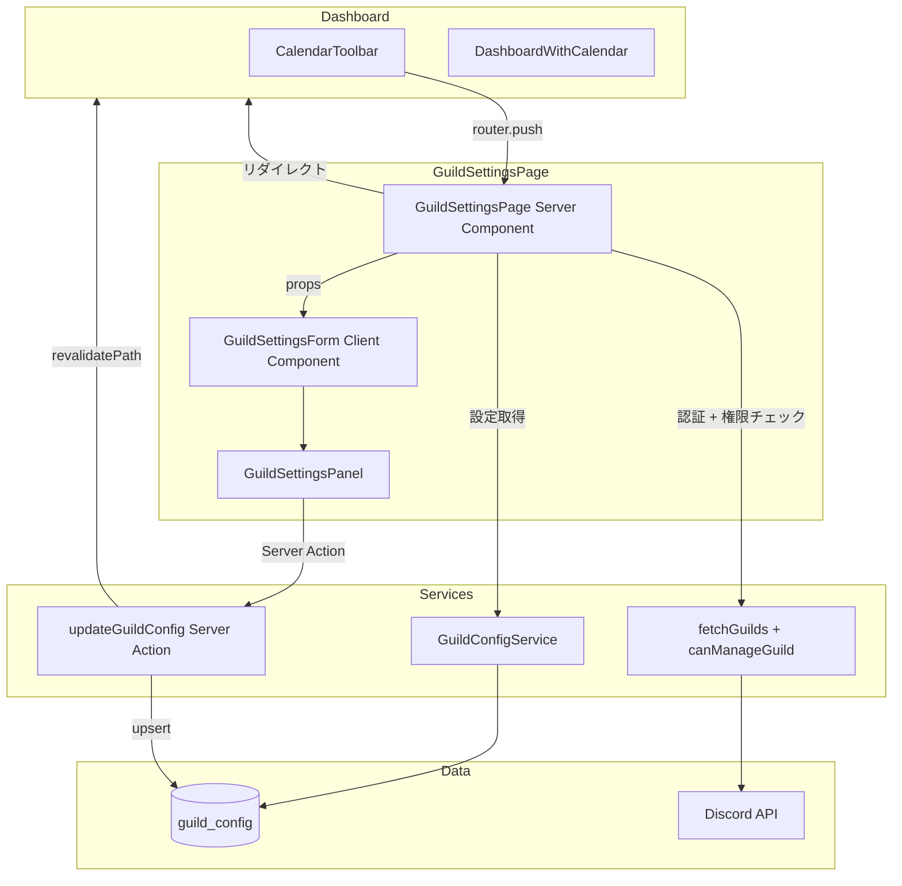
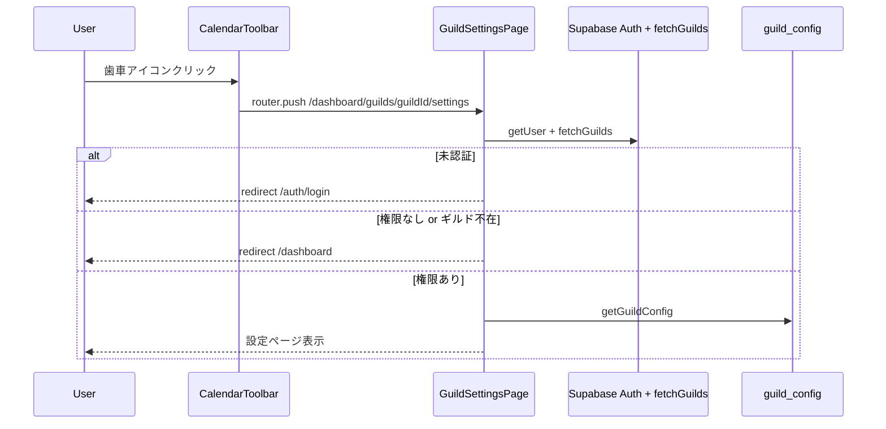

# Technical Design: guild-settings

## Overview

**Purpose**: ギルド管理者がギルド設定を専用ページで管理できるようにする。現在の `GuildSettingsDialog`（ダイアログ内トグル1つ）を専用ページに昇格し、将来の設定項目追加（通知チャンネル、ロケール等）に対応できる拡張可能な構造を構築する。

**Users**: `canManageGuild` 権限を持つギルド管理者が、カレンダーダッシュボードから遷移して設定を管理する。

**Impact**: `GuildSettingsDialog` を削除し、`CalendarToolbar` の歯車アイコンからの導線をページ遷移に変更する。

### Goals
- `/dashboard/guilds/[guildId]/settings` で権限設定を含むギルド設定ページを提供する
- 将来の設定項目追加に対応できるセクション分割構造を確立する
- 既存の `GuildSettingsPanel`、`updateGuildConfig` Server Action を流用して実装コストを最小化する

### Non-Goals
- 通知チャンネル設定UI（DIS-64 で対応）
- ギルド名・アイコンの編集機能（Discord API がソース）
- `user_guilds` テーブルによるサーバーサイド権限キャッシュ（DIS-7 で対応）
- RLS ポリシーの変更

## Architecture

### Existing Architecture Analysis

現在のギルド設定フロー:
- `DashboardWithCalendar` が `GuildSettingsDialog` をレンダリング（`canManageGuild && selectedPermInfo` 条件付き）
- `CalendarToolbar.onSettingsClick` コールバックでダイアログを開閉
- `GuildSettingsPanel` が `restricted` トグルの楽観的更新を処理
- `updateGuildConfig` Server Action がサーバーサイド権限検証 + DB upsert を実行

**変更点**: ダイアログフローをページ遷移フローに置き換える。

### Architecture Pattern & Boundary Map



**Architecture Integration**:
- **Selected pattern**: Server Component データフェッチ + Client Component フォーム。`app/dashboard/page.tsx` と同一パターン
- **Existing patterns preserved**: `fetchGuilds` + `canManageGuild` 権限検証（dashboard/page.tsx と同一パターン）、楽観的更新、Result 型 Server Action
- **New components rationale**: `GuildSettingsPage`（Server Component、ルートエントリ）と `GuildSettingsForm`（Client Component、セクション管理）の2コンポーネントのみ新設
- **Steering compliance**: Co-location パターン、kebab-case ファイル名、`@/` パスエイリアス

### Technology Stack

| Layer | Choice / Version | Role in Feature | Notes |
|-------|------------------|-----------------|-------|
| Frontend | Next.js 16 App Router + React 19 | ルーティング、Server Component | 既存スタック |
| UI | shadcn/ui (Card, Switch) | 設定セクション UI | 既存コンポーネント流用 |
| Data | Supabase (PostgreSQL) | `guild_config` テーブル | 既存テーブル、スキーマ変更なし |
| Auth | Supabase Auth + Discord OAuth | 認証 + 権限取得 | 既存フロー |

新規ライブラリの追加なし。

## System Flows

### ページアクセスフロー



### restricted トグル更新フロー

既存の `GuildSettingsPanel` の楽観的更新パターンをそのまま利用。`updateGuildConfig` Server Action がサーバーサイドで `resolveServerAuth` → `canManageGuild` 検証 → `upsertGuildConfig` を実行する。

## Requirements Traceability

| Requirement | Summary | Components | Interfaces | Flows |
|-------------|---------|------------|------------|-------|
| 1.1 | 認証済みアクセスでページ表示 | GuildSettingsPage | — | ページアクセスフロー |
| 1.2 | 未認証で /auth/login リダイレクト | GuildSettingsPage | — | ページアクセスフロー |
| 1.3 | 権限なしで /dashboard リダイレクト | GuildSettingsPage | — | ページアクセスフロー |
| 1.4 | 存在しない guildId で /dashboard リダイレクト | GuildSettingsPage | — | ページアクセスフロー |
| 2.1 | ギルド名をタイトル表示 | GuildSettingsForm | GuildSettingsFormProps | — |
| 2.2 | ギルドアイコン表示 | GuildSettingsForm | GuildSettingsFormProps | — |
| 2.3 | アイコン未設定時のイニシャルフォールバック | GuildSettingsForm | GuildSettingsFormProps | — |
| 2.4 | ギルド情報は読み取り専用 | GuildSettingsForm | — | — |
| 3.1 | 権限設定セクション表示 | GuildSettingsForm, GuildSettingsPanel | — | — |
| 3.2 | restricted トグル表示 | GuildSettingsPanel | GuildSettingsPanelProps | — |
| 3.3 | トグル切替で即座に更新 | GuildSettingsPanel | updateGuildConfig | トグル更新フロー |
| 3.4 | 更新成功フィードバック | GuildSettingsPanel | — | — |
| 3.5 | 更新失敗時エラー + ロールバック | GuildSettingsPanel | — | — |
| 4.1 | セクション単位の区切り表示 | GuildSettingsForm | SettingsSection | — |
| 4.2 | 初期リリースに権限設定セクション | GuildSettingsForm | — | — |
| 4.3 | セクションにタイトルと説明文 | SettingsSection | SettingsSectionProps | — |
| 5.1 | 権限ありで歯車アイコン表示 | CalendarToolbar | CalendarToolbarProps | — |
| 5.2 | 歯車クリックでページ遷移 | DashboardWithCalendar | — | ページアクセスフロー |
| 5.3 | 権限なしで歯車非表示 | CalendarToolbar | CalendarToolbarProps | — |
| 5.4 | ダッシュボードへの戻るリンク | GuildSettingsForm | — | — |
| 6.1 | デスクトップで中央配置 | GuildSettingsForm | — | — |
| 6.2 | モバイルで全幅表示 | GuildSettingsForm | — | — |
| 6.3 | タッチ操作に適したサイズ | GuildSettingsForm, GuildSettingsPanel | — | — |

## Components and Interfaces

| Component | Domain/Layer | Intent | Req Coverage | Key Dependencies | Contracts |
|-----------|-------------|--------|--------------|------------------|-----------|
| GuildSettingsPage | Page / Server | ルート、データフェッチ、権限ガード | 1.1-1.4 | fetchGuilds (P0), Supabase Auth (P0), GuildConfigService (P0) | — |
| GuildSettingsForm | UI / Client | ギルド情報表示、セクション管理 | 2.1-2.4, 4.1-4.3, 5.4, 6.1-6.3 | GuildSettingsPanel (P0) | State |
| SettingsSection | UI / Client | 汎用セクションラッパー | 4.1, 4.3 | — | — |
| GuildSettingsPanel | UI / Client | restricted トグル（既存） | 3.1-3.5 | updateGuildConfig (P0) | Service |
| DashboardWithCalendar | UI / Client | 導線変更（既存修正） | 5.1-5.3 | CalendarToolbar (P0) | — |

### Page Layer

#### GuildSettingsPage

| Field | Detail |
|-------|--------|
| Intent | ルートエントリ。認証・権限チェック + データフェッチ + GuildSettingsForm へのprops渡し |
| Requirements | 1.1, 1.2, 1.3, 1.4 |

**Responsibilities & Constraints**
- Server Component として `app/dashboard/guilds/[guildId]/settings/page.tsx` に配置
- 認証チェック: `supabase.auth.getUser()` → 未認証なら `/auth/login` にリダイレクト
- ギルド存在確認: `fetchGuilds()` で取得したギルド一覧に `guildId` が含まれるか確認
- 権限チェック: `canManageGuild(permissions)` → 権限なしなら `/dashboard` にリダイレクト
- ギルド設定取得: `createGuildConfigService(supabase).getGuildConfig(guildId)`

**Dependencies**
- Inbound: Next.js App Router — ルーティング (P0)
- Outbound: GuildSettingsForm — UI レンダリング (P0)
- External: fetchGuilds — ギルド + 権限データ (P0)
- External: GuildConfigService — guild_config 読み取り (P0)
- External: Supabase Auth — 認証 (P0)

**Implementation Notes**
- `export const dynamic = "force-dynamic"` を設定（dashboard/page.tsx と同一）
- `params` から `guildId` を取得（Next.js dynamic route）
- `DashboardHeader` コンポーネントを共有してヘッダーを統一
- `buildDashboardUser()` で DashboardUser を構築し DashboardHeader に渡す

### UI Layer

#### GuildSettingsForm

| Field | Detail |
|-------|--------|
| Intent | ギルド情報ヘッダーと設定セクション群を表示するメインクライアントコンポーネント |
| Requirements | 2.1, 2.2, 2.3, 2.4, 4.1, 4.2, 4.3, 5.4, 6.1, 6.2, 6.3 |

**Responsibilities & Constraints**
- `"use client"` ディレクティブ
- ギルド情報ヘッダー（アイコン + 名前）の読み取り専用表示
- `SettingsSection` でセクションを区切り、`GuildSettingsPanel` を配置
- レスポンシブ: `max-w-2xl mx-auto`（デスクトップ）、`px-4`（モバイル）
- 「カレンダーに戻る」リンク（`/dashboard?guild={guildId}`）

**Dependencies**
- Inbound: GuildSettingsPage — props (P0)
- Outbound: GuildSettingsPanel — restricted トグル (P0)
- Outbound: SettingsSection — セクション UI (P1)

**Contracts**: State [x]

##### State Management

```typescript
interface GuildSettingsFormProps {
  guild: {
    guildId: string;
    name: string;
    avatarUrl: string | null;
  };
  restricted: boolean;
}
```

- `restricted` の状態管理は `GuildSettingsPanel` 内部で完結（既存の楽観的更新パターン）
- `GuildSettingsForm` 自体はステートレス（props をレイアウトに配置するのみ）

**Implementation Notes**
- ギルドアイコンのフォールバック: 既存の `GuildCard` と同じパターン（`guild.name.charAt(0)` のイニシャル表示）
- `next/image` の `Image` コンポーネントでアイコン表示
- `next/link` の `Link` コンポーネントで「カレンダーに戻る」リンク

#### SettingsSection

| Field | Detail |
|-------|--------|
| Intent | タイトル・説明文付きの汎用セクションラッパー |
| Requirements | 4.1, 4.3 |

**Responsibilities & Constraints**
- 表示専用コンポーネント。タイトル、説明文、children をレンダリング
- shadcn/ui `Card` でセクション区切りを表現

```typescript
interface SettingsSectionProps {
  title: string;
  description: string;
  children: React.ReactNode;
}
```

**Implementation Notes**
- `Card` + `CardHeader`（タイトル・説明文）+ `CardContent`（children）で構成
- 将来のセクション追加（通知チャンネル、ロケール等）は同一パターンで `SettingsSection` を追加するだけ

#### GuildSettingsPanel（既存・変更なし）

| Field | Detail |
|-------|--------|
| Intent | `restricted` トグルの楽観的更新 UI |
| Requirements | 3.1, 3.2, 3.3, 3.4, 3.5 |

既存コンポーネントをそのまま利用。`hideTitle` を渡さずにページ内で使用する。

**Contracts**: Service [x]

##### Service Interface

```typescript
// 既存の updateGuildConfig Server Action
type UpdateGuildConfigInput = {
  guildId: string;
  restricted: boolean;
};

type GuildConfigMutationResult<T> =
  | { success: true; data: T }
  | { success: false; error: GuildConfigError };
```

### Dashboard Layer（既存修正）

#### DashboardWithCalendar（変更箇所のみ）

| Field | Detail |
|-------|--------|
| Intent | 歯車アイコンの導線をダイアログからページ遷移に変更 |
| Requirements | 5.1, 5.2, 5.3 |

**変更内容**:
1. `isSettingsDialogOpen` 状態を削除
2. `handleSettingsClick` を `router.push(`/dashboard/guilds/${selectedGuildId}/settings`)` に変更
3. `GuildSettingsDialog` のレンダリングを削除
4. `GuildSettingsDialog` の import を削除

**Implementation Notes**
- `useRouter()` を新規に import（既存で `useSearchParams` / `usePathname` は使用済み。`useRouter` は `next/navigation` から）
- `handleRestrictedChange` コールバックは不要になる。設定変更後のデータ整合性は `updateGuildConfig` Server Action 内の `revalidatePath("/dashboard")` で保証される（既存実装済み）。ダッシュボードに戻る際にサーバーサイドで最新の `restricted` 値が再取得される

## Data Models

### 既存テーブル（変更なし）

本フィーチャーでスキーマ変更は発生しない。

- **`guilds`**: `id (int)`, `guild_id (text)`, `name (text)`, `avatar_url (text)`, `locale (text)`
- **`guild_config`**: `guild_id (text PK FK)`, `restricted (boolean default false)`

### Data Contracts

**GuildSettingsPage → GuildSettingsForm**:

```typescript
// Server Component から Client Component への props
interface GuildSettingsFormProps {
  guild: {
    guildId: string;
    name: string;
    avatarUrl: string | null;
  };
  restricted: boolean;
}
```

JSON シリアライズ可能な値のみを渡す（`BigInt` の `permissions` は除外）。

## Error Handling

### Error Categories and Responses

**User Errors (4xx)**:
- 未認証アクセス → `/auth/login` リダイレクト（Server Component レベル）
- 権限不足 → `/dashboard` リダイレクト（Server Component レベル）
- 存在しない guildId → `/dashboard` リダイレクト（Server Component レベル）

**System Errors (5xx)**:
- `fetchGuilds` 失敗（Discord API エラー/トークン期限切れ）→ `/dashboard` リダイレクト + エラー表示はダッシュボード側で処理
- `updateGuildConfig` 失敗 → `GuildSettingsPanel` の既存エラー表示 + トグルロールバック

**Business Logic Errors (422)**:
- 権限不足での設定変更 → Server Action 内の `resolveServerAuth` で拒否 → `GuildSettingsPanel` にエラー表示

## Testing Strategy

### Unit Tests
- `GuildSettingsForm`: ギルド情報表示、セクション構成、戻るリンクの存在
- `SettingsSection`: タイトル・説明文・children の表示
- `GuildSettingsPanel`: 既存テストを維持

### Integration Tests
- `GuildSettingsPage`: 権限あり/なしでのレンダリング分岐（Server Component テスト）
- `DashboardWithCalendar`: 歯車クリックで `router.push` が呼ばれること

### Storybook
- `GuildSettingsForm`: デスクトップ/モバイル表示、アイコンあり/なしバリアント
- `SettingsSection`: 基本表示

### 削除対象
- `GuildSettingsDialog` のテスト・ストーリー（コンポーネント削除に伴い）
