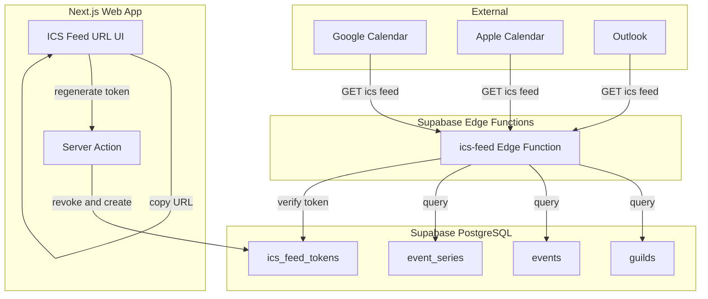
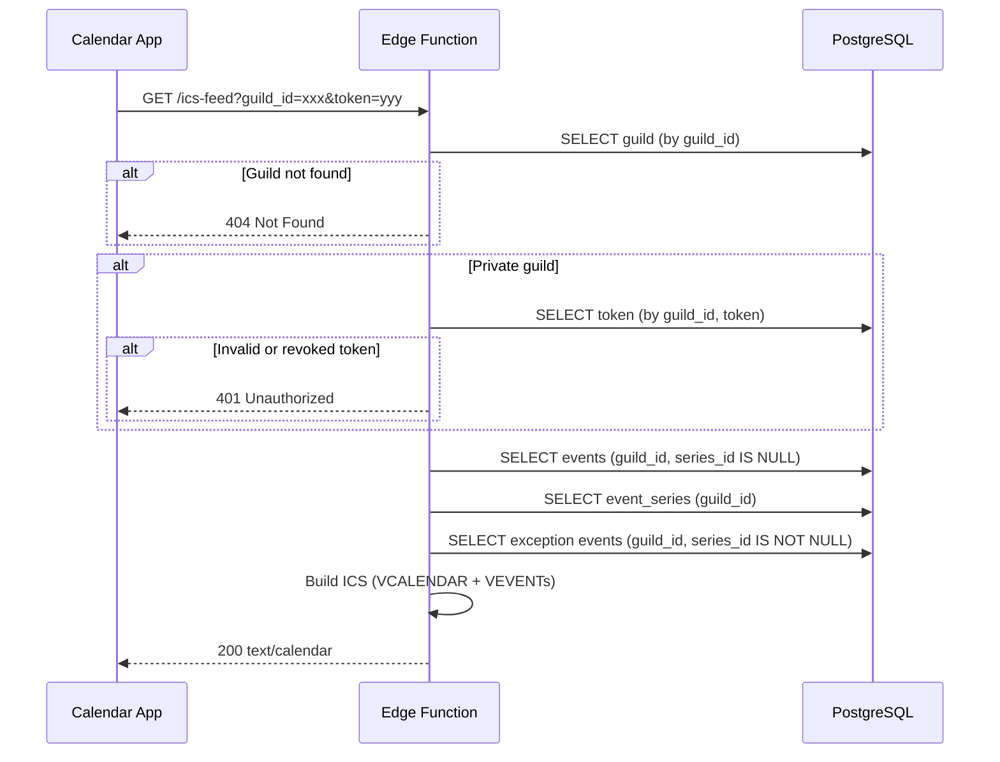
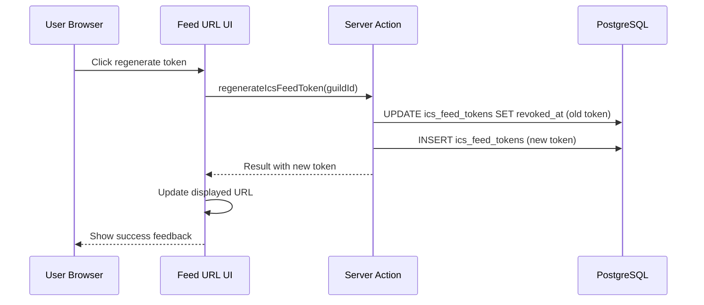

# Design Document: ICSフィードエクスポート

## Overview

**Purpose**: Supabase Edge Functionsを使ってギルドごとのICSフィードエンドポイントを提供し、Google Calendar・Apple Calendar・Outlookなどの外部カレンダーアプリからDiscalendarの予定を購読可能にする。

**Users**: Discalendarユーザーが外部カレンダーアプリでギルドの予定を確認する。ギルド管理者がフィードURLの発行・管理を行う。

**Impact**: Supabase Edge Functionsの初導入。新テーブル `ics_feed_tokens` の追加。Web UIにフィードURL管理セクションを追加。

### Goals
- ギルドのイベント（単発・繰り返し）をRFC 5545準拠のICSフィードとして配信する
- 公開ギルドはトークン不要、非公開ギルドはアクセストークンで認証する
- Web UIでフィードURLのコピーとトークン再生成を提供する

### Non-Goals
- Google Calendar APIとの双方向同期（DIS-25で対応予定）
- カレンダーアプリからのイベント作成・編集（読み取り専用フィード）
- Webhook/push型のリアルタイム通知（ポーリングベースの購読のみ）

## Architecture

### Existing Architecture Analysis

現在のシステムで関連する既存要素:

- **公開カレンダー基盤**: `guilds.is_public` / `guilds.public_slug` + anon RLSポリシーが稼働中
- **イベントデータ**: `events` テーブル（単発）と `event_series` テーブル（繰り返し、RFC 5545 RRULE格納済み）
- **RLSカラム制限**: anon向けに `channel_id`, `channel_name`, `notifications` を除外済み
- **Edge Functions**: 未導入（`supabase/config.toml` でDeno 2ランタイムは設定済み）

### Architecture Pattern & Boundary Map



**Architecture Integration**:
- **Selected pattern**: Edge Function単体 + service role key。JWT検証を無効化し、アプリ層でトークン認証を実装
- **Domain boundaries**: Edge Function（ICS生成 + 認証）はWebアプリから独立。Web UIのトークン管理はServer Action経由
- **Existing patterns preserved**: Supabaseクライアントパターン（service role key）、Server Actionパターン（Result型）
- **New components rationale**: Edge Function（外部カレンダーアプリの直接アクセスにはサーバーレスエンドポイントが必要）、ics_feed_tokensテーブル（トークンの発行・無効化管理）

### Technology Stack

| Layer | Choice / Version | Role in Feature | Notes |
|-------|------------------|-----------------|-------|
| Edge Function | Supabase Edge Functions (Deno 2) | ICSフィードHTTPエンドポイント | `--no-verify-jwt` でデプロイ |
| Database | Supabase PostgreSQL v17 | イベントデータ + トークン格納 | 新テーブル `ics_feed_tokens` 追加 |
| Frontend | Next.js 16 + React 19 | フィードURL表示・コピー・トークン管理UI | 既存ダッシュボードに統合 |
| ICS生成 | 手動生成（外部ライブラリなし） | RFC 5545準拠のVCALENDAR/VEVENT出力 | `research.md` で選定理由を記載 |

## System Flows

### ICSフィード取得フロー



### トークン再生成フロー



## Requirements Traceability

| Requirement | Summary | Components | Interfaces | Flows |
|-------------|---------|------------|------------|-------|
| 1.1-1.4 | ICSフィードエンドポイント | IcsFeedFunction | API Contract | ICSフィード取得 |
| 2.1-2.6 | 単発イベントICS出力 | IcsBuilder | formatSingleEvent | ICSフィード取得 |
| 3.1-3.5 | 繰り返しイベントICS出力 | IcsBuilder | formatSeriesEvent, formatExceptionEvent | ICSフィード取得 |
| 4.1-4.5 | アクセストークン認証 | IcsFeedFunction, IcsFeedTokenService | verifyToken | ICSフィード取得 |
| 5.1-5.5 | トークンDBスキーマ | ics_feed_tokens | - | - |
| 6.1-6.5 | Web UIフィードURL管理 | IcsFeedUrlSection | Server Action | トークン再生成 |
| 7.1-7.4 | セキュリティとパフォーマンス | IcsFeedFunction, IcsBuilder | - | ICSフィード取得 |

## Components and Interfaces

| Component | Domain/Layer | Intent | Req Coverage | Key Dependencies | Contracts |
|-----------|--------------|--------|--------------|------------------|-----------|
| IcsFeedFunction | Edge Function | HTTPリクエスト処理・認証・レスポンス | 1.1-1.4, 4.1-4.4, 7.1-7.4 | Supabase Client (P0) | API |
| IcsBuilder | Edge Function / Shared | ICSテキスト生成 | 2.1-2.6, 3.1-3.5, 7.3 | なし | Service |
| IcsFeedTokenService | Server Action | トークンCRUD | 4.5, 5.1-5.5, 6.5 | Supabase Client (P0) | Service |
| IcsFeedUrlSection | UI | フィードURL表示・コピー | 6.1-6.4 | IcsFeedTokenService (P0) | State |

### Edge Function Layer

#### IcsFeedFunction

| Field | Detail |
|-------|--------|
| Intent | ICSフィードのHTTPエンドポイント。認証・データ取得・ICS生成・レスポンスを統括 |
| Requirements | 1.1, 1.2, 1.3, 1.4, 4.1, 4.2, 4.3, 4.4, 7.1, 7.2, 7.3, 7.4 |

**Responsibilities & Constraints**
- HTTPリクエストからguild_idとtokenパラメータを抽出
- ギルドの存在確認と公開/非公開判定
- 非公開ギルドのトークン検証（定数時間比較）
- Supabase service role clientでイベントデータを取得（内部カラムを除外するSELECT句）
- IcsBuilderでICSテキストを生成し、適切なヘッダー付きで返却

**Dependencies**
- Outbound: Supabase PostgreSQL — ギルド・イベント・トークンデータ取得 (P0)
- External: @supabase/supabase-js — Denoからのimport via esm.sh (P0)

**Contracts**: API [x]

##### API Contract

| Method | Endpoint | Request | Response | Errors |
|--------|----------|---------|----------|--------|
| GET | `/ics-feed?guild_id={guild_id}&token={token}` | Query params: guild_id (必須), token (任意) | `text/calendar; charset=utf-8` Body: ICSテキスト | 400 (guild_id missing), 401 (invalid token), 404 (guild not found) |

**レスポンスヘッダー**:
- `Content-Type: text/calendar; charset=utf-8`
- `Content-Disposition: attachment; filename="calendar.ics"`
- `Cache-Control: public, max-age=3600, stale-while-revalidate=600`
- `Access-Control-Allow-Origin: *`

**Implementation Notes**
- `Deno.serve()` APIで実装。`--no-verify-jwt` でデプロイ
- トークン検証は `crypto.subtle.timingSafeEqual()` で定数時間比較
- パラメータ化クエリでSQLインジェクション防止（Supabase clientが自動処理）
- 内部カラム除外: SELECTで `id, guild_id, name, description, color, is_all_day, start_at, end_at, location, series_id, original_date, created_at, updated_at` のみ取得

---

#### IcsBuilder

| Field | Detail |
|-------|--------|
| Intent | イベントデータからRFC 5545準拠のICSテキストを生成する純粋関数群 |
| Requirements | 2.1, 2.2, 2.3, 2.4, 2.5, 2.6, 3.1, 3.2, 3.3, 3.4, 3.5, 7.3 |

**Responsibilities & Constraints**
- VCALENDARヘッダー/フッター生成
- 単発イベント → VEVENT変換
- 繰り返しイベント → RRULE付きVEVENT変換
- 例外オカレンス → RECURRENCE-ID付きVEVENT変換
- テキストエスカープ（カンマ・セミコロン・改行）
- 行折り返し（75オクテット制限）

**Dependencies**
- なし（純粋関数、外部依存なし）

**Contracts**: Service [x]

##### Service Interface

```typescript
interface IcsBuilderService {
  buildCalendar(params: BuildCalendarParams): string;
}

interface BuildCalendarParams {
  calendarName: string;
  events: IcsEvent[];
  series: IcsSeries[];
  exceptions: IcsException[];
}

interface IcsEvent {
  id: string;
  name: string;
  description: string | null;
  color: string;
  isAllDay: boolean;
  startAt: string; // ISO 8601
  endAt: string;   // ISO 8601
  location: string | null;
  createdAt: string;
  updatedAt: string;
}

interface IcsSeries {
  id: string;
  name: string;
  description: string | null;
  color: string;
  isAllDay: boolean;
  rrule: string;       // RFC 5545 RRULE string
  dtstart: string;     // ISO 8601
  durationMinutes: number;
  location: string | null;
  exdates: string[];   // ISO 8601 array
  createdAt: string;
  updatedAt: string;
}

interface IcsException {
  id: string;
  seriesId: string;
  name: string;
  description: string | null;
  color: string;
  isAllDay: boolean;
  startAt: string;
  endAt: string;
  location: string | null;
  originalDate: string; // ISO 8601
  createdAt: string;
  updatedAt: string;
}
```

- Preconditions: 入力データはDB行からcamelCaseに変換済み
- Postconditions: RFC 5545準拠のICSテキスト文字列（CRLF改行）を返す
- Invariants: 出力はVCALENDARで囲まれ、VERSION:2.0とPRODIDを含む

**Implementation Notes**
- `supabase/functions/_shared/ics-builder.ts` に配置し、将来の他Edge Functionからの再利用を可能にする
- 日時変換: ISO 8601 → ICS形式（`YYYYMMDDTHHMMSSZ` or `YYYYMMDD`）のヘルパー関数
- UID: `{id}@discalendar.app` 形式
- テキストエスカープと行折り返しは専用ヘルパー関数で実装

---

### Server Action Layer

#### IcsFeedTokenService

| Field | Detail |
|-------|--------|
| Intent | ICSフィードアクセストークンのCRUD操作（生成・取得・無効化） |
| Requirements | 4.5, 5.1, 5.2, 5.3, 5.4, 5.5, 6.5 |

**Responsibilities & Constraints**
- トークン生成（`crypto.randomUUID()` + `crypto.getRandomValues()` で32文字以上）
- トークン取得（ギルドIDからアクティブなトークンを取得）
- トークン無効化（`revoked_at` を設定）
- トークン再生成（無効化 + 新規生成のトランザクション）

**Dependencies**
- Outbound: Supabase PostgreSQL — ics_feed_tokensテーブル (P0)
- Inbound: IcsFeedUrlSection — トークン表示・再生成 (P0)
- Inbound: IcsFeedFunction — トークン検証 (P0, Edge Function側はDB直接参照)

**Contracts**: Service [x]

##### Service Interface

```typescript
// app/dashboard/actions.ts に追加

type IcsFeedTokenResult =
  | { success: true; data: { token: string; feedUrl: string } }
  | { success: false; error: "UNAUTHORIZED" | "GUILD_NOT_FOUND" | "INTERNAL_ERROR" };

function getOrCreateIcsFeedToken(guildId: string): Promise<IcsFeedTokenResult>;

function regenerateIcsFeedToken(guildId: string): Promise<IcsFeedTokenResult>;
```

- Preconditions: ユーザーが認証済みで、対象ギルドのメンバーである
- Postconditions: アクティブなトークンが1つ存在する状態を保証
- Invariants: 同一guild_idに対してアクティブ（revoked_at IS NULL）なトークンは最大1つ

**Implementation Notes**
- Server Action（`"use server"`）として実装
- ギルドメンバーシップの検証: `user_guilds` テーブルでユーザーの所属を確認
- Result型パターン: 既存の `classifySupabaseError()` を活用

---

### UI Layer

#### IcsFeedUrlSection

| Field | Detail |
|-------|--------|
| Intent | ICSフィードURLの表示、クリップボードコピー、トークン再生成UI |
| Requirements | 6.1, 6.2, 6.3, 6.4, 6.5 |

**Responsibilities & Constraints**
- フィードURLの構築と表示（公開/非公開で異なるURL）
- クリップボードコピー機能（`navigator.clipboard.writeText()`）
- コピー完了フィードバック表示
- トークン再生成ボタンと確認ダイアログ

**Dependencies**
- Outbound: IcsFeedTokenService — トークン取得・再生成 (P0)
- External: shadcn/ui — Button, Input, Card, toast (P1)

**Contracts**: State [x]

##### State Management

```typescript
interface IcsFeedUrlSectionProps {
  guildId: string;
  isPublic: boolean;
  initialToken: string | null;
  supabaseProjectUrl: string;
}

// 内部state
// feedUrl: string — 表示するフィードURL
// isCopied: boolean — コピー完了フィードバック
// isRegenerating: boolean — 再生成中ローディング
```

- State model: ローカルstate（useState）でコピー状態とローディングを管理
- Persistence: トークンはServer Action経由でDB永続化
- Concurrency: 再生成中は追加リクエストを無効化（ボタンdisabled）

**Implementation Notes**
- `"use client"` コンポーネント
- フィードURL形式: `https://<project-ref>.supabase.co/functions/v1/ics-feed?guild_id={guildId}&token={token}`
- 公開ギルド: `?token=` パラメータを省略
- 配置: ダッシュボードのカレンダー設定エリアに統合
- shadcn/ui: `Button`, `Input`（読み取り専用URLフィールド）, `toast`（コピーフィードバック）

## Data Models

### Physical Data Model

#### ics_feed_tokens テーブル

```sql
CREATE TABLE ics_feed_tokens (
  id UUID PRIMARY KEY DEFAULT gen_random_uuid(),
  guild_id VARCHAR(32) NOT NULL REFERENCES guilds(guild_id) ON DELETE CASCADE,
  token VARCHAR(64) NOT NULL,
  created_at TIMESTAMPTZ NOT NULL DEFAULT now(),
  revoked_at TIMESTAMPTZ DEFAULT NULL
);

-- アクティブトークンのユニーク制約（1ギルド1アクティブトークン）
CREATE UNIQUE INDEX idx_ics_feed_tokens_guild_active
  ON ics_feed_tokens (guild_id)
  WHERE revoked_at IS NULL;

-- トークン検証用インデックス
CREATE INDEX idx_ics_feed_tokens_token
  ON ics_feed_tokens (token)
  WHERE revoked_at IS NULL;
```

**RLSポリシー**:

```sql
-- Edge FunctionはService Role Keyでアクセスするため、RLSバイパス
-- Web UIからのアクセスは Server Action 経由（認証済みユーザー + ギルドメンバーシップ検証）

ALTER TABLE ics_feed_tokens ENABLE ROW LEVEL SECURITY;

-- 認証済みユーザーが自分のギルドのトークンを読み取り可能
CREATE POLICY "guild_members_can_read_tokens"
  ON ics_feed_tokens FOR SELECT TO authenticated
  USING (
    guild_id IN (SELECT guild_id FROM user_guilds WHERE user_id = auth.uid())
  );

-- 認証済みユーザーが自分のギルドのトークンを作成可能
CREATE POLICY "guild_members_can_insert_tokens"
  ON ics_feed_tokens FOR INSERT TO authenticated
  WITH CHECK (
    guild_id IN (SELECT guild_id FROM user_guilds WHERE user_id = auth.uid())
  );

-- 認証済みユーザーが自分のギルドのトークンを無効化可能
CREATE POLICY "guild_members_can_update_tokens"
  ON ics_feed_tokens FOR UPDATE TO authenticated
  USING (
    guild_id IN (SELECT guild_id FROM user_guilds WHERE user_id = auth.uid())
  );
```

### Data Contracts & Integration

**Edge Function → DB クエリパターン**:

```typescript
// ギルド取得
interface GuildRow {
  guild_id: string;
  name: string;
  is_public: boolean;
  deleted_at: string | null;
}

// 単発イベント取得（内部カラム除外）
interface EventRow {
  id: string;
  guild_id: string;
  name: string;
  description: string | null;
  color: string;
  is_all_day: boolean;
  start_at: string;
  end_at: string;
  location: string | null;
  series_id: string | null;
  original_date: string | null;
  created_at: string;
  updated_at: string;
}

// 繰り返しイベント取得（内部カラム除外）
interface EventSeriesRow {
  id: string;
  guild_id: string;
  name: string;
  description: string | null;
  color: string;
  is_all_day: boolean;
  rrule: string;
  dtstart: string;
  duration_minutes: number;
  location: string | null;
  exdates: string[];
  created_at: string;
  updated_at: string;
}
```

## Error Handling

### Error Categories and Responses

**User Errors (4xx)**:
- `400 Bad Request` — guild_idパラメータが未指定
- `401 Unauthorized` — 非公開ギルドでトークンが無効または未指定
- `404 Not Found` — ギルドが存在しない、または削除済み（`deleted_at IS NOT NULL`）

**System Errors (5xx)**:
- `500 Internal Server Error` — DB接続エラー、予期せぬ例外。エラー詳細はログ出力のみ（レスポンスには含めない）

**Web UI Errors**:
- トークン再生成失敗: toast通知でエラーメッセージを表示、リトライ可能

### Monitoring

- Edge Functionのログ: Supabase DashboardのLogs Explorerで確認可能
- エラー率: 4xx/5xxレスポンスの割合をモニタリング

## Testing Strategy

### Unit Tests
- IcsBuilder: 単発イベントのVEVENT生成（必須フィールド、終日イベント、オプショナルフィールド）
- IcsBuilder: 繰り返しイベントのRRULE/EXDATE/RECURRENCE-ID出力
- IcsBuilder: テキストエスカープ（カンマ・セミコロン・改行）
- IcsBuilder: 行折り返し（75オクテット制限）
- IcsBuilder: VCALENDAR全体の構造（VERSION, PRODID, X-WR-CALNAME）

### Integration Tests
- Edge Function: 公開ギルドのICSフィード取得（トークンなし）
- Edge Function: 非公開ギルドのトークン認証（有効/無効/未指定）
- Edge Function: 存在しないギルドの404レスポンス
- Server Action: トークン生成・取得・無効化・再生成フロー

### E2E Tests
- Web UI: フィードURLのコピーボタンクリック → クリップボード確認
- Web UI: トークン再生成 → 新しいURLが表示される

## Security Considerations

- **トークン生成**: `crypto.getRandomValues()` で暗号学的に安全なランダム文字列（32文字以上、hex形式で64文字）
- **定数時間比較**: `crypto.subtle.timingSafeEqual()` でタイミング攻撃を防止
- **内部情報の非公開**: `channel_id`, `channel_name`, `notifications` はSELECT句で除外
- **SQLインジェクション防止**: Supabase clientのパラメータ化クエリを使用
- **トークンURLの安全性**: URLにトークンが含まれるためHTTPS必須（Supabase Edge FunctionsはデフォルトでHTTPS）

## Performance & Scalability

- **Cache-Control**: `public, max-age=3600, stale-while-revalidate=600` で外部カレンダーアプリのポーリング頻度を制御
- **データベースクエリ**: guild_id + 各テーブルの既存インデックスで高速取得
- **Edge Functionの配置**: Supabaseのグローバルエッジネットワークで低レイテンシ
- **大量イベント**: 現時点では全イベント出力。将来的に必要であれば日付範囲フィルタやページネーションを検討
