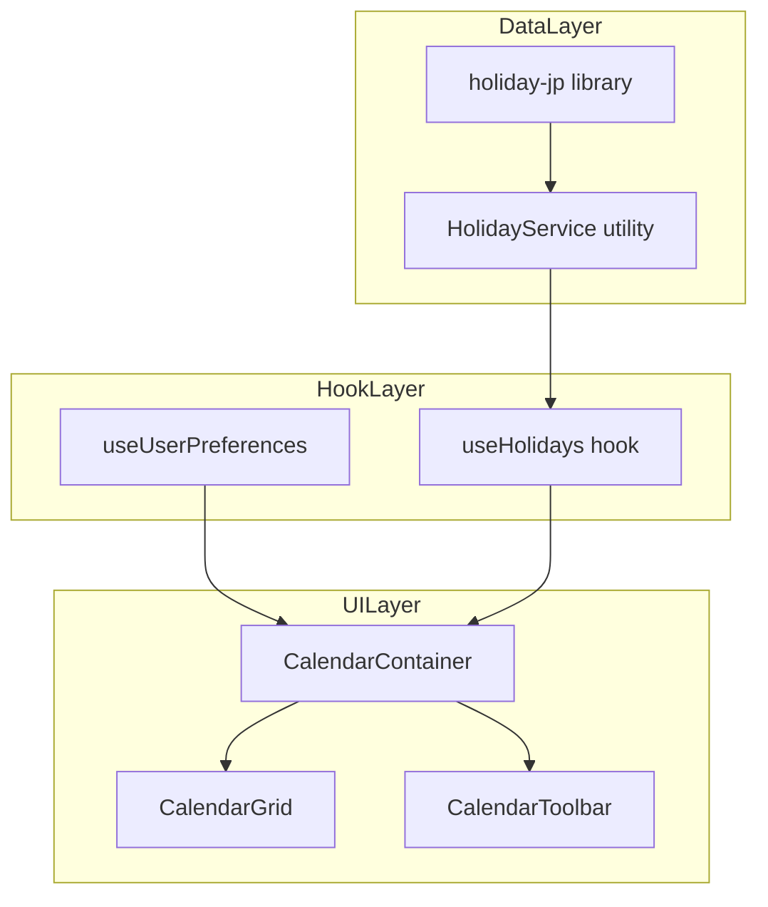
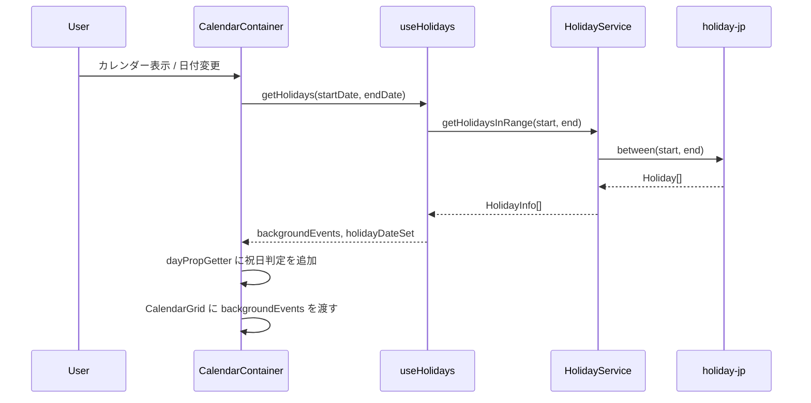

# Design Document: japanese-holidays

## Overview

**Purpose**: カレンダーの全ビュー（月・週・日）に日本の祝日を自動表示し、ユーザーがスケジュールと祝日を一目で確認できるようにする。

**Users**: Discalendarの全ユーザーが、カレンダー閲覧時に祝日情報を活用してスケジュール管理を行う。

**Impact**: 既存のカレンダーコンポーネント（CalendarGrid, CalendarContainer, CalendarToolbar）に祝日データレイヤーを追加。データベース変更なし。

### Goals
- npmライブラリによるオフライン祝日データ提供（外部API依存なし）
- 全ビューモード（月/週/日）での一貫した祝日表示
- ユーザーイベントとの視覚的区別（背景色・ラベルスタイル）
- 祝日表示ON/OFFの切り替えと設定永続化

### Non-Goals
- 日本以外の国の祝日対応（将来の拡張として位置付け）
- 祝日データのサーバーサイド保存・DB管理
- カスタム祝日・休日の追加機能
- Bot側での祝日通知

## Architecture

### Existing Architecture Analysis

既存カレンダーシステムの統合ポイント:
- **CalendarContainer**: 状態管理のオーケストレーター。`useCalendarState`, `useCalendarUrlSync`, `useUserPreferences` を統合
- **CalendarGrid**: react-big-calendar のラッパー。`dayPropGetter` でセルスタイル、`calendarComponents` でカスタムレンダラーを設定
- **CalendarToolbar**: ビュー切り替え・ナビゲーション。設定トグルの配置場所
- **useUserPreferences**: `useLocalStorage` 経由でユーザー設定を永続化

技術的制約:
- react-big-calendar v1.19.4 の API に準拠
- `components/ui/` (shadcn/ui) と `lib/` は Biome lint 除外
- Client Components（`"use client"`）でのみブラウザAPIを使用

### Architecture Pattern & Boundary Map



**Architecture Integration**:
- Selected pattern: 既存のレイヤード構成（Data → Hook → UI）に沿った拡張
- Domain boundaries: 祝日データロジックは `lib/calendar/` に集約、UI統合は既存コンポーネントの拡張
- Existing patterns preserved: `useUserPreferences` + `useLocalStorage` による設定永続化、`dayPropGetter` によるセルカスタマイズ
- New components rationale: `HolidayService` は祝日ライブラリの薄いラッパー、`useHolidays` は期間ベースのデータ取得フック
- Steering compliance: Co-locationパターン、`@/` パスエイリアス、Client Componentsの使い分けを維持

### Technology Stack

| Layer | Choice / Version | Role in Feature | Notes |
|-------|------------------|-----------------|-------|
| Frontend | react-big-calendar v1.19.4 | `backgroundEvents` + `dayPropGetter` で祝日表示 | 既存依存 |
| Data | @holiday-jp/holiday_jp v2.5.1 | 日本の祝日データ提供（オフライン） | 新規依存、MIT License |
| State | useLocalStorage (既存) | 祝日ON/OFF設定の永続化 | `useUserPreferences` を拡張 |

## System Flows



## Requirements Traceability

| Requirement | Summary | Components | Interfaces | Flows |
|-------------|---------|------------|------------|-------|
| 1.1 | 表示期間の祝日一覧取得 | HolidayService, useHolidays | HolidayService.getHolidaysInRange | 祝日データ取得フロー |
| 1.2 | 全16祝日の返却 | HolidayService | — | — |
| 1.3 | 振替休日の判定 | HolidayService (holiday-jp委譲) | — | — |
| 1.4 | 国民の休日の判定 | HolidayService (holiday-jp委譲) | — | — |
| 1.5 | 外部APIリクエスト不要 | HolidayService | — | — |
| 2.1 | 月表示での祝日ラベル | CalendarGrid (backgroundEvents) | CalendarGridProps.backgroundEvents | — |
| 2.2 | 月表示での祝日背景色 | CalendarGrid (dayPropGetter) | — | — |
| 2.3 | 祝日とイベントの共存表示 | CalendarGrid | — | — |
| 3.1 | 週表示での祝日表示 | CalendarGrid (backgroundEvents) | — | — |
| 3.2 | 日表示での祝日表示 | CalendarGrid (backgroundEvents) | — | — |
| 3.3 | 全ビューのスタイル一貫性 | CalendarGrid (CSS) | — | — |
| 4.1 | 祝日ラベルのスタイル区別 | CalendarGrid (backgroundEvents CSS) | — | — |
| 4.2 | 祝日セルの背景色 | CalendarGrid (dayPropGetter) | — | — |
| 4.3 | ダークモード対応 | CalendarGrid (CSS変数) | — | — |
| 5.1 | 祝日ON/OFFトグル | CalendarToolbar | CalendarToolbarProps.showHolidays | — |
| 5.2 | OFF時の祝日非表示 | CalendarContainer, CalendarGrid | — | — |
| 5.3 | ON時の祝日再表示 | CalendarContainer, CalendarGrid | — | — |
| 5.4 | 設定のlocalStorage永続化 | useUserPreferences | UseUserPreferencesReturn.showHolidays | — |

## Components and Interfaces

| Component | Domain/Layer | Intent | Req Coverage | Key Dependencies | Contracts |
|-----------|-------------|--------|--------------|------------------|-----------|
| HolidayService | lib/calendar | 祝日データ取得ユーティリティ | 1.1-1.5 | @holiday-jp/holiday_jp (P0) | Service |
| useHolidays | hooks/calendar | 期間ベースの祝日データ取得フック | 1.1, 2.1-2.3, 3.1-3.2 | HolidayService (P0) | State |
| CalendarGrid (拡張) | components/calendar | 祝日の背景色・ラベル表示 | 2.1-2.3, 3.1-3.3, 4.1-4.3 | useHolidays (P1) | — |
| CalendarToolbar (拡張) | components/calendar | 祝日ON/OFFトグルUI | 5.1 | — | — |
| CalendarContainer (拡張) | components/calendar | 祝日データと設定のオーケストレーション | 5.2-5.4 | useHolidays (P0), useUserPreferences (P0) | — |
| useUserPreferences (拡張) | hooks | 祝日表示設定の永続化 | 5.4 | useLocalStorage (P0) | State |

### Data Layer

#### HolidayService

| Field | Detail |
|-------|--------|
| Intent | @holiday-jp/holiday_jp をラップし、期間指定で祝日データを取得する |
| Requirements | 1.1, 1.2, 1.3, 1.4, 1.5 |

**Responsibilities & Constraints**
- 指定期間内の日本の祝日を取得して `HolidayInfo[]` 形式で返却
- 外部ネットワークリクエストを発行しない（npmライブラリのオフラインデータのみ使用）
- 特定日が祝日かどうかを判定するルックアップ機能を提供

**Dependencies**
- External: @holiday-jp/holiday_jp v2.5.1 — 日本の祝日データ (P0)

**Contracts**: Service [x]

##### Service Interface
```typescript
interface HolidayInfo {
  /** 祝日の日付 */
  date: Date;
  /** 祝日名（日本語） */
  name: string;
}

/**
 * 指定期間の祝日を取得する
 */
function getHolidaysInRange(start: Date, end: Date): HolidayInfo[];

/**
 * 指定日が祝日かどうかを判定する
 * 祝日の場合は祝日名を返し、祝日でない場合は null を返す
 */
function getHolidayName(date: Date): string | null;

/**
 * 祝日データを react-big-calendar の backgroundEvent 形式に変換する
 */
function toBackgroundEvents(holidays: HolidayInfo[]): BackgroundCalendarEvent[];
```

**Implementation Notes**
- `@holiday-jp/holiday_jp` の `between(start, end)` を直接呼び出す薄いラッパー
- ファイル配置: `lib/calendar/holiday-service.ts`
- `getHolidayName` は `dayPropGetter` 内でのルックアップに使用（Map ベースで O(1) アクセス）

### Hook Layer

#### useHolidays

| Field | Detail |
|-------|--------|
| Intent | 表示期間に基づいて祝日データを取得し、CalendarGrid に渡す形式に変換する |
| Requirements | 1.1, 2.1, 3.1, 3.2 |

**Responsibilities & Constraints**
- `viewMode` と `selectedDate` から表示期間を計算し、祝日データを取得
- backgroundEvents 形式と日付→祝日名の Map を提供
- `showHolidays` が false の場合は空データを返却

**Dependencies**
- Inbound: CalendarContainer — 表示期間と設定を受け取る (P0)
- Outbound: HolidayService — 祝日データ取得 (P0)

**Contracts**: State [x]

##### State Management
```typescript
interface UseHolidaysReturn {
  /** backgroundEvents 形式の祝日データ（CalendarGrid に渡す） */
  holidayEvents: BackgroundCalendarEvent[];
  /** 日付文字列 → 祝日名の Map（dayPropGetter でのルックアップ用） */
  holidayMap: Map<string, string>;
}

function useHolidays(
  viewMode: ViewMode,
  selectedDate: Date,
  showHolidays: boolean
): UseHolidaysReturn;
```

- Persistence: なし（派生データのため毎回計算）
- Concurrency: `useMemo` で viewMode/selectedDate/showHolidays の変更時のみ再計算

**Implementation Notes**
- ファイル配置: `hooks/calendar/use-holidays.ts`
- `getDateRange(viewMode, selectedDate)` を再利用して期間計算
- 月ビューの場合は前後の月表示分も含めた拡張期間で取得

#### useUserPreferences (拡張)

| Field | Detail |
|-------|--------|
| Intent | 祝日表示ON/OFF設定をlocalStorageに永続化する |
| Requirements | 5.4 |

**Responsibilities & Constraints**
- 既存の `defaultCalendarView` に加えて `showHolidays` を管理
- デフォルト値: `true`（祝日表示ON）

**Contracts**: State [x]

##### State Management
```typescript
// 既存インターフェースへの追加
interface UseUserPreferencesReturn {
  // ... 既存プロパティ
  /** 祝日表示ON/OFF */
  showHolidays: boolean;
  /** 祝日表示設定を更新 */
  setShowHolidays: (show: boolean) => void;
}
```

- Persistence: localStorage `discalendar:show-holidays`
- 不正値フォールバック: `true`

### UI Layer

#### CalendarGrid (拡張)

| Field | Detail |
|-------|--------|
| Intent | 祝日の背景色とラベルをカレンダーグリッドに表示する |
| Requirements | 2.1, 2.2, 2.3, 3.1, 3.2, 3.3, 4.1, 4.2, 4.3 |

**Responsibilities & Constraints**
- `backgroundEvents` prop で祝日を終日背景イベントとして表示
- `dayPropGetter` を拡張して祝日セルに背景色クラスを適用
- 祝日とユーザーイベントが同一セルで共存表示

**Dependencies**
- Inbound: CalendarContainer — backgroundEvents, holidayMap を受け取る (P0)

**Props 拡張**:
```typescript
// CalendarGridProps への追加
interface CalendarGridProps {
  // ... 既存 props
  /** 祝日の背景イベント（react-big-calendar backgroundEvents） */
  backgroundEvents?: BackgroundCalendarEvent[];
  /** 日付→祝日名のMap（dayPropGetter用） */
  holidayMap?: Map<string, string>;
}
```

**BackgroundCalendarEvent 型**:
```typescript
interface BackgroundCalendarEvent {
  /** 祝日の日付（開始） */
  start: Date;
  /** 祝日の日付（終了、終日のため開始と同日） */
  end: Date;
  /** 祝日名 */
  title: string;
  /** 終日フラグ（常に true） */
  allDay: true;
}
```

**Implementation Notes**
- `dayPropGetter` に `holidayMap` を参照する祝日判定を追加。既存の今日ハイライト・月外セル・土日色分けと共存
- 祝日セルクラス: `rbc-holiday` を追加（CSS で背景色を定義）
- backgroundEvents のスタイルは CSS クラス `.rbc-background-event` で制御
- ダークモード: CSS変数 `--holiday-bg`, `--holiday-text` を使用

#### CalendarToolbar (拡張)

| Field | Detail |
|-------|--------|
| Intent | 祝日表示ON/OFFのトグルUIを提供する |
| Requirements | 5.1 |

**Props 拡張**:
```typescript
// CalendarToolbarProps への追加
interface CalendarToolbarProps {
  // ... 既存 props
  /** 祝日表示ON/OFF状態 */
  showHolidays?: boolean;
  /** 祝日表示切り替えハンドラー */
  onToggleHolidays?: () => void;
}
```

**Implementation Notes**
- ビュー切り替えボタン群の近くにトグルボタンを配置
- shadcn/ui の `Button` (variant: ghost) + lucide-react アイコンを使用
- モバイルビューでもアクセス可能なレイアウト

#### CalendarContainer (拡張)

| Field | Detail |
|-------|--------|
| Intent | 祝日データと表示設定をオーケストレーションし、子コンポーネントに配布する |
| Requirements | 5.2, 5.3, 5.4 |

**Implementation Notes**
- `useUserPreferences` から `showHolidays`, `setShowHolidays` を取得
- `useHolidays(viewMode, selectedDate, showHolidays)` で祝日データを取得
- `holidayEvents` を `CalendarGrid` の `backgroundEvents` に渡す
- `holidayMap` を `CalendarGrid` の `holidayMap` に渡す
- `showHolidays` と `handleToggleHolidays` を `CalendarToolbar` に渡す

## Data Models

### Domain Model

**HolidayInfo** (Value Object):
- `date: Date` — 祝日の日付
- `name: string` — 祝日名（日本語、例: "元日", "成人の日", "振替休日"）

**BackgroundCalendarEvent** (Value Object):
- react-big-calendar の `backgroundEvents` に渡す変換済みデータ
- `start`, `end`, `title`, `allDay` フィールド

ビジネスルール:
- 祝日データはライブラリから取得し、アプリケーション内では読み取り専用
- 祝日はユーザーによる編集・削除の対象にならない

### Logical Data Model

祝日データはnpmライブラリ内に静的データとして保持される。データベーステーブルやサーバーサイドストレージの変更なし。

ユーザー設定:
- localStorage `discalendar:show-holidays`: `boolean` (JSON serialized)

## Error Handling

### Error Strategy
祝日データはオフラインのnpmライブラリから取得するため、ネットワークエラーは発生しない。

### Error Categories and Responses
- **ライブラリ未インストール/読み込みエラー**: ビルド時に検出。ランタイムでは発生しない
- **無効な日付範囲**: `between()` は空配列を返却。UIはグレースフルに祝日なしで表示
- **localStorage アクセスエラー**: 既存の `useLocalStorage` フックが fallback 値（`true`）を返却

## Testing Strategy

### Unit Tests
- `HolidayService.getHolidaysInRange`: 期間指定での祝日取得、振替休日・国民の休日の包含確認
- `HolidayService.getHolidayName`: 祝日/非祝日の判定
- `HolidayService.toBackgroundEvents`: HolidayInfo → BackgroundCalendarEvent 変換
- `useHolidays`: showHolidays false 時の空データ返却、期間変更時の再計算

### Integration Tests
- CalendarGrid に backgroundEvents を渡した場合の祝日ラベル表示
- CalendarToolbar の祝日トグルクリックで showHolidays が切り替わること
- CalendarContainer 経由での祝日表示→非表示→再表示のフロー

### E2E Tests (Playwright)
- 月表示でカレンダーを開き、祝日ラベルが表示されていることを確認
- 祝日トグルをクリックして非表示にし、再度クリックして表示されることを確認
- ページリロード後に祝日表示設定が維持されていることを確認
