# 技術設計書 - ランディングページモックアップ

## Overview

本機能は、Discalendarプロジェクトの価値提案を訪問者に伝え、ユーザー登録を促進するランディングページを提供します。Next.js App Router、shadcn/ui、Tailwind CSSを活用し、レスポンシブでアクセシブルなモックアップUIを構築します。

**Purpose**: Discordコミュニティ向け予定管理サービスの魅力を効果的に伝えるランディングページのUIコンポーネント構造を確立する。

**Users**: ランディングページ訪問者（潜在的ユーザー）がサービスの主要機能と価値提案を理解し、登録アクションに進むことを支援する。

**Impact**: 新規実装（既存の`app/page.tsx`を置き換え）により、プロダクトの顔となるランディングページの基盤を構築する。

### Goals

- レスポンシブで視覚的に魅力的なランディングページUIの実装
- Next.js App Routerのパフォーマンス最適化（Server Components、next/image）を最大限活用
- アクセシビリティ標準（セマンティックHTML、ARIA属性、キーボードナビゲーション）に準拠
- 保守性と再利用性の高いコンポーネント構成の確立
- プロジェクトのコード品質基準（TypeScript strict mode、Biome/Ultracite）への完全準拠

### Non-Goals

- 実際のデータベース統合やAPI実装（モックデータのみ使用）
- ユーザー認証機能の実装（ログイン・登録ボタンはプレースホルダー）
- バックエンドロジックやServer Actions
- 多言語対応（日本語のみ）
- アニメーション効果の高度な実装（基本的なホバー効果のみ）

## Architecture

### Existing Architecture Analysis

プロジェクトは既にNext.js App Routerの基盤を持ち、以下の技術スタックが確立されています：

- **Next.js (latest)** + React 19: App Routerによるファイルシステムベースルーティング
- **TypeScript (strict mode)**: 型安全性の強制
- **Tailwind CSS 3**: ユーティリティファーストスタイリング
- **shadcn/ui**: Radix UIプリミティブのラッパー（`components/ui/`に配置）
- **Biome (Ultracite preset)**: 高速リンティング・フォーマッティング

既存の`app/layout.tsx`はThemeProvider統合とGeistフォント設定を含み、本ランディングページはこのレイアウトを継承します。

### Architecture Pattern & Boundary Map

選定パターン: **コンポーネントベース・レイヤードアーキテクチャ（Presentation Layer分離）**


**Architecture Integration**:
- **Selected pattern**: コンポーネントベース・レイヤードアーキテクチャ - ページ、プレゼンテーション、UIプリミティブの3層分離
- **Domain/feature boundaries**: App Router層（ルーティング）とPresentation層（セクションコンポーネント）を明確に分離し、並行開発時のコンフリクトを回避
- **Existing patterns preserved**: steering/structure.mdで定義されたNext.js App Router規約、shadcn/uiコンポーネント配置（`components/ui/`）、パスエイリアス（`@/`）
- **New components rationale**:
  - セクション単位のコンポーネント分割により保守性向上
  - MobileNavのみClient Component化でクライアントサイドJavaScriptを最小化
  - 各セクションは独立してテスト・拡張可能
- **Steering compliance**: tech.md（TypeScript strict mode、Server Components優先）、structure.md（コンポーネント配置規約、命名規則）、CLAUDE.md（Ultraciteコード品質基準）に準拠

### Technology Stack

| Layer | Choice / Version | Role in Feature | Notes |
|-------|------------------|-----------------|-------|
| Frontend / UI Framework | Next.js (latest) + React 19 | App Routerによるページレンダリング、Server Components/Client Components管理 | SSG（Static Site Generation）でビルド時に静的HTML生成 |
| UI Components | shadcn/ui (Radix UI primitives) | Button、Cardなどアクセシブルなプリミティブ提供 | 既存の`components/ui/`を活用、新規コンポーネント追加なし |
| Styling | Tailwind CSS 3.4 + tailwindcss-animate 1.0 | レスポンシブスタイリング、ホバー/フォーカス状態管理 | ブレークポイント: md (768px)、lg (1024px) |
| Icons | lucide-react 0.511.0 | アイコン表示（Menu、X、Calendar等） | Tree-shakable、TypeScript完全サポート |
| Image Optimization | next/image (Next.js組み込み) | 画像最適化、blur placeholder、lazy loading | WebP/AVIF自動変換、CLSパフォーマンス向上 |
| Type Safety | TypeScript 5 (strict mode) | 型定義、インターフェース管理 | `any`使用禁止、明示的型定義必須 |
| Code Quality | Biome 2.3.8 + Ultracite 6.3.8 | リンティング、フォーマッティング | Rustベース高速処理、`components/ui/`除外設定済み |
| Theme Management | next-themes 0.4.6 | ダークモード対応（既存レイアウト統合） | 本機能ではライトモードをデフォルト想定 |

## System Flows

### モバイルナビゲーション - インタラクションフロー

```mermaid
sequenceDiagram
    participant U as ユーザー
    participant MN as MobileNav Component
    participant S as React State (isOpen)
    participant DOM as DOM

    U->>MN: ハンバーガーアイコンクリック
    MN->>S: setIsOpen(true)
    S->>MN: 状態更新 (isOpen = true)
    MN->>DOM: メニュー表示 (CSS class適用)
    DOM->>U: ナビゲーションリンク表示

    alt リンククリック
        U->>MN: ナビゲーションリンククリック
        MN->>S: setIsOpen(false)
        S->>MN: 状態更新 (isOpen = false)
        MN->>DOM: メニュー非表示
    else 閉じるボタンクリック
        U->>MN: Xアイコンクリック
        MN->>S: setIsOpen(false)
        S->>MN: 状態更新 (isOpen = false)
        MN->>DOM: メニュー非表示
    end
```



**Key Decisions**:
- React useState hookで開閉状態を管理（シンプルで予測可能）
- リンククリック時の自動閉じによりUXを向上
- Escape キー対応は将来の拡張として保留（現時点ではマウス/タッチ操作のみサポート）

### ページレンダリングフロー（SSG）


**Key Decisions**:
- ビルド時に完全な静的HTMLを生成（高速初期表示、SEO最適化）
- MobileNavコンポーネントのみクライアントサイドでハイドレーション
- Server Componentsはハイドレーション不要（バンドルサイズ削減）

## Requirements Traceability

| Requirement | Summary | Components | Interfaces | Flows |
|-------------|---------|------------|------------|-------|
| 1.1 | ページ構造とレイアウト | Page、Header、Hero、Features、CTA、Footer | - | Page Rendering |
| 1.2 | Next.js App Router実装 | Page (app/page.tsx) | - | - |
| 1.3 | レスポンシブデザイン | 全コンポーネント | - | - |
| 1.4, 1.5 | shadcn/ui + Tailwind CSS | Button、Card、全コンポーネント | - | - |
| 2.1, 2.2, 2.3 | ヘッダーナビゲーション基本構造 | Header | HeaderProps | - |
| 2.4, 2.5 | ヘッダーボタンとモバイルメニュー | Header、MobileNav | MobileNavProps | Mobile Navigation Flow |
| 2.6 | セマンティックHTML | Header | - | - |
| 3.1, 3.2, 3.3 | ヒーローセクション基本構造 | Hero | HeroProps | - |
| 3.4, 3.5 | CTAボタンとメインビジュアル | Hero | - | - |
| 3.6, 3.7 | レスポンシブレイアウト | Hero | - | - |
| 4.1, 4.2, 4.3 | 機能紹介セクション基本構造 | Features | FeaturesProps、FeatureItem | - |
| 4.4, 4.5, 4.6 | 機能カード実装 | Features | FeatureItem | - |
| 4.7, 4.8 | レスポンシブグリッド | Features | - | - |
| 5.1, 5.2, 5.3 | CTAセクション構造 | CTA | CTAProps | - |
| 5.4, 5.5 | CTA視覚強調とボタン | CTA | - | - |
| 6.1, 6.2, 6.3 | フッター基本構造 | Footer | FooterProps | - |
| 6.4, 6.5, 6.6 | フッターリンクとセマンティクス | Footer | - | - |
| 7.1, 7.2, 7.3 | アクセシビリティ - セマンティクス | 全コンポーネント | - | - |
| 7.4, 7.5, 7.6 | アクセシビリティ - インタラクション | MobileNav、Button | - | - |
| 8.1, 8.2, 8.3 | パフォーマンス最適化 | Hero (next/image)、全コンポーネント | - | Page Rendering |
| 8.4, 8.5 | Server/Client Components分離 | Page、MobileNav | - | - |
| 9.1, 9.2, 9.3 | コンポーネント構成 | 全コンポーネント | - | - |
| 9.4, 9.5, 9.6 | TypeScript型定義と命名規則 | 全コンポーネント | 全インターフェース | - |
| 10.1-10.6 | スタイリングとデザインシステム | 全コンポーネント | - | - |
| 11.1-11.5 | モックデータとプレースホルダー | Features (featuresData)、Hero | FeatureItem | - |
| 12.1-12.6 | コード品質とリンティング | 全コンポーネント | - | - |

## Components and Interfaces

### Component Summary

| Component | Domain/Layer | Intent | Req Coverage | Key Dependencies (P0/P1) | Contracts |
|-----------|--------------|--------|--------------|--------------------------|-----------|
| Page | App Router | ランディングページのメインエントリーポイント | 1.2 | Header(P0)、Hero(P0)、Features(P0)、CTA(P0)、Footer(P0) | - |
| Header | Presentation | ナビゲーションとブランディング表示 | 2.1-2.6 | MobileNav(P1)、Button(P0) | Service |
| MobileNav | Presentation (Client) | モバイル画面のハンバーガーメニュー | 2.5, 7.4-7.6 | Button(P0)、lucide-react(P0) | State |
| Hero | Presentation | 価値提案とメインビジュアル | 3.1-3.7 | Button(P0)、next/image(P0) | Service |
| Features | Presentation | 主要機能の紹介カード | 4.1-4.8, 11.3 | Card(P0)、lucide-react(P0) | Service |
| CTA | Presentation | 行動喚起セクション | 5.1-5.5 | Button(P0) | Service |
| Footer | Presentation | 補足情報とリンク | 6.1-6.6 | lucide-react(P1) | Service |

**Implementation Note**: Page、Header、Hero、Features、CTA、Footerは基本的なプレゼンテーション責務のみを持つため、詳細なインターフェース定義は省略し、主要なPropsとモックデータ構造のみを記載。MobileNavは状態管理とインタラクションを持つため、完全なインターフェースを定義。

### Presentation Layer

#### Page (app/page.tsx)

| Field | Detail |
|-------|--------|
| Intent | ランディングページの構造を定義し、すべてのセクションコンポーネントを統合 |
| Requirements | 1.1, 1.2 |

**Responsibilities & Constraints**
- メインレイアウトの構築（セマンティックHTML `<main>` 要素）
- セクションコンポーネントの順序制御
- Server Componentとして実装（静的生成対象）

**Dependencies**
- Outbound: Header - ページ上部のナビゲーション表示 (P0)
- Outbound: Hero - ヒーローセクション表示 (P0)
- Outbound: Features - 機能紹介セクション表示 (P0)
- Outbound: CTA - 行動喚起セクション表示 (P0)
- Outbound: Footer - フッター表示 (P0)

**Implementation Notes**
- Integration: app/page.tsxとして配置、既存のapp/layout.tsxを継承
- Validation: セマンティックHTMLの正しいネスト構造を確認
- Risks: なし（シンプルなコンポーネント統合のみ）

#### Header

| Field | Detail |
|-------|--------|
| Intent | ページ上部のナビゲーションバー、ロゴ、CTA ボタンを提供 |
| Requirements | 2.1, 2.2, 2.3, 2.4, 2.5, 2.6 |

**Responsibilities & Constraints**
- サービス名/ロゴの表示
- デスクトップナビゲーションリンクの表示（md:以上）
- ログイン/無料で始めるボタンの配置
- モバイルでハンバーガーメニューの表示切り替え

**Dependencies**
- Outbound: MobileNav - モバイルメニュー表示 (P1)
- Outbound: Button (shadcn/ui) - CTAボタン (P0)

**Contracts**: Service [x]

##### Service Interface

```typescript
interface HeaderProps {
  // 現時点ではpropsなし（静的コンテンツのみ）
}

// ナビゲーションリンクの型定義
interface NavLink {
  label: string;
  href: string;
}

// モックデータ
const navLinks: NavLink[] = [
  { label: '機能', href: '#features' },
  { label: '使い方', href: '#how-to-use' },
  { label: '料金', href: '#pricing' },
];
```

**Implementation Notes**
- Integration: components/header.tsxとして配置、Server Componentとして実装
- Validation: セマンティックHTML (`<header>`, `<nav>`) の使用確認、ARIA属性の適用
- Risks: モバイルメニューとの状態共有なし（MobileNavが独立して状態管理）

#### MobileNav

| Field | Detail |
|-------|--------|
| Intent | モバイル画面サイズでのハンバーガーメニュー表示と開閉制御 |
| Requirements | 2.5, 7.4, 7.5, 7.6 |

**Responsibilities & Constraints**
- メニュー開閉状態の管理（React useState）
- ハンバーガーアイコン（Menu）と閉じるアイコン（X）の切り替え
- ナビゲーションリンクのモーダル表示
- キーボードアクセシビリティの確保

**Dependencies**
- Outbound: Button (shadcn/ui) - ハンバーガーボタン (P0)
- External: lucide-react - Menu、Xアイコン (P0)

**Contracts**: Service [x] / State [x]

##### Service Interface

```typescript
interface MobileNavProps {
  links: NavLink[];
}

interface NavLink {
  label: string;
  href: string;
}
```

##### State Management

- **State model**:
  ```typescript
  const [isOpen, setIsOpen] = React.useState<boolean>(false);
  ```
- **Persistence & consistency**: ブラウザセッション内のみ（状態永続化なし）
- **Concurrency strategy**: 単一ユーザー操作のみ（競合なし）

**Implementation Notes**
- Integration: components/mobile-nav.tsxとして配置、"use client"ディレクティブ必須
- Validation:
  - ARIA属性: `aria-label="メニューを開く"`, `aria-expanded={isOpen}`
  - フォーカス管理: メニュー開閉時のフォーカス移動
  - md:以上で非表示（`hidden md:hidden`）
- Risks: ハイドレーションエラーの可能性 - Server/Client境界の明確な定義で緩和

#### Hero

| Field | Detail |
|-------|--------|
| Intent | サービスの主要価値提案とメインビジュアルを訴求 |
| Requirements | 3.1, 3.2, 3.3, 3.4, 3.5, 3.6, 3.7 |

**Responsibilities & Constraints**
- キャッチコピー（h1見出し）の表示
- サービス説明文（サブヘッディング）の表示
- CTAボタン（"無料で始める"）の配置
- メインビジュアル（カレンダーUIモックアップまたはプレースホルダー）の表示
- レスポンシブレイアウト（縦並び→横並び）

**Dependencies**
- Outbound: Button (shadcn/ui) - CTAボタン (P0)
- External: next/image - 画像最適化 (P0)

**Contracts**: Service [x]

##### Service Interface

```typescript
interface HeroProps {
  // 現時点ではpropsなし（静的コンテンツのみ）
}

// テキストコンテンツ
const heroContent = {
  headline: 'Discordコミュニティの予定を、もっと見やすく',
  subheading: 'カレンダー形式で一目で把握。Discordと連携して、予定管理をスマートに。',
  ctaText: '無料で始める',
  ctaHref: '#signup', // プレースホルダー
};
```

**Implementation Notes**
- Integration: components/hero.tsxとして配置、Server Componentとして実装
- Validation:
  - next/imageの適切な使用（width、height、alt属性）
  - priority属性でLCP最適化
  - blur placeholderの適用
- Risks: 画像なしの場合の代替表示 - SVGプレースホルダーまたはグラデーション背景で対応

#### Features

| Field | Detail |
|-------|--------|
| Intent | 主要機能3つをカード形式で視覚的に紹介 |
| Requirements | 4.1, 4.2, 4.3, 4.4, 4.5, 4.6, 4.7, 4.8, 11.3 |

**Responsibilities & Constraints**
- セクションタイトル（"主な機能"）の表示
- 機能カードのグリッドレイアウト（1列→2列→3列）
- 各カード: アイコン、機能名、説明文
- モックデータの配列処理

**Dependencies**
- Outbound: Card (shadcn/ui) - 機能カードプリミティブ (P0)
- External: lucide-react - 機能アイコン (P0)

**Contracts**: Service [x]

##### Service Interface

```typescript
interface FeaturesProps {
  // 現時点ではpropsなし（静的モックデータのみ）
}

interface FeatureItem {
  id: string;
  icon: React.ComponentType<{ className?: string }>; // lucide-react icon
  title: string;
  description: string;
}

// モックデータ
const featuresData: FeatureItem[] = [
  {
    id: 'calendar-ui',
    icon: Calendar,
    title: 'カレンダーUI',
    description: 'ビジュアルなカレンダー形式で予定を一目で把握できます。',
  },
  {
    id: 'discord-integration',
    icon: MessageSquare,
    title: 'Discord連携',
    description: 'Discordアカウントでログインし、コミュニティの予定と同期します。',
  },
  {
    id: 'schedule-management',
    icon: CheckSquare,
    title: '予定管理',
    description: '直感的に予定を追加・編集・削除できます。',
  },
];
```

**Implementation Notes**
- Integration: components/features.tsxとして配置、Server Componentとして実装
- Validation:
  - グリッドレスポンシブ: `grid-cols-1 md:grid-cols-2 lg:grid-cols-3`
  - Cardコンポーネントの適切なprops使用
  - lucide-reactアイコンのサイズ統一（`className="h-12 w-12"`等）
- Risks: アイコンの視覚的一貫性 - サイズとストローク幅の統一で緩和

#### CTA

| Field | Detail |
|-------|--------|
| Intent | ページ中盤で明確な行動喚起を提示 |
| Requirements | 5.1, 5.2, 5.3, 5.4, 5.5 |

**Responsibilities & Constraints**
- 行動喚起メッセージの表示（"今すぐ始めよう"等）
- CTAボタン（"無料で始める"）の配置
- 視覚的強調（背景色/グラデーション）

**Dependencies**
- Outbound: Button (shadcn/ui) - CTAボタン (P0)

**Contracts**: Service [x]

##### Service Interface

```typescript
interface CTAProps {
  // 現時点ではpropsなし（静的コンテンツのみ）
}

const ctaContent = {
  message: '今すぐ始めよう',
  subMessage: 'Discalendarで予定管理をもっと便利に。',
  ctaText: '無料で始める',
  ctaHref: '#signup', // プレースホルダー
};
```

**Implementation Notes**
- Integration: components/cta.tsxとして配置、Server Componentとして実装
- Validation:
  - 背景グラデーション: `bg-gradient-to-r from-blue-500 to-purple-600`等
  - コントラスト比の確保（アクセシビリティ）
- Risks: 過度な視覚的強調によるユーザー疲労 - 適度なトーンで実装

#### Footer

| Field | Detail |
|-------|--------|
| Intent | 補足情報、ナビゲーションリンク、ソーシャルリンクを提供 |
| Requirements | 6.1, 6.2, 6.3, 6.4, 6.5, 6.6 |

**Responsibilities & Constraints**
- サービス名/簡潔な説明の表示
- 補足ナビゲーションリンク（利用規約、プライバシーポリシー、お問い合わせ）
- ソーシャルメディアリンク（アイコン）
- 著作権表記

**Dependencies**
- External: lucide-react - ソーシャルアイコン (P1)

**Contracts**: Service [x]

##### Service Interface

```typescript
interface FooterProps {
  // 現時点ではpropsなし（静的コンテンツのみ）
}

interface FooterLink {
  label: string;
  href: string;
}

interface SocialLink {
  platform: string;
  icon: React.ComponentType<{ className?: string }>;
  href: string;
}

const footerLinks: FooterLink[] = [
  { label: '利用規約', href: '#terms' },
  { label: 'プライバシーポリシー', href: '#privacy' },
  { label: 'お問い合わせ', href: '#contact' },
];

const socialLinks: SocialLink[] = [
  { platform: 'Twitter', icon: Twitter, href: '#' },
  { platform: 'GitHub', icon: Github, href: '#' },
];
```

**Implementation Notes**
- Integration: components/footer.tsxとして配置、Server Componentとして実装
- Validation:
  - セマンティックHTML (`<footer>`)
  - リンクのaria-label（スクリーンリーダー対応）
- Risks: リンク先が未定義 - プレースホルダー（`#`）として明記し、将来の実装で対応

## Data Models

### Domain Model

本機能はプレゼンテーション層のみのモックアップであり、永続化されるドメインモデルは存在しません。以下のデータ構造はクライアント側の表示用型定義です。

**Value Objects**（コンポーネント内定数）:
- `NavLink`: ナビゲーションリンク（label、href）
- `FeatureItem`: 機能カードデータ（id、icon、title、description）
- `FooterLink`: フッターリンク（label、href）
- `SocialLink`: ソーシャルメディアリンク（platform、icon、href）

**Business Rules**:
- モックデータは変更不可（const定義）
- アイコンコンポーネントはlucide-reactのReactコンポーネント型に限定
- すべてのhrefはプレースホルダー（`#`または`#section-id`）

### Logical Data Model

本機能にはデータベースやAPIとの統合がないため、論理データモデルは不要です。将来的にCMSやAPIからコンテンツを取得する際は、以下のインターフェースを拡張します：

```typescript
// 将来のAPI統合用インターフェース（参考）
interface LandingPageContent {
  hero: {
    headline: string;
    subheading: string;
    ctaText: string;
    ctaHref: string;
    imageUrl: string;
  };
  features: FeatureItem[];
  cta: {
    message: string;
    subMessage: string;
    ctaText: string;
    ctaHref: string;
  };
  footer: {
    description: string;
    links: FooterLink[];
    socialLinks: SocialLink[];
    copyright: string;
  };
}
```

## Error Handling

### Error Strategy

本機能は静的モックアップであり、ランタイムエラーの発生は想定されません。以下のエラーシナリオに対応します：

**Image Loading Errors** (next/image):
- next/imageコンポーネントの組み込みエラーハンドリングに依存
- 画像読み込み失敗時はブラウザデフォルトの代替テキスト（alt属性）を表示

**Client Component Hydration Errors** (MobileNav):
- Server/Client境界の明確な定義（"use client"ディレクティブ）
- useStateの初期値をfalseに固定してSSRとの一貫性を保つ

**TypeScript Type Errors**:
- ビルド時にTypeScript strict modeで検出
- 開発中にBiome/Ultraciteで継続的チェック

### Monitoring

本機能はフロントエンドのみのため、専用のエラー監視は実装しません。将来的にSentryやDatadog RUMを導入する際の考慮事項：
- MobileNavの状態変更イベント（開閉ログ）
- next/imageの読み込みパフォーマンス（LCP、CLS）
- ユーザーのCTAボタンクリックトラッキング

## Testing Strategy

### Unit Tests

- **featuresDataモックデータ**: 3つの機能アイテムが正しく定義されているか検証
- **MobileNav状態管理**: isOpen stateのトグル動作が正しいか検証
- **型定義**: NavLink、FeatureItem、FooterLink等のインターフェースが正しく適用されているか（TypeScriptコンパイルで保証）

### Integration Tests

- **Header + MobileNav統合**: ハンバーガーボタンクリックでMobileNavが表示されるか検証
- **Features + Card統合**: featuresDataが正しくCardコンポーネントにマッピングされるか検証
- **next/imageレンダリング**: 画像コンポーネントが正しいpropsでレンダリングされるか検証

### E2E/UI Tests (Playwright)

- **レスポンシブレイアウト**: モバイル（375px）、タブレット（768px）、デスクトップ（1280px）で正しくレイアウトが変化するか検証
- **モバイルナビゲーション**: ハンバーガーメニューの開閉、リンククリックでメニューが閉じるか検証
- **CTAボタンアクセシビリティ**: キーボード（Tab、Enter）でボタンにアクセス可能か検証
- **ビジュアルリグレッション**: スナップショットテストでデザインの意図しない変更を検出
- **セマンティックHTML検証**: `<header>`、`<main>`、`<footer>`等の要素が正しく配置されているか検証

### Performance/Load

- **Lighthouse Core Web Vitals**: LCP < 2.5s、FID < 100ms、CLS < 0.1の達成を検証
- **next/image最適化**: WebP/AVIF形式への自動変換を確認
- **バンドルサイズ**: クライアントサイドJavaScriptが50KB以下（MobileNavのみ）を確認
- **SSG出力**: 静的HTML生成が正しく行われ、CDN配信可能な状態か検証

## Optional Sections

### Security Considerations

本機能は静的コンテンツの表示のみであり、ユーザー入力やデータ送信を含みません。以下のセキュリティベストプラクティスを適用：

- **XSS対策**: Reactの自動エスケープに依存（dangerouslySetInnerHTMLは使用しない）
- **外部リンク**: 将来的に実装する外部リンクには`rel="noopener noreferrer"`を適用
- **CSP (Content Security Policy)**: Next.jsのデフォルトセキュリティヘッダーに依存
- **依存関係の脆弱性**: npm auditとDependabotによる自動チェック（プロジェクト標準）

### Performance & Scalability

**Target Metrics**:
- **初期ロード時間**: < 1.5秒（3G接続）
- **Time to Interactive (TTI)**: < 3秒
- **Lighthouse Performance Score**: > 90
- **バンドルサイズ**: クライアントサイドJS < 50KB（gzip圧縮後）

**Optimization Techniques**:
- **SSG (Static Site Generation)**: ビルド時に完全な静的HTMLを生成
- **Server Components**: ページとセクションコンポーネントをサーバーサイドで処理
- **next/image**: 自動画像最適化（WebP/AVIF、レスポンシブsrcset、lazy loading）
- **Tree-shaking**: lucide-reactアイコンの個別インポートでバンドルサイズ削減
- **Code Splitting**: MobileNavのみクライアントコンポーネント化で最小限のJavaScript

**Scalability Considerations**:
- 静的生成のため、CDN配信で無限スケール可能
- 将来的にISR（Incremental Static Regeneration）導入時も現在の構造を維持可能
- コンポーネント分離により、並行開発とデプロイが容易

### Migration Strategy

本機能は新規実装のため、マイグレーションは発生しません。ただし、既存の`app/page.tsx`を置き換えるため、以下の手順を推奨：

**Phase 1: コンポーネント開発**
1. `/components/`配下にHeader、Hero、Features、CTA、Footer、MobileNavを実装
2. 各コンポーネントの単体テストを作成
3. Storybookまたは独立ページで視覚的確認（オプション）

**Phase 2: 統合とテスト**
1. 新しい`app/page.tsx`を作成し、すべてのセクションコンポーネントを統合
2. PlaywrightによるE2Eテスト実行
3. Lighthouseによるパフォーマンス検証

**Phase 3: デプロイ**
1. 既存の`app/page.tsx`をバックアップ（Git履歴で保持）
2. 新しいランディングページをデプロイ
3. Vercel Previewでプロダクション環境を事前確認

**Rollback Triggers**:
- Lighthouse Performance Score < 80
- E2Eテスト失敗
- アクセシビリティ検証（axeまたはLighthouse Accessibility）スコア < 90

**Validation Checkpoints**:
- ビルドエラーなし（`npm run build`成功）
- TypeScriptコンパイルエラーなし
- Biomeリンティングエラーなし（`npx ultracite check`）
- すべてのE2Eテスト成功
