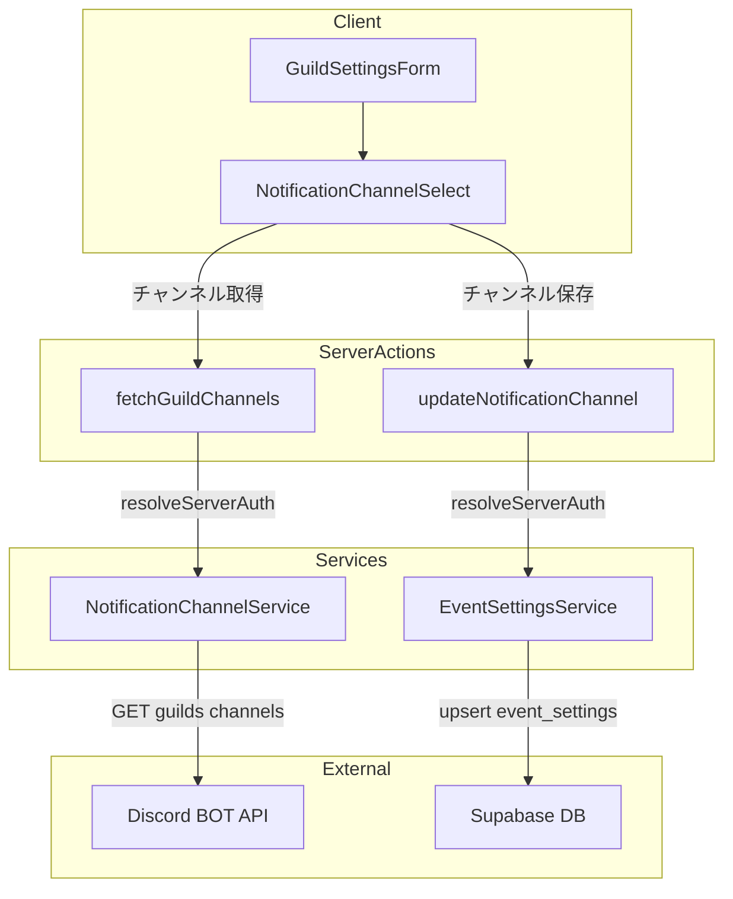
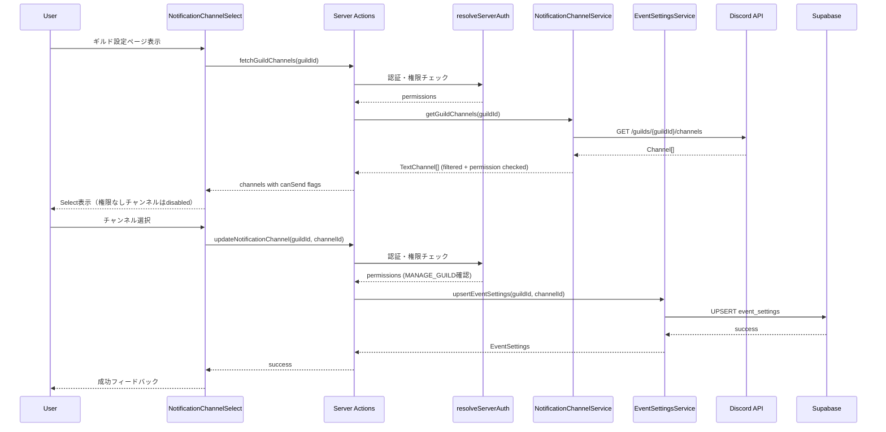

# Design Document: notification-channel-settings

## Overview

**Purpose**: ギルド管理者がWeb UIからイベント通知の送信先Discordテキストチャンネルを選択・保存できる機能を提供する。
**Users**: ギルド管理者（MANAGE_GUILD権限保持者）がギルド設定ページの「通知」セクションで使用する。
**Impact**: 既存のギルド設定ページ（`/dashboard/guilds/[guildId]/settings`）に通知チャンネル設定セクションを追加し、`event_settings` テーブルへの書き込みを可能にする。

### Goals

- ギルド設定ページから通知先チャンネルを選択・保存できるUIを提供する
- BOTが投稿権限を持たないチャンネルを視覚的に識別可能にする
- 既存の `guild-config-service` パターンに沿ったサービス層を構築する

### Non-Goals

- Discord BOT側の通知送信ロジック（既存の `append_notification()` で対応済み）
- 通知タイミングや頻度の設定（`event-notifications` specで対応済み）
- BOTメンバー情報を使った完全な権限計算アルゴリズム（初期実装ではoverwriteのdenyチェックで簡易判定）
- チャンネル一覧のキャッシュ戦略

## Architecture

### Existing Architecture Analysis

現在のギルド設定ページは以下のパターンで実装されている:

- **Server Component** (`page.tsx`): 認証・権限チェック + データ取得 → Client Componentにprops渡し
- **Client Component** (`GuildSettingsForm`/`GuildSettingsPanel`): `useTransition` + Server Actionで非同期更新
- **Service Layer** (`GuildConfigService`): ファクトリ関数パターンでSupabase CRUDをラップ
- **Server Action** (`updateGuildConfig`): `resolveServerAuth()` で認証・権限を検証後にサービス層を呼び出し
- **RLS**: SELECTのみ許可（INSERT/UPDATE/DELETEはServer Action層で制御）

本機能はこのパターンを踏襲し、通知チャンネル設定に特化した新コンポーネント群を追加する。

### Architecture Pattern & Boundary Map



**Architecture Integration**:
- **Selected pattern**: 既存の Service + Server Action パターンを踏襲
- **Domain boundaries**: Discord API呼び出し（NotificationChannelService）とDB操作（EventSettingsService）を分離
- **Existing patterns preserved**: `resolveServerAuth()` による認証・権限チェック、Result型パターン、ファクトリ関数パターン
- **New components rationale**: BOTトークン認証のDiscord API呼び出しは既存の `getUserGuilds()`（OAuthトークン認証）と認証方式が異なるため、別サービスとして分離

### Technology Stack

| Layer | Choice / Version | Role in Feature | Notes |
|-------|------------------|-----------------|-------|
| Frontend | React 19 + shadcn/ui Select | チャンネル選択UI | 既存のSelectコンポーネントを使用 |
| Backend | Next.js Server Actions | API呼び出し・DB操作の中継 | 既存パターン踏襲 |
| Data | Supabase (PostgreSQL) | `event_settings` テーブルへのupsert | RLSポリシー追加が必要 |
| External API | Discord API v10 | `GET /guilds/{guild.id}/channels` | BOTトークン認証 |

## System Flows

### チャンネル取得・選択・保存フロー



**Key Decisions**:
- チャンネル取得はServer Action経由でBOTトークンを使用（クライアントに露出しない）
- 権限チェックは `resolveServerAuth()` で一元管理
- チャンネル選択時のみDB書き込みが発生（自動保存、別途「保存」ボタンは不要）

## Requirements Traceability

| Requirement | Summary | Components | Interfaces | Flows |
|-------------|---------|------------|------------|-------|
| 1.1 | BOT APIでチャンネル一覧取得 | NotificationChannelService | `getGuildChannels()` | チャンネル取得フロー |
| 1.2 | テキストチャンネルのみフィルタ | NotificationChannelService | `getGuildChannels()` 内部処理 | - |
| 1.3 | ID・名前・カテゴリ情報を含む | DiscordTextChannel型 | `DiscordTextChannel` | - |
| 1.4 | BOTトークンで呼び出し | NotificationChannelService | 環境変数 `DISCORD_BOT_TOKEN` | チャンネル取得フロー |
| 1.5 | APIエラー時Result型返却 | NotificationChannelService | `DiscordApiResult<T>` | - |
| 1.6 | レート制限ハンドリング | NotificationChannelService | `retryAfter` フィールド | - |
| 2.1 | Selectコンポーネント表示 | NotificationChannelSelect | `NotificationChannelSelectProps` | - |
| 2.2 | チャンネル一覧をドロップダウン表示 | NotificationChannelSelect | `DiscordTextChannel[]` | - |
| 2.3 | ローディングインジケーター | NotificationChannelSelect | 内部state | - |
| 2.4 | プレースホルダー表示 | NotificationChannelSelect | 内部state | - |
| 2.5 | 既存設定の初期値表示 | NotificationChannelSelect | `currentChannelId` prop | - |
| 2.6 | 保存中ローディング状態 | NotificationChannelSelect | `useTransition` | チャンネル保存フロー |
| 2.7 | エラー表示・リトライ | NotificationChannelSelect | 内部state + retry | - |
| 3.1 | upsert処理 | EventSettingsService | `upsertEventSettings()` | チャンネル保存フロー |
| 3.2 | Snowflake形式バリデーション | Server Action | 入力検証 | - |
| 3.3 | 成功フィードバック | NotificationChannelSelect | 内部state | - |
| 3.4 | エラー時ロールバック | NotificationChannelSelect | 内部state | - |
| 3.5 | upsert動作 | EventSettingsService | Supabase `.upsert()` | - |
| 4.1 | SEND_MESSAGES権限確認 | NotificationChannelService | `canBotSendMessages` フィールド | - |
| 4.2 | 権限なしチャンネルdisabled | NotificationChannelSelect | `canBotSendMessages` prop | - |
| 4.3 | 権限不足インジケーター | NotificationChannelSelect | UI表示 | - |
| 5.1 | MANAGE_GUILD権限チェック | Server Action | `resolveServerAuth()` | - |
| 5.2 | PERMISSION_DENIEDエラー | Server Action | Result型 | - |
| 5.3 | サーバー側認証解決 | Server Action | `resolveServerAuth()` | - |
| 5.4 | RLS読み取りポリシー | RLSマイグレーション | 既存ポリシー維持 | - |
| 6.1 | 現在のchannel_id取得 | EventSettingsService | `getEventSettings()` | チャンネル取得フロー |
| 6.2 | 未設定時null返却 | EventSettingsService | `getEventSettings()` | - |
| 6.3 | 初期表示の決定 | NotificationChannelSelect | `currentChannelId` prop | - |

## Components and Interfaces

| Component | Domain/Layer | Intent | Req Coverage | Key Dependencies | Contracts |
|-----------|-------------|--------|--------------|------------------|-----------|
| NotificationChannelService | lib/discord | BOT APIでチャンネル一覧取得・権限チェック | 1.1-1.6, 4.1 | Discord API (P0) | Service |
| EventSettingsService | lib/guilds | event_settings CRUDサービス | 3.1-3.5, 6.1-6.2 | Supabase (P0) | Service |
| fetchGuildChannels | app/dashboard/actions | チャンネル取得Server Action | 1.1, 5.1-5.3 | NotificationChannelService (P0), resolveServerAuth (P0) | API |
| updateNotificationChannel | app/dashboard/actions | チャンネル保存Server Action | 3.1-3.2, 5.1-5.3 | EventSettingsService (P0), resolveServerAuth (P0) | API |
| NotificationChannelSelect | components/guilds | チャンネル選択UIコンポーネント | 2.1-2.7, 3.3-3.4, 4.2-4.3, 6.3 | Server Actions (P0), shadcn/ui Select (P1) | State |
| RLS Migration | supabase/migrations | event_settings書き込みポリシー | 5.4 | - | - |

### Discord API Integration Layer

#### NotificationChannelService

| Field | Detail |
|-------|--------|
| Intent | Discord BOT APIを使用してギルドのテキストチャンネル一覧を取得し、BOTの投稿権限を確認する |
| Requirements | 1.1, 1.2, 1.3, 1.4, 1.5, 1.6, 4.1 |

**Responsibilities & Constraints**
- Discord API v10 `GET /guilds/{guild.id}/channels` の呼び出し
- テキストチャンネル（type=0）のフィルタリング
- BOTの `SEND_MESSAGES` 権限の簡易チェック（permission_overwrites のdeny確認）
- BOTトークンはサーバーサイドでのみ使用

**Dependencies**
- External: Discord API v10 — チャンネル一覧取得 (P0)
- External: 環境変数 `DISCORD_BOT_TOKEN` — 認証 (P0)

**Contracts**: Service [x]

##### Service Interface

```typescript
/** Discord テキストチャンネル情報 */
interface DiscordTextChannel {
  /** チャンネルID (snowflake) */
  id: string;
  /** チャンネル名 */
  name: string;
  /** 親カテゴリID (nullable) */
  parentId: string | null;
  /** 親カテゴリ名 (nullable) */
  categoryName: string | null;
  /** 表示順序 */
  position: number;
  /** BOTがメッセージ送信可能か */
  canBotSendMessages: boolean;
}

/** チャンネル一覧取得結果 */
type GuildChannelsResult = DiscordApiResult<DiscordTextChannel[]>;

/** NotificationChannelService の公開関数 */
function getGuildChannels(guildId: string): Promise<GuildChannelsResult>;
```

- Preconditions: `DISCORD_BOT_TOKEN` 環境変数が設定されている
- Postconditions: テキストチャンネルのみフィルタされ、`canBotSendMessages` フラグが設定された配列を返す
- Invariants: BOTトークンがクライアントに露出しない

**Implementation Notes**
- 認証ヘッダー: `Authorization: Bot ${process.env.DISCORD_BOT_TOKEN}`（OAuth2の `Bearer` とは異なる）
- エラーハンドリング: 既存の `getUserGuilds()` と同一パターン（401, 429, network_error）
- 権限チェック: `permission_overwrites` 配列から @everyone ロール（id=guild_id）とBOTユーザーIDの deny ビットを確認。`SEND_MESSAGES` (1<<11) または `VIEW_CHANNEL` (1<<10) がdenyされている場合 `canBotSendMessages: false`
- BOTユーザーIDは環境変数 `DISCORD_BOT_USER_ID` から取得（または `DISCORD_CLIENT_ID` を流用）
- カテゴリ名解決: レスポンスに含まれる type=4 チャンネルの name を parent_id で紐付け

### Data Access Layer

#### EventSettingsService

| Field | Detail |
|-------|--------|
| Intent | `event_settings` テーブルのCRUD操作をResult型パターンでラップする |
| Requirements | 3.1, 3.2, 3.5, 6.1, 6.2 |

**Responsibilities & Constraints**
- `event_settings` テーブルへの読み取り・書き込み
- `guild_id` と `channel_id` の組み合わせでupsert
- `channel_id` のSnowflake形式バリデーション
- `GuildConfigService` と同一のファクトリ関数パターン

**Dependencies**
- Inbound: Server Actions — upsert/get操作の呼び出し元 (P0)
- External: Supabase Client — DBアクセス (P0)

**Contracts**: Service [x]

##### Service Interface

```typescript
/** イベント設定のアプリケーション型（camelCase） */
interface EventSettings {
  guildId: string;
  channelId: string;
}

/** イベント設定のDB Row型（snake_case） */
interface EventSettingsRow {
  guild_id: string;
  channel_id: string;
}

/** エラー型 */
interface EventSettingsError {
  code: string;
  message: string;
  details?: string;
}

/** Result型 */
type EventSettingsMutationResult<T> =
  | { success: true; data: T }
  | { success: false; error: EventSettingsError };

/** サービスインターフェース */
interface EventSettingsServiceInterface {
  getEventSettings(
    guildId: string
  ): Promise<EventSettingsMutationResult<EventSettings | null>>;

  upsertEventSettings(
    guildId: string,
    channelId: string
  ): Promise<EventSettingsMutationResult<EventSettings>>;
}

/** ファクトリ関数 */
function createEventSettingsService(
  supabase: SupabaseClient
): EventSettingsServiceInterface;
```

- Preconditions: `channelId` はSnowflake形式（`/^\d{17,20}$/`）
- Postconditions: upsert成功時、該当 `guild_id` のレコードが更新または作成されている
- Invariants: `guild_id` はUNIQUE制約により1ギルド1レコード

**Implementation Notes**
- `getEventSettings`: PGRST116（not found）時は `{ success: true, data: null }` を返す（`GuildConfigService` のデフォルト値パターンとは異なり、未設定を明示的に表現）
- `upsertEventSettings`: Supabase `.upsert()` + `.select().single()` パターン
- 変換関数 `toEventSettings(row: EventSettingsRow): EventSettings` を定義
- エラーコード: `FETCH_FAILED`, `UPDATE_FAILED`

### Server Action Layer

#### fetchGuildChannels Server Action

| Field | Detail |
|-------|--------|
| Intent | 認証・権限チェック後にDiscord BOT APIからチャンネル一覧を取得する |
| Requirements | 1.1, 5.1, 5.2, 5.3 |

**Contracts**: API [x]

```typescript
"use server"

async function fetchGuildChannels(
  guildId: string
): Promise<
  | { success: true; data: DiscordTextChannel[] }
  | { success: false; error: { code: string; message: string } }
>;
```

**Implementation Notes**
- `resolveServerAuth(guildId)` で認証チェック（既存パターン）
- `canManageGuild()` 権限チェックは不要（チャンネル一覧の閲覧は管理者以外にも許可可能）。ただし認証は必須
- `guildId` のフォーマットバリデーション: `/^[\w-]{1,30}$/`

#### updateNotificationChannel Server Action

| Field | Detail |
|-------|--------|
| Intent | 認証・権限チェック後に通知チャンネル設定を保存する |
| Requirements | 3.1, 3.2, 5.1, 5.2, 5.3 |

**Contracts**: API [x]

```typescript
"use server"

interface UpdateNotificationChannelInput {
  guildId: string;
  channelId: string;
}

async function updateNotificationChannel(
  input: UpdateNotificationChannelInput
): Promise<EventSettingsMutationResult<EventSettings>>;
```

**Implementation Notes**
- `resolveServerAuth(guildId)` で認証チェック
- `canManageGuild(permissions)` で権限チェック（書き込み操作のため必須）
- `channelId` のSnowflake形式バリデーション: `/^\d{17,20}$/`
- `revalidatePath` は不要（ギルド設定ページ内の状態更新はクライアント側で管理）

### UI Layer

#### NotificationChannelSelect

| Field | Detail |
|-------|--------|
| Intent | 通知チャンネルの選択・保存UIを提供する |
| Requirements | 2.1-2.7, 3.3, 3.4, 4.2, 4.3, 6.3 |

**Responsibilities & Constraints**
- shadcn/ui Selectコンポーネントを使用したチャンネル選択UI
- チャンネル一覧の非同期取得とローディング状態管理
- 保存処理の非同期実行とエラーハンドリング
- 権限なしチャンネルのdisabled表示

**Dependencies**
- Inbound: GuildSettingsForm — 表示位置の提供 (P0)
- Outbound: fetchGuildChannels Server Action — チャンネル一覧取得 (P0)
- Outbound: updateNotificationChannel Server Action — チャンネル保存 (P0)
- External: shadcn/ui Select — UIプリミティブ (P1)

**Contracts**: State [x]

##### State Management

```typescript
interface NotificationChannelSelectProps {
  /** ギルドID */
  guildId: string;
  /** 現在設定されているチャンネルID（未設定時はnull） */
  currentChannelId: string | null;
}

/** 内部State */
interface InternalState {
  channels: DiscordTextChannel[];
  selectedChannelId: string | null;
  isLoadingChannels: boolean;
  isSaving: boolean;
  error: string | null;
  fetchError: string | null;
}
```

- State model: `useState` + `useTransition` で管理。チャンネル一覧はコンポーネントマウント時に `useEffect` で取得
- Persistence: Server Action経由でDBに永続化
- Concurrency: `useTransition` の `isPending` でUI更新と保存を直列化

**Implementation Notes**
- チャンネル一覧取得: `useEffect` + `fetchGuildChannels` Server Action。`guildId` 変更時に再取得
- チャンネル選択時: 楽観的UI更新 → `updateNotificationChannel` 呼び出し → 失敗時ロールバック
- カテゴリ別グループ表示: `SelectGroup` + `SelectLabel` でカテゴリ名ごとにグループ化
- 権限なしチャンネル: `SelectItem` に `disabled` + ツールチップまたはサフィックステキスト「(BOT権限なし)」
- リトライボタン: `fetchError` 状態時にButtonコンポーネントを表示し、クリックで再取得

#### GuildSettingsForm 拡張

既存の `GuildSettingsForm` に通知設定セクションを追加する。

**Implementation Notes**
- 新しい `SettingsSection` ブロックを追加（title: "通知設定", description: "イベント通知の送信先チャンネルを設定します。"）
- `NotificationChannelSelect` コンポーネントを配置
- propsに `currentChannelId: string | null` を追加

## Data Models

### Domain Model

- **EventSettings**: ギルドと通知チャンネルの1:1関連。`guild_id` が集約ルート
- **DiscordTextChannel**: Discord APIから取得した一時的なデータ（DBには保存しない）
- **Invariants**: 1ギルドにつき1つの通知チャンネル設定のみ（UNIQUE制約）

### Physical Data Model

`event_settings` テーブルは既に存在。変更はRLSポリシーの追加のみ。

```sql
-- 既存テーブル（変更なし）
-- event_settings (
--   id SERIAL PRIMARY KEY,
--   guild_id VARCHAR(32) UNIQUE NOT NULL REFERENCES guilds(guild_id) ON DELETE CASCADE,
--   channel_id VARCHAR(32) NOT NULL,
--   CONSTRAINT check_channel_id_format CHECK (channel_id ~ '^\d{17,20}$')
-- )

-- 追加するRLSポリシー
CREATE POLICY "authenticated_users_can_insert_event_settings"
    ON event_settings
    FOR INSERT
    TO authenticated
    WITH CHECK (true);

CREATE POLICY "authenticated_users_can_update_event_settings"
    ON event_settings
    FOR UPDATE
    TO authenticated
    USING (true)
    WITH CHECK (true);
```

### Data Contracts

**Discord API レスポンス（チャンネルオブジェクト）**:

```typescript
/** Discord API Channel Object（必要フィールドのみ） */
interface DiscordApiChannel {
  id: string;
  name: string;
  type: number;
  parent_id: string | null;
  position: number;
  permission_overwrites: DiscordPermissionOverwrite[];
}

/** Discord Permission Overwrite Object */
interface DiscordPermissionOverwrite {
  id: string;
  type: number; // 0=role, 1=member
  allow: string; // permission bitfield
  deny: string;  // permission bitfield
}
```

## Error Handling

### Error Categories and Responses

**User Errors (4xx)**:
- `PERMISSION_DENIED`: MANAGE_GUILD権限なし → 「この操作にはサーバー管理権限が必要です」
- `INVALID_CHANNEL_ID`: Snowflake形式でない → 「無効なチャンネルIDです」
- `INVALID_GUILD_ID`: guildId形式不正 → 「無効なギルドIDです」

**System Errors (5xx)**:
- `FETCH_FAILED`: Discord API / Supabase呼び出し失敗 → 「データの取得に失敗しました。再度お試しください」
- `UPDATE_FAILED`: Supabase upsert失敗 → 「設定の保存に失敗しました。再度お試しください」
- `BOT_TOKEN_MISSING`: 環境変数未設定 → 「BOTの設定が不完全です。管理者に連絡してください」

**External API Errors**:
- `unauthorized` (401): BOTトークン無効 → 「BOTの認証に失敗しました」
- `rate_limited` (429): レート制限 → 「リクエスト制限に達しました。{retryAfter}秒後に再試行してください」
- `network_error`: ネットワーク障害 → 「サーバーに接続できませんでした」

### Error Recovery

- チャンネル一覧取得失敗: リトライボタンを表示
- 保存失敗: Selectを変更前の値にロールバック + エラーメッセージ表示
- BOTトークン未設定: 設定セクション全体をdisabled表示 + 管理者への連絡を促すメッセージ

## Testing Strategy

### Unit Tests

- `NotificationChannelService.getGuildChannels()`: テキストチャンネルフィルタリング、権限チェック、エラーハンドリング
- `EventSettingsService`: get/upsert の成功・失敗ケース、PGRST116ハンドリング、Snowflakeバリデーション
- `parsePermissions()` 拡張: `SEND_MESSAGES`, `VIEW_CHANNEL` フラグの解析
- 権限計算ロジック: `permission_overwrites` からの `canBotSendMessages` 判定

### Integration Tests

- Server Action `fetchGuildChannels`: 認証チェック → Discord API呼び出し → レスポンス変換
- Server Action `updateNotificationChannel`: 認証 → 権限チェック → upsert → 結果返却
- ギルド設定ページ: 通知セクションの表示・非表示制御

### Component Tests

- `NotificationChannelSelect`: マウント時のチャンネル取得、選択時の保存、ローディング状態、エラー表示、リトライ、disabled状態
- `GuildSettingsForm` 拡張: 通知設定セクションの表示

## Security Considerations

- **BOTトークン保護**: 環境変数でのみ管理。Server Action内でのみ使用し、クライアントバンドルに含めない
- **認証・認可**: `resolveServerAuth()` による毎リクエスト検証。クライアント提供の権限情報を信頼しない
- **入力バリデーション**: `guildId` と `channelId` のフォーマット検証をServer Action層で実施
- **RLS**: 認証済みユーザーのみ読み書き可能。管理者権限チェックはServer Action層で担当

## Migration Strategy

1. RLSポリシー追加マイグレーションを作成・適用（`YYYYMMDDHHMMSS_add_event_settings_write_policies.sql`）
2. 環境変数 `DISCORD_BOT_TOKEN` と `DISCORD_BOT_USER_ID` を `.env.local` に追加
3. サービス層 → Server Action → UIコンポーネントの順に実装
4. 既存の `GuildSettingsForm` への統合は最後に実施

ロールバック: マイグレーションは追加のみ（RLSポリシー追加）のため、ロールバックは `DROP POLICY` で対応可能。
