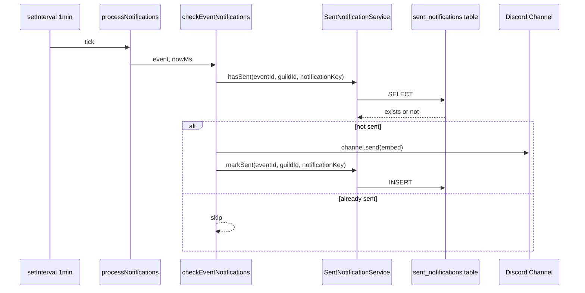
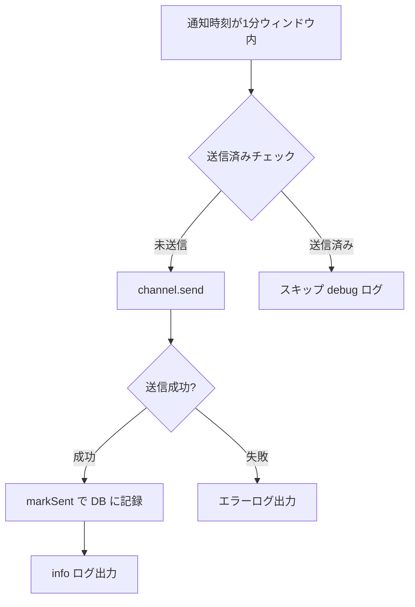

# Design Document: notification-dedup

## Overview

**Purpose**: Bot再起動やクラッシュ復旧時の通知重複送信を防止するため、送信済み通知の永続化とべき等性チェック機構を導入する。

**Users**: Discordサーバーのメンバー（通知受信者）およびBot運用者が対象。重複通知によるチャンネルノイズを解消し、通知の信頼性を向上させる。

**Impact**: 既存の`notify.ts`の`checkEventNotifications`関数に送信前チェックを追加し、新規`sent_notifications`テーブルとサービス層を導入する。

### Goals
- Bot再起動後も同一通知の重複送信を防止する
- 送信済み状態をSupabaseに永続化し、べき等性を保証する
- 古い送信済みレコードを自動クリーンアップし、DB肥大化を防ぐ
- 既存の通知ロジック（単発・繰り返し・センチネル）との互換性を維持する

### Non-Goals
- 通知配信の順序保証やリトライ機構
- 複数Botインスタンスの協調（現在は単一インスタンス前提）
- 通知設定UIの変更
- 通知送信失敗時の再送機構

## Architecture

### Existing Architecture Analysis

現在の通知フロー:
- `startNotifyTask` → 1分間隔で `processNotifications` を呼び出し
- `processNotifications` → 全ギルドのイベント・シリーズを取得し、各イベントに対して `checkEventNotifications` を実行
- `checkEventNotifications` → 通知時刻が現在の1分ウィンドウ内なら `channel.send()` で即座に送信

**既存の制約**:
- 送信済みの記録が存在せず、再起動時に同一ウィンドウの通知が再送される（notify.ts L271-275のコメントで認識済み）
- 繰り返しイベントは `series:{id}:occ:{ISO日時}` の擬似IDで識別される

### Architecture Pattern & Boundary Map



**Architecture Integration**:
- **Selected pattern**: 既存サービス層パターンを踏襲（`ServiceResult<T>` + `getSupabaseClient()`）
- **Domain boundary**: `sent-notification-service.ts`を新規作成し、送信済み管理のロジックをサービス層に分離
- **Existing patterns preserved**: `classifySupabaseError`によるエラー分類、pinoロガー
- **New components rationale**: 通知タスクと送信済み管理の責務を分離するため、専用サービスを追加
- **Steering compliance**: Bot既存のサービス層パターン（`packages/bot/src/services/`）に準拠

### Technology Stack

| Layer | Choice / Version | Role in Feature | Notes |
|-------|------------------|-----------------|-------|
| Backend / Services | TypeScript (ES2022) | 送信済みサービスの実装 | 既存Botランタイムと同一 |
| Data / Storage | Supabase (PostgreSQL) | sent_notificationsテーブル | service_role keyでアクセス（RLS不要） |
| Infrastructure / Runtime | Node.js | setInterval定期タスク | 既存と同一 |

## System Flows

### 通知送信フロー（重複防止付き）



**Key Decisions**:
- 送信前にDBチェック → 送信成功後にDBに記録。送信失敗時は記録しない（次回リトライ可能にするため）
- UNIQUE制約違反（23505）は「既に送信済み」として正常扱い

### クリーンアップフロー

`processNotifications`の末尾で、前回クリーンアップから1時間以上経過していれば7日以上前のレコードを削除する。クリーンアップ失敗は通知処理に影響しない。

## Requirements Traceability

| Requirement | Summary | Components | Interfaces | Flows |
|-------------|---------|------------|------------|-------|
| 1.1 | sent_notificationsテーブルへの記録 | SentNotificationService, sent_notifications | markSent | 通知送信フロー |
| 1.2 | 送信成功後にDB永続化 | SentNotificationService | markSent | 通知送信フロー |
| 1.3 | ユニーク制約 | sent_notifications | - | - |
| 1.4 | 繰り返しオカレンスの個別管理 | checkEventNotifications | hasSent, markSent | 通知送信フロー |
| 2.1 | 送信前の送信済み確認 | checkEventNotifications, SentNotificationService | hasSent | 通知送信フロー |
| 2.2 | 送信済み時のスキップ | checkEventNotifications | hasSent | 通知送信フロー |
| 2.3 | 再起動後の重複防止 | SentNotificationService, sent_notifications | hasSent | 通知送信フロー |
| 2.4 | 1分間隔ループでの防止 | checkEventNotifications | hasSent | 通知送信フロー |
| 3.1 | 7日以上前のレコード削除 | SentNotificationService | cleanup | クリーンアップフロー |
| 3.2 | 削除件数のログ記録 | SentNotificationService | cleanup | クリーンアップフロー |
| 3.3 | クリーンアップエラー時の継続 | processNotifications | cleanup | クリーンアップフロー |
| 4.1 | 単発イベント互換性 | checkEventNotifications | hasSent, markSent | 通知送信フロー |
| 4.2 | 繰り返しオカレンス互換性 | checkEventNotifications | hasSent, markSent | 通知送信フロー |
| 4.3 | 複数通知設定の独立管理 | checkEventNotifications | hasSent, markSent | 通知送信フロー |
| 4.4 | センチネル通知の重複防止 | checkEventNotifications | hasSent, markSent | 通知送信フロー |

## Components and Interfaces

| Component | Domain/Layer | Intent | Req Coverage | Key Dependencies | Contracts |
|-----------|-------------|--------|--------------|------------------|-----------|
| sent_notifications table | Data | 送信済み通知の永続化 | 1.1, 1.3 | Supabase (P0) | - |
| SentNotificationService | Service | 送信済みチェック・記録・クリーンアップ | 1.1-1.4, 2.1-2.4, 3.1-3.3 | Supabase (P0) | Service |
| checkEventNotifications (変更) | Task | 送信前ガードの追加 | 2.1-2.4, 4.1-4.4 | SentNotificationService (P0) | - |
| processNotifications (変更) | Task | クリーンアップ呼び出しの追加 | 3.1-3.3 | SentNotificationService (P1) | - |

### Service Layer

#### SentNotificationService

| Field | Detail |
|-------|--------|
| Intent | 送信済み通知のDB管理（チェック・記録・クリーンアップ） |
| Requirements | 1.1, 1.2, 1.3, 1.4, 2.1, 2.2, 2.3, 3.1, 3.2 |

**Responsibilities & Constraints**
- 送信済み通知レコードのCRD操作を担当（Update不要）
- Supabase service_role keyでアクセス（RLSバイパス）
- 通知タスクからのみ呼び出される

**Dependencies**
- Outbound: Supabase `sent_notifications`テーブル — データ永続化 (P0)
- External: `@supabase/supabase-js` — DBクライアント (P0)

**Contracts**: Service [x]

##### Service Interface

```typescript
type SentNotificationRecord = {
  id: number;
  event_id: string;
  guild_id: string;
  notification_key: string;
  sent_at: string;
};

/** 指定した通知が送信済みかどうかを確認する */
function hasSent(
  eventId: string,
  guildId: string,
  notificationKey: string
): Promise<ServiceResult<boolean>>;

/** 送信済みとして記録する。UNIQUE制約違反は成功として扱う */
function markSent(
  eventId: string,
  guildId: string,
  notificationKey: string
): Promise<ServiceResult<void>>;

/** 指定日数以上前の送信済みレコードを削除し、削除件数を返す */
function cleanupOldRecords(
  retentionDays: number
): Promise<ServiceResult<number>>;
```

- Preconditions: Supabaseクライアントが初期化済み
- Postconditions:
  - `markSent`: レコードが存在する（INSERT or 既存）
  - `cleanupOldRecords`: `retentionDays`日以上前のレコードが削除されている
- Invariants: 同一`(event_id, guild_id, notification_key)`のレコードは最大1件

**Implementation Notes**
- `markSent`は`INSERT ... ON CONFLICT DO NOTHING`相当のUPSERTを使用。DUPLICATE error（23505）は成功として処理
- `hasSent`はSELECTで1件取得を試み、存在チェックのみ行う
- `cleanupOldRecords`はDELETEの`.lt("sent_at", threshold)`で一括削除

### Task Layer (変更箇所)

#### checkEventNotifications (変更)

| Field | Detail |
|-------|--------|
| Intent | 送信前に送信済みチェックを追加し、重複送信を防止 |
| Requirements | 2.1, 2.2, 2.3, 2.4, 4.1, 4.2, 4.3, 4.4 |

**変更内容**:
- 各通知の`channel.send()`前に`hasSent(event.id, event.guild_id, notification.key)`を呼び出す
- 送信済みの場合はスキップ（debugログ出力）
- 送信成功後に`markSent(event.id, event.guild_id, notification.key)`を呼び出す
- `__start__`センチネル通知も同じフローで処理

#### processNotifications (変更)

| Field | Detail |
|-------|--------|
| Intent | 通知処理後にクリーンアップを定期実行 |
| Requirements | 3.1, 3.2, 3.3 |

**変更内容**:
- モジュールレベルで`lastCleanupMs`タイムスタンプを保持
- `processNotifications`の末尾で、前回から1時間以上経過していれば`cleanupOldRecords(7)`を呼び出す
- クリーンアップのエラーはログ出力のみ、通知処理には影響しない

## Data Models

### Physical Data Model

#### sent_notifications テーブル

```sql
CREATE TABLE sent_notifications (
  id bigint GENERATED ALWAYS AS IDENTITY PRIMARY KEY,
  event_id text NOT NULL,
  guild_id text NOT NULL,
  notification_key text NOT NULL,
  sent_at timestamptz NOT NULL DEFAULT now(),
  UNIQUE (event_id, guild_id, notification_key)
);

-- クリーンアップクエリの高速化
CREATE INDEX idx_sent_notifications_sent_at
  ON sent_notifications (sent_at);

-- 送信済みチェッククエリの高速化（UNIQUE制約でカバーされるため不要だが明示）
COMMENT ON CONSTRAINT sent_notifications_event_id_guild_id_notification_key_key
  ON sent_notifications IS 'Dedup unique key: prevents duplicate notifications';
```

**カラム設計**:
- `event_id` (text): 単発イベントのUUID or 繰り返しの擬似ID（`series:{id}:occ:{ISO日時}`）
- `guild_id` (text): Discordギルド ID
- `notification_key` (text): `NotificationPayload.key`（例: `"30m"`, `"1h"`, `"__start__"`）
- `sent_at` (timestamptz): 送信日時。クリーンアップの基準

**RLS**: 不要（Botはservice_role keyを使用）

**インデックス戦略**:
- UNIQUE制約が`(event_id, guild_id, notification_key)`の複合インデックスとして機能 → `hasSent`クエリをカバー
- `sent_at`の単独インデックス → `cleanupOldRecords`の範囲削除を高速化

## Error Handling

### Error Strategy

既存の`ServiceResult`パターンに従い、全エラーを`classifySupabaseError`で分類する。

### Error Categories and Responses

| エラー | 分類 | 対応 |
|--------|------|------|
| `hasSent` DB接続失敗 | FETCH_FAILED | エラーログ出力、通知送信を**実行**（フェイルオープン: 重複よりも未送信を防ぐ） |
| `markSent` UNIQUE制約違反 (23505) | DUPLICATE | 正常扱い（既に送信済み） |
| `markSent` その他のDB失敗 | INSERT_FAILED | warnログ出力、通知処理は継続 |
| `cleanupOldRecords` 失敗 | DELETE_FAILED | errorログ出力、通知処理には影響なし |

**Key Decision**: `hasSent`のDB障害時はフェイルオープン（送信を実行）。重複送信よりも未送信のリスクを回避する方針。

## Testing Strategy

### Unit Tests
- `SentNotificationService.hasSent`: 送信済み/未送信の判定
- `SentNotificationService.markSent`: 正常INSERT、UNIQUE制約違反時のDUPLICATE処理
- `SentNotificationService.cleanupOldRecords`: 期限切れレコードの削除、削除件数の返却

### Integration Tests
- `checkEventNotifications` + `SentNotificationService`: 送信前チェック→送信→記録の一連フロー
- 再起動シミュレーション: 同一ウィンドウで`processNotifications`を2回呼び出し、2回目は送信されないことを確認
- 繰り返しイベント: 異なるオカレンスが独立して送信されることを確認
- クリーンアップ: 7日以上前のレコードが削除され、7日以内は残ることを確認

### Performance Considerations
- 通知チェックごとに1 SELECT + 1 INSERT（最大）が追加される
- 現在の規模（数百イベント × 1-3通知設定）では問題なし
- UNIQUE制約のインデックスにより`hasSent`はO(log n)
