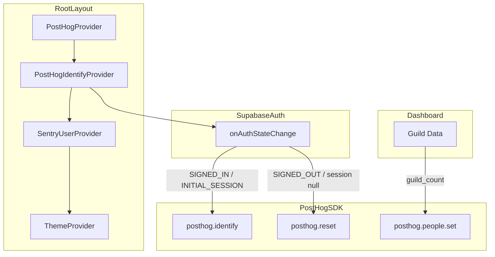
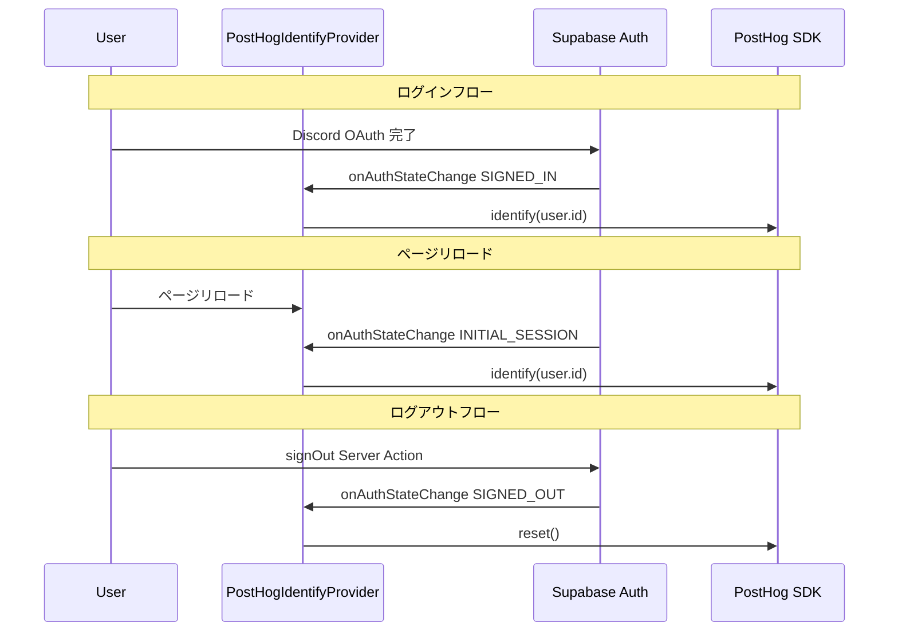

# Design Document: PostHog ユーザー識別（identify）

## Overview

**Purpose**: Discord OAuth 認証後に PostHog でユーザーを一意に識別し、匿名トラッキングからユーザー単位の行動分析へ移行する。

**Users**: アナリティクス管理者がリテンション分析・コホート分析・ユーザージャーニー追跡を行える。

**Impact**: 既存の PostHog 匿名トラッキング基盤（`lib/analytics/`）に identify / reset 機能を追加。既存イベントトラッキング（`trackEvent`）は変更なし。

### Goals
- 認証済みユーザーを PostHog 上で `user.id`（Supabase Auth）により一意に識別する
- ユーザープロパティ（`guild_count`）を PostHog に送信しセグメント分析を可能にする
- ログアウト時に `posthog.reset()` でユーザー識別を解除しプライバシーを保護する

### Non-Goals
- サーバーサイドでの PostHog イベント送信（現在はクライアントサイドのみ）
- PostHog のフィーチャーフラグ機能の導入
- ユーザープロパティの全網羅（`guild_count` 以外は将来スコープ）

## Architecture

### Existing Architecture Analysis

現在の PostHog 基盤:
- `lib/analytics/posthog-provider.tsx` — SDK 初期化 + `PostHogPageView` のラップ。`persistence: "memory"` 設定
- `lib/analytics/client.ts` — `getPostHogClient()` で初期化済みインスタンスを安全に取得
- `lib/analytics/events.ts` — `trackEvent()` による型安全なイベント送信
- `app/layout.tsx` — `PostHogProvider` > `SentryUserProvider` > `ThemeProvider` のネスト構造

既存の類似パターン:
- `components/sentry/sentry-user-provider.tsx` — `onAuthStateChange` で Sentry にユーザーコンテキストを設定。同じパターンで PostHog identify を実装する

### Architecture Pattern & Boundary Map



**Architecture Integration**:
- **Selected pattern**: Provider パターン（SentryUserProvider 踏襲）— 検証済みのアプローチを再利用
- **Domain boundaries**: identify/reset は `lib/analytics/` に配置。guild_count 更新ユーティリティも同モジュール
- **Existing patterns preserved**: `getPostHogClient()` による安全なインスタンス取得、`onAuthStateChange` によるイベント駆動
- **New components**: `PostHogIdentifyProvider`（1コンポーネント）、`setPostHogUserProperties` ユーティリティ（1関数）
- **Steering compliance**: `"use client"` でクライアント境界を維持、`lib/analytics/` に集約

### Technology Stack

| Layer | Choice / Version | Role in Feature | Notes |
|-------|------------------|-----------------|-------|
| Frontend | posthog-js ^1.352.0 | identify / reset / people.set API | 既存依存、追加インストール不要 |
| Frontend | @supabase/ssr | onAuthStateChange で認証イベント監視 | 既存依存 |
| Frontend | React 19 | Provider コンポーネント + useEffect | 既存依存 |

## System Flows



## Requirements Traceability

| Requirement | Summary | Components | Interfaces | Flows |
|-------------|---------|------------|------------|-------|
| 1.1 | ログイン時に identify 呼び出し | PostHogIdentifyProvider | onAuthStateChange → identify | ログインフロー |
| 1.2 | Supabase user.id を distinct_id に使用 | PostHogIdentifyProvider | identify(user.id) | ログインフロー |
| 1.3 | リロード時に identify 再実行 | PostHogIdentifyProvider | INITIAL_SESSION → identify | リロードフロー |
| 2.1 | guild_count を $set で送信 | setPostHogUserProperties | people.set | ダッシュボード表示時 |
| 2.2 | ギルド数変化時に更新 | setPostHogUserProperties | people.set | ダッシュボード表示時 |
| 3.1 | ログアウト時に reset 呼び出し | PostHogIdentifyProvider | SIGNED_OUT → reset | ログアウトフロー |
| 3.2 | reset 後に新しい匿名ID生成 | PostHog SDK（組み込み動作） | reset() | ログアウトフロー |
| 4.1 | クライアントサイドでのみ実行 | PostHogIdentifyProvider | "use client" ディレクティブ | — |
| 4.2 | SDK 未初期化時はスキップ | PostHogIdentifyProvider, setPostHogUserProperties | getPostHogClient() nullチェック | — |
| 4.3 | SentryUserProvider と同じパターン | PostHogIdentifyProvider | onAuthStateChange リスナー | — |
| 5.1 | identify/reset の呼び出し検証 | PostHogIdentifyProvider テスト | モック posthog-js | — |
| 5.2 | PostHog SDK モック可能 | テストファイル | vi.mock("posthog-js") | — |

## Components and Interfaces

| Component | Domain/Layer | Intent | Req Coverage | Key Dependencies | Contracts |
|-----------|-------------|--------|-------------|-----------------|-----------|
| PostHogIdentifyProvider | Analytics / UI | 認証状態に応じた identify/reset | 1.1-1.3, 3.1-3.2, 4.1-4.3 | Supabase Auth (P0), posthog-js (P0) | State |
| setPostHogUserProperties | Analytics / Utility | ユーザープロパティ更新 | 2.1-2.2, 4.2 | posthog-js (P0) | Service |
| Root Layout 統合 | App / Layout | Provider の配線 | 4.1, 4.3 | PostHogIdentifyProvider (P0) | — |

### Analytics Layer

#### PostHogIdentifyProvider

| Field | Detail |
|-------|--------|
| Intent | 認証状態の変化を監視し PostHog identify / reset を実行する |
| Requirements | 1.1, 1.2, 1.3, 3.1, 3.2, 4.1, 4.2, 4.3 |

**Responsibilities & Constraints**
- `onAuthStateChange` リスナーでセッション変化を監視
- セッション確立時に `posthog.identify(user.id)` を呼び出し
- セッション消失時に `posthog.reset()` を呼び出し
- クライアントサイドでのみ動作（`"use client"`）

**Dependencies**
- Inbound: Root Layout — Provider として配線 (P0)
- External: Supabase Auth — `onAuthStateChange` イベント (P0)
- External: posthog-js — `identify()` / `reset()` API (P0)

**Contracts**: State [x]

##### State Management
- **State model**: React useEffect 内の subscription。コンポーネント内部に状態を持たない（PostHog SDK のグローバル状態に委譲）
- **Persistence**: PostHog SDK の `persistence: "memory"` に従う。リロード時は `INITIAL_SESSION` で再 identify
- **Concurrency**: `onAuthStateChange` は Supabase SDK が管理。競合なし

**Implementation Notes**
- Integration: `SentryUserProvider` と同一パターン。`lib/analytics/posthog-identify-provider.tsx` に配置
- Validation: `getPostHogClient()` が `undefined` を返す場合は何もしない
- Risks: `PostHogProvider`（SDK初期化）の**内側**に配置する必要あり。順序を間違えると identify が動作しない

```typescript
// lib/analytics/posthog-identify-provider.tsx
interface PostHogIdentifyProviderProps {
  children: React.ReactNode;
}
```

#### setPostHogUserProperties

| Field | Detail |
|-------|--------|
| Intent | PostHog にユーザープロパティを送信するユーティリティ関数 |
| Requirements | 2.1, 2.2, 4.2 |

**Responsibilities & Constraints**
- `posthog.people.set()` でユーザープロパティを送信
- SDK 未初期化時は静かにスキップ

**Dependencies**
- External: posthog-js — `people.set()` API (P0)
- Inbound: `getPostHogClient()` — SDK インスタンス取得 (P0)

**Contracts**: Service [x]

##### Service Interface
```typescript
// lib/analytics/client.ts に追加
interface UserProperties {
  guild_count: number;
}

function setPostHogUserProperties(properties: UserProperties): void;
```
- Preconditions: PostHog SDK が初期化済み（未初期化時はno-op）
- Postconditions: PostHog にユーザープロパティが送信される
- Invariants: SDK 未初期化時にエラーをスローしない

**Implementation Notes**
- Integration: 既存の `lib/analytics/client.ts` に関数を追加
- Validation: `getPostHogClient()` の null チェック
- Risks: なし

### App Layer

#### Root Layout 統合

**Implementation Notes**
- `PostHogIdentifyProvider` を `PostHogProvider` の内側、`SentryUserProvider` の前に配置
- Provider 順序: `PostHogProvider` > `PostHogIdentifyProvider` > `SentryUserProvider` > `ThemeProvider`
- 変更ファイル: `app/layout.tsx`

## Error Handling

### Error Strategy
既存の PostHog エラーハンドリングパターン（`getPostHogClient()` の null チェック）を踏襲。すべての PostHog API 呼び出しはオプショナルチェーンで保護する。

### Error Categories and Responses
- **PostHog SDK 未初期化**: `getPostHogClient()` が `undefined` → 静かにスキップ（no-op）
- **環境変数未設定**: PostHog が初期化されないため、上記と同じ動作
- **onAuthStateChange エラー**: Supabase SDK 内部で処理。Provider 側は subscription のクリーンアップのみ

## Testing Strategy

### Unit Tests
- `PostHogIdentifyProvider`: `SIGNED_IN` イベントで `posthog.identify(userId)` が呼ばれる
- `PostHogIdentifyProvider`: `INITIAL_SESSION` イベントで `posthog.identify(userId)` が呼ばれる（リロード）
- `PostHogIdentifyProvider`: `SIGNED_OUT` イベントで `posthog.reset()` が呼ばれる
- `PostHogIdentifyProvider`: セッション null で `posthog.reset()` が呼ばれる
- `PostHogIdentifyProvider`: アンマウント時に subscription が解除される
- `setPostHogUserProperties`: `guild_count` が `people.set` で送信される
- `setPostHogUserProperties`: SDK 未初期化時にエラーなくスキップされる

### テストパターン
`SentryUserProvider` のテスト（`components/sentry/sentry-user-provider.test.tsx`）と同じモックパターンを使用:
- `vi.mock("posthog-js")` で PostHog SDK をモック
- `vi.mock("@/lib/supabase/client")` で Supabase クライアントをモック
- `mockOnAuthStateChange` のコールバックを手動呼び出しで検証
