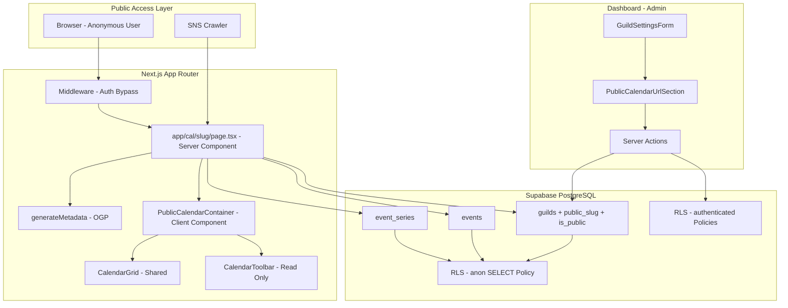
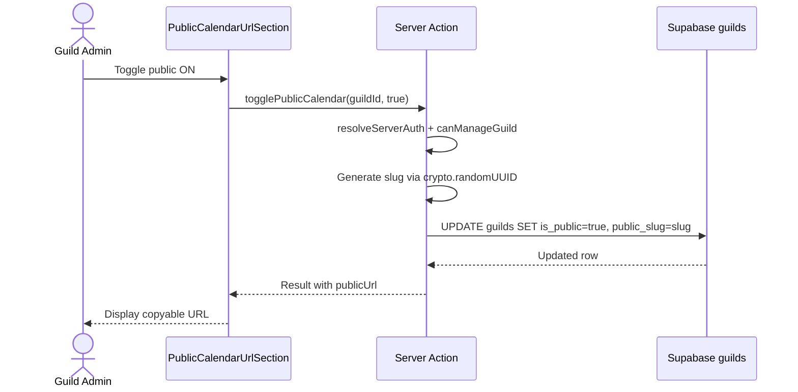
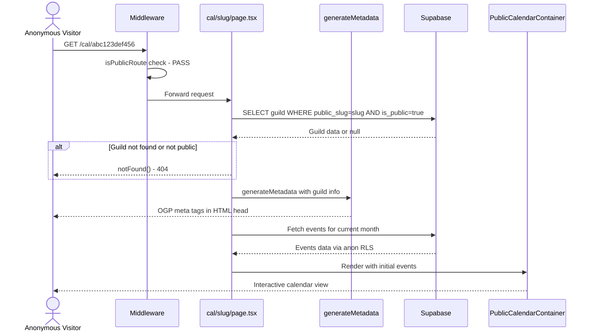
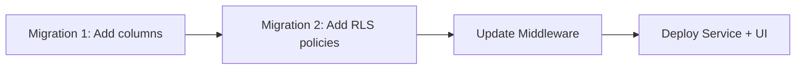

# Design Document: 公開カレンダーURL

## Overview

**Purpose**: ギルド単位で公開カレンダーURLを発行し、非ログインユーザーでもブラウザからイベント一覧をカレンダー形式で閲覧できる機能を提供する。

**Users**: ギルド管理者が公開URLを生成・管理し、非Discordユーザーを含む全てのWeb閲覧者がイベント情報を確認する。

**Impact**: guilds テーブルに `public_slug` / `is_public` カラムを追加し、Supabase RLS ポリシーに `anon` ロール向けの読み取りポリシーを追加する。ミドルウェアの公開ルート判定に `/cal` パスを追加する。

### Goals
- ギルド管理者が公開カレンダーURLを生成・無効化・再生成できる
- 非ログインユーザーが公開URLからカレンダーのイベント一覧を閲覧できる
- 公開ページに適切な OGP メタタグを設定し、SNS 共有時にリッチプレビューを表示する
- 既存のカレンダー表示コンポーネント（`CalendarGrid`, `CalendarToolbar`）を再利用する

### Non-Goals
- 公開ページからのイベント編集・削除・RSVP 操作
- 公開ページのリアルタイム更新（WebSocket / Realtime）
- 動的 OGP 画像生成（初期リリースではデフォルトブランド画像を使用）
- Discord Bot からの公開URL操作コマンド
- 公開ページへのアクセス解析・閲覧数カウント

## Architecture

> 詳細な調査経緯は `research.md` を参照。

### Existing Architecture Analysis

- **認証フロー**: Middleware (`lib/supabase/proxy.ts`) が全リクエストの認証チェックを実施。`isPublicRoute` のプレフィックスマッチで公開ルートを判定
- **ギルドデータ**: guilds テーブル（guild_id, name, avatar_url, locale, deleted_at）。RLS は `authenticated` ロールへの SELECT のみ許可
- **イベントデータ**: events / event_series テーブル。RLS は `authenticated` ロールへの SELECT / INSERT / UPDATE / DELETE を許可
- **Server Actions パターン**: `app/dashboard/actions.ts` で認証 + 権限チェック + Supabase 操作を一貫して実施。Result 型パターンを採用
- **設定管理パターン**: `guild_config` テーブルと `GuildConfigService` で設定の読み書きを分離。`GuildSettingsPanel` コンポーネントでトグル UI を提供
- **動的メタデータパターン**: `app/docs/[slug]/page.tsx` で `generateMetadata` を使用した動的メタデータ生成の実績あり

### Architecture Pattern & Boundary Map



**Architecture Integration**:
- Selected pattern: Server Component + Client Hydration（SSR で OGP 対応、クライアントでインタラクティブナビゲーション）
- Domain boundaries: 公開カレンダー閲覧（読み取り専用）とダッシュボード管理（読み書き）を明確に分離
- Existing patterns preserved: Result 型パターン、Server Actions、`generateMetadata`、RLS ポリシー、コンポーネント Co-location
- New components rationale: `PublicCalendarContainer`（認証不要の軽量カレンダーコンテナ）、`PublicCalendarUrlSection`（管理画面の公開URL設定セクション）、`PublicCalendarService`（公開カレンダー専用のデータ取得サービス）
- Steering compliance: TypeScript strict mode、`any` 不使用、shadcn/ui ベースの UI、Supabase SSR 認証パターン

### Technology Stack

| Layer | Choice / Version | Role in Feature | Notes |
|-------|------------------|-----------------|-------|
| Frontend | Next.js 16 (App Router) + React 19 | 公開ページ SSR + クライアントナビゲーション | 既存スタック |
| UI | shadcn/ui (Radix UI) + Tailwind CSS 3 | 公開ページ UI + 管理画面設定セクション | 既存スタック |
| Data | Supabase (PostgreSQL) + RLS | イベントデータ読み取り + 公開設定管理 | `anon` ロール向けポリシー追加 |
| Infrastructure | Vercel | SSR ホスティング | 既存インフラ |

## System Flows

### 公開URL生成フロー



### 公開カレンダー閲覧フロー



Key decisions:
- Middleware は `/cal` パスを公開ルートとして認識し、認証チェックをスキップする
- サーバーサイドで guild の公開状態を検証し、非公開の場合は `notFound()` を返す
- 初期データは SSR で取得し、月ナビゲーション時のみクライアントサイドで再フェッチする

## Requirements Traceability

| Requirement | Summary | Components | Interfaces | Flows |
|-------------|---------|------------|------------|-------|
| 1.1 | 公開スラッグ生成 | PublicCalendarService, Server Action | togglePublicCalendar | 公開URL生成 |
| 1.2 | 公開URLの無効化 | PublicCalendarService, Server Action | togglePublicCalendar | 公開URL生成 |
| 1.3 | 公開URL再生成 | PublicCalendarService, Server Action | regeneratePublicSlug | 公開URL生成 |
| 1.4 | スラッグのユニーク保証 | guilds テーブル UNIQUE 制約 | - | - |
| 1.5 | コピー可能なURL表示 | PublicCalendarUrlSection | - | - |
| 2.1 | ログイン不要でイベント一覧表示 | cal/slug/page.tsx, PublicCalendarContainer | PublicCalendarService.fetchPublicEvents | 公開カレンダー閲覧 |
| 2.2 | ギルド名表示 | cal/slug/page.tsx | - | - |
| 2.3 | イベント詳細表示 | CalendarGrid, EventPopover (read-only) | - | - |
| 2.4 | 編集UIの非表示 | PublicCalendarContainer | CalendarContainerProps.readOnly | - |
| 2.5 | 認証不要のパブリックルート | Middleware | isPublicRoute | 公開カレンダー閲覧 |
| 3.1 | 非公開ギルドのアクセス制御 | cal/slug/page.tsx | - | 公開カレンダー閲覧 |
| 3.2 | 存在しないスラッグの404表示 | cal/slug/page.tsx | notFound() | 公開カレンダー閲覧 |
| 3.3 | 内部情報アクセス防止 | RLS ポリシー, PublicCalendarService | - | - |
| 3.4 | 匿名ユーザーへの読み取り制限 | RLS ポリシー (anon SELECT) | - | - |
| 4.1 | OGP メタタグ設定 | generateMetadata | - | - |
| 4.2 | OGP title にギルド名 | generateMetadata | - | - |
| 4.3 | OGP description にイベント概要 | generateMetadata | - | - |
| 4.4 | Twitter カードメタタグ | generateMetadata | - | - |
| 4.5 | リッチプレビュー提供 | generateMetadata + OGP 画像 | - | - |
| 5.1 | 管理画面に設定セクション表示 | PublicCalendarUrlSection | - | - |
| 5.2 | 公開トグルUI | PublicCalendarUrlSection | togglePublicCalendar | 公開URL生成 |
| 5.3 | 公開時のURL + コピーボタン表示 | PublicCalendarUrlSection | - | - |
| 5.4 | 非公開時のURL生成促進UI | PublicCalendarUrlSection | - | - |
| 5.5 | 無効化時の確認ダイアログ | PublicCalendarUrlSection | ConfirmDialog | - |

## Components and Interfaces

| Component | Domain/Layer | Intent | Req Coverage | Key Dependencies | Contracts |
|-----------|--------------|--------|--------------|------------------|-----------|
| PublicCalendarService | Service | 公開カレンダーデータ取得 | 1.1-1.4, 2.1, 3.3, 3.4 | Supabase (P0) | Service |
| PublicCalendarUrlSection | UI | 管理画面の公開URL設定 | 1.5, 5.1-5.5 | Server Actions (P0), ConfirmDialog (P1) | State |
| PublicCalendarContainer | UI | 公開カレンダー表示コンテナ | 2.1-2.4 | CalendarGrid (P0), CalendarToolbar (P0) | State |
| cal/slug/page.tsx | Page | 公開カレンダーページ + OGP | 2.1-2.5, 3.1-3.4, 4.1-4.5 | PublicCalendarService (P0) | API |
| Server Actions | Action | 公開設定の変更 | 1.1-1.3, 5.2, 5.5 | PublicCalendarService (P0) | Service |
| Migration | Data | DB スキーマ + RLS ポリシー | 1.4, 3.3, 3.4 | - | - |

### Service Layer

#### PublicCalendarService

| Field | Detail |
|-------|--------|
| Intent | 公開カレンダーのデータ取得・スラッグ管理を担当するサービス |
| Requirements | 1.1, 1.2, 1.3, 1.4, 2.1, 3.3, 3.4 |

**Responsibilities & Constraints**
- 公開スラッグの生成・更新・無効化
- 公開ギルドのイベントデータ取得（匿名アクセス対応）
- ギルドの公開状態判定
- 内部情報（メンバーリスト、設定、チャンネル情報）の漏洩防止

**Dependencies**
- Outbound: Supabase client -- データ永続化 (P0)
- Outbound: crypto -- スラッグ生成 (P0)

**Contracts**: Service [x]

##### Service Interface
```typescript
/** 公開ギルド情報（公開ページ用） */
interface PublicGuildInfo {
  guildId: string;
  name: string;
  avatarUrl: string | null;
  publicSlug: string;
}

/** 公開カレンダーのイベント情報（公開ページ用） */
interface PublicCalendarEvent {
  id: string;
  title: string;
  start: Date;
  end: Date;
  allDay: boolean;
  color: string;
  description: string | undefined;
  location: string | undefined;
}

/** 公開カレンダーサービスのエラーコード */
type PublicCalendarErrorCode =
  | "GUILD_NOT_FOUND"
  | "GUILD_NOT_PUBLIC"
  | "FETCH_FAILED"
  | "SLUG_GENERATION_FAILED"
  | "PERMISSION_DENIED";

/** 公開カレンダーサービスのエラー型 */
interface PublicCalendarError {
  code: PublicCalendarErrorCode;
  message: string;
}

/** Result 型 */
type PublicCalendarResult<T> =
  | { success: true; data: T }
  | { success: false; error: PublicCalendarError };

interface PublicCalendarServiceInterface {
  /**
   * 公開スラッグからギルド情報を取得する
   * @param slug 公開スラッグ
   * @returns 公開ギルド情報。非公開または不存在の場合はエラー
   */
  getPublicGuildBySlug(
    slug: string
  ): Promise<PublicCalendarResult<PublicGuildInfo>>;

  /**
   * 公開ギルドのイベントを取得する
   * @param guildId ギルドID
   * @param startDate 取得開始日
   * @param endDate 取得終了日
   * @returns イベント一覧（公開情報のみ）
   */
  fetchPublicEvents(
    guildId: string,
    startDate: Date,
    endDate: Date
  ): Promise<PublicCalendarResult<PublicCalendarEvent[]>>;

  /**
   * 公開カレンダーを有効化し、スラッグを生成する
   * @param supabase 認証済み Supabase クライアント
   * @param guildId ギルドID
   * @returns 生成された公開スラッグ
   */
  enablePublicCalendar(
    supabase: SupabaseClient,
    guildId: string
  ): Promise<PublicCalendarResult<{ slug: string }>>;

  /**
   * 公開カレンダーを無効化する
   * @param supabase 認証済み Supabase クライアント
   * @param guildId ギルドID
   */
  disablePublicCalendar(
    supabase: SupabaseClient,
    guildId: string
  ): Promise<PublicCalendarResult<void>>;

  /**
   * 公開スラッグを再生成する
   * @param supabase 認証済み Supabase クライアント
   * @param guildId ギルドID
   * @returns 新しい公開スラッグ
   */
  regeneratePublicSlug(
    supabase: SupabaseClient,
    guildId: string
  ): Promise<PublicCalendarResult<{ slug: string }>>;

  /**
   * ギルドの公開設定を取得する
   * @param supabase Supabase クライアント
   * @param guildId ギルドID
   * @returns 公開設定情報
   */
  getPublicSettings(
    supabase: SupabaseClient,
    guildId: string
  ): Promise<PublicCalendarResult<{ isPublic: boolean; publicSlug: string | null }>>;
}
```
- Preconditions: `getPublicGuildBySlug` / `fetchPublicEvents` は認証不要（anon ロール）。`enablePublicCalendar` / `disablePublicCalendar` / `regeneratePublicSlug` は認証済み Supabase クライアントが必要
- Postconditions: 有効化時に `is_public = true` かつ `public_slug` が非 NULL。無効化時に `is_public = false`（`public_slug` は保持し、再有効化時に再利用可能とする）
- Invariants: `public_slug` は guilds テーブル全体でユニーク。`is_public = false` のギルドのイベントは匿名ユーザーに返却しない

**Implementation Notes**
- `getPublicGuildBySlug` と `fetchPublicEvents` は Supabase の `anon` キーを使用するサーバーサイドクライアントで呼び出す。`createClient()` は Next.js の Server Component コンテキストで使用し、Cookie ベースの認証が適用されるが、未認証時は `anon` ロールで動作する
- スラッグ生成時の衝突は DB の UNIQUE 制約違反を検出し、最大3回リトライする
- `fetchPublicEvents` は events テーブルと event_series テーブルの両方からデータを取得し、既存の `createEventService` の `fetchEventsWithSeries` ロジックを参考に繰り返しイベントのオカレンス展開を行う。ただし、認証済みクライアントではなく匿名クライアントを使用し、チャンネル情報（`channel_id`, `channel_name`）は返却しない

### Page Layer

#### cal/slug/page.tsx

| Field | Detail |
|-------|--------|
| Intent | 公開カレンダーページの Server Component。スラッグからギルドを解決し、OGP メタデータを生成し、初期イベントデータを取得して PublicCalendarContainer に渡す |
| Requirements | 2.1, 2.2, 2.5, 3.1, 3.2, 4.1, 4.2, 4.3, 4.4, 4.5 |

**Responsibilities & Constraints**
- `params.slug` からギルドを解決し、公開状態を検証する
- 非公開・不存在のギルドは `notFound()` で 404 を返す
- `generateMetadata` で動的な OGP / Twitter Card メタタグを生成する
- 初期表示月のイベントデータを SSR で取得する

**Dependencies**
- Inbound: Next.js App Router -- ルーティング (P0)
- Outbound: PublicCalendarService -- データ取得 (P0)
- Outbound: PublicCalendarContainer -- UI レンダリング (P0)

**Contracts**: API [x]

##### API Contract

| Method | Endpoint | Request | Response | Errors |
|--------|----------|---------|----------|--------|
| GET | /cal/[slug] | URL params: slug | HTML with OGP meta | 404 (not found / not public) |

**Implementation Notes**
- `generateMetadata` パターンは `app/docs/[slug]/page.tsx` に準拠する
- OGP description にはギルドの直近イベント情報（最大3件のイベント名）を含める
- OGP 画像は初期リリースでは `/og-default.png`（デフォルトブランド画像）を使用する
- `force-dynamic` は設定しない。ギルド情報はスラッグから DB クエリで取得するため、自然に動的レンダリングとなる

### UI Layer

#### PublicCalendarContainer

| Field | Detail |
|-------|--------|
| Intent | 公開カレンダーの表示コンテナ。読み取り専用モードで CalendarGrid と CalendarToolbar を組み合わせる |
| Requirements | 2.1, 2.2, 2.3, 2.4 |

**Responsibilities & Constraints**
- 月ナビゲーション（前月・次月・今日）のインタラクション管理
- ナビゲーション時にクライアントサイドでイベントデータを再フェッチする
- イベント編集・削除・RSVP の UI を一切表示しない
- イベントクリック時にはイベント詳細（タイトル、日時、説明、場所）を読み取り専用で表示する

**Dependencies**
- Inbound: cal/slug/page.tsx -- 初期データ (P0)
- Outbound: CalendarGrid -- カレンダー表示 (P0)
- Outbound: CalendarToolbar -- ナビゲーション UI (P0)
- Outbound: EventPopover -- 読み取り専用イベント詳細 (P1)

**Contracts**: State [x]

##### State Management
- State model: `viewMode` (月/週/日), `selectedDate`, `events`, `isLoading`, `error`
- Persistence: なし（URL クエリパラメータでビュー状態を管理する可能性あり）
- Concurrency: `AbortController` で前回のフェッチリクエストをキャンセル

**Implementation Notes**
- `CalendarToolbar` の `onAddClick` と `onSettingsClick` は `undefined` を渡して追加ボタン・設定ボタンを非表示にする
- `CalendarGrid` の `onSlotSelect`, `onEventDrop`, `onEventResize` は `undefined` を渡してドラッグ操作を無効化する
- `EventPopover` の `onEdit` / `onDelete` は `undefined` を渡して編集・削除ボタンを非表示にする。`isAuthenticated` は `false` を渡して RSVP ボタンを非表示にする
- クライアントサイドのイベント再フェッチには Supabase の `anon` キーを使用する。`createClient()` は未認証時に `anon` ロールで動作するため、RLS ポリシーにより公開ギルドのイベントのみ返却される

#### PublicCalendarUrlSection

| Field | Detail |
|-------|--------|
| Intent | ギルド管理画面に配置する公開カレンダーURL設定セクション |
| Requirements | 1.5, 5.1, 5.2, 5.3, 5.4, 5.5 |

**Responsibilities & Constraints**
- 公開カレンダーの有効・無効トグルを提供する
- 有効時に公開URLとコピーボタンを表示する
- 無効時にURL生成を促すUIを表示する
- 無効化時に確認ダイアログを表示する
- スラッグ再生成機能を提供する

**Dependencies**
- Inbound: GuildSettingsForm -- 設定ページ内配置 (P0)
- Outbound: Server Actions -- togglePublicCalendar, regeneratePublicSlug (P0)
- Outbound: ConfirmDialog -- 無効化確認 (P1)

**Contracts**: State [x]

##### State Management
- State model: `isPublic` (boolean), `publicSlug` (string | null), `isPending` (boolean), `error` (string | null)
- Persistence: Server Action による DB 永続化
- Concurrency: `useTransition` でオプティミスティック更新

**Implementation Notes**
- `GuildSettingsForm` の設定セクション群に `SettingsSection` ラッパーで追加する（既存の権限設定・通知設定と同列）
- 公開URLのフォーマット: `{baseUrl}/cal/{slug}`（`baseUrl` は `process.env.VERCEL_URL` または `localhost:3000`）
- コピーボタンは `navigator.clipboard.writeText` を使用し、コピー成功時にトースト的フィードバックを表示する
- スラッグ再生成ボタンは公開設定がオンの場合のみ表示し、確認ダイアログを経由する

### Server Actions

#### togglePublicCalendar / regeneratePublicSlug

| Field | Detail |
|-------|--------|
| Intent | 公開カレンダー設定の変更を処理する Server Action |
| Requirements | 1.1, 1.2, 1.3 |

**Responsibilities & Constraints**
- 認証 + MANAGE_GUILD 権限チェック
- PublicCalendarService への委譲
- `revalidatePath` による管理画面キャッシュ無効化

**Dependencies**
- Inbound: PublicCalendarUrlSection -- UI からの呼び出し (P0)
- Outbound: resolveServerAuth -- 認証・権限解決 (P0)
- Outbound: PublicCalendarService -- データ操作 (P0)

**Contracts**: Service [x]

##### Service Interface
```typescript
/** 公開カレンダー設定のトグル */
type TogglePublicCalendarInput = {
  guildId: string;
  enabled: boolean;
};

type TogglePublicCalendarResult =
  | { success: true; data: { isPublic: boolean; publicSlug: string | null } }
  | { success: false; error: { code: string; message: string } };

/** Server Action */
function togglePublicCalendar(
  input: TogglePublicCalendarInput
): Promise<TogglePublicCalendarResult>;

/** 公開スラッグ再生成 */
type RegeneratePublicSlugInput = {
  guildId: string;
};

type RegeneratePublicSlugResult =
  | { success: true; data: { publicSlug: string } }
  | { success: false; error: { code: string; message: string } };

/** Server Action */
function regeneratePublicSlug(
  input: RegeneratePublicSlugInput
): Promise<RegeneratePublicSlugResult>;
```
- Preconditions: 認証済みユーザー、対象ギルドの MANAGE_GUILD 権限を保持
- Postconditions: guilds テーブルの `is_public` / `public_slug` が更新される。`revalidatePath` により管理画面が再検証される

## Data Models

### Domain Model

- **Guild（拡張）**: 既存の Guild エンティティに `isPublic` (boolean) と `publicSlug` (string | null) を追加
- **PublicCalendarEvent**: CalendarEvent のサブセット。チャンネル情報・通知設定・繰り返し設定の内部詳細を除外した公開向けイベント型
- **Business Rules**:
  - `is_public = true` かつ `public_slug IS NOT NULL` の場合のみ公開URLが有効
  - `is_public = false` に変更しても `public_slug` は保持される（再有効化時に同じURLを復元可能）
  - スラッグ再生成時は旧スラッグが無効化され、新スラッグが発行される

### Physical Data Model

**guilds テーブルへのカラム追加**:

```sql
ALTER TABLE guilds ADD COLUMN is_public BOOLEAN NOT NULL DEFAULT false;
ALTER TABLE guilds ADD COLUMN public_slug VARCHAR(16) UNIQUE;

CREATE INDEX idx_guilds_public_slug ON guilds(public_slug) WHERE public_slug IS NOT NULL;
```

- `is_public`: 公開フラグ。デフォルト `false`
- `public_slug`: 公開スラッグ。12文字の hex 文字列。NULL 許容（公開URL未生成時）。UNIQUE 制約で衝突を防止
- 部分インデックス: `public_slug IS NOT NULL` のレコードのみインデックス化し、検索パフォーマンスを最適化

**RLS ポリシー追加**:

```sql
-- guilds: anon ロールに公開ギルドの読み取りを許可
CREATE POLICY "anon_can_read_public_guilds"
    ON guilds
    FOR SELECT
    TO anon
    USING (is_public = true AND deleted_at IS NULL);

-- events: anon ロールに公開ギルドのイベント読み取りを許可
CREATE POLICY "anon_can_read_public_events"
    ON events
    FOR SELECT
    TO anon
    USING (
        guild_id IN (
            SELECT guild_id FROM guilds
            WHERE is_public = true AND deleted_at IS NULL
        )
    );

-- event_series: anon ロールに公開ギルドのイベントシリーズ読み取りを許可
CREATE POLICY "anon_can_read_public_event_series"
    ON event_series
    FOR SELECT
    TO anon
    USING (
        guild_id IN (
            SELECT guild_id FROM guilds
            WHERE is_public = true AND deleted_at IS NULL
        )
    );
```

### Data Contracts & Integration

**GuildRow 拡張**:
```typescript
interface GuildRow {
  // ... existing fields
  is_public: boolean;
  public_slug: string | null;
}
```

**Guild 型拡張**:
```typescript
interface Guild {
  // ... existing fields
  isPublic: boolean;
  publicSlug: string | null;
}
```

**toGuild 変換関数の更新**: `is_public` -> `isPublic`, `public_slug` -> `publicSlug` のマッピングを追加する。

## Error Handling

### Error Categories and Responses

**User Errors (4xx)**:
- 存在しないスラッグへのアクセス -> `notFound()` (404 ページ)
- 非公開ギルドのスラッグへのアクセス -> `notFound()` (404 ページ)。意図的に403ではなく404を返し、非公開ギルドの存在を漏洩しない
- 権限不足での公開設定変更 -> `PERMISSION_DENIED` エラーメッセージ表示

**System Errors (5xx)**:
- Supabase 接続エラー -> 公開ページではグレースフルデグラデーション（エラーメッセージ表示 + リトライボタン）
- スラッグ衝突（UNIQUE 制約違反）-> 自動リトライ（最大3回）、それでも失敗した場合はユーザーにエラー通知

**Business Logic Errors**:
- 削除済みギルドへのアクセス -> `notFound()` (404)。`deleted_at IS NULL` 条件で RLS レベルでフィルタ

### Monitoring
- Sentry で公開ページのエラーをキャプチャ（既存の `@sentry/nextjs` 統合を活用）
- スラッグ衝突のリトライ回数が閾値を超えた場合にアラートを発行

## Testing Strategy

### Unit Tests
- `PublicCalendarService.getPublicGuildBySlug`: 公開ギルド取得、非公開ギルド拒否、不存在ギルド拒否
- `PublicCalendarService.enablePublicCalendar`: スラッグ生成、UNIQUE 制約違反時のリトライ
- `PublicCalendarService.fetchPublicEvents`: イベント取得、繰り返しイベントのオカレンス展開、チャンネル情報の除外確認
- `toGuild` 変換関数: 新カラム（`is_public`, `public_slug`）のマッピング検証

### Integration Tests
- Middleware テスト: `/cal/xxx` パスが公開ルートとして認識されること
- RLS ポリシーテスト: anon ロールで公開ギルドのみ読み取れること、非公開ギルドが返却されないこと
- Server Action テスト: 権限チェック + 公開設定変更の E2E フロー

### E2E Tests
- 公開URLにアクセスしてカレンダーが表示されること
- 非公開ギルドのURLにアクセスして404が表示されること
- 管理画面で公開URLの生成・コピー・無効化が正常に動作すること

## Security Considerations

- **匿名アクセスの範囲制限**: RLS ポリシーにより `anon` ロールは `is_public = true` かつ `deleted_at IS NULL` のギルドのイベントのみ読み取り可能。INSERT / UPDATE / DELETE は一切許可しない
- **情報漏洩防止**: 公開ページから返却するデータは `name`, `description`, `start_at`, `end_at`, `color`, `is_all_day`, `location` のみ。`channel_id`, `channel_name`, 通知設定、メンバーリスト、ギルド設定は除外する
- **スラッグの予測不可能性**: `crypto.randomUUID()` ベースの12文字 hex スラッグは十分なエントロピーを持ち、ブルートフォースによる列挙攻撃を実質的に不可能にする
- **非公開ギルドの存在隠蔽**: 非公開ギルドへのアクセスは 403 ではなく 404 を返し、ギルドの存在自体を漏洩しない
- **管理操作の権限チェック**: 公開設定の変更は `resolveServerAuth` + `canManageGuild` で MANAGE_GUILD 権限を検証する（既存パターンに準拠）

## Migration Strategy



- **Migration 1**: guilds テーブルに `is_public`, `public_slug` カラムを追加。既存レコードは `is_public = false`, `public_slug = NULL` で初期化（デフォルト値により自動適用）
- **Migration 2**: `anon` ロール向け SELECT RLS ポリシーを guilds, events, event_series テーブルに追加
- **Migration 3（コード変更）**: Middleware の `isPublicRoute` に `/cal` を追加
- **Migration 4（コード変更）**: PublicCalendarService、Server Actions、UI コンポーネントをデプロイ
- **Rollback**: カラム追加と RLS ポリシーはそれぞれ独立しており、逆順で安全にロールバック可能。公開URLが既に共有されている場合、ロールバック時は404を返すようになる
