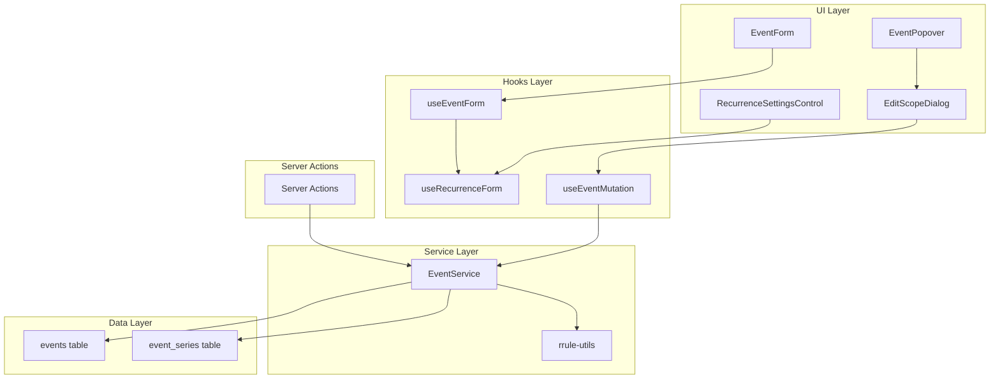
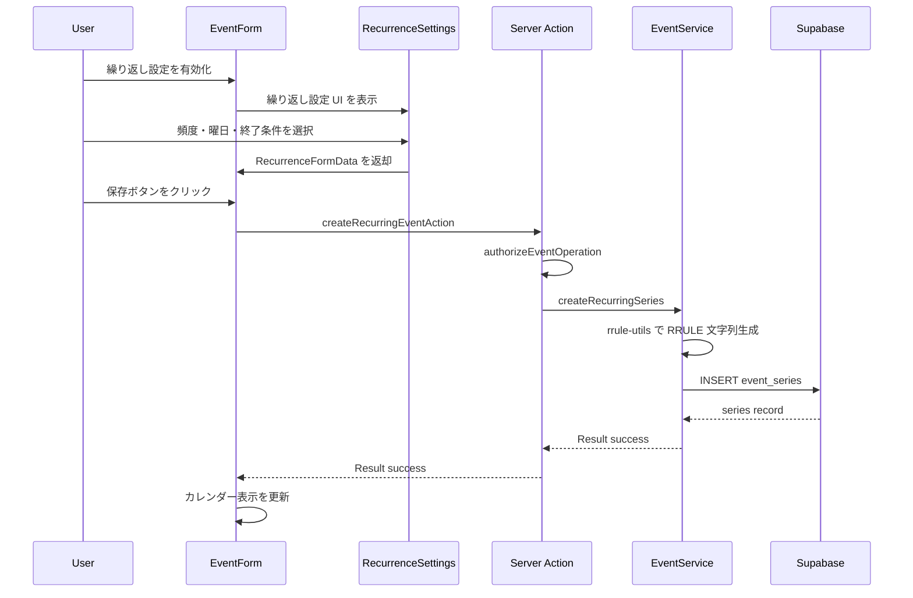
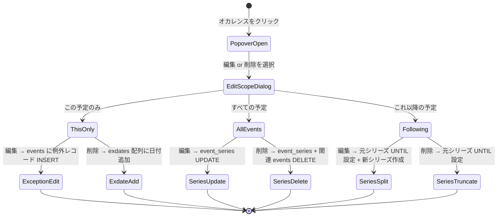
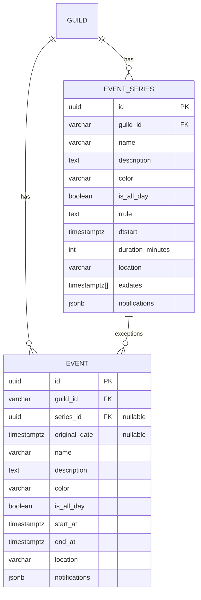

# Design Document: recurring-events

## Overview

**Purpose**: RFC 5545 RRULE 準拠の繰り返しイベント機能を Discalendar に追加する。ギルドメンバーが毎日・毎週・毎月・毎年の定期予定を一度の登録で管理できるようにする。

**Users**: ギルドメンバーが定例ミーティング・週次イベント・月例会議などの繰り返し予定の作成・編集・削除に使用する。

**Impact**: 既存の単発イベント CRUD システム（`events` テーブル、`EventService`、`EventForm`）を拡張し、`event_series` テーブルと RRULE 展開ロジックを追加する。既存機能への破壊的変更はない。

### Goals
- RFC 5545 RRULE 準拠の繰り返しルール生成・保存・展開
- 単一オカレンス / シリーズ全体 / これ以降の 3 パターンの編集・削除
- 既存の単発イベント CRUD との完全な後方互換
- 表示範囲のみ展開するパフォーマンス最適化

### Non-Goals
- iCalendar ファイル（.ics）のエクスポート・インポート（将来対応）
- Discord Bot からの繰り返しイベント操作（別スコープ）
- RSVP（出欠管理）機能との統合
- RRULE BYEASTER 拡張のサポート

## Architecture

### Existing Architecture Analysis

現在のイベントシステムは以下のレイヤー構成:

```
CalendarContainer (Server Component)
  └─ CalendarGrid (Client Component)
       └─ EventDialog / EventPopover / ConfirmDialog
            └─ EventForm (useEventForm hook)
                 └─ useEventMutation hook
                      └─ EventService (Supabase Client)
                           └─ events テーブル (PostgreSQL)
```

**既存パターン**:
- `createEventService(supabase)` ファクトリでの DI
- Result 型 `{ success: true; data: T } | { success: false; error: CalendarError }` による統一エラーハンドリング
- Server Actions (`authorizeEventOperation()`) での権限チェック
- `CalendarEvent` 型による react-big-calendar との統合

**維持すべき制約**:
- EventService のファクトリパターンと Result 型
- Server Actions での権限チェックフロー
- CalendarEvent 型の react-big-calendar 互換性
- `events` テーブルの RLS ポリシー

### Architecture Pattern & Boundary Map



**Architecture Integration**:
- **Selected pattern**: ハイブリッド — RRULE ロジックを `rrule-utils` に純粋関数として分離し、EventService はクエリ・永続化に専念
- **Domain boundaries**: `rrule-utils` は外部依存なしの純粋関数層、EventService は Supabase 通信層、UI 層はフォーム状態管理に専念
- **Existing patterns preserved**: Result 型、ファクトリパターン、Server Actions 権限チェック
- **New components rationale**: `rrule-utils` は RRULE ロジックのテスト容易性確保、`RecurrenceSettingsControl` は EventForm の責務分離、`EditScopeDialog` は編集パターン選択の UI 責務分離

### Technology Stack

| Layer | Choice / Version | Role in Feature | Notes |
|-------|------------------|-----------------|-------|
| Frontend | `rrule` (npm) | RRULE 生成・展開・EXDATE 管理 | TypeScript 型内蔵、3.7k stars |
| Frontend | react-big-calendar 1.19.x | オカレンスの CalendarEvent[] 表示 | 既存。変更なし |
| Backend | Next.js Server Actions | 繰り返しイベント CRUD、シリーズ分割 | 既存パターン拡張 |
| Data | Supabase PostgreSQL | event_series テーブル、events 拡張 | RLS ポリシー適用 |

## System Flows

### 繰り返しイベント作成フロー



### オカレンス編集・削除フロー（スコープ選択）



**Key Decisions**:
- 「この予定のみ」の編集は events テーブルに例外レコードとして INSERT（`series_id` + `original_date` で紐付け）
- 「この予定のみ」の削除は exdates 配列への日付追加のみ（レコード不要）
- 「これ以降の予定」は元シリーズの UNTIL 更新 + 新シリーズ作成の 2 ステップ

## Requirements Traceability

| Requirement | Summary | Components | Interfaces | Flows |
|-------------|---------|------------|------------|-------|
| 1.1 | 繰り返し頻度選択 UI | RecurrenceSettingsControl | RecurrenceFormData | 作成フロー |
| 1.2 | RRULE 文字列生成 | rrule-utils | buildRruleString | 作成フロー |
| 1.3 | シリーズ永続化 | EventService | createRecurringSeries | 作成フロー |
| 1.4 | オカレンス展開表示 | EventService, rrule-utils | expandOccurrences | 取得フロー |
| 1.5 | 単発イベント互換 | EventService | createEvent（既存） | — |
| 2.1 | 曜日複数選択 | RecurrenceSettingsControl | RecurrenceFormData.byDay | 作成フロー |
| 2.2 | 月指定（日付/曜日） | RecurrenceSettingsControl | RecurrenceFormData.monthlyMode | 作成フロー |
| 2.3 | 間隔指定 | RecurrenceSettingsControl | RecurrenceFormData.interval | 作成フロー |
| 2.4 | カスタム RRULE 保存 | rrule-utils, EventService | buildRruleString | 作成フロー |
| 3.1 | 終了条件 UI | RecurrenceSettingsControl | RecurrenceFormData.endCondition | 作成フロー |
| 3.2 | COUNT パラメータ | rrule-utils | buildRruleString | 作成フロー |
| 3.3 | UNTIL パラメータ | rrule-utils | buildRruleString | 作成フロー |
| 3.4 | 無期限 RRULE | rrule-utils | buildRruleString | 作成フロー |
| 3.5 | COUNT バリデーション | useRecurrenceForm | validateRecurrence | 作成フロー |
| 3.6 | UNTIL バリデーション | useRecurrenceForm | validateRecurrence | 作成フロー |
| 4.1 | 範囲内展開 | EventService, rrule-utils | fetchEventsWithSeries | 取得フロー |
| 4.2 | 繰り返しインジケーター | EventBlock | CalendarEvent.isRecurring | — |
| 4.3 | ルール概要表示 | EventPopover | CalendarEvent.rruleSummary | — |
| 4.4 | 混在表示 | EventService | fetchEventsWithSeries | 取得フロー |
| 4.5 | パフォーマンス | rrule-utils | expandOccurrences (between) | 取得フロー |
| 5.1 | 編集スコープ選択 | EditScopeDialog | EditScope | 編集・削除フロー |
| 5.2 | 単一編集（例外） | EventService | updateOccurrence | 編集・削除フロー |
| 5.3 | 削除スコープ選択 | EditScopeDialog | EditScope | 編集・削除フロー |
| 5.4 | 単一削除（EXDATE） | EventService | deleteOccurrence | 編集・削除フロー |
| 6.1 | シリーズ全体編集 | EventService | updateSeries | 編集・削除フロー |
| 6.2 | RRULE 変更 | EventService, rrule-utils | updateSeries | 編集・削除フロー |
| 6.3 | シリーズ全体削除 | EventService | deleteSeries | 編集・削除フロー |
| 6.4 | 例外リセット確認 | EditScopeDialog | resetExceptions flag | 編集・削除フロー |
| 7.1 | シリーズ分割（編集） | EventService | splitSeries | 編集・削除フロー |
| 7.2 | シリーズ切り詰め（削除） | EventService | truncateSeries | 編集・削除フロー |
| 7.3 | 分割後独立性 | EventService | — | 編集・削除フロー |
| 8.1 | RRULE 文字列保存 | EventService | event_series.rrule | — |
| 8.2 | 例外情報保存 | EventService | event_series.exdates, events.series_id | — |
| 8.3 | 範囲内展開 | rrule-utils | expandOccurrences | 取得フロー |
| 8.4 | パースエラー処理 | rrule-utils | expandOccurrences (try-catch) | — |
| 8.5 | Result 型適用 | EventService | 全メソッド | — |
| 9.1 | 単発 CRUD 不変 | EventService | 既存メソッド | — |
| 9.2 | スキーマ互換 | DB migration | ALTER TABLE events ADD COLUMN | — |
| 9.3 | 統合取得 | EventService | fetchEventsWithSeries | 取得フロー |
| 9.4 | UI 構造整合 | CalendarEvent 型拡張 | isRecurring, seriesId | — |

## Components and Interfaces

| Component | Domain/Layer | Intent | Req Coverage | Key Dependencies | Contracts |
|-----------|-------------|--------|--------------|------------------|-----------|
| rrule-utils | Service / Pure Functions | RRULE 生成・展開・要約 | 1.2, 2.4, 3.2-3.4, 4.1, 4.5, 8.1, 8.3, 8.4 | rrule (P0) | Service |
| EventService 拡張 | Service / Data Access | シリーズ CRUD・オカレンス統合取得 | 1.3, 1.4, 5.2, 5.4, 6.1-6.3, 7.1-7.3, 8.2, 8.5, 9.1, 9.3 | Supabase (P0), rrule-utils (P0) | Service |
| Server Actions 拡張 | Server / Auth | 権限チェック付きシリーズ操作 | 1.3, 5.2, 5.4, 6.1-6.3, 7.1-7.2 | EventService (P0) | Service |
| useRecurrenceForm | Hooks | 繰り返し設定フォーム状態管理 | 1.1, 2.1-2.3, 3.1, 3.5, 3.6 | rrule-utils (P1) | State |
| RecurrenceSettingsControl | UI / Form | 繰り返し設定入力 UI | 1.1, 2.1-2.3, 3.1 | useRecurrenceForm (P0) | — |
| EditScopeDialog | UI / Dialog | 編集・削除スコープ選択 | 5.1, 5.3, 6.4 | — | — |
| EventPopover 拡張 | UI / Display | 繰り返しルール概要表示 | 4.3 | CalendarEvent (P1) | — |
| EventBlock 拡張 | UI / Display | 繰り返しインジケーター | 4.2 | CalendarEvent (P1) | — |

### Service Layer

#### rrule-utils

| Field | Detail |
|-------|--------|
| Intent | RRULE 文字列の生成・パース・オカレンス展開・人間可読テキスト変換を純粋関数として提供 |
| Requirements | 1.2, 2.4, 3.2, 3.3, 3.4, 4.1, 4.5, 8.1, 8.3, 8.4 |

**Responsibilities & Constraints**
- 外部依存は `rrule` パッケージのみ、Supabase や React に依存しない
- すべて純粋関数として実装（副作用なし）
- エラー時は例外ではなく Result 型で返却

**Dependencies**
- External: `rrule` npm パッケージ — RRULE パース・展開エンジン (P0)

**Contracts**: Service [x]

##### Service Interface

```typescript
/** 繰り返し頻度 */
type RecurrenceFrequency = "daily" | "weekly" | "monthly" | "yearly";

/** 曜日 (RFC 5545 準拠) */
type Weekday = "MO" | "TU" | "WE" | "TH" | "FR" | "SA" | "SU";

/** 月の繰り返しモード */
type MonthlyMode =
  | { type: "dayOfMonth"; day: number }
  | { type: "nthWeekday"; n: number; weekday: Weekday };

/** 終了条件 */
type EndCondition =
  | { type: "never" }
  | { type: "count"; count: number }
  | { type: "until"; until: Date };

/** RRULE 生成入力 */
interface RruleBuildInput {
  frequency: RecurrenceFrequency;
  interval: number;
  byDay?: Weekday[];
  monthlyMode?: MonthlyMode;
  endCondition: EndCondition;
  dtstart: Date;
}

/** オカレンス展開結果 */
interface OccurrenceExpansionResult {
  dates: Date[];
  truncated: boolean;
}

/** RRULE ユーティリティ関数群 */
interface RruleUtils {
  /** RRULE 文字列を生成する */
  buildRruleString(input: RruleBuildInput): string;

  /** RRULE 文字列 + EXDATE から範囲内のオカレンスを展開する */
  expandOccurrences(
    rrule: string,
    dtstart: Date,
    rangeStart: Date,
    rangeEnd: Date,
    exdates?: Date[]
  ): OccurrenceExpansionResult;

  /** RRULE 文字列を人間可読テキストに変換する */
  toSummaryText(rrule: string, dtstart: Date): string;

  /** RRULE 文字列の妥当性を検証する */
  validateRrule(rrule: string): { valid: boolean; error?: string };
}
```

- Preconditions: `dtstart` は有効な Date、`interval >= 1`
- Postconditions: `buildRruleString` は RFC 5545 準拠の RRULE 文字列を返す
- Invariants: `expandOccurrences` は `rangeStart <= date <= rangeEnd` の日付のみ返す

**Implementation Notes**
- `expandOccurrences` 内部で RRuleSet を構築し、exdates を適用後に `between()` で展開
- パースエラーは try-catch で捕捉し、空の展開結果 + console.error でログ記録（8.4）
- `toSummaryText` は RRule の `toText()` メソッドを利用（英語出力を日本語にマッピング）

#### EventService 拡張

| Field | Detail |
|-------|--------|
| Intent | 繰り返しイベントシリーズの CRUD と、単発+繰り返しの統合イベント取得を提供 |
| Requirements | 1.3, 1.4, 5.2, 5.4, 6.1, 6.2, 6.3, 7.1, 7.2, 7.3, 8.2, 8.5, 9.1, 9.3 |

**Responsibilities & Constraints**
- 既存の `fetchEvents`, `createEvent`, `updateEvent`, `deleteEvent` は一切変更しない（9.1）
- 新メソッドは Result 型パターンに従う（8.5）
- `fetchEventsWithSeries` は単発イベント + オカレンスを統合して `CalendarEvent[]` で返す

**Dependencies**
- Inbound: Server Actions — シリーズ操作の委譲 (P0)
- Outbound: Supabase — event_series / events テーブルアクセス (P0)
- External: rrule-utils — RRULE 展開 (P0)

**Contracts**: Service [x]

##### Service Interface

```typescript
/** イベントシリーズレコード（DB行） */
interface EventSeriesRecord {
  id: string;
  guild_id: string;
  name: string;
  description: string | null;
  color: string;
  is_all_day: boolean;
  rrule: string;
  dtstart: string;
  duration_minutes: number;
  location: string | null;
  channel_id: string | null;
  channel_name: string | null;
  notifications: NotificationSetting[];
  exdates: string[];
  created_at: string;
  updated_at: string;
}

/** シリーズ作成入力 */
interface CreateSeriesInput {
  guildId: string;
  title: string;
  startAt: Date;
  endAt: Date;
  description?: string;
  isAllDay?: boolean;
  color?: string;
  location?: string;
  channelId?: string;
  channelName?: string;
  notifications?: NotificationSetting[];
  rrule: string;
}

/** シリーズ更新入力 */
interface UpdateSeriesInput {
  title?: string;
  startAt?: Date;
  endAt?: Date;
  description?: string;
  isAllDay?: boolean;
  color?: string;
  location?: string;
  notifications?: NotificationSetting[];
  rrule?: string;
  resetExceptions?: boolean;
}

/** 編集スコープ */
type EditScope = "this" | "all" | "following";

/** EventService に追加するメソッド */
interface RecurringEventMethods {
  /** 繰り返しイベントシリーズを作成 */
  createRecurringSeries(
    input: CreateSeriesInput
  ): Promise<MutationResult<EventSeriesRecord>>;

  /** 単発+繰り返しイベントを統合取得 */
  fetchEventsWithSeries(
    params: FetchEventsParams
  ): Promise<FetchEventsResult>;

  /** シリーズ全体を更新 */
  updateSeries(
    seriesId: string,
    input: UpdateSeriesInput
  ): Promise<MutationResult<EventSeriesRecord>>;

  /** シリーズ全体を削除 */
  deleteSeries(
    seriesId: string
  ): Promise<MutationResult<void>>;

  /** 単一オカレンスを編集（例外レコード作成） */
  updateOccurrence(
    seriesId: string,
    originalDate: Date,
    input: UpdateEventInput
  ): Promise<MutationResult<CalendarEvent>>;

  /** 単一オカレンスを削除（EXDATE 追加） */
  deleteOccurrence(
    seriesId: string,
    occurrenceDate: Date
  ): Promise<MutationResult<void>>;

  /** シリーズを分割（これ以降の編集） */
  splitSeries(
    seriesId: string,
    splitDate: Date,
    newInput: UpdateSeriesInput
  ): Promise<MutationResult<EventSeriesRecord>>;

  /** シリーズを切り詰め（これ以降の削除） */
  truncateSeries(
    seriesId: string,
    untilDate: Date
  ): Promise<MutationResult<void>>;
}
```

- Preconditions: `guildId` は有効なギルド ID、`rrule` は RFC 5545 準拠の文字列
- Postconditions: `fetchEventsWithSeries` は単発 + オカレンスを `CalendarEvent[]` に統合して返す
- Invariants: 既存の単発イベント CRUD メソッドの動作は変更されない

**Implementation Notes**
- `fetchEventsWithSeries`: 1) events テーブルから単発イベント取得、2) event_series テーブルからシリーズ取得、3) rrule-utils で各シリーズのオカレンス展開、4) 例外レコード（events.series_id != null）をオカレンスに適用、5) 結果を統合して CalendarEvent[] で返却
- `splitSeries`: Step 1) 元シリーズの RRULE に UNTIL 追加、Step 2) 新シリーズ作成。エラー時は Step 1 を復元
- 新エラーコード `SERIES_NOT_FOUND` と `RRULE_PARSE_ERROR` を CalendarErrorCode に追加

### Server Actions

#### Server Actions 拡張

| Field | Detail |
|-------|--------|
| Intent | 権限チェック付きの繰り返しイベント操作エンドポイントを提供 |
| Requirements | 1.3, 5.2, 5.4, 6.1, 6.2, 6.3, 7.1, 7.2 |

**Responsibilities & Constraints**
- 既存の `authorizeEventOperation()` パターンを再利用
- すべてのアクションで権限チェックを実行後に EventService を呼び出す

**Contracts**: Service [x]

##### Service Interface

```typescript
/** 繰り返しイベント作成アクション入力 */
interface CreateRecurringEventActionInput {
  guildId: string;
  eventData: CreateSeriesInput;
}

/** オカレンス操作アクション入力 */
interface OccurrenceActionInput {
  guildId: string;
  seriesId: string;
  scope: EditScope;
  occurrenceDate: Date;
  eventData?: UpdateEventInput | UpdateSeriesInput;
}

/** 追加する Server Actions */
function createRecurringEventAction(
  input: CreateRecurringEventActionInput
): Promise<MutationResult<EventSeriesRecord>>;

function updateOccurrenceAction(
  input: OccurrenceActionInput
): Promise<MutationResult<CalendarEvent | EventSeriesRecord>>;

function deleteOccurrenceAction(
  input: Omit<OccurrenceActionInput, "eventData">
): Promise<MutationResult<void>>;
```

### Hooks Layer

#### useRecurrenceForm

| Field | Detail |
|-------|--------|
| Intent | 繰り返し設定フォームの状態管理・バリデーション・RRULE 生成を提供 |
| Requirements | 1.1, 2.1, 2.2, 2.3, 3.1, 3.5, 3.6 |

**Dependencies**
- Outbound: rrule-utils — RRULE 文字列生成 (P1)

**Contracts**: State [x]

##### State Management

```typescript
/** 繰り返しフォームデータ */
interface RecurrenceFormData {
  isRecurring: boolean;
  frequency: RecurrenceFrequency;
  interval: number;
  byDay: Weekday[];
  monthlyMode: MonthlyMode;
  endCondition: EndCondition;
}

/** 繰り返しバリデーションエラー */
interface RecurrenceValidationErrors {
  interval?: string;
  count?: string;
  until?: string;
  byDay?: string;
}

/** useRecurrenceForm の戻り値 */
interface UseRecurrenceFormReturn {
  values: RecurrenceFormData;
  errors: RecurrenceValidationErrors;
  touched: Record<string, boolean>;
  isValid: boolean;
  handleChange: (field: keyof RecurrenceFormData, value: unknown) => void;
  handleBlur: (field: string) => void;
  validate: () => boolean;
  reset: () => void;
  /** 現在の設定から RRULE 文字列を生成 */
  toRruleString: (dtstart: Date) => string;
}
```

- State model: `RecurrenceFormData` を React useState で管理
- Persistence: なし（フォーム送信時に RRULE 文字列に変換）
- Concurrency: 単一コンポーネントスコープ（競合なし）

**Implementation Notes**
- `useEventForm` と同様のパターン（handleChange, handleBlur, validate）
- EventForm 内で `useEventForm` と `useRecurrenceForm` を並行使用
- バリデーション: `interval >= 1`, `count >= 1`, `until >= dtstart`, 週次の場合 `byDay.length >= 1`

### UI Layer

#### RecurrenceSettingsControl

| Field | Detail |
|-------|--------|
| Intent | 繰り返し設定の入力 UI を提供（頻度・曜日・間隔・終了条件） |
| Requirements | 1.1, 2.1, 2.2, 2.3, 3.1 |

**Implementation Notes**
- EventForm 内で `isRecurring` トグル有効時のみ表示
- shadcn/ui の Select, ToggleGroup, RadioGroup, Input を使用
- 頻度選択に応じて条件分岐表示（weekly → 曜日選択、monthly → 日付/曜日モード）

#### EditScopeDialog

| Field | Detail |
|-------|--------|
| Intent | 繰り返しイベントの編集・削除時にスコープ（this/all/following）を選択する確認ダイアログ |
| Requirements | 5.1, 5.3, 6.4 |

**Implementation Notes**
- shadcn/ui AlertDialog ベース（既存 ConfirmDialog と同様のパターン）
- 編集時: 「この予定のみ」「すべての予定」「これ以降の予定」の 3 択
- 削除時: 同 3 択 + 確認メッセージ
- 「すべての予定」編集時に例外リセット確認チェックボックスを表示（6.4）

#### EventPopover 拡張（Summary-only）

既存の EventPopover に繰り返しルール概要表示を追加（4.3）。`CalendarEvent.rruleSummary` が存在する場合に「毎週火曜日」等のテキストを表示。`CalendarEvent.isRecurring` で編集・削除ボタンのクリック時に EditScopeDialog を経由させる。

#### EventBlock 拡張（Summary-only）

既存の EventBlock に繰り返しインジケーターアイコンを追加（4.2）。`CalendarEvent.isRecurring === true` の場合に lucide-react の `Repeat` アイコンを表示。

## Data Models

### Domain Model



**Business Rules & Invariants**:
- `event_series.rrule` は RFC 5545 準拠の RRULE 文字列
- `event_series.duration_minutes` は `endAt - startAt` から算出し、各オカレンスに適用
- `events.series_id IS NULL` → 単発イベント（既存互換）
- `events.series_id IS NOT NULL` → 例外オカレンス（編集済み個別イベント）
- `events.original_date` → 例外が元々対応していたオカレンス日付

### Physical Data Model

#### event_series テーブル

```sql
CREATE TABLE event_series (
  id UUID PRIMARY KEY DEFAULT gen_random_uuid(),
  guild_id VARCHAR(32) NOT NULL REFERENCES guilds(guild_id) ON DELETE CASCADE,
  name VARCHAR(255) NOT NULL,
  description TEXT,
  color VARCHAR(7) NOT NULL DEFAULT '#3B82F6',
  is_all_day BOOLEAN NOT NULL DEFAULT false,
  rrule TEXT NOT NULL,
  dtstart TIMESTAMPTZ NOT NULL,
  duration_minutes INTEGER NOT NULL DEFAULT 60,
  location VARCHAR(255),
  channel_id VARCHAR(32),
  channel_name VARCHAR(100),
  notifications JSONB NOT NULL DEFAULT '[]',
  exdates TIMESTAMPTZ[] NOT NULL DEFAULT '{}',
  created_at TIMESTAMPTZ NOT NULL DEFAULT NOW(),
  updated_at TIMESTAMPTZ NOT NULL DEFAULT NOW()
);

CREATE INDEX idx_event_series_guild_id ON event_series(guild_id);
CREATE INDEX idx_event_series_dtstart ON event_series(dtstart);

ALTER TABLE event_series ENABLE ROW LEVEL SECURITY;

CREATE POLICY "authenticated_users_can_read_series"
  ON event_series FOR SELECT TO authenticated USING (true);

CREATE POLICY "authenticated_users_can_insert_series"
  ON event_series FOR INSERT TO authenticated WITH CHECK (true);

CREATE POLICY "authenticated_users_can_update_series"
  ON event_series FOR UPDATE TO authenticated USING (true);

CREATE POLICY "authenticated_users_can_delete_series"
  ON event_series FOR DELETE TO authenticated USING (true);

CREATE TRIGGER update_event_series_updated_at
  BEFORE UPDATE ON event_series
  FOR EACH ROW EXECUTE FUNCTION update_updated_at();
```

#### events テーブル拡張

```sql
ALTER TABLE events
  ADD COLUMN series_id UUID REFERENCES event_series(id) ON DELETE SET NULL,
  ADD COLUMN original_date TIMESTAMPTZ;

CREATE INDEX idx_events_series_id ON events(series_id)
  WHERE series_id IS NOT NULL;
```

**Migration Notes**:
- `series_id` と `original_date` は NULL 許容で既存データに影響なし（9.2）
- `ON DELETE SET NULL` により、シリーズ削除時に例外レコードは孤立するが無害（series_id = NULL → 通常の単発イベントとして残る）
- `update_updated_at()` 関数は既存の events テーブルで定義済みのものを再利用

### Data Contracts

#### CalendarEvent 型拡張

```typescript
/** 拡張された CalendarEvent（既存フィールドはすべて維持） */
interface CalendarEvent {
  // ... 既存フィールド（id, title, start, end, allDay, color, description, location, channel, notifications）

  /** イベントシリーズ ID（繰り返しイベントの場合） */
  seriesId?: string;
  /** 繰り返しイベントかどうか */
  isRecurring?: boolean;
  /** 繰り返しルールの人間可読テキスト（例: 「毎週火曜日」） */
  rruleSummary?: string;
  /** オカレンスの元の日付（例外レコードの場合） */
  originalDate?: Date;
}
```

## Error Handling

### Error Strategy

既存の `CalendarErrorCode` に 2 つのエラーコードを追加:

| Code | Category | Message | Recovery |
|------|----------|---------|----------|
| `SERIES_NOT_FOUND` | Business Logic (422) | 指定されたイベントシリーズが見つかりません。 | 一覧に戻る |
| `RRULE_PARSE_ERROR` | System (500) | 繰り返しルールの解析に失敗しました。 | ログ記録、オカレンス空配列 |

**Process Flow**:
- RRULE パースエラーは `expandOccurrences` 内で catch し、空配列を返す + console.error でログ（8.4）
- シリーズ分割の中間エラーは元シリーズの UNTIL を復元する補償トランザクション

## Testing Strategy

### Unit Tests
- `rrule-utils.buildRruleString`: 各頻度・曜日・間隔・終了条件の RRULE 文字列生成
- `rrule-utils.expandOccurrences`: 範囲内展開、EXDATE 除外、パースエラー時の空配列
- `rrule-utils.toSummaryText`: 日本語概要テキスト変換
- `rrule-utils.validateRrule`: 有効・無効な RRULE 文字列の検証
- `useRecurrenceForm`: 状態変更・バリデーション・RRULE 生成

### Integration Tests
- `EventService.fetchEventsWithSeries`: 単発 + 繰り返し + 例外の統合取得
- `EventService.createRecurringSeries` → `fetchEventsWithSeries`: 作成→取得の一貫性
- `EventService.deleteOccurrence` → `fetchEventsWithSeries`: EXDATE 追加後の展開結果
- `EventService.splitSeries`: 分割前後のオカレンス境界検証

### E2E Tests
- 繰り返しイベント作成 → カレンダー表示 → オカレンスクリック → プレビュー確認
- 「この予定のみ」編集 → 該当オカレンスのみ変更確認
- 「すべての予定」削除 → 全オカレンス消失確認
- 「これ以降の予定」削除 → 選択日以降のみ消失確認

### Performance
- 100 シリーズ × 365 日分の `fetchEventsWithSeries` レスポンスタイム
- 毎日繰り返し × 5 年分の `expandOccurrences` 実行時間

## Performance & Scalability

- **表示範囲のみ展開**: `between(rangeStart, rangeEnd)` で無限展開を防止（4.5）
- **メモ化**: `useMemo` でオカレンス展開結果をキャッシュし、ビュー切替時の再展開を抑制
- **クエリ最適化**: `event_series` の `guild_id` + `dtstart` インデックスで効率的なフィルタリング
- **無期限シリーズの上限**: 展開上限を現在日 + 2 年に設定（ユーザーが意図しない大量展開を防止）

## Migration Strategy

1. **Step 1**: `event_series` テーブル作成マイグレーション実行
2. **Step 2**: `events` テーブルに `series_id`, `original_date` カラム追加
3. **Step 3**: RLS ポリシー・インデックス・トリガー設定
4. **Rollback**: `series_id`, `original_date` カラム DROP → `event_series` テーブル DROP（既存データに影響なし）
