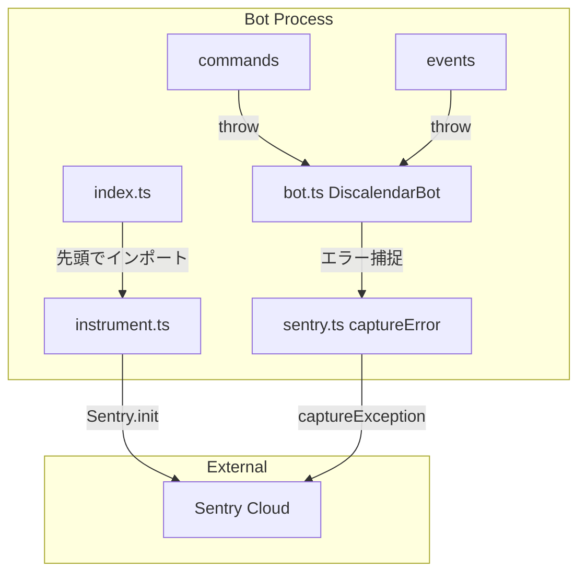
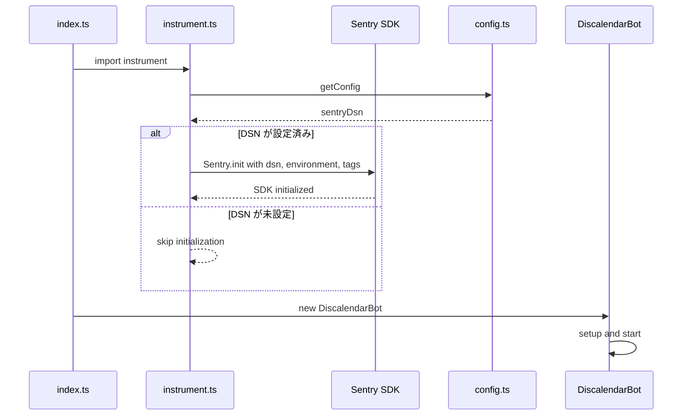
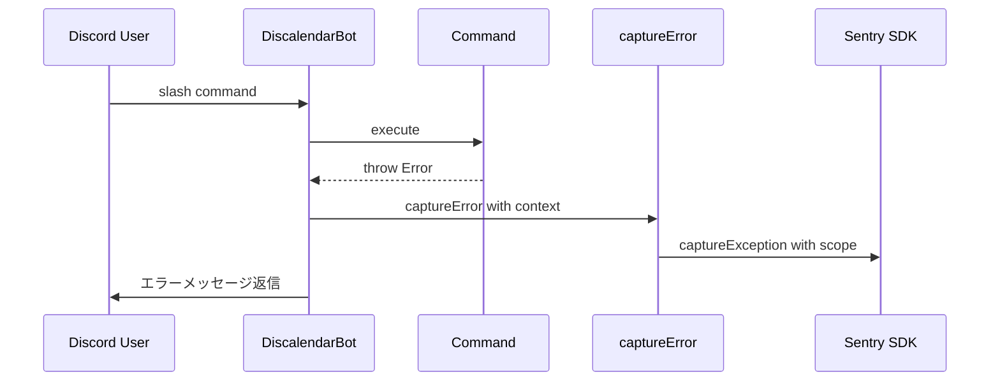

# Design Document: Sentry Bot Integration

## Overview

Discord Bot (`packages/bot`) に `@sentry/node` を導入し、Bot側のエラーをSentryで一元管理する機能。Web側では既にSentry統合が完了しており、同一ダッシュボードでの監視を実現する。

**Purpose**: Bot のエラー監視を Sentry に統合し、Web と Bot のエラーを同一ダッシュボードで確認可能にする。
**Users**: 開発チームが運用監視・障害対応に使用する。
**Impact**: Bot の `config.ts` に既存の `sentryDsn` プレースホルダーを活用し、SDK 初期化とエラー捕捉を追加する。

### Goals
- Bot プロセスで `@sentry/node` を初期化し、エラーを自動報告
- コマンド実行・イベントハンドラ・未捕捉エラーを包括的に捕捉
- `service: "bot"` タグで Web 側エラーと区別

### Non-Goals
- パフォーマンストレーシングの詳細設定（基本的な `tracesSampleRate` のみ）
- Sentry のアラートルール・通知チャネル設定（Sentry ダッシュボード側の作業）
- Bot 固有の Sentry プロジェクト分離（同一プロジェクトを使用）

## Architecture

### Existing Architecture Analysis

現在の Bot アーキテクチャ:
- `index.ts` → `DiscalendarBot` クラス（`bot.ts`）がエントリポイント
- `bot.ts` 内の `handleInteraction` で全コマンド・モーダルの try-catch + `logger.error`
- `registerEventHandlers` でギルドイベントの try-catch + `logger.error`
- `config.ts` に `sentryDsn: string | undefined` が既に定義済み（`SENTRY_DSN` 環境変数から読み取り）

既存パターンの各 catch ブロックに `captureException` を追加する形で統合する。

### Architecture Pattern & Boundary Map



**Architecture Integration**:
- Selected pattern: ユーティリティラッパー方式 — `captureError` 関数で logger と Sentry を一元化（詳細は `research.md` を参照）
- Domain boundaries: Sentry 関連コードは `src/utils/sentry.ts` と `src/instrument.ts` に集約
- Existing patterns preserved: 既存の try-catch + `logger.error` + `safeReplyError` フロー
- New components: `instrument.ts`（SDK初期化）、`sentry.ts`（エラー捕捉ユーティリティ）
- Steering compliance: Bot の既存ユーティリティパターン（`src/utils/`）に従う

### Technology Stack

| Layer | Choice / Version | Role in Feature | Notes |
|-------|------------------|-----------------|-------|
| Error Monitoring | `@sentry/node` latest | SDK初期化・エラー捕捉・送信 | dependencies に追加 |
| Runtime | Node.js 18+ (ESM) | Bot プロセス実行環境 | 既存 |
| Config | `config.ts` | DSN・環境変数管理 | 既存の `sentryDsn` を活用 |

## System Flows

### Bot起動時のSentry初期化フロー



### コマンドエラー捕捉フロー



## Requirements Traceability

| Requirement | Summary | Components | Interfaces | Flows |
|-------------|---------|------------|------------|-------|
| 1.1 | DSNでSDK初期化 | instrument.ts | initSentry | 起動フロー |
| 1.2 | environment/tracesSampleRate設定 | instrument.ts | SentryConfig | 起動フロー |
| 1.3 | DSN未設定時スキップ | instrument.ts | initSentry | 起動フロー |
| 1.4 | release情報付与 | instrument.ts | SentryConfig | — |
| 2.1 | コマンドエラー捕捉 | bot.ts, sentry.ts | captureError | エラーフロー |
| 2.2 | コマンドコンテキスト付与 | sentry.ts | ErrorContext | エラーフロー |
| 2.3 | 既存エラーレスポンス維持 | bot.ts | — | エラーフロー |
| 3.1 | イベントハンドラエラー捕捉 | bot.ts, sentry.ts | captureError | エラーフロー |
| 3.2 | イベントコンテキスト付与 | sentry.ts | ErrorContext | エラーフロー |
| 4.1 | unhandledRejection捕捉 | instrument.ts | — | 起動フロー |
| 4.2 | uncaughtException捕捉 | instrument.ts | — | 起動フロー |
| 4.3 | プロセス終了前フラッシュ | index.ts | — | シャットダウン |
| 5.1 | 同一DSN構成 | instrument.ts | SentryConfig | — |
| 5.2 | serviceタグ付与 | instrument.ts | SentryConfig | — |

## Components and Interfaces

| Component | Domain/Layer | Intent | Req Coverage | Key Dependencies | Contracts |
|-----------|-------------|--------|--------------|------------------|-----------|
| instrument.ts | Infrastructure | Sentry SDK 初期化 | 1.1-1.4, 4.1-4.2, 5.1-5.2 | @sentry/node (P0), config.ts (P0) | Service |
| sentry.ts | Utils | エラー捕捉ユーティリティ | 2.1-2.2, 3.1-3.2 | @sentry/node (P0) | Service |
| bot.ts (変更) | Core | エラーハンドラに captureError 追加 | 2.1-2.3, 3.1-3.2 | sentry.ts (P0) | — |
| index.ts (変更) | Entry | instrument インポート + シャットダウンフラッシュ | 1.1, 4.3 | instrument.ts (P0) | — |

### Infrastructure

#### instrument.ts

| Field | Detail |
|-------|--------|
| Intent | Bot プロセス起動時に Sentry SDK を初期化する |
| Requirements | 1.1, 1.2, 1.3, 1.4, 4.1, 4.2, 5.1, 5.2 |

**Responsibilities & Constraints**
- `Sentry.init()` の呼び出しを一元管理
- DSN 未設定時はグレースフルにスキップ（Bot の正常起動を妨げない）
- `index.ts` の最初のインポートとして読み込まれる必要がある

**Dependencies**
- External: `@sentry/node` — SDK 初期化 API (P0)
- Inbound: `config.ts` — `sentryDsn`, 環境変数 (P0)

**Contracts**: Service [x]

##### Service Interface
```typescript
type SentryConfig = {
  dsn: string | undefined;
  environment: string;
  release: string;
  tracesSampleRate: number;
  enabled: boolean;
  serviceName: string;
};

/** Sentry SDK を初期化する。DSN が未設定の場合は no-op。 */
function initSentry(): void;
```
- Preconditions: `getConfig()` が呼び出し可能な状態
- Postconditions: DSN 設定時は Sentry SDK が有効化、未設定時は無効のまま
- Invariants: 初期化は 1 回のみ実行

**Implementation Notes**
- `getConfig().sentryDsn` から DSN を取得
- `environment` は `NODE_ENV` から取得（デフォルト `"production"`）
- `release` は `package.json` の `name@version` 形式
- `initialScope.tags` に `{ service: "bot" }` を設定（5.2）
- `@sentry/node` は `unhandledRejection`/`uncaughtException` をデフォルトで捕捉する（4.1, 4.2）

### Utils

#### sentry.ts

| Field | Detail |
|-------|--------|
| Intent | Sentry へのエラー報告をコンテキスト付きで実行するユーティリティ |
| Requirements | 2.1, 2.2, 3.1, 3.2 |

**Responsibilities & Constraints**
- `Sentry.captureException` のラッパーとしてコンテキスト情報を付与
- Sentry 未初期化時（DSN未設定）は no-op として動作

**Dependencies**
- External: `@sentry/node` — `captureException`, `withScope` (P0)

**Contracts**: Service [x]

##### Service Interface
```typescript
type ErrorContext = {
  /** エラーの発生源（"command", "event", "modal", "task" 等） */
  source: string;
  /** コマンド名またはイベント名 */
  name?: string;
  /** Discord ギルドID */
  guildId?: string;
  /** Discord ユーザーID */
  userId?: string;
  /** 追加のキーバリュー情報 */
  extra?: Record<string, unknown>;
};

/** エラーをコンテキスト情報付きで Sentry に報告する */
function captureError(error: unknown, context: ErrorContext): void;
```
- Preconditions: なし（Sentry 未初期化時は no-op）
- Postconditions: Sentry にエラーイベントが送信される（初期化済みの場合）

**Implementation Notes**
- `Sentry.withScope` でスコープを作成し、`context.source` をタグに、`guildId`/`userId`/`name` をコンテキストに設定
- `extra` フィールドは `scope.setExtras` で追加
- Sentry が無効の場合、`captureException` は内部的に no-op

### Core (変更)

#### bot.ts — handleInteraction / registerEventHandlers

| Field | Detail |
|-------|--------|
| Intent | 既存の catch ブロックに `captureError` 呼び出しを追加 |
| Requirements | 2.1, 2.2, 2.3, 3.1, 3.2 |

**Implementation Notes**
- `handleInteraction` の catch ブロック（コマンド実行エラー、モーダルエラー）: `captureError(error, { source: "command", name: interaction.commandName, guildId, userId })` を `logger.error` の直後に追加
- `registerEventHandlers` のギルドイベント catch ブロック: `captureError(error, { source: "event", name: "guildCreate", guildId })` を追加
- 既存の `safeReplyError` によるユーザー向けレスポンスは変更なし（2.3）

#### index.ts — エントリポイント

| Field | Detail |
|-------|--------|
| Intent | Sentry の早期初期化とシャットダウン時のフラッシュ |
| Requirements | 1.1, 4.3 |

**Implementation Notes**
- ファイル先頭で `import "./instrument.js"` を追加（他のインポートより前）
- `shutdown` 関数内で `await Sentry.close(2000)` を追加してイベントをフラッシュ（4.3）

## Error Handling

### Error Strategy
Sentry 統合自体のエラーは Bot の動作に影響を与えてはならない。

### Error Categories and Responses
- **Sentry SDK 初期化失敗**: `logger.warn` で記録し、Bot は正常起動を継続
- **captureException 送信失敗**: Sentry SDK 内部でハンドリング（Bot には影響なし）
- **DSN 未設定**: 正常動作。Sentry 機能が無効化されるのみ

## Testing Strategy

### Unit Tests
- `instrument.ts`: DSN 設定時に `Sentry.init` が正しいオプションで呼ばれることを検証
- `instrument.ts`: DSN 未設定時に `Sentry.init` が呼ばれないことを検証
- `sentry.ts`: `captureError` が `Sentry.withScope` + `captureException` を正しく呼び出すことを検証
- `sentry.ts`: コンテキスト情報（source, guildId, userId）がスコープに設定されることを検証

### Integration Tests
- `bot.ts`: コマンド実行エラー時に `captureError` が呼ばれることを検証
- `bot.ts`: イベントハンドラエラー時に `captureError` が呼ばれることを検証
- `bot.ts`: エラー発生後も `safeReplyError` が正常に実行されることを検証
