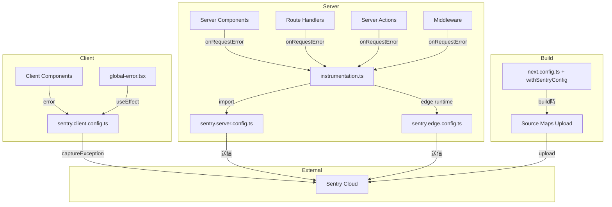
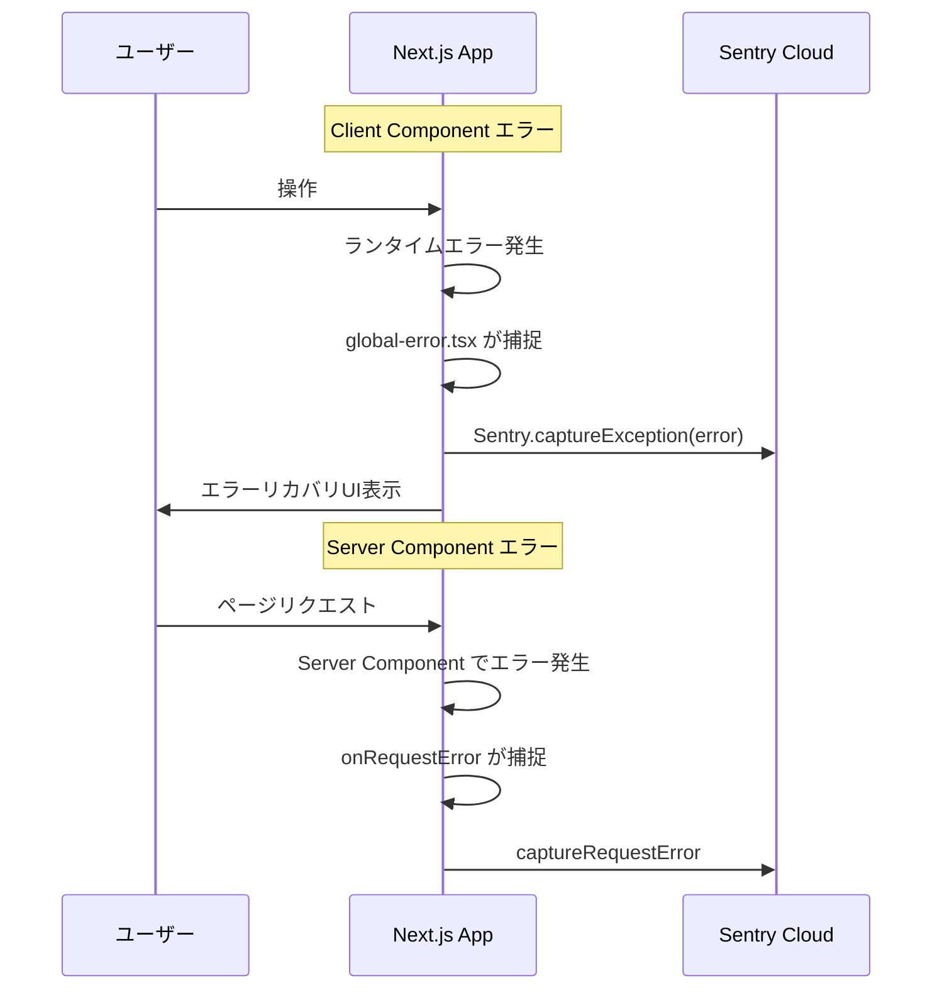
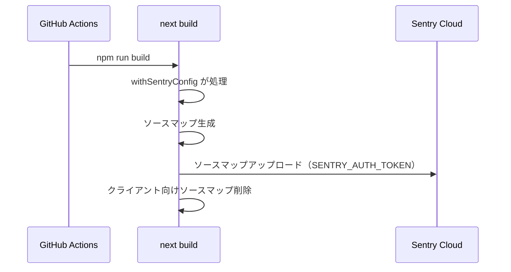

# Design Document: Sentry Error Monitoring

## Overview

**Purpose**: Sentryによるエラー監視基盤を導入し、本番環境で発生するエラーの自動捕捉・通知・デバッグを可能にする。

**Users**: 開発者チームが本番環境の障害検知・原因特定・対応に利用する。

**Impact**: 現在`console.error`のみで記録されているエラーが、Sentryダッシュボードで一元管理・通知される状態に変わる。

### Goals
- Next.js App Routerの全レイヤー（Client/Server Components、Server Actions、Route Handlers、Middleware）でエラーを自動捕捉する
- ソースマップにより、元のTypeScriptソースコードでエラー箇所を特定可能にする
- 開発環境と本番環境を適切に分離し、ノイズを防止する

### Non-Goals
- パフォーマンスモニタリング（APM）の本格運用（`tracesSampleRate`は設定するが、ダッシュボード構築は対象外）
- Session Replay機能の導入
- Sentryアラートルール・通知チャネルの設定（Sentry管理画面での設定は対象外）
- カスタムエラーページのUIデザイン刷新（最小限の`global-error.tsx`のみ）

## Architecture

### Existing Architecture Analysis

現在のDiscalendarは以下の構成:
- `next.config.ts`: 画像リモートパターンのみの単純な設定
- エラー境界: `global-error.tsx`は存在しない
- サーバー計装: `instrumentation.ts`は存在しない
- 環境変数: Supabase関連のみ（`.env.example`）

変更はアプリケーションロジックに影響せず、インフラストラクチャ層への追加のみ。

### Architecture Pattern & Boundary Map



**Architecture Integration**:
- **Selected pattern**: Sentry公式の`instrumentation.ts`パターン（Next.js 15+推奨）
- **Domain boundaries**: Sentry設定はアプリケーションロジックから完全に分離。3つの設定ファイル（client/server/edge）がランタイム境界に対応
- **Existing patterns preserved**: `next.config.ts`のエクスポート構造、`.env`による環境変数管理
- **New components rationale**: Next.jsが公式に提供するエラー境界（`global-error.tsx`）と計装フック（`instrumentation.ts`）を活用

### Technology Stack

| Layer | Choice / Version | Role in Feature | Notes |
|-------|------------------|-----------------|-------|
| SDK | `@sentry/nextjs` ^8.x | エラー捕捉・送信・ビルド統合 | Next.js App Router対応の公式SDK |
| Infrastructure | Sentry Cloud (SaaS) | エラー集約・ダッシュボード・通知 | セルフホストは対象外 |
| Build | `withSentryConfig` | ソースマップアップロード、自動計装 | Webpack統合 |
| CI/CD | GitHub Actions | ビルド時ソースマップアップロード | 既存ci.ymlを拡張 |

## System Flows

### エラー捕捉フロー



### ビルド時ソースマップアップロードフロー



## Requirements Traceability

| Requirement | Summary | Components | Interfaces | Flows |
|-------------|---------|------------|------------|-------|
| 1.1 | SDK依存関係と初期化 | SentryClientConfig, SentryServerConfig, SentryEdgeConfig | Sentry.init | - |
| 1.2 | クライアント設定ファイル | SentryClientConfig | Sentry.init | - |
| 1.3 | サーバー設定ファイル | SentryServerConfig | Sentry.init | - |
| 1.4 | Edge設定ファイル | SentryEdgeConfig | Sentry.init | - |
| 1.5 | next.config.tsビルド統合 | NextConfigIntegration | withSentryConfig | ビルドフロー |
| 2.1 | クライアントエラー自動送信 | SentryClientConfig | captureException | エラー捕捉フロー |
| 2.2 | global-error.tsx統合 | GlobalErrorBoundary | captureException | エラー捕捉フロー |
| 2.3 | Error Boundaryコンテキスト送信 | GlobalErrorBoundary | captureException | エラー捕捉フロー |
| 3.1 | Server Componentsエラー送信 | InstrumentationHook | onRequestError | エラー捕捉フロー |
| 3.2 | Route Handlersエラー送信 | InstrumentationHook | onRequestError | エラー捕捉フロー |
| 3.3 | Server Actionsエラー送信 | InstrumentationHook | onRequestError | エラー捕捉フロー |
| 3.4 | instrumentation.ts初期化 | InstrumentationHook | register | - |
| 4.1 | ビルド時ソースマップアップロード | NextConfigIntegration | withSentryConfig | ビルドフロー |
| 4.2 | ソースマップ非公開 | NextConfigIntegration | withSentryConfig | ビルドフロー |
| 4.3 | CIソースマップアップロード | CIWorkflowUpdate | - | ビルドフロー |
| 5.1 | 開発環境での送信無効化 | SentryClientConfig, SentryServerConfig, SentryEdgeConfig | Sentry.init | - |
| 5.2 | 本番環境での送信有効化 | SentryClientConfig, SentryServerConfig, SentryEdgeConfig | Sentry.init | - |
| 5.3 | 環境変数管理 | EnvironmentConfig | - | - |
| 5.4 | .env.example文書化 | EnvironmentConfig | - | - |
| 5.5 | DSN未設定時グレースフル無効化 | SentryClientConfig, SentryServerConfig, SentryEdgeConfig | Sentry.init | - |

## Components and Interfaces

| Component | Domain/Layer | Intent | Req Coverage | Key Dependencies | Contracts |
|-----------|-------------|--------|--------------|------------------|-----------|
| SentryClientConfig | Infra/Client | クライアントサイドSentry初期化 | 1.1, 1.2, 2.1, 5.1, 5.2, 5.5 | `@sentry/nextjs` (P0) | Service |
| SentryServerConfig | Infra/Server | サーバーサイドSentry初期化 | 1.1, 1.3, 5.1, 5.2, 5.5 | `@sentry/nextjs` (P0) | Service |
| SentryEdgeConfig | Infra/Edge | EdgeランタイムSentry初期化 | 1.1, 1.4, 5.1, 5.2, 5.5 | `@sentry/nextjs` (P0) | Service |
| InstrumentationHook | Infra/Server | サーバーサイド計装登録とエラー捕捉 | 3.1, 3.2, 3.3, 3.4 | SentryServerConfig (P0), SentryEdgeConfig (P0) | Service |
| GlobalErrorBoundary | UI/Error | アプリ全体のエラー境界とSentry連携 | 2.2, 2.3 | `@sentry/nextjs` (P0) | State |
| NextConfigIntegration | Build/Config | next.config.tsのSentryビルド統合 | 1.5, 4.1, 4.2 | `@sentry/nextjs` (P0) | Service |
| EnvironmentConfig | Infra/Config | 環境変数の定義と文書化 | 5.3, 5.4 | - | - |
| CIWorkflowUpdate | CI/CD | GitHub ActionsへのSentry環境変数追加 | 4.3 | EnvironmentConfig (P1) | - |

### Infra/Client Layer

#### SentryClientConfig

| Field | Detail |
|-------|--------|
| Intent | ブラウザ環境でのSentry SDK初期化とエラー捕捉設定 |
| Requirements | 1.1, 1.2, 2.1, 5.1, 5.2, 5.5 |

**Responsibilities & Constraints**
- `sentry.client.config.ts`としてプロジェクトルートに配置
- DSN未設定時はSentryを無効化してアプリケーション起動を妨げない
- `NODE_ENV`に応じて`tracesSampleRate`を切り替え

**Dependencies**
- External: `@sentry/nextjs` — Sentry SDK (P0)

**Contracts**: Service [x]

##### Service Interface
```typescript
// sentry.client.config.ts
import * as Sentry from "@sentry/nextjs";

// Sentry.init() の設定型
interface SentryClientOptions {
  dsn: string | undefined;
  enabled: boolean;
  tracesSampleRate: number;
  environment: string;
}
```
- Preconditions: `NEXT_PUBLIC_SENTRY_DSN`環境変数がブラウザコンテキストでアクセス可能
- Postconditions: DSNが有効な場合、クライアントエラーがSentryに送信される
- Invariants: DSN未設定時は`enabled: false`となり、エラー送信は発生しない

### Infra/Server Layer

#### SentryServerConfig

| Field | Detail |
|-------|--------|
| Intent | Node.jsサーバーランタイムでのSentry SDK初期化 |
| Requirements | 1.1, 1.3, 5.1, 5.2, 5.5 |

**Responsibilities & Constraints**
- `sentry.server.config.ts`としてプロジェクトルートに配置
- `instrumentation.ts`の`register()`から動的importされる
- SentryClientConfigと同一のDSN・環境分離ロジックを適用

**Dependencies**
- External: `@sentry/nextjs` — Sentry SDK (P0)
- Inbound: InstrumentationHook — 動的import (P0)

**Contracts**: Service [x]

##### Service Interface
```typescript
// sentry.server.config.ts
import * as Sentry from "@sentry/nextjs";

// SentryClientOptions と同一構造
interface SentryServerOptions {
  dsn: string | undefined;
  enabled: boolean;
  tracesSampleRate: number;
  environment: string;
}
```

#### SentryEdgeConfig

| Field | Detail |
|-------|--------|
| Intent | EdgeランタイムでのSentry SDK初期化 |
| Requirements | 1.1, 1.4, 5.1, 5.2, 5.5 |

**Responsibilities & Constraints**
- `sentry.edge.config.ts`としてプロジェクトルートに配置
- `instrumentation.ts`の`register()`からEdgeランタイム時に動的importされる

**Dependencies**
- External: `@sentry/nextjs` — Sentry SDK (P0)
- Inbound: InstrumentationHook — 動的import (P0)

**Contracts**: Service [x]

##### Service Interface
SentryServerConfigと同一の設定構造。

#### InstrumentationHook

| Field | Detail |
|-------|--------|
| Intent | Next.js instrumentation hookによるサーバーサイドSentry登録とエラー捕捉 |
| Requirements | 3.1, 3.2, 3.3, 3.4 |

**Responsibilities & Constraints**
- `instrumentation.ts`としてプロジェクトルート（または`src/`）に配置
- `register()`関数で`NEXT_RUNTIME`に応じたSentry設定を動的import
- `onRequestError`エクスポートでServer Components/Route Handlers/Middlewareのエラーを自動捕捉

**Dependencies**
- Outbound: SentryServerConfig — Node.jsランタイム初期化 (P0)
- Outbound: SentryEdgeConfig — Edgeランタイム初期化 (P0)

**Contracts**: Service [x]

##### Service Interface
```typescript
// instrumentation.ts
export async function register(): Promise<void>;
export const onRequestError: typeof Sentry.captureRequestError;
```
- Preconditions: Next.jsの`instrumentation`フックが有効（Next.js 15+でデフォルト有効）
- Postconditions: サーバーサイドのSentry SDKが初期化され、リクエストエラーが自動捕捉される

### UI/Error Layer

#### GlobalErrorBoundary

| Field | Detail |
|-------|--------|
| Intent | アプリケーション全体のReactエラー境界とSentryエラーレポート |
| Requirements | 2.2, 2.3 |

**Responsibilities & Constraints**
- `app/global-error.tsx`として配置（`"use client"`）
- ルートレイアウトを置換するため`<html>`と`<body>`タグを含む
- `useEffect`内で`Sentry.captureException(error)`を呼び出す
- リカバリ用の`reset()`ボタンを提供

**Dependencies**
- External: `@sentry/nextjs` — captureException (P0)

**Contracts**: State [x]

##### State Management
```typescript
interface GlobalErrorProps {
  error: Error & { digest?: string };
  reset: () => void;
}
```
- State model: Reactのエラー境界ライフサイクルに準拠
- エラー発生 → `useEffect`でSentry送信 → ユーザーにリカバリUI表示

**Implementation Notes**
- プロジェクトのTailwind CSSスタイルはルートレイアウト外のため適用不可。最小限のインラインスタイルまたはHTML属性で対応
- `error.digest`はServer Componentエラーのハッシュ（セキュリティ上、詳細はサーバーサイドのみ）

### Build/Config Layer

#### NextConfigIntegration

| Field | Detail |
|-------|--------|
| Intent | next.config.tsへのSentryビルド統合とソースマップ設定 |
| Requirements | 1.5, 4.1, 4.2 |

**Responsibilities & Constraints**
- 既存の`next.config.ts`を`withSentryConfig`でラップ
- ソースマップはSentryにのみアップロードし、クライアントには公開しない
- `SENTRY_AUTH_TOKEN`未設定時はソースマップアップロードをスキップ

**Dependencies**
- External: `@sentry/nextjs` — withSentryConfig (P0)

**Contracts**: Service [x]

##### Service Interface
```typescript
// next.config.ts に追加する withSentryConfig オプション
interface SentryBuildOptions {
  org: string | undefined;
  project: string | undefined;
  authToken: string | undefined;
  silent: boolean;
  widenClientFileUpload: boolean;
  hideSourceMaps: boolean;
}
```
- Preconditions: `SENTRY_ORG`、`SENTRY_PROJECT`、`SENTRY_AUTH_TOKEN`が設定済み
- Postconditions: ビルド成果物にソースマップが含まれず、Sentryに直接アップロードされる

### Infra/Config Layer

#### EnvironmentConfig

| Field | Detail |
|-------|--------|
| Intent | Sentry関連環境変数の定義と文書化 |
| Requirements | 5.3, 5.4 |

**環境変数一覧**

| 変数名 | スコープ | 必須 | 用途 |
|--------|---------|------|------|
| `NEXT_PUBLIC_SENTRY_DSN` | Client + Server | Yes（本番） | Sentry DSN |
| `SENTRY_AUTH_TOKEN` | Build only | Yes（CI） | ソースマップアップロード認証 |
| `SENTRY_ORG` | Build only | Yes（CI） | Sentry Organization slug |
| `SENTRY_PROJECT` | Build only | Yes（CI） | Sentry Project slug |

### CI/CD Layer

#### CIWorkflowUpdate

| Field | Detail |
|-------|--------|
| Intent | GitHub Actions CIワークフローへのSentry環境変数追加 |
| Requirements | 4.3 |

**変更対象**: `.github/workflows/ci.yml`
- `Build`ステップの`env`に`SENTRY_AUTH_TOKEN`、`SENTRY_ORG`、`SENTRY_PROJECT`を追加
- これらはGitHub Secretsから参照

## Error Handling

### Error Strategy
Sentry自体のエラー（初期化失敗、送信失敗等）はアプリケーションの動作を妨げてはならない。

### Error Categories and Responses
- **DSN未設定**: Sentryを無効化し、アプリケーションは正常起動（`enabled: false`）
- **Sentry送信失敗**: SDK内部でリトライ・バッファリングされる。アプリケーション側での追加処理は不要
- **ソースマップアップロード失敗**: CIビルドのログに警告を出力するが、ビルド自体は失敗させない（`withSentryConfig`のデフォルト挙動）

## Testing Strategy

### Unit Tests
- `sentry.client.config.ts`: DSN設定時にSentry.initが呼ばれることを確認
- `sentry.client.config.ts`: DSN未設定時にSentryが無効化されることを確認
- `global-error.tsx`: エラー発生時にcaptureExceptionが呼ばれることを確認

### Integration Tests
- `instrumentation.ts`: `register()`がNode.jsランタイムで`sentry.server.config`をimportすることを確認
- `instrumentation.ts`: `register()`がEdgeランタイムで`sentry.edge.config`をimportすることを確認
- `next.config.ts`: `withSentryConfig`でラップされた設定がビルドエラーを起こさないことを確認

### E2E Tests
- ビルド成功確認: `npm run build`がSentry統合後もエラーなく完了すること
- 開発サーバー起動確認: DSN未設定の状態で`npm run dev`が正常起動すること

## Security Considerations
- `SENTRY_AUTH_TOKEN`はサーバーサイド/ビルド時のみ使用し、クライアントに公開しない
- `NEXT_PUBLIC_SENTRY_DSN`はクライアントに公開されるが、DSNは公開情報として設計されている（送信先のみを示す）
- ソースマップはSentryにのみアップロードし、クライアントには配信しない（`hideSourceMaps: true`）
- `sendDefaultPii: false`をデフォルトとし、個人情報の自動収集を避ける
