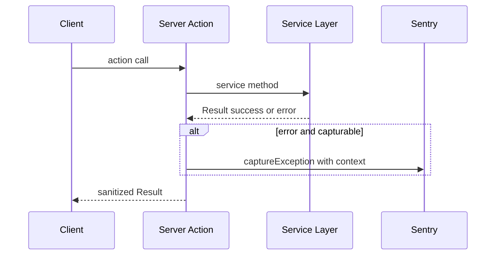

# Design Document: sentry-server-actions-capture

## Overview

**Purpose**: 全 Server Actions のエラーパスで `captureException` を呼び出し、Sentry への構造化エラー報告を網羅する。
**Users**: 運用担当者がSentryダッシュボードで本番エラーを監視・対応する。
**Impact**: 既存の `app/dashboard/actions.ts`（3箇所のみ）と `app/auth/actions.ts`（0箇所）のエラーキャプチャカバレッジを拡大する。

### Goals
- 全 Server Actions のサービス層・外部APIエラーを Sentry に報告する
- エラーメッセージに操作コンテキスト（操作名、リソース情報）を含める
- 既存の Result 型パターンと captureException フォーマットとの一貫性を維持する

### Non-Goals
- バリデーションエラー（入力不正）や認証エラー（未認証・権限不足）の Sentry 報告
- サービス層（`lib/`）内部のエラーハンドリング変更
- 新しいエラー分類・集約パターンの導入

## Architecture

### Existing Architecture Analysis

現在のエラーハンドリングフロー:

1. **Server Action** が **サービス層**（`lib/calendar/event-service.ts` 等）を呼び出す
2. サービス層は `classifySupabaseError` でエラーを分類し、`{ success: false, error: { code, message, details } }` を返す
3. Server Action は `sanitizeResult()` で `details` を除去してクライアントに返す
4. **現状の問題**: ステップ2と3の間で `captureException` が呼ばれていない箇所が多数存在

既存の captureException パターン（`app/dashboard/actions.ts`）:
```typescript
captureException(
  new Error(`[resolveServerAuth] user_guilds upsert failed: ${syncResult.error.message}`)
);
```

### Architecture Pattern & Boundary Map

**Selected pattern**: 既存の Server Action → Service 層パターンを維持し、Server Action 内のエラーパスに `captureException` を追加するのみ。



**Key Decisions**:
- サービス層は変更しない（既存の Result 型パターンを尊重）
- `sanitizeResult()` の前にキャプチャする（`details` フィールドをエラーメッセージに含めるため）
- バリデーション・認証エラーはキャプチャ対象外（Sentry ノイズ防止）

### Technology Stack

| Layer | Choice / Version | Role in Feature | Notes |
|-------|------------------|-----------------|-------|
| Error Tracking | @sentry/nextjs (既存) | captureException API | 追加インストール不要 |
| Server Actions | Next.js 16 App Router | エラーキャプチャの実行コンテキスト | 既存ファイルの修正のみ |

## Requirements Traceability

| Requirement | Summary | Components | Interfaces |
|-------------|---------|------------|------------|
| 1.1 | DB操作失敗のキャプチャ | dashboard/actions.ts | captureException |
| 1.2 | 認証操作失敗のキャプチャ | auth/actions.ts | captureException |
| 1.3 | classifySupabaseError との連携 | dashboard/actions.ts | エラーメッセージにcode含有 |
| 1.4 | 全Server Actionsカバー | auth/actions.ts, dashboard/actions.ts | — |
| 2.1 | 操作名のメッセージ含有 | 全対象Action | `[actionName]` prefix |
| 2.2 | リソース情報のメッセージ含有 | 全対象Action | error.message 連結 |
| 2.3 | 既存フォーマット一貫性 | 全対象Action | `[op] detail: ${msg}` |
| 3.1 | Error構成フォーマット | 全対象Action | new Error pattern |
| 3.2 | Result型パターン維持 | 全対象Action | 既存return文変更なし |
| 3.3 | console.error置換 | auth/actions.ts, updateNotificationChannel | captureException追加 |

## Components and Interfaces

| Component | Domain/Layer | Intent | Req Coverage | Key Dependencies |
|-----------|-------------|--------|--------------|------------------|
| auth/actions.ts | Auth / Server Action | signOut のエラーキャプチャ追加 | 1.2, 2.1, 3.3 | @sentry/nextjs (P0) |
| dashboard/actions.ts | Dashboard / Server Action | 全エラーパスのキャプチャ追加 | 1.1, 1.3, 1.4, 2.1, 2.2, 2.3, 3.1, 3.2 | @sentry/nextjs (P0) |

### Auth Layer

#### auth/actions.ts

| Field | Detail |
|-------|--------|
| Intent | signOut のエラーを Sentry にキャプチャする |
| Requirements | 1.2, 2.1, 3.3 |

**Responsibilities & Constraints**
- `console.error` に加えて `captureException` を追加する
- 既存の redirect フローは変更しない

**Contracts**: Service [x]

##### Service Interface

```typescript
// 変更箇所: signOut 内の error ハンドリング
// Before:
//   console.error("[Auth Error] signOut failed:", error.message);
// After:
//   console.error("[Auth Error] signOut failed:", error.message);
//   captureException(new Error(`[signOut] failed: ${error.message}`));
```

**Implementation Notes**
- `@sentry/nextjs` の import を追加
- 既存の console.error は維持（開発時デバッグ用）

### Dashboard Layer

#### dashboard/actions.ts

| Field | Detail |
|-------|--------|
| Intent | サービス層エラーの captureException を全エラーパスに追加する |
| Requirements | 1.1, 1.3, 1.4, 2.1, 2.2, 2.3, 3.1, 3.2 |

**Responsibilities & Constraints**
- `sanitizeResult()` を呼ぶ前にキャプチャする（details 情報を保持するため）
- バリデーション・認証エラー（VALIDATION_ERROR, UNAUTHORIZED, PERMISSION_DENIED）はキャプチャ対象外
- 既存の `captureException` 呼び出し（3箇所）は変更しない

**Contracts**: Service [x]

##### Capture Target Actions

以下のアクションにエラーパスの captureException を追加:

| Action | エラー発生箇所 | キャプチャメッセージ |
|--------|--------------|---------------------|
| `updateGuildConfig` | service.upsertGuildConfig 失敗 | `[updateGuildConfig] upsert failed: ${msg}` |
| `updateNotificationChannel` | service.upsertEventSettings 失敗 | `[updateNotificationChannel] upsert failed: ${msg}` |
| `togglePublicCalendar` | enable/disable 失敗 | `[togglePublicCalendar] ${op} failed: ${msg}` |
| `regeneratePublicSlugAction` | regeneratePublicSlug 失敗 | `[regeneratePublicSlugAction] failed: ${msg}` |
| `getOrCreateIcsFeedToken` | サービス失敗 | `[getOrCreateIcsFeedToken] failed: ${msg}` |
| `regenerateIcsFeedToken` | サービス失敗 | `[regenerateIcsFeedToken] failed: ${msg}` |
| `fetchGuildChannels` | Discord API / DB 失敗 | `[fetchGuildChannels] failed: ${msg}` |
| `refreshGuilds` | fetchGuilds 失敗 | `[refreshGuilds] failed: ${msg}` |
| `getAttachmentUrlsAction` | サービス失敗 | `[getAttachmentUrlsAction] failed: ${msg}` |

##### Error Message Format

```typescript
// 共通パターン: sanitizeResult の前にキャプチャ
const result = await service.someOperation(args);
if (!result.success) {
  captureException(
    new Error(`[actionName] operation failed: ${result.error.message}`)
  );
  return sanitizeResult(result);
}
```

**Implementation Notes**
- 既存の `captureException` import は既にある
- `sanitizeResult` パターンを使うアクション: result.error にアクセスしてメッセージを構成
- 直接 error オブジェクトを返すアクション: error.message を使用
- `refreshGuilds` のエラーパスは `lib/guilds/fetch-guilds.ts` で既にキャプチャ済みのため除外（research.md R1 参照）

## Error Handling

### Error Strategy

エラーを2カテゴリに分類し、キャプチャ対象を限定:

| カテゴリ | 例 | Sentry報告 |
|---------|-----|-----------|
| ユーザー起因 | VALIDATION_ERROR, UNAUTHORIZED, PERMISSION_DENIED | なし |
| システム起因 | DB_ERROR, NETWORK_ERROR, UNKNOWN_ERROR | あり |

### Monitoring

- Sentry ダッシュボードで `[actionName]` プレフィックスによるグルーピングが可能
- 既存の `global-error.tsx` による未捕捉エラーのキャプチャと併用

## Testing Strategy

### Unit Tests
- `app/auth/actions.ts` の signOut エラー時に captureException が呼ばれることを検証
- `app/dashboard/actions.ts` の各対象アクションでサービスエラー時に captureException が呼ばれることを検証
- バリデーション・認証エラー時に captureException が呼ばれないことを検証

### Test Pattern

```typescript
// captureException のモック
vi.mock("@sentry/nextjs", () => ({
  captureException: vi.fn(),
}));

// サービスエラー時のキャプチャ検証
it("サービスエラー時にcaptureExceptionを呼ぶ", async () => {
  mockService.someMethod.mockResolvedValue({
    success: false,
    error: { code: "DB_ERROR", message: "connection failed" },
  });
  
  await someAction(input);
  
  expect(captureException).toHaveBeenCalledWith(
    expect.objectContaining({
      message: expect.stringContaining("[someAction]"),
    })
  );
});
```
