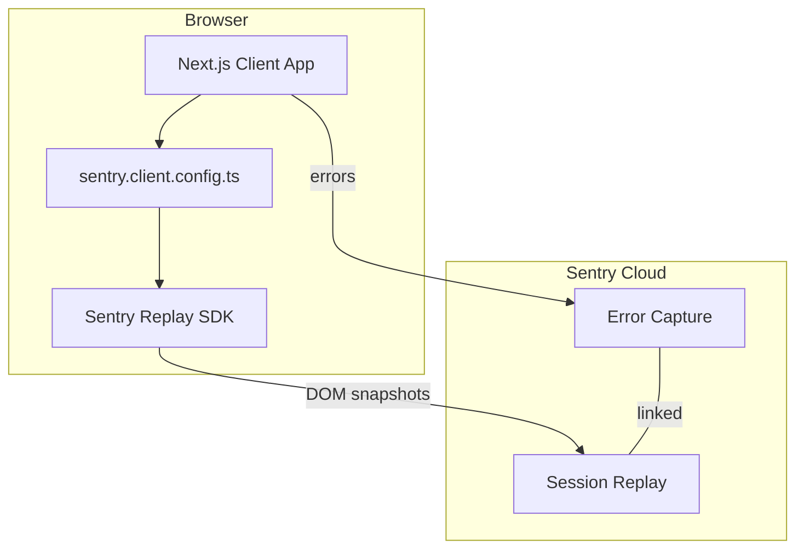

# Design Document: Sentry Session Replay

## Overview

**Purpose**: Sentry Session Replayを有効化し、エラー発生時にユーザーの操作を動画形式で再現できるようにする。
**Users**: 開発者がSentryダッシュボードでエラーのセッションリプレイを確認し、根本原因の調査を効率化する。
**Impact**: 既存の `sentry.client.config.ts` に Session Replay integration を追加。サーバー・Edge設定への変更なし。

### Goals
- Session Replayをクライアント設定に統合し、エラー時のユーザー操作を記録する
- コストとパフォーマンスのバランスを考慮したサンプリングレートを設定する
- ユーザーの個人情報をマスクしたプライバシー保護を実現する

### Non-Goals
- `sentry.server.config.ts` / `sentry.edge.config.ts` の変更（Replayはクライアント専用）
- `instrumentation-client.ts` への移行（既存パターンを維持）
- Session Replayの高度なカスタマイズ（カスタムマスク、ネットワーク記録等）

## Architecture

### Existing Architecture Analysis

現在のSentry構成は3つの設定ファイルに分離されている:
- `sentry.client.config.ts` — ブラウザ環境（変更対象）
- `sentry.server.config.ts` — Node.jsサーバー
- `sentry.edge.config.ts` — Edgeランタイム

`instrumentation.ts` がサーバー/Edgeの設定を動的importし、クライアント設定はNext.jsの `withSentryConfig` 経由で自動読み込みされる。

既存のクライアント設定:
- `enabled: Boolean(dsn) && isProduction` で環境分離済み
- `tracesSampleRate: 0.1` でパフォーマンスモニタリング設定済み
- `sendDefaultPii: false` でPII送信を抑制済み

### Architecture Pattern & Boundary Map



**Architecture Integration**:
- Selected pattern: 既存設定ファイルへの integration 追加（最小変更）
- 既存パターン維持: `sentry.*.config.ts` の分離構成を変更しない
- 新規コンポーネント: なし（既存ファイルの修正のみ）

### Technology Stack

| Layer | Choice / Version | Role in Feature | Notes |
|-------|------------------|-----------------|-------|
| Frontend | `@sentry/nextjs` ^10.39.0 | Session Replay SDK（同梱済み） | 追加パッケージ不要 |

## Requirements Traceability

| Requirement | Summary | Components | Interfaces | Flows |
|-------------|---------|------------|------------|-------|
| 1.1 | replayIntegration追加 | SentryClientConfig | Sentry.init integrations | — |
| 1.2 | 本番環境で記録開始 | SentryClientConfig | enabled フラグ | — |
| 1.3 | 開発環境で無効化 | SentryClientConfig | enabled フラグ | — |
| 2.1 | 通常セッション低サンプリング | SentryClientConfig | replaysSessionSampleRate | — |
| 2.2 | エラーセッション100%記録 | SentryClientConfig | replaysOnErrorSampleRate | — |
| 2.3 | エラー時リプレイ送信 | SentryClientConfig | replaysOnErrorSampleRate | — |
| 3.1 | テキストマスク | SentryClientConfig | replayIntegration maskAllText | — |
| 3.2 | メディアブロック | SentryClientConfig | replayIntegration blockAllMedia | — |
| 3.3 | 個人情報マスク | SentryClientConfig | maskAllText + maskAllInputs | — |

## Components and Interfaces

| Component | Domain/Layer | Intent | Req Coverage | Key Dependencies | Contracts |
|-----------|--------------|--------|--------------|------------------|-----------|
| SentryClientConfig | Infrastructure | Session Replay integrationの設定 | 1.1-1.3, 2.1-2.3, 3.1-3.3 | @sentry/nextjs (P0) | Service |

### Infrastructure

#### SentryClientConfig

| Field | Detail |
|-------|--------|
| Intent | 既存の `sentry.client.config.ts` に Session Replay integration を追加 |
| Requirements | 1.1, 1.2, 1.3, 2.1, 2.2, 2.3, 3.1, 3.2, 3.3 |

**Responsibilities & Constraints**
- `replayIntegration()` をSentry init の `integrations` 配列に追加
- サンプリングレートとプライバシー設定を適切に構成
- 既存の `enabled` フラグによる環境分離を維持

**Dependencies**
- External: `@sentry/nextjs` ^10.39.0 — Session Replay SDK同梱 (P0)

**Contracts**: Service [x]

##### Service Interface

```typescript
// sentry.client.config.ts の設定構造
import * as Sentry from "@sentry/nextjs";

interface SentryClientInitConfig {
  dsn: string | undefined;
  enabled: boolean;
  environment: string | undefined;
  tracesSampleRate: number;
  sendDefaultPii: false;
  // Session Replay 追加設定
  replaysSessionSampleRate: number;   // 0.1（通常セッション10%）
  replaysOnErrorSampleRate: number;   // 1.0（エラーセッション100%）
  integrations: [
    ReturnType<typeof Sentry.replayIntegration>
  ];
}

// replayIntegration のプライバシーオプション
interface ReplayPrivacyOptions {
  maskAllText: true;      // テキストをアスタリスクに置換
  maskAllInputs: true;    // フォーム入力をマスク
  blockAllMedia: true;    // 画像・動画をプレースホルダーに置換
}
```

**Implementation Notes**
- Integration: `import { init }` を `import * as Sentry` に変更し、`Sentry.init()` + `Sentry.replayIntegration()` を使用
- Validation: 変更後に `pnpm run build` でビルドエラーがないことを確認
- Risks: バンドルサイズの微増（Replay SDKの遅延読み込みはSentry内部で処理）

## Testing Strategy

### Unit Tests
- `sentry.client.config.ts` のモック検証は不要（設定ファイルのため）
- 既存の `__tests__/sentry/instrumentation.test.ts` が壊れないことを確認

### Integration Tests
- ビルド成功の確認（`pnpm run build`）
- 型チェック成功の確認（`pnpm run type-check`）

### Manual Verification
- 本番デプロイ後、Sentryダッシュボードで Session Replay セクションが表示されることを確認
- テストエラーを発生させ、リプレイが記録・表示されることを確認
- リプレイ内のテキスト・入力がマスクされていることを確認
