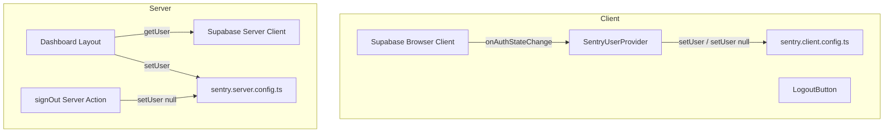
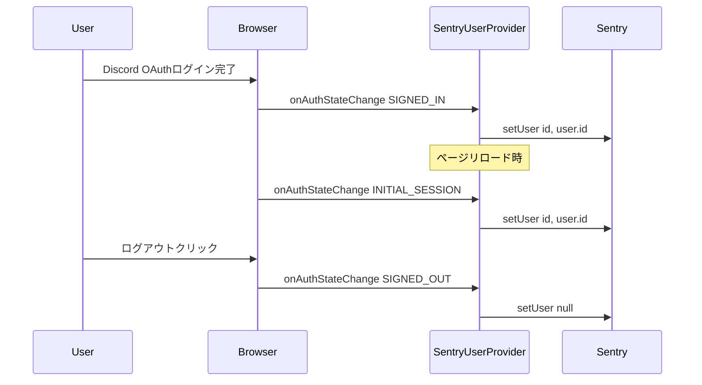

# Design Document

## Overview

**Purpose**: 認証済みユーザーをSentryに紐づけ、エラー発生時の影響ユーザーを特定可能にする。
**Users**: 運用者がSentryダッシュボードでユーザー単位の障害分析を行う。
**Impact**: 既存のSentry初期化設定（`sentry.*.config.ts`）は変更せず、認証フロー上にsetUser呼び出しを追加する。

### Goals
- Sentryイシューで影響を受けたユーザーを識別可能にする
- ログアウト後はユーザー情報がクリアされる
- `sendDefaultPii: false` を維持し、必要最小限のID情報のみ送信

### Non-Goals
- メールアドレスやユーザー名等のPIIをSentryに送信すること
- Discord Bot（`packages/bot`）へのSentry統合（Webアプリのみ対象）
- Sentryのパフォーマンスモニタリング設定の変更
- サーバーサイドの全Server Component/Actionでのユーザーコンテキスト設定（ダッシュボードレイアウトに限定）

## Architecture

### Existing Architecture Analysis

現在のSentry構成:
- `sentry.client.config.ts` / `sentry.server.config.ts` / `sentry.edge.config.ts` — 3ランタイムでSentry初期化
- `instrumentation.ts` — サーバー/Edge設定の動的import
- `app/global-error.tsx` — グローバルエラーキャプチャ
- 全設定で `sendDefaultPii: false`

認証フロー:
- クライアント: `lib/supabase/client.ts` の `createBrowserClient` でCookieベースセッション
- サーバー: `lib/supabase/server.ts` の `createClient()` → `getUser()` でリクエストごとにユーザー取得
- Middleware: `lib/supabase/proxy.ts` で `getClaims()` によるセッション更新（ここにコードを挟むのは禁止）

### Architecture Pattern & Boundary Map



**Architecture Integration**:
- **Selected pattern**: Observer（`onAuthStateChange`でクライアントサイド）、直接呼び出し（サーバーサイド）
- **Existing patterns preserved**: Sentry初期化ファイルは変更なし、Middlewareのコード制約を遵守
- **New components**: `SentryUserProvider` — クライアントサイドのsetUser/クリアを一元管理

### Technology Stack

| Layer | Choice / Version | Role in Feature | Notes |
|-------|------------------|-----------------|-------|
| Frontend | `@sentry/nextjs` ^10.39.0 | `setUser` / `setUser(null)` | 既存依存 |
| Frontend | `@supabase/ssr` | `onAuthStateChange` でログイン/ログアウトイベント検知 | 既存依存 |
| Backend | `@sentry/nextjs` ^10.39.0 | サーバーサイド `setUser` | 既存依存 |

新規依存なし。

## System Flows

### クライアントサイド認証状態同期フロー



## Requirements Traceability

| Requirement | Summary | Components | Interfaces | Flows |
|-------------|---------|------------|------------|-------|
| 1.1 | 認証後にsetUserを設定 | SentryUserProvider | onAuthStateChange | クライアント認証同期 |
| 1.2 | リロード時にユーザーコンテキスト復元 | SentryUserProvider | onAuthStateChange INITIAL_SESSION | クライアント認証同期 |
| 1.3 | SupabaseユーザーIDを含める | SentryUserProvider, DashboardLayout | setUser | — |
| 2.1 | ログアウト時にsetUser(null) | SentryUserProvider, signOut Action | setUser(null) | クライアント認証同期 |
| 2.2 | ログアウト後のエラーにユーザー情報なし | SentryUserProvider | — | — |
| 3.1 | sendDefaultPii: false維持 | sentry.*.config.ts（変更なし） | — | — |
| 3.2 | ユーザーIDのみ送信 | SentryUserProvider, DashboardLayout | setUser | — |
| 3.3 | サーバーサイドでも同様に設定 | DashboardLayout, signOut Action | setUser | — |

## Components and Interfaces

| Component | Domain/Layer | Intent | Req Coverage | Key Dependencies | Contracts |
|-----------|-------------|--------|--------------|-----------------|-----------|
| SentryUserProvider | Client / Provider | クライアントサイドでSentryユーザーコンテキストを認証状態と同期 | 1.1, 1.2, 1.3, 2.1, 2.2, 3.2 | Supabase Client (P0), @sentry/nextjs (P0) | State |
| DashboardLayout変更 | Server / Layout | サーバーサイドでSentryユーザーコンテキストを設定 | 1.3, 3.2, 3.3 | Supabase Server Client (P0), @sentry/nextjs (P0) | — |
| signOut Action変更 | Server / Action | ログアウト時にサーバーサイドのSentryユーザーコンテキストをクリア | 2.1, 3.3 | @sentry/nextjs (P0) | — |

### Client / Provider

#### SentryUserProvider

| Field | Detail |
|-------|--------|
| Intent | Supabase認証状態の変化を監視し、Sentryユーザーコンテキストを設定・クリアする |
| Requirements | 1.1, 1.2, 1.3, 2.1, 2.2, 3.2 |

**Responsibilities & Constraints**
- `onAuthStateChange` を購読し、SIGNED_IN / INITIAL_SESSION でsetUser、SIGNED_OUT でクリア
- children をそのまま返すProvider（UIレンダリングなし）
- ルートレイアウト（`app/layout.tsx`）に配置

**Dependencies**
- Inbound: なし
- Outbound: `@sentry/nextjs` — setUser API (P0)
- External: `@supabase/ssr` — onAuthStateChange (P0)

**Contracts**: State [x]

##### State Management
- State model: Supabase認証イベントからSentryへの単方向同期（Reactのstateは保持しない）
- Persistence: Sentryのグローバルスコープに保持される
- Concurrency: onAuthStateChangeコールバック内で同期的にsetUserを呼ぶ

**Implementation Notes**
- `"use client"` ディレクティブが必要
- `useEffect` 内で `onAuthStateChange` を購読し、クリーンアップで解除
- setUserに渡すオブジェクトは `{ id: session.user.id }` のみ
- `app/layout.tsx` の `PostHogProvider` と同階層に配置

```typescript
// SentryUserProviderの型定義
type SentryUserProviderProps = {
  children: React.ReactNode;
};
```

### Server / Layout

#### DashboardLayout変更

| Field | Detail |
|-------|--------|
| Intent | サーバーサイドでSentryユーザーコンテキストを認証済みユーザーのIDで設定 |
| Requirements | 1.3, 3.2, 3.3 |

**Implementation Notes**
- 既存の `getUser()` 呼び出し後に `Sentry.setUser({ id: user.id })` を追加
- 新しいファイルや関数は不要、既存コードへの2行追加

### Server / Action

#### signOut Action変更

| Field | Detail |
|-------|--------|
| Intent | ログアウト時にサーバーサイドのSentryユーザーコンテキストをクリア |
| Requirements | 2.1, 3.3 |

**Implementation Notes**
- `supabase.auth.signOut()` の前に `Sentry.setUser(null)` を呼ぶ
- 新しいファイルや関数は不要、既存コードへの2行追加（import + setUser呼び出し）

## Error Handling

### Error Strategy
- SentryのsetUser呼び出し自体がエラーを投げることは想定しない（Sentry SDKの仕様）
- onAuthStateChange内でのエラーは既存のSentryエラーキャプチャで自動報告される
- setUserが設定される前のエラーはユーザーコンテキストなしでキャプチャされる（許容範囲）

## Testing Strategy

### Unit Tests
- `SentryUserProvider`: onAuthStateChange の SIGNED_IN / SIGNED_OUT イベントで setUser / setUser(null) が呼ばれることを検証
- `SentryUserProvider`: INITIAL_SESSION イベントでsetUserが呼ばれることを検証（リロードケース）
- `SentryUserProvider`: アンマウント時にonAuthStateChangeの購読が解除されることを検証
- `signOut Action`: Sentry.setUser(null) が呼ばれることを検証

### Integration Tests
- ダッシュボードレイアウトで認証済みユーザーのIDがSentry.setUserに渡されることを検証

## Security Considerations

- `sendDefaultPii: false` を全ランタイムで維持（既存設定を変更しない）
- setUserに渡す情報はSupabaseユーザーID（UUID）のみ。メールアドレス、ユーザー名、IPアドレス等は含めない
- UUIDは直接的な個人識別情報ではないが、Supabaseダッシュボードと照合すればユーザーを特定可能
