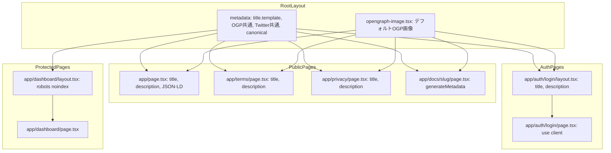

# Technical Design: SEO Optimization

## Overview

**Purpose**: メタタグ・OGP・Twitter Card・JSON-LD構造化データを各公開ページに設定し、SNSシェア時のリッチプレビュー表示と検索エンジンでの表示品質を向上させる。

**Users**: Discalendarの訪問者・利用者がSNSでURLをシェアする際、およびGoogle等の検索エンジンがDiscalendarをクロールする際に効果を発揮する。

**Impact**: 現在のルートlayout.tsxに最低限設定されているtitle/descriptionを拡張し、OGP・Twitter Card・JSON-LD・robots・canonical URLを全公開ページに追加する。

### Goals
- すべての公開ページに統一フォーマットのメタデータを設定する
- SNSシェア時にリッチプレビュー（OGP画像・タイトル・説明）を表示する
- 検索エンジンがサービス情報を正確に理解できる構造化データを提供する
- Lighthouse SEOスコア90以上を達成する

### Non-Goals
- 保護ページ（dashboard配下）のSEO最適化（noindexで除外）
- 多言語対応（hreflang）— 現在は日本語のみ
- サイトマップ生成（別イシューで対応）
- パフォーマンス最適化（Core Web Vitals）— SEOスコアのみ対象

## Architecture

### Existing Architecture Analysis

現在のメタデータ構成:
- `app/layout.tsx`: `metadataBase`（VERCEL_URLベース）、基本title/description、icon、manifest、appleWebApp
- `app/page.tsx`, `app/terms/page.tsx`, `app/privacy/page.tsx`: 静的`metadata` export（title/descriptionのみ）
- `app/docs/[slug]/page.tsx`: `generateMetadata`で動的title/description
- `app/auth/login/page.tsx`: `"use client"`のためメタデータなし
- `app/dashboard/`: layoutファイルなし、robots設定なし

Next.js Metadata APIのマージ動作を活用し、ルートlayoutで共通設定、各ページで差分をオーバーライドするパターンを継続する。

### Architecture Pattern & Boundary Map



**Architecture Integration**:
- **Selected pattern**: Next.js Metadata APIのlayout階層マージ。ルートlayoutに共通OGP/Twitter設定を集約し、各ページはtitle/descriptionのみオーバーライド
- **Domain/feature boundaries**: SEOメタデータの責任はlayout/pageのmetadata exportに閉じる。コンポーネント層やサービス層には影響しない
- **Existing patterns preserved**: 既存のMetadata API使用パターン（静的export + generateMetadata）を維持
- **New components rationale**: `opengraph-image.tsx`（OGP画像生成）、`app/auth/login/layout.tsx`（loginメタデータ）、`app/dashboard/layout.tsx`（noindex設定）を新規追加
- **Steering compliance**: Next.js App Routerの規約に準拠、ファイルベース規約を優先

### Technology Stack

| Layer | Choice / Version | Role in Feature | Notes |
|-------|------------------|-----------------|-------|
| Frontend | Next.js 16 Metadata API | メタデータ設定・OGP/Twitter Card出力 | 既存利用 |
| Frontend | `next/og` ImageResponse | OGP画像の動的生成 | Next.js 16にバンドル済み |
| Frontend | satori（ImageResponse内部） | JSX→SVG→PNG変換 | カスタムフォント対応 |
| Assets | UniSansHeavy.otf | OGP画像のブランドフォント | `public/`に既存 |

追加の外部依存は不要。すべてNext.js組み込み機能で完結する。

## Requirements Traceability

| Requirement | Summary | Components | Interfaces | Flows |
|-------------|---------|------------|------------|-------|
| 1.1 | ランディングページのtitle/description/keywords | RootLayoutMetadata, LandingPageMetadata | Metadata export | — |
| 1.2 | 利用規約のtitle/description | TermsPageMetadata | Metadata export | — |
| 1.3 | プライバシーポリシーのtitle/description | PrivacyPageMetadata | Metadata export | — |
| 1.4 | ドキュメントの動的title/description | DocsPageMetadata | generateMetadata | — |
| 1.5 | ログインページのtitle/description | LoginLayoutMetadata | Metadata export | — |
| 1.6 | title形式の統一 | RootLayoutMetadata | title.template | — |
| 1.7 | metadataBaseのプロダクションURL設定 | RootLayoutMetadata | metadataBase | — |
| 2.1-2.5 | Open Graphメタデータ | RootLayoutMetadata | openGraph property | — |
| 3.1-3.3 | Twitter Cardメタデータ | RootLayoutMetadata | twitter property | — |
| 4.1-4.5 | OGP画像の動的生成 | OpenGraphImage | ImageResponse | OGP画像生成フロー |
| 5.1-5.5 | JSON-LD構造化データ | JsonLdScript | script tag | — |
| 6.1 | dashboard noindex | DashboardLayoutMetadata | robots property | — |
| 6.2 | 未認証リダイレクト | — | — | 既存動作維持 |
| 7.1 | Lighthouse SEO 90+ | — | — | テストで検証 |
| 7.2 | viewport設定 | — | — | Next.jsデフォルト提供 |
| 7.3 | canonical URL | RootLayoutMetadata | alternates.canonical | — |

## Components and Interfaces

| Component | Domain/Layer | Intent | Req Coverage | Key Dependencies | Contracts |
|-----------|-------------|--------|--------------|------------------|-----------|
| RootLayoutMetadata | Layout | ルートlayoutの共通メタデータ設定 | 1.1, 1.6, 1.7, 2.1-2.5, 3.1-3.3, 7.3 | — | State |
| LandingPageMetadata | Page | ランディングページ固有のメタデータ | 1.1 | RootLayoutMetadata (P0) | State |
| TermsPageMetadata | Page | 利用規約ページのメタデータ拡張 | 1.2 | RootLayoutMetadata (P0) | State |
| PrivacyPageMetadata | Page | プライバシーポリシーのメタデータ拡張 | 1.3 | RootLayoutMetadata (P0) | State |
| DocsPageMetadata | Page | ドキュメントページのメタデータ拡張 | 1.4 | RootLayoutMetadata (P0) | State |
| LoginLayoutMetadata | Layout | ログインページ用layout新規作成 | 1.5 | RootLayoutMetadata (P0) | State |
| DashboardLayoutMetadata | Layout | ダッシュボード用layout新規作成 | 6.1 | RootLayoutMetadata (P0) | State |
| OpenGraphImage | Metadata File | OGP画像の動的生成 | 4.1-4.5 | UniSansHeavy.otf (P0) | API |
| JsonLdScript | Page | JSON-LD構造化データの出力 | 5.1-5.5 | — | State |

### Layout / Metadata Layer

#### RootLayoutMetadata

| Field | Detail |
|-------|--------|
| Intent | ルートlayoutにOGP/Twitter Card/canonical/title.templateの共通設定を追加 |
| Requirements | 1.1, 1.6, 1.7, 2.1-2.5, 3.1-3.3, 7.3 |

**Responsibilities & Constraints**
- すべての公開ページに継承される共通メタデータの定義
- `metadataBase`をプロダクションURLに設定
- `title.template`で「%s | Discalendar」形式を統一
- OGP共通プロパティ（site_name, locale, type, image）を設定
- Twitter Card共通プロパティ（card, image）を設定

**Contracts**: State [x]

##### State Management

```typescript
// app/layout.tsx の metadata export を拡張
import type { Metadata } from "next";

const PRODUCTION_URL = "https://discalendar.app";
const defaultUrl =
  process.env.VERCEL_PROJECT_PRODUCTION_URL
    ? `https://${process.env.VERCEL_PROJECT_PRODUCTION_URL}`
    : process.env.VERCEL_URL
      ? `https://${process.env.VERCEL_URL}`
      : "http://localhost:3000";

export const metadata: Metadata = {
  metadataBase: new URL(defaultUrl),
  title: {
    default: "Discalendar - Discordコミュニティの予定管理をもっと便利に",
    template: "%s | Discalendar",
  },
  description: "Discordサーバーでイベントを簡単に管理できるカレンダーアプリケーション",
  keywords: ["Discord", "カレンダー", "予定管理", "イベント", "コミュニティ"],
  openGraph: {
    type: "website",
    siteName: "Discalendar",
    locale: "ja_JP",
  },
  twitter: {
    card: "summary_large_image",
  },
  alternates: {
    canonical: "/",
  },
  icons: {
    icon: "/icon.png",
  },
  manifest: "/manifest.webmanifest",
  appleWebApp: {
    capable: true,
    statusBarStyle: "default",
    title: "Discalendar",
  },
};
```

- **Persistence**: 静的metadata export。ビルド時に解決される
- **Concurrency**: N/A（静的設定）

**Implementation Notes**
- `title.default`はランディングページで使用（templateが適用されない）
- 各子ページが`title`を`string`で設定すると、自動的に`%s | Discalendar`形式になる
- `alternates.canonical`は`metadataBase`と結合されるため、相対パスで十分
- `openGraph.images`はルートの`opengraph-image.tsx`が自動設定するため省略

#### LoginLayoutMetadata

| Field | Detail |
|-------|--------|
| Intent | `app/auth/login/page.tsx`がClient Componentのため、layoutでメタデータを設定 |
| Requirements | 1.5 |

**Responsibilities & Constraints**
- loginページ固有のtitle/descriptionを設定
- childrenをそのままレンダリング（UI変更なし）

**Contracts**: State [x]

##### State Management

```typescript
// app/auth/login/layout.tsx（新規作成）
import type { Metadata } from "next";

export const metadata: Metadata = {
  title: "ログイン",
  description: "Discordアカウントでログインして、カレンダー管理を始めましょう。",
  alternates: {
    canonical: "/auth/login",
  },
};

export default function LoginLayout({
  children,
}: {
  children: React.ReactNode;
}) {
  return children;
}
```

**Implementation Notes**
- `title: "ログイン"`はルートlayoutの`template`により「ログイン | Discalendar」として出力される
- layoutはchildrenをパススルーし、UIに影響を与えない

#### DashboardLayoutMetadata

| Field | Detail |
|-------|--------|
| Intent | ダッシュボード配下のページを検索エンジンからnoindexで除外 |
| Requirements | 6.1 |

**Responsibilities & Constraints**
- `robots: { index: false, follow: false }`を設定
- childrenをそのままレンダリング（UI変更なし）

**Contracts**: State [x]

##### State Management

```typescript
// app/dashboard/layout.tsx（新規作成）
import type { Metadata } from "next";

export const metadata: Metadata = {
  robots: {
    index: false,
    follow: false,
  },
};

export default function DashboardLayout({
  children,
}: {
  children: React.ReactNode;
}) {
  return children;
}
```

**Implementation Notes**
- titleは不要（dashboard配下はSEO対象外）
- 既存のミドルウェアによる認証リダイレクト（6.2）は変更しない

### Page Metadata Layer

各公開ページの既存`metadata` exportに`alternates.canonical`を追加する。title/descriptionは既存値を維持しつつ、ルートlayoutのtemplate形式に合わせる。

#### LandingPageMetadata

| Field | Detail |
|-------|--------|
| Intent | ランディングページ固有のメタデータとJSON-LD |
| Requirements | 1.1, 5.1-5.5 |

**Contracts**: State [x]

##### State Management

```typescript
// app/page.tsx の metadata export を更新
export const metadata: Metadata = {
  title: {
    absolute: "Discalendar - Discordコミュニティの予定管理をもっと便利に",
  },
  description: "Discordコミュニティ向け予定管理サービス。カレンダー形式で予定を視覚的に管理し、Discordと連携して予定を同期します。",
  keywords: ["Discord", "カレンダー", "予定管理", "イベント", "コミュニティ", "スケジュール"],
  alternates: {
    canonical: "/",
  },
};
```

**Implementation Notes**
- `title.absolute`を使用してルートlayoutのtemplateを上書きし、ブランドファースト形式を維持
- JSON-LDは同ページのJSX内にインラインで配置（JsonLdScriptコンポーネント参照）

#### TermsPageMetadata / PrivacyPageMetadata

既存のtitle/descriptionを維持し、`alternates.canonical`を追加するのみ。title形式は既に「ページ名 | Discalendar」に準拠している。

```typescript
// app/terms/page.tsx — canonical追加
export const metadata: Metadata = {
  title: "利用規約",
  description: "Discalendarの利用規約です。...",
  alternates: { canonical: "/terms" },
};

// app/privacy/page.tsx — canonical追加
export const metadata: Metadata = {
  title: "プライバシーポリシー",
  description: "Discalendarのプライバシーポリシーです。...",
  alternates: { canonical: "/privacy" },
};
```

**Implementation Notes**
- titleを短縮形に変更（`"利用規約 | Discalendar"` → `"利用規約"`）。ルートlayoutのtemplateが`| Discalendar`を自動付与
- 既存テスト（title検証）への影響あり → テスト側のアサーション修正が必要

#### DocsPageMetadata

```typescript
// app/docs/[slug]/page.tsx の generateMetadata を拡張
export async function generateMetadata({
  params,
}: {
  params: Promise<Params>;
}): Promise<Metadata> {
  const { slug } = await params;
  const doc = getDocBySlug(slug);
  if (!doc) {
    return {};
  }
  return {
    title: doc.title,
    description: doc.description,
    alternates: {
      canonical: `/docs/${slug}`,
    },
  };
}
```

**Implementation Notes**
- titleをdoc.titleのみに変更。ルートlayoutのtemplateにより「{doc.title} | Discalendar」として出力
- 現在の「{doc.title} | Discalendar ドキュメント」から形式が変わる → 既存テスト修正が必要

### Metadata File Layer

#### OpenGraphImage

| Field | Detail |
|-------|--------|
| Intent | Next.jsファイルベース規約によるOGP画像の動的生成 |
| Requirements | 4.1-4.5 |

**Responsibilities & Constraints**
- 1200×630pxのPNG画像を生成
- サービス名「Discalendar」とキャッチコピーを含める
- ブランドカラー（primary: `#1875d1`）とUniSansHeavyフォントを使用
- Next.jsが自動的に`og:image`および`twitter:image`のmeta tagを生成

**Dependencies**
- External: `next/og` ImageResponse — OGP画像レンダリング (P0)
- External: `node:fs/promises` — フォント読み込み (P0)
- Asset: `public/UniSansHeavy.otf` — ブランドフォント (P0)

**Contracts**: API [x]

##### API Contract

| Method | Endpoint | Request | Response | Errors |
|--------|----------|---------|----------|--------|
| GET | /opengraph-image (自動) | — | image/png 1200×630 | 500 (フォント読み込み失敗) |

```typescript
// app/opengraph-image.tsx（新規作成）
import { ImageResponse } from "next/og";
import { readFile } from "node:fs/promises";
import { join } from "node:path";

export const alt = "Discalendar - Discordコミュニティの予定管理をもっと便利に";

export const size = {
  width: 1200,
  height: 630,
};

export const contentType = "image/png";

export default async function OpenGraphImage(): Promise<ImageResponse> {
  const fontData = await readFile(
    join(process.cwd(), "public/UniSansHeavy.otf")
  );

  return new ImageResponse(
    // JSXテンプレート（ブランドカラー・ロゴ・キャッチコピー）
    // 実装時に具体的なレイアウトを決定
  , {
    ...size,
    fonts: [
      {
        name: "UniSansHeavy",
        data: fontData,
        style: "normal",
        weight: 800,
      },
    ],
  });
}
```

**Implementation Notes**
- `app/opengraph-image.tsx`をルートに配置すると、すべての子ルートに自動継承される
- Twitter画像も同じファイルから自動生成される（`twitter-image.tsx`は不要）
- OTF形式のフォントがsatoriで動作しない場合、`app/opengraph-image.tsx`内でGoogle Fontsからfetchするフォールバックを用意
- デフォルトで静的最適化（ビルド時生成・キャッシュ）される

### JSON-LD Layer

#### JsonLdScript

| Field | Detail |
|-------|--------|
| Intent | ランディングページにWebApplication/WebSiteのJSON-LD構造化データを埋め込む |
| Requirements | 5.1-5.5 |

**Responsibilities & Constraints**
- Schema.org準拠のJSON-LDを`<script type="application/ld+json">`として出力
- `WebApplication`タイプ: name, description, url, applicationCategory, operatingSystem
- `WebSite`タイプ: name, url
- XSSインジェクション防止のため、HTMLタグをスクラビング

**Contracts**: State [x]

##### State Management

```typescript
// app/page.tsx 内にインラインで配置
// JSON-LDデータ定義

interface WebApplicationJsonLd {
  "@context": "https://schema.org";
  "@type": "WebApplication";
  name: string;
  description: string;
  url: string;
  applicationCategory: string;
  operatingSystem: string;
  offers?: {
    "@type": "Offer";
    price: string;
    priceCurrency: string;
  };
}

interface WebSiteJsonLd {
  "@context": "https://schema.org";
  "@type": "WebSite";
  name: string;
  url: string;
}

// ページコンポーネント内のJSX:
// <script
//   type="application/ld+json"
//   dangerouslySetInnerHTML={{ __html: JSON.stringify(jsonLd) }}
// />
```

**Implementation Notes**
- Next.js公式ガイドに従い、ネイティブ`<script>`タグとしてレンダリング
- 別コンポーネントに分離せず、`app/page.tsx`のJSX内にインラインで配置（現時点ではランディングページのみで使用）
- `applicationCategory`は`"BusinessApplication"`、`operatingSystem`は`"Web"`を設定

## Error Handling

### Error Strategy

SEOメタデータは表示に影響を与えないため、エラー時もページレンダリングを妨げない設計とする。

### Error Categories and Responses

**System Errors**:
- OGP画像のフォント読み込み失敗 → 500レスポンス。Next.jsが自動的にフォールバック（og:imageメタタグが出力されない）。ページ表示には影響なし
- `generateMetadata`内の例外 → Next.jsのデフォルトエラーハンドリングに委譲

### Monitoring
- OGP画像のレスポンスステータスをVercelのFunction Logsで監視
- Lighthouse CIでSEOスコアの定期的な計測を検討（本スコープ外）

## Testing Strategy

### Unit Tests
- `app/layout.tsx`のmetadata exportがOGP/Twitter/canonical/title.templateを含むことを検証
- `app/auth/login/layout.tsx`のmetadata exportにtitle/descriptionが設定されていることを検証
- `app/dashboard/layout.tsx`のmetadata exportに`robots: { index: false, follow: false }`が設定されていることを検証
- 各公開ページのmetadataに`alternates.canonical`が設定されていることを検証

### Integration Tests
- `opengraph-image.tsx`がContent-Type: image/pngで1200×630の画像を返すことを検証
- JSON-LDがSchema.orgの必須フィールドを含むことを検証
- ランディングページのHTMLに`<script type="application/ld+json">`が含まれることを検証

### E2E Tests
- 各公開ページの`<title>`タグが「ページ名 | Discalendar」形式であることを検証
- `<meta property="og:image">`が存在し、有効なURLを指すことを検証
- dashboard配下で`<meta name="robots" content="noindex, nofollow">`が出力されることを検証

## Performance & Scalability

- **OGP画像**: `opengraph-image.tsx`はデフォルトで静的最適化される（ビルド時に一度生成しキャッシュ）。ランタイムのパフォーマンス影響はない
- **メタデータ**: 静的metadata exportはビルド時に解決される。`generateMetadata`（docsページ）も`generateStaticParams`と組み合わせてビルド時生成
- **JSON-LD**: 静的なJSONオブジェクトのみ。パフォーマンス影響なし
