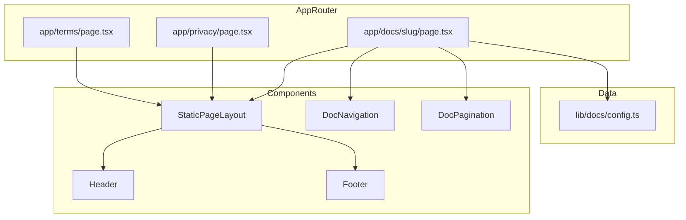

# Design Document: static-pages

## Overview

**Purpose**: 利用規約・プライバシーポリシーおよびBOTドキュメントページを提供し、法的要件の充足とユーザーのセルフサポートを実現する。

**Users**: 全ユーザー（認証不要）がサービス利用条件の確認およびBOT操作方法の参照に利用する。

**Impact**: フッターのプレースホルダーリンク（`#terms`, `#privacy`）を実ページへのリンクに置換し、新規ドキュメントセクションを追加する。

### Goals
- 利用規約・プライバシーポリシーページの提供（法的要件）
- BOTドキュメント7ページの提供（ユーザーサポート）
- ドキュメント間のシームレスなナビゲーション
- 既存デザインとの一貫性維持

### Non-Goals
- CMS連携やMarkdownベースのコンテンツ管理（将来検討）
- コンテンツの多言語対応
- ドキュメント内検索機能
- ユーザーコメントやフィードバック機能

## Architecture

### Existing Architecture Analysis

現行のApp Routerは以下の構成:
- `app/layout.tsx`: ルートレイアウト（ThemeProvider、フォント設定）
- `app/page.tsx`: ランディングページ（Header/Hero/Features/CTA/Footer を直接配置）
- `app/auth/`: 認証フロー
- `app/dashboard/`: ダッシュボード（認証必須）

各ページが独立してHeader/Footerを配置するパターンに従う。共有レイアウト（中間 `layout.tsx`）は未使用。

### Architecture Pattern & Boundary Map



**Architecture Integration**:
- **Selected pattern**: Server Component + 静的生成。純粋TSXで全ページをServer Componentとして実装
- **Domain boundaries**: 法的ページ（`/terms`, `/privacy`）とドキュメントページ（`/docs/[slug]`）は独立したルートグループ
- **Existing patterns preserved**: 各ページがHeader/Footerを含む独立構成パターンに従う
- **New components rationale**: `StaticPageLayout`（共通レイアウトの重複排除）、`DocNavigation`（目次）、`DocPagination`（前後リンク）
- **Steering compliance**: Server Component優先、shadcn/ui使用、Tailwind CSSスタイリング

### Technology Stack

| Layer | Choice / Version | Role in Feature | Notes |
|-------|------------------|-----------------|-------|
| Frontend | Next.js 16 (App Router) + React 19 | ページルーティング・Server Component | 既存スタック準拠 |
| UI | shadcn/ui + Tailwind CSS 3 | スタイリング・UIプリミティブ | Card, Separator 等使用 |
| Rendering | Static Generation (generateStaticParams) | ビルド時HTML生成 | 全ページ静的生成可能 |

## Requirements Traceability

| Requirement | Summary | Components | Interfaces |
|-------------|---------|------------|------------|
| 1.1 | `/terms` ルート提供 | TermsPage | — |
| 1.2 | 利用規約全条文表示 | TermsPage | — |
| 1.3 | Server Component・認証不要 | TermsPage | — |
| 1.4 | セマンティックHTML | TermsPage, StaticPageLayout | — |
| 1.5 | SEOメタデータ | TermsPage (metadata export) | — |
| 2.1 | `/privacy` ルート提供 | PrivacyPage | — |
| 2.2 | プライバシーポリシー全セクション表示 | PrivacyPage | — |
| 2.3 | Server Component・認証不要 | PrivacyPage | — |
| 2.4 | セマンティックHTML | PrivacyPage, StaticPageLayout | — |
| 2.5 | SEOメタデータ | PrivacyPage (metadata export) | — |
| 3.1 | `/docs` ルート配下 | DocsSlugPage, DocsConfig | DocEntry |
| 3.2 | 全7ドキュメントページ提供 | DocsSlugPage | DocEntry |
| 3.3 | Server Component・認証不要 | DocsSlugPage | — |
| 3.4 | タイトル・本文・画像表示 | DocsSlugPage | DocEntry |
| 3.5 | SEOメタデータ | DocsSlugPage (generateMetadata) | — |
| 4.1 | 目次ナビゲーション | DocNavigation | DocEntry |
| 4.2 | 前後ページ送りリンク | DocPagination | DocPaginationProps |
| 4.3 | 最初ページで「前の記事」非表示 | DocPagination | DocPaginationProps |
| 4.4 | 最後ページで「次の記事」非表示 | DocPagination | DocPaginationProps |
| 5.1 | 共通ヘッダー・フッター表示 | StaticPageLayout | StaticPageLayoutProps |
| 5.2 | 中央揃え・最大幅制限レイアウト | StaticPageLayout | StaticPageLayoutProps |
| 5.3 | レスポンシブデザイン | StaticPageLayout | — |
| 5.4 | ダーク/ライトテーマ対応 | StaticPageLayout | — |
| 6.1 | フッター利用規約リンク更新 | Footer | — |
| 6.2 | フッタープライバシーリンク更新 | Footer | — |
| 6.3 | フッタードキュメントリンク追加 | Footer | — |

## Components and Interfaces

| Component | Domain/Layer | Intent | Req Coverage | Key Dependencies | Contracts |
|-----------|-------------|--------|--------------|------------------|-----------|
| StaticPageLayout | UI/Layout | 静的ページ共通レイアウト | 5.1, 5.2, 5.3, 5.4 | Header (P0), Footer (P0) | — |
| TermsPage | Page | 利用規約ページ | 1.1–1.5 | StaticPageLayout (P0) | — |
| PrivacyPage | Page | プライバシーポリシーページ | 2.1–2.5 | StaticPageLayout (P0) | — |
| DocsSlugPage | Page | ドキュメント動的ページ | 3.1–3.5 | StaticPageLayout (P0), DocsConfig (P0), DocNavigation (P1), DocPagination (P1) | — |
| DocNavigation | UI/Navigation | ドキュメント目次 | 4.1 | DocsConfig (P0) | — |
| DocPagination | UI/Navigation | 前後ページ送り | 4.2–4.4 | — | — |
| DocsConfig | Data/Config | ドキュメントメタデータ管理 | 3.1, 3.2 | — | Service |
| Footer (更新) | UI/Layout | フッターリンク更新 | 6.1–6.3 | — | — |

### Data / Config Layer

#### DocsConfig

| Field | Detail |
|-------|--------|
| Intent | ドキュメントページのメタデータ定義と取得ユーティリティ |
| Requirements | 3.1, 3.2 |

**Responsibilities & Constraints**
- ドキュメントページの slug・タイトル・順序・説明文のメタデータを管理
- `generateStaticParams` 用の全 slug 一覧を提供
- 前後ページの算出ロジックを提供

**Contracts**: Service [x]

##### Service Interface
```typescript
type DocEntry = {
  slug: string;
  title: string;
  order: number;
  description: string;
};

/** 全ドキュメントエントリ（order順） */
const DOC_ENTRIES: readonly DocEntry[];

/** slug からドキュメントエントリを取得。見つからない場合は undefined */
function getDocBySlug(slug: string): DocEntry | undefined;

/** 全 slug の配列を返す（generateStaticParams 用） */
function getAllDocSlugs(): string[];

/** 指定 slug の前後エントリを返す */
function getAdjacentDocs(slug: string): {
  prev: DocEntry | undefined;
  next: DocEntry | undefined;
};
```

**Implementation Notes**
- DOC_ENTRIES は定数配列として定義（order フィールドで順序管理）
- V2の `description` フィールド（ソート用番号文字列）を `order` に変換

### UI / Layout Layer

#### StaticPageLayout

| Field | Detail |
|-------|--------|
| Intent | 静的コンテンツページの共通レイアウト（Header + コンテンツ領域 + Footer） |
| Requirements | 5.1, 5.2, 5.3, 5.4 |

**Responsibilities & Constraints**
- Header と Footer を含む共通ページ構造を提供
- メインコンテンツ領域を `container mx-auto` で中央揃え・最大幅制限
- レスポンシブパディング適用
- ダーク/ライトテーマは ThemeProvider（ルートレイアウト）から継承

**Dependencies**
- Inbound: TermsPage, PrivacyPage, DocsSlugPage — ページ構造の利用 (P0)
- Outbound: Header — ヘッダー表示 (P0)
- Outbound: Footer — フッター表示 (P0)

```typescript
type StaticPageLayoutProps = {
  children: React.ReactNode;
};
```

**Implementation Notes**
- Header は async Server Component（認証状態取得のため）であり、StaticPageLayout も async Server Component として実装
- コンテンツ領域: `<div className="container mx-auto max-w-4xl px-4 py-12">`

#### DocNavigation

| Field | Detail |
|-------|--------|
| Intent | ドキュメントページ一覧の目次ナビゲーション |
| Requirements | 4.1 |

**Responsibilities & Constraints**
- 全ドキュメントページのリンク一覧を表示
- 現在のページをアクティブ状態で強調表示

```typescript
type DocNavigationProps = {
  entries: readonly DocEntry[];
  currentSlug: string;
};
```

**Implementation Notes**
- モバイルではドロップダウンメニュー、デスクトップではサイドバーまたはインラインリスト
- Next.js `Link` コンポーネントでクライアントサイドナビゲーション

#### DocPagination

| Field | Detail |
|-------|--------|
| Intent | 前後ドキュメントページへのページ送りリンク |
| Requirements | 4.2, 4.3, 4.4 |

**Responsibilities & Constraints**
- 前のページ・次のページへのリンクをカード形式で表示
- 最初のページでは prev を非表示、最後のページでは next を非表示

```typescript
type DocPaginationProps = {
  prev: DocEntry | undefined;
  next: DocEntry | undefined;
};
```

**Implementation Notes**
- shadcn/ui Card コンポーネントをベースに前後リンクを表示
- V2のデザインを踏襲（前の記事/次の記事 ラベル付き）

### Page Layer

#### TermsPage (`app/terms/page.tsx`)

| Field | Detail |
|-------|--------|
| Intent | 利用規約ページの表示 |
| Requirements | 1.1, 1.2, 1.3, 1.4, 1.5 |

**Implementation Notes**
- Server Component（async不要、静的コンテンツのみ）
- `export const metadata: Metadata` でSEOメタデータ設定
- V2のコンテンツ（第1条〜第6条、施行日）をJSXで直接記述
- セマンティックHTML: `<article>`, `<h1>`, `<h2>`, `<ol>`, `<li>`

#### PrivacyPage (`app/privacy/page.tsx`)

| Field | Detail |
|-------|--------|
| Intent | プライバシーポリシーページの表示 |
| Requirements | 2.1, 2.2, 2.3, 2.4, 2.5 |

**Implementation Notes**
- Server Component（async不要、静的コンテンツのみ）
- `export const metadata: Metadata` でSEOメタデータ設定
- V2のコンテンツ（収集情報、利用目的、第三者提供、免責事項、改定について、制定日）をJSXで直接記述
- 外部リンク（Google Analytics関連）に `rel="noopener noreferrer"` と `target="_blank"` を付与

#### DocsSlugPage (`app/docs/[slug]/page.tsx`)

| Field | Detail |
|-------|--------|
| Intent | ドキュメントページの動的ルーティングと表示 |
| Requirements | 3.1, 3.2, 3.3, 3.4, 3.5 |

**Responsibilities & Constraints**
- `[slug]` パラメータに基づいてドキュメントコンテンツを表示
- `generateStaticParams` で全ページを静的生成
- `generateMetadata` で動的SEOメタデータ生成
- 存在しない slug には `notFound()` を返却

**Dependencies**
- Outbound: DocsConfig — ドキュメントメタデータ取得 (P0)
- Outbound: StaticPageLayout — ページレイアウト (P0)
- Outbound: DocNavigation — 目次表示 (P1)
- Outbound: DocPagination — 前後リンク (P1)

**Implementation Notes**
- 各 slug に対応するコンテンツコンポーネントを定義（例: `docs-getting-started.tsx`）
- slug → コンポーネントのマッピングで動的レンダリング
- スクリーンショット画像は `public/docs/` に配置し、Next.js `Image` コンポーネントで表示
- V2のカスタムコンポーネント（VImage, Btn, Command）はReact相当に置換

### UI / Layout Layer (更新)

#### Footer (既存コンポーネント更新)

| Field | Detail |
|-------|--------|
| Intent | フッターリンクを実ページへのリンクに更新 |
| Requirements | 6.1, 6.2, 6.3 |

**Implementation Notes**
- `footerLinks` 配列を更新:
  - `{ label: "利用規約", href: "/terms" }`
  - `{ label: "プライバシーポリシー", href: "/privacy" }`
  - `{ label: "ドキュメント", href: "/docs/getting-started" }` を追加
- `<a>` タグを Next.js `Link` コンポーネントに置換（クライアントサイドナビゲーション）

## Data Models

### Domain Model

静的コンテンツ機能にデータベースは不要。ドキュメントメタデータはアプリケーションコード内の定数として管理。

```typescript
/** ドキュメントエントリのメタデータ */
type DocEntry = {
  /** URLスラッグ（例: "getting-started"） */
  slug: string;
  /** ページタイトル（例: "基本的な使い方"） */
  title: string;
  /** 表示順序（0始まり） */
  order: number;
  /** ページ説明文（meta description用） */
  description: string;
};
```

ドキュメントエントリ一覧（V2の `description` フィールド順を維持）:

| slug | title | order |
|------|-------|-------|
| getting-started | 基本的な使い方 | 0 |
| login | ログイン | 1 |
| invite | Botの招待 | 2 |
| initialize | 初期設定 | 3 |
| calendar | 予定の追加と表示 | 4 |
| edit | 予定の編集と削除 | 5 |
| commands | 利用可能なコマンド | 6 |

## Error Handling

### Error Strategy
- **存在しないドキュメントslug**: `notFound()` でNext.jsの404ページを表示
- **画像読み込みエラー**: Next.js `Image` コンポーネントの標準エラーハンドリング

## Testing Strategy

### Unit Tests
- `DocsConfig`: `getDocBySlug`, `getAllDocSlugs`, `getAdjacentDocs` の正常系・異常系
- `DocPagination`: prev/next の表示・非表示の条件分岐

### Integration Tests
- TermsPage: 利用規約ページのレンダリングとコンテンツ存在確認
- PrivacyPage: プライバシーポリシーページのレンダリングとコンテンツ存在確認
- DocsSlugPage: 各slugでのドキュメントページレンダリングと目次・ページ送り表示

### E2E Tests
- フッターの利用規約リンクから `/terms` への遷移
- フッターのプライバシーポリシーリンクから `/privacy` への遷移
- ドキュメントページの前後ナビゲーション操作
- 存在しないドキュメントslugで404ページ表示
