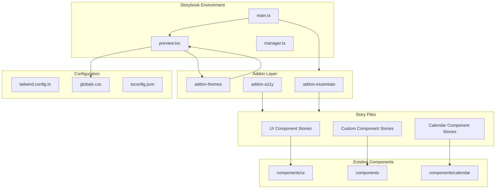
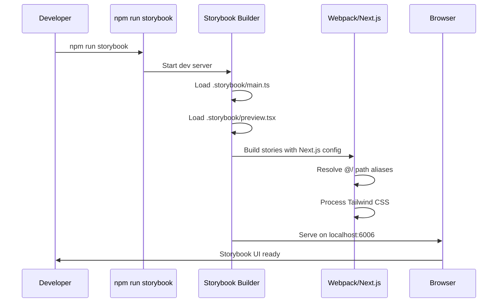

# Design Document: Storybook Integration

## Overview

**Purpose**: 本機能は、Discalendarプロジェクトにおけるコンポーネント駆動開発を実現するため、Storybook環境を構築する。開発者はUIコンポーネントを独立して開発・テスト・ドキュメント化できるようになる。

**Users**: 開発者がコンポーネントの視覚的確認、バリアント検証、アクセシビリティテストに活用する。

**Impact**: 既存のNext.js + React 19環境に新しい開発ツールを追加。本番コードへの変更は最小限(設定ファイルの追加のみ)。

### Goals
- Storybook開発サーバーの起動とビルドを可能にする
- 既存のshadcn/uiコンポーネントとカスタムコンポーネントのストーリーを作成する
- アクセシビリティ検証とテーマ切り替え機能を統合する
- 既存の開発ワークフロー(Biome lint/format)との統合

### Non-Goals
- Storybook内でのインタラクションテスト(Playwrightで代替)
- Chromaticなど外部サービスとの統合(将来検討)
- Server Componentsのストーリー化(本プロジェクトは主にClient Components)

## Architecture

### Architecture Pattern & Boundary Map



**Architecture Integration**:
- Selected pattern: 開発ツール統合 - Storybookを独立した開発環境として構成し、本番コードへの影響を最小化
- Domain/feature boundaries: `.storybook/`ディレクトリに設定を集約、ストーリーファイルはコンポーネントとCo-located
- Existing patterns preserved: shadcn/ui配置パターン、Tailwind CSSテーマシステム、Biome lint規約
- New components rationale: ストーリーファイル(*.stories.tsx)は既存テストファイルパターンに準拠
- Steering compliance: TypeScript strict mode、Ultracite lint対象化

### Technology Stack

| Layer | Choice / Version | Role in Feature | Notes |
|-------|------------------|-----------------|-------|
| Build Tool | @storybook/nextjs ^8.6 | Next.js統合フレームワーク | パスエイリアス、next/image自動対応 |
| Core | storybook ^8.6 | Storybookコアランタイム | CSF3サポート |
| Addons | @storybook/addon-essentials | Controls, Actions, Docs, Viewport | 標準機能セット |
| Addons | @storybook/addon-a11y | アクセシビリティ検証 | axe-coreベース |
| Addons | @storybook/addon-themes | テーマ切り替え | Tailwind dark mode対応 |
| Styling | Tailwind CSS 3.4.1 (既存) | スタイリング | globals.css変数を再利用 |

## System Flows

### Storybook開発サーバー起動フロー



**Key Decisions**:
- デフォルトポート6006を使用(Next.jsの3000と競合回避)
- Webpackビルダーを使用(`@storybook/nextjs`の標準)

## Requirements Traceability

| Requirement | Summary | Components | Interfaces | Flows |
|-------------|---------|------------|------------|-------|
| 1.1 | Storybook開発サーバー起動 | StorybookMainConfig | npm scripts | 起動フロー |
| 1.2 | TypeScript strict mode対応 | StorybookMainConfig | tsconfig統合 | - |
| 1.3 | Tailwind CSSスタイル適用 | StorybookPreviewConfig | globals.css import | - |
| 1.4 | パスエイリアス解決 | StorybookMainConfig | @storybook/nextjs | - |
| 1.5 | 静的ビルド生成 | StorybookMainConfig | npm scripts | - |
| 2.1 | UIコンポーネントストーリー | UIComponentStories | CSF3 format | - |
| 2.2 | バリアントプレビュー | UIComponentStories | argTypes | - |
| 2.3 | Controlsパネル操作 | StorybookPreviewConfig | addon-essentials | - |
| 2.4 | コードスニペット表示 | StorybookPreviewConfig | autodocs | - |
| 3.1 | カスタムコンポーネントストーリー | CustomComponentStories | CSF3 format | - |
| 3.2 | propsのControls操作 | CustomComponentStories | argTypes | - |
| 3.3 | 状態別ストーリー | CustomComponentStories | Named exports | - |
| 3.4 | Actionsパネルイベント確認 | CustomComponentStories | action() | - |
| 4.1 | addon-essentials統合 | StorybookMainConfig | addons array | - |
| 4.2 | addon-a11y統合 | StorybookMainConfig | addons array | - |
| 4.3 | Viewport切り替え | StorybookPreviewConfig | viewport parameter | - |
| 4.4 | ダークモード切り替え | StorybookPreviewConfig | addon-themes | - |
| 5.1 | Biome lint対象化 | BiomeConfig | includes pattern | - |
| 5.2 | npm scripts追加 | PackageJson | scripts | - |
| 5.3 | ビルドエラー表示 | StorybookMainConfig | Webpack config | - |
| 5.4 | Vitestとの共存 | StorybookMainConfig | - | - |
| 6.1 | CSF3形式採用 | AllStories | Meta, StoryObj | - |
| 6.2 | 命名規則遵守 | AllStories | *.stories.tsx | - |
| 6.3 | Co-located配置 | AllStories | File structure | - |
| 6.4 | autodocs有効化 | StorybookMainConfig | docs.autodocs | - |

## Components and Interfaces

| Component | Domain/Layer | Intent | Req Coverage | Key Dependencies | Contracts |
|-----------|--------------|--------|--------------|-----------------|-----------|
| StorybookMainConfig | Config | Storybookビルド設定 | 1.1-1.5, 4.1-4.2, 5.4, 6.4 | @storybook/nextjs (P0) | Config |
| StorybookPreviewConfig | Config | グローバルデコレータ・パラメータ | 1.3, 2.3-2.4, 4.3-4.4 | addon-themes (P0), globals.css (P0) | Config |
| BiomeConfig | Config | Lint対象拡張 | 5.1 | Ultracite (P0) | Config |
| PackageJson | Config | npm scripts追加 | 5.2-5.3 | - | Config |
| UIComponentStories | Stories | shadcn/uiストーリー群 | 2.1-2.4 | components/ui (P0) | Story |
| CustomComponentStories | Stories | カスタムコンポーネントストーリー群 | 3.1-3.4 | components (P0) | Story |
| CalendarComponentStories | Stories | カレンダーコンポーネントストーリー群 | 3.1-3.4 | components/calendar (P0) | Story |

### Configuration Layer

#### StorybookMainConfig

| Field | Detail |
|-------|--------|
| Intent | Storybookのビルド設定とアドオン構成を定義 |
| Requirements | 1.1, 1.2, 1.4, 1.5, 4.1, 4.2, 5.4, 6.4 |

**Responsibilities & Constraints**
- ストーリーファイルの検出パターン定義
- フレームワーク(@storybook/nextjs)の指定
- アドオンの登録と設定
- TypeScript/Tailwind CSS設定との整合性維持

**Dependencies**
- External: @storybook/nextjs - Next.js統合 (P0)
- External: @storybook/addon-essentials - 標準アドオン群 (P0)
- External: @storybook/addon-a11y - アクセシビリティ (P0)
- External: @storybook/addon-themes - テーマ切替 (P0)
- Inbound: tsconfig.json - パスエイリアス解決 (P0)

**Contracts**: Config [x]

##### Configuration Interface
```typescript
// .storybook/main.ts
import type { StorybookConfig } from "@storybook/nextjs";

const config: StorybookConfig = {
  stories: [
    "../components/**/*.stories.@(ts|tsx)",
  ],
  addons: [
    "@storybook/addon-essentials",
    "@storybook/addon-a11y",
    "@storybook/addon-themes",
  ],
  framework: {
    name: "@storybook/nextjs",
    options: {},
  },
  docs: {
    autodocs: "tag",
  },
  staticDirs: ["../public"],
};

export default config;
```

**Implementation Notes**
- Integration: `@storybook/nextjs`がtsconfig.jsonのパスエイリアスを自動解決
- Validation: ストーリーファイルが見つからない場合は警告を表示
- Risks: Next.js 16+との互換性は最新Storybookで確認済み

---

#### StorybookPreviewConfig

| Field | Detail |
|-------|--------|
| Intent | グローバルデコレータとパラメータを設定 |
| Requirements | 1.3, 2.3, 2.4, 4.3, 4.4 |

**Responsibilities & Constraints**
- Tailwind CSSスタイルの読み込み
- テーマ切り替えデコレータの設定
- ビューポートプリセットの定義
- グローバルtypesの設定

**Dependencies**
- External: @storybook/addon-themes - withThemeByClassName (P0)
- Inbound: app/globals.css - CSS変数定義 (P0)

**Contracts**: Config [x]

##### Configuration Interface
```typescript
// .storybook/preview.tsx
import type { Preview } from "@storybook/react";
import { withThemeByClassName } from "@storybook/addon-themes";
import "../app/globals.css";

const preview: Preview = {
  parameters: {
    controls: {
      matchers: {
        color: /(background|color)$/i,
        date: /Date$/i,
      },
    },
    viewport: {
      viewports: {
        mobile: { name: "Mobile", styles: { width: "375px", height: "667px" } },
        tablet: { name: "Tablet", styles: { width: "768px", height: "1024px" } },
        desktop: { name: "Desktop", styles: { width: "1280px", height: "800px" } },
      },
    },
  },
  decorators: [
    withThemeByClassName({
      themes: {
        light: "",
        dark: "dark",
      },
      defaultTheme: "light",
    }),
  ],
};

export default preview;
```

**Implementation Notes**
- Integration: globals.cssのインポートでCSS変数が有効化
- Validation: テーマ切替時にbodyのクラスが正しく変更されることを確認
- Risks: iframe内でのクラス適用はwithThemeByClassNameが処理

---

#### BiomeConfig

| Field | Detail |
|-------|--------|
| Intent | ストーリーファイルをLint対象に追加 |
| Requirements | 5.1 |

**Responsibilities & Constraints**
- `*.stories.tsx`パターンをincludes対象に追加
- 既存の除外設定(components/ui, lib, hooks, refs)を維持

**Dependencies**
- External: Ultracite preset (P0)

**Contracts**: Config [x]

##### Configuration Change
```jsonc
// biome.jsonc (差分)
{
  "files": {
    "includes": [
      "**/*",
      "!components/ui",
      "!lib",
      "!hooks",
      "!refs"
    ]
    // *.stories.tsxは**/*に含まれるため追加設定不要
    // .storybookディレクトリも自動的に対象となる
  }
}
```

**Implementation Notes**
- Integration: 現在の設定で`**/*`が有効なためストーリーファイルは自動的に対象
- Validation: `.storybook/`ディレクトリが除外されていないことを確認
- Risks: 特になし、既存設定で対応済み

---

#### PackageJson

| Field | Detail |
|-------|--------|
| Intent | Storybook関連のnpm scriptsを追加 |
| Requirements | 5.2, 5.3 |

**Contracts**: Config [x]

##### Scripts Addition
```json
{
  "scripts": {
    "storybook": "storybook dev -p 6006",
    "build-storybook": "storybook build"
  }
}
```

**Implementation Notes**
- Integration: 既存scriptsと並列で追加
- Validation: `npm run storybook`と`npm run build-storybook`の動作確認

---

### Stories Layer

#### BaseStoryInterface

共通のストーリーインターフェース定義(UIComponentStories, CustomComponentStories, CalendarComponentStoriesで再利用):

```typescript
// CSF3形式の基本構造
import type { Meta, StoryObj } from "@storybook/react";

// Meta定義
const meta: Meta<typeof Component> = {
  title: "Category/ComponentName",
  component: Component,
  tags: ["autodocs"],
  argTypes: {
    // propsのコントロール設定
  },
};

export default meta;
type Story = StoryObj<typeof meta>;

// ストーリー定義
export const Default: Story = {
  args: {
    // デフォルトprops
  },
};
```

---

#### UIComponentStories

| Field | Detail |
|-------|--------|
| Intent | shadcn/uiコンポーネントのストーリー群 |
| Requirements | 2.1, 2.2, 2.3, 2.4 |

**Responsibilities & Constraints**
- 各UIコンポーネントの全バリアントを網羅
- class-variance-authorityのvariantをargTypesで制御可能に
- 使用例とコードスニペットをautodocsで自動生成

**Dependencies**
- Inbound: components/ui/*.tsx - 対象コンポーネント (P0)

**Contracts**: Story [x]

##### Story File Structure (Button Example)
```typescript
// components/ui/button.stories.tsx
import type { Meta, StoryObj } from "@storybook/react";
import { Button } from "./button";

const meta: Meta<typeof Button> = {
  title: "UI/Button",
  component: Button,
  tags: ["autodocs"],
  argTypes: {
    variant: {
      control: "select",
      options: ["default", "destructive", "outline", "secondary", "ghost", "link"],
    },
    size: {
      control: "select",
      options: ["default", "sm", "lg", "icon"],
    },
    disabled: { control: "boolean" },
    asChild: { control: "boolean" },
  },
};

export default meta;
type Story = StoryObj<typeof meta>;

export const Default: Story = {
  args: {
    children: "Button",
    variant: "default",
    size: "default",
  },
};

export const AllVariants: Story = {
  render: () => (
    <div className="flex flex-wrap gap-4">
      <Button variant="default">Default</Button>
      <Button variant="destructive">Destructive</Button>
      <Button variant="outline">Outline</Button>
      <Button variant="secondary">Secondary</Button>
      <Button variant="ghost">Ghost</Button>
      <Button variant="link">Link</Button>
    </div>
  ),
};

export const AllSizes: Story = {
  render: () => (
    <div className="flex items-center gap-4">
      <Button size="sm">Small</Button>
      <Button size="default">Default</Button>
      <Button size="lg">Large</Button>
      <Button size="icon">I</Button>
    </div>
  ),
};

export const Disabled: Story = {
  args: {
    children: "Disabled",
    disabled: true,
  },
};
```

**Target Components**:
- button.stories.tsx
- badge.stories.tsx
- card.stories.tsx
- checkbox.stories.tsx
- dropdown-menu.stories.tsx
- input.stories.tsx
- label.stories.tsx
- popover.stories.tsx

**Implementation Notes**
- Integration: 各コンポーネントと同じディレクトリに配置
- Validation: 全バリアントがControlsで切り替え可能であること
- Risks: cvaのvariantキーが変更された場合はargTypesの更新が必要

---

#### CustomComponentStories

| Field | Detail |
|-------|--------|
| Intent | アプリケーション固有コンポーネントのストーリー群 |
| Requirements | 3.1, 3.2, 3.3, 3.4 |

**Responsibilities & Constraints**
- 状態別ストーリー(loading, error, empty等)を定義
- イベントハンドラーをActionsで可視化
- 複雑なpropsはargsで制御可能に

**Dependencies**
- Inbound: components/*.tsx - 対象コンポーネント (P0)

**Contracts**: Story [x]

##### Story File Structure (Header Example)
```typescript
// components/header.stories.tsx
import type { Meta, StoryObj } from "@storybook/react";
import { action } from "@storybook/addon-actions";
import { Header } from "./header";

const meta: Meta<typeof Header> = {
  title: "Components/Header",
  component: Header,
  tags: ["autodocs"],
  parameters: {
    layout: "fullscreen",
  },
};

export default meta;
type Story = StoryObj<typeof meta>;

export const Default: Story = {};

export const Mobile: Story = {
  parameters: {
    viewport: { defaultViewport: "mobile" },
  },
};
```

**Target Components**:
- header.stories.tsx
- mobile-nav.stories.tsx
- hero.stories.tsx
- features.stories.tsx
- cta.stories.tsx
- footer.stories.tsx

**Implementation Notes**
- Integration: Actionsアドオンでイベントハンドラーの発火を確認
- Validation: モバイル/デスクトップ両方のビューポートで表示確認

---

#### CalendarComponentStories

| Field | Detail |
|-------|--------|
| Intent | カレンダー関連コンポーネントのストーリー群 |
| Requirements | 3.1, 3.2, 3.3, 3.4 |

**Responsibilities & Constraints**
- モックデータを使用してSupabase依存を排除
- 各状態(empty, loading, error, with-events)のストーリーを定義
- イベントクリック等のインタラクションをActionsで確認

**Dependencies**
- Inbound: components/calendar/*.tsx - 対象コンポーネント (P0)
- External: Mock data - イベントデータのモック (P1)

**Contracts**: Story [x]

##### Story File Structure (CalendarGrid Example)
```typescript
// components/calendar/calendar-grid.stories.tsx
import type { Meta, StoryObj } from "@storybook/react";
import { action } from "@storybook/addon-actions";
import { CalendarGrid } from "./calendar-grid";
import type { CalendarEvent } from "@/lib/calendar/types";

const mockEvents: CalendarEvent[] = [
  {
    id: "1",
    title: "Team Meeting",
    description: "Weekly sync",
    startTime: new Date(2025, 0, 15, 10, 0),
    endTime: new Date(2025, 0, 15, 11, 0),
    guildId: "123",
    isAllDay: false,
  },
  {
    id: "2",
    title: "All Day Event",
    description: "Holiday",
    startTime: new Date(2025, 0, 20),
    endTime: new Date(2025, 0, 20),
    guildId: "123",
    isAllDay: true,
  },
];

const meta: Meta<typeof CalendarGrid> = {
  title: "Calendar/CalendarGrid",
  component: CalendarGrid,
  tags: ["autodocs"],
  argTypes: {
    viewMode: {
      control: "select",
      options: ["month", "week", "day"],
    },
  },
};

export default meta;
type Story = StoryObj<typeof meta>;

export const MonthView: Story = {
  args: {
    viewMode: "month",
    selectedDate: new Date(2025, 0, 15),
    today: new Date(2025, 0, 15),
    events: mockEvents,
    onEventClick: action("onEventClick"),
    onDateChange: action("onDateChange"),
  },
};

export const WeekView: Story = {
  args: {
    viewMode: "week",
    selectedDate: new Date(2025, 0, 15),
    today: new Date(2025, 0, 15),
    events: mockEvents,
    onEventClick: action("onEventClick"),
    onDateChange: action("onDateChange"),
  },
};

export const DayView: Story = {
  args: {
    viewMode: "day",
    selectedDate: new Date(2025, 0, 15),
    today: new Date(2025, 0, 15),
    events: mockEvents,
    onEventClick: action("onEventClick"),
    onDateChange: action("onDateChange"),
  },
};

export const Empty: Story = {
  args: {
    viewMode: "month",
    selectedDate: new Date(2025, 0, 15),
    today: new Date(2025, 0, 15),
    events: [],
    onEventClick: action("onEventClick"),
    onDateChange: action("onDateChange"),
  },
};
```

**Target Components**:
- calendar-grid.stories.tsx
- calendar-toolbar.stories.tsx
- event-block.stories.tsx
- event-popover.stories.tsx

**Implementation Notes**
- Integration: CalendarContainerは複雑な依存があるため、子コンポーネント単位でストーリー化
- Validation: ビューモード切替、イベント表示、ポップオーバー表示の動作確認
- Risks: react-big-calendarのスタイルがStorybook内で正しく適用されることを確認

## Data Models

### Domain Model

本機能はUI開発ツールのため、永続化データモデルは存在しない。

**Story File Structure**:
- ストーリーファイルはCSF3形式に従う
- MetaオブジェクトでコンポーネントメタデータとargTypesを定義
- 名前付きエクスポートで各ストーリーを定義

**Mock Data**:
- カレンダーコンポーネント用のモックイベントデータを定義
- `CalendarEvent`型に準拠したテストデータを使用

## Error Handling

### Error Strategy

Storybookはビルドツールのため、エラーはビルド時またはランタイムで発生する。

### Error Categories and Responses

**Build Errors**:
- ストーリーファイルの構文エラー → Webpack/TypeScriptエラーとして表示
- 依存モジュールの解決失敗 → パスエイリアス設定の確認を促すメッセージ
- アドオンの互換性エラー → バージョン確認とアップグレードガイダンス

**Runtime Errors**:
- コンポーネントのレンダリングエラー → Storybookのエラーオーバーレイで表示
- CSS読み込み失敗 → globals.cssのインポートパス確認

### Monitoring

- ビルド時のWebpackログで警告・エラーを確認
- `storybook build`の終了コードでCI/CD統合可能

## Testing Strategy

### Unit Tests
- 本機能はテスト不要(Storybook自体がビジュアルテストツール)

### Integration Tests
- `npm run storybook`でサーバー起動を確認
- `npm run build-storybook`でビルド成功を確認
- 各ストーリーがエラーなくレンダリングされることを目視確認

### E2E/UI Tests
- Storybookで各コンポーネントのバリアントを表示
- ビューポート切り替えでレスポンシブデザインを確認
- テーマ切り替えでダークモード表示を確認
- a11yパネルでアクセシビリティ違反がないことを確認

## Optional Sections

### Security Considerations

- Storybookは開発環境専用、本番デプロイは想定しない
- ビルド成果物(`storybook-static/`)は`.gitignore`に追加推奨
- 機密情報をストーリー内でハードコードしない

### Performance & Scalability

- 初期起動時間: Webpackビルドにより数秒かかる場合あり
- ストーリー数が増加した場合はlazyコンパイルを検討
- 静的ビルドはCDNホスティング可能(将来のChromatic統合時)
