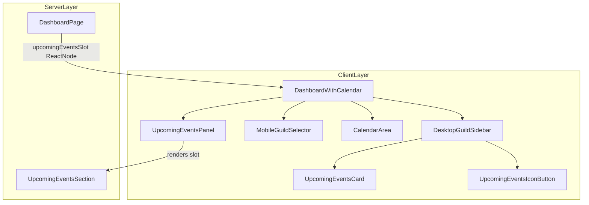
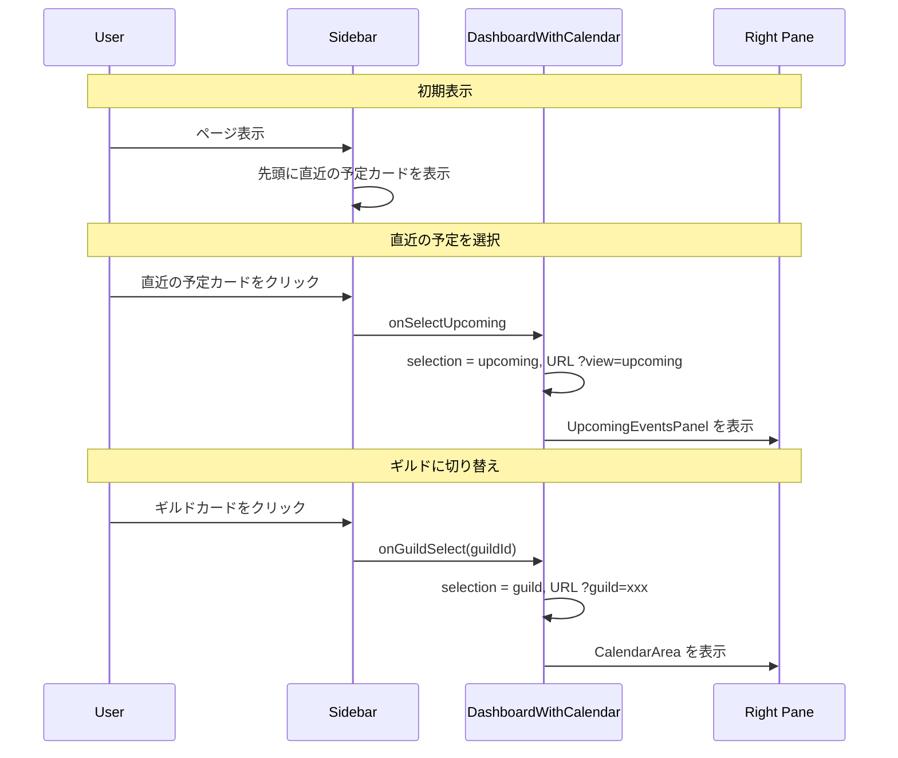

# Design Document: upcoming-events-integration

## Overview

**Purpose**: ダッシュボードの「直近の予定」をページ上部の独立セクションからサーバー一覧サイドバーの先頭に移動し、サーバーと同列の選択項目として統合する。
**Users**: Discalendarダッシュボードの全ユーザー。特にモバイル・低解像度環境のユーザーのUXを改善する。
**Impact**: `DashboardPageLayout` の上部スロットを廃止し、`DashboardWithCalendar` 内のサイドバー・右ペインに直近の予定表示を統合する。

### Goals
- サーバー一覧の先頭に「直近の予定」項目を追加し、ギルドと同じ動線でアクセス可能にする
- 右ペインでカレンダーと直近予定一覧を切り替え表示する
- ファーストビューの改善（スクロールなしでサーバー一覧とカレンダーにアクセス）

### Non-Goals
- 直近の予定のデータ取得ロジック（`fetchUpcomingEvents`）の変更
- `UpcomingEventList`/`UpcomingEventItem` コンポーネントのリデザイン
- 直近の予定のフィルタリング・ソート機能の追加
- 未使用になるコンポーネント（`UpcomingEventsCollapsible`）のファイル削除

## Architecture

> 詳細な調査ノートは `research.md` を参照。

### Existing Architecture Analysis

現在のダッシュボードは以下の構造:

1. **`DashboardPage`**（Server Component）: 認証・データ取得後、`DashboardPageLayout` にデータを渡す
2. **`DashboardPageLayout`**: ヘッダー + `upcomingEventsSlot`（上部） + `DashboardWithCalendar`（メイン）
3. **`DashboardWithCalendar`**（Client Component）: サイドバー（ギルド一覧） + 右ペイン（カレンダー）
4. **`UpcomingEventsSection`**（Server Component）: Suspense 境界内でデータ取得・表示

**維持するパターン**:
- Server Component → Client Component への ReactNode slot パターン
- URL パラメータによる状態永続化（`?guild=xxx`）
- サイドバーの折りたたみ/展開（localStorage）
- モバイル用セレクター/デスクトップ用サイドバーの分岐

### Architecture Pattern & Boundary Map



**Architecture Integration**:
- **Selected pattern**: ReactNode slot パターン（既存の Server → Client コンポジションを踏襲）
- **Domain boundaries**: サイドバーUI（選択制御）とコンテンツ表示（右ペイン）の分離を維持
- **New components**: `UpcomingEventsCard`（サイドバー展開時）、`UpcomingEventsIconButton`（折りたたみ時）、`UpcomingEventsPanel`（右ペイン表示）
- **Steering compliance**: Co-location パターン、shadcn/ui スタイル基盤を維持

### Technology Stack

| Layer | Choice / Version | Role in Feature | Notes |
|-------|------------------|-----------------|-------|
| Frontend | React 19 + Next.js 16 App Router | Server/Client Component コンポジション | 既存スタック |
| UI | shadcn/ui (Card, Button) + lucide-react (Calendar icon) | サイドバー項目の UI | 既存コンポーネント再利用 |
| State | URL SearchParams + React useState | 選択状態の管理と永続化 | `?view=upcoming` パラメータ追加 |

## System Flows



## Requirements Traceability

| Requirement | Summary | Components | Interfaces | Flows |
|-------------|---------|------------|------------|-------|
| 1.1 | サイドバー先頭に直近の予定項目表示 | DesktopGuildSidebar, UpcomingEventsCard | DashboardWithCalendarProps | - |
| 1.2 | サーバーカードと同列のカード形式 | UpcomingEventsCard | UpcomingEventsCardProps | - |
| 1.3 | カレンダーアイコンとテキスト表示 | UpcomingEventsCard, UpcomingEventsIconButton | - | - |
| 1.4 | クリック時の選択ハイライト | UpcomingEventsCard | DashboardSelection | 直近の予定選択フロー |
| 1.5 | 他のサーバーカードの選択解除 | DashboardWithCalendar | DashboardSelection | 直近の予定選択フロー |
| 2.1 | 右ペインにUpcomingEventList表示 | UpcomingEventsPanel | - | 直近の予定選択フロー |
| 2.2 | ローディング表示 | UpcomingEventsPanel | - | - |
| 2.3 | エラー状態表示 | UpcomingEventsPanel | - | - |
| 2.4 | 空状態表示 | UpcomingEventsPanel | - | - |
| 2.5 | 既存イベント情報の維持 | UpcomingEventList, UpcomingEventItem | - | - |
| 3.1 | upcomingEventsSlot廃止 | DashboardPageLayout | DashboardPageLayoutProps | - |
| 3.2 | インポート・Slot渡し削除 | DashboardPage | - | - |
| 3.3 | ファーストビュー改善 | DashboardPageLayout | - | - |
| 4.1 | モバイルドロップダウンに選択肢追加 | MobileGuildSelector | - | - |
| 4.2 | モバイルで同じ直近予定一覧表示 | DashboardWithCalendar, UpcomingEventsPanel | - | - |
| 4.3 | モバイルレイアウト維持 | DashboardWithCalendar | - | - |
| 5.1 | 折りたたみ時アイコン表示 | DesktopGuildSidebar, UpcomingEventsIconButton | UpcomingEventsIconButtonProps | - |
| 5.2 | 折りたたみアイコンクリックで表示 | UpcomingEventsIconButton | DashboardSelection | - |

## Components and Interfaces

| Component | Domain/Layer | Intent | Req Coverage | Key Dependencies | Contracts |
|-----------|-------------|--------|--------------|------------------|-----------|
| DashboardWithCalendar | UI/Page | 選択状態管理と右ペイン切り替え | 1.4, 1.5, 2.1-2.5, 3.3, 4.2, 4.3 | DesktopGuildSidebar (P0), CalendarArea (P0) | State |
| DashboardPageLayout | UI/Page | ページ上部スロット廃止 | 3.1, 3.3 | DashboardWithCalendar (P0) | - |
| DashboardPage | Server/Page | upcomingEventsSlot の渡し先変更 | 3.2 | DashboardPageLayout (P0) | - |
| UpcomingEventsCard | UI/Sidebar | サイドバー展開時の直近予定項目 | 1.1, 1.2, 1.3, 1.4 | Card (P1) | State |
| UpcomingEventsIconButton | UI/Sidebar | サイドバー折りたたみ時のアイコン | 5.1, 5.2 | Button (P1) | State |
| UpcomingEventsPanel | UI/Content | 右ペインの直近予定表示コンテナ | 2.1, 2.2, 2.3, 2.4, 2.5 | - | - |
| DesktopGuildSidebar | UI/Sidebar | サイドバー先頭に直近予定項目追加 | 1.1, 5.1 | UpcomingEventsCard (P0), UpcomingEventsIconButton (P0) | - |
| MobileGuildSelector | UI/Mobile | ドロップダウンに直近予定選択肢追加 | 4.1 | Select (P1) | - |

### 共通型定義

#### DashboardSelection（選択状態の判別共用体型）

```typescript
/** ダッシュボードの選択状態 */
type DashboardSelection =
  | { type: "guild"; guildId: string }
  | { type: "upcoming" }
  | null;
```

- `null`: 未選択（初期状態）
- `{ type: "guild"; guildId: string }`: ギルド選択中
- `{ type: "upcoming" }`: 直近の予定表示中

#### URL パラメータとの変換

```typescript
/** URL パラメータから DashboardSelection を復元する */
function selectionFromSearchParams(
  params: URLSearchParams,
  guilds: Guild[],
): DashboardSelection;

/** DashboardSelection を URL パラメータに反映する */
function selectionToSearchParams(
  selection: DashboardSelection,
  current: URLSearchParams,
): URLSearchParams;
```

URL 表現:
- `?view=upcoming` → `{ type: "upcoming" }`
- `?guild=<id>` → `{ type: "guild"; guildId: "<id>" }`
- パラメータなし → `null`

### UI Layer

#### UpcomingEventsCard

| Field | Detail |
|-------|--------|
| Intent | サイドバー展開時に「直近の予定」をカード形式で表示する |
| Requirements | 1.1, 1.2, 1.3, 1.4 |

**Responsibilities & Constraints**
- `SelectableGuildCard` と視覚的に統一されたカード形式で表示
- `lucide-react` の `Calendar` アイコンとテキスト「直近の予定」を表示
- `isSelected` 状態に応じてハイライトスタイルを適用（`border-primary bg-accent`）

**Contracts**: State [x]

##### State Management
```typescript
type UpcomingEventsCardProps = {
  /** 選択状態 */
  isSelected: boolean;
  /** 選択時のコールバック */
  onSelect: () => void;
};
```

**Implementation Notes**
- `SelectableGuildCard` と同じ Card + CardContent 構造を使用
- `aria-pressed`, `role="button"`, `tabIndex={0}` でアクセシビリティ確保
- キーボード操作（Enter/Space）にも対応

#### UpcomingEventsIconButton

| Field | Detail |
|-------|--------|
| Intent | サイドバー折りたたみ時に「直近の予定」をアイコンのみで表示する |
| Requirements | 5.1, 5.2 |

**Contracts**: State [x]

##### State Management
```typescript
type UpcomingEventsIconButtonProps = {
  /** 選択状態 */
  isSelected: boolean;
  /** 選択時のコールバック */
  onSelect: () => void;
};
```

**Implementation Notes**
- `GuildIconButton` と同じ円形ボタンスタイル（`h-12 w-12 rounded-full`）
- `Calendar` アイコンを中央に表示
- `aria-label="直近の予定"`, `title="直近の予定"` を設定

#### UpcomingEventsPanel

| Field | Detail |
|-------|--------|
| Intent | 右ペインで直近予定一覧を表示するコンテナ |
| Requirements | 2.1, 2.2, 2.3, 2.4, 2.5 |

**Responsibilities & Constraints**
- `CalendarArea` と同じレイアウト領域に表示される
- Server Component から渡された ReactNode slot をそのままレンダリング
- Suspense 境界は Server Component 側（`DashboardPage`）で管理

**Contracts**: State [x]

##### State Management
```typescript
type UpcomingEventsPanelProps = {
  /** Server Component から渡される直近予定の ReactNode */
  children: ReactNode;
};
```

**Implementation Notes**
- `section` 要素で `aria-label="直近の予定"` を設定
- `CalendarArea` と同等の `min-h-[600px]` を確保してレイアウト安定
- 内部の Suspense/エラー/空状態は子コンポーネント（UpcomingEventsSection）が処理

### Page Layer

#### DashboardWithCalendar（既存変更）

| Field | Detail |
|-------|--------|
| Intent | 選択状態の型を拡張し、右ペインのコンテンツ切り替えを実装する |
| Requirements | 1.4, 1.5, 2.1-2.5, 4.2, 4.3 |

**変更点**:
1. `selectedGuildId: string | null` → `selection: DashboardSelection` に型変更
2. Props に `upcomingEventsSlot: ReactNode` を追加
3. 右ペインの条件分岐: `selection.type === "upcoming"` → `UpcomingEventsPanel`、`selection.type === "guild"` → `CalendarArea`
4. `handleGuildSelect` を `selection` 型に対応
5. `handleSelectUpcoming` コールバックを追加
6. URL パラメータ同期ロジックに `?view=upcoming` を追加

**Contracts**: State [x]

##### State Management
```typescript
// Props に追加
type DashboardWithCalendarProps = {
  guilds: Guild[];
  invitableGuilds?: InvitableGuild[];
  guildError?: GuildListError;
  guildPermissions?: Record<string, GuildPermissionInfo>;
  /** 直近の予定表示用の ReactNode slot */
  upcomingEventsSlot: ReactNode;
};

// 内部状態の型変更
// Before: const [selectedGuildId, setSelectedGuildId] = useState<string | null>(...)
// After:  const [selection, setSelection] = useState<DashboardSelection>(...)
```

#### DashboardPageLayout（既存変更）

| Field | Detail |
|-------|--------|
| Intent | upcomingEventsSlot を上部表示から DashboardWithCalendar への受け渡しに変更 |
| Requirements | 3.1, 3.3 |

**変更点**:
1. `upcomingEventsSlot` を上部の `<div className="mb-4">` から削除
2. `DashboardWithCalendar` に `upcomingEventsSlot` を props として渡す

#### DashboardPage（既存変更）

| Field | Detail |
|-------|--------|
| Intent | UpcomingEventsCollapsible の使用を削除し、slot を DashboardWithCalendar 経由に変更 |
| Requirements | 3.2 |

**変更点**:
1. `UpcomingEventsCollapsible` のインポートと使用を削除
2. `upcomingEventsSlot` に `<Suspense fallback={<UpcomingEventsSkeleton />}><UpcomingEventsSection guilds={guilds} /></Suspense>` を渡す（Collapsible ラッパーなし）

#### DesktopGuildSidebar（既存変更）

| Field | Detail |
|-------|--------|
| Intent | サイドバーの先頭に直近の予定項目を追加 |
| Requirements | 1.1, 5.1 |

**変更点**:
1. Props に `isUpcomingSelected: boolean` と `onSelectUpcoming: () => void` を追加
2. ギルド一覧の前に `UpcomingEventsCard`（展開時）/ `UpcomingEventsIconButton`（折りたたみ時）を配置

#### MobileGuildSelector（既存変更）

| Field | Detail |
|-------|--------|
| Intent | ドロップダウンの先頭に「直近の予定」選択肢を追加 |
| Requirements | 4.1 |

**変更点**:
1. Props に `isUpcomingSelected: boolean` と `onSelectUpcoming: () => void` を追加
2. `Select` コンポーネント内で `value` を拡張し、特殊値 `"__upcoming__"` を「直近の予定」に割り当て
3. `onValueChange` で特殊値の場合は `onSelectUpcoming()` を呼び出し

## Error Handling

### Error Strategy
既存の `UpcomingEventsSection` のエラーハンドリングをそのまま活用する。新たなエラーパターンは発生しない。

### Error Categories and Responses
- **データ取得失敗**: `UpcomingEventsError` コンポーネントが右ペインに表示される（既存動作）
- **ギルド0件**: `UpcomingEventsEmpty variant="no-guilds"` が表示される（既存動作）
- **予定0件**: `UpcomingEventsEmpty variant="no-events"` が表示される（既存動作）

## Testing Strategy

### Unit Tests
- `UpcomingEventsCard`: 選択状態のスタイル変化、クリック/キーボード操作のコールバック
- `UpcomingEventsIconButton`: 選択状態のスタイル変化、クリックのコールバック
- `UpcomingEventsPanel`: children の正常レンダリング
- `selectionFromSearchParams` / `selectionToSearchParams`: URL パラメータの双方向変換

### Integration Tests
- `DashboardWithCalendar`: 直近の予定選択 → 右ペインに UpcomingEventsPanel 表示、ギルド選択 → CalendarArea 表示の切り替え
- `DashboardPageLayout`: upcomingEventsSlot が上部に表示されないことの確認
- `DesktopGuildSidebar`: サイドバー先頭に直近の予定項目が表示される
- `MobileGuildSelector`: ドロップダウンに「直近の予定」選択肢が含まれる

### E2E Tests
- ダッシュボードで「直近の予定」をクリック → 右ペインに予定一覧表示 → URL に `?view=upcoming` → ギルドクリックでカレンダーに切り替わる
