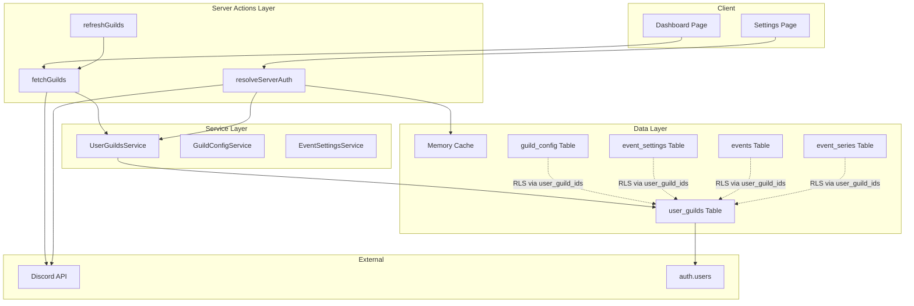
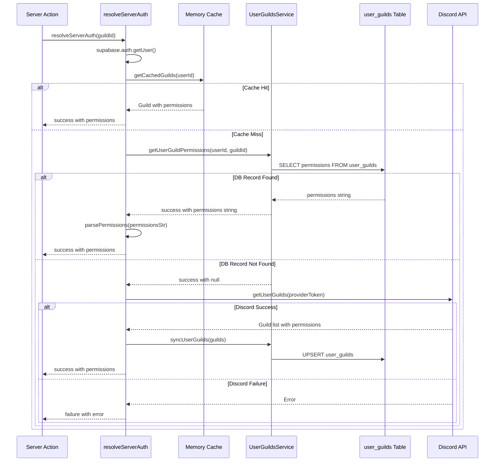
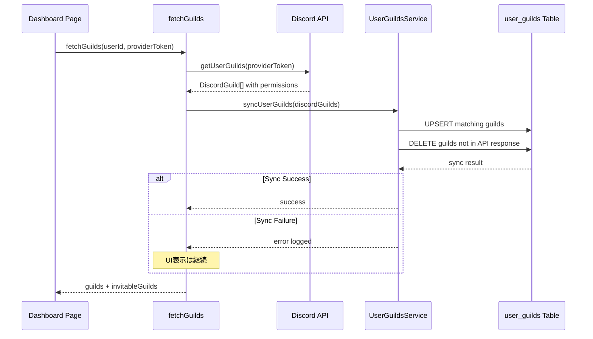
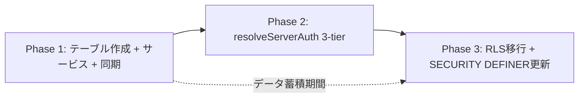

# Design Document: user-guilds-membership

## Overview

**Purpose**: ユーザーとDiscordギルドの関連（メンバーシップ・権限ビットフィールド）をDBに永続化することで、RLSポリシーおよびDB関数レベルでギルド単位のアクセス制御を実現する。

**Users**: 開発者（RLSポリシー・SECURITY DEFINER関数の強化）および間接的にDiscalendarの全エンドユーザー（セキュリティ向上による安全なデータ操作）が恩恵を受ける。

**Impact**: 現在の `WITH CHECK(true)` によるRLSポリシー（認証済みユーザーなら任意ギルドの設定変更が可能）を、`user_guilds` テーブルのメンバーシップに基づくポリシーに置き換える。また、`resolveServerAuth` の権限解決に DB フォールバック層を追加し、Discord API 依存を軽減する。

### Goals
- `user_guilds` テーブルの導入によるギルドメンバーシップの DB 永続化
- RLS ポリシーをメンバーシップベースに移行し、ギルド単位のアクセス制御を実現
- `resolveServerAuth` に 3-tier 権限解決（メモリキャッシュ → DB → Discord API）を導入
- 段階的移行により既存機能の後方互換性を維持

### Non-Goals
- Discord Bot 側のメンバーシップ管理（Bot は `service_role` キーで RLS をバイパス）
- 権限ビットフィールドのリアルタイム同期（WebSocket/Webhook 連携）
- `user_guilds` テーブルのクライアント側直接参照（サービス層経由のみ）
- ギルドメンバー一覧の UI 表示

## Architecture

### Existing Architecture Analysis

現在のアーキテクチャには以下の構造的制約が存在する:

- **RLS の脆弱性**: `guild_config`, `event_settings`, `events`, `event_series` の INSERT/UPDATE/DELETE ポリシーが `WITH CHECK(true)` で定義されており、認証済みユーザーなら任意ギルドのデータを変更可能
- **権限解決の Discord API 依存**: `resolveServerAuth` はメモリキャッシュミス時に Discord API を直接呼び出す 2-tier 構成。API レート制限やトークン期限切れ時に権限解決が失敗する
- **SECURITY DEFINER 関数の検証不足**: `upsert_event_settings` は `auth.uid() IS NULL` チェックのみで、ギルドメンバーシップの検証を行っていない

**既存パターンの踏襲**:
- ファクトリ関数パターン（`createEventSettingsService`, `createGuildConfigService`）
- Result 型パターン（`{ success: true; data: T } | { success: false; error: E }`）
- DB Row 型（snake_case）とドメイン型（camelCase）の明示的変換
- 既存のメモリキャッシュ層（`lib/guilds/cache.ts`）は変更せず活用

### Architecture Pattern & Boundary Map



**Architecture Integration**:
- **Selected pattern**: ハイブリッド（新サービス + 段階的統合）。新しい `UserGuildsService` を独立して導入し、既存の `fetchGuilds` と `resolveServerAuth` を段階的に拡張する
- **Domain boundaries**: `UserGuildsService` はメンバーシップ CRUD のみを担当。権限解析（`parsePermissions`）は既存の `lib/discord/permissions.ts` に委譲
- **Existing patterns preserved**: ファクトリ関数、Result 型、snake_case/camelCase 変換、メモリキャッシュ層
- **New components rationale**: `UserGuildsService` は DB 永続化ロジックをカプセル化し、`fetchGuilds` や `resolveServerAuth` からの呼び出しを統一するために必要
- **Steering compliance**: TypeScript strict mode、`any` 禁止、`@/` パスエイリアス

### Technology Stack

| Layer | Choice / Version | Role in Feature | Notes |
|-------|------------------|-----------------|-------|
| Backend / Services | TypeScript + Next.js 16 Server Actions | `UserGuildsService`、`fetchGuilds` 同期、`resolveServerAuth` 3-tier 化 | 既存パターン踏襲 |
| Data / Storage | Supabase (PostgreSQL) | `user_guilds` テーブル、RLS ポリシー、SECURITY DEFINER 関数 | BIGINT permissions カラム |
| Infrastructure / Runtime | `@supabase/supabase-js` | DB 操作クライアント | BIGINT は string で返却（詳細は `research.md` 参照） |

## System Flows

### resolveServerAuth 3-Tier 権限解決フロー



**Key Decisions**:
- DB フォールバック追加により Discord API 呼び出し頻度を削減
- Discord API フォールバック成功時に `user_guilds` へ書き戻し（次回以降の DB 参照を可能にする）
- 各層での失敗は次の層にフォールバック（グレースフルデグラデーション）

### メンバーシップ同期フロー



**Key Decisions**:
- 同期はファイアアンドフォーゲットではなく `await` で実行するが、失敗時はエラーログのみでUI表示を継続（3.4）
- 同期対象は `fetchGuilds` の Discord API 呼び出し成功時のみ（キャッシュヒット時はスキップ）
- API レスポンスに含まれないギルドの `user_guilds` レコードは削除（脱退検知: 3.3）

## Requirements Traceability

| Requirement | Summary | Components | Interfaces | Flows |
|-------------|---------|------------|------------|-------|
| 1.1 | user_id, guild_id カラム定義 | Migration | DDL | - |
| 1.2 | 複合ユニーク制約 | Migration | DDL | - |
| 1.3 | permissions カラム (BIGINT) | Migration | DDL | - |
| 1.4 | updated_at カラム | Migration | DDL | - |
| 1.5 | guilds ON DELETE CASCADE | Migration | DDL | - |
| 1.6 | auth.users ON DELETE CASCADE | Migration | DDL | - |
| 2.1 | RLS 有効化 | Migration | DDL | - |
| 2.2 | SELECT ポリシー | Migration | DDL | - |
| 2.3 | INSERT ポリシー | Migration | DDL | - |
| 2.4 | UPDATE ポリシー | Migration | DDL | - |
| 2.5 | DELETE ポリシー | Migration | DDL | - |
| 3.1 | ギルド一覧取得時の upsert | fetchGuilds, UserGuildsService | syncUserGuilds | Membership Sync |
| 3.2 | permissions と updated_at の更新 | UserGuildsService | syncUserGuilds | Membership Sync |
| 3.3 | 脱退ギルドの削除 | UserGuildsService | syncUserGuilds | Membership Sync |
| 3.4 | 同期失敗時の継続動作 | fetchGuilds | - | Membership Sync |
| 4.1 | ファクトリ関数 | UserGuildsService | createUserGuildsService | - |
| 4.2 | syncUserGuilds メソッド | UserGuildsService | syncUserGuilds | Membership Sync |
| 4.3 | getUserGuildPermissions メソッド | UserGuildsService | getUserGuildPermissions | resolveServerAuth 3-Tier |
| 4.4 | Result 型パターン | UserGuildsService | All methods | - |
| 4.5 | 単体テスト | Unit Tests | - | - |
| 5.1 | guild_config RLS 移行 | RLS Migration | user_guild_ids() | - |
| 5.2 | event_settings RLS 移行 | RLS Migration | user_guild_ids() | - |
| 5.3 | events RLS 移行 | RLS Migration | user_guild_ids() | - |
| 5.4 | SELECT ポリシー維持 | RLS Migration | DDL | - |
| 5.5 | べき等マイグレーション | RLS Migration | DDL | - |
| 6.1 | upsert_event_settings メンバーシップ検証 | SECURITY DEFINER Migration | upsert_event_settings | - |
| 6.2 | メンバーシップ不在時の例外 | SECURITY DEFINER Migration | upsert_event_settings | - |
| 6.3 | 既存 auth.uid() チェック保持 | SECURITY DEFINER Migration | upsert_event_settings | - |
| 7.1 | DB フォールバック追加 | resolveServerAuth | getUserGuildPermissions | resolveServerAuth 3-Tier |
| 7.2 | DB 権限での認証結果返却 | resolveServerAuth | - | resolveServerAuth 3-Tier |
| 7.3 | Discord API フォールバック | resolveServerAuth | - | resolveServerAuth 3-Tier |
| 7.4 | Discord API 結果の DB 書き戻し | resolveServerAuth, UserGuildsService | syncUserGuilds | resolveServerAuth 3-Tier |
| 8.1 | 既存テーブルスキーマ不変 | All Migrations | DDL | - |
| 8.2 | 既存単体テスト通過 | All Components | - | - |
| 8.3 | 既存 E2E テスト通過 | All Components | - | - |
| 8.4 | 初期状態での Discord API フォールバック | resolveServerAuth, fetchGuilds | - | resolveServerAuth 3-Tier |

## Components and Interfaces

| Component | Domain/Layer | Intent | Req Coverage | Key Dependencies | Contracts |
|-----------|--------------|--------|--------------|------------------|-----------|
| user_guilds Migration | Data | テーブルスキーマ + RLS + インデックス定義 | 1.1-1.6, 2.1-2.5 | auth.users (P0), guilds (P0) | DDL |
| UserGuildsService | Service | メンバーシップ CRUD + 同期 | 4.1-4.5 | SupabaseClient (P0) | Service |
| fetchGuilds 拡張 | Service | 同期呼び出しの統合 | 3.1-3.4 | UserGuildsService (P0), Discord API (P0) | Service |
| resolveServerAuth 拡張 | Service | 3-tier 権限解決 | 7.1-7.4, 8.4 | UserGuildsService (P0), Memory Cache (P1) | Service |
| RLS Migration | Data | 既存ポリシーのメンバーシップベース移行 | 5.1-5.5 | user_guilds (P0), user_guild_ids() (P0) | DDL |
| SECURITY DEFINER Migration | Data | upsert_event_settings のメンバーシップ検証追加 | 6.1-6.3 | user_guilds (P0) | DDL |

### Data Layer

#### user_guilds Migration

| Field | Detail |
|-------|--------|
| Intent | user_guilds テーブルの作成、RLS ポリシー設定、インデックス作成 |
| Requirements | 1.1, 1.2, 1.3, 1.4, 1.5, 1.6, 2.1, 2.2, 2.3, 2.4, 2.5 |

**Responsibilities & Constraints**
- `user_guilds` テーブルスキーマの定義（user_id, guild_id, permissions, updated_at）
- `auth.users(id)` と `guilds(guild_id)` への外部キー + `ON DELETE CASCADE`
- `(user_id, guild_id)` 複合ユニーク制約
- RLS 有効化と CRUD ポリシー設定（`auth.uid() = user_id`）
- パフォーマンス用インデックス作成

**Dependencies**
- Inbound: なし（初期テーブル定義）
- External: `auth.users` テーブル -- FK 参照先 (P0)
- External: `guilds` テーブル -- FK 参照先 (P0)

**Contracts**: DDL

```sql
CREATE TABLE user_guilds (
    user_id UUID NOT NULL REFERENCES auth.users ON DELETE CASCADE,
    guild_id VARCHAR(32) NOT NULL REFERENCES guilds(guild_id) ON DELETE CASCADE,
    permissions BIGINT NOT NULL DEFAULT 0,
    updated_at TIMESTAMPTZ NOT NULL DEFAULT NOW(),
    UNIQUE (user_id, guild_id)
);

CREATE INDEX idx_user_guilds_user_id ON user_guilds(user_id);
CREATE INDEX idx_user_guilds_user_guild ON user_guilds(user_id, guild_id);
```

**Implementation Notes**
- `user_id` + `guild_id` の複合ユニーク制約がプライマリキーの代替（サロゲートキー不要）
- `permissions` のデフォルト値 `0` は権限なし状態を表す
- `updated_at` は `update_updated_at_column()` トリガーで自動更新（既存関数を再利用）
- `auth.users` への FK は公式推奨パターン（主キー `id` のみを参照）

#### user_guild_ids() 関数 + RLS ポリシー移行

| Field | Detail |
|-------|--------|
| Intent | 高パフォーマンスなメンバーシップ検証関数の定義と既存 RLS ポリシーの移行 |
| Requirements | 5.1, 5.2, 5.3, 5.4, 5.5 |

**Responsibilities & Constraints**
- `user_guild_ids()` SECURITY DEFINER STABLE 関数の作成
- `guild_config`, `event_settings`, `events`, `event_series` の INSERT/UPDATE/DELETE ポリシーを `user_guild_ids()` ベースに移行
- SELECT ポリシーは変更しない（閲覧はメンバーシップ不問）
- べき等実行（`DROP POLICY IF EXISTS` + `CREATE POLICY`）

**Dependencies**
- Inbound: `guild_config`, `event_settings`, `events`, `event_series` テーブル -- ポリシー移行先 (P0)
- External: `user_guilds` テーブル -- メンバーシップ検証元 (P0)

**Contracts**: DDL

```sql
-- パフォーマンス最適化: SECURITY DEFINER + STABLE でトランザクション内キャッシュ
CREATE OR REPLACE FUNCTION user_guild_ids()
RETURNS SETOF VARCHAR(32)
LANGUAGE SQL
SECURITY DEFINER
STABLE
SET search_path = public
AS $$
    SELECT guild_id FROM user_guilds WHERE user_id = auth.uid();
$$;

-- guild_config: INSERT/UPDATE ポリシー移行例
CREATE POLICY "members_can_insert_guild_config"
    ON guild_config
    FOR INSERT
    TO authenticated
    WITH CHECK (guild_id IN (SELECT user_guild_ids()));

CREATE POLICY "members_can_update_guild_config"
    ON guild_config
    FOR UPDATE
    TO authenticated
    USING (guild_id IN (SELECT user_guild_ids()))
    WITH CHECK (guild_id IN (SELECT user_guild_ids()));
```

**Implementation Notes**
- `event_series` テーブルも同一の `WITH CHECK(true)` パターンのため、本移行に含める（requirements では明示されていないが同一のセキュリティ脆弱性を持つ）
- 移行対象テーブル: `guild_config`, `event_settings`, `events`, `event_series`（4 テーブル）
- `STABLE` マーカーにより PostgreSQL がトランザクション内で結果をキャッシュし、行ごとのサブクエリ実行を回避（`research.md` 参照）

#### upsert_event_settings 更新

| Field | Detail |
|-------|--------|
| Intent | SECURITY DEFINER 関数にメンバーシップ検証を追加 |
| Requirements | 6.1, 6.2, 6.3 |

**Responsibilities & Constraints**
- `user_guilds` テーブルで `(auth.uid(), p_guild_id)` の存在確認
- メンバーシップ不在時に `'Forbidden: user is not a member of this guild'` 例外を発生
- 既存の `auth.uid() IS NULL` チェックを維持

**Contracts**: DDL

```sql
CREATE OR REPLACE FUNCTION upsert_event_settings(
    p_guild_id TEXT,
    p_channel_id TEXT
)
RETURNS TABLE(out_guild_id TEXT, out_channel_id TEXT)
LANGUAGE plpgsql
SECURITY DEFINER
SET search_path = public
AS $$
BEGIN
    -- 認証チェック（既存）
    IF auth.uid() IS NULL THEN
        RAISE EXCEPTION 'Unauthorized: user must be authenticated';
    END IF;

    -- メンバーシップ検証（新規追加）
    IF NOT EXISTS (
        SELECT 1 FROM user_guilds
        WHERE user_id = auth.uid() AND guild_id = p_guild_id
    ) THEN
        RAISE EXCEPTION 'Forbidden: user is not a member of this guild';
    END IF;

    INSERT INTO event_settings (guild_id, channel_id)
    VALUES (p_guild_id, p_channel_id)
    ON CONFLICT (guild_id)
    DO UPDATE SET channel_id = EXCLUDED.channel_id;

    RETURN QUERY
        SELECT es.guild_id::TEXT, es.channel_id::TEXT
        FROM event_settings es
        WHERE es.guild_id = p_guild_id;
END;
$$;
```

### Service Layer

#### UserGuildsService

| Field | Detail |
|-------|--------|
| Intent | ユーザーギルドメンバーシップの CRUD 操作を提供 |
| Requirements | 4.1, 4.2, 4.3, 4.4, 4.5 |

**Responsibilities & Constraints**
- `createUserGuildsService(supabase)` ファクトリ関数でインスタンス生成
- `syncUserGuilds`: Discord API 結果の一括 upsert + 不在ギルド削除
- `getUserGuildPermissions`: 指定ギルドの権限ビットフィールド取得
- Result 型パターンで全メソッドのエラーを返す

**Dependencies**
- Inbound: `fetchGuilds` -- 同期呼び出し (P0)
- Inbound: `resolveServerAuth` -- 権限取得 (P0)
- External: `SupabaseClient` -- DB 操作 (P0)

**Contracts**: Service [x]

##### Service Interface

```typescript
/** user_guilds の DB Row 型（snake_case） */
interface UserGuildRow {
  user_id: string;
  guild_id: string;
  permissions: string; // BIGINT は string として返却される
  updated_at: string;
}

/** user_guilds のドメイン型（camelCase） */
interface UserGuild {
  userId: string;
  guildId: string;
  permissions: string;
  updatedAt: string;
}

/** UserGuildsService エラー型 */
interface UserGuildsError {
  code: "SYNC_FAILED" | "FETCH_FAILED" | "DELETE_FAILED";
  message: string;
  details?: string;
}

/** Result 型 */
type UserGuildsMutationResult<T> =
  | { success: true; data: T }
  | { success: false; error: UserGuildsError };

/** syncUserGuilds の入力型 */
interface SyncGuildInput {
  guildId: string;
  permissions: string; // Discord API の permissions_new ビットフィールド文字列
}

/** UserGuildsService インターフェース */
interface UserGuildsServiceInterface {
  /** Discord API 結果を一括 upsert + 不在ギルド削除（userId は RPC 内で auth.uid() を使用） */
  syncUserGuilds(
    guilds: SyncGuildInput[]
  ): Promise<UserGuildsMutationResult<{ synced: number; removed: number }>>;

  /** 単一ギルドの upsert（resolveServerAuth の Discord API フォールバック用） */
  upsertSingleGuild(
    guild: SyncGuildInput
  ): Promise<UserGuildsMutationResult<void>>;

  /** 指定ギルドの権限ビットフィールドを取得（不在時は null） */
  getUserGuildPermissions(
    userId: string,
    guildId: string
  ): Promise<UserGuildsMutationResult<string | null>>;
}

/** ファクトリ関数 */
function createUserGuildsService(
  supabase: SupabaseClient
): UserGuildsServiceInterface;
```

- Preconditions: `guilds` の各要素の `guildId` は `guilds` テーブルに存在する guild_id。`userId` は RPC 内で `auth.uid()` から取得
- Postconditions: `syncUserGuilds` 完了後、`user_guilds` テーブルは Discord API の最新状態を反映
- Invariants: `(user_id, guild_id)` の組み合わせは一意

**Implementation Notes**
- `syncUserGuilds` は SECURITY DEFINER の `sync_user_guilds` RPC を使用（`auth.uid()` で userId を取得、unnest ベースの一括 INSERT）
- `upsertSingleGuild` は `upsert_user_guild` RPC を使用（resolveServerAuth の書き戻し用、削除なし）
- SQL 関数の `permissions` パラメータは TEXT で受け取り、内部で `::BIGINT` キャスト（Number.MAX_SAFE_INTEGER 超えの精度保持）
- `permissions` は BIGINT だが `@supabase/supabase-js` が string で返却するため、型定義で string を明示（`research.md` 参照）
- ファイル配置: `lib/guilds/user-guilds-service.ts`

#### fetchGuilds 拡張

| Field | Detail |
|-------|--------|
| Intent | Discord API 呼び出し成功時に user_guilds テーブルへの同期を追加 |
| Requirements | 3.1, 3.2, 3.3, 3.4 |

**Responsibilities & Constraints**
- Discord API からのギルド取得成功後に `UserGuildsService.syncUserGuilds()` を呼び出す
- 同期失敗時はエラーをログに記録し、ギルド一覧の返却は継続
- キャッシュヒット時は同期をスキップ（Discord API 呼び出しが発生しないため）

**Dependencies**
- Outbound: `UserGuildsService.syncUserGuilds` -- メンバーシップ同期 (P0)
- Outbound: Discord API -- ギルド一覧取得 (P0)
- Outbound: Memory Cache -- キャッシュ管理 (P1)

**Implementation Notes**
- `fetchGuilds` の `getOrSetPendingRequest` コールバック内で、DB 照合後に `syncUserGuilds` を呼び出す
- `syncUserGuilds` には Discord API レスポンスから構築した `SyncGuildInput[]` を渡す（`userId` は RPC 内で `auth.uid()` から取得）
- `SupabaseClient` は `fetchGuilds` に新しい引数として追加するか、関数内で `createClient()` を呼び出す（後者は既存パターンを壊さないため推奨）
- 同期処理は `try-catch` でラップし、失敗時は `captureException` + ログ出力のみ

#### resolveServerAuth 拡張

| Field | Detail |
|-------|--------|
| Intent | DB フォールバック層の追加による 3-tier 権限解決 |
| Requirements | 7.1, 7.2, 7.3, 7.4, 8.4 |

**Responsibilities & Constraints**
- 権限解決順序: (1) メモリキャッシュ → (2) `user_guilds` DB → (3) Discord API
- DB から取得した permissions string を `parsePermissions()` で解析
- Discord API フォールバック成功時に `syncUserGuilds` で DB に書き戻し

**Dependencies**
- Outbound: `UserGuildsService.getUserGuildPermissions` -- DB 権限取得 (P0)
- Outbound: `UserGuildsService.syncUserGuilds` -- Discord API 結果の書き戻し (P1)
- Outbound: Memory Cache -- キャッシュ検索 (P1)
- Outbound: Discord API -- フォールバック (P1)

**Implementation Notes**
- 既存の `resolveServerAuth` 関数を修正（`app/dashboard/actions.ts` 内）
- Step 2 として UserGuildsService の `getUserGuildPermissions` 呼び出しを追加
- Step 3 の Discord API フォールバック後に単一ギルドの upsert を追加（`syncUserGuilds` の引数は対象ギルド 1 件のみ）
- `user_guilds` テーブルが空の初期状態では Step 2 が常に null を返し、既存の Discord API フォールバック（Step 3）が実行される（8.4 後方互換性）

## Data Models

### Domain Model

```mermaid
erDiagram
    AUTH_USERS ||--o{ USER_GUILDS : has
    GUILDS ||--o{ USER_GUILDS : has
    GUILDS ||--o| GUILD_CONFIG : configures
    GUILDS ||--o| EVENT_SETTINGS : configures
    GUILDS ||--o{ EVENTS : contains
    GUILDS ||--o{ EVENT_SERIES : contains

    AUTH_USERS {
        UUID id PK
    }

    GUILDS {
        SERIAL id PK
        VARCHAR guild_id UK
        VARCHAR name
    }

    USER_GUILDS {
        UUID user_id FK
        VARCHAR guild_id FK
        BIGINT permissions
        TIMESTAMPTZ updated_at
    }

    GUILD_CONFIG {
        VARCHAR guild_id PK_FK
        BOOLEAN restricted
    }

    EVENT_SETTINGS {
        SERIAL id PK
        VARCHAR guild_id UK_FK
        VARCHAR channel_id
    }

    EVENTS {
        UUID id PK
        VARCHAR guild_id FK
    }

    EVENT_SERIES {
        UUID id PK
        VARCHAR guild_id FK
    }
```

**Business Rules & Invariants**:
- 1 ユーザーは複数ギルドに所属可能、1 ギルドには複数ユーザーが所属可能（多対多）
- `(user_id, guild_id)` の複合ユニーク制約により重複レコードを防止
- `permissions` は Discord API の権限ビットフィールドを BIGINT として格納（0 = 権限なし）
- `updated_at` は同期実行時刻を記録し、レコードの鮮度を管理

### Physical Data Model

**Table: user_guilds**

| Column | Type | Constraints | Notes |
|--------|------|-------------|-------|
| user_id | UUID | NOT NULL, FK auth.users ON DELETE CASCADE | Supabase Auth ユーザー ID |
| guild_id | VARCHAR(32) | NOT NULL, FK guilds(guild_id) ON DELETE CASCADE | Discord ギルド ID |
| permissions | BIGINT | NOT NULL, DEFAULT 0 | Discord 権限ビットフィールド |
| updated_at | TIMESTAMPTZ | NOT NULL, DEFAULT NOW() | 最終同期日時 |

**Constraints**:
- UNIQUE(user_id, guild_id)

**Indexes**:
- `idx_user_guilds_user_id` ON (user_id) -- RLS ポリシーの高速化
- `idx_user_guilds_user_guild` ON (user_id, guild_id) -- `getUserGuildPermissions` の複合検索

**Triggers**:
- `update_user_guilds_updated_at` BEFORE UPDATE -- 既存の `update_updated_at_column()` を再利用

## Error Handling

### Error Strategy

| Error Category | Scenario | Response | Recovery |
|---------------|----------|----------|----------|
| Sync Failure | `syncUserGuilds` の upsert/delete 失敗 | エラーログ + `captureException`、UI 表示継続 | 次回 `fetchGuilds` 実行時に再試行 |
| DB Permission Fetch Failure | `getUserGuildPermissions` の DB クエリ失敗 | Discord API フォールバックへ遷移 | 自動フォールバック |
| RLS Rejection | `user_guilds` レコード不在時の書き込み拒否 | RLS ポリシーエラー (HTTP 403) | アプリケーション層で事前チェック済み |
| SECURITY DEFINER Rejection | メンバーシップ不在時の `upsert_event_settings` 失敗 | `Forbidden: user is not a member of this guild` 例外 | クライアントにエラーメッセージ返却 |
| FK Violation | guilds テーブルに存在しない guild_id での INSERT | FK 制約違反エラー | `syncUserGuilds` は guilds テーブルに存在するギルドのみ upsert |

### Monitoring
- `syncUserGuilds` の成功/失敗率を Sentry でトラッキング
- `user_guilds` テーブルのレコード数をフェーズ 3（RLS 移行）実行前に確認
- SECURITY DEFINER 関数の `Forbidden` 例外発生率を監視

## Testing Strategy

### Unit Tests
- `UserGuildsService.syncUserGuilds`: upsert 成功、不在ギルド削除、部分失敗時のエラーハンドリング
- `UserGuildsService.getUserGuildPermissions`: レコード存在時の permissions 返却、不在時の null 返却
- `resolveServerAuth` 3-tier: キャッシュヒット、DB ヒット、Discord API フォールバック、全層失敗
- `syncUserGuilds` の `SyncGuildInput` 型変換: Discord API レスポンスからの変換正確性

### Integration Tests
- `fetchGuilds` + `syncUserGuilds`: Discord API 成功時の DB 同期確認
- RLS ポリシー検証: メンバーシップ有りのユーザーによる guild_config 書き込み成功
- RLS ポリシー検証: メンバーシップ無しのユーザーによる guild_config 書き込み拒否
- `upsert_event_settings`: メンバーシップ有り/無しでの SECURITY DEFINER 関数動作確認

### E2E Tests
- 既存 E2E テストの回帰確認（全テストがグリーンであること）

## Security Considerations

### Threat Model
- **脅威**: 認証済みユーザーが所属しないギルドのデータを変更する
- **現状の脆弱性**: RLS ポリシーの `WITH CHECK(true)` により、認証済みユーザーは任意ギルドの guild_config/event_settings/events/event_series を変更可能
- **対策**: `user_guilds` ベースの RLS ポリシーにより、所属ギルドのデータのみ変更可能に制限

### RLS Enforcement
- INSERT/UPDATE/DELETE ポリシーに `guild_id IN (SELECT user_guild_ids())` 条件を追加
- `user_guild_ids()` は `SECURITY DEFINER` により RLS をバイパスして `user_guilds` テーブルを直接参照
- SELECT ポリシーは変更せず（閲覧はメンバーシップ不問。カレンダーの共有閲覧機能を維持）

### SECURITY DEFINER 関数の安全性
- `upsert_event_settings` に `user_guilds` テーブルでのメンバーシップ検証を追加
- `search_path = public` を明示的に設定し、スキーマ注入攻撃を防止
- 実行権限は `authenticated` ロールのみに制限（`REVOKE ALL FROM PUBLIC`）

## Migration Strategy



### Phase 1: テーブル作成 + サービス層 + 同期開始
- **対象 Requirements**: 1.1-1.6, 2.1-2.5, 3.1-3.4, 4.1-4.5
- **内容**:
  - `user_guilds` テーブル作成マイグレーション
  - `UserGuildsService` の実装と単体テスト
  - `fetchGuilds` への同期呼び出し統合
- **リスク**: なし（新テーブル追加のみ、既存機能に影響しない）
- **ロールバック**: テーブル DROP + サービス層コード revert

### Phase 2: resolveServerAuth の 3-tier 化
- **対象 Requirements**: 7.1-7.4, 8.4
- **内容**:
  - `resolveServerAuth` に DB フォールバック層を追加
  - Discord API フォールバック成功時の DB 書き戻し
- **リスク**: 低（DB フォールバックは追加層であり、既存のキャッシュ/API フォールバックは維持）
- **ロールバック**: resolveServerAuth のコード revert（DB 層を除去するだけ）

### Phase 3: RLS ポリシー移行 + SECURITY DEFINER 更新
- **対象 Requirements**: 5.1-5.5, 6.1-6.3, 8.1-8.3
- **前提条件**: Phase 1 のデプロイ後、`user_guilds` テーブルにアクティブユーザーのレコードが蓄積されていること
- **内容**:
  - `user_guild_ids()` 関数の作成
  - 4 テーブル（guild_config, event_settings, events, event_series）の RLS ポリシー移行
  - `upsert_event_settings` 関数のメンバーシップ検証追加
- **リスク**: 高（空テーブルでの移行は全書き込みをブロック）
- **ロールバック SQL**: 各ポリシーを `WITH CHECK(true)` に戻すロールバックマイグレーションを同梱
- **検証**: Phase 3 デプロイ前に `SELECT COUNT(*) FROM user_guilds` でレコード数を確認
