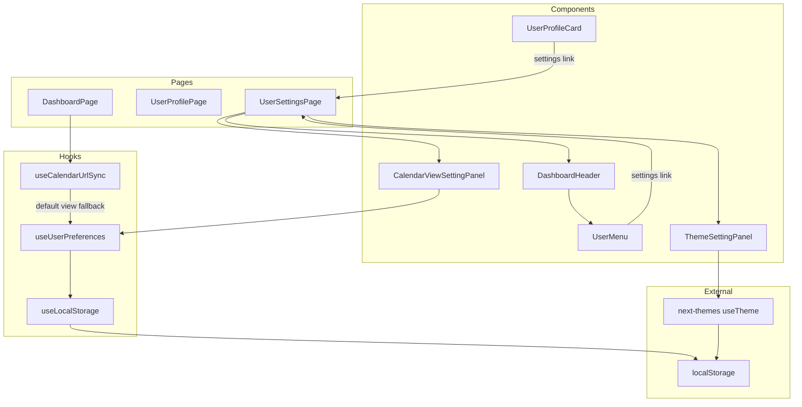
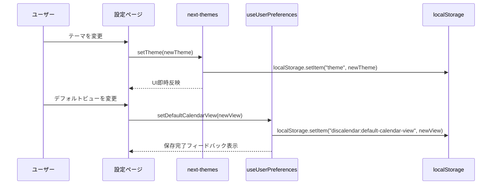
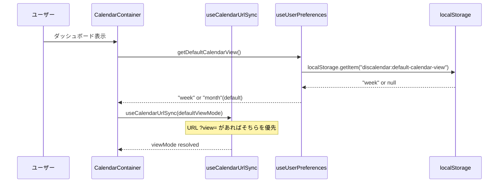

# Technical Design: ユーザープリファレンス管理ページ

## Overview

本機能は、認証済みユーザーに専用の設定ページ (`/dashboard/user/settings`) を提供し、テーマ切替（ライト/ダーク/システム）とカレンダーデフォルトビュー（月/週/日）を一箇所で管理可能にする。現在テーマは `DashboardHeader` の `ThemeSwitcher` でのみ変更でき、カレンダーデフォルトビューの明示的な設定機能は存在しない。

**Users**: Discalendar にログイン済みのユーザーが、表示プリファレンスを管理する際に使用する。

**Impact**: 既存の `DashboardHeader` にユーザーメニュー（DropdownMenu）を導入し、`useCalendarUrlSync` フックにデフォルトビュー注入機能を追加する。

### Goals
- `/dashboard/user/settings` ルートで認証済みユーザーがテーマとカレンダーデフォルトビューを管理できる
- 設定変更が即座にUI全体に反映される
- 設定がブラウザセッションをまたいで永続化される
- 既存の `ThemeSwitcher` と設定ページのテーマ状態が同期する

### Non-Goals
- デバイス間の設定同期（DB 永続化は将来的な通知プリファレンス追加時に検討）
- 通知プリファレンスの実装（将来スコープ）
- ユーザープロフィール編集機能（既存の `/dashboard/user` で対応）
- サイドバー展開状態の設定ページ管理（既存 localStorage で直接管理済み）

## Architecture

### Existing Architecture Analysis

現在のダッシュボードは以下のパターンで構成されている。

- **認証**: Supabase Auth + Cookie-based SSR。Server Component で `getUser()` 後にデータ取得
- **テーマ管理**: `next-themes` の `ThemeProvider`（ルートレイアウト）+ `ThemeSwitcher` コンポーネント。localStorage キー `theme` で自動永続化
- **カレンダービュー**: `useCalendarUrlSync` が URL パラメータ `?view=` からビューモードを取得。未指定時は `"month"` にハードコードでフォールバック
- **ローカルストレージ**: `useLocalStorage` フックが `discalendar:sidebar-collapsed` で使用済み。SSR セーフな `useSyncExternalStore` ベース
- **設定ページパターン**: `SettingsSection`（Card ベースのセクションラッパー）がギルド設定で使用済み

### Architecture Pattern & Boundary Map



**Architecture Integration**:
- Selected pattern: 既存の Client Component + localStorage パターンを踏襲
- Domain boundaries: 設定コンポーネントは `components/settings/` に配置。フックは `hooks/` 直下
- Existing patterns preserved: Server Component ページ + Client Component 表示分離、`useLocalStorage` によるSSRセーフな永続化
- New components rationale: `useUserPreferences` は設定値の一元管理と型安全なアクセスを提供。設定パネルコンポーネントは再利用可能なセクション単位で構成
- Steering compliance: TypeScript strict、`any` 禁止、Co-located テスト/ストーリー

### Technology Stack

| Layer | Choice / Version | Role in Feature | Notes |
|-------|------------------|-----------------|-------|
| Frontend | Next.js 16 + React 19 | 設定ページルーティング、Server Component 認証 | 既存スタック |
| UI | shadcn/ui (Card, DropdownMenu, Label) | 設定セクションUI、ユーザーメニュー | 既存コンポーネント活用 |
| テーマ | next-themes | テーマ状態管理・永続化 | 既存インフラ、追加設定不要 |
| 永続化 | localStorage + useLocalStorage | カレンダーデフォルトビュー永続化 | 既存フック活用 |

## System Flows

### 設定変更フロー



### カレンダー初期表示フロー



## Requirements Traceability

| Requirement | Summary | Components | Interfaces | Flows |
|-------------|---------|------------|------------|-------|
| 1.1 | 設定ページの認証アクセス | UserSettingsPage | - | 認証リダイレクト |
| 1.2 | 未認証リダイレクト | UserSettingsPage | - | 認証リダイレクト |
| 1.3 | DashboardHeader 表示 | UserSettingsPage, DashboardHeader | - | - |
| 1.4 | ダッシュボードへ戻るリンク | UserSettingsPage | - | - |
| 1.5 | セクション分けレイアウト | UserSettingsPage, SettingsSection | - | - |
| 2.1 | テーマ選択UI表示 | ThemeSettingPanel | - | 設定変更フロー |
| 2.2 | 3つのテーマ選択肢 | ThemeSettingPanel | - | - |
| 2.3 | テーマ即時反映 | ThemeSettingPanel | useTheme | 設定変更フロー |
| 2.4 | 現在テーマの視覚表示 | ThemeSettingPanel | - | - |
| 2.5 | ThemeSwitcher との状態共有 | ThemeSettingPanel | useTheme | 設定変更フロー |
| 3.1 | カレンダーデフォルトビューUI | CalendarViewSettingPanel | - | 設定変更フロー |
| 3.2 | 3つのビュー選択肢 | CalendarViewSettingPanel | - | - |
| 3.3 | ビュー設定永続化 | CalendarViewSettingPanel | useUserPreferences | 設定変更フロー |
| 3.4 | カレンダー初期表示反映 | CalendarContainer | useCalendarUrlSync, useUserPreferences | カレンダー初期表示フロー |
| 3.5 | デフォルト月ビューフォールバック | useCalendarUrlSync | useUserPreferences | カレンダー初期表示フロー |
| 4.1 | UserProfileCard に導線 | UserProfileCard | - | - |
| 4.2 | DashboardHeader に導線 | UserMenu | - | - |
| 4.3 | 設定ページへの遷移 | UserMenu, UserProfileCard | - | - |
| 5.1 | 設定の永続ストレージ保存 | useUserPreferences | useLocalStorage | 設定変更フロー |
| 5.2 | 再アクセス時の設定復元 | useUserPreferences | useLocalStorage | カレンダー初期表示フロー |
| 5.3 | テーマ・ビュー両方の永続化 | useUserPreferences, next-themes | - | - |
| 5.4 | 保存失敗時のエラー通知 | CalendarViewSettingPanel | useUserPreferences | - |
| 5.5 | フォールバック値 | useUserPreferences, useCalendarUrlSync | - | - |
| 6.1 | 保存成功フィードバック | CalendarViewSettingPanel | - | 設定変更フロー |
| 6.2 | ローディング状態表示 | CalendarViewSettingPanel | - | - |
| 6.3 | 3秒以内のフィードバック | CalendarViewSettingPanel | - | - |

## Components and Interfaces

| Component | Domain/Layer | Intent | Req Coverage | Key Dependencies (P0/P1) | Contracts |
|-----------|--------------|--------|--------------|--------------------------|-----------|
| UserSettingsPage | Page | 設定ページのServer Component。認証・レイアウト | 1.1-1.5 | DashboardHeader (P0) | - |
| UserSettingsPageLayout | Page/UI | 設定ページのテスタブルな表示層 | 1.3-1.5 | ThemeSettingPanel (P0), CalendarViewSettingPanel (P0) | - |
| ThemeSettingPanel | UI/Settings | テーマ選択パネル | 2.1-2.5 | next-themes (P0) | State |
| CalendarViewSettingPanel | UI/Settings | カレンダーデフォルトビュー選択パネル | 3.1-3.3, 6.1-6.3 | useUserPreferences (P0) | State |
| UserMenu | UI/Dashboard | ユーザーアバターのドロップダウンメニュー | 4.2, 4.3 | DashboardHeader (P0) | - |
| useUserPreferences | Hook | ユーザー設定の読み書きを一元管理 | 3.3, 3.4, 5.1-5.5 | useLocalStorage (P0) | Service |
| UserProfileCard (変更) | UI/User | 設定ページへのリンク追加 | 4.1, 4.3 | - | - |
| DashboardHeader (変更) | UI/Dashboard | UserMenu 統合 | 4.2 | UserMenu (P0) | - |
| useCalendarUrlSync (変更) | Hook/Calendar | デフォルトビュー注入オプション追加 | 3.4, 3.5 | useUserPreferences (P1) | Service |

### Pages

#### UserSettingsPage

| Field | Detail |
|-------|--------|
| Intent | 認証チェックとデータ取得を行い、設定ページレイアウトをレンダリングする Server Component |
| Requirements | 1.1, 1.2, 1.3, 1.4, 1.5 |

**Responsibilities & Constraints**
- Supabase Auth で認証チェック。未認証時は `/auth/login` にリダイレクト
- `buildDashboardUser()` でユーザー情報を整形し、レイアウトコンポーネントに渡す
- 既存の `UserProfilePage` と同一の認証パターンを踏襲

**Dependencies**
- Outbound: DashboardHeader -- ヘッダー表示 (P0)
- Outbound: UserSettingsPageLayout -- テスタブルな表示層 (P0)
- External: Supabase Auth -- 認証チェック (P0)

**Implementation Notes**
- ファイルパス: `app/dashboard/user/settings/page.tsx`
- `export const dynamic = "force-dynamic"` で動的レンダリング
- 既存の `app/dashboard/user/page.tsx` のデータ取得パターンを踏襲（ギルドデータは不要）

#### UserSettingsPageLayout

| Field | Detail |
|-------|--------|
| Intent | 設定ページの表示レイアウト。テスト容易性のための純粋な表示コンポーネント |
| Requirements | 1.3, 1.4, 1.5 |

**Responsibilities & Constraints**
- DashboardHeader、戻るリンク、設定セクションを配置する表示層
- Client Component（子コンポーネントがクライアント専用のため）

**Dependencies**
- Inbound: UserSettingsPage -- props 経由 (P0)
- Outbound: ThemeSettingPanel -- テーマ設定UI (P0)
- Outbound: CalendarViewSettingPanel -- ビュー設定UI (P0)

**Implementation Notes**
- 既存 `UserProfilePageLayout` のレイアウトパターンを踏襲（ArrowLeft + 戻るリンク + セクション群）
- `"use client"` ディレクティブ必須

### Settings Components

#### ThemeSettingPanel

| Field | Detail |
|-------|--------|
| Intent | テーマ（ライト/ダーク/システム）を選択するパネル。next-themes と直接統合 |
| Requirements | 2.1, 2.2, 2.3, 2.4, 2.5 |

**Responsibilities & Constraints**
- `useTheme()` から現在のテーマを取得し、3つの選択肢を表示
- テーマ変更時に `setTheme()` を呼び出し、即座に UI 全体に反映
- 現在選択中のテーマを視覚的にハイライト
- ハイドレーションミスマッチ回避のため `mounted` 状態を管理

**Dependencies**
- External: next-themes `useTheme()` -- テーマ状態の読み書き (P0)

**Contracts**: State [x]

##### State Management
- State model: `next-themes` の内部状態（`theme`, `setTheme`）を直接使用
- Persistence: `next-themes` が localStorage キー `theme` で自動管理
- Concurrency: 単一ブラウザタブ内で完結。`ThemeSwitcher` と同一の `useTheme()` コンテキストを共有

```typescript
type ThemeOption = "light" | "dark" | "system";

type ThemeSettingPanelProps = Record<string, never>;
```

**Implementation Notes**
- ファイルパス: `components/settings/theme-setting-panel.tsx`
- ラジオボタングループまたはカードグリッドで3つのテーマオプションを表示
- 各オプションにアイコン（Sun, Moon, Monitor）とラベルを配置
- `data-active` 属性で選択状態を視覚表現（既存 `ThemeSwitcher` パターン踏襲）
- `mounted` チェックで SSR フォールバック表示

#### CalendarViewSettingPanel

| Field | Detail |
|-------|--------|
| Intent | カレンダーデフォルトビュー（月/週/日）を選択・永続化するパネル |
| Requirements | 3.1, 3.2, 3.3, 6.1, 6.2, 6.3 |

**Responsibilities & Constraints**
- `useUserPreferences` からデフォルトビュー値を取得し、3つの選択肢を表示
- 選択変更時に `setDefaultCalendarView()` で永続化
- 保存成功時にフィードバックを表示（チェックアイコン + 「保存しました」テキスト）
- 保存失敗時にエラーメッセージを表示

**Dependencies**
- Outbound: useUserPreferences -- デフォルトビュー読み書き (P0)

**Contracts**: State [x]

##### State Management
- State model: `useUserPreferences` 経由で localStorage に永続化
- UI state: `isSaving` (boolean), `saveStatus` ("idle" | "success" | "error")

```typescript
type CalendarViewOption = "month" | "week" | "day";

type CalendarViewSettingPanelProps = Record<string, never>;
```

**Implementation Notes**
- ファイルパス: `components/settings/calendar-view-setting-panel.tsx`
- ラジオボタングループで3つのビューオプションを表示
- 保存フィードバックは `setTimeout` で3秒後に自動消去（6.3）
- localStorage は同期的書き込みのため実質ローディング不要だが、UX 一貫性のためフィードバックを表示

### Dashboard Components

#### UserMenu

| Field | Detail |
|-------|--------|
| Intent | DashboardHeader 内のユーザーアバタードロップダウンメニュー |
| Requirements | 4.2, 4.3 |

**Responsibilities & Constraints**
- ユーザーアバターをトリガーとするドロップダウンメニューを提供
- メニューアイテム: プロフィール (`/dashboard/user`)、設定 (`/dashboard/user/settings`)、ログアウト
- `DashboardHeader` から `user` props を受け取る

**Dependencies**
- Inbound: DashboardHeader -- user props (P0)
- External: shadcn/ui DropdownMenu (P0)

```typescript
type UserMenuProps = {
  user: DashboardUser;
};
```

**Implementation Notes**
- ファイルパス: `components/dashboard/user-menu.tsx`
- `"use client"` ディレクティブ必須（DropdownMenu はクライアントコンポーネント）
- 既存の `LogoutButton` のログアウトロジックを DropdownMenuItem として統合
- アバター表示は現在の `DashboardHeader` のアバターレンダリングロジックを移動

#### UserProfileCard (変更)

| Field | Detail |
|-------|--------|
| Intent | 設定ページへのリンクを追加 |
| Requirements | 4.1, 4.3 |

**Implementation Notes**
- `CardContent` 内に設定アイコンリンク（`Settings` アイコン + `/dashboard/user/settings`）を追加
- 既存のプロフィール表示ロジックは変更なし

#### DashboardHeader (変更)

| Field | Detail |
|-------|--------|
| Intent | UserMenu コンポーネントの統合 |
| Requirements | 4.2 |

**Implementation Notes**
- 現在のアバターリンク + `LogoutButton` を `UserMenu` コンポーネントに置き換え
- `ThemeSwitcher` は引き続きヘッダー内に独立して配置（クイックアクセス維持）
- `DashboardHeader` は Server Component のまま維持可能（`UserMenu` を Client Component として分離）

### Hooks

#### useUserPreferences

| Field | Detail |
|-------|--------|
| Intent | ユーザープリファレンス（カレンダーデフォルトビュー）の読み書きを型安全に一元管理するフック |
| Requirements | 3.3, 3.4, 5.1, 5.2, 5.3, 5.4, 5.5 |

**Responsibilities & Constraints**
- localStorage キー `discalendar:default-calendar-view` でカレンダーデフォルトビューを管理
- テーマは `next-themes` が管理するため、本フックのスコープ外（ただし型定義には含める）
- フォールバック値: `"month"`
- 将来の設定項目追加に対応可能な拡張性

**Dependencies**
- Outbound: useLocalStorage -- localStorage 読み書き (P0)

**Contracts**: Service [x]

##### Service Interface

```typescript
type CalendarViewMode = "month" | "week" | "day";

interface UserPreferences {
  defaultCalendarView: CalendarViewMode;
}

interface UseUserPreferencesReturn {
  /** カレンダーデフォルトビュー */
  defaultCalendarView: CalendarViewMode;
  /** カレンダーデフォルトビューを更新 */
  setDefaultCalendarView: (view: CalendarViewMode) => void;
}
```

- Preconditions: クライアントサイドでのみ使用（`"use client"` コンテキスト）
- Postconditions: `setDefaultCalendarView` 呼び出し後、localStorage に値が永続化される
- Invariants: `defaultCalendarView` は常に `"month" | "week" | "day"` のいずれか

**Implementation Notes**
- ファイルパス: `hooks/use-user-preferences.ts`
- `useLocalStorage<CalendarViewMode>("discalendar:default-calendar-view", "month")` を内部で使用
- 将来的にプリファレンス項目が増えた場合、本フックに集約して一元管理する

#### useCalendarUrlSync (変更)

| Field | Detail |
|-------|--------|
| Intent | デフォルトビューモードのオプション引数追加 |
| Requirements | 3.4, 3.5 |

**Contracts**: Service [x]

##### Service Interface (変更箇所)

```typescript
interface UseCalendarUrlSyncOptions {
  /** URL ?view= パラメータ未指定時のフォールバック値（デフォルト: "month"） */
  defaultViewMode?: CalendarViewMode;
}

function useCalendarUrlSync(
  options?: UseCalendarUrlSyncOptions
): UseCalendarUrlSyncReturn;
```

**Implementation Notes**
- `parseUrlParams` のフォールバック値 `"month"` を `options.defaultViewMode ?? "month"` に変更
- 後方互換性あり（引数なしの既存呼び出しは変更不要）
- `CalendarContainer` で `useUserPreferences` の `defaultCalendarView` を取得し、`useCalendarUrlSync({ defaultViewMode })` に渡す

## Error Handling

### Error Strategy
- **テーマ変更失敗**: `next-themes` は localStorage への書き込み失敗を内部的にハンドリングするため、追加のエラー処理は不要
- **カレンダービュー保存失敗**: `useLocalStorage` フックが catch ブロックでローカル state のみ更新するフォールバックを持つ。設定ページ上では保存成功/失敗のフィードバックを表示
- **認証エラー**: 既存パターンどおり `/auth/login` へリダイレクト

### Error Categories and Responses
- **User Errors**: 設定値の不正入力は型制約により防止（選択肢のみ）
- **System Errors**: localStorage 非対応 → ローカル state でのみ動作（セッション中は有効）
- **Business Logic Errors**: 該当なし

## Testing Strategy

### Unit Tests
- `useUserPreferences`: デフォルト値返却、値の更新と永続化、不正値のフォールバック
- `ThemeSettingPanel`: 3つのテーマオプション表示、選択時の `setTheme` 呼び出し、現在テーマのハイライト
- `CalendarViewSettingPanel`: 3つのビューオプション表示、選択時の永続化、保存フィードバック表示
- `UserMenu`: ドロップダウンメニュー開閉、3つのメニューアイテム表示、リンク先確認
- `useCalendarUrlSync` (変更テスト): `defaultViewMode` オプション適用、URL パラメータ優先

### Integration Tests
- `UserSettingsPage`: 認証済みアクセス確認、未認証時リダイレクト
- `DashboardHeader` (変更テスト): UserMenu 統合後の表示確認、導線クリック遷移
- `UserProfileCard` (変更テスト): 設定リンクの表示と遷移確認
- テーマ変更 → `ThemeSwitcher` との同期確認

### E2E Tests
- 設定ページへの遷移（DashboardHeader → 設定ページ）
- テーマ変更の即時反映と永続化（ページリロード後も維持）
- カレンダーデフォルトビュー変更 → ダッシュボード表示時の反映確認
