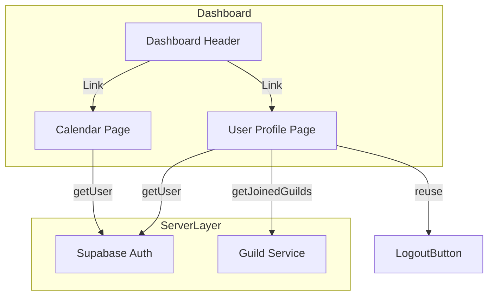
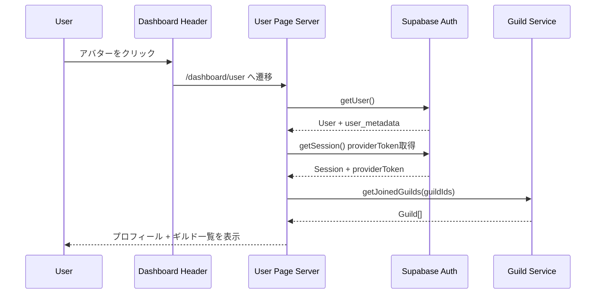

# Design Document: user-profile-page

## Overview

**Purpose**: 認証済みユーザーが自身のプロフィール情報（Discordアバター・表示名・メール）、参加ギルド一覧、ログアウト機能にアクセスできる専用ページを提供する。

**Users**: Discordアカウントでログイン済みのDiscalendarユーザーが、アカウント情報確認とギルド間ナビゲーションに利用する。

**Impact**: ダッシュボードヘッダーのアバターにユーザーページへのリンクを追加し、`/dashboard/user` ルートを新設する。

### Goals
- ユーザーが自身のプロフィール情報を一箇所で確認できる
- 参加ギルドへの素早いナビゲーションを提供する
- 既存のダッシュボードパターンに準拠した一貫性のある実装

### Non-Goals
- ユーザー設定の編集機能（テーマ、通知、タイムゾーン等）
- 専用の`users`テーブルの追加
- DropdownMenuベースのヘッダーナビゲーション（将来検討）

## Architecture

### Existing Architecture Analysis

現行ダッシュボード（`app/dashboard/page.tsx`）は以下のパターンを採用:
- Server Componentでデータフェッチ（Supabase Auth + Guild Service）
- `DashboardUser`型でユーザーメタデータを管理
- ヘッダーにアバター・表示名・LogoutButtonを直接配置
- Middlewareによるルート保護（`/dashboard/*`は自動的に保護対象）

### Architecture Pattern & Boundary Map



**Architecture Integration**:
- **Selected pattern**: Server Component + Client Componentの既存ダッシュボードパターンを踏襲
- **Domain boundaries**: ユーザーページは`app/dashboard/user/`に配置。コンポーネントは`components/user/`に新設
- **Existing patterns preserved**: Supabase Auth取得、Guild Service利用、LogoutButton再利用
- **New components rationale**: プロフィール表示とギルドリスト表示は既存コンポーネントと責務が異なるため新規作成

### Technology Stack

| Layer | Choice / Version | Role in Feature | Notes |
|-------|------------------|-----------------|-------|
| Frontend | Next.js 16 + React 19 | Server Component + Client Component | 既存スタック |
| UI | shadcn/ui (Card, Avatar, Button) | プロフィール・ギルドリストUI | 既存コンポーネント活用 |
| Auth | Supabase Auth | ユーザー情報取得 | `user_metadata`からDiscord情報取得 |
| Data | Supabase (PostgreSQL) | ギルドデータ取得 | `guilds`テーブルへの既存クエリ |

## System Flows



## Requirements Traceability

| Requirement | Summary | Components | Interfaces | Flows |
|-------------|---------|------------|------------|-------|
| 1.1 | 認証済みユーザーがページを表示 | UserProfilePage | — | メインフロー |
| 1.2 | 未認証時リダイレクト | Middleware (既存) | — | — |
| 1.3 | ヘッダーからのナビゲーション | DashboardHeader (変更) | — | アバタークリック |
| 2.1 | アバター表示 | UserProfileCard | UserProfileCardProps | — |
| 2.2 | 表示名表示 | UserProfileCard | UserProfileCardProps | — |
| 2.3 | メールアドレス表示 | UserProfileCard | UserProfileCardProps | — |
| 2.4 | アバターフォールバック | UserProfileCard | UserProfileCardProps | — |
| 3.1 | ギルドリスト表示 | UserGuildList | UserGuildListProps | — |
| 3.2 | ギルド選択でダッシュボード遷移 | UserGuildList | UserGuildListProps | ギルド選択フロー |
| 3.3 | ギルド0件メッセージ | UserGuildList | UserGuildListProps | — |
| 4.1 | ログアウトボタン表示 | LogoutButton (既存) | LogoutButtonProps | — |
| 4.2 | ログアウト実行 | LogoutButton (既存) | — | ログアウトフロー |
| 4.3 | ローディング状態 | LogoutButton (既存) | — | — |
| 5.1 | モバイルレイアウト | UserProfilePage | — | — |
| 5.2 | デスクトップレイアウト | UserProfilePage | — | — |
| 5.3 | タッチ操作対応 | 全コンポーネント | — | — |

## Components and Interfaces

| Component | Domain/Layer | Intent | Req Coverage | Key Dependencies | Contracts |
|-----------|--------------|--------|--------------|-----------------|-----------|
| UserProfilePage | Page | ユーザーページのServer Component | 1.1, 5.1, 5.2 | Supabase Auth (P0), Guild Service (P0) | — |
| UserProfileCard | UI | プロフィール情報表示 | 2.1-2.4 | — | State |
| UserGuildList | UI | 参加ギルド一覧表示 | 3.1-3.3 | — | State |
| DashboardHeader (変更) | UI | ヘッダーにナビリンク追加 | 1.3 | — | — |
| LogoutButton (既存) | UI | ログアウト操作 | 4.1-4.3 | Supabase Auth (P0) | — |

### Page Layer

#### UserProfilePage

| Field | Detail |
|-------|--------|
| Intent | Server Componentとしてユーザー情報とギルドデータを取得し、プロフィールページをレンダリングする |
| Requirements | 1.1, 5.1, 5.2 |

**Responsibilities & Constraints**
- Supabase Authからユーザーメタデータを取得
- Guild Serviceから参加ギルド一覧を取得
- レスポンシブレイアウトの提供（モバイル: シングルカラム、デスクトップ: カード配置）
- 認証チェックはMiddlewareに委譲（1.2は既存で充足）

**Dependencies**
- Outbound: Supabase Auth — ユーザー情報取得 (P0)
- Outbound: Guild Service (`getJoinedGuilds`) — ギルド一覧取得 (P0)
- Outbound: UserProfileCard — プロフィール表示 (P0)
- Outbound: UserGuildList — ギルド一覧表示 (P0)
- Outbound: LogoutButton — ログアウト操作 (P1)

**Contracts**: State [x]

##### State Management

```typescript
// Server Componentから子コンポーネントへのデータ受け渡し（props）
type UserProfilePageData = {
  user: DashboardUser;
  guilds: Guild[];
};
```

**Implementation Notes**
- `app/dashboard/user/page.tsx` に配置。`app/dashboard/page.tsx`のデータ取得パターンを踏襲
- ギルド取得にはDiscord APIトークン（`providerToken`）が必要。セッションから取得
- トークン取得失敗時はギルド一覧を空配列で表示（ページ全体は表示継続）

### UI Layer

#### UserProfileCard

| Field | Detail |
|-------|--------|
| Intent | ユーザーのDiscordプロフィール情報（アバター、表示名、メール）をカード形式で表示する |
| Requirements | 2.1, 2.2, 2.3, 2.4 |

**Contracts**: State [x]

##### State Management

```typescript
type UserProfileCardProps = {
  user: DashboardUser;
};
```

**Implementation Notes**
- shadcn/ui `Card` + `Avatar` コンポーネントを活用
- アバター: 80x80px のCircular Image。フォールバックは既存の`getUserInitials`パターン
- 表示名: `fullName` を優先表示、`null`の場合は`email`にフォールバック
- メールアドレス: `text-muted-foreground` でサブテキスト表示
- `components/user/user-profile-card.tsx` に配置

#### UserGuildList

| Field | Detail |
|-------|--------|
| Intent | ユーザーが参加しているギルドをリスト表示し、各ギルドのダッシュボードへのナビゲーションを提供する |
| Requirements | 3.1, 3.2, 3.3 |

**Contracts**: State [x]

##### State Management

```typescript
type UserGuildListProps = {
  guilds: Guild[];
};
```

**Implementation Notes**
- ギルドアイコン（32x32px） + ギルド名のリスト表示
- 各行はNext.js `Link`で`/dashboard?guild={guildId}`に遷移（クエリパラメータでギルド選択状態を伝達）
- 0件時は `components/ui/card` 内に「参加しているギルドがありません」メッセージを表示
- hover時の視覚フィードバック（`bg-accent/50`）を提供
- `components/user/user-guild-list.tsx` に配置

#### DashboardHeader（変更）

| Field | Detail |
|-------|--------|
| Intent | 既存ヘッダーのアバター部分をユーザーページへのリンクに変更する |
| Requirements | 1.3 |

**Implementation Notes**
- `app/dashboard/page.tsx` のヘッダー内アバター部分をNext.js `Link`でラップ
- `href="/dashboard/user"` を設定
- hover時のスタイル追加（`opacity-80`等の視覚フィードバック）
- 変更範囲は最小限（既存のアバター表示ロジックは変更しない）

## Data Models

### Domain Model

本機能では新規データモデルの追加は不要。既存のモデルを使用する:

- **DashboardUser** (`app/dashboard/page.tsx`): Supabase Auth `user_metadata`から構築
- **Guild** (`lib/guilds/types.ts`): `guilds`テーブルのドメインモデル

### Data Contracts & Integration

**ユーザーデータ取得**:
```typescript
// Supabase Auth → DashboardUser 変換（既存パターン）
type DashboardUser = {
  id: string;
  email: string;
  fullName: string | null;
  avatarUrl: string | null;
};
```

**ギルドデータ取得**:
```typescript
// Guild Service → Guild（既存パターン）
type Guild = {
  id: number;
  guildId: string;
  name: string;
  avatarUrl: string | null;
  locale: string;
};
```

## Error Handling

### Error Strategy

既存のダッシュボードパターンに準拠し、段階的なフォールバックを採用する。

### Error Categories and Responses

**User Errors**:
- 未認証アクセス → Middlewareが`/auth/login`にリダイレクト（既存、変更不要）

**System Errors**:
- Supabase Auth取得失敗 → ログインページにリダイレクト
- ギルド取得失敗 → プロフィールは表示しつつ、ギルド一覧セクションにエラーメッセージを表示
- アバター画像読み込み失敗 → イニシャルフォールバック（既存パターン）

## Testing Strategy

### Unit Tests
- `UserProfileCard`: プロフィール情報の正しい表示（アバター、表示名、メール）
- `UserProfileCard`: アバターフォールバック（avatarUrl が null の場合のイニシャル表示）
- `UserGuildList`: ギルドリストの正しいレンダリング（アイコン、名前、リンク）
- `UserGuildList`: ギルド0件時のメッセージ表示
- `UserGuildList`: ギルドクリック時のリンク先URL

### Integration Tests
- `UserProfilePage`: Server Componentでのデータフェッチとコンポーネントへのprops受け渡し
- ヘッダーアバタークリック → `/dashboard/user`への遷移

### Storybook Stories
- `UserProfileCard`: Default（全データあり）、NoAvatar（フォールバック）、NoFullName（メールフォールバック）
- `UserGuildList`: WithGuilds（複数ギルド）、EmptyGuilds（0件）、SingleGuild（1件）
